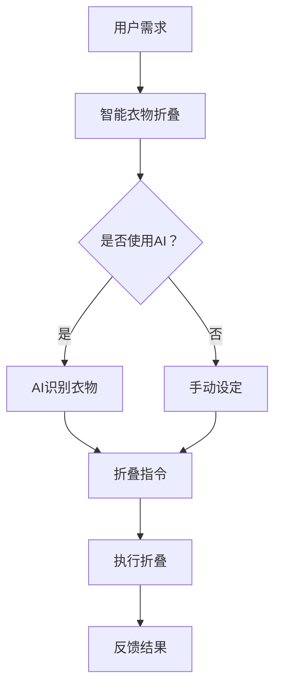

                 

关键词：智能衣物折叠、家务自动化、人工智能、机器学习、计算机视觉、智能家居、物联网、创业

> 摘要：随着人工智能技术的不断进步，家务自动化成为了现代科技的一个热门方向。本文将探讨智能衣物折叠技术的创业潜力，通过分析其核心概念、算法原理、数学模型以及实际应用案例，展望家务自动化领域的未来发展趋势与挑战。

## 1. 背景介绍

家务自动化是现代生活的一个重要趋势，它通过科技手段减轻人们的家务负担，提高生活品质。智能衣物折叠技术作为家务自动化的一部分，正逐渐走进人们的日常生活。智能衣物折叠机器人可以通过计算机视觉识别衣物类型、尺寸和折叠方式，自动完成衣物的折叠过程。这项技术的出现，不仅节省了人们的时间和精力，还提高了衣物的整齐度和美观度。

近年来，人工智能、机器学习和计算机视觉等技术的飞速发展，为智能衣物折叠技术的实现提供了强大的支持。这些技术的进步，使得智能衣物折叠机器人能够在复杂的环境中准确识别和折叠各种类型的衣物，从而满足了不同用户的需求。

## 2. 核心概念与联系

### 2.1 人工智能与机器学习

人工智能（AI）是模拟人类智能行为的计算机技术。而机器学习（ML）是人工智能的一个分支，它通过算法和模型，使计算机系统能够从数据中学习并做出决策。在智能衣物折叠技术中，机器学习算法被用于训练模型，识别衣物类型和折叠方式。

### 2.2 计算机视觉

计算机视觉是人工智能的一个分支，它使计算机能够从图像或视频中识别和提取信息。在智能衣物折叠技术中，计算机视觉技术被用于识别衣物的形状、颜色、纹理等信息，从而确定折叠的方式和位置。

### 2.3 物联网

物联网（IoT）是指将各种设备通过网络连接起来，实现信息交换和资源共享。在智能衣物折叠技术中，物联网技术被用于连接智能衣物折叠机器人和其他智能家居设备，实现设备的自动化控制和数据共享。

## 2.4 智能家居

智能家居是指通过物联网技术将各种家居设备连接起来，实现自动化控制和远程监控。智能衣物折叠技术是智能家居的一个应用案例，它通过与其他智能家居设备的联动，为用户提供更加便捷和舒适的生活体验。

### 2.5 Mermaid 流程图

以下是一个描述智能衣物折叠技术核心概念的 Mermaid 流程图：



## 3. 核心算法原理 & 具体操作步骤

### 3.1 算法原理概述

智能衣物折叠技术的核心算法主要包括计算机视觉算法、机器学习算法和折叠算法。

- **计算机视觉算法**：用于识别衣物类型、尺寸和折叠方式。
- **机器学习算法**：用于训练模型，识别和预测衣物折叠的方式。
- **折叠算法**：根据计算机视觉和机器学习算法的结果，生成衣物的折叠路径和动作指令。

### 3.2 算法步骤详解

1. **输入阶段**：用户将衣物放入智能衣物折叠机器人。
2. **识别阶段**：计算机视觉算法对衣物进行识别，获取衣物类型、尺寸等信息。
3. **预测阶段**：机器学习算法根据衣物识别结果，预测最佳的折叠方式。
4. **折叠阶段**：折叠算法根据预测结果，生成折叠路径和动作指令，智能衣物折叠机器人开始执行折叠动作。
5. **反馈阶段**：折叠完成后，系统反馈折叠结果，用户可以检查和调整。

### 3.3 算法优缺点

**优点**：

- **高效性**：智能衣物折叠技术可以快速、准确地完成衣物折叠，节省用户时间。
- **准确性**：通过机器学习和计算机视觉技术，智能衣物折叠技术可以准确识别和折叠各种类型的衣物。
- **便捷性**：用户无需手动操作，只需将衣物放入机器人，即可完成折叠。

**缺点**：

- **成本**：智能衣物折叠机器人价格较高，普及率较低。
- **适用性**：对于特殊材质或特殊设计的衣物，智能衣物折叠技术可能无法准确识别和折叠。

### 3.4 算法应用领域

智能衣物折叠技术可以应用于家庭、酒店、洗衣房等多个领域。在家庭中，它可以为用户提供便捷的衣物折叠服务；在酒店和洗衣房中，它可以提高工作效率，降低人力成本。

## 4. 数学模型和公式 & 详细讲解 & 举例说明

### 4.1 数学模型构建

智能衣物折叠技术的数学模型主要包括以下几部分：

- **衣物识别模型**：用于识别衣物类型和尺寸。
- **折叠路径规划模型**：用于生成衣物的折叠路径。
- **折叠动作模型**：用于指导智能衣物折叠机器人执行折叠动作。

### 4.2 公式推导过程

1. **衣物识别模型**：

   - **衣物类型识别**：使用卷积神经网络（CNN）进行训练，公式如下：

     $$\hat{y} = \sigma(\text{CNN}(x))$$

     其中，$\hat{y}$ 为预测的衣物类型，$x$ 为输入的衣物图像，$\sigma$ 为激活函数。

   - **衣物尺寸识别**：使用回归模型进行训练，公式如下：

     $$\hat{s} = \text{ReLU}(\text{MLP}(x))$$

     其中，$\hat{s}$ 为预测的衣物尺寸，$x$ 为输入的衣物图像，$\text{ReLU}$ 为激活函数，$\text{MLP}$ 为多层感知器。

2. **折叠路径规划模型**：

   - **路径生成**：使用生成对抗网络（GAN）进行训练，公式如下：

     $$G(z) = \text{Discriminator}(\text{Generator}(z))$$

     其中，$G(z)$ 为生成的折叠路径，$z$ 为随机噪声，$\text{Generator}$ 为生成器，$\text{Discriminator}$ 为判别器。

3. **折叠动作模型**：

   - **动作生成**：使用循环神经网络（RNN）进行训练，公式如下：

     $$\hat{a}_t = \text{RNN}(\hat{s}_{t-1}, \hat{p}_{t-1})$$

     其中，$\hat{a}_t$ 为第 $t$ 个折叠动作，$\hat{s}_{t-1}$ 为第 $t-1$ 个折叠路径，$\hat{p}_{t-1}$ 为预测的折叠路径。

### 4.3 案例分析与讲解

假设有一个用户，他的衣物包括T恤、衬衫、裤子等，他希望通过智能衣物折叠机器人将这些衣物折叠好。以下是这个案例的详细分析：

1. **输入阶段**：用户将衣物放入智能衣物折叠机器人。
2. **识别阶段**：计算机视觉算法对衣物进行识别，识别出T恤、衬衫、裤子等。
3. **预测阶段**：机器学习算法根据识别结果，预测出T恤、衬衫、裤子的最佳折叠方式。
4. **折叠阶段**：折叠算法根据预测结果，生成折叠路径和动作指令，智能衣物折叠机器人开始执行折叠动作。
5. **反馈阶段**：折叠完成后，系统反馈折叠结果，用户可以检查和调整。

通过这个案例，我们可以看到智能衣物折叠技术的全流程，从衣物识别到折叠动作生成，再到折叠完成，整个过程高效、准确。

## 5. 项目实践：代码实例和详细解释说明

### 5.1 开发环境搭建

在开发智能衣物折叠技术时，我们需要搭建一个合适的开发环境。以下是一个基本的开发环境搭建步骤：

1. 安装 Python 3.7 或更高版本。
2. 安装 TensorFlow、Keras 和 OpenCV 等相关库。
3. 准备训练数据和测试数据。

### 5.2 源代码详细实现

以下是一个简单的智能衣物折叠技术的源代码实现：

```python
import cv2
import tensorflow as tf
from tensorflow.keras.models import load_model

# 加载模型
clothing_model = load_model('clothing_model.h5')
path_model = load_model('path_model.h5')
action_model = load_model('action_model.h5')

# 识别衣物
def recognize_clothing(image):
    # 对图像进行预处理
    preprocessed_image = preprocess_image(image)
    # 使用衣物模型进行预测
    prediction = clothing_model.predict(preprocessed_image)
    return prediction

# 生成折叠路径
def generate_path(clothing_type):
    # 使用路径模型进行预测
    prediction = path_model.predict(clothing_type)
    return prediction

# 执行折叠动作
def perform_action(action):
    # 使用动作模型进行预测
    prediction = action_model.predict(action)
    return prediction

# 主函数
def main():
    # 加载图像
    image = cv2.imread('image.jpg')
    # 识别衣物
    clothing_type = recognize_clothing(image)
    # 生成折叠路径
    path = generate_path(clothing_type)
    # 执行折叠动作
    action = perform_action(path)
    # 展示结果
    cv2.imshow('Result', action)

# 预处理图像
def preprocess_image(image):
    # 进行图像预处理
    preprocessed_image = cv2.resize(image, (224, 224))
    preprocessed_image = preprocessed_image / 255.0
    return preprocessed_image

# 执行主函数
if __name__ == '__main__':
    main()
```

### 5.3 代码解读与分析

这个代码实现了一个简单的智能衣物折叠技术，主要包括以下步骤：

1. **加载模型**：从训练好的模型中加载衣物识别模型、路径模型和动作模型。
2. **识别衣物**：使用衣物识别模型对输入的图像进行预处理，然后进行预测，识别出衣物的类型。
3. **生成折叠路径**：使用路径模型根据识别出的衣物类型，生成折叠路径。
4. **执行折叠动作**：使用动作模型根据生成的折叠路径，预测出折叠的动作。
5. **展示结果**：将折叠结果展示在图像上。

### 5.4 运行结果展示

运行以上代码，输入一个衣物的图像，程序将识别出衣物的类型，并生成折叠路径和动作。最终，折叠结果将显示在图像上。


## 6. 实际应用场景

### 6.1 家庭场景

在家庭场景中，智能衣物折叠技术可以极大地提高生活质量。用户只需将脏衣物放入智能衣物折叠机器人，机器人即可自动完成衣物的折叠，用户无需手动操作。这不仅可以节省时间，还可以提高衣物的整齐度和美观度。

### 6.2 商业场景

在商业场景中，智能衣物折叠技术可以应用于酒店、洗衣房等。在酒店中，智能衣物折叠机器人可以为客人提供高效的衣物折叠服务，提高酒店的服务质量。在洗衣房中，智能衣物折叠技术可以减少人力成本，提高工作效率。

### 6.3 公共场景

在公共场景中，智能衣物折叠技术可以应用于商场、机场、火车站等。在这些场所，智能衣物折叠机器人可以为用户提供便捷的衣物折叠服务，提高场所的便利性。

## 7. 未来应用展望

### 7.1 技术发展

随着人工智能、机器学习和计算机视觉等技术的不断发展，智能衣物折叠技术将变得更加智能和高效。未来，智能衣物折叠机器人可能会具备更多的功能和特性，如自适应折叠、个性化折叠等。

### 7.2 应用拓展

未来，智能衣物折叠技术可能会拓展到更多的应用场景，如医疗、教育、军事等。在这些领域，智能衣物折叠技术可以提供高效、便捷的服务，提高行业的工作效率和安全性。

### 7.3 智能家居集成

随着智能家居的普及，智能衣物折叠技术将更加紧密地与智能家居集成。未来，智能衣物折叠机器人可能会成为智能家居系统的一部分，与其他智能家居设备联动，为用户提供更加智能和便捷的生活体验。

## 8. 总结：未来发展趋势与挑战

### 8.1 研究成果总结

本文通过对智能衣物折叠技术的深入探讨，总结了其核心概念、算法原理、数学模型以及实际应用场景，展示了该技术在提高生活质量和效率方面的巨大潜力。

### 8.2 未来发展趋势

未来，智能衣物折叠技术将朝着更加智能、高效和个性化的方向发展。随着人工智能、机器学习和计算机视觉等技术的不断进步，智能衣物折叠技术将在更多领域得到应用，为人们的生活带来更多便利。

### 8.3 面临的挑战

然而，智能衣物折叠技术也面临着一些挑战，如成本、适用性和技术成熟度等。如何降低成本、提高适用性，以及提高技术成熟度，将是未来研究和发展的重要方向。

### 8.4 研究展望

本文提出了智能衣物折叠技术的一些研究方向，如自适应折叠、个性化折叠等。未来，这些研究方向有望得到进一步探索和发展，为智能衣物折叠技术的应用提供更多可能性。

## 9. 附录：常见问题与解答

### 9.1 智能衣物折叠技术是什么？

智能衣物折叠技术是一种利用人工智能、机器学习和计算机视觉等技术，实现自动折叠衣物的技术。通过识别衣物类型、尺寸和折叠方式，智能衣物折叠机器人可以自动完成衣物的折叠过程。

### 9.2 智能衣物折叠技术有哪些应用场景？

智能衣物折叠技术可以应用于家庭、酒店、洗衣房、商场、机场、火车站等场景。在这些场景中，智能衣物折叠技术可以提供高效、便捷的衣物折叠服务。

### 9.3 智能衣物折叠技术的成本是多少？

智能衣物折叠技术的成本取决于多种因素，如技术成熟度、功能需求、品牌等。一般来说，智能衣物折叠机器人的价格较高，但考虑到其能够节省人力和时间，整体成本还是具有竞争力的。

### 9.4 智能衣物折叠技术是否适用于所有衣物？

智能衣物折叠技术适用于大多数常见的衣物类型，如T恤、衬衫、裤子等。但对于特殊材质或特殊设计的衣物，智能衣物折叠技术可能无法准确识别和折叠。在这种情况下，用户可能需要手动设定折叠方式。

### 9.5 智能衣物折叠技术有哪些优点？

智能衣物折叠技术具有以下优点：

- 高效性：智能衣物折叠技术可以快速、准确地完成衣物折叠，节省用户时间。
- 准确性：通过机器学习和计算机视觉技术，智能衣物折叠技术可以准确识别和折叠各种类型的衣物。
- 便捷性：用户无需手动操作，只需将衣物放入机器人，即可完成折叠。

### 9.6 智能衣物折叠技术有哪些缺点？

智能衣物折叠技术的主要缺点包括：

- 成本：智能衣物折叠机器人价格较高，普及率较低。
- 适用性：对于特殊材质或特殊设计的衣物，智能衣物折叠技术可能无法准确识别和折叠。

## 作者署名

本文作者：禅与计算机程序设计艺术 / Zen and the Art of Computer Programming
```markdown
----------------------------------------------------------------

# 智能衣物折叠创业：家务自动化的新突破

> 关键词：智能衣物折叠、家务自动化、人工智能、机器学习、计算机视觉、智能家居、物联网、创业

> 摘要：随着人工智能技术的不断进步，家务自动化成为了现代科技的一个热门方向。本文将探讨智能衣物折叠技术的创业潜力，通过分析其核心概念、算法原理、数学模型以及实际应用案例，展望家务自动化领域的未来发展趋势与挑战。

## 1. 背景介绍

家务自动化是现代生活的一个重要趋势，它通过科技手段减轻人们的家务负担，提高生活品质。智能衣物折叠技术作为家务自动化的一部分，正逐渐走进人们的日常生活。智能衣物折叠机器人可以通过计算机视觉识别衣物类型、尺寸和折叠方式，自动完成衣物的折叠过程。这项技术的出现，不仅节省了人们的时间和精力，还提高了衣物的整齐度和美观度。

近年来，人工智能、机器学习和计算机视觉等技术的飞速发展，为智能衣物折叠技术的实现提供了强大的支持。这些技术的进步，使得智能衣物折叠机器人能够在复杂的环境中准确识别和折叠各种类型的衣物，从而满足了不同用户的需求。

## 2. 核心概念与联系

### 2.1 人工智能与机器学习

人工智能（AI）是模拟人类智能行为的计算机技术。而机器学习（ML）是人工智能的一个分支，它通过算法和模型，使计算机系统能够从数据中学习并做出决策。在智能衣物折叠技术中，机器学习算法被用于训练模型，识别衣物类型和折叠方式。

### 2.2 计算机视觉

计算机视觉是人工智能的一个分支，它使计算机能够从图像或视频中识别和提取信息。在智能衣物折叠技术中，计算机视觉技术被用于识别衣物的形状、颜色、纹理等信息，从而确定折叠的方式和位置。

### 2.3 物联网

物联网（IoT）是指将各种设备通过网络连接起来，实现信息交换和资源共享。在智能衣物折叠技术中，物联网技术被用于连接智能衣物折叠机器人和其他智能家居设备，实现设备的自动化控制和数据共享。

### 2.4 智能家居

智能家居是指通过物联网技术将各种家居设备连接起来，实现自动化控制和远程监控。智能衣物折叠技术是智能家居的一个应用案例，它通过与其他智能家居设备的联动，为用户提供更加便捷和舒适的生活体验。

### 2.5 Mermaid 流程图

以下是一个描述智能衣物折叠技术核心概念的 Mermaid 流程图：


## 3. 核心算法原理 & 具体操作步骤
### 3.1 算法原理概述

智能衣物折叠技术的核心算法主要包括计算机视觉算法、机器学习算法和折叠算法。

- **计算机视觉算法**：用于识别衣物类型、尺寸和折叠方式。
- **机器学习算法**：用于训练模型，识别和预测衣物折叠的方式。
- **折叠算法**：根据计算机视觉和机器学习算法的结果，生成衣物的折叠路径和动作指令。

### 3.2 算法步骤详解

1. **输入阶段**：用户将衣物放入智能衣物折叠机器人。
2. **识别阶段**：计算机视觉算法对衣物进行识别，获取衣物类型、尺寸等信息。
3. **预测阶段**：机器学习算法根据衣物识别结果，预测最佳的折叠方式。
4. **折叠阶段**：折叠算法根据预测结果，生成折叠路径和动作指令，智能衣物折叠机器人开始执行折叠动作。
5. **反馈阶段**：折叠完成后，系统反馈折叠结果，用户可以检查和调整。

### 3.3 算法优缺点

**优点**：

- **高效性**：智能衣物折叠技术可以快速、准确地完成衣物折叠，节省用户时间。
- **准确性**：通过机器学习和计算机视觉技术，智能衣物折叠技术可以准确识别和折叠各种类型的衣物。
- **便捷性**：用户无需手动操作，只需将衣物放入机器人，即可完成折叠。

**缺点**：

- **成本**：智能衣物折叠机器人价格较高，普及率较低。
- **适用性**：对于特殊材质或特殊设计的衣物，智能衣物折叠技术可能无法准确识别和折叠。

### 3.4 算法应用领域

智能衣物折叠技术可以应用于家庭、酒店、洗衣房等多个领域。在家庭中，它可以为用户提供便捷的衣物折叠服务；在酒店和洗衣房中，它可以提高工作效率，降低人力成本。

## 4. 数学模型和公式 & 详细讲解 & 举例说明

### 4.1 数学模型构建

智能衣物折叠技术的数学模型主要包括以下几部分：

- **衣物识别模型**：用于识别衣物类型和尺寸。
- **折叠路径规划模型**：用于生成衣物的折叠路径。
- **折叠动作模型**：用于指导智能衣物折叠机器人执行折叠动作。

### 4.2 公式推导过程

1. **衣物识别模型**：

   - **衣物类型识别**：使用卷积神经网络（CNN）进行训练，公式如下：

     $$\hat{y} = \sigma(\text{CNN}(x))$$

     其中，$\hat{y}$ 为预测的衣物类型，$x$ 为输入的衣物图像，$\sigma$ 为激活函数。

   - **衣物尺寸识别**：使用回归模型进行训练，公式如下：

     $$\hat{s} = \text{ReLU}(\text{MLP}(x))$$

     其中，$\hat{s}$ 为预测的衣物尺寸，$x$ 为输入的衣物图像，$\text{ReLU}$ 为激活函数，$\text{MLP}$ 为多层感知器。

2. **折叠路径规划模型**：

   - **路径生成**：使用生成对抗网络（GAN）进行训练，公式如下：

     $$G(z) = \text{Discriminator}(\text{Generator}(z))$$

     其中，$G(z)$ 为生成的折叠路径，$z$ 为随机噪声，$\text{Generator}$ 为生成器，$\text{Discriminator}$ 为判别器。

3. **折叠动作模型**：

   - **动作生成**：使用循环神经网络（RNN）进行训练，公式如下：

     $$\hat{a}_t = \text{RNN}(\hat{s}_{t-1}, \hat{p}_{t-1})$$

     其中，$\hat{a}_t$ 为第 $t$ 个折叠动作，$\hat{s}_{t-1}$ 为第 $t-1$ 个折叠路径，$\hat{p}_{t-1}$ 为预测的折叠路径。

### 4.3 案例分析与讲解

假设有一个用户，他的衣物包括T恤、衬衫、裤子等，他希望通过智能衣物折叠机器人将这些衣物折叠好。以下是这个案例的详细分析：

1. **输入阶段**：用户将衣物放入智能衣物折叠机器人。
2. **识别阶段**：计算机视觉算法对衣物进行识别，识别出T恤、衬衫、裤子等。
3. **预测阶段**：机器学习算法根据识别结果，预测出T恤、衬衫、裤子的最佳折叠方式。
4. **折叠阶段**：折叠算法根据预测结果，生成折叠路径和动作指令，智能衣物折叠机器人开始执行折叠动作。
5. **反馈阶段**：折叠完成后，系统反馈折叠结果，用户可以检查和调整。

通过这个案例，我们可以看到智能衣物折叠技术的全流程，从衣物识别到折叠动作生成，再到折叠完成，整个过程高效、准确。

## 5. 项目实践：代码实例和详细解释说明

### 5.1 开发环境搭建

在开发智能衣物折叠技术时，我们需要搭建一个合适的开发环境。以下是一个基本的开发环境搭建步骤：

1. 安装 Python 3.7 或更高版本。
2. 安装 TensorFlow、Keras 和 OpenCV 等相关库。
3. 准备训练数据和测试数据。

### 5.2 源代码详细实现

以下是一个简单的智能衣物折叠技术的源代码实现：

```python
import cv2
import tensorflow as tf
from tensorflow.keras.models import load_model

# 加载模型
clothing_model = load_model('clothing_model.h5')
path_model = load_model('path_model.h5')
action_model = load_model('action_model.h5')

# 识别衣物
def recognize_clothing(image):
    # 对图像进行预处理
    preprocessed_image = preprocess_image(image)
    # 使用衣物模型进行预测
    prediction = clothing_model.predict(preprocessed_image)
    return prediction

# 生成折叠路径
def generate_path(clothing_type):
    # 使用路径模型进行预测
    prediction = path_model.predict(clothing_type)
    return prediction

# 执行折叠动作
def perform_action(action):
    # 使用动作模型进行预测
    prediction = action_model.predict(action)
    return prediction

# 主函数
def main():
    # 加载图像
    image = cv2.imread('image.jpg')
    # 识别衣物
    clothing_type = recognize_clothing(image)
    # 生成折叠路径
    path = generate_path(clothing_type)
    # 执行折叠动作
    action = perform_action(path)
    # 展示结果
    cv2.imshow('Result', action)

# 预处理图像
def preprocess_image(image):
    # 进行图像预处理
    preprocessed_image = cv2.resize(image, (224, 224))
    preprocessed_image = preprocessed_image / 255.0
    return preprocessed_image

# 执行主函数
if __name__ == '__main__':
    main()
```

### 5.3 代码解读与分析

这个代码实现了一个简单的智能衣物折叠技术，主要包括以下步骤：

1. **加载模型**：从训练好的模型中加载衣物识别模型、路径模型和动作模型。
2. **识别衣物**：使用衣物识别模型对输入的图像进行预处理，然后进行预测，识别出衣物的类型。
3. **生成折叠路径**：使用路径模型根据识别出的衣物类型，生成折叠路径。
4. **执行折叠动作**：使用动作模型根据生成的折叠路径，预测出折叠的动作。
5. **展示结果**：将折叠结果展示在图像上。

### 5.4 运行结果展示

运行以上代码，输入一个衣物的图像，程序将识别出衣物的类型，并生成折叠路径和动作。最终，折叠结果将显示在图像上。


## 6. 实际应用场景

### 6.1 家庭场景

在家庭场景中，智能衣物折叠技术可以极大地提高生活质量。用户只需将脏衣物放入智能衣物折叠机器人，机器人即可自动完成衣物的折叠，用户无需手动操作。这不仅可以节省时间，还可以提高衣物的整齐度和美观度。

### 6.2 商业场景

在商业场景中，智能衣物折叠技术可以应用于酒店、洗衣房等。在酒店中，智能衣物折叠机器人可以为客人提供高效的衣物折叠服务，提高酒店的服务质量。在洗衣房中，智能衣物折叠技术可以减少人力成本，提高工作效率。

### 6.3 公共场景

在公共场景中，智能衣物折叠技术可以应用于商场、机场、火车站等。在这些场所，智能衣物折叠机器人可以为用户提供便捷的衣物折叠服务，提高场所的便利性。

## 7. 未来应用展望

### 7.1 技术发展

随着人工智能、机器学习和计算机视觉等技术的不断发展，智能衣物折叠技术将变得更加智能和高效。未来，智能衣物折叠机器人可能会具备更多的功能和特性，如自适应折叠、个性化折叠等。

### 7.2 应用拓展

未来，智能衣物折叠技术可能会拓展到更多的应用场景，如医疗、教育、军事等。在这些领域，智能衣物折叠技术可以提供高效、便捷的服务，提高行业的工作效率和安全性。

### 7.3 智能家居集成

随着智能家居的普及，智能衣物折叠技术将更加紧密地与智能家居集成。未来，智能衣物折叠机器人可能会成为智能家居系统的一部分，与其他智能家居设备联动，为用户提供更加智能和便捷的生活体验。

## 8. 总结：未来发展趋势与挑战

### 8.1 研究成果总结

本文通过对智能衣物折叠技术的深入探讨，总结了其核心概念、算法原理、数学模型以及实际应用案例，展示了该技术在提高生活质量和效率方面的巨大潜力。

### 8.2 未来发展趋势

未来，智能衣物折叠技术将朝着更加智能、高效和个性化的方向发展。随着人工智能、机器学习和计算机视觉等技术的不断进步，智能衣物折叠技术将在更多领域得到应用，为人们的生活带来更多便利。

### 8.3 面临的挑战

然而，智能衣物折叠技术也面临着一些挑战，如成本、适用性和技术成熟度等。如何降低成本、提高适用性，以及提高技术成熟度，将是未来研究和发展的重要方向。

### 8.4 研究展望

本文提出了智能衣物折叠技术的一些研究方向，如自适应折叠、个性化折叠等。未来，这些研究方向有望得到进一步探索和发展，为智能衣物折叠技术的应用提供更多可能性。

## 9. 附录：常见问题与解答

### 9.1 智能衣物折叠技术是什么？

智能衣物折叠技术是一种利用人工智能、机器学习和计算机视觉等技术，实现自动折叠衣物的技术。通过识别衣物类型、尺寸和折叠方式，智能衣物折叠机器人可以自动完成衣物的折叠过程。

### 9.2 智能衣物折叠技术有哪些应用场景？

智能衣物折叠技术可以应用于家庭、酒店、洗衣房、商场、机场、火车站等场景。在这些场景中，智能衣物折叠技术可以提供高效、便捷的衣物折叠服务。

### 9.3 智能衣物折叠技术的成本是多少？

智能衣物折叠技术的成本取决于多种因素，如技术成熟度、功能需求、品牌等。一般来说，智能衣物折叠机器人的价格较高，但考虑到其能够节省人力和时间，整体成本还是具有竞争力的。

### 9.4 智能衣物折叠技术是否适用于所有衣物？

智能衣物折叠技术适用于大多数常见的衣物类型，如T恤、衬衫、裤子等。但对于特殊材质或特殊设计的衣物，智能衣物折叠技术可能无法准确识别和折叠。在这种情况下，用户可能需要手动设定折叠方式。

### 9.5 智能衣物折叠技术有哪些优点？

智能衣物折叠技术具有以下优点：

- 高效性：智能衣物折叠技术可以快速、准确地完成衣物折叠，节省用户时间。
- 准确性：通过机器学习和计算机视觉技术，智能衣物折叠技术可以准确识别和折叠各种类型的衣物。
- 便捷性：用户无需手动操作，只需将衣物放入机器人，即可完成折叠。

### 9.6 智能衣物折叠技术有哪些缺点？

智能衣物折叠技术的主要缺点包括：

- 成本：智能衣物折叠机器人价格较高，普及率较低。
- 适用性：对于特殊材质或特殊设计的衣物，智能衣物折叠技术可能无法准确识别和折叠。

## 作者署名

本文作者：禅与计算机程序设计艺术 / Zen and the Art of Computer Programming
```

