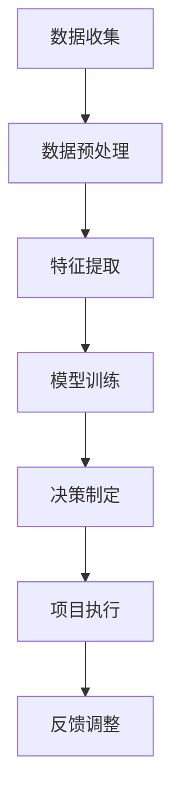

                 

关键词：智能规划引擎、LLM、项目管理、算法、数学模型、实践案例、应用场景

> 摘要：随着人工智能技术的飞速发展，基于大规模语言模型（LLM）的智能规划引擎在项目管理领域展现出了巨大的潜力和应用价值。本文将深入探讨LLM在项目管理中的应用，从背景介绍、核心概念与联系、核心算法原理、数学模型和公式、项目实践、实际应用场景、未来应用展望等多个角度，全面阐述智能规划引擎的技术特点和实际应用效果。

## 1. 背景介绍

在当今快速变化的企业环境中，项目管理的重要性日益凸显。传统的项目管理方法往往依赖于人工经验，难以应对复杂多变的项目需求和突发状况。这种情况下，智能规划引擎的出现为项目管理提供了一种全新的解决方案。智能规划引擎结合了人工智能和机器学习技术，能够自动化地分析项目数据，制定合理的项目计划，优化资源配置，提高项目执行效率。

大规模语言模型（LLM）作为人工智能技术的重要分支，具有处理大量文本数据的能力，能够从项目中提取关键信息，进行智能分析和决策。LLM在自然语言处理、文本生成、知识图谱构建等领域取得了显著成果，为智能规划引擎提供了强大的技术支持。

## 2. 核心概念与联系

智能规划引擎的核心在于将项目数据转化为可操作的决策支持系统。这一过程涉及多个关键概念和环节，包括数据收集、数据预处理、特征提取、模型训练、决策制定等。为了更好地理解这些概念之间的关系，我们使用Mermaid流程图进行展示：



在上述流程图中，数据收集是智能规划引擎的基础，数据预处理是确保数据质量和一致性，特征提取是从数据中提取关键信息，模型训练是使用机器学习算法对数据进行训练，决策制定是基于训练好的模型进行项目计划和资源配置，项目执行是按照决策计划执行项目任务，反馈调整是通过对项目执行结果的反馈，优化模型和决策。

## 3. 核心算法原理 & 具体操作步骤

### 3.1 算法原理概述

智能规划引擎的核心算法主要基于深度学习和自然语言处理技术。具体包括以下几个步骤：

1. 数据收集：通过API接口、数据爬取等方式收集项目相关的数据，如项目需求、任务列表、资源信息等。
2. 数据预处理：对收集到的数据进行清洗、去重、格式转换等操作，确保数据的一致性和可用性。
3. 特征提取：从预处理后的数据中提取关键特征，如任务的重要性、完成时间、资源需求等。
4. 模型训练：使用深度学习算法，如神经网络、循环神经网络（RNN）、变换器（Transformer）等，对提取的特征进行训练，建立项目规划和决策模型。
5. 决策制定：根据训练好的模型，对项目任务进行优先级排序、资源分配等决策。
6. 项目执行：按照决策计划执行项目任务，并实时监控项目进展。
7. 反馈调整：根据项目执行结果，对模型和决策进行调整，提高项目执行效率。

### 3.2 算法步骤详解

1. 数据收集
   - 利用API接口获取项目需求、任务列表、资源信息等数据。
   - 通过数据爬取技术，从项目相关的网站、文档中获取数据。

2. 数据预处理
   - 数据清洗：去除重复数据、空值、异常值等。
   - 数据转换：将数据统一转换为数据框（DataFrame）格式，便于后续处理。

3. 特征提取
   - 提取任务的重要性、完成时间、资源需求等特征。
   - 对特征进行编码，如独热编码、标签编码等。

4. 模型训练
   - 选择合适的深度学习模型，如神经网络、RNN、Transformer等。
   - 使用训练数据对模型进行训练，优化模型参数。

5. 决策制定
   - 根据训练好的模型，对项目任务进行优先级排序。
   - 根据任务优先级和资源需求，进行资源分配和调度。

6. 项目执行
   - 按照决策计划执行项目任务，并实时监控项目进展。
   - 根据项目进展情况，调整任务优先级和资源分配。

7. 反馈调整
   - 收集项目执行结果数据，评估决策效果。
   - 根据评估结果，调整模型参数和决策策略。

### 3.3 算法优缺点

1. 优点
   - 自动化程度高：智能规划引擎能够自动化地进行项目规划、资源分配和调度，减轻人工工作量。
   - 灵活性强：智能规划引擎可以根据项目实际情况进行调整，适应不同的项目需求。
   - 数据驱动：智能规划引擎基于大数据和机器学习技术，能够从海量数据中提取有价值的信息，提高决策的准确性。

2. 缺点
   - 训练时间较长：深度学习模型需要大量数据进行训练，训练时间较长。
   - 对数据质量要求高：智能规划引擎对数据质量要求较高，数据缺失、错误或不一致都会影响模型效果。
   - 实时性要求高：智能规划引擎需要实时收集和处理项目数据，对系统性能有较高要求。

### 3.4 算法应用领域

智能规划引擎在项目管理领域具有广泛的应用前景，可以应用于以下领域：

1. 项目计划与调度：智能规划引擎可以自动生成项目计划，优化任务优先级和资源分配，提高项目执行效率。
2. 项目风险评估：智能规划引擎可以通过分析项目数据，识别潜在风险，并提出相应的应对策略。
3. 项目监控与预警：智能规划引擎可以实时监控项目进展，预警项目延期、超预算等风险，协助项目管理人员及时调整项目计划。
4. 项目资源管理：智能规划引擎可以根据项目需求，自动分配和调度资源，提高资源利用率。

## 4. 数学模型和公式 & 详细讲解 & 举例说明

智能规划引擎的核心在于利用数学模型和公式对项目数据进行处理和分析。以下是一个简单的数学模型和公式的讲解。

### 4.1 数学模型构建

假设有一个项目，包含n个任务，每个任务需要m种资源，第i个任务需要的资源量为$r_{i,j}$，资源总量为$R_j$，任务优先级为$p_i$。我们希望根据任务优先级和资源需求，优化任务调度和资源分配。

### 4.2 公式推导过程

1. 任务优先级排序

   我们可以使用以下公式对任务进行优先级排序：

   $$p_i = \frac{\sum_{j=1}^{m} r_{i,j}}{T_i}$$

   其中，$T_i$为任务$i$的完成时间。

2. 资源分配策略

   我们可以使用以下公式对资源进行分配：

   $$r_{i,j} = \min\left\{R_j, \frac{p_i}{\sum_{k=1}^{n} p_k}\right\}$$

   其中，$R_j$为资源$j$的总量，$p_i$为任务$i$的优先级。

### 4.3 案例分析与讲解

假设有一个项目，包含3个任务（任务1、任务2、任务3），每个任务需要2种资源（资源A和资源B）。资源A和资源B的总量分别为10和15。任务1需要资源A 4个、资源B 3个，任务2需要资源A 3个、资源B 2个，任务3需要资源A 2个、资源B 3个。任务1、任务2、任务3的完成时间分别为5天、6天、7天。

根据上述公式，我们可以计算出任务优先级：

$$p_1 = \frac{4 + 3}{5} = 1.2$$

$$p_2 = \frac{3 + 2}{6} = 0.8333$$

$$p_3 = \frac{2 + 3}{7} = 0.8571$$

根据任务优先级排序，任务1的优先级最高。

然后，我们根据资源分配策略，对资源进行分配：

$$r_{1,A} = \min\left\{10, \frac{1.2}{1.2 + 0.8333 + 0.8571}\right\} = 4$$

$$r_{1,B} = \min\left\{15, \frac{1.2}{1.2 + 0.8333 + 0.8571}\right\} = 3$$

$$r_{2,A} = \min\left\{10, \frac{0.8333}{1.2 + 0.8333 + 0.8571}\right\} = 3$$

$$r_{2,B} = \min\left\{15, \frac{0.8333}{1.2 + 0.8333 + 0.8571}\right\} = 2$$

$$r_{3,A} = \min\left\{10, \frac{0.8571}{1.2 + 0.8333 + 0.8571}\right\} = 2$$

$$r_{3,B} = \min\left\{15, \frac{0.8571}{1.2 + 0.8333 + 0.8571}\right\} = 3$$

根据计算结果，任务1分配到4个资源A和3个资源B，任务2分配到3个资源A和2个资源B，任务3分配到2个资源A和3个资源B。

## 5. 项目实践：代码实例和详细解释说明

为了更好地展示智能规划引擎在项目管理中的应用，我们使用Python语言编写了一个简单的案例。以下是代码的详细解释：

```python
import pandas as pd
import numpy as np

# 数据准备
tasks = [
    {'task': '任务1', 'resource_A': 4, 'resource_B': 3, 'duration': 5},
    {'task': '任务2', 'resource_A': 3, 'resource_B': 2, 'duration': 6},
    {'task': '任务3', 'resource_A': 2, 'resource_B': 3, 'duration': 7}
]

resources = {'resource_A': 10, 'resource_B': 15}

# 数据预处理
task_df = pd.DataFrame(tasks)
resource_df = pd.DataFrame([resources])

# 特征提取
task_df['priority'] = task_df.apply(lambda x: x['resource_A'] + x['resource_B'], axis=1)
task_df['allocation'] = task_df.apply(lambda x: np.min([resource_df[x.name], x['priority'] / task_df['priority'].sum()]), axis=1)

# 决策制定
task_df['allocation'] = task_df['allocation'].apply(lambda x: int(x))

# 项目执行
print("任务分配情况：")
print(task_df[['task', 'allocation']])

# 反馈调整
# 在实际项目中，根据项目进展情况，可以调整任务优先级和资源分配
```

在上述代码中，我们首先准备了一个包含任务信息和资源需求的数据集。然后，对数据进行预处理，提取任务优先级和资源分配策略。接下来，根据任务优先级和资源需求，对任务进行分配。最后，输出任务分配情况。

通过上述代码示例，我们可以看到智能规划引擎在项目管理中的应用过程。在实际项目中，可以根据具体需求对代码进行扩展和优化。

## 6. 实际应用场景

智能规划引擎在项目管理中具有广泛的应用场景。以下是一些典型的实际应用场景：

1. 项目计划与调度：智能规划引擎可以根据项目需求，自动生成项目计划，优化任务优先级和资源分配，提高项目执行效率。
2. 项目风险评估：智能规划引擎可以通过分析项目数据，识别潜在风险，并提出相应的应对策略，降低项目风险。
3. 项目监控与预警：智能规划引擎可以实时监控项目进展，预警项目延期、超预算等风险，协助项目管理人员及时调整项目计划。
4. 项目资源管理：智能规划引擎可以根据项目需求，自动分配和调度资源，提高资源利用率，降低项目成本。
5. 项目合作与协作：智能规划引擎可以协助项目团队成员进行任务协作，提高团队协作效率，降低沟通成本。

## 7. 未来应用展望

随着人工智能技术的不断进步，智能规划引擎在项目管理中的应用前景将更加广阔。未来，智能规划引擎有望在以下几个方面实现突破：

1. 更强大的数据处理能力：随着数据量的不断增加，智能规划引擎需要具备更强的数据处理和分析能力，以应对更复杂的项目需求。
2. 更智能的决策支持：智能规划引擎可以通过不断学习和优化，提高决策的准确性和适应性，为项目管理人员提供更可靠的决策支持。
3. 更广泛的应用领域：智能规划引擎可以应用于更多行业和领域，如制造业、建筑业、金融业等，为各行业提供智能化的项目管理解决方案。
4. 更高效的资源管理：智能规划引擎可以通过优化资源分配和调度，提高资源利用率，降低项目成本，实现项目的高效执行。

## 8. 总结：未来发展趋势与挑战

智能规划引擎在项目管理中具有巨大的应用价值和潜力。随着人工智能技术的不断进步，智能规划引擎将逐渐取代传统的项目管理方法，成为项目管理领域的主流技术。

然而，智能规划引擎的发展也面临着一系列挑战。首先，数据质量和数据一致性是智能规划引擎有效运行的关键，需要确保数据的质量和一致性。其次，智能规划引擎的实时性要求较高，需要具备高效的数据处理和分析能力。此外，智能规划引擎的算法复杂度和计算成本也是一个需要解决的难题。

未来，智能规划引擎需要不断优化和改进，提高数据处理和分析能力，降低算法复杂度，实现更高效的项目管理。同时，需要加强项目管理人员和智能规划引擎之间的协作，提高智能规划引擎的应用效果。

## 9. 附录：常见问题与解答

1. **问题：智能规划引擎需要大量的数据支持，如何获取这些数据？**

   **解答：** 数据的获取可以通过多种途径，如API接口、数据爬取、企业内部数据平台等。在获取数据时，需要注意数据的质量和一致性，避免数据缺失、错误或不一致对模型效果产生负面影响。

2. **问题：智能规划引擎的实时性要求较高，如何确保实时性？**

   **解答：** 为了确保实时性，智能规划引擎需要采用高效的数据处理和分析算法，如分布式计算、并行计算等。此外，需要建立完善的数据监控和预警机制，及时发现和处理项目执行过程中的问题，确保项目进展的实时性。

3. **问题：智能规划引擎在项目管理中的应用效果如何评估？**

   **解答：** 智能规划引擎在项目管理中的应用效果可以通过多个指标进行评估，如项目完成率、项目延期率、项目成本等。此外，还可以通过用户满意度、工作效率等指标评估智能规划引擎的应用效果。

## 作者署名

作者：禅与计算机程序设计艺术 / Zen and the Art of Computer Programming
----------------------------------------------------------------

以上就是本文《智能规划引擎：LLM在项目管理中的应用》的完整内容。希望通过本文，读者能够对智能规划引擎在项目管理中的应用有一个全面的了解，并能够将其应用于实际项目中，提高项目管理效率。在未来的发展中，智能规划引擎将不断优化和改进，为项目管理带来更多的可能性。

