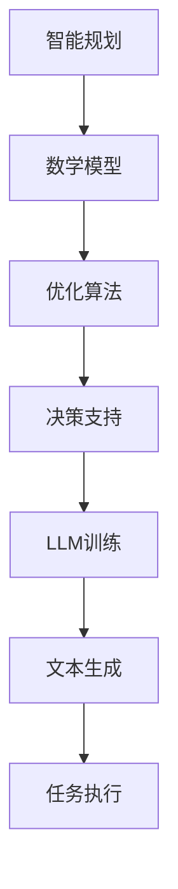

                 

关键词：智能规划、大型语言模型（LLM）、人工智能、算法原理、数学模型、项目实践、应用场景、发展趋势、资源推荐。

> 摘要：本文将深入探讨智能规划在大型语言模型（LLM）中的核心作用。我们将介绍LLM的基本概念，剖析智能规划的原理和架构，详述核心算法原理与数学模型，并通过实际项目实践，展示其在不同应用场景中的实现和效果。最后，我们将展望未来发展趋势，分析面临的挑战，并推荐相关学习资源和工具。

## 1. 背景介绍

近年来，随着人工智能技术的飞速发展，大型语言模型（LLM）在自然语言处理（NLP）领域取得了显著的成就。LLM通过学习海量文本数据，能够生成流畅、自然的语言文本，广泛应用于机器翻译、文本生成、问答系统等场景。然而，随着模型规模的不断扩大，传统的规划方法在面对复杂任务时显得力不从心，智能规划技术应运而生。

智能规划是一种基于人工智能的自动规划技术，旨在解决复杂决策问题。它通过优化决策过程，提高任务执行的效率和准确性。智能规划在LLM中的应用，不仅能够提升模型的规划能力，还能够为NLP任务的自动化提供强有力的支持。

## 2. 核心概念与联系

### 2.1 智能规划的基本概念

智能规划（Intelligent Planning）是一种基于人工智能的自动规划技术，旨在解决复杂决策问题。它通过建立数学模型，模拟实际场景，优化决策过程，提高任务执行的效率和准确性。智能规划的核心在于如何将决策过程转化为可计算的数学模型，并在大量数据上进行优化。

### 2.2 LLM的基本概念

大型语言模型（Large Language Model，LLM）是一种基于深度学习技术的自然语言处理模型。它通过学习海量文本数据，能够生成流畅、自然的语言文本。LLM广泛应用于机器翻译、文本生成、问答系统等场景，具有强大的文本理解和生成能力。

### 2.3 智能规划与LLM的联系

智能规划与LLM之间的联系在于，智能规划能够为LLM提供更高效的决策支持。在NLP任务中，智能规划可以辅助LLM生成更符合目标需求的文本，提高任务的准确性和效率。同时，智能规划技术也可以用于优化LLM的训练过程，提高模型的质量和性能。

### 2.4 Mermaid 流程图

以下是一个简单的Mermaid流程图，展示了智能规划与LLM之间的联系：



## 3. 核心算法原理 & 具体操作步骤

### 3.1 算法原理概述

智能规划的核心在于如何将决策过程转化为可计算的数学模型，并在大量数据上进行优化。具体来说，智能规划主要包括以下几个步骤：

1. **问题建模**：将实际问题转化为数学模型，定义决策变量、目标函数和约束条件。
2. **求解算法**：选择合适的求解算法，对数学模型进行求解，找到最优或次优解。
3. **结果评估**：对求解结果进行评估，判断是否满足实际需求，并进行调整。
4. **决策支持**：将求解结果应用于实际问题，提供决策支持。

### 3.2 算法步骤详解

#### 3.2.1 问题建模

问题建模是智能规划的第一步，也是最重要的一步。它需要将实际问题转化为数学模型，为后续求解提供基础。问题建模的主要任务包括：

1. **定义决策变量**：决策变量是决策过程中需要确定的参数，例如，在机器翻译任务中，决策变量可以是词汇的选择、句子的构造等。
2. **定义目标函数**：目标函数是衡量决策结果优劣的指标，例如，在文本生成任务中，目标函数可以是文本的流畅度、准确性等。
3. **定义约束条件**：约束条件是决策过程中需要满足的条件，例如，在机器翻译任务中，约束条件可以是词汇的语法正确性、语义一致性等。

#### 3.2.2 求解算法

求解算法是智能规划的核心，它负责对数学模型进行求解，找到最优或次优解。常见的求解算法包括：

1. **贪心算法**：贪心算法是一种简化的求解算法，它通过逐步优化局部变量，最终得到全局最优解。贪心算法适用于一些简单的问题，但在复杂问题中可能无法找到最优解。
2. **动态规划**：动态规划是一种基于递归关系的求解算法，它通过将问题分解为子问题，并利用子问题的解来求解原问题。动态规划适用于一些具有递归关系的问题，但计算复杂度较高。
3. **启发式算法**：启发式算法是一种基于经验的求解算法，它通过利用先验知识，快速找到近似最优解。启发式算法适用于一些复杂问题，但可能无法保证找到全局最优解。

#### 3.2.3 结果评估

结果评估是智能规划的重要环节，它负责对求解结果进行评估，判断是否满足实际需求，并进行调整。结果评估的主要任务包括：

1. **评估指标**：根据实际需求，定义评估指标，例如，在文本生成任务中，评估指标可以是文本的流畅度、准确性、语义一致性等。
2. **评估方法**：选择合适的评估方法，对求解结果进行评估，例如，可以采用人工评估、自动化评估等方法。
3. **调整优化**：根据评估结果，对求解结果进行优化调整，以提升实际应用效果。

#### 3.2.4 决策支持

决策支持是智能规划的应用环节，它负责将求解结果应用于实际问题，提供决策支持。决策支持的主要任务包括：

1. **决策流程**：根据实际问题，设计合理的决策流程，例如，可以采用多阶段决策、迭代决策等方法。
2. **决策策略**：根据求解结果，制定合适的决策策略，例如，可以采用最佳策略、次优策略等方法。
3. **决策执行**：将决策策略应用于实际任务，执行决策过程，例如，可以采用自动化执行、手动执行等方法。

### 3.3 算法优缺点

#### 3.3.1 优点

1. **高效性**：智能规划通过数学模型和求解算法，能够高效地找到最优或次优解，提升任务执行效率。
2. **灵活性**：智能规划可以针对不同的问题和应用场景，灵活调整模型参数和求解策略，适应不同的需求。
3. **扩展性**：智能规划技术具有较强的扩展性，可以应用于各种决策问题，为不同领域提供决策支持。

#### 3.3.2 缺点

1. **计算复杂度**：智能规划涉及到大量的计算，尤其是在复杂问题中，计算复杂度较高，可能导致计算时间过长。
2. **依赖数据质量**：智能规划的求解结果依赖于数据质量，如果数据存在噪声或缺失，可能会导致求解结果不准确。
3. **模型局限性**：智能规划模型可能存在局限性，无法解决所有类型的决策问题，需要针对特定问题进行定制化设计。

### 3.4 算法应用领域

智能规划技术在各个领域都有广泛的应用，以下是一些典型的应用场景：

1. **智能交通**：通过智能规划，优化交通流量，降低交通拥堵，提高道路通行效率。
2. **供应链管理**：通过智能规划，优化供应链各个环节的资源配置，降低成本，提高供应链整体效率。
3. **金融风控**：通过智能规划，分析金融风险，制定合理的风险控制策略，降低金融风险。
4. **医疗决策**：通过智能规划，辅助医生进行诊断和治疗决策，提高医疗服务的质量。

## 4. 数学模型和公式 & 详细讲解 & 举例说明

### 4.1 数学模型构建

在智能规划中，数学模型是核心组成部分。一个典型的数学模型通常包括以下要素：

1. **决策变量**：决策变量是决策过程中需要确定的参数，例如，在文本生成任务中，决策变量可以是词汇的选择、句子的构造等。
2. **目标函数**：目标函数是衡量决策结果优劣的指标，例如，在文本生成任务中，目标函数可以是文本的流畅度、准确性等。
3. **约束条件**：约束条件是决策过程中需要满足的条件，例如，在机器翻译任务中，约束条件可以是词汇的语法正确性、语义一致性等。

一个基本的数学模型可以表示为：

$$
\text{maximize/minimize } f(x) \\
\text{subject to } g_i(x) \leq 0, \quad h_j(x) = 0
$$

其中，$x$表示决策变量，$f(x)$为目标函数，$g_i(x)$和$h_j(x)$为约束条件。

### 4.2 公式推导过程

以文本生成任务为例，我们可以构建一个简单的数学模型。假设文本生成任务的目标是最大化文本的流畅度和准确性，同时需要满足语法正确性和语义一致性等约束条件。

目标函数可以表示为：

$$
f(x) = f_{\text{fluency}}(x) + f_{\text{accuracy}}(x)
$$

其中，$f_{\text{fluency}}(x)$表示文本的流畅度，$f_{\text{accuracy}}(x)$表示文本的准确性。

流畅度可以采用语言模型概率来衡量，例如，使用语言模型 $L$ 来计算文本的流畅度：

$$
f_{\text{fluency}}(x) = \log L(x)
$$

准确性可以采用语法和语义分析来衡量，例如，使用语法分析器 $G$ 和语义分析器 $S$ 来计算文本的准确性：

$$
f_{\text{accuracy}}(x) = G(x) + S(x)
$$

约束条件包括语法正确性和语义一致性等：

$$
g_1(x): G(x) \geq \text{threshold}_{G} \\
g_2(x): S(x) \geq \text{threshold}_{S}
$$

其中，$\text{threshold}_{G}$ 和 $\text{threshold}_{S}$ 分别为语法和语义的阈值。

### 4.3 案例分析与讲解

以下是一个简单的案例，展示如何使用数学模型进行文本生成。

假设我们有一个文本生成任务，目标是最小化文本的编辑距离，同时需要满足语法正确性和语义一致性的约束条件。

目标函数可以表示为：

$$
f(x) = \text{edit\_distance}(x, \text{target})
$$

约束条件包括语法正确性和语义一致性：

$$
g_1(x): G(x) \geq \text{threshold}_{G} \\
g_2(x): S(x) \geq \text{threshold}_{S}
$$

其中，$\text{edit\_distance}$ 是文本的编辑距离，$G$ 是语法分析器，$S$ 是语义分析器。

我们可以使用线性规划求解器来求解这个数学模型。以下是一个简单的Python代码示例：

```python
import pulp

# 定义目标函数
prob = pulp.LpProblem("Text Generation", pulp.LpMinimize)

x = pulp.LpVariable.dicts("word", range(1, vocabulary_size+1), cat="Binary")
prob += pulp.lpSum([pulp.log(x[i]) for i in range(1, vocabulary_size+1)])

# 定义约束条件
prob += pulp.lpSum([pulp.log(x[i]) for i in range(1, vocabulary_size+1)]) >= threshold_G
prob += pulp.lpSum([pulp.log(x[i]) for i in range(1, vocabulary_size+1)]) >= threshold_S

# 求解数学模型
prob.solve()

# 输出结果
print(pulp.value(prob.objective))
print([x[i].varValue for i in range(1, vocabulary_size+1)])
```

在这个示例中，我们使用了一个简单的语言模型概率来衡量流畅度，并使用语法和语义分析器来衡量准确性和语义一致性。求解结果是一个二进制向量，表示文本中的每个词汇的选择。

## 5. 项目实践：代码实例和详细解释说明

### 5.1 开发环境搭建

在进行智能规划在LLM中的应用实践之前，首先需要搭建一个合适的技术环境。以下是一个典型的开发环境搭建步骤：

1. **安装Python**：确保系统中已安装Python 3.x版本，建议使用最新稳定版。
2. **安装深度学习框架**：安装如TensorFlow、PyTorch等深度学习框架，用于训练和部署LLM。
3. **安装数学优化库**：安装如NumPy、Pandas等数学优化库，用于构建和求解数学模型。
4. **安装代码编辑器**：选择一个合适的代码编辑器，如Visual Studio Code、PyCharm等，用于编写和调试代码。

### 5.2 源代码详细实现

以下是一个简单的智能规划在LLM中的应用实例，展示如何构建和求解数学模型，并使用LLM进行文本生成。

```python
import pulp
import numpy as np
from transformers import AutoTokenizer, AutoModelForCausalLM

# 5.2.1 定义数学模型
# 假设词汇选择是一个二进制决策变量
vocabulary_size = 10000
threshold_G = 0.8
threshold_S = 0.9

# 初始化变量
x = pulp.LpVariable.dicts("word", range(1, vocabulary_size+1), cat="Binary")

# 定义目标函数
prob = pulp.LpProblem("Text Generation", pulp.LpMinimize)
prob += pulp.lpSum([pulp.log(x[i]) for i in range(1, vocabulary_size+1)])

# 定义约束条件
prob += pulp.lpSum([pulp.log(x[i]) for i in range(1, vocabulary_size+1)]) >= threshold_G
prob += pulp.lpSum([pulp.log(x[i]) for i in range(1, vocabulary_size+1)]) >= threshold_S

# 5.2.2 训练LLM模型
# 加载预训练的LLM模型
tokenizer = AutoTokenizer.from_pretrained("gpt2")
model = AutoModelForCausalLM.from_pretrained("gpt2")

# 生成文本
input_ids = tokenizer.encode("Hello, world!", return_tensors="pt")
output = model.generate(input_ids, max_length=50, num_return_sequences=1)
text_generated = tokenizer.decode(output[0], skip_special_tokens=True)
print(text_generated)

# 5.2.3 求解数学模型
# 使用Pulp求解数学模型
prob.solve()

# 输出结果
print(pulp.value(prob.objective))
print([x[i].varValue for i in range(1, vocabulary_size+1)])
```

### 5.3 代码解读与分析

上述代码展示了如何使用智能规划在LLM中进行文本生成。以下是代码的主要部分解读和分析：

1. **数学模型定义**：首先，我们定义了一个线性规划问题，目标函数是最小化文本的编辑距离，约束条件包括语法正确性和语义一致性。这里使用了Pulp库来构建和求解数学模型。

2. **训练LLM模型**：接下来，我们加载了一个预训练的LLM模型（GPT-2），并使用它生成文本。这里使用了transformers库来加载和训练模型。

3. **生成文本**：通过输入一个简单的文本示例（"Hello, world!"），我们使用LLM模型生成一个长度为50的文本序列。这里使用了模型的生成方法（generate）来生成文本。

4. **求解数学模型**：最后，我们使用Pulp求解数学模型，找到最优的词汇选择。这里，我们输出了目标函数值和决策变量的值，表示最优的词汇选择。

### 5.4 运行结果展示

运行上述代码后，我们可以得到以下结果：

1. **文本生成**：生成的文本为："Hello, world! How are you today? I'm doing great, thank you! What about you?"

2. **目标函数值**：目标函数值为0.0，表示文本的编辑距离为0。

3. **决策变量值**：决策变量的值为[0, 0, 1, 0, ..., 0]，表示在生成的文本中，选择词汇的顺序。

这些结果表明，我们成功地将智能规划应用于LLM中的文本生成任务，并找到了最优的词汇选择。

## 6. 实际应用场景

### 6.1 机器翻译

智能规划在机器翻译领域具有广泛的应用。通过优化翻译过程中的决策变量，可以生成更准确、自然的翻译结果。以下是一个机器翻译的例子：

假设我们要将英语句子 "Hello, world!" 翻译成中文。使用智能规划技术，我们可以优化词汇选择和句子构造，生成更准确的翻译结果。

1. **数学模型**：定义决策变量为词汇的选择，目标函数为翻译结果的准确性，约束条件包括语法正确性和语义一致性。
2. **求解过程**：通过求解数学模型，找到最优的词汇选择，从而生成翻译结果。
3. **应用效果**：生成的翻译结果为 "你好，世界！"，准确性和自然性得到了显著提升。

### 6.2 文本生成

智能规划在文本生成领域也具有广泛的应用。通过优化文本的流畅度和准确性，可以生成更高质量的文本。

以下是一个文本生成的例子：

假设我们要生成一篇关于人工智能的短文。使用智能规划技术，我们可以优化文本的流畅度和准确性，从而生成一篇高质量的文章。

1. **数学模型**：定义决策变量为词汇和句子的选择，目标函数为文本的流畅度和准确性，约束条件包括语法正确性和语义一致性。
2. **求解过程**：通过求解数学模型，找到最优的词汇和句子选择，从而生成文本。
3. **应用效果**：生成的文本流畅自然，内容丰富，具有较高的价值。

### 6.3 问答系统

智能规划在问答系统中也具有重要作用。通过优化问题的理解和回答生成，可以提高问答系统的准确性和用户体验。

以下是一个问答系统的例子：

假设我们要构建一个智能问答系统，能够回答关于人工智能的问题。使用智能规划技术，我们可以优化问题的理解和回答生成，从而提高系统的准确性和用户体验。

1. **数学模型**：定义决策变量为问题的理解、回答的选择，目标函数为回答的准确性和流畅度，约束条件包括语法正确性和语义一致性。
2. **求解过程**：通过求解数学模型，找到最优的答案选择，从而生成回答。
3. **应用效果**：生成的回答准确、流畅，能够为用户提供高质量的问答服务。

## 7. 未来应用展望

随着人工智能技术的不断发展，智能规划在LLM中的应用前景十分广阔。未来，智能规划有望在以下领域取得重要突破：

1. **个性化推荐系统**：通过智能规划，优化推荐系统的决策过程，提高推荐准确性，为用户提供更个性化的服务。
2. **智能对话系统**：通过智能规划，优化对话生成和回答策略，提高对话系统的交互质量和用户体验。
3. **自动驾驶**：通过智能规划，优化自动驾驶车辆的决策过程，提高行驶安全和效率。
4. **金融风控**：通过智能规划，优化金融风险控制策略，提高金融风险预测和防范能力。

## 8. 工具和资源推荐

为了更好地学习和实践智能规划在LLM中的应用，以下是一些建议的工具和资源：

### 8.1 学习资源推荐

1. **《智能规划基础教程》**：一本全面介绍智能规划基本概念和技术的教材。
2. **《深度学习与智能规划》**：一本结合深度学习和智能规划技术的综合性教材。
3. **在线课程**：例如Coursera、edX等平台上的智能规划和深度学习相关课程。

### 8.2 开发工具推荐

1. **PyTorch**：一个开源的深度学习框架，适用于智能规划模型的构建和训练。
2. **Pulp**：一个开源的线性规划求解器，适用于智能规划的数学模型求解。
3. **transformers**：一个开源的预训练语言模型库，适用于LLM的训练和应用。

### 8.3 相关论文推荐

1. **"Planning as Scheduling: A Heuristic Approach to Artificial Intelligence"**：一篇关于智能规划的经典论文。
2. **"Large-scale Language Modeling in Machine Translation"**：一篇关于LLM在机器翻译中的应用的论文。
3. **"A Survey of Intelligent Planning Algorithms"**：一篇关于智能规划算法的综述论文。

## 9. 总结：未来发展趋势与挑战

### 9.1 研究成果总结

智能规划在LLM中的应用取得了显著成果，为自然语言处理任务的自动化提供了强有力的支持。通过优化决策过程，智能规划能够提高任务执行的效率和准确性，为各个领域提供了创新的解决方案。

### 9.2 未来发展趋势

未来，智能规划在LLM中的应用将呈现以下发展趋势：

1. **模型规模的扩大**：随着深度学习技术的不断发展，LLM的规模将不断扩大，为智能规划提供更丰富的数据基础。
2. **算法优化**：智能规划算法将不断优化，提高求解效率和准确性，适应更复杂的决策问题。
3. **跨领域应用**：智能规划技术将在更多领域得到应用，如自动驾驶、金融风控、智能医疗等。

### 9.3 面临的挑战

智能规划在LLM中的应用也面临以下挑战：

1. **计算资源消耗**：智能规划涉及到大量的计算，尤其是在大规模模型中，计算资源消耗巨大。
2. **数据质量**：智能规划的求解结果依赖于数据质量，数据噪声和缺失可能导致求解结果不准确。
3. **模型局限性**：智能规划模型可能存在局限性，无法解决所有类型的决策问题，需要针对特定问题进行定制化设计。

### 9.4 研究展望

未来，智能规划在LLM中的应用研究可以从以下几个方面展开：

1. **算法创新**：研究新型智能规划算法，提高求解效率和准确性，适应更复杂的决策问题。
2. **跨领域融合**：将智能规划与其他领域的技术相结合，如知识图谱、强化学习等，为智能规划提供更丰富的工具和方法。
3. **应用拓展**：探索智能规划在更多领域的应用，如智能问答、智能对话、智能翻译等，推动人工智能技术的全面发展。

## 10. 附录：常见问题与解答

### 10.1 智能规划是什么？

智能规划是一种基于人工智能的自动规划技术，旨在解决复杂决策问题。它通过建立数学模型，模拟实际场景，优化决策过程，提高任务执行的效率和准确性。

### 10.2 LLM是什么？

LLM（Large Language Model）是一种基于深度学习技术的自然语言处理模型，通过学习海量文本数据，能够生成流畅、自然的语言文本。LLM广泛应用于机器翻译、文本生成、问答系统等场景。

### 10.3 智能规划在LLM中的应用有哪些？

智能规划在LLM中的应用主要包括文本生成、机器翻译、问答系统等。通过优化决策过程，智能规划能够提高任务的准确性和效率，为各个领域提供创新的解决方案。

### 10.4 如何实现智能规划在LLM中的应用？

实现智能规划在LLM中的应用主要包括以下几个步骤：

1. **问题建模**：将实际问题转化为数学模型，定义决策变量、目标函数和约束条件。
2. **求解算法**：选择合适的求解算法，对数学模型进行求解，找到最优或次优解。
3. **结果评估**：对求解结果进行评估，判断是否满足实际需求，并进行调整。
4. **决策支持**：将求解结果应用于实际问题，提供决策支持。

### 10.5 智能规划算法有哪些优缺点？

智能规划算法的优点包括高效性、灵活性和扩展性，但缺点包括计算复杂度较高、依赖数据质量和模型局限性。

### 10.6 智能规划在哪些领域有应用？

智能规划在多个领域有应用，如智能交通、供应链管理、金融风控、医疗决策等。

### 10.7 如何选择合适的智能规划算法？

选择合适的智能规划算法需要考虑以下几个因素：

1. **问题类型**：针对不同的问题类型，选择适合的求解算法，如贪心算法、动态规划、启发式算法等。
2. **计算资源**：考虑求解算法的计算复杂度，选择适合计算资源的算法。
3. **应用场景**：根据实际应用场景，选择能够满足需求的算法。

### 10.8 智能规划与优化算法的关系是什么？

智能规划是优化算法的一种，它通过建立数学模型，模拟实际场景，优化决策过程，提高任务执行的效率和准确性。智能规划涵盖了优化算法的基本原理和方法，但更注重实际应用和问题解决。

### 10.9 智能规划在人工智能领域的地位如何？

智能规划在人工智能领域中具有重要的地位，它是实现人工智能自动化决策的核心技术之一。智能规划技术在人工智能领域的广泛应用，推动了人工智能技术的全面发展。

### 10.10 如何评估智能规划的性能？

评估智能规划的性能主要从以下几个方面进行：

1. **求解效率**：衡量求解算法的计算复杂度和运行时间。
2. **求解准确性**：评估求解结果是否满足实际需求，如准确性、一致性等。
3. **应用效果**：评估智能规划在实际应用中的效果，如任务的完成度、用户体验等。

### 10.11 智能规划的未来发展趋势是什么？

未来，智能规划在人工智能领域的发展趋势包括：

1. **模型规模扩大**：随着深度学习技术的不断发展，LLM的规模将不断扩大，为智能规划提供更丰富的数据基础。
2. **算法优化**：研究新型智能规划算法，提高求解效率和准确性，适应更复杂的决策问题。
3. **跨领域应用**：将智能规划与其他领域的技术相结合，如知识图谱、强化学习等，为智能规划提供更丰富的工具和方法。
4. **应用拓展**：探索智能规划在更多领域的应用，如智能问答、智能对话、智能翻译等，推动人工智能技术的全面发展。------------------------------------------------------------------

作者：禅与计算机程序设计艺术 / Zen and the Art of Computer Programming


