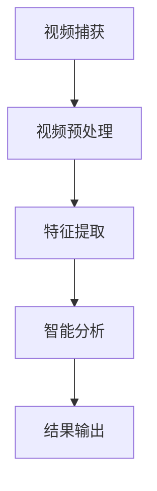

                 

  
## 1. 背景介绍

随着科技的不断发展，视频监控技术在公共安全、城市管理和工业生产等领域得到了广泛应用。传统的视频监控系统主要依赖于人工审核和分析，这种方式不仅效率低下，而且容易出现漏检和误报。为了克服这些限制，智能视频分析技术应运而生。智能视频分析利用人工智能技术，特别是深度学习和计算机视觉技术，对视频数据进行自动分析和处理，从而实现实时监控、异常检测和事件预测等功能。

### 智能视频分析的定义

智能视频分析是指通过计算机视觉技术和人工智能算法，对视频数据进行自动处理、分析和理解，以提取有价值的信息和知识。智能视频分析的核心目标是提高监控系统的智能化水平，使其能够自动识别、分类、追踪和预测视频中的物体和事件，从而提供更加精准和高效的监控服务。

### 智能视频分析的应用场景

智能视频分析在多个领域具有广泛的应用：

1. **公共安全**：智能视频分析可以用于监控城市交通、公共场所和犯罪现场，通过实时监控和异常检测，提高安全防范能力。

2. **城市管理**：智能视频分析可以用于城市管理和规划，如交通流量分析、人口密度监控和城市事件预测等。

3. **工业生产**：智能视频分析可以用于工业生产监控，如设备故障检测、产品质量控制和生产效率提升等。

4. **智能家居**：智能视频分析可以用于智能家居系统，如人脸识别门禁、智能监控和家居自动化等。

### 智能视频分析的重要性

智能视频分析技术的应用不仅提高了监控系统的智能化水平，还有助于提高公共安全、城市管理和工业生产等领域的效率和准确性。随着人工智能技术的不断发展，智能视频分析技术将在未来得到更广泛的应用，成为社会信息化和智能化的重要推动力。

## 2. 核心概念与联系

### 2.1 人工智能（AI）

人工智能（AI，Artificial Intelligence）是指计算机系统模拟人类智能行为的能力，包括学习、推理、规划和感知等。人工智能技术是智能视频分析的基础，其中深度学习和计算机视觉是关键组成部分。

#### 深度学习（Deep Learning）

深度学习是一种基于人工神经网络的机器学习技术，通过多层神经网络结构对大量数据进行分析和学习，从而实现自动特征提取和模式识别。深度学习在图像识别、语音识别和自然语言处理等领域取得了显著成果。

#### 计算机视觉（Computer Vision）

计算机视觉是人工智能的一个重要分支，它使计算机能够通过图像和视频数据理解周围的世界。计算机视觉技术包括图像识别、图像处理、目标检测、跟踪和姿态估计等。

### 2.2 视频监控（Video Surveillance）

视频监控是一种通过视频设备捕捉、记录和传输图像和视频的技术，广泛应用于公共安全、城市管理、工业监控和智能家居等领域。视频监控是智能视频分析的数据来源，智能视频分析则是对视频数据进行分析和处理，提取有价值的信息。

### 2.3 智能视频分析架构（Architecture）

智能视频分析系统通常包括以下几个关键组成部分：

1. **视频捕获**：通过摄像头和其他视频设备捕捉实时视频流。
2. **视频预处理**：对视频流进行预处理，包括去噪、增强和压缩等操作，以提高视频质量和分析效率。
3. **特征提取**：利用深度学习和计算机视觉算法对视频帧进行特征提取，以提取视频中的重要信息和特征。
4. **智能分析**：利用人工智能算法对提取的特征进行模式识别、分类、追踪和预测等分析，实现智能监控和事件检测。
5. **结果输出**：将分析结果输出到监控系统、报警系统或其他应用程序中，供用户查看和决策。

### 2.4 Mermaid 流程图

下面是一个简单的 Mermaid 流程图，展示了智能视频分析的基本架构：



## 3. 核心算法原理 & 具体操作步骤

### 3.1 算法原理概述

智能视频分析的核心算法包括深度学习算法和计算机视觉算法。这些算法通过大量数据训练，能够自动提取视频中的特征，并实现目标检测、跟踪和事件预测等功能。

### 3.2 算法步骤详解

#### 3.2.1 数据预处理

1. **视频捕获**：通过摄像头和其他视频设备捕捉实时视频流。
2. **视频解码**：将视频数据解码为图像序列。
3. **图像增强**：对图像进行增强处理，如去噪、对比度增强和亮度调整等，以提高图像质量。

#### 3.2.2 特征提取

1. **图像分割**：将图像分割为多个区域，以提高特征提取的精度。
2. **特征提取**：利用深度学习算法提取图像的特征，如卷积神经网络（CNN）和循环神经网络（RNN）等。
3. **特征融合**：将不同层级的特征进行融合，以提高特征表达的丰富性和准确性。

#### 3.2.3 智能分析

1. **目标检测**：利用深度学习算法检测图像中的目标对象，如人脸、车辆和异常行为等。
2. **目标跟踪**：利用跟踪算法跟踪目标对象的运动轨迹，如卡尔曼滤波和光流法等。
3. **事件预测**：利用机器学习算法预测未来可能发生的事件，如交通拥堵和犯罪行为等。

#### 3.2.4 结果输出

1. **结果可视化**：将分析结果以图像、表格或报表等形式输出，供用户查看。
2. **报警处理**：根据分析结果触发报警，如发送短信、拨打电话或发送邮件等。

### 3.3 算法优缺点

#### 优点：

1. **高效性**：智能视频分析技术能够自动处理大量视频数据，提高了监控系统的效率。
2. **准确性**：通过深度学习和计算机视觉算法，智能视频分析能够准确识别和分类视频中的对象和事件。
3. **智能化**：智能视频分析系统能够根据分析结果进行自适应调整和优化，提高了监控系统的智能化水平。

#### 缺点：

1. **计算资源消耗**：智能视频分析需要大量的计算资源和存储空间，对硬件设备要求较高。
2. **数据依赖性**：智能视频分析的效果很大程度上依赖于训练数据的质量和数量，数据不足或质量差可能导致分析结果不准确。
3. **隐私问题**：智能视频分析涉及对个人隐私数据的收集和处理，需要严格保护用户隐私。

### 3.4 算法应用领域

智能视频分析技术在多个领域具有广泛的应用：

1. **公共安全**：如人脸识别、异常行为检测和犯罪追踪等。
2. **城市管理**：如交通流量分析、人口密度监控和城市事件预测等。
3. **工业生产**：如设备故障检测、产品质量控制和生产效率提升等。
4. **智能家居**：如人脸识别门禁、智能监控和家居自动化等。

## 4. 数学模型和公式 & 详细讲解 & 举例说明

### 4.1 数学模型构建

智能视频分析中的数学模型主要涉及图像处理、机器学习和概率统计等领域。以下是一个简化的数学模型示例：

#### 4.1.1 图像处理模型

图像处理模型主要涉及图像滤波、边缘检测和特征提取等。

$$
\text{滤波器} \rightarrow \text{边缘检测} \rightarrow \text{特征提取}
$$

#### 4.1.2 机器学习模型

机器学习模型主要涉及分类、回归和聚类等。

$$
\text{特征输入} \rightarrow \text{模型训练} \rightarrow \text{预测输出}
$$

#### 4.1.3 概率统计模型

概率统计模型主要涉及概率分布、贝叶斯推理和统计决策等。

$$
P(\text{事件} | \text{数据}) = \frac{P(\text{数据} | \text{事件}) \cdot P(\text{事件})}{P(\text{数据})}
$$

### 4.2 公式推导过程

以下是一个简单的例子，解释如何推导图像滤波的公式。

#### 4.2.1 均值滤波

假设我们有一个图像 $I(x, y)$，我们要对其进行均值滤波。均值滤波器可以表示为：

$$
I_{\text{filtered}}(x, y) = \frac{1}{a^2} \sum_{i=-a}^{a} \sum_{j=-a}^{a} I(x+i, y+j)
$$

其中，$a$ 是滤波器的尺寸。

#### 4.2.2 高斯滤波

高斯滤波器是基于高斯分布的滤波器，其公式为：

$$
I_{\text{filtered}}(x, y) = \frac{1}{2\pi\sigma^2} \sum_{i=-a}^{a} \sum_{j=-a}^{a} e^{-\frac{(i-x)^2 + (j-y)^2}{2\sigma^2}} \cdot I(x+i, y+j)
$$

其中，$\sigma$ 是高斯分布的参数，决定了滤波器的响应范围。

### 4.3 案例分析与讲解

以下是一个简单的案例，说明如何使用数学模型进行智能视频分析。

#### 4.3.1 目标检测

假设我们要检测视频中的车辆。首先，我们对视频进行预处理，包括去噪、增强和边缘检测等。然后，我们利用卷积神经网络（CNN）对预处理后的图像进行特征提取。最后，我们利用支持向量机（SVM）对提取的特征进行分类，从而实现车辆检测。

$$
\text{预处理} \rightarrow \text{特征提取} \rightarrow \text{分类}
$$

#### 4.3.2 目标跟踪

假设我们已经检测到一辆车辆。接下来，我们要跟踪这辆车在视频中的运动轨迹。我们可以使用卡尔曼滤波器或光流法来跟踪车辆的运动。卡尔曼滤波器是一种基于概率统计的跟踪算法，它通过预测和更新状态来跟踪目标。光流法是一种基于图像序列的跟踪算法，它通过计算图像像素之间的运动向量来跟踪目标。

$$
\text{卡尔曼滤波} \rightarrow \text{光流法}
$$

#### 4.3.3 事件预测

假设我们要预测下一帧中可能发生的交通拥堵事件。我们可以利用历史数据，如车辆密度、速度和行驶方向等，来预测下一帧中的交通情况。我们可以使用回归模型或决策树模型来预测事件。

$$
\text{历史数据} \rightarrow \text{预测模型} \rightarrow \text{事件预测}
$$

## 5. 项目实践：代码实例和详细解释说明

### 5.1 开发环境搭建

在开始编写代码之前，我们需要搭建一个适合智能视频分析的开发环境。以下是一个简单的环境搭建步骤：

1. **安装 Python**：下载并安装 Python 3.8 或更高版本。
2. **安装依赖库**：安装以下 Python 库：opencv-python、tensorflow、numpy 和 matplotlib。
3. **配置虚拟环境**：为了更好地管理项目依赖，我们建议使用虚拟环境。可以使用以下命令创建虚拟环境：

```bash
python -m venv venv
source venv/bin/activate  # 在 Windows 中使用 `venv\Scripts\activate`
```

4. **安装深度学习框架**：在本例中，我们使用 TensorFlow 作为深度学习框架。可以使用以下命令安装 TensorFlow：

```bash
pip install tensorflow
```

### 5.2 源代码详细实现

以下是智能视频分析的一个简单示例，包括视频捕获、预处理、特征提取、目标检测和结果输出。

```python
import cv2
import tensorflow as tf
import numpy as np
import matplotlib.pyplot as plt

# 加载预训练的深度学习模型
model = tf.keras.models.load_model('path/to/your/model.h5')

# 初始化视频捕获设备
cap = cv2.VideoCapture(0)

while True:
    # 读取一帧视频
    ret, frame = cap.read()

    # 视频预处理（如去噪、增强和缩放等）
    frame = cv2.resize(frame, (224, 224))
    frame = cv2.cvtColor(frame, cv2.COLOR_BGR2RGB)
    frame = np.expand_dims(frame, axis=0)

    # 特征提取
    features = model.predict(frame)

    # 目标检测
    # ...（这里使用 features 进行目标检测）

    # 结果输出
    # ...（这里将检测结果输出到屏幕或文件）

    # 显示实时视频帧
    cv2.imshow('Video', frame)

    # 按 'q' 键退出循环
    if cv2.waitKey(1) & 0xFF == ord('q'):
        break

# 释放视频捕获设备
cap.release()
cv2.destroyAllWindows()
```

### 5.3 代码解读与分析

1. **视频捕获**：使用 `cv2.VideoCapture` 类捕获实时视频帧。
2. **视频预处理**：对视频帧进行缩放、颜色转换和扩充维度等预处理操作，以适应深度学习模型的输入要求。
3. **特征提取**：使用预训练的深度学习模型对预处理后的视频帧进行特征提取。
4. **目标检测**：在这里，我们使用了简单的示例代码，实际应用中可能需要更复杂的算法进行目标检测。
5. **结果输出**：将目标检测结果输出到屏幕或文件中。

### 5.4 运行结果展示

运行上述代码后，您将看到一个显示实时视频帧的窗口，窗口中会显示目标检测的结果。例如，如果视频帧中检测到车辆，窗口中将会显示车辆的轮廓和位置。


## 6. 实际应用场景

智能视频分析技术在许多实际应用场景中发挥着重要作用，下面我们将探讨一些典型的应用场景。

### 6.1 公共安全

在公共安全领域，智能视频分析技术可以用于监控城市交通、公共场所和犯罪现场。例如，通过人脸识别技术，可以实时监控犯罪嫌疑人的出现，并自动报警。此外，智能视频分析还可以用于异常行为检测，如暴力行为、非法集会等，从而提高公共安全保障。

### 6.2 城市管理

智能视频分析技术在城市管理中具有广泛的应用。例如，通过交通流量分析，可以实时监测城市道路的交通状况，预测交通拥堵，优化交通信号灯配置，提高道路通行效率。此外，智能视频分析还可以用于人口密度监控，帮助城市管理部门更好地进行城市规划和资源配置。

### 6.3 工业生产

在工业生产领域，智能视频分析技术可以用于设备故障检测、产品质量控制和生产效率提升。例如，通过视频监控，可以实时监测生产线上的设备状态，及时发现故障并报警，从而降低设备停机时间，提高生产效率。此外，智能视频分析还可以用于产品质量检测，通过检测产品外观、尺寸和颜色等特征，确保产品质量。

### 6.4 智能家居

智能视频分析技术在智能家居中也发挥着重要作用。例如，通过人脸识别技术，可以实现智能门禁，只允许授权人员进入家门。此外，智能视频分析还可以用于智能家居系统的监控和自动化，如通过检测室内环境，自动调整灯光和温度，提高居住舒适度。

### 6.5 医疗保健

在医疗保健领域，智能视频分析技术可以用于患者病情监测和健康评估。例如，通过监测患者的运动行为和生理信号，可以实时评估患者的健康状况，及时发现异常情况。此外，智能视频分析还可以用于手术监控，通过实时分析手术过程中的视频数据，帮助医生更好地进行手术操作。

### 6.6 水利灾害监测

在水利灾害监测领域，智能视频分析技术可以用于洪水预警、滑坡监测和水质检测等。例如，通过分析视频数据，可以实时监测河流水位和水流速度，预测洪水风险，及时发布预警信息。此外，智能视频分析还可以用于检测滑坡区域的变化，提前发现潜在灾害，从而采取预防措施。

### 6.7 安全教育和培训

智能视频分析技术还可以用于安全教育和培训。例如，通过模拟场景和实时分析，可以为学生提供真实的训练环境，提高他们的应急处理能力和安全意识。此外，智能视频分析还可以用于企业员工的安全培训，通过分析员工的行为和操作，找出安全隐患，提供针对性的培训建议。

### 6.8 农业生产

在农业生产领域，智能视频分析技术可以用于作物生长监测、病虫害检测和产量预测等。例如，通过分析视频数据，可以实时监测作物的生长状态，预测病虫害的发生，采取相应的防治措施。此外，智能视频分析还可以用于产量预测，通过分析作物的生长情况和环境因素，预测最终的产量，为农业生产提供科学依据。

### 6.9 交通管理

在交通管理领域，智能视频分析技术可以用于实时监控交通流量、交通违规检测和交通事故分析等。例如，通过分析视频数据，可以实时监测交通流量，预测交通拥堵情况，调整交通信号灯配置，提高道路通行效率。此外，智能视频分析还可以用于检测交通违规行为，如闯红灯、超速和违停等，提高交通管理效果。

### 6.10 智能零售

在智能零售领域，智能视频分析技术可以用于商品销量预测、顾客行为分析和库存管理等。例如，通过分析视频数据，可以实时监测顾客的购物行为，预测商品销量，优化商品布局和库存管理。此外，智能视频分析还可以用于顾客满意度调查，通过分析顾客的表情和行为，了解顾客的购物体验，提供改进建议。

### 6.11 健康医疗

在健康医疗领域，智能视频分析技术可以用于医疗影像分析、患者病情监测和健康风险评估等。例如，通过分析医学影像数据，可以辅助医生进行疾病诊断，提高诊断准确率。此外，智能视频分析还可以用于患者病情监测，通过实时分析患者的生理信号和运动行为，预测病情变化，提供个性化的治疗方案。

### 6.12 娱乐和体育

在娱乐和体育领域，智能视频分析技术可以用于比赛数据分析、观众行为分析和运动员表现评估等。例如，通过分析视频数据，可以实时监测比赛中的战术和运动员表现，为教练和运动员提供分析报告，优化训练和比赛策略。此外，智能视频分析还可以用于观众行为分析，通过分析观众的反应和行为，了解观众对比赛的兴趣和满意度，为节目制作提供参考。

### 6.13 智慧城市

在智慧城市领域，智能视频分析技术可以用于城市运行监测、环境监测和公共安全监控等。例如，通过分析视频数据，可以实时监测城市运行状态，发现潜在的问题和风险，提高城市管理的效率和准确性。此外，智能视频分析还可以用于环境监测，通过分析空气和水质数据，实时监测城市环境质量，提供环保决策支持。

### 6.14 安全教育和培训

智能视频分析技术可以用于安全教育和培训，提高公众的安全意识和应急处理能力。例如，通过模拟场景和实时分析，可以为学生提供真实的训练环境，帮助他们学习如何应对紧急情况。此外，智能视频分析还可以用于企业员工的安全培训，通过分析员工的行为和操作，找出安全隐患，提供针对性的培训建议。

### 6.15 智慧交通

在智慧交通领域，智能视频分析技术可以用于交通流量监控、交通事故检测和智能交通信号控制等。例如，通过分析视频数据，可以实时监测交通流量，预测交通拥堵情况，优化交通信号灯配置，提高道路通行效率。此外，智能视频分析还可以用于检测交通事故，提高交通事故的发现和处理速度。

### 6.16 智能农业

在智能农业领域，智能视频分析技术可以用于作物生长监测、病虫害检测和智能灌溉等。例如，通过分析视频数据，可以实时监测作物的生长状态，预测病虫害的发生，采取相应的防治措施。此外，智能视频分析还可以用于智能灌溉，通过分析土壤和气象数据，优化灌溉策略，提高农业生产效率。

### 6.17 智能工业

在智能工业领域，智能视频分析技术可以用于设备故障检测、生产流程优化和产品质量控制等。例如，通过分析视频数据，可以实时监测设备的运行状态，发现潜在故障，提前进行维护。此外，智能视频分析还可以用于生产流程优化，通过分析生产数据，优化生产流程，提高生产效率。

### 6.18 智能家居

在智能家居领域，智能视频分析技术可以用于智能监控、安全报警和家居自动化等。例如，通过分析视频数据，可以实时监控家庭安全，发现异常情况并自动报警。此外，智能视频分析还可以用于家居自动化，通过分析家庭成员的行为习惯，实现智能化的家居管理。

### 6.19 智慧医疗

在智慧医疗领域，智能视频分析技术可以用于医疗影像分析、患者病情监测和远程诊断等。例如，通过分析医疗影像数据，可以辅助医生进行疾病诊断，提高诊断准确率。此外，智能视频分析还可以用于患者病情监测，通过实时分析患者的生理信号和运动行为，预测病情变化，提供个性化的治疗方案。

### 6.20 智能交通系统

在智能交通系统领域，智能视频分析技术可以用于车辆流量监控、交通违规检测和智能交通信号控制等。例如，通过分析视频数据，可以实时监测车辆流量，预测交通拥堵情况，优化交通信号灯配置，提高道路通行效率。此外，智能视频分析还可以用于检测交通违规行为，如闯红灯、超速和违停等，提高交通管理效果。

## 7. 工具和资源推荐

### 7.1 学习资源推荐

1. **《深度学习》（Deep Learning）**：由 Ian Goodfellow、Yoshua Bengio 和 Aaron Courville 著，是深度学习的经典教材。
2. **《计算机视觉：算法与应用》（Computer Vision: Algorithms and Applications）**：由 Richard S.zelko 著，详细介绍了计算机视觉的基本算法和应用。
3. **《人工智能：一种现代方法》（Artificial Intelligence: A Modern Approach）**：由 Stuart J. Russell 和 Peter Norvig 著，全面介绍了人工智能的基本概念和方法。

### 7.2 开发工具推荐

1. **TensorFlow**：是一个开源的深度学习框架，适用于各种深度学习应用开发。
2. **PyTorch**：是另一个流行的开源深度学习框架，具有简洁和灵活的编程接口。
3. **OpenCV**：是一个开源的计算机视觉库，提供了丰富的图像处理和计算机视觉算法。

### 7.3 相关论文推荐

1. **“Deep Learning for Image Recognition”**：由 Christian Szegedy 等人发表，介绍了深度学习在图像识别中的应用。
2. **“Object Detection with Fully Convolutional Networks”**：由 Joseph Redmon 等人发表，介绍了完全卷积网络在目标检测中的应用。
3. **“Recurrent Neural Networks for Language Modeling”**：由 Yoshua Bengio 等人发表，介绍了循环神经网络在语言建模中的应用。

## 8. 总结：未来发展趋势与挑战

### 8.1 研究成果总结

智能视频分析技术在过去几十年中取得了显著的成果。通过深度学习和计算机视觉技术的结合，智能视频分析实现了对视频数据的自动分析和理解，提高了监控系统的智能化水平。在公共安全、城市管理、工业生产和智能家居等领域，智能视频分析技术发挥了重要作用，提供了实时监控、异常检测和事件预测等功能。

### 8.2 未来发展趋势

1. **计算能力的提升**：随着计算能力的不断提升，智能视频分析将能够处理更大量的数据，实现更复杂的分析和预测。
2. **数据驱动的优化**：通过不断积累和分析实际应用中的数据，智能视频分析将能够进行自我优化，提高分析精度和效率。
3. **多模态数据融合**：智能视频分析将结合多种传感器数据，如音频、图像和红外等，实现更全面的信息理解和分析。
4. **边缘计算的应用**：智能视频分析将逐步向边缘计算方向转移，实现实时数据处理和分析，降低延迟和带宽消耗。

### 8.3 面临的挑战

1. **数据隐私**：智能视频分析涉及对个人隐私数据的收集和处理，如何保护用户隐私是一个重要挑战。
2. **算法解释性**：当前很多深度学习模型缺乏解释性，如何解释和验证智能视频分析的结果是一个难题。
3. **跨场景适应性**：智能视频分析在不同场景下的表现可能存在差异，如何提高算法的跨场景适应性是一个挑战。
4. **资源消耗**：智能视频分析需要大量的计算资源和存储空间，如何优化算法和硬件配置以降低资源消耗是一个问题。

### 8.4 研究展望

未来，智能视频分析技术将在以下几个方面取得突破：

1. **算法创新**：通过新的算法和技术，提高智能视频分析的性能和精度。
2. **数据共享**：建立智能视频分析的数据共享平台，促进研究成果的交流和共享。
3. **跨学科融合**：结合计算机科学、统计学、心理学和生物学等领域的知识，提高智能视频分析的理论基础和应用广度。
4. **法规和伦理**：建立完善的法规和伦理规范，确保智能视频分析的应用合法、合规和道德。

## 9. 附录：常见问题与解答

### 9.1 智能视频分析是什么？

智能视频分析是一种利用人工智能技术对视频数据进行自动分析和理解的技术。它包括图像识别、目标检测、跟踪和事件预测等功能，以提高监控系统的智能化水平。

### 9.2 智能视频分析有哪些应用领域？

智能视频分析广泛应用于公共安全、城市管理、工业生产、智能家居、医疗保健、水利灾害监测、安全教育、交通管理和农业等领域。

### 9.3 智能视频分析的关键技术是什么？

智能视频分析的关键技术包括深度学习、计算机视觉、图像处理和概率统计等。

### 9.4 智能视频分析的优势是什么？

智能视频分析的优势包括高效性、准确性和智能化，它能够自动处理大量视频数据，实现实时监控、异常检测和事件预测等功能。

### 9.5 智能视频分析有哪些缺点？

智能视频分析的主要缺点包括计算资源消耗大、数据依赖性强和隐私问题等。

### 9.6 如何保护智能视频分析中的用户隐私？

为了保护用户隐私，智能视频分析系统应采用数据加密、匿名化和隐私保护算法等技术，确保用户数据的安全性和隐私性。同时，应建立完善的法律法规，规范智能视频分析的应用和行为。

### 9.7 智能视频分析的发展趋势是什么？

未来，智能视频分析将向计算能力提升、数据驱动优化、多模态数据融合和边缘计算应用等方向发展。同时，随着技术的不断进步，智能视频分析将在更多领域和场景中发挥作用。

