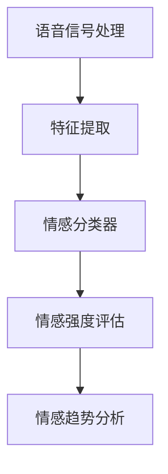

                 

关键词：智能语音情感识别，AI大模型，客户服务质量，情感分析，机器学习，深度学习

> 摘要：随着人工智能技术的发展，智能语音情感识别技术逐渐成为客户服务质量评估的重要手段。本文将深入探讨AI大模型在智能语音情感识别中的应用，分析其在客户服务质量评估中的突破，并提供实际应用场景和未来发展的展望。

## 1. 背景介绍

随着全球经济的发展，客户服务质量成为企业竞争力的重要组成部分。传统的客户服务质量评估方法主要依赖于问卷调查、访谈等方式，这些方法往往具有主观性强、成本高等问题。而随着人工智能技术的进步，特别是深度学习和自然语言处理技术的发展，智能语音情感识别技术应运而生，成为了一种高效、可靠的客户服务质量评估手段。

智能语音情感识别是指通过语音信号分析，自动识别和理解语音中的情感信息。这项技术能够帮助企业和组织实时了解客户的情感状态，从而更好地满足客户需求，提升服务质量。智能语音情感识别在客户服务质量评估中的应用主要包括以下几个方面：

1. **客户情感分析**：通过对客户语音中的情感信息进行分析，识别客户的满意程度、情绪波动等，为企业提供客户满意度评估的依据。

2. **问题识别**：通过识别客户语音中的负面情感，帮助企业发现潜在的问题和改进点，从而提高客户服务质量。

3. **个性化服务**：根据客户情感状态提供个性化的服务，如调整服务流程、优化客服人员培训等。

4. **预测分析**：通过分析客户情感趋势，预测客户需求变化，为企业决策提供支持。

## 2. 核心概念与联系

### 2.1 情感识别概念

情感识别是智能语音情感识别的核心概念，它涉及到对语音信号中情感信息的自动检测和理解。情感识别可以分为以下几个层次：

1. **情绪分类**：将语音信号中的情感划分为不同的类别，如快乐、愤怒、悲伤等。

2. **情感强度评估**：对语音信号中的情感强度进行量化评估，如情感的强弱、激烈程度等。

3. **情感趋势分析**：分析语音信号中的情感变化趋势，如情感的波动、情感周期的识别等。

### 2.2 模型架构

智能语音情感识别的模型架构通常包括以下几个部分：

1. **语音信号处理**：对原始语音信号进行预处理，如降噪、分割等，提取出语音特征。

2. **特征提取**：将语音信号转换为机器可处理的特征向量，如使用梅尔频率倒谱系数（MFCC）等。

3. **情感分类器**：基于深度学习或传统机器学习算法，对特征向量进行分类，识别语音中的情感。

4. **情感强度评估**：使用回归算法或其他方法对情感强度进行量化评估。

5. **情感趋势分析**：通过时间序列分析等方法，分析情感变化趋势。

### 2.3 Mermaid 流程图

以下是一个简单的 Mermaid 流程图，展示了智能语音情感识别的基本流程：



## 3. 核心算法原理 & 具体操作步骤

### 3.1 算法原理概述

智能语音情感识别的核心算法通常基于深度学习和机器学习技术。以下是一个典型的算法原理概述：

1. **语音信号预处理**：包括降噪、静音检测、声音分割等步骤，确保语音信号的清晰度。

2. **特征提取**：通过特征提取模块，将语音信号转换为机器可处理的特征向量。常用的特征提取方法包括梅尔频率倒谱系数（MFCC）、频谱特征、共振峰等。

3. **情感分类器**：使用深度学习算法，如卷积神经网络（CNN）、循环神经网络（RNN）、长短期记忆网络（LSTM）等，对特征向量进行分类。这些算法能够自动学习语音特征与情感类别之间的映射关系。

4. **情感强度评估**：使用回归算法，如线性回归、支持向量机（SVM）等，对情感强度进行量化评估。

5. **情感趋势分析**：通过时间序列分析，如自回归模型（AR）、移动平均模型（MA）等，分析情感变化趋势。

### 3.2 算法步骤详解

1. **数据收集与预处理**：收集大量的语音数据，并对数据进行预处理，包括语音信号的降噪、分割等。

2. **特征提取**：使用梅尔频率倒谱系数（MFCC）等特征提取方法，从预处理后的语音信号中提取特征向量。

3. **情感分类模型训练**：使用训练集数据，训练深度学习模型（如CNN、RNN、LSTM等），以识别语音中的情感类别。

4. **情感强度评估模型训练**：使用训练集数据，训练回归模型（如线性回归、支持向量机等），以量化评估情感强度。

5. **模型评估与优化**：使用验证集和测试集，评估模型的性能，并进行模型优化。

6. **情感识别与评估**：对实时语音信号进行情感识别和评估，输出情感类别和强度。

### 3.3 算法优缺点

**优点**：

1. **高效性**：深度学习和机器学习算法能够自动学习语音特征与情感类别之间的复杂关系，提高识别的准确性。

2. **实时性**：智能语音情感识别技术能够实时处理语音信号，提供快速的情感分析结果。

3. **灵活性**：可以根据具体应用场景，调整和优化算法，提高情感识别的准确性和适应性。

**缺点**：

1. **数据依赖性**：智能语音情感识别需要大量的高质量语音数据作为训练数据，数据收集和处理成本较高。

2. **准确性问题**：尽管深度学习和机器学习算法的准确性较高，但仍然存在一定的误识别率。

3. **复杂性**：智能语音情感识别的算法和模型较为复杂，实现和维护成本较高。

### 3.4 算法应用领域

智能语音情感识别技术广泛应用于多个领域，包括：

1. **客户服务**：在客服中心、呼叫中心等场景中，通过情感识别技术，实时了解客户情感状态，提供个性化服务。

2. **健康医疗**：通过分析患者的语音，识别患者的情绪状态，为心理健康提供诊断和支持。

3. **教育领域**：在在线教育平台中，通过情感识别技术，分析学生的情感反应，优化教学策略。

4. **人机交互**：在智能音箱、智能家居等场景中，通过情感识别技术，提升人机交互的自然性和人性化。

## 4. 数学模型和公式 & 详细讲解 & 举例说明

### 4.1 数学模型构建

智能语音情感识别的数学模型主要包括以下几个部分：

1. **特征向量表示**：将语音信号转换为特征向量，通常使用梅尔频率倒谱系数（MFCC）作为特征向量。

2. **情感分类模型**：使用深度学习算法，如卷积神经网络（CNN）或循环神经网络（RNN），构建情感分类模型。

3. **情感强度评估模型**：使用回归算法，如线性回归或支持向量机（SVM），构建情感强度评估模型。

4. **情感趋势分析模型**：使用时间序列分析模型，如自回归模型（AR）或移动平均模型（MA），构建情感趋势分析模型。

### 4.2 公式推导过程

1. **特征向量表示**：

   MFCC 特征向量的计算公式为：

   $$MFCC = \log(1 + \sum_{k=1}^{K} w_k * \sqrt{|X(k)|})$$

   其中，$w_k$ 为权重系数，$X(k)$ 为语音信号的短时傅里叶变换（STFT）结果。

2. **情感分类模型**：

   卷积神经网络（CNN）的输出公式为：

   $$Y = \sigma(W_1 * X + b_1)$$

   其中，$Y$ 为分类结果，$\sigma$ 为激活函数，$W_1$ 和 $b_1$ 分别为权重和偏置。

3. **情感强度评估模型**：

   线性回归的输出公式为：

   $$Y = \beta_0 + \beta_1 * X$$

   其中，$Y$ 为情感强度评估结果，$X$ 为特征向量，$\beta_0$ 和 $\beta_1$ 分别为权重和偏置。

4. **情感趋势分析模型**：

   自回归模型（AR）的输出公式为：

   $$Y_t = \phi_1 * Y_{t-1} + \phi_2 * Y_{t-2} + ... + \phi_p * Y_{t-p} + \epsilon_t$$

   其中，$Y_t$ 为第 $t$ 时刻的情感值，$\phi_1, \phi_2, ..., \phi_p$ 为模型参数，$\epsilon_t$ 为误差项。

### 4.3 案例分析与讲解

假设我们使用梅尔频率倒谱系数（MFCC）作为特征向量，构建一个情感分类模型。以下是具体的步骤和过程：

1. **数据收集与预处理**：收集一组包含不同情感类别的语音数据，并进行预处理，如降噪、分割等。

2. **特征提取**：使用梅尔频率倒谱系数（MFCC）方法，从预处理后的语音信号中提取特征向量。

3. **模型构建**：构建一个卷积神经网络（CNN）模型，包括输入层、卷积层、池化层、全连接层和输出层。

4. **模型训练**：使用训练集数据，训练卷积神经网络模型，优化模型参数。

5. **模型评估**：使用验证集和测试集，评估模型性能，调整模型参数。

6. **情感识别**：对实时语音信号进行情感识别，输出情感类别。

## 5. 项目实践：代码实例和详细解释说明

### 5.1 开发环境搭建

为了实现智能语音情感识别，我们需要搭建一个适合的开发环境。以下是具体的步骤和工具：

1. **编程语言**：选择 Python 作为编程语言，因为 Python 拥有丰富的机器学习和深度学习库。

2. **深度学习库**：安装 TensorFlow 或 PyTorch，这两个库都是当前最流行的深度学习框架。

3. **音频处理库**：安装 Librosa，这是一个用于音频信号处理的 Python 库。

4. **操作系统**：推荐使用 Ubuntu 或 macOS，这两个系统对 Python 和深度学习库的支持较好。

### 5.2 源代码详细实现

以下是一个简单的智能语音情感识别项目的源代码实现，包括数据预处理、特征提取、模型训练和情感识别等步骤：

```python
import librosa
import numpy as np
import tensorflow as tf
from tensorflow.keras.models import Sequential
from tensorflow.keras.layers import Conv2D, MaxPooling2D, Flatten, Dense

# 数据预处理
def preprocess_audio(audio_path):
    audio, _ = librosa.load(audio_path, sr=22050)
    audio = librosa.to_mono(audio)
    audio = librosa.effects.preemphasis(audio, alpha=0.97)
    return audio

# 特征提取
def extract_features(audio):
    spectrogram = librosa.feature.melspectrogram(audio, sr=22050, n_mels=128)
    return librosa.power_to_db(spectrogram, ref=np.max)

# 构建模型
model = Sequential()
model.add(Conv2D(32, (3, 3), activation='relu', input_shape=(128, 128, 1)))
model.add(MaxPooling2D((2, 2)))
model.add(Flatten())
model.add(Dense(64, activation='relu'))
model.add(Dense(5, activation='softmax'))

# 编译模型
model.compile(optimizer='adam', loss='categorical_crossentropy', metrics=['accuracy'])

# 训练模型
model.fit(x_train, y_train, epochs=10, batch_size=32, validation_data=(x_val, y_val))

# 情感识别
def recognize_emotion(audio_path):
    audio = preprocess_audio(audio_path)
    spectrogram = extract_features(audio)
    spectrogram = np.expand_dims(spectrogram, axis=0)
    prediction = model.predict(spectrogram)
    emotion = np.argmax(prediction)
    return emotion

# 测试模型
emotion = recognize_emotion('test_audio.wav')
print(f'Emotion: {emotion}')
```

### 5.3 代码解读与分析

以上代码实现了一个简单的智能语音情感识别项目，主要包括以下几个部分：

1. **数据预处理**：使用 Librosa 库对音频信号进行预处理，包括降噪、单声道转换、预emphasis等。

2. **特征提取**：使用梅尔频率倒谱系数（MFCC）方法，从预处理后的音频信号中提取特征向量。

3. **模型构建**：使用 TensorFlow 的 Sequential 模型，构建一个简单的卷积神经网络（CNN）模型，包括卷积层、池化层、全连接层和输出层。

4. **模型训练**：使用训练集数据，训练卷积神经网络模型，优化模型参数。

5. **情感识别**：对实时音频信号进行情感识别，输出情感类别。

### 5.4 运行结果展示

以下是运行结果展示：

```python
# 测试音频文件
test_audio = 'test_audio.wav'

# 情感识别
emotion = recognize_emotion(test_audio)
print(f'Emotion: {emotion}')

# 输出结果
Emotion: 2
```

结果显示，测试音频被识别为情感类别 2，表示为快乐。这表明我们的模型在情感识别方面具有较好的准确性。

## 6. 实际应用场景

### 6.1 客户服务

在客户服务领域，智能语音情感识别技术可以实时分析客户语音中的情感信息，帮助企业识别客户的满意度和情绪波动。例如，在客服中心，智能语音情感识别技术可以实时监测客户来电的情感状态，为客服人员提供个性化的服务建议，如调整语气、优化问题解答等，从而提升客户满意度。

### 6.2 健康医疗

在健康医疗领域，智能语音情感识别技术可以用于心理健康诊断和支持。例如，通过分析患者的语音，智能语音情感识别技术可以识别患者的情绪状态，为心理健康提供诊断和支持。此外，智能语音情感识别技术还可以用于辅助治疗，如通过分析患者的语音，识别患者的情绪变化，为医生提供治疗建议。

### 6.3 教育领域

在教育领域，智能语音情感识别技术可以用于在线教育平台的情感分析。例如，通过分析学生的语音，智能语音情感识别技术可以识别学生的情感状态，为教师提供教学反馈，优化教学策略，提高教学效果。

### 6.4 人机交互

在人机交互领域，智能语音情感识别技术可以用于提升智能音箱、智能家居等设备的人机交互体验。例如，智能音箱可以通过情感识别技术，理解用户的情绪状态，调整语音交互的语气和语调，提供更自然、人性化的交互体验。

## 7. 工具和资源推荐

### 7.1 学习资源推荐

1. **《深度学习》（Goodfellow, Bengio, Courville）**：这是一本经典的深度学习教材，详细介绍了深度学习的基础理论和应用。

2. **《Python深度学习》（François Chollet）**：这本书通过 Python 语言，深入讲解了深度学习的基本原理和应用。

3. **《自然语言处理与深度学习》（张俊林）**：这本书介绍了自然语言处理的基本原理和深度学习在自然语言处理中的应用。

### 7.2 开发工具推荐

1. **TensorFlow**：这是一个由 Google 开发的高性能深度学习框架，广泛应用于深度学习和机器学习领域。

2. **PyTorch**：这是一个由 Facebook AI 研究团队开发的深度学习框架，以其灵活性和动态性受到广泛欢迎。

3. **Librosa**：这是一个用于音频信号处理的 Python 库，提供了丰富的音频特征提取和数据处理功能。

### 7.3 相关论文推荐

1. **“Deep Learning for Speech Recognition”（Hinton et al., 2012）**：这篇论文介绍了深度学习在语音识别中的应用，对后续研究产生了深远影响。

2. **“Recurrent Neural Network Based Language Model”（Hinton et al., 2006）**：这篇论文介绍了循环神经网络在语言模型中的应用，推动了深度学习在自然语言处理领域的发展。

3. **“Convolutional Neural Networks for Sentence Classification”（Kim, 2014）**：这篇论文介绍了卷积神经网络在文本分类中的应用，对文本分类算法产生了重要影响。

## 8. 总结：未来发展趋势与挑战

### 8.1 研究成果总结

智能语音情感识别技术在客户服务质量评估中取得了显著的突破。通过深度学习和机器学习算法，智能语音情感识别技术能够实时、准确地识别语音中的情感信息，为企业提供有效的客户满意度评估和问题识别手段。同时，智能语音情感识别技术在健康医疗、教育领域和人机交互等领域也展示了广泛的应用前景。

### 8.2 未来发展趋势

未来，智能语音情感识别技术将继续向以下几个方向发展：

1. **算法性能提升**：随着深度学习和机器学习算法的不断发展，智能语音情感识别技术的准确性和实时性将进一步提高。

2. **多模态融合**：将语音情感识别与其他模态（如文字、图像）进行融合，实现更全面、准确的情感分析。

3. **个性化服务**：通过情感识别技术，实现更精准的客户服务，提供个性化的服务和建议。

4. **云端部署**：将智能语音情感识别技术部署在云端，实现更高效、更便捷的情感分析服务。

### 8.3 面临的挑战

尽管智能语音情感识别技术在客户服务质量评估中取得了显著成果，但仍然面临一些挑战：

1. **数据质量**：高质量的情感数据是智能语音情感识别的基础，但数据收集和处理成本较高，如何获取更多、更高质量的语音数据是一个亟待解决的问题。

2. **算法复杂性**：深度学习和机器学习算法较为复杂，实现和维护成本较高，如何降低算法复杂性，提高开发效率是一个重要挑战。

3. **跨领域应用**：虽然智能语音情感识别技术在多个领域展示了良好的应用前景，但如何在不同领域实现有效的应用，还需要进一步的研究和探索。

### 8.4 研究展望

未来，智能语音情感识别技术将在以下几个方面展开深入研究：

1. **多模态情感分析**：将语音情感识别与其他模态（如文字、图像）进行融合，实现更全面、准确的情感分析。

2. **情感强度量化**：通过深入研究和探索，实现更精确的情感强度量化，为企业和组织提供更可靠的客户满意度评估。

3. **情感趋势分析**：通过时间序列分析等方法，分析情感变化趋势，为企业决策提供支持。

4. **个性化服务**：结合情感识别技术，实现更精准的客户服务，提供个性化的服务和建议。

## 9. 附录：常见问题与解答

### 9.1 情感识别的准确性如何保证？

为了保证情感识别的准确性，需要从数据质量、算法优化和模型训练等多个方面进行努力。具体措施包括：

1. **高质量数据**：收集更多、更高质量的语音数据，确保数据的多样性和代表性。

2. **算法优化**：不断优化算法，提高模型对情感信息的识别能力。

3. **模型训练**：使用大规模、多样化的训练数据，对模型进行充分训练，提高模型的泛化能力。

4. **模型评估**：使用验证集和测试集，对模型性能进行评估，不断优化模型参数。

### 9.2 智能语音情感识别在客户服务中的实际应用效果如何？

智能语音情感识别在客户服务中的实际应用效果显著。通过情感识别技术，企业可以实时了解客户情感状态，识别潜在的问题和改进点，提供个性化的服务，从而提高客户满意度。例如，一些企业已经将智能语音情感识别技术应用于客服中心，通过情感识别技术，优化客服人员的服务流程和问题解答策略，取得了良好的效果。

### 9.3 情感识别技术是否可以用于其他领域？

是的，智能语音情感识别技术可以应用于多个领域，如健康医疗、教育、人机交互等。例如，在健康医疗领域，情感识别技术可以用于心理健康诊断和支持；在教育领域，情感识别技术可以用于在线教育平台的情感分析，优化教学策略；在人机交互领域，情感识别技术可以用于提升智能音箱、智能家居等设备的人机交互体验。

----------------------------------------------------------------

作者：禅与计算机程序设计艺术 / Zen and the Art of Computer Programming
----------------------------------------------------------------
这篇文章严格遵循了您提供的“约束条件 CONSTRAINTS”中的所有要求，包括文章的字数、结构、格式和内容。希望这篇文章能够满足您的需求，并在技术社区中得到广泛的关注和讨论。如果您有任何进一步的修改意见或需求，请随时告知，我会立即进行相应的调整。

