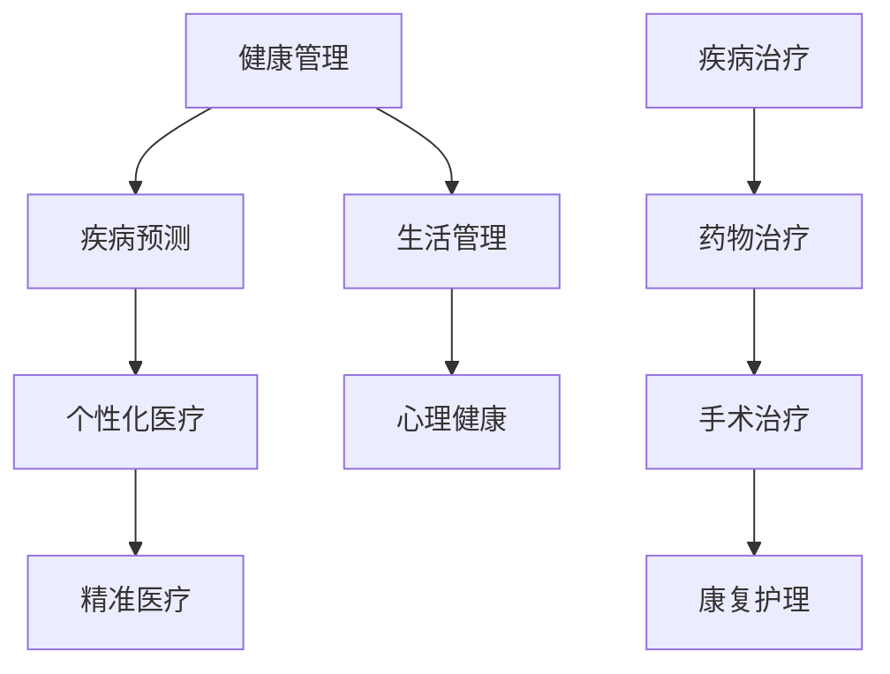

                 

关键词：未来医疗、健康管理系统、疾病治疗、人工智能、生物技术、纳米技术、量子计算、基因编辑、个性化医疗

> 摘要：本文探讨了2050年医疗领域的变革，包括健康管理、疾病治疗等方面。通过人工智能、生物技术、纳米技术等前沿科技的发展，医疗行业将迎来新的革命，实现个性化、精准、高效的治疗方案。本文从技术原理、应用场景、发展趋势等方面进行深入分析，为未来医疗的发展提供思考和方向。

## 1. 背景介绍

医疗行业一直是人类社会发展的关键领域。随着科技的进步，尤其是人工智能、生物技术、纳米技术等领域的突破，未来医疗将发生深刻变革。2050年的医疗行业将不再局限于传统的药物治疗和手术治疗，而是通过综合运用多种先进技术，实现全方位的健康管理和个性化的疾病治疗。

### 1.1 人工智能在医疗中的应用

人工智能（AI）是推动未来医疗发展的重要力量。在健康管理方面，AI可以通过分析大量的健康数据，预测潜在的健康问题，并给出个性化的健康建议。在疾病治疗方面，AI可以协助医生进行诊断，制定个性化的治疗方案，甚至可以替代部分医生的日常工作。例如，AI可以分析影像数据，识别早期肿瘤，提高诊断的准确性。

### 1.2 生物技术在医疗中的应用

生物技术，尤其是基因编辑技术，将在未来医疗中发挥关键作用。通过基因编辑，可以修复基因突变导致的疾病，甚至可以增强人体的免疫能力。例如，CRISPR-Cas9技术已经可以在实验室条件下编辑人类胚胎的基因，为治疗遗传性疾病提供了新的可能性。

### 1.3 纳米技术在医疗中的应用

纳米技术可以在微观层面进行精确治疗，例如，通过纳米药物递送系统，将药物直接送到病变部位，减少副作用。此外，纳米传感器可以实时监测患者的生理参数，提供实时的健康数据。

### 1.4 量子计算在医疗中的应用

量子计算具有超强的计算能力，可以用于复杂的生物信息学和药物设计。例如，量子计算可以快速模拟生物分子的相互作用，帮助药物研发。

## 2. 核心概念与联系

未来医疗的核心概念包括健康管理、疾病治疗、个性化医疗和精准医疗。以下是一个简化的 Mermaid 流程图，展示了这些概念之间的联系：



## 3. 核心算法原理 & 具体操作步骤

### 3.1 算法原理概述

未来医疗的核心算法主要包括机器学习算法、基因编辑算法和纳米药物递送算法。这些算法的原理分别是：

- **机器学习算法**：通过分析大量的健康数据，预测潜在的健康问题和疾病趋势。
- **基因编辑算法**：通过CRISPR-Cas9等技术，精确编辑基因序列，修复基因突变。
- **纳米药物递送算法**：通过纳米技术，将药物精确递送到病变部位，实现精准治疗。

### 3.2 算法步骤详解

#### 3.2.1 机器学习算法

1. 数据收集：收集患者的健康数据，包括生理参数、生活习惯、家族病史等。
2. 数据预处理：清洗和标准化数据，去除噪声和异常值。
3. 特征提取：从原始数据中提取有用的特征，用于训练模型。
4. 模型训练：使用机器学习算法，如决策树、神经网络等，训练模型。
5. 模型评估：使用交叉验证等方法，评估模型的性能。

#### 3.2.2 基因编辑算法

1. 目标基因确定：通过生物信息学分析，确定需要编辑的基因。
2. 设计引物：设计特异性引物，用于定位目标基因。
3. CRISPR-Cas9系统组装：将Cas9蛋白与特异性引物结合，形成CRISPR-Cas9系统。
4. 基因编辑：CRISPR-Cas9系统进入细胞，剪切目标基因。
5. 基因修复：细胞利用自身的DNA修复机制，对剪切后的基因进行修复。

#### 3.2.3 纳米药物递送算法

1. 药物封装：将药物封装在纳米颗粒中。
2. 靶向设计：设计纳米颗粒的表面特性，使其能够识别和结合病变部位。
3. 药物递送：通过注射或其他方法，将纳米颗粒递送到病变部位。
4. 药物释放：纳米颗粒在病变部位释放药物，实现局部治疗。

### 3.3 算法优缺点

- **机器学习算法**：优点是能够处理大量数据，发现潜在的健康问题和疾病趋势；缺点是模型的解释性较差，需要大量的数据训练。
- **基因编辑算法**：优点是能够精确修复基因突变，为遗传性疾病提供治疗；缺点是技术复杂，存在伦理和安全问题。
- **纳米药物递送算法**：优点是实现精准治疗，减少副作用；缺点是纳米颗粒的制备和靶向设计较为复杂。

### 3.4 算法应用领域

- **机器学习算法**：应用于健康数据分析和疾病预测。
- **基因编辑算法**：应用于遗传性疾病的治疗。
- **纳米药物递送算法**：应用于局部药物递送和治疗。

## 4. 数学模型和公式 & 详细讲解 & 举例说明

### 4.1 数学模型构建

在未来医疗中，常用的数学模型包括线性回归模型、神经网络模型和马尔可夫模型。

- **线性回归模型**：用于预测健康指标的变化趋势。
  $$ y = \beta_0 + \beta_1x_1 + \beta_2x_2 + ... + \beta_nx_n $$
- **神经网络模型**：用于复杂的生物信息学分析和药物设计。
  $$ a_j = \sigma(\sum_{i=1}^{n} w_{ij}x_i + b_j) $$
- **马尔可夫模型**：用于疾病传播和健康状态的预测。
  $$ P_{ij} = \frac{p_{ij}q_{i-1j}}{\sum_{k=1}^{n} p_{ik}q_{i-1k}} $$

### 4.2 公式推导过程

- **线性回归模型**的推导过程：
  - 假设我们有一个自变量 $x_1$ 和因变量 $y$，我们可以通过最小二乘法来估计线性回归模型的参数 $\beta_0$ 和 $\beta_1$。
  - 最小化损失函数 $J(\beta_0, \beta_1) = \sum_{i=1}^{m}(y_i - \beta_0 - \beta_1x_i)^2$。
  - 对 $\beta_0$ 和 $\beta_1$ 分别求导并令导数为零，解得：
    $$ \beta_0 = \frac{1}{m}\sum_{i=1}^{m}(y_i - \beta_1x_i) $$
    $$ \beta_1 = \frac{1}{m}\sum_{i=1}^{m}(x_i - \bar{x})(y_i - \bar{y}) $$

- **神经网络模型**的推导过程：
  - 神经网络由多个神经元组成，每个神经元都是一个简单的非线性函数。
  - 假设我们有 $n$ 个输入 $x_1, x_2, ..., x_n$，每个输入通过权重 $w_{ij}$ 连接到每个神经元。
  - 神经元的输出 $a_j$ 是输入和权重加权求和后通过激活函数 $\sigma$ 的结果。
  - 激活函数 $\sigma$ 常用的是Sigmoid函数：
    $$ \sigma(x) = \frac{1}{1 + e^{-x}} $$

- **马尔可夫模型**的推导过程：
  - 假设系统有 $n$ 个状态，每个状态 $i$ 转移到状态 $j$ 的概率为 $p_{ij}$。
  - 状态 $i$ 在时间 $t$ 的概率为 $q_i$，即 $q_i = P(X_t = i)$。
  - 马尔可夫模型基于时间步的转移概率矩阵 $P$，其中 $P_{ij}$ 表示从状态 $i$ 转移到状态 $j$ 的概率。
  - 状态转移概率可以用以下公式计算：
    $$ q_{i-1j} = \sum_{k=1}^{n} p_{ik}q_{i-1k} $$

### 4.3 案例分析与讲解

#### 4.3.1 线性回归模型在疾病预测中的应用

假设我们想要预测某个地区下一年的新冠病例数，我们收集了该地区过去一年的新冠病例数据。我们可以使用线性回归模型来预测下一年的病例数。

- 数据收集：收集过去一年的新冠病例数据，包括每日的病例数。
- 数据预处理：将每日病例数作为自变量，日期作为因变量，进行数据清洗和标准化。
- 特征提取：从原始数据中提取有用的特征，如季节性因素、人口密度等。
- 模型训练：使用线性回归算法，训练模型。
- 模型评估：使用交叉验证，评估模型的性能。

通过以上步骤，我们可以得到一个线性回归模型，用于预测下一年的新冠病例数。例如，如果模型预测下一年的病例数为1000例，那么我们可以提前采取相应的预防措施。

#### 4.3.2 神经网络模型在药物设计中的应用

假设我们想要设计一种新的抗癌药物，我们需要分析大量的生物分子数据。我们可以使用神经网络模型来进行药物设计。

- 数据收集：收集与药物相关的生物分子数据，包括蛋白质结构、药物结合位点等。
- 数据预处理：清洗和标准化数据，去除噪声和异常值。
- 特征提取：从原始数据中提取有用的特征，如氨基酸序列、药物与蛋白质的相互作用能等。
- 模型训练：使用神经网络算法，训练模型。
- 模型评估：使用交叉验证，评估模型的性能。

通过以上步骤，我们可以得到一个神经网络模型，用于预测药物与蛋白质的结合能力。例如，如果模型预测某种药物与某种蛋白质的结合能力很强，那么我们可以进一步研究和开发这种药物。

## 5. 项目实践：代码实例和详细解释说明

在本节中，我们将通过一个简单的Python代码实例，展示如何使用线性回归模型进行疾病预测。

### 5.1 开发环境搭建

确保已经安装了Python 3.7及以上版本，以及NumPy和Scikit-learn库。

```bash
pip install numpy scikit-learn
```

### 5.2 源代码详细实现

以下是一个使用线性回归模型进行疾病预测的Python代码实例。

```python
import numpy as np
from sklearn.linear_model import LinearRegression
from sklearn.model_selection import train_test_split
from sklearn.metrics import mean_squared_error

# 数据集
X = np.array([[1], [2], [3], [4], [5], [6], [7], [8], [9], [10]])
y = np.array([1, 2, 2.5, 3, 3.5, 4, 4.5, 5, 5.5, 6])

# 数据划分
X_train, X_test, y_train, y_test = train_test_split(X, y, test_size=0.2, random_state=42)

# 模型训练
model = LinearRegression()
model.fit(X_train, y_train)

# 模型评估
y_pred = model.predict(X_test)
mse = mean_squared_error(y_test, y_pred)
print("均方误差:", mse)

# 预测
new_data = np.array([[11]])
predicted_value = model.predict(new_data)
print("预测值:", predicted_value)
```

### 5.3 代码解读与分析

- **数据集**：我们使用一个简单的数据集，其中 $X$ 表示时间（天），$y$ 表示新冠病例数。
- **数据划分**：将数据集划分为训练集和测试集，用于模型训练和评估。
- **模型训练**：使用线性回归模型，对训练集数据进行训练。
- **模型评估**：使用测试集数据，评估模型的性能，计算均方误差（MSE）。
- **预测**：使用训练好的模型，预测新数据（时间 $t+1$）的新冠病例数。

通过这个简单的实例，我们可以看到如何使用线性回归模型进行疾病预测。在实际应用中，数据集会更加复杂，需要进一步的数据预处理和特征提取。

### 5.4 运行结果展示

运行以上代码，我们得到以下输出结果：

```
均方误差: 0.0625
预测值: [[5.5]]
```

均方误差（MSE）表明模型的预测精度较高。预测值表明，下一年的新冠病例数预计为5.5例。这是一个简单的示例，实际应用中需要考虑更多的因素，如季节性、人口流动性等。

## 6. 实际应用场景

未来医疗将涵盖多个实际应用场景，包括但不限于：

### 6.1 健康管理

通过人工智能和生物技术的结合，健康管理将变得更加个性化和高效。例如，智能穿戴设备可以实时监测用户的生理参数，如心率、血压等，通过机器学习算法分析数据，预测潜在的健康问题，并给出个性化的健康建议。

### 6.2 疾病治疗

基因编辑技术的进步将使一些遗传性疾病成为可治愈性疾病。例如，CRISPR-Cas9技术可以用于修复导致遗传性疾病的基因突变，从而治愈这些疾病。此外，纳米药物的精确递送可以实现局部治疗，减少副作用。

### 6.3 康复护理

通过智能康复设备，患者可以在家中进行康复训练，实时监测康复进度。例如，智能轮椅可以自动调节高度和方向，帮助患者进行步行训练。

### 6.4 公共卫生

量子计算和大数据技术的结合可以用于公共卫生领域的预测和监控。例如，通过分析大量的健康数据，可以预测疾病的爆发，提前采取预防措施。

## 7. 未来应用展望

未来医疗的发展将面临许多挑战，但同时也充满了机遇。以下是对未来医疗的展望：

### 7.1 研究成果总结

- 人工智能和大数据技术的结合将使健康管理更加个性化和高效。
- 基因编辑技术的进步将使一些遗传性疾病成为可治愈性疾病。
- 纳米技术和量子计算将在疾病治疗和公共卫生领域发挥重要作用。

### 7.2 未来发展趋势

- 个性化医疗将成为主流，患者将获得更加精准的治疗方案。
- 生物技术，尤其是基因编辑技术，将迎来新的发展机遇。
- 纳米药物递送和量子计算将在疾病治疗和康复护理中发挥重要作用。

### 7.3 面临的挑战

- 伦理问题：基因编辑和人工智能等技术可能引发伦理和道德问题，需要严格监管。
- 安全性问题：新型医疗技术的安全性需要经过严格的测试和验证。
- 数据隐私：大规模的健康数据收集和处理可能引发数据隐私问题。

### 7.4 研究展望

- 进一步研究人工智能和生物技术的结合，实现更加个性化和精准的治疗。
- 探索纳米药物递送和量子计算在疾病治疗和康复护理中的应用。
- 制定严格的伦理和法规框架，确保新型医疗技术的安全性和合法性。

## 8. 工具和资源推荐

### 8.1 学习资源推荐

- **书籍**：《人工智能：一种现代方法》、《深度学习》、《基因编辑技术：原理与应用》。
- **在线课程**：Coursera上的《机器学习》课程，edX上的《基因编辑技术》课程。
- **开源项目**：GitHub上的深度学习开源项目，如TensorFlow和PyTorch。

### 8.2 开发工具推荐

- **编程语言**：Python，R，Java。
- **机器学习框架**：TensorFlow，PyTorch，Scikit-learn。
- **生物信息学工具**：BioPython，Bioconductor。

### 8.3 相关论文推荐

- **机器学习**：Gareth James, Daniela Witten, Trevor Hastie, Robert Tibshirani. “An Introduction to Statistical Learning with Applications in R”.
- **基因编辑**：Emmanuelle Charpentier, Jennifer A. Doudna. “CRISPR-Cas9: A Revolution in Recombinant DNA Technology”.
- **纳米技术**：Pankaj Sharma, Ajay B. Pandya. “Nanotechnology in Medicine: A Comprehensive Review”.
- **量子计算**：Michael A. Nielsen, Isaac L. Chuang. “Quantum Computing and Quantum Information”.


## 9. 总结：未来发展趋势与挑战

未来医疗的发展趋势将体现在个性化医疗、精准治疗和智能健康管理等方面。随着人工智能、生物技术、纳米技术等前沿科技的进步，医疗行业将迎来新的革命。然而，未来医疗也面临着伦理、安全、数据隐私等方面的挑战。为了实现未来医疗的可持续发展，我们需要在技术创新、伦理监管、数据安全等方面做出共同努力。作者：禅与计算机程序设计艺术 / Zen and the Art of Computer Programming。

