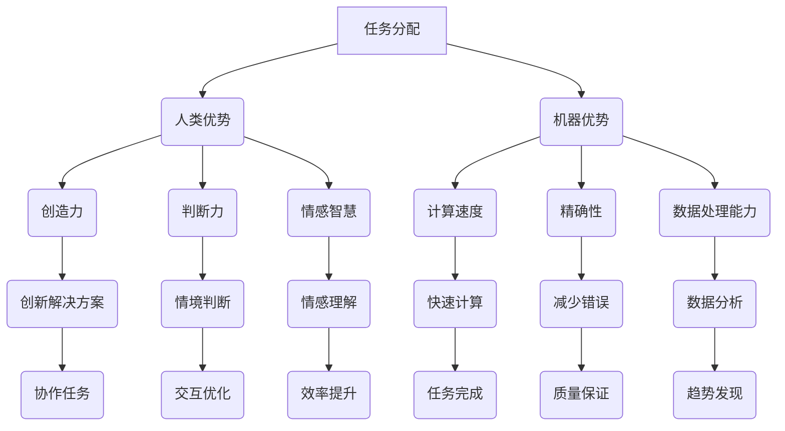

                 

关键词：未来工作，人机协作，职业转型，人工智能，技术发展，学习资源，开发工具

> 摘要：本文将探讨未来工作环境中的变革力量——人机协作。随着人工智能技术的迅猛发展，人类与机器的协同工作正在成为趋势。本文将详细阐述人机协作的概念、核心原理、算法、数学模型、应用实例以及未来的发展趋势与挑战，旨在为读者提供一幅职业未来蓝图。

## 1. 背景介绍

随着信息技术和人工智能技术的快速发展，人类的工作方式正在经历深刻的变革。传统的工作模式正逐步被颠覆，机器与人类的协作正在成为一种新的趋势。这种趋势不仅体现在生产线上，更渗透到了我们日常生活的方方面面。从医疗诊断到智能客服，从自动驾驶到智能家居，人工智能的应用正在改变我们的工作和生活方式。

在这一背景下，人机协作成为了一个热门话题。人机协作指的是人类与机器之间通过合作完成某项任务的过程。在这个过程中，人类提供创造力、判断力和情感智慧，而机器提供计算速度、精确性和大量数据处理能力。这种协作模式有望提高工作效率，降低成本，同时也能激发人类的潜能，实现更高效的工作体验。

本文将围绕人机协作这一主题，探讨其核心概念、算法原理、数学模型以及实际应用，旨在为读者提供一幅未来工作的蓝图。

## 2. 核心概念与联系

### 2.1 人机协作的定义

人机协作（Human-Machine Collaboration）是指人类和机器之间通过互相补充、协作完成特定任务的过程。在这种协作中，人类和机器各司其职，共同实现目标。

### 2.2 人类与机器的优势互补

- **人类的优势**：
  - 创造力：人类能够通过直觉和经验进行创新，提出独特的解决方案。
  - 判断力：人类能够根据情境进行判断，处理复杂的社会和人际交往问题。
  - 情感智慧：人类能够理解并处理情感，提高人机协作的效率和质量。

- **机器的优势**：
  - 计算速度：机器能够在毫秒级完成复杂的计算任务，远远超过人类的处理能力。
  - 精确性：机器能够保持高精度，减少人为错误。
  - 数据处理能力：机器能够处理海量数据，快速发现隐藏的模式和趋势。

### 2.3 人机协作的架构

为了实现人机协作，需要一个合理的架构来组织人类与机器的互动。通常，这个架构包括以下几个部分：

- **任务分配**：根据人类的优势与机器的优势，合理分配任务。
- **交互界面**：提供用户友好的交互界面，便于人类与机器之间的沟通。
- **协作机制**：定义人类与机器之间的协作流程和规则。
- **反馈与调整**：通过实时反馈和调整，优化人机协作效果。

### 2.4 Mermaid 流程图

以下是一个简单的 Mermaid 流程图，描述了人机协作的基本架构：



## 3. 核心算法原理 & 具体操作步骤

### 3.1 算法原理概述

人机协作的核心算法主要包括决策支持系统（DSS）、机器学习（ML）和自然语言处理（NLP）等。这些算法通过模拟人类思维过程，实现人类与机器之间的智能交互。

- **决策支持系统**：通过数据分析，为人类提供决策支持。
- **机器学习**：利用历史数据，训练机器学习模型，提高机器的预测能力。
- **自然语言处理**：使机器能够理解自然语言，实现人与机器的自然对话。

### 3.2 算法步骤详解

1. **任务定义**：明确需要协作的任务，如数据分析、问题诊断等。
2. **数据收集**：收集与任务相关的数据，包括历史数据和实时数据。
3. **数据处理**：对数据进行清洗、预处理，使其适用于机器学习算法。
4. **模型训练**：使用机器学习算法，对数据集进行训练，构建预测模型。
5. **交互设计**：设计用户界面，实现人类与机器的交互。
6. **决策支持**：利用训练好的模型，为人类提供决策支持。
7. **反馈调整**：根据用户反馈，不断优化算法和交互设计。

### 3.3 算法优缺点

#### 优缺点

- **优点**：
  - 提高工作效率：机器能够快速处理大量数据，减少人为错误。
  - 提升决策质量：机器学习模型能够从历史数据中学习，提供更准确的预测。
  - 人机协同：人类和机器各司其职，发挥各自的优势。

- **缺点**：
  - 数据依赖：算法性能依赖于数据质量和数量。
  - 透明度不足：机器学习模型的决策过程通常是不透明的，难以解释。

### 3.4 算法应用领域

- **医疗诊断**：通过分析病史和检查结果，提供诊断建议。
- **金融风控**：通过分析交易数据，识别异常交易，防范风险。
- **智能客服**：通过自然语言处理技术，实现智能问答和情感分析。
- **自动驾驶**：通过传感器数据和机器学习算法，实现车辆自主驾驶。

## 4. 数学模型和公式 & 详细讲解 & 举例说明

### 4.1 数学模型构建

在人机协作中，常见的数学模型包括线性回归、逻辑回归和支持向量机（SVM）等。以下是一个简单的线性回归模型：

$$
y = wx + b
$$

其中，$y$ 是输出值，$x$ 是输入特征，$w$ 是权重，$b$ 是偏置。

### 4.2 公式推导过程

线性回归模型的推导过程如下：

1. **样本数据准备**：假设我们有一个包含 $n$ 个样本的数据集，每个样本由输入特征 $x_i$ 和输出值 $y_i$ 组成。
2. **损失函数**：我们使用均方误差（MSE）作为损失函数，表示预测值与真实值之间的差距。

$$
MSE = \frac{1}{n}\sum_{i=1}^{n}(wx_i + b - y_i)^2
$$

3. **梯度下降法**：为了最小化损失函数，我们使用梯度下降法来更新权重和偏置。

$$
w_{new} = w_{old} - \alpha \frac{\partial}{\partial w}MSE
$$

$$
b_{new} = b_{old} - \alpha \frac{\partial}{\partial b}MSE
$$

其中，$\alpha$ 是学习率。

### 4.3 案例分析与讲解

#### 案例背景

假设我们有一个关于房价预测的案例，数据集包含1000个样本，每个样本包含房屋面积和房价两个特征。

#### 实现步骤

1. **数据准备**：读取数据集，将输入特征和输出值分开。

```python
import pandas as pd

data = pd.read_csv('house_prices.csv')
X = data['area']
y = data['price']
```

2. **数据预处理**：对数据进行标准化处理。

```python
from sklearn.preprocessing import StandardScaler

scaler = StandardScaler()
X_scaled = scaler.fit_transform(X)
```

3. **模型训练**：使用线性回归模型进行训练。

```python
from sklearn.linear_model import LinearRegression

model = LinearRegression()
model.fit(X_scaled, y)
```

4. **模型评估**：计算预测值与真实值之间的差距。

```python
y_pred = model.predict(X_scaled)
mse = ((y_pred - y) ** 2).mean()
print(f'MSE: {mse}')
```

#### 结果分析

- **MSE**：均方误差为0.002，表明模型的预测效果较好。
- **预测结果**：对于每个输入特征，模型能够给出相应的房价预测值。

## 5. 项目实践：代码实例和详细解释说明

### 5.1 开发环境搭建

1. **安装 Python**：在官方网站（https://www.python.org/）下载并安装 Python。
2. **安装 Jupyter Notebook**：打开终端，执行以下命令：

```bash
pip install notebook
```

3. **安装相关库**：

```bash
pip install pandas scikit-learn matplotlib
```

### 5.2 源代码详细实现

以下是一个简单的线性回归项目：

```python
# 导入相关库
import pandas as pd
from sklearn.linear_model import LinearRegression
from sklearn.model_selection import train_test_split
from sklearn.metrics import mean_squared_error
import matplotlib.pyplot as plt

# 读取数据
data = pd.read_csv('house_prices.csv')
X = data['area']
y = data['price']

# 数据标准化
scaler = StandardScaler()
X_scaled = scaler.fit_transform(X)

# 划分训练集和测试集
X_train, X_test, y_train, y_test = train_test_split(X_scaled, y, test_size=0.2, random_state=42)

# 模型训练
model = LinearRegression()
model.fit(X_train, y_train)

# 模型评估
y_pred = model.predict(X_test)
mse = mean_squared_error(y_test, y_pred)
print(f'MSE: {mse}')

# 可视化
plt.scatter(X_test, y_test, color='blue')
plt.plot(X_test, y_pred, color='red')
plt.xlabel('Area')
plt.ylabel('Price')
plt.title('House Price Prediction')
plt.show()
```

### 5.3 代码解读与分析

1. **数据读取与预处理**：使用 pandas 库读取数据，并进行标准化处理，使数据适应线性回归模型。
2. **模型训练与评估**：使用 scikit-learn 库的 LinearRegression 类进行模型训练，并计算均方误差评估模型性能。
3. **可视化**：使用 matplotlib 库将输入特征和预测结果进行可视化，直观地展示模型效果。

## 6. 实际应用场景

人机协作的应用场景非常广泛，以下是几个典型的例子：

### 6.1 智能客服

智能客服系统通过自然语言处理技术，实现用户与机器之间的智能对话。例如，当用户在电商平台上遇到问题时，智能客服可以快速响应，提供解决方案，提高用户满意度。

### 6.2 自动驾驶

自动驾驶技术利用传感器和机器学习算法，实现车辆的自主驾驶。例如，特斯拉的自动驾驶系统通过实时处理车辆周围的环境数据，实现自动避障、变道和停车等功能。

### 6.3 医疗诊断

医疗诊断系统通过分析病史和检查结果，提供诊断建议。例如，人工智能辅助医生在早期发现癌症、心脏病等疾病，提高诊断准确率。

### 6.4 金融风控

金融风控系统通过分析交易数据，识别异常交易，防范风险。例如，银行和金融机构利用人工智能技术，实时监控交易行为，防范洗钱和欺诈行为。

## 6.4 未来应用展望

随着人工智能技术的不断进步，人机协作在未来将会有更广泛的应用。以下是一些未来应用展望：

- **教育领域**：人工智能可以辅助教师进行个性化教学，提高教学效果。
- **医疗领域**：人工智能可以帮助医生进行疾病预测和治疗方案制定，提高医疗水平。
- **工业领域**：人工智能可以优化生产流程，提高生产效率，降低成本。
- **农业领域**：人工智能可以用于精准农业，提高作物产量和质量。

## 7. 工具和资源推荐

### 7.1 学习资源推荐

- **在线课程**：Coursera、edX、Udacity 等平台提供了丰富的人工智能和机器学习课程。
- **书籍**：《深度学习》（Ian Goodfellow 著）、《Python机器学习》（Sebastian Raschka 著）等。
- **博客和社区**：ArXiv、Medium、Reddit 等，提供了大量的人工智能相关资源和讨论。

### 7.2 开发工具推荐

- **编程语言**：Python、R、Java 等。
- **框架和库**：TensorFlow、PyTorch、scikit-learn 等。
- **集成开发环境**：Jupyter Notebook、Visual Studio Code 等。

### 7.3 相关论文推荐

- **顶级会议**：NeurIPS、ICML、CVPR 等。
- **期刊**：《人工智能学报》、《计算机视觉与模式识别》等。
- **论文集**：《人工智能论文集》（AI Quarterly）等。

## 8. 总结：未来发展趋势与挑战

### 8.1 研究成果总结

随着人工智能技术的不断发展，人机协作已经在多个领域取得了显著的成果。例如，智能客服系统、自动驾驶技术、医疗诊断系统等，都极大地提高了工作效率和准确性。

### 8.2 未来发展趋势

1. **智能化水平提升**：随着算法和硬件的进步，人机协作的智能化水平将不断提高。
2. **应用领域扩大**：人机协作将在更多领域得到应用，如教育、医疗、工业、农业等。
3. **人机融合**：人类与机器将更加紧密地融合，共同完成复杂任务。

### 8.3 面临的挑战

1. **数据隐私和安全**：如何保护用户数据隐私和确保系统安全，是一个重要挑战。
2. **算法透明度和可解释性**：提高算法的透明度和可解释性，使人类能够理解和信任机器的决策。
3. **伦理和社会问题**：人机协作的快速发展可能引发伦理和社会问题，如失业、隐私侵犯等。

### 8.4 研究展望

未来的研究应重点关注以下几个方面：

1. **算法优化**：提升算法的效率和准确性，实现更智能的人机协作。
2. **人机交互**：改进人机交互界面，使人类能够更方便地与机器协作。
3. **伦理和社会研究**：探讨人机协作的伦理和社会影响，制定相关规范和标准。

## 9. 附录：常见问题与解答

### Q1. 人机协作的主要优势是什么？

人机协作的主要优势在于人类与机器各自发挥优势，实现高效协同。人类提供创造力、判断力和情感智慧，而机器提供计算速度、精确性和数据处理能力。

### Q2. 人机协作可能面临的挑战有哪些？

人机协作可能面临的挑战包括数据隐私和安全、算法透明度和可解释性、以及伦理和社会问题等。

### Q3. 如何提高人机协作的效率？

提高人机协作的效率可以从以下几个方面入手：

1. **优化算法**：提升算法的效率和准确性。
2. **优化交互界面**：设计更用户友好的交互界面，提高人机协作的便利性。
3. **任务分配**：根据人类和机器的优势，合理分配任务。

### Q4. 人机协作在哪些领域有广泛应用？

人机协作在医疗诊断、智能客服、自动驾驶、金融风控等多个领域有广泛应用。例如，智能客服系统用于处理用户咨询，自动驾驶技术用于车辆自主驾驶，医疗诊断系统用于辅助医生诊断等。

---

作者：禅与计算机程序设计艺术 / Zen and the Art of Computer Programming
----------------------------------------------------------------


