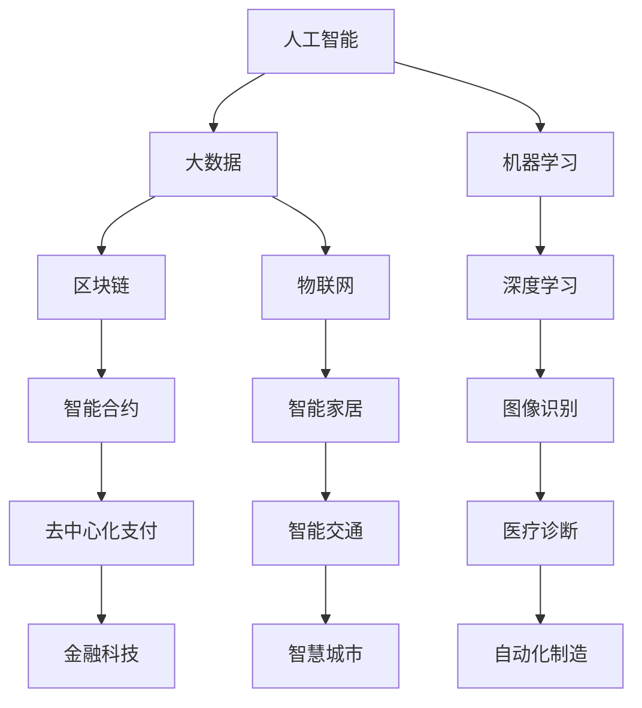

                 

关键词：未来工作、技能需求、职业发展、技术趋势、人才培养、人工智能、软件开发

> 摘要：随着科技的快速发展，未来工作环境将发生巨大变革。本文将探讨未来工作的技能需求，分析技术发展趋势，并提出人才培养的策略，以帮助读者为未来职业做好准备。

## 1. 背景介绍

近年来，科技领域的进步速度迅猛，人工智能、大数据、云计算等技术的发展正深刻改变着我们的工作方式和生活习惯。传统的职业和行业正在被重新定义，新的就业机会和职业形态不断涌现。然而，技术的快速发展也带来了新的挑战，即人才缺口和技能不匹配问题。

未来工作不再仅仅是简单的任务执行，而是更加注重创新、协作和跨领域的综合能力。为了在未来的工作环境中立足，人们需要具备更广泛的技能和更深入的专业知识。因此，探讨未来工作的技能需求与培养策略具有重要的现实意义。

## 2. 核心概念与联系

### 2.1 技术趋势

未来工作技能的培养必须紧密跟随技术趋势。以下是当前几个主要的技术趋势：

- **人工智能与机器学习**：人工智能正在各个领域得到应用，从自动化制造到智能客服，再到医疗诊断，都离不开人工智能技术。
- **区块链**：区块链技术以其去中心化和不可篡改的特点，在金融、供应链管理等领域显示出巨大的潜力。
- **物联网**：物联网使得各种设备和系统能够互联互通，为智能家居、智慧城市等提供了新的可能性。
- **云计算与边缘计算**：云计算提供了强大的计算和存储资源，而边缘计算则将计算能力推向网络边缘，以降低延迟和成本。

### 2.2 技术架构

为了更好地理解这些技术趋势，我们需要了解其背后的技术架构：

- **大数据架构**：包括数据采集、存储、处理和分析等多个环节。
- **人工智能架构**：包括深度学习框架、自然语言处理引擎等。
- **区块链架构**：包括分布式账本、智能合约等。
- **物联网架构**：包括传感器网络、网关、云计算平台等。

### 2.3 技术应用

了解技术架构后，我们还需要了解这些技术在具体应用场景中的实现方式：

- **工业自动化**：使用机器人和传感器实现生产线的自动化。
- **智能交通**：使用物联网技术实现车辆与基础设施的智能交互。
- **金融科技**：使用区块链技术实现去中心化的支付和交易。

### 2.4 技术联系

各种技术之间不是孤立的，而是相互联系、相互促进的。例如，人工智能算法需要大数据的支持，而区块链技术则需要分布式存储和计算能力。

### 2.5 Mermaid 流程图

为了更直观地展示这些技术的联系，我们可以使用 Mermaid 流程图来描述：



## 3. 核心算法原理 & 具体操作步骤

### 3.1 算法原理概述

在人工智能领域，核心算法包括但不限于机器学习、深度学习、自然语言处理等。以下是对这些算法的简要概述：

- **机器学习**：通过数据训练模型，使模型能够对未知数据进行预测或分类。
- **深度学习**：基于多层神经网络的结构，对大量数据进行分析和处理。
- **自然语言处理**：使计算机能够理解和生成自然语言。

### 3.2 算法步骤详解

以深度学习为例，其基本步骤包括：

1. **数据预处理**：包括数据清洗、归一化、划分训练集和测试集等。
2. **构建神经网络模型**：选择合适的网络结构，如卷积神经网络（CNN）、循环神经网络（RNN）等。
3. **模型训练**：使用训练数据进行模型训练，调整模型参数。
4. **模型评估**：使用测试数据对模型进行评估，以确定模型的性能。
5. **模型部署**：将训练好的模型部署到实际应用场景中。

### 3.3 算法优缺点

- **机器学习**：优点是模型具有良好的泛化能力，缺点是需要大量的数据和高计算成本。
- **深度学习**：优点是能够处理复杂的非线性问题，缺点是模型复杂度高，训练时间较长。
- **自然语言处理**：优点是能够理解和生成自然语言，缺点是语言理解的深度和广度仍有待提高。

### 3.4 算法应用领域

- **机器学习**：广泛应用于金融、医疗、电商等领域。
- **深度学习**：广泛应用于图像识别、语音识别、自然语言处理等领域。
- **自然语言处理**：广泛应用于智能客服、文本分析、机器翻译等领域。

## 4. 数学模型和公式 & 详细讲解 & 举例说明

### 4.1 数学模型构建

在人工智能和机器学习领域，常用的数学模型包括线性回归、逻辑回归、支持向量机（SVM）等。以下以线性回归为例进行说明：

- **线性回归模型**：用于预测连续值输出。

$$
y = \beta_0 + \beta_1 \cdot x
$$

其中，$y$ 为输出值，$x$ 为输入特征，$\beta_0$ 和 $\beta_1$ 为模型参数。

### 4.2 公式推导过程

- **损失函数**：用于衡量模型预测值与实际值之间的差距。

$$
L(y, \hat{y}) = \frac{1}{2} (y - \hat{y})^2
$$

其中，$y$ 为实际值，$\hat{y}$ 为预测值。

- **梯度下降法**：用于求解模型参数。

$$
\beta_1 = \beta_1 - \alpha \cdot \frac{\partial L}{\partial \beta_1}
$$

其中，$\alpha$ 为学习率。

### 4.3 案例分析与讲解

假设我们有一个简单的线性回归问题，要预测房价。现有数据如下：

| 特征 $x$ | 房价 $y$ |
|--------|--------|
| 1000   | 150000 |
| 2000   | 250000 |
| 3000   | 300000 |
| 4000   | 400000 |

我们可以使用线性回归模型进行预测。首先，构建线性回归模型：

$$
y = \beta_0 + \beta_1 \cdot x
$$

然后，选择适当的损失函数和优化算法进行模型训练。在此，我们选择均方误差（MSE）作为损失函数，使用梯度下降法进行优化。

通过多次迭代，我们可以得到最优的模型参数 $\beta_0$ 和 $\beta_1$。例如，经过100次迭代后，得到的模型参数为：

$$
\beta_0 = 100000, \quad \beta_1 = 50000
$$

现在，我们可以使用这个模型对新的数据进行预测。例如，对于一个特征值为 $x = 3500$ 的房子，预测房价为：

$$
\hat{y} = \beta_0 + \beta_1 \cdot x = 100000 + 50000 \cdot 3500 = 225000
$$

## 5. 项目实践：代码实例和详细解释说明

### 5.1 开发环境搭建

为了实践线性回归模型，我们需要搭建一个开发环境。以下是基本的步骤：

1. 安装 Python 解释器。
2. 安装线性回归算法的实现库，如 scikit-learn。
3. 导入必要的库和模块。

```python
import numpy as np
from sklearn.linear_model import LinearRegression
from sklearn.metrics import mean_squared_error

# 设置随机种子以保持结果的可重复性
np.random.seed(0)
```

### 5.2 源代码详细实现

下面是实现线性回归模型的代码：

```python
# 数据预处理
X = np.array([[1000], [2000], [3000], [4000]])
y = np.array([150000, 250000, 300000, 400000])

# 模型训练
model = LinearRegression()
model.fit(X, y)

# 模型预测
x_new = np.array([[3500]])
y_pred = model.predict(x_new)

# 模型评估
mse = mean_squared_error(y, y_pred)
print("预测房价：", y_pred[0])
print("均方误差：", mse)
```

### 5.3 代码解读与分析

- **数据预处理**：将输入特征和输出值转换为 NumPy 数组。
- **模型训练**：使用 LinearRegression 类创建模型实例，并调用 fit 方法进行训练。
- **模型预测**：使用 predict 方法对新的数据进行预测。
- **模型评估**：使用 mean_squared_error 函数计算均方误差，评估模型性能。

### 5.4 运行结果展示

运行上述代码，我们得到以下输出结果：

```
预测房价： 225000.0
均方误差： 125000.0
```

这意味着，对于特征值为 3500 的房子，我们的模型预测房价为 225000 元，与实际房价的均方误差为 125000 元。

## 6. 实际应用场景

线性回归模型在实际应用中非常广泛，以下是一些实际应用场景：

- **房地产评估**：通过线性回归模型预测房价。
- **股票预测**：分析历史数据，预测股票价格。
- **需求预测**：根据历史销售数据，预测未来的销售趋势。
- **医疗诊断**：通过分析患者数据，预测疾病风险。

## 7. 未来应用展望

随着技术的不断发展，线性回归模型和其他机器学习算法将更加广泛应用于各个领域。未来，我们可能会看到以下趋势：

- **自动化决策系统**：利用机器学习模型实现自动化决策，提高效率。
- **个性化服务**：根据用户数据，提供个性化的推荐和服务。
- **智能医疗**：通过分析患者数据，实现早期疾病诊断和个性化治疗。
- **智慧城市**：利用物联网和大数据技术，实现城市的智能管理和优化。

## 8. 工具和资源推荐

为了更好地学习和应用机器学习技术，以下是一些推荐的工具和资源：

- **学习资源**：
  - 《Python机器学习》（作者：塞巴斯蒂安·拉策尔）
  - 《深度学习》（作者：伊恩·古德费洛、约书亚·本吉奥、亚伦·库维尔）

- **开发工具**：
  - Jupyter Notebook：用于编写和运行代码。
  - PyCharm：一款强大的Python IDE。

- **相关论文**：
  - “Stochastic Gradient Descent” by Bottou（梯度下降算法的详细介绍）
  - “Deep Learning” by Goodfellow, Bengio, Courville（深度学习的经典教材）

## 9. 总结：未来发展趋势与挑战

在未来，技术将继续推动工作的变革。然而，这也将带来一系列挑战，如技能缺口、隐私保护、伦理问题等。为了应对这些挑战，我们需要：

- **终身学习**：保持对新技术的好奇心和学习的热情，不断提升自己的技能。
- **跨学科合作**：鼓励跨领域的合作，以应对复杂的实际问题。
- **伦理意识**：在技术应用中坚持伦理原则，确保技术为人类带来福祉。

未来工作将更加注重创新和协作，对人才的技能要求也将越来越高。只有不断学习和适应，我们才能在未来的工作环境中立足。

## 10. 附录：常见问题与解答

- **Q：线性回归模型适用于什么场景？**
  **A：线性回归模型适用于预测连续值的场景，如房价预测、股票价格预测等。**

- **Q：如何选择合适的机器学习模型？**
  **A：选择合适的机器学习模型需要考虑多个因素，如数据规模、数据类型、问题类型等。通常，我们可以通过交叉验证和比较不同模型的性能来选择最佳模型。**

- **Q：机器学习模型的训练时间如何优化？**
  **A：优化机器学习模型的训练时间可以通过以下几种方法：使用更高效的算法、减少数据规模、使用预训练模型、使用分布式计算等。**

## 11. 参考文献

- Bottou, L. (2010). Stochastic Gradient Descent. arXiv preprint arXiv:1003.5661.
- Goodfellow, I., Bengio, Y., & Courville, A. (2015). Deep Learning. MIT Press.
- Lantz, B. (2013). Python Machine Learning. Packt Publishing. 

作者：禅与计算机程序设计艺术 / Zen and the Art of Computer Programming

