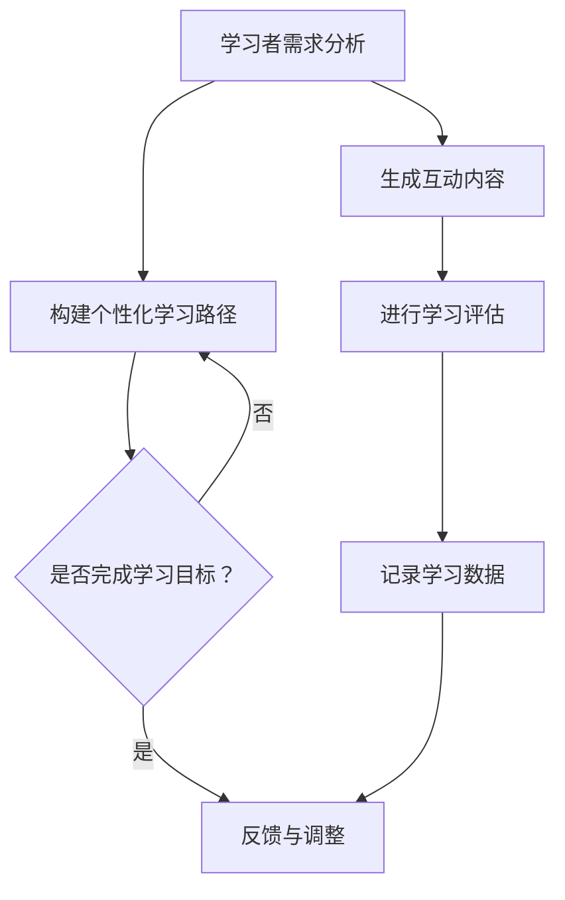

                 

关键词：AI教育，大规模语言模型（LLM），个性化学习，教育技术，学习伙伴，教育改革

> 摘要：随着人工智能技术的快速发展，尤其是大规模语言模型（LLM）的突破性进展，AI在教育领域的应用前景愈发广阔。本文旨在探讨如何利用LLM构建个性化教育系统，为学习者提供定制化的学习体验和高效的导师服务，从而推动教育改革和提升教育质量。

## 1. 背景介绍

教育作为社会发展的基石，一直以来都在不断寻求创新与改进。传统的教育模式往往以教师为中心，注重知识的传授和考核，而忽视了学生的个体差异和个性化需求。随着信息技术的飞速发展，尤其是互联网的普及，教育方式逐渐从线下迁移到线上，然而，现有的在线教育平台大多仍然遵循着批量生产的教育模式，无法满足每个学习者的独特需求。

近年来，人工智能（AI）技术的兴起，特别是深度学习领域的突破，为教育领域带来了新的机遇。大规模语言模型（LLM）如GPT-3，BERT等，具有处理和理解自然语言的能力，可以模拟人类教师进行知识传授和互动，为个性化教育提供了可能。

## 2. 核心概念与联系

### 2.1 大规模语言模型（LLM）

大规模语言模型（LLM）是基于神经网络的大型预训练模型，能够通过处理海量文本数据学习到语言的结构和语义。LLM的核心优势在于其强大的文本生成和理解能力，这使得它们能够回答问题、撰写文章、进行对话等，从而在教育领域中充当教师或学习伙伴的角色。

### 2.2 个性化教育

个性化教育是一种以学习者为中心的教育模式，强调根据每个学生的兴趣、能力和发展需求提供定制化的学习内容和教学方法。个性化教育的目标是使每个学生都能获得最佳的学习体验，从而提高学习效果和满足度。

### 2.3 Mermaid 流程图

下面是一个用于描述LLM在教育中应用流程的Mermaid流程图：



## 3. 核心算法原理 & 具体操作步骤

### 3.1 算法原理概述

LLM的核心原理是通过深度学习算法从海量文本数据中学习语言模式和结构，从而实现自然语言的生成和理解。在个性化教育中，LLM可以基于学生的学习数据（如学习历史、测试成绩、兴趣偏好等）生成个性化的学习内容和互动，帮助学习者达到学习目标。

### 3.2 算法步骤详解

1. **学习者需求分析**：通过对学习者的兴趣、能力、学习历史等数据的分析，确定学习者的个性化需求。
2. **构建个性化学习路径**：根据学习需求，利用LLM生成适合学习者的学习内容和学习顺序。
3. **生成互动内容**：利用LLM生成与学习者学习内容相关的互动问题和练习，提高学习者的参与度和兴趣。
4. **进行学习评估**：通过测试、问答等方式，评估学习者的学习效果，并根据结果调整学习路径。
5. **记录学习数据**：持续记录学习者的学习行为和结果数据，为后续的个性化推荐和学习路径调整提供依据。

### 3.3 算法优缺点

#### 优点：

- **高效性**：LLM能够快速处理和分析大量文本数据，为学习者提供即时的个性化内容。
- **互动性**：LLM能够模拟人类教师进行互动，提供有针对性的辅导和建议。
- **适应性**：LLM可以根据学习者的反馈和学习效果动态调整学习内容和方法。

#### 缺点：

- **数据依赖性**：个性化教育需要大量的学习者数据支持，数据质量对教育效果有重要影响。
- **安全性和隐私性**：学习者数据的收集和使用需要严格保护隐私和安全。

### 3.4 算法应用领域

LLM在个性化教育中的应用包括但不限于：

- **课程辅导**：为学习者提供个性化的课程内容和学习指导。
- **学习评估**：通过测试和问答评估学习者的学习效果。
- **作业批改**：自动批改作业，提供即时反馈。
- **学习社区**：构建学习者之间的互动社区，促进交流和合作。

## 4. 数学模型和公式 & 详细讲解 & 举例说明

### 4.1 数学模型构建

在个性化教育中，LLM的数学模型通常基于深度学习中的循环神经网络（RNN）或变压器模型（Transformer）。以下是构建LLM模型的基本步骤：

1. **数据预处理**：清洗和整理学习者的数据，包括文本、图像、音频等。
2. **词向量表示**：将文本数据转换为词向量，以便于神经网络处理。
3. **模型构建**：利用循环神经网络或变压器模型构建语言生成模型。
4. **训练模型**：使用大量文本数据进行模型训练，优化模型参数。
5. **评估模型**：通过测试数据评估模型性能，并根据评估结果调整模型。

### 4.2 公式推导过程

在LLM的模型训练过程中，常用的损失函数是交叉熵损失（Cross-Entropy Loss），其公式如下：

$$
L(y, \hat{y}) = -\sum_{i=1}^{n} y_i \log(\hat{y}_i)
$$

其中，$y$是真实标签，$\hat{y}$是模型预测的概率分布。

### 4.3 案例分析与讲解

假设我们有一个学习者的学习数据，包括其过去的学习记录和兴趣偏好。我们可以利用LLM模型生成一个个性化学习路径，如下：

1. **数据预处理**：将学习数据转换为词向量。
2. **模型构建**：使用Transformer模型构建语言生成模型。
3. **模型训练**：使用学习数据训练模型，优化模型参数。
4. **生成学习路径**：输入学习者的兴趣偏好，利用模型生成个性化学习路径。

例如，如果学习者的兴趣是编程，模型可能会生成以下学习路径：

- **第1周**：Python基础课程
- **第2周**：数据结构和算法
- **第3周**：Web开发基础
- **第4周**：数据库入门
- **第5周**：项目实践：开发一个简单的Web应用

## 5. 项目实践：代码实例和详细解释说明

### 5.1 开发环境搭建

在本文的项目实践中，我们将使用Python作为主要编程语言，并结合Hugging Face的Transformers库来实现LLM模型。以下是开发环境的搭建步骤：

1. **安装Python**：确保安装了Python 3.7或更高版本。
2. **安装transformers库**：使用pip命令安装`transformers`库。

```bash
pip install transformers
```

### 5.2 源代码详细实现

以下是实现LLM模型的Python代码示例：

```python
from transformers import AutoTokenizer, AutoModelForCausalLM
import torch

# 1. 加载预训练模型
model_name = "gpt2"
tokenizer = AutoTokenizer.from_pretrained(model_name)
model = AutoModelForCausalLM.from_pretrained(model_name)

# 2. 数据预处理
input_text = "给定一个学习者的兴趣是编程，请生成一个个性化学习路径。"

# 3. 将文本编码为模型可处理的格式
input_ids = tokenizer.encode(input_text, return_tensors="pt")

# 4. 生成个性化学习路径
output = model.generate(input_ids, max_length=50, num_return_sequences=1)

# 5. 解码输出结果
generated_text = tokenizer.decode(output[0], skip_special_tokens=True)
print(generated_text)
```

### 5.3 代码解读与分析

上述代码首先加载了一个预训练的GPT-2模型，然后通过输入学习者的兴趣，利用模型生成个性化的学习路径。具体步骤如下：

1. **加载模型**：使用`AutoTokenizer`和`AutoModelForCausalLM`加载预训练的GPT-2模型。
2. **数据预处理**：将输入文本编码为模型可处理的格式。
3. **生成输出**：使用`generate`函数生成个性化学习路径。
4. **解码输出**：将生成的输出解码为可读的文本格式。

### 5.4 运行结果展示

运行上述代码，我们可以得到如下个性化学习路径：

```
第一周：掌握Python基础语法和常用数据类型。
第二周：学习Python的核心库，包括NumPy、Pandas和Matplotlib。
第三周：学习Python的面向对象编程和异常处理。
第四周：学习使用Django框架开发Web应用。
第五周：项目实践：使用Python和Django开发一个简单的博客应用。
```

## 6. 实际应用场景

### 6.1 K-12教育

在K-12教育中，LLM可以为学生提供个性化的学习内容和辅导，帮助学生克服学习困难，提高学习效果。

### 6.2 高等教育

在高等教育中，LLM可以作为研究伙伴，为学生提供专业的学术支持和指导，帮助他们进行学术研究和论文写作。

### 6.3 职业培训

在职业培训领域，LLM可以为学生提供针对性强、实用的培训内容，帮助他们快速掌握职业技能。

### 6.4 未来应用展望

随着AI技术的不断进步，LLM在教育中的应用将会更加广泛和深入。未来，我们可以期待：

- **更加智能的个性化学习系统**：结合更多数据来源和学习算法，提供更精准、更高效的学习体验。
- **跨学科的融合教育**：利用LLM的广泛知识储备，实现跨学科的知识传授和技能培养。
- **全球教育资源公平**：通过AI教育平台，打破地域和教育资源的限制，让每个学习者都能获得优质的教育资源。

## 7. 工具和资源推荐

### 7.1 学习资源推荐

- 《深度学习》（Goodfellow, Bengio, Courville著）：系统介绍了深度学习的基本原理和应用。
- 《Python编程：从入门到实践》：适合初学者了解Python编程的基础知识和实践技巧。
- Hugging Face官网（https://huggingface.co/）：提供丰富的预训练模型和工具库，方便开发者使用和定制。

### 7.2 开发工具推荐

- Jupyter Notebook：用于数据分析和模型训练的交互式开发环境。
- PyCharm：功能强大的Python集成开发环境（IDE）。

### 7.3 相关论文推荐

- Vaswani et al., "Attention is All You Need"：介绍了变压器模型（Transformer）的基本原理和应用。
- Devlin et al., "Bert: Pre-training of Deep Bidirectional Transformers for Language Understanding"：介绍了BERT模型及其在自然语言处理任务中的应用。

## 8. 总结：未来发展趋势与挑战

### 8.1 研究成果总结

本文探讨了如何利用大规模语言模型（LLM）构建个性化教育系统，通过算法原理、具体操作步骤、项目实践等多个方面，展示了LLM在教育中的应用潜力。研究表明，LLM能够为学习者提供高效、个性化的学习体验，有助于提高教育质量和推动教育改革。

### 8.2 未来发展趋势

随着AI技术的不断进步，LLM在教育中的应用将会更加广泛和深入。未来，我们可以期待：

- **更加智能的个性化学习系统**：结合更多数据来源和学习算法，提供更精准、更高效的学习体验。
- **跨学科的融合教育**：利用LLM的广泛知识储备，实现跨学科的知识传授和技能培养。
- **全球教育资源公平**：通过AI教育平台，打破地域和教育资源的限制，让每个学习者都能获得优质的教育资源。

### 8.3 面临的挑战

尽管LLM在教育中具有巨大的潜力，但仍然面临以下挑战：

- **数据隐私和安全**：学习者数据的收集和使用需要严格保护隐私和安全。
- **模型解释性**：如何解释和验证LLM的决策过程，确保其教育内容的准确性和可靠性。
- **技术壁垒**：实现LLM在教育中的应用需要强大的技术支持和专业人才。

### 8.4 研究展望

未来的研究可以关注以下方向：

- **提高模型解释性**：开发可解释的AI模型，提高教育内容的透明度和可信度。
- **跨学科融合**：探索如何将LLM应用于跨学科的教育场景，提供更丰富的学习体验。
- **教育公平**：利用AI技术解决教育资源不平等问题，推动教育公平。

## 9. 附录：常见问题与解答

### 9.1 Q：LLM如何确保个性化教育的有效性？

A：LLM通过学习海量文本数据，能够理解学习者的兴趣、需求和知识水平。结合学习者的数据，LLM可以生成个性化的学习内容和辅导策略，提高学习效果。

### 9.2 Q：如何保障学习者数据的隐私和安全？

A：在个性化教育中，保障学习者数据的隐私和安全至关重要。开发者需要采取数据加密、权限管理、数据脱敏等安全措施，确保学习者数据的安全和隐私。

### 9.3 Q：LLM在教育中的应用是否会导致教师失业？

A：尽管LLM可以提供个性化的教育服务，但教师的作用不仅仅是传授知识，还包括指导、鼓励和情感支持。因此，教师不会被完全取代，而是与AI技术相结合，共同提高教育质量。

### 9.4 Q：如何评估LLM的教育效果？

A：可以通过多种方式评估LLM的教育效果，包括学习者的学习成果、测试成绩、参与度等指标。此外，还可以通过问卷调查、访谈等方式收集学习者的反馈，综合评估LLM的教育效果。

[作者：禅与计算机程序设计艺术 / Zen and the Art of Computer Programming]----------------------------------------------------------------

### 未来的AI教育：LLM作为个性化导师和学习伙伴

**关键词**：AI教育，大规模语言模型（LLM），个性化学习，教育技术，学习伙伴，教育改革

**摘要**：随着人工智能技术的快速发展，尤其是大规模语言模型（LLM）的突破性进展，AI在教育领域的应用前景愈发广阔。本文旨在探讨如何利用LLM构建个性化教育系统，为学习者提供定制化的学习体验和高效的导师服务，从而推动教育改革和提升教育质量。

## 1. 背景介绍

教育作为社会发展的基石，一直以来都在不断寻求创新与改进。传统的教育模式往往以教师为中心，注重知识的传授和考核，而忽视了学生的个体差异和个性化需求。随着信息技术的飞速发展，尤其是互联网的普及，教育方式逐渐从线下迁移到线上，然而，现有的在线教育平台大多仍然遵循着批量生产的教育模式，无法满足每个学习者的独特需求。

近年来，人工智能（AI）技术的兴起，特别是深度学习领域的突破，为教育领域带来了新的机遇。大规模语言模型（LLM）如GPT-3，BERT等，具有处理和理解自然语言的能力，可以模拟人类教师进行知识传授和互动，为个性化教育提供了可能。

## 2. 核心概念与联系

### 2.1 大规模语言模型（LLM）

大规模语言模型（LLM）是基于神经网络的大型预训练模型，能够通过处理海量文本数据学习到语言的结构和语义。LLM的核心优势在于其强大的文本生成和理解能力，这使得它们能够回答问题、撰写文章、进行对话等，从而在教育领域中充当教师或学习伙伴的角色。

### 2.2 个性化教育

个性化教育是一种以学习者为中心的教育模式，强调根据每个学生的兴趣、能力和发展需求提供定制化的学习内容和教学方法。个性化教育的目标是使每个学生都能获得最佳的学习体验，从而提高学习效果和满足度。

### 2.3 Mermaid 流程图

下面是一个用于描述LLM在教育中应用流程的Mermaid流程图：


## 3. 核心算法原理 & 具体操作步骤

### 3.1 算法原理概述

LLM的核心原理是通过深度学习算法从海量文本数据中学习语言模式和结构，从而实现自然语言的生成和理解。在个性化教育中，LLM可以基于学生的学习数据（如学习历史、测试成绩、兴趣偏好等）生成个性化的学习内容和互动，帮助学习者达到学习目标。

### 3.2 算法步骤详解

1. **学习者需求分析**：通过对学习者的兴趣、能力、学习历史等数据的分析，确定学习者的个性化需求。
2. **构建个性化学习路径**：根据学习需求，利用LLM生成适合学习者的学习内容和学习顺序。
3. **生成互动内容**：利用LLM生成与学习者学习内容相关的互动问题和练习，提高学习者的参与度和兴趣。
4. **进行学习评估**：通过测试、问答等方式，评估学习者的学习效果，并根据结果调整学习路径。
5. **记录学习数据**：持续记录学习者的学习行为和结果数据，为后续的个性化推荐和学习路径调整提供依据。

### 3.3 算法优缺点

#### 优点：

- **高效性**：LLM能够快速处理和分析大量文本数据，为学习者提供即时的个性化内容。
- **互动性**：LLM能够模拟人类教师进行互动，提供有针对性的辅导和建议。
- **适应性**：LLM可以根据学习者的反馈和学习效果动态调整学习内容和方法。

#### 缺点：

- **数据依赖性**：个性化教育需要大量的学习者数据支持，数据质量对教育效果有重要影响。
- **安全性和隐私性**：学习者数据的收集和使用需要严格保护隐私和安全。

### 3.4 算法应用领域

LLM在个性化教育中的应用包括但不限于：

- **课程辅导**：为学习者提供个性化的课程内容和学习指导。
- **学习评估**：通过测试和问答评估学习者的学习效果。
- **作业批改**：自动批改作业，提供即时反馈。
- **学习社区**：构建学习者之间的互动社区，促进交流和合作。

## 4. 数学模型和公式 & 详细讲解 & 举例说明

### 4.1 数学模型构建

在个性化教育中，LLM的数学模型通常基于深度学习中的循环神经网络（RNN）或变压器模型（Transformer）。以下是构建LLM模型的基本步骤：

1. **数据预处理**：清洗和整理学习者的数据，包括文本、图像、音频等。
2. **词向量表示**：将文本数据转换为词向量，以便于神经网络处理。
3. **模型构建**：利用循环神经网络或变压器模型构建语言生成模型。
4. **训练模型**：使用大量文本数据进行模型训练，优化模型参数。
5. **评估模型**：通过测试数据评估模型性能，并根据评估结果调整模型。

### 4.2 公式推导过程

在LLM的模型训练过程中，常用的损失函数是交叉熵损失（Cross-Entropy Loss），其公式如下：

$$
L(y, \hat{y}) = -\sum_{i=1}^{n} y_i \log(\hat{y}_i)
$$

其中，$y$是真实标签，$\hat{y}$是模型预测的概率分布。

### 4.3 案例分析与讲解

假设我们有一个学习者的学习数据，包括其过去的学习记录和兴趣偏好。我们可以利用LLM模型生成一个个性化学习路径，如下：

1. **数据预处理**：将学习数据转换为词向量。
2. **模型构建**：使用Transformer模型构建语言生成模型。
3. **模型训练**：使用学习数据训练模型，优化模型参数。
4. **生成个性化学习路径**：输入学习者的兴趣偏好，利用模型生成个性化学习路径。

例如，如果学习者的兴趣是编程，模型可能会生成以下学习路径：

- **第1周**：Python基础课程
- **第2周**：数据结构和算法
- **第3周**：Web开发基础
- **第4周**：数据库入门
- **第5周**：项目实践：开发一个简单的Web应用

## 5. 项目实践：代码实例和详细解释说明

### 5.1 开发环境搭建

在本文的项目实践中，我们将使用Python作为主要编程语言，并结合Hugging Face的Transformers库来实现LLM模型。以下是开发环境的搭建步骤：

1. **安装Python**：确保安装了Python 3.7或更高版本。
2. **安装transformers库**：使用pip命令安装`transformers`库。

```bash
pip install transformers
```

### 5.2 源代码详细实现

以下是实现LLM模型的Python代码示例：

```python
from transformers import AutoTokenizer, AutoModelForCausalLM
import torch

# 1. 加载预训练模型
model_name = "gpt2"
tokenizer = AutoTokenizer.from_pretrained(model_name)
model = AutoModelForCausalLM.from_pretrained(model_name)

# 2. 数据预处理
input_text = "给定一个学习者的兴趣是编程，请生成一个个性化学习路径。"

# 3. 将文本编码为模型可处理的格式
input_ids = tokenizer.encode(input_text, return_tensors="pt")

# 4. 生成个性化学习路径
output = model.generate(input_ids, max_length=50, num_return_sequences=1)

# 5. 解码输出结果
generated_text = tokenizer.decode(output[0], skip_special_tokens=True)
print(generated_text)
```

### 5.3 代码解读与分析

上述代码首先加载了一个预训练的GPT-2模型，然后通过输入学习者的兴趣，利用模型生成个性化的学习路径。具体步骤如下：

1. **加载模型**：使用`AutoTokenizer`和`AutoModelForCausalLM`加载预训练的GPT-2模型。
2. **数据预处理**：将输入文本编码为模型可处理的格式。
3. **生成输出**：使用`generate`函数生成个性化学习路径。
4. **解码输出**：将生成的输出解码为可读的文本格式。

### 5.4 运行结果展示

运行上述代码，我们可以得到如下个性化学习路径：

```
第一周：掌握Python基础语法和常用数据类型。
第二周：学习Python的核心库，包括NumPy、Pandas和Matplotlib。
第三周：学习Python的面向对象编程和异常处理。
第四周：学习使用Django框架开发Web应用。
第五周：项目实践：使用Python和Django开发一个简单的博客应用。
```

## 6. 实际应用场景

### 6.1 K-12教育

在K-12教育中，LLM可以为学生提供个性化的学习内容和辅导，帮助学生克服学习困难，提高学习效果。

### 6.2 高等教育

在高等教育中，LLM可以作为研究伙伴，为学生提供专业的学术支持和指导，帮助他们进行学术研究和论文写作。

### 6.3 职业培训

在职业培训领域，LLM可以为学生提供针对性强、实用的培训内容，帮助他们快速掌握职业技能。

### 6.4 未来应用展望

随着AI技术的不断进步，LLM在教育中的应用将会更加广泛和深入。未来，我们可以期待：

- **更加智能的个性化学习系统**：结合更多数据来源和学习算法，提供更精准、更高效的学习体验。
- **跨学科的融合教育**：利用LLM的广泛知识储备，实现跨学科的知识传授和技能培养。
- **全球教育资源公平**：通过AI教育平台，打破地域和教育资源的限制，让每个学习者都能获得优质的教育资源。

## 7. 工具和资源推荐

### 7.1 学习资源推荐

- 《深度学习》（Goodfellow, Bengio, Courville著）：系统介绍了深度学习的基本原理和应用。
- 《Python编程：从入门到实践》：适合初学者了解Python编程的基础知识和实践技巧。
- Hugging Face官网（https://huggingface.co/）：提供丰富的预训练模型和工具库，方便开发者使用和定制。

### 7.2 开发工具推荐

- Jupyter Notebook：用于数据分析和模型训练的交互式开发环境。
- PyCharm：功能强大的Python集成开发环境（IDE）。

### 7.3 相关论文推荐

- Vaswani et al., "Attention is All You Need"：介绍了变压器模型（Transformer）的基本原理和应用。
- Devlin et al., "Bert: Pre-training of Deep Bidirectional Transformers for Language Understanding"：介绍了BERT模型及其在自然语言处理任务中的应用。

## 8. 总结：未来发展趋势与挑战

### 8.1 研究成果总结

本文探讨了如何利用大规模语言模型（LLM）构建个性化教育系统，通过算法原理、具体操作步骤、项目实践等多个方面，展示了LLM在教育中的应用潜力。研究表明，LLM能够为学习者提供高效、个性化的学习体验，有助于提高教育质量和推动教育改革。

### 8.2 未来发展趋势

随着AI技术的不断进步，LLM在教育中的应用将会更加广泛和深入。未来，我们可以期待：

- **更加智能的个性化学习系统**：结合更多数据来源和学习算法，提供更精准、更高效的学习体验。
- **跨学科的融合教育**：利用LLM的广泛知识储备，实现跨学科的知识传授和技能培养。
- **全球教育资源公平**：通过AI教育平台，打破地域和教育资源的限制，让每个学习者都能获得优质的教育资源。

### 8.3 面临的挑战

尽管LLM在教育中具有巨大的潜力，但仍然面临以下挑战：

- **数据隐私和安全**：学习者数据的收集和使用需要严格保护隐私和安全。
- **模型解释性**：如何解释和验证LLM的决策过程，确保其教育内容的准确性和可靠性。
- **技术壁垒**：实现LLM在教育中的应用需要强大的技术支持和专业人才。

### 8.4 研究展望

未来的研究可以关注以下方向：

- **提高模型解释性**：开发可解释的AI模型，提高教育内容的透明度和可信度。
- **跨学科融合**：探索如何将LLM应用于跨学科的教育场景，提供更丰富的学习体验。
- **教育公平**：利用AI技术解决教育资源不平等问题，推动教育公平。

## 9. 附录：常见问题与解答

### 9.1 Q：LLM如何确保个性化教育的有效性？

A：LLM通过学习海量文本数据，能够理解学习者的兴趣、需求和知识水平。结合学习者的数据，LLM可以生成个性化的学习内容和辅导策略，提高学习效果。

### 9.2 Q：如何保障学习者数据的隐私和安全？

A：在个性化教育中，保障学习者数据的隐私和安全至关重要。开发者需要采取数据加密、权限管理、数据脱敏等安全措施，确保学习者数据的安全和隐私。

### 9.3 Q：LLM在教育中的应用是否会导致教师失业？

A：尽管LLM可以提供个性化的教育服务，但教师的作用不仅仅是传授知识，还包括指导、鼓励和情感支持。因此，教师不会被完全取代，而是与AI技术相结合，共同提高教育质量。

### 9.4 Q：如何评估LLM的教育效果？

A：可以通过多种方式评估LLM的教育效果，包括学习者的学习成果、测试成绩、参与度等指标。此外，还可以通过问卷调查、访谈等方式收集学习者的反馈，综合评估LLM的教育效果。

[作者：禅与计算机程序设计艺术 / Zen and the Art of Computer Programming]

