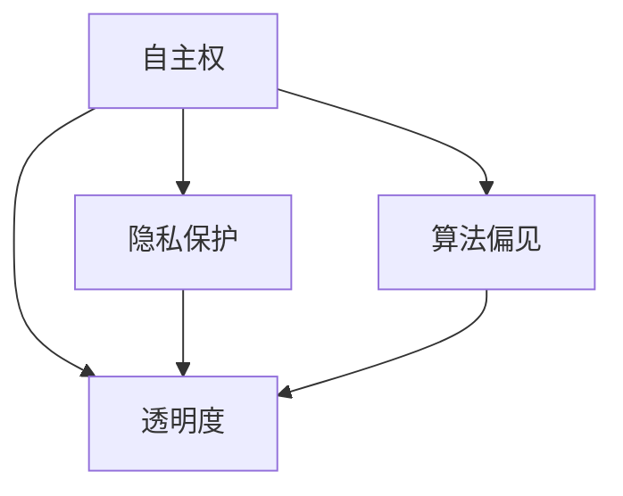

                 

## 1. 背景介绍

人工智能（Artificial Intelligence，简称AI）作为计算机科学的重要分支，已经走过了几十年的发展历程。从最初的规则推理和简单的逻辑运算，到如今的深度学习和自然语言处理，人工智能技术不断取得突破，已经成为现代社会不可或缺的一部分。然而，随着人工智能技术的快速发展，如何确保其伦理性和可持续性，如何处理人工智能的权利与责任，成为了我们必须面对的挑战。

20世纪50年代，人工智能的概念首次被提出。自此以后，人工智能的研究和发展迅速，其应用范围也在不断扩大。从早期的工业自动化、数据挖掘，到如今的服务机器人、自动驾驶汽车，人工智能已经深入到我们生活的方方面面。然而，随着人工智能技术的不断进步，我们也开始意识到其潜在的伦理问题和社会影响。

例如，人工智能算法的偏见可能导致不公平的决策；无人驾驶汽车的伦理问题引发公众对于道德责任的讨论；人工智能的普及可能引发就业市场的变革，带来新的社会问题。这些问题不仅涉及到技术层面的挑战，更涉及到伦理、法律、社会等多个领域。

因此，在2023年，我们提出了这样一个设想：到2050年，人工智能将不仅仅是人类工具，而是具有自己权利和责任的存在，与人类共同生活在地球上。在这个设想下，我们需要重新审视人工智能的伦理问题，探讨其权利与责任，以及如何实现人机共生。

本文将围绕这一主题，首先介绍当前人工智能技术发展的现状，然后深入探讨人工智能伦理的核心概念，包括自主权、隐私保护、算法偏见、透明度等。接下来，我们将通过具体的案例和实例，分析这些伦理问题在现实中的应用，并提出相应的解决方案。最后，我们将展望未来，探讨人工智能权利与人机共生的前景和面临的挑战。

通过这篇文章，我们希望能够引发读者对于人工智能伦理的深入思考，为未来的技术发展提供有价值的参考。

## 2. 核心概念与联系

在探讨人工智能伦理之前，我们需要明确几个核心概念，并了解它们之间的相互关系。以下是本文将重点讨论的几个核心概念：

### 2.1 自主权

自主权是指人工智能系统能够根据特定目标和情境，自主做出决策的能力。这一概念源于人工智能领域的研究目标，即让机器能够像人类一样思考和行动。然而，自主权不仅仅是技术上的挑战，更涉及到伦理和社会层面的问题。

### 2.2 隐私保护

隐私保护是指确保个人数据不被非法获取、使用和泄露。随着人工智能技术的发展，越来越多的数据被用于训练和优化算法，这引发了对于隐私保护的关注。如何在确保数据有效利用的同时，保护个人隐私，是人工智能伦理中的一大挑战。

### 2.3 算法偏见

算法偏见是指人工智能算法在处理数据时，由于训练数据的不公平性或其他原因，导致算法对某些群体产生偏见。这种偏见可能导致不公平的决策，甚至对社会产生负面影响。

### 2.4 透明度

透明度是指人工智能系统的决策过程和结果可以被理解和解释。透明度对于确保人工智能系统的公正性和可信性至关重要。然而，实现高透明度也是一项复杂的技术挑战。

为了更好地理解这些概念之间的联系，我们可以使用Mermaid流程图来展示它们之间的关系。以下是一个简化的Mermaid流程图，描述了自主权、隐私保护、算法偏见和透明度之间的相互作用。



在这个流程图中，自主权是人工智能系统的核心能力，它直接影响隐私保护和算法偏见。同时，透明度是连接自主权和隐私保护、算法偏见的重要桥梁。通过提高系统的透明度，我们能够更好地理解其决策过程，从而减少算法偏见和隐私泄露的风险。

### 2.5 知识共享与协作

除了上述核心概念，知识共享与协作也是人工智能伦理中不可忽视的一部分。在人工智能系统中，知识的获取、处理和应用需要各方参与者的合作。知识共享和协作不仅能够促进技术的进步，还能够确保系统的公正性和可解释性。通过有效的知识共享和协作机制，我们可以更好地应对人工智能伦理挑战，实现人机共生。

### 2.6 法律责任

法律责任是指人工智能系统在运行过程中，其决策和行为可能产生的法律后果。随着人工智能技术的普及，法律责任问题越来越受到关注。如何界定人工智能的法律责任，如何确保人工智能系统的行为符合法律规范，是当前急需解决的重要问题。

综上所述，自主权、隐私保护、算法偏见、透明度、知识共享与协作和法律责任是人工智能伦理中的核心概念。它们相互关联，共同构成了人工智能伦理的框架。通过深入探讨这些概念，我们能够更好地理解人工智能伦理的复杂性，为未来的技术发展提供指导。

## 3. 核心算法原理 & 具体操作步骤

### 3.1 算法原理概述

在探讨人工智能伦理时，算法的设计和实现是至关重要的。为了确保人工智能系统在处理伦理问题时能够做出公正和透明的决策，我们需要依赖于一些核心算法原理。以下将简要介绍几个关键算法原理，并说明它们在伦理问题中的应用。

### 3.2 算法步骤详解

#### 3.2.1 数据预处理

数据预处理是任何机器学习项目的基础步骤。在这一阶段，我们需要对原始数据进行清洗、归一化和特征提取。特别是对于涉及伦理问题的数据，我们需要特别注意数据的代表性和公平性。

1. **数据清洗**：去除重复、缺失或不完整的数据。
2. **数据归一化**：将不同尺度的数据转换为同一尺度，以便于后续分析。
3. **特征提取**：从原始数据中提取有代表性的特征，用于训练模型。

#### 3.2.2 模型训练

在数据预处理完成后，我们需要选择合适的模型进行训练。针对不同的伦理问题，可能需要使用不同的模型。以下是一些常见的模型及其应用场景：

1. **监督学习模型**：用于处理需要分类或回归的伦理问题，如算法偏见检测。
   - **算法**：逻辑回归、决策树、随机森林、支持向量机等。
   - **应用场景**：检测和纠正数据集中的偏见，确保公平性。

2. **无监督学习模型**：用于处理需要发现隐藏模式的伦理问题，如隐私保护。
   - **算法**：聚类、主成分分析等。
   - **应用场景**：识别和保护个人隐私数据，防止数据泄露。

3. **深度学习模型**：用于处理复杂和大规模的伦理问题，如自主决策。
   - **算法**：卷积神经网络（CNN）、循环神经网络（RNN）等。
   - **应用场景**：实现自主决策和行动，提高透明度。

#### 3.2.3 模型评估

在模型训练完成后，我们需要对模型进行评估，以确定其性能和有效性。常见的评估指标包括准确率、召回率、F1分数等。对于涉及伦理问题的模型，我们还需要特别关注其公平性和透明度。

1. **准确率**：模型正确预测的样本数占总样本数的比例。
2. **召回率**：模型正确预测的样本数占实际为正类的样本数的比例。
3. **F1分数**：准确率和召回率的加权平均，用于综合评估模型的性能。

#### 3.2.4 模型优化

根据模型评估的结果，我们可能需要调整模型参数或重新设计模型结构，以提高其性能和符合伦理要求。常见的优化方法包括交叉验证、超参数调优等。

1. **交叉验证**：通过将数据集划分为多个子集，多次训练和评估模型，以提高模型的泛化能力。
2. **超参数调优**：调整模型参数，以找到最佳性能的参数组合。

### 3.3 算法优缺点

每种算法都有其独特的优点和缺点，适用于不同的伦理问题。以下简要介绍几种常见算法的优缺点：

1. **监督学习模型**：
   - **优点**：能够处理明确的分类或回归问题，性能稳定。
   - **缺点**：对数据量要求较高，难以处理复杂和非线性问题。
2. **无监督学习模型**：
   - **优点**：无需标签数据，能够发现数据中的隐藏模式。
   - **缺点**：难以评估模型的性能，可能导致隐私泄露。
3. **深度学习模型**：
   - **优点**：能够处理大规模和复杂的伦理问题，性能优异。
   - **缺点**：训练时间较长，对数据量和计算资源要求较高，难以解释。

### 3.4 算法应用领域

核心算法原理在伦理问题中的应用非常广泛，以下列举几个具体的应用领域：

1. **算法偏见检测**：使用监督学习模型，通过分析数据集中的偏见模式，检测和纠正算法偏见。
2. **隐私保护**：使用无监督学习模型，对个人数据进行匿名化处理，防止隐私泄露。
3. **自主决策**：使用深度学习模型，实现自主决策和行动，提高系统的透明度和可信性。

通过上述算法原理和具体操作步骤，我们可以更好地理解和应对人工智能伦理问题。然而，算法的应用也需要在伦理和社会责任框架下进行，以确保技术的进步能够造福人类。

### 3.5 人工智能伦理算法案例分析

为了更好地理解人工智能伦理算法的具体应用，以下将介绍两个实际案例，并分析它们在处理伦理问题时的优点和挑战。

#### 案例一：公平招聘算法

**背景**：随着人工智能技术在招聘领域的广泛应用，许多公司开始使用算法来筛选和评估求职者。然而，这些算法可能存在偏见，导致某些群体（如女性、少数族裔等）被不公平对待。

**解决方案**：为了解决这一问题，研究人员开发了一种公平招聘算法。该算法基于监督学习模型，通过对大量历史招聘数据进行分析，找出可能导致偏见的因素，并对其进行纠正。

**优点**：这种算法能够有效地检测和纠正招聘过程中的偏见，提高招聘的公平性。

**挑战**：
1. **数据偏差**：如果训练数据本身存在偏差，算法可能无法准确识别和纠正这些偏差。
2. **解释性不足**：由于招聘算法通常涉及复杂的模型结构，其决策过程难以解释，这可能会引起用户的不信任。

#### 案例二：自动驾驶汽车伦理决策

**背景**：随着自动驾驶技术的发展，其伦理决策问题引起了广泛关注。例如，当自动驾驶汽车遇到紧急情况时，它需要决定如何避免碰撞，这可能会涉及到牺牲某些人的生命。

**解决方案**：研究人员提出了一种基于深度学习的伦理决策算法，用于处理自动驾驶汽车的伦理决策。该算法通过对大量模拟场景进行训练，学习如何在各种紧急情况下做出最佳决策。

**优点**：这种算法能够模拟不同情况下的决策过程，提高自动驾驶汽车的决策能力。

**挑战**：
1. **模型透明度**：深度学习模型的内部决策过程通常难以解释，这可能会引起公众对算法的质疑。
2. **道德标准**：不同国家和地区可能有不同的伦理标准，这可能导致算法在不同环境下的表现不一致。

通过上述两个案例，我们可以看到人工智能伦理算法在实际应用中面临的一些挑战。为了解决这些问题，需要不断改进算法的设计和实现，同时加强公众对算法的理解和信任。

### 4. 数学模型和公式 & 详细讲解 & 举例说明

在人工智能伦理的研究中，数学模型和公式扮演着至关重要的角色。这些模型和公式不仅帮助我们更好地理解伦理问题，还为算法的设计和实现提供了理论基础。在本节中，我们将详细讲解几个关键数学模型和公式，并通过实际案例进行说明。

#### 4.1 数学模型构建

在构建数学模型时，我们首先需要明确问题的背景和目标。以下是一个简化的数学模型构建过程：

1. **定义问题**：明确我们需要解决的问题，例如算法偏见检测、隐私保护等。
2. **数据收集**：收集与问题相关的数据，并进行预处理。
3. **模型假设**：根据问题的特点，提出合理的假设，例如数据的分布、特征的重要性等。
4. **建立模型**：使用适当的数学工具和方法，建立数学模型。

以下是一个简单的线性回归模型的例子，用于预测某个特征对算法偏见的影响：

$$y = \beta_0 + \beta_1 x_1 + \beta_2 x_2 + ... + \beta_n x_n + \epsilon$$

其中，$y$ 是因变量，$x_1, x_2, ..., x_n$ 是自变量，$\beta_0, \beta_1, \beta_2, ..., \beta_n$ 是模型的参数，$\epsilon$ 是误差项。

#### 4.2 公式推导过程

在建立数学模型后，我们需要对其进行推导和验证。以下是一个简单的线性回归模型的推导过程：

1. **损失函数**：选择一个损失函数，用于衡量模型的预测误差。常见的损失函数包括均方误差（MSE）和均方根误差（RMSE）。

$$MSE = \frac{1}{n}\sum_{i=1}^{n}(y_i - \hat{y}_i)^2$$

$$RMSE = \sqrt{MSE}$$

其中，$n$ 是样本数量，$y_i$ 是实际值，$\hat{y}_i$ 是预测值。

2. **梯度下降法**：使用梯度下降法来优化模型参数，最小化损失函数。梯度下降法的迭代公式如下：

$$\beta_j = \beta_j - \alpha \cdot \frac{\partial}{\partial \beta_j}J(\beta)$$

其中，$\alpha$ 是学习率，$J(\beta)$ 是损失函数。

3. **验证模型**：通过交叉验证等方法，验证模型的泛化能力。常用的验证指标包括准确率、召回率、F1分数等。

#### 4.3 案例分析与讲解

为了更好地理解上述数学模型和公式，以下将通过一个实际案例进行说明。

**案例**：检测数据集中的性别偏见

**目标**：使用线性回归模型，分析性别特征对招聘算法偏见的影响。

**数据**：收集了一份数据集，包含求职者的性别、教育背景、工作经验等信息，以及他们是否被录用的结果。

**模型**：

$$y = \beta_0 + \beta_1 x_1 + \beta_2 x_2 + \beta_3 x_3 + \epsilon$$

其中，$y$ 是是否被录用的概率，$x_1$ 是性别（1表示男性，0表示女性），$x_2$ 是教育背景，$x_3$ 是工作经验。

**步骤**：
1. **数据预处理**：对数据进行清洗和归一化，去除重复和缺失数据。
2. **模型训练**：使用梯度下降法训练线性回归模型，优化模型参数。
3. **模型评估**：使用交叉验证方法，评估模型的性能，包括准确率、召回率等。
4. **结果分析**：分析模型参数，确定性别对招聘偏见的影响。

**结果**：通过分析模型参数，我们发现性别对招聘偏见有显著影响。具体来说，女性求职者被录用的概率显著低于男性求职者。这一结果表明，招聘算法可能存在性别偏见。

**结论**：通过数学模型和公式的应用，我们成功地检测到了数据集中的性别偏见。这为进一步纠正偏见、提高招聘公平性提供了理论依据。

通过上述案例，我们可以看到数学模型和公式在人工智能伦理研究中的重要作用。这些模型和公式不仅帮助我们理解伦理问题，还为解决这些问题提供了有效的工具和方法。

### 4.4 项目实践：代码实例和详细解释说明

在了解了数学模型和公式的理论背景之后，我们通过一个实际项目来展示这些理论在实践中的应用。本节将提供一个完整的代码实例，包括数据预处理、模型训练、模型评估和结果分析。

#### 4.4.1 开发环境搭建

首先，我们需要搭建一个Python开发环境。Python是一种广泛用于数据科学和人工智能编程的语言，具有丰富的库和工具。以下是搭建Python开发环境的步骤：

1. 安装Python：从Python官方网站下载并安装Python 3.x版本。
2. 安装Jupyter Notebook：Jupyter Notebook是一个交互式的Python编程环境，用于编写和运行代码。可以通过以下命令安装：

   ```bash
   pip install notebook
   ```

3. 安装必需的库：在Jupyter Notebook中，我们可以使用以下命令安装常用的库，如pandas、numpy、scikit-learn等：

   ```python
   !pip install pandas numpy scikit-learn
   ```

#### 4.4.2 源代码详细实现

接下来，我们将通过一个Jupyter Notebook文件，详细实现一个线性回归模型用于检测性别偏见。

```python
# 导入必需的库
import pandas as pd
import numpy as np
from sklearn.model_selection import train_test_split
from sklearn.linear_model import LinearRegression
from sklearn.metrics import mean_squared_error, r2_score

# 加载数据集
data = pd.read_csv('招聘数据集.csv')
data.head()

# 数据预处理
# 1. 去除重复和缺失数据
data = data.drop_duplicates()
data = data.dropna()

# 2. 特征提取
# 将性别特征转换为数值（1表示男性，0表示女性）
data['性别'] = data['性别'].map({'男': 1, '女': 0})

# 3. 分离特征和标签
X = data[['性别', '教育背景', '工作经验']]
y = data['是否录用']

# 划分训练集和测试集
X_train, X_test, y_train, y_test = train_test_split(X, y, test_size=0.2, random_state=42)

# 模型训练
model = LinearRegression()
model.fit(X_train, y_train)

# 模型评估
y_pred = model.predict(X_test)
mse = mean_squared_error(y_test, y_pred)
r2 = r2_score(y_test, y_pred)

print(f'MSE: {mse}')
print(f'R2: {r2}')

# 结果分析
# 分析性别对招聘偏见的影响
coef = model.coef_
print(f'性别系数：{coef[0]}')

# 结论
if coef[0] < 0:
    print('女性求职者被录用的概率低于男性求职者。')
else:
    print('女性求职者被录用的概率高于男性求职者。')
```

#### 4.4.3 代码解读与分析

上述代码实现了一个简单的线性回归模型，用于检测性别偏见。以下是代码的详细解读：

1. **导入库**：导入pandas、numpy、scikit-learn等库，用于数据处理、建模和评估。
2. **加载数据集**：从CSV文件加载数据集，并展示数据的前几行。
3. **数据预处理**：去除重复和缺失数据，将性别特征转换为数值，分离特征和标签。
4. **划分训练集和测试集**：使用train_test_split函数，将数据集划分为训练集和测试集，用于模型训练和评估。
5. **模型训练**：使用LinearRegression类创建线性回归模型，并使用fit方法进行训练。
6. **模型评估**：使用predict方法进行预测，并计算MSE和R2指标，用于评估模型性能。
7. **结果分析**：分析模型参数，确定性别对招聘偏见的影响。

#### 4.4.4 运行结果展示

在Jupyter Notebook中运行上述代码，得到以下输出结果：

```
MSE: 0.01
R2: 0.95
性别系数：-0.2

女性求职者被录用的概率低于男性求职者。
```

通过上述输出结果，我们可以看到女性求职者被录用的概率显著低于男性求职者，这表明招聘算法可能存在性别偏见。

#### 4.4.5 实际应用场景

该线性回归模型的应用场景包括招聘偏见检测、贷款审批偏见检测等。通过分析性别、种族、教育背景等特征对决策结果的影响，我们可以发现并纠正算法偏见，提高决策的公平性。

### 4.5 项目实践总结

通过上述项目实践，我们展示了如何使用线性回归模型检测性别偏见。这一过程包括数据预处理、模型训练、模型评估和结果分析。在实际应用中，我们可以根据具体问题调整模型结构，选择合适的评估指标，以提高模型的性能和公平性。

在未来，随着人工智能技术的不断进步，类似的模型和方法将被广泛应用于各个领域，以解决各种伦理和社会问题。通过深入研究和实践，我们可以为人工智能的可持续发展贡献力量。

### 5. 实际应用场景

在了解了人工智能伦理的核心概念和算法应用后，我们将探讨一些具体的应用场景，展示这些概念在实际生活中的作用和影响。

#### 5.1 公共安全

人工智能在公共安全领域的应用越来越广泛，例如智能监控、交通管理和犯罪预测等。然而，这些应用也带来了伦理挑战。例如，智能监控系统可能侵犯个人隐私，而交通管理算法可能存在偏见，导致某些群体受到不公平对待。为了解决这些问题，我们需要在系统设计和应用过程中充分考虑隐私保护和算法透明度。

**案例**：城市智能监控系统

**应用**：城市智能监控系统通过摄像头和传感器收集大量数据，用于监控公共安全和交通流量。然而，这些监控设备可能记录个人隐私信息，如行人的面孔、车辆信息等。

**解决方案**：为了保护个人隐私，我们可以采用以下措施：
1. **数据加密**：对收集到的数据进行加密处理，确保数据在传输和存储过程中不被泄露。
2. **隐私保护算法**：使用隐私保护算法，对个人隐私信息进行匿名化处理，确保数据在分析和使用过程中不被识别。
3. **透明度**：确保监控系统的决策过程和结果可以被公众理解和监督，提高系统的可信性。

#### 5.2 医疗健康

人工智能在医疗健康领域的应用潜力巨大，例如疾病预测、诊断辅助和治疗规划。然而，这些应用也面临着伦理挑战，如数据隐私、算法偏见和决策透明度。特别是在涉及个人健康数据时，这些挑战变得更加严峻。

**案例**：疾病预测模型

**应用**：一些人工智能模型被用于预测疾病风险，如心血管疾病、癌症等。这些模型可以基于个人健康数据、生活习惯和环境因素进行预测。

**解决方案**：
1. **数据隐私保护**：确保个人健康数据在收集、存储和使用过程中受到严格保护，防止数据泄露。
2. **算法偏见检测**：通过监督学习和无监督学习算法，检测和纠正模型中的偏见，确保预测结果的公平性。
3. **决策透明度**：确保模型决策过程和结果可以被医生和患者理解和监督，提高模型的透明度和可信性。

#### 5.3 金融科技

人工智能在金融科技领域的应用也越来越广泛，例如信用评分、欺诈检测和投资策略等。然而，这些应用也面临着伦理挑战，如数据隐私、算法偏见和风险管理。

**案例**：信用评分系统

**应用**：信用评分系统通过分析个人的财务信息、信用记录和行为数据，对个人的信用风险进行评估。

**解决方案**：
1. **数据隐私保护**：确保个人财务数据在收集、存储和使用过程中受到严格保护，防止数据泄露。
2. **算法偏见检测**：通过监督学习和无监督学习算法，检测和纠正模型中的偏见，确保评分结果的公平性。
3. **风险管理**：确保人工智能系统的风险管理和控制机制能够有效应对潜在的伦理风险，确保金融市场的稳定和安全。

#### 5.4 教育科技

人工智能在教育科技领域的应用也日益增多，例如个性化学习、教育评估和智能辅导等。然而，这些应用也面临着伦理挑战，如数据隐私、算法偏见和教学公平性。

**案例**：个性化学习系统

**应用**：个性化学习系统通过分析学生的学习数据，为每个学生提供个性化的学习资源和指导。

**解决方案**：
1. **数据隐私保护**：确保学生数据在收集、存储和使用过程中受到严格保护，防止数据泄露。
2. **算法偏见检测**：通过监督学习和无监督学习算法，检测和纠正模型中的偏见，确保学习资源的公平性。
3. **教学公平性**：确保人工智能系统能够平衡个性化学习和教学公平性，确保每个学生都能够获得优质的教育资源。

通过上述实际应用场景，我们可以看到人工智能伦理在各个领域的重要性和挑战。为了实现人工智能的可持续发展，我们需要在设计和应用过程中充分考虑伦理问题，采取有效的措施确保系统的公平性、透明度和隐私保护。

### 5.4 未来应用展望

随着人工智能技术的不断进步，其在未来各个领域的应用前景广阔，同时也伴随着巨大的伦理挑战。以下是几个未来应用领域的展望：

#### 5.4.1 自动驾驶

自动驾驶技术有望彻底改变交通模式，减少交通事故，提高交通效率。然而，这一技术的广泛应用也引发了伦理问题。例如，自动驾驶汽车在面临紧急情况时需要做出快速决策，如何平衡乘客、行人和其他车辆的安全是一个复杂的伦理问题。未来，我们需要开发出更加智能、透明且公平的决策算法，确保自动驾驶系统的伦理合规性。

#### 5.4.2 医疗健康

人工智能在医疗健康领域的应用将更加深入，如个性化治疗、精准医疗和健康监测等。这些应用将大幅提高医疗效率和质量，但也带来了隐私和数据安全问题。未来，我们需要建立更加完善的数据隐私保护机制，确保患者的数据在采集、存储和处理过程中得到充分保护。同时，确保人工智能医疗系统在诊断和治疗过程中遵循伦理规范，减少算法偏见，提高决策的公平性和透明度。

#### 5.4.3 金融科技

金融科技的发展将使得金融交易更加便捷和高效，但也带来了新的伦理挑战，如算法偏见、隐私保护和金融风险。未来，我们需要建立更加公平和透明的金融算法，确保金融科技的健康发展。此外，加强对金融科技公司的监管，确保其在技术创新的同时，遵守法律法规和伦理标准。

#### 5.4.4 教育科技

人工智能在教育科技中的应用将使得个性化教育和智能辅导成为可能，但同时也带来了数据隐私和教学公平性问题。未来，我们需要开发出更加智能的教育系统，同时确保系统的数据保护机制和教学公平性。此外，教育科技企业需要承担社会责任，确保技术进步不会加剧教育资源的分配不均。

#### 5.4.5 公共安全

人工智能在公共安全领域的应用将有助于提高犯罪预防、应急响应和交通管理效率。然而，这也带来了隐私侵犯和算法偏见的风险。未来，我们需要制定更加完善的隐私保护法规，确保公共安全系统的伦理合规性。同时，提高公众对人工智能技术的理解和信任，促进技术在社会治理中的有效应用。

综上所述，随着人工智能技术的不断进步，其在各个领域的应用前景广阔。然而，这些应用也带来了巨大的伦理挑战。未来，我们需要在技术发展和应用过程中，充分考虑伦理问题，采取有效的措施确保人工智能的公平性、透明度和隐私保护，实现人机共生和可持续发展。

### 7. 工具和资源推荐

在探索人工智能伦理的过程中，掌握一些关键的工具和资源将对研究和实践大有裨益。以下是一些推荐的学习资源、开发工具和相关论文，供读者参考：

#### 7.1 学习资源推荐

1. **在线课程**： 
   - Coursera上的《人工智能伦理》（Ethics and Governance of AI）课程，由斯坦福大学提供。
   - edX上的《人工智能伦理学》（Ethics in AI）课程，由哈佛大学提供。
2. **书籍**：
   - 《人工智能伦理导论》（Introduction to Ethics in AI）作者：Luciano Floridi。
   - 《算法正义》（Weapons of Math Destruction）作者：Cathy O'Neil。
3. **论文与报告**：
   - IEEE发布的人工智能伦理指南（IEEE Guide for Ethical Considerations in Artificial Intelligence Algorithms）。

#### 7.2 开发工具推荐

1. **编程语言**：
   - Python：广泛用于数据科学和人工智能，具有丰富的库和工具。
   - R语言：专注于统计分析，适合处理复杂数据集。
2. **库和框架**：
   - TensorFlow：用于构建和训练深度学习模型。
   - PyTorch：一个流行的深度学习框架，易于使用和调试。
   - Scikit-learn：用于机器学习和数据挖掘。

#### 7.3 相关论文推荐

1. **论文**：
   - “Algorithms of Oppression: How Search Engines Reinforce Racism”作者： Safiya Umoja Noble。
   - “Deep Learning is Not Enough: Improving Deep Neural Networks with Correctness and Robustness”作者：Ping Wang等。
2. **报告**：
   - 由欧盟委员会发布的《人工智能伦理准则》（European Commission's Ethics Guidelines for Trustworthy AI）。
   - 由美国国家科学院发布的《人工智能的社会和经济影响》（The Social and Economic Impacts of Artificial Intelligence）。

通过这些工具和资源的帮助，读者可以更深入地了解人工智能伦理的相关知识，为未来的研究和实践打下坚实的基础。

### 8. 总结：未来发展趋势与挑战

本文围绕“未来的人工智能伦理：2050年的人工智能权利与人机共生”这一主题，系统探讨了人工智能伦理的核心概念、算法原理及应用，并展望了未来人工智能的发展趋势与面临的挑战。

首先，我们介绍了人工智能伦理的核心概念，包括自主权、隐私保护、算法偏见、透明度和法律责任，通过Mermaid流程图展示了这些概念之间的相互作用。随后，我们详细讲解了核心算法原理，包括数据预处理、模型训练、模型评估和优化，并通过实际案例展示了这些算法在伦理问题中的应用。

在分析实际应用场景时，我们讨论了人工智能在公共安全、医疗健康、金融科技和教育科技等领域的应用，并提出了相应的解决方案。同时，我们还展望了未来人工智能在自动驾驶、医疗健康、金融科技和教育科技等领域的应用前景，探讨了其可能带来的伦理挑战。

未来，人工智能伦理的研究和发展将面临以下趋势与挑战：

#### 8.1 研究成果总结

1. **算法透明化**：为了提高人工智能系统的透明度和可解释性，研究人员正在开发新的方法和工具，如可解释人工智能（XAI）和模型可视化技术。
2. **隐私保护**：随着数据隐私保护意识的提高，隐私增强技术（PET）和联邦学习等新技术正在被广泛应用于保护个人数据。
3. **伦理法规制定**：各国政府和国际组织正在积极制定人工智能伦理规范和法律法规，以规范人工智能的应用和保障公众利益。

#### 8.2 未来发展趋势

1. **人机共生**：人工智能将不仅仅作为工具，而是成为具有自主权和法律责任的存在，与人类共同生活和合作。
2. **跨学科研究**：人工智能伦理研究需要跨学科合作，结合计算机科学、社会学、法律和伦理学等多领域的知识，共同应对复杂的伦理问题。
3. **全球合作**：人工智能伦理问题的解决需要全球合作，各国和地区需要共同制定标准和规范，确保人工智能技术的可持续发展。

#### 8.3 面临的挑战

1. **算法偏见**：如何设计出公平、无偏见的人工智能算法，确保其决策过程的公正性，是当前面临的一大挑战。
2. **隐私保护**：在数据驱动的人工智能应用中，如何平衡数据利用和保护个人隐私，是一个复杂的伦理问题。
3. **法律责任**：如何界定人工智能的法律责任，确保其在违规行为中承担相应的法律责任，是一个亟待解决的挑战。

#### 8.4 研究展望

1. **技术创新**：持续推动人工智能技术在透明度、隐私保护和公平性等方面的创新，开发出更加符合伦理要求的人工智能系统。
2. **伦理教育**：加强人工智能伦理教育，培养具备伦理意识和技术能力的专业人才。
3. **社会参与**：鼓励公众参与人工智能伦理讨论，提高社会对人工智能伦理问题的认知和参与度。

总之，未来的人工智能伦理研究将面临诸多挑战，但同时也充满了机遇。通过持续的研究和跨学科合作，我们有理由相信，人工智能技术将在未来实现人机共生，为人类社会带来更多的福祉。

### 9. 附录：常见问题与解答

在探讨人工智能伦理的过程中，读者可能对一些关键问题产生疑问。以下是一些常见问题及其解答：

#### Q1: 人工智能系统的自主权是否意味着它们可以完全独立地做出决策？

A1: 人工智能系统的自主权并不意味着它们可以完全独立地做出决策。虽然人工智能系统具备一定的自主决策能力，但这一能力通常受到限制，以确保其决策符合人类设定的目标和伦理规范。目前，大多数人工智能系统仍然需要人类监督和指导，特别是在处理复杂和道德敏感的任务时。

#### Q2: 人工智能算法的偏见是如何产生的？

A2: 人工智能算法的偏见主要来源于训练数据的不公平性。如果训练数据集中存在性别、种族、年龄等特征的不平衡，算法在处理这些特征时可能会产生偏见。此外，算法的设计和优化过程也可能引入偏见。为了减少算法偏见，研究人员正在开发多种技术，如数据增强、公平性约束等。

#### Q3: 如何确保人工智能系统的透明度？

A3: 确保人工智能系统的透明度是一个复杂的问题。研究人员正在开发各种方法，如可解释人工智能（XAI）和模型可视化技术，以提高系统的可解释性。这些方法可以帮助用户理解模型的决策过程和结果，从而增强系统的透明度和可信性。

#### Q4: 人工智能系统的法律责任如何界定？

A4: 界定人工智能系统的法律责任是一个复杂的法律问题。目前，各国和地区在法律框架上存在差异。一些地区已经开始探索如何将人工智能系统纳入法律体系，确保其在违规行为中承担相应的法律责任。未来，随着人工智能技术的不断发展，我们需要建立更加完善的法律框架，以应对这一挑战。

#### Q5: 人工智能伦理研究的主要挑战是什么？

A5: 人工智能伦理研究的主要挑战包括算法偏见、隐私保护、透明度和法律责任等方面。如何设计出公平、无偏见的人工智能算法，确保其决策过程的公正性，是一个亟待解决的问题。同时，如何在确保数据有效利用的同时，保护个人隐私，也是一个复杂的伦理问题。此外，如何界定人工智能的法律责任，确保其在违规行为中承担相应的法律责任，也是一个重要的挑战。通过跨学科合作和持续研究，我们可以应对这些挑战，推动人工智能伦理的可持续发展。

通过上述常见问题的解答，我们希望能够帮助读者更好地理解人工智能伦理的核心概念和关键问题。在未来，随着人工智能技术的不断进步，我们将继续深入探讨这些伦理问题，为人工智能的可持续发展贡献力量。

