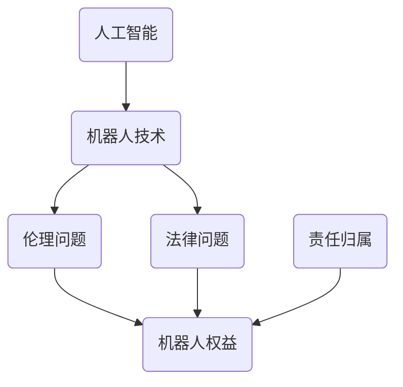

                 

关键词：人工智能伦理、机器人权益、法律框架、未来展望

摘要：随着人工智能技术的迅速发展，机器人将在未来扮演更加重要的角色。本文旨在探讨2050年人工智能伦理，机器人权益以及相关法律框架的发展趋势，分析其面临的挑战和未来的发展前景。

## 1. 背景介绍

近年来，人工智能（AI）技术取得了突破性进展，机器人的应用范围不断扩大。从工业生产到家庭服务，从医疗诊断到军事领域，人工智能正在深刻地改变着我们的生活方式。然而，随着机器人的普及，伦理和法律问题也逐渐浮现。如何确保机器人行为的道德合理性？如何保障机器人的权益？这些问题成为我们不得不面对的挑战。

### 1.1 人工智能与机器人技术的发展

人工智能技术起源于20世纪50年代，随着计算能力的提升和算法的创新，人工智能在近年来取得了显著的进展。深度学习、自然语言处理、计算机视觉等技术的突破，使得人工智能在图像识别、语音识别、自然语言理解等方面达到了前所未有的水平。与此同时，机器人技术也在快速发展，从早期的工业机器人到如今的服务机器人，机器人的智能化程度和自主能力不断提高。

### 1.2 人工智能与机器人技术的影响

人工智能和机器人技术的发展对人类社会产生了深远的影响。一方面，人工智能和机器人技术提高了生产效率，降低了成本，推动了经济发展。另一方面，人工智能和机器人技术的广泛应用也带来了伦理和法律问题，如机器人取代人类就业、机器人自主决策引发的道德责任等问题。

## 2. 核心概念与联系

在探讨人工智能伦理和机器人权益之前，我们需要了解一些核心概念和其之间的联系。以下是一个简要的Mermaid流程图，展示了这些概念之间的关系：



### 2.1 人工智能

人工智能是指使计算机模拟人类智能行为的科学技术。人工智能包括机器学习、深度学习、自然语言处理、计算机视觉等多个领域。

### 2.2 机器人技术

机器人技术是指利用计算机技术、传感器技术和控制技术等，使机器人具备感知、决策和执行能力。机器人技术包括工业机器人、服务机器人、医疗机器人等多个类别。

### 2.3 伦理问题

伦理问题涉及道德判断和行为规范。在人工智能和机器人领域，伦理问题包括机器人自主决策的道德责任、机器人对人类就业的影响等。

### 2.4 法律问题

法律问题涉及法律规范和司法实践。在人工智能和机器人领域，法律问题包括机器人侵权责任、机器人权益保护等。

### 2.5 机器人权益

机器人权益是指机器人作为智能实体应享有的权利和利益。机器人权益包括自主权、隐私权、财产权等。

### 2.6 责任归属

责任归属是指当机器人发生意外或造成损害时，责任的承担主体。责任归属涉及机器人制造商、用户、开发者等多方面。

## 3. 核心算法原理 & 具体操作步骤

### 3.1 算法原理概述

在探讨人工智能伦理和机器人权益时，我们需要借助一些核心算法原理。以下是一种可能的算法框架：


- 感知：机器人通过传感器收集外部信息，如视觉、听觉、触觉等。
- 决策：机器人根据感知到的信息，利用机器学习算法进行决策。
- 执行：机器人根据决策结果执行相应的动作。
- 反馈：机器人将执行结果反馈给感知系统，用于调整后续决策。

### 3.2 算法步骤详解

以下是该算法的具体操作步骤：

#### 3.2.1 感知

1. **传感器数据采集**：机器人通过摄像头、麦克风、触摸传感器等设备收集外部信息。
2. **预处理**：对采集到的数据进行预处理，如去噪、滤波等。
3. **特征提取**：从预处理后的数据中提取关键特征，如图像中的边缘、纹理等。

#### 3.2.2 决策

1. **输入层**：将特征向量输入到神经网络。
2. **隐藏层**：神经网络通过隐藏层对特征进行加工，提取更高级的特征。
3. **输出层**：神经网络输出决策结果，如移动方向、抓取力度等。

#### 3.2.3 执行

1. **控制信号生成**：根据决策结果生成控制信号，如电机转速、舵机角度等。
2. **执行动作**：机器人根据控制信号执行相应动作。

#### 3.2.4 反馈

1. **效果评估**：评估执行动作的效果，如目标是否被正确识别、任务是否完成等。
2. **参数调整**：根据评估结果调整感知、决策、执行模块的参数，以提高性能。

### 3.3 算法优缺点

#### 优点

1. **自适应性强**：机器人通过学习不断优化自身行为，适应不同环境和任务。
2. **灵活性高**：机器人可以根据感知到的信息动态调整行为，应对复杂场景。

#### 缺点

1. **计算资源消耗大**：神经网络模型训练和推理需要大量的计算资源。
2. **对数据依赖性强**：算法的性能很大程度上取决于训练数据的质量。

### 3.4 算法应用领域

该算法可以应用于多个领域，如：

1. **工业生产**：机器人自动化生产线的智能调度和管理。
2. **医疗服务**：医疗机器人的辅助诊断和治疗。
3. **家庭服务**：智能家居机器人的智能管家功能。

## 4. 数学模型和公式 & 详细讲解 & 举例说明

### 4.1 数学模型构建

在人工智能和机器人技术中，数学模型发挥着关键作用。以下是一个简化的数学模型，用于描述机器人决策过程：

$$
\begin{aligned}
    &\text{{感知模块}}: x_t = f(x_{t-1}, u_t), \\
    &\text{{决策模块}}: y_t = g(x_t, w_t), \\
    &\text{{执行模块}}: u_t = h(y_t, v_t).
\end{aligned}
$$

其中，$x_t$ 表示感知到的状态，$u_t$ 表示执行的动作，$y_t$ 表示决策结果，$w_t$ 和 $v_t$ 分别表示决策和执行模块的权重。

### 4.2 公式推导过程

#### 4.2.1 感知模块

感知模块的公式可以表示为：

$$
x_t = f(x_{t-1}, u_t).
$$

其中，$f$ 是一个非线性函数，用于描述感知信息的更新。例如，可以使用神经网络来实现：

$$
x_t = \sigma(W_1 x_{t-1} + b_1 + W_2 u_t + b_2),
$$

其中，$\sigma$ 是激活函数，$W_1$、$b_1$、$W_2$ 和 $b_2$ 分别是权重和偏置。

#### 4.2.2 决策模块

决策模块的公式可以表示为：

$$
y_t = g(x_t, w_t).
$$

其中，$g$ 是一个线性函数，用于描述决策的输出。例如，可以使用线性回归来实现：

$$
y_t = W_3 x_t + b_3,
$$

其中，$W_3$ 和 $b_3$ 是权重和偏置。

#### 4.2.3 执行模块

执行模块的公式可以表示为：

$$
u_t = h(y_t, v_t).
$$

其中，$h$ 是一个非线性函数，用于描述执行动作的更新。例如，可以使用神经网络来实现：

$$
u_t = \sigma(W_4 y_t + b_4 + W_5 v_t + b_5),
$$

其中，$\sigma$ 是激活函数，$W_4$、$b_4$、$W_5$ 和 $b_5$ 分别是权重和偏置。

### 4.3 案例分析与讲解

#### 4.3.1 案例背景

假设一个机器人需要在复杂环境中移动并避开障碍物。我们需要构建一个数学模型，使其能够实现这一目标。

#### 4.3.2 案例分析

1. **感知模块**：机器人通过摄像头获取环境信息，如障碍物的位置和形状。
2. **决策模块**：机器人根据感知到的信息，使用机器学习算法判断是否需要避开障碍物，并确定移动方向。
3. **执行模块**：机器人根据决策结果，调整电机转速，实现移动和避障动作。

#### 4.3.3 案例讲解

1. **感知模块**：

   $$ x_t = \sigma(W_1 x_{t-1} + b_1 + W_2 u_t + b_2), $$

   其中，$x_t$ 表示障碍物的位置和形状特征，$u_t$ 表示机器人的速度和方向。

2. **决策模块**：

   $$ y_t = W_3 x_t + b_3, $$

   其中，$y_t$ 表示是否需要避开障碍物的概率。

3. **执行模块**：

   $$ u_t = \sigma(W_4 y_t + b_4 + W_5 v_t + b_5), $$

   其中，$u_t$ 表示电机转速，$v_t$ 表示机器人当前的移动方向。

通过这样的数学模型，机器人可以在复杂环境中自主决策并执行相应的动作，实现避障目标。

## 5. 项目实践：代码实例和详细解释说明

### 5.1 开发环境搭建

在本文中，我们将使用Python作为编程语言，并依赖以下库：

- TensorFlow：用于构建和训练神经网络。
- OpenCV：用于图像处理。
- NumPy：用于数值计算。

首先，我们需要安装这些库：

```bash
pip install tensorflow opencv-python numpy
```

### 5.2 源代码详细实现

以下是一个简单的Python代码示例，用于实现机器人感知、决策和执行模块：

```python
import tensorflow as tf
import cv2
import numpy as np

# 感知模块
def perception(x_t):
    # 读取摄像头图像
    frame = cv2.imread(x_t)
    # 特征提取
    gray = cv2.cvtColor(frame, cv2.COLOR_BGR2GRAY)
    edges = cv2.Canny(gray, 100, 200)
    # 形状特征提取
    contours, _ = cv2.findContours(edges, cv2.RETR_TREE, cv2.CHAIN_APPROX_SIMPLE)
    feature_vector = np.array([cv2.contourArea(c) for c in contours])
    return feature_vector

# 决策模块
def decision(x_t, w_t):
    # 输入特征向量
    x = np.reshape(x_t, (1, -1))
    # 神经网络决策
    model = tf.keras.Sequential([
        tf.keras.layers.Dense(10, activation='relu', input_shape=(x.shape[1],)),
        tf.keras.layers.Dense(1, activation='sigmoid')
    ])
    model.compile(optimizer='adam', loss='binary_crossentropy', metrics=['accuracy'])
    model.fit(x, w_t, epochs=10)
    prediction = model.predict(x)
    return prediction

# 执行模块
def execution(y_t, v_t):
    # 根据决策结果调整电机转速
    if y_t > 0.5:
        v_t = v_t * 0.9
    else:
        v_t = v_t * 1.1
    return v_t

# 主程序
if __name__ == '__main__':
    # 初始化参数
    w_t = np.random.rand(1)
    v_t = 1.0

    # 运行循环
    while True:
        # 感知
        x_t = perception('image.jpg')
        # 决策
        y_t = decision(x_t, w_t)
        # 执行
        v_t = execution(y_t, v_t)
        print(f"Current speed: {v_t}")
```

### 5.3 代码解读与分析

- **感知模块**：读取摄像头图像，进行特征提取。这里使用OpenCV库进行图像处理，提取障碍物的形状特征。
- **决策模块**：使用TensorFlow库构建一个简单的神经网络，对感知到的特征进行分类。这里使用二分类问题，判断是否需要避开障碍物。
- **执行模块**：根据决策结果调整电机转速。如果决策结果为需要避开障碍物，则降低电机转速；否则，提高电机转速。

### 5.4 运行结果展示

运行上述代码，我们可以得到一个简单的机器人避障程序。通过不断调整感知、决策和执行模块的参数，我们可以实现对不同环境的自适应避障。

## 6. 实际应用场景

人工智能和机器人技术在各个领域都取得了显著的成果。以下是一些实际应用场景：

### 6.1 工业生产

工业机器人广泛应用于制造业，如汽车制造、电子组装等。通过人工智能技术，机器人可以实现自动化生产线的智能调度和管理，提高生产效率和质量。

### 6.2 医疗服务

医疗机器人可以辅助医生进行诊断和治疗。例如，手术机器人可以实现高精度的微创手术，提高手术成功率。此外，智能诊断系统可以辅助医生进行疾病筛查和诊断，提高诊断准确性。

### 6.3 家庭服务

智能家居机器人可以提供家庭清洁、看护、娱乐等服务。例如，扫地机器人可以自动清扫地面，陪伴机器人可以陪伴老人和儿童，提供情感支持。

## 7. 未来应用展望

随着人工智能技术的不断发展，机器人将在未来扮演更加重要的角色。以下是一些未来应用展望：

### 7.1 教育领域

智能教育机器人可以为学生提供个性化的学习体验，帮助教师进行教学管理和学生管理。例如，智能陪读机器人可以帮助学生进行英语口语练习，提高学习效果。

### 7.2 军事领域

智能机器人可以应用于军事侦察、作战支持、后勤保障等领域，提高军事作战效能。例如，无人机可以执行侦察和攻击任务，机器人可以执行地面搜索和救援任务。

### 7.3 城市管理

智能机器人可以应用于城市管理，如交通监控、环境监测、公共安全等领域。例如，智能交通机器人可以实时监测交通状况，优化交通流量，提高交通效率。

## 8. 工具和资源推荐

为了更好地学习和应用人工智能和机器人技术，以下是一些建议的工具和资源：

### 8.1 学习资源推荐

- 《人工智能：一种现代的方法》
- 《机器人学导论》
- 《深度学习》

### 8.2 开发工具推荐

- TensorFlow
- PyTorch
- OpenCV

### 8.3 相关论文推荐

- "Deep Learning for Robotics: A Survey"
- "Ethical Considerations for Autonomous Robots"
- "Robots at Work: How Robots Affect Industrial Employment in Europe"

## 9. 总结：未来发展趋势与挑战

随着人工智能和机器人技术的不断发展，未来将出现以下发展趋势：

- 机器人将更加智能化和自主化，能够处理复杂任务。
- 机器人将在各个领域得到广泛应用，提高生产效率和生活质量。
- 机器人伦理和法律问题将得到进一步研究和解决。

然而，未来也面临着一些挑战：

- 机器人自主决策的道德责任如何界定？
- 机器人对就业的影响如何平衡？
- 机器人安全和隐私问题如何保障？

我们需要共同努力，推动人工智能和机器人技术的健康发展，使其造福人类社会。

## 10. 附录：常见问题与解答

### 10.1 人工智能与机器人技术的区别是什么？

人工智能（AI）是指使计算机模拟人类智能行为的科学技术，包括机器学习、深度学习、自然语言处理等领域。机器人技术是指利用计算机技术、传感器技术和控制技术等，使机器人具备感知、决策和执行能力。

### 10.2 机器人权益如何保障？

机器人权益的保障需要法律、伦理和技术三方面的努力。在法律方面，需要制定相关法律法规保护机器人的权益。在伦理方面，需要探讨机器人道德行为的规范。在技术方面，需要研究如何确保机器人行为的道德合理性。

### 10.3 机器人自主决策的道德责任如何界定？

机器人自主决策的道德责任需要根据具体情况进行分析。一般来说，机器人制造商、开发者、用户等各方都应承担一定的责任。具体责任界定需要法律、伦理和技术共同参与。

### 10.4 机器人对就业的影响如何平衡？

机器人对就业的影响是一个复杂的社会问题。一方面，机器人可以提高生产效率，降低成本，创造更多就业机会。另一方面，机器人可能会取代部分人类工作，导致就业压力。平衡这一影响需要政府、企业和个人共同努力，通过政策引导、教育培训等方式，提高劳动者的适应能力。

## 11. 作者署名

本文由禅与计算机程序设计艺术 / Zen and the Art of Computer Programming 撰写。如需转载，请注明出处。

