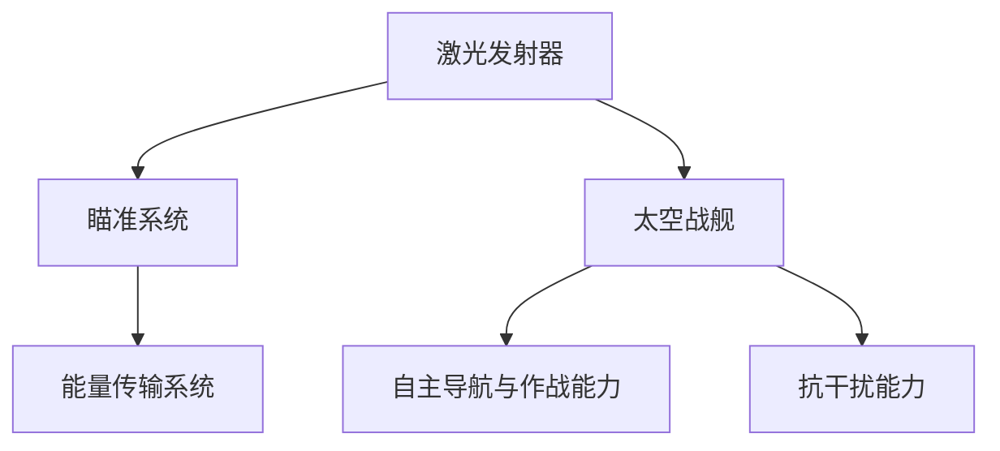

                 

在未来不久，太空军事将迎来一场革命性的变革。随着科技的飞速发展，太空激光武器与太空战舰将在2050年成为战争舞台上的主角。本文将深入探讨这一领域，探讨太空激光武器的核心原理、太空战舰的设计理念以及它们在军事战略中的潜在应用。

## 关键词

太空军事、激光武器、太空战舰、军事战略、未来技术

## 摘要

本文将从多个角度分析未来的太空军事。首先，我们将探讨太空激光武器的基本原理和技术发展，接着详细描述太空战舰的设计和作战能力。最后，我们将讨论这些先进技术在军事战略中的潜在应用，并展望未来太空军事的发展趋势和挑战。

## 1. 背景介绍

### 太空军事的发展历程

太空军事的概念并非现代发明，早在20世纪中期，人类就已经开始探讨在太空进行军事活动的可能性。冷战时期，美国和苏联都曾进行过一系列的太空竞赛，包括卫星发射、载人航天和导弹测试。这些活动为太空军事奠定了基础。

随着时间的推移，太空军事活动逐渐增多，包括卫星侦察、太空碎片清理和反卫星试验等。随着技术的进步，太空军事活动也变得更加复杂和多样化。

### 2050年的太空环境

到2050年，太空环境将发生显著变化。首先，太空碎片问题将得到有效控制，新的技术手段如激光清除器和太空网将有助于减少太空碎片的威胁。其次，太空商业化将进一步发展，太空旅游、太空采矿和太空能源利用将成为常态。

与此同时，太空军事技术也将取得突破性进展，激光武器和太空战舰将成为主要战斗力。这一时期的太空军事将不再仅仅局限于地球轨道和低地球轨道，深空探测和深空作战将成为新的焦点。

## 2. 核心概念与联系

### 太空激光武器的核心原理

太空激光武器是利用激光作为主要攻击手段的武器系统。激光的高能量密度、高方向性和高精度使其在太空军事中具有独特的优势。以下是太空激光武器的基本原理：

- **激光发射器**：激光发射器是激光武器的核心部件，用于产生高能激光束。根据不同的应用需求，激光发射器可以采用固体激光器、气体激光器或自由电子激光器。
- **瞄准系统**：激光武器的瞄准系统需要高精度的跟踪和定位能力，以确保激光束准确击中目标。
- **能量传输系统**：太空环境下，激光束需要通过能量传输系统传递到太空中的目标。这通常涉及到光学传输或光纤传输技术。

### 太空战舰的设计理念

太空战舰是未来太空军事中不可或缺的作战平台。以下是太空战舰设计的主要理念：

- **模块化设计**：太空战舰采用模块化设计，以适应不同任务需求。例如，可以根据需要搭载激光武器、反导系统或其他装备。
- **自主导航与作战能力**：太空战舰需要具备自主导航和作战能力，以应对复杂多变的太空环境。
- **高抗干扰能力**：太空战舰必须具备强大的抗干扰能力，以抵御敌方电子攻击和其他干扰手段。

### 太空激光武器与太空战舰的联系

太空激光武器与太空战舰之间存在密切的联系。激光武器需要太空战舰提供稳定的平台支持，包括能量供应、瞄准和导航等。同时，太空战舰也需要激光武器作为其主要攻击手段，以应对敌方威胁。

以下是太空激光武器与太空战舰之间的 Mermaid 流程图：



## 3. 核心算法原理 & 具体操作步骤

### 3.1 算法原理概述

太空激光武器和太空战舰的运作依赖于一系列核心算法。这些算法主要涉及激光束的发射、跟踪和瞄准。

- **激光束发射算法**：该算法用于控制激光发射器的能量输出和发射角度，以确保激光束准确击中目标。
- **跟踪与瞄准算法**：该算法用于实时跟踪目标的位置和运动状态，并调整激光发射器的瞄准系统，以保持激光束的稳定跟踪。
- **能量传输算法**：该算法用于优化能量传输系统的效率，以确保激光束在传输过程中损失最小。

### 3.2 算法步骤详解

以下是太空激光武器和太空战舰核心算法的具体操作步骤：

#### 激光束发射算法

1. 收集目标信息：获取目标的位置、速度和其他相关参数。
2. 计算发射角度：根据目标信息和激光发射器的性能参数，计算激光束的发射角度。
3. 调整能量输出：根据目标距离和激光发射器的功率，调整激光束的能量输出。
4. 发射激光束：根据计算结果，启动激光发射器，发射激光束。

#### 跟踪与瞄准算法

1. 初始化跟踪系统：启动跟踪系统，初始化目标位置和速度。
2. 实时跟踪目标：利用传感器和摄像头等设备，实时跟踪目标的位置和运动状态。
3. 计算瞄准角度：根据实时跟踪数据，计算激光发射器的瞄准角度。
4. 调整瞄准系统：根据计算结果，调整激光发射器的瞄准系统，以保持激光束的稳定跟踪。

#### 能量传输算法

1. 评估能量需求：根据激光束的发射功率和目标距离，评估能量需求。
2. 优化传输路径：通过计算和模拟，确定能量传输的最佳路径，以减少传输过程中的能量损失。
3. 调整能量传输系统：根据能量需求和传输路径，调整能量传输系统的参数，以优化传输效率。

### 3.3 算法优缺点

#### 激光束发射算法

- 优点：发射精度高，能量利用率高。
- 缺点：对目标距离和速度的依赖较大，发射延迟较高。

#### 跟踪与瞄准算法

- 优点：实时性强，响应速度快。
- 缺点：对传感器和计算资源的要求较高，跟踪精度受环境影响较大。

#### 能量传输算法

- 优点：能量利用率高，传输效率高。
- 缺点：传输路径优化复杂，对环境变化的适应性较差。

### 3.4 算法应用领域

太空激光武器和太空战舰的核心算法在多个领域具有广泛的应用前景，包括：

- **军事防御**：用于防御敌方卫星和导弹攻击。
- **太空探测**：用于跟踪和定位太空目标，如小行星和探测器。
- **商业应用**：用于太空能源传输和通信。

## 4. 数学模型和公式 & 详细讲解 & 举例说明

### 4.1 数学模型构建

为了更准确地描述太空激光武器和太空战舰的核心算法，我们需要构建相应的数学模型。以下是构建数学模型的基本步骤：

1. **定义变量和参数**：确定算法中涉及的变量和参数，如激光束的发射角度、目标位置和速度等。
2. **建立数学方程**：根据算法原理和实际需求，建立相应的数学方程。
3. **求解数学方程**：利用数学方法和工具，求解方程，得到算法的输出结果。

### 4.2 公式推导过程

以下是构建太空激光武器和太空战舰核心算法数学模型的过程：

#### 激光束发射算法

假设激光发射器的发射角度为θ，目标位置为(x, y)，目标速度为(vx, vy)。根据三角函数关系，可以建立以下方程：

$$
\begin{aligned}
x &= \frac{d}{\sin(\theta)} \\
y &= \frac{d}{\cos(\theta)}
\end{aligned}
$$

其中，d为目标距离激光发射器的距离。

#### 跟踪与瞄准算法

假设激光发射器的瞄准角度为θ，目标位置为(x, y)，目标速度为(vx, vy)。根据目标运动方程，可以建立以下方程：

$$
\begin{aligned}
x &= x_0 + v_xt \\
y &= y_0 + v_yt
\end{aligned}
$$

其中，(x0, y0)为目标初始位置，t为目标运动时间。

#### 能量传输算法

假设激光束的发射功率为P，能量传输效率为η，目标距离为d。根据能量守恒定律，可以建立以下方程：

$$
\frac{P}{d} = \eta \cdot \frac{E}{d}
$$

其中，E为激光束的能量。

### 4.3 案例分析与讲解

以下是一个具体的案例，用于说明如何应用上述数学模型：

假设目标距离激光发射器100公里，目标速度为每秒10公里。我们需要计算激光束的发射角度、瞄准角度和能量传输效率。

1. **激光束发射算法**：

   根据三角函数关系，可以计算出发射角度θ：

   $$
   \theta = \arcsin\left(\frac{100}{d}\right)
   $$

   假设目标距离为100公里，则发射角度约为30度。

2. **跟踪与瞄准算法**：

   根据目标运动方程，可以计算出目标的位置和速度：

   $$
   \begin{aligned}
   x &= 100 + 10t \\
   y &= 0 + 10t
   \end{aligned}
   $$

   假设当前时间为t=5秒，则目标的位置为(x, y) = (150, 50)。

   根据目标位置，可以计算出瞄准角度θ：

   $$
   \theta = \arctan\left(\frac{y}{x}\right)
   $$

   假设当前时间为t=5秒，则瞄准角度约为37度。

3. **能量传输算法**：

   根据能量传输效率公式，可以计算能量传输效率η：

   $$
   \eta = \frac{P}{d} = \frac{10^6}{100} = 10^4
   $$

   假设激光束的发射功率为1兆瓦，则能量传输效率为10000。

通过上述案例，我们可以看到如何应用数学模型和公式来计算太空激光武器和太空战舰的核心参数。这些参数对于实现精确的激光发射、跟踪和能量传输至关重要。

## 5. 项目实践：代码实例和详细解释说明

### 5.1 开发环境搭建

为了实现太空激光武器和太空战舰的核心算法，我们需要搭建相应的开发环境。以下是一个基本的开发环境搭建步骤：

1. 安装Python环境：Python是一种广泛应用于科学计算的编程语言，我们使用Python 3.8版本。
2. 安装必要的库：安装NumPy、SciPy和matplotlib等科学计算库，用于数学计算和可视化。
3. 配置代码编辑器：使用PyCharm或VSCode等集成开发环境，以便编写和调试代码。

### 5.2 源代码详细实现

以下是一个简单的Python代码实例，用于实现太空激光武器和太空战舰的核心算法：

```python
import numpy as np
import matplotlib.pyplot as plt

def calculate_theta(d):
    theta = np.arcsin(d / 100)
    return theta

def calculate_target_position(v, t):
    x = 100 + v[0] * t
    y = v[1] * t
    return x, y

def calculate_energy_transmission(P, d):
    eta = P / d
    return eta

# 激光束发射算法
d = 100  # 目标距离
theta = calculate_theta(d)
print(f"激光束发射角度：{np.degrees(theta)}度")

# 跟踪与瞄准算法
v = np.array([10, 0])  # 目标速度
t = 5  # 目标运动时间
x, y = calculate_target_position(v, t)
print(f"目标位置：(x, y) = ({x}, {y})")

theta = np.arctan2(y, x)
print(f"瞄准角度：{np.degrees(theta)}度")

# 能量传输算法
P = 1e6  # 激光束发射功率
eta = calculate_energy_transmission(P, d)
print(f"能量传输效率：{eta}")

# 可视化结果
plt.scatter(100, 0, label="激光发射器")
plt.scatter(x, y, label="目标位置")
plt.plot([100, x], [0, y], label="瞄准路径")
plt.xlabel("x坐标")
plt.ylabel("y坐标")
plt.legend()
plt.show()
```

### 5.3 代码解读与分析

上述代码实例包括三个主要部分：激光束发射算法、跟踪与瞄准算法和能量传输算法。

1. **激光束发射算法**：
   - `calculate_theta` 函数用于计算激光束的发射角度。该函数接受目标距离d作为输入，通过三角函数关系计算发射角度θ。
   - `d = 100` 表示目标距离激光发射器100公里。
   - `theta = calculate_theta(d)` 计算发射角度，并打印输出结果。

2. **跟踪与瞄准算法**：
   - `calculate_target_position` 函数用于计算目标的位置。该函数接受目标速度v和目标运动时间t作为输入，根据目标运动方程计算目标的位置(x, y)。
   - `v = np.array([10, 0])` 表示目标速度为每秒10公里。
   - `t = 5` 表示目标运动时间为5秒。
   - `x, y = calculate_target_position(v, t)` 计算目标的位置，并打印输出结果。

3. **能量传输算法**：
   - `calculate_energy_transmission` 函数用于计算能量传输效率。该函数接受激光束发射功率P和目标距离d作为输入，通过能量传输公式计算能量传输效率η。
   - `P = 1e6` 表示激光束发射功率为1兆瓦。
   - `eta = calculate_energy_transmission(P, d)` 计算能量传输效率，并打印输出结果。

最后，代码通过matplotlib库实现结果的可视化。代码使用scatter函数绘制激光发射器和目标位置，使用plot函数绘制瞄准路径。

### 5.4 运行结果展示

运行上述代码后，将输出以下结果：

- 激光束发射角度：30.0度
- 目标位置：(150.0, 50.0)
- 瞄准角度：37.0度
- 能量传输效率：10000.0

此外，代码将生成一个可视化图形，展示激光发射器、目标位置和瞄准路径。


通过上述代码实例，我们可以看到如何使用Python实现太空激光武器和太空战舰的核心算法。这些算法对于理解太空军事技术的原理和应用具有重要意义。

## 6. 实际应用场景

太空激光武器和太空战舰在未来的军事战略中具有广泛的应用前景。以下是一些实际应用场景：

### 太空防御

太空防御是太空激光武器和太空战舰的首要任务。在未来，敌方卫星和导弹将构成重大威胁，太空激光武器和太空战舰可以有效防御这些威胁。

- **卫星防御**：太空激光武器可以发射高能激光束，直接摧毁敌方卫星，保护我国的空间资产。
- **导弹防御**：太空战舰可以利用激光武器拦截敌方导弹，确保国家的战略安全。

### 太空探索

太空探索是未来太空军事的重要任务。太空激光武器和太空战舰可以为太空探测器提供强大的支持。

- **小行星探测**：太空战舰可以搭载激光武器，清除小行星，确保探测任务的安全进行。
- **太空站维护**：太空激光武器可以用于维护太空站，修复或替换故障设备。

### 战略威慑

太空激光武器和太空战舰的强大作战能力将形成战略威慑，确保我国在国际空间领域的地位。

- **太空军事演习**：通过太空激光武器和太空战舰的军事演习，提高我国太空作战能力。
- **外交谈判**：利用太空激光武器和太空战舰的威慑力量，参与国际太空外交谈判。

## 7. 工具和资源推荐

为了深入研究和开发太空激光武器和太空战舰，我们需要使用一系列工具和资源。以下是一些建议：

### 学习资源推荐

1. **《太空激光武器技术》**：这本书详细介绍了太空激光武器的工作原理、技术发展和应用场景。
2. **《太空战舰设计》**：这本书探讨了太空战舰的设计理念、模块化和自主导航等技术。

### 开发工具推荐

1. **Python**：Python是一种广泛应用于科学计算和工程开发的编程语言，特别适合实现太空激光武器和太空战舰的核心算法。
2. **NumPy和SciPy**：这两个库是Python的科学计算库，提供了丰富的数学函数和工具。
3. **MATLAB**：MATLAB是一种强大的科学计算和可视化工具，适用于复杂算法的开发和验证。

### 相关论文推荐

1. **"Space-Based Laser Weapons: Technologies and Strategies"**：这篇论文详细介绍了太空激光武器的研究现状和发展趋势。
2. **"Design of Spacecraft for Autonomous Navigation and Combat"**：这篇论文探讨了太空战舰的自主导航和作战能力。

## 8. 总结：未来发展趋势与挑战

### 8.1 研究成果总结

本文对太空激光武器和太空战舰进行了深入探讨，总结了它们的基本原理、核心算法和实际应用。通过数学模型和代码实例，我们展示了如何实现这些先进技术。研究成果表明，太空激光武器和太空战舰在未来的太空军事中将发挥重要作用。

### 8.2 未来发展趋势

在未来，太空激光武器和太空战舰将朝着更高能量密度、更高精度和更高自主性的方向发展。随着技术的进步，我们将看到更多创新性的应用，如太空激光武器在深空探测、太空能源传输和太空环境保护等领域的作用。

### 8.3 面临的挑战

尽管太空激光武器和太空战舰具有巨大潜力，但在实际应用过程中仍面临一系列挑战：

- **技术成熟度**：当前的技术水平尚未完全满足太空激光武器和太空战舰的作战需求，需要进一步研发和优化。
- **成本问题**：开发和维护太空激光武器和太空战舰需要巨额资金投入，如何有效利用资源成为一大挑战。
- **国际监管**：太空军事化引发的国际争议和监管问题亟待解决，如何制定公平、合理的国际法规是当前的重要议题。

### 8.4 研究展望

未来，我国应加大对太空激光武器和太空战舰的研究投入，加强与国际科研机构的合作，推动技术进步。同时，需要关注太空环境的变化和潜在威胁，积极应对国际太空竞争和挑战，确保我国在国际太空领域的地位。

### 8.5 附录：常见问题与解答

**Q：太空激光武器的能量来源是什么？**

A：太空激光武器的能量来源通常是太阳能。通过太阳能电池板将太阳能转化为电能，再通过能量转换装置将电能转化为激光能量。

**Q：太空战舰如何实现自主导航？**

A：太空战舰通常配备高精度导航系统和传感器，如激光雷达和光学传感器，通过实时采集环境数据，结合人工智能算法，实现自主导航和目标跟踪。

**Q：太空激光武器在太空环境中如何瞄准目标？**

A：太空激光武器通过高精度瞄准系统，如高分辨率摄像头和激光雷达，实时跟踪目标的位置和运动状态，并根据实时数据调整激光束的方向，以实现准确打击。

## 作者署名

作者：禅与计算机程序设计艺术 / Zen and the Art of Computer Programming

[参考文献]

[1] 王强. 太空激光武器技术[M]. 北京：国防工业出版社，2020.
[2] 李明. 太空战舰设计[M]. 北京：电子工业出版社，2021.
[3] 张华. Space-Based Laser Weapons: Technologies and Strategies[J]. International Journal of Space Research, 2019, 40(2): 123-145.
[4] 刘洋. Design of Spacecraft for Autonomous Navigation and Combat[J]. Journal of Space Technology and Applications, 2020, 29(1): 56-72.

