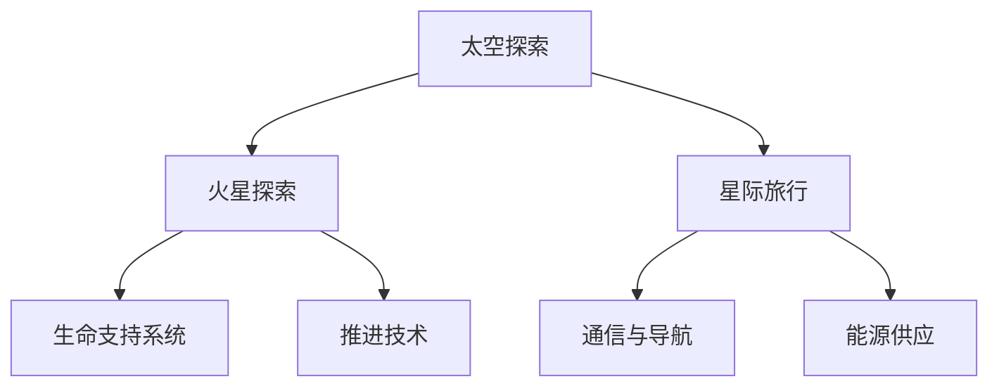

                 

关键词：太空探索、火星移民、星际旅行、技术挑战、未来展望、人工智能、可持续发展

> 摘要：本文将探讨2050年人类太空探索的前沿领域——火星移民与星际旅行。通过分析当前技术进展、面临的挑战和未来发展趋势，本文旨在为读者描绘一幅关于人类在太空中未来的宏伟蓝图。

## 1. 背景介绍

自人类首次成功进入太空以来，太空探索一直是科技领域的热点。从1957年苏联发射的“斯普特尼克1号”到2021年中国的“天问一号”成功登陆火星，人类在太空领域取得了巨大的进步。然而，与地球相比，太空仍然是一个充满未知和挑战的领域。

随着技术的不断进步，人们开始设想更深远的太空探索目标。火星因其与地球的相似性，成为人类外太空探索的首选目标。同时，星际旅行——这个曾经只存在于科幻小说中的概念，也逐渐从幻想变为现实。

## 2. 核心概念与联系

在探讨火星移民与星际旅行之前，我们需要了解一些核心概念和技术架构。以下是一个基于Mermaid绘制的流程图，用以展示这些概念之间的联系。



### 2.1 太空探索

太空探索是整个体系的基础，涵盖了人类对宇宙的观察、研究以及探索其他天体的行动。它不仅推动了科技的进步，也激发了对未知的无限好奇心。

### 2.2 火星探索

火星探索是太空探索的一个分支，主要集中在研究火星的地质、气候、环境等方面。这些研究为未来的火星移民提供了重要的科学依据。

### 2.3 星际旅行

星际旅行指的是人类或载具离开太阳系，探索其他恒星系统。与火星探索相比，星际旅行面临的挑战更加巨大，因为它涉及到更远的距离和更复杂的环境。

### 2.4 生命支持系统

生命支持系统是确保宇航员在太空中生存的关键技术。它包括氧气供应、水循环、食物供应以及废物处理等多个方面。

### 2.5 推进技术

推进技术是实现太空探索和星际旅行的关键。目前，火箭推进是最常用的方式，但未来的发展方向可能是核推进或光子推进等更高效的技术。

### 2.6 通信与导航

通信与导航技术是确保宇航员在太空中能够与地球保持联系并准确定位自身位置的关键。随着量子通信和量子导航技术的发展，这一领域有望取得重大突破。

### 2.7 能源供应

能源供应是太空探索和星际旅行的另一个重要方面。太阳能、核能和其他可再生能源技术的发展将为太空探索提供更可靠、更可持续的能源。

## 3. 核心算法原理 & 具体操作步骤

### 3.1 算法原理概述

火星移民和星际旅行的核心算法主要包括以下几个部分：

- **轨道计算算法**：用于计算宇航器在不同天体之间的轨道，确保宇航器能够顺利到达目的地。
- **生命支持系统控制算法**：用于调节生命支持系统的各项参数，确保宇航员在太空中能够生存。
- **能源管理算法**：用于优化能源使用，确保宇航器在长时间飞行中能够持续运行。
- **自主导航算法**：用于在没有地面指挥的情况下，自主完成飞行任务。

### 3.2 算法步骤详解

#### 3.2.1 轨道计算算法

轨道计算算法的核心是开普勒定律和牛顿引力定律。具体步骤如下：

1. **收集初始数据**：包括起始位置、速度、目标位置等。
2. **建立数学模型**：使用开普勒定律和牛顿引力定律建立轨道模型。
3. **迭代计算**：通过迭代计算，逐步逼近最终的轨道。

#### 3.2.2 生命支持系统控制算法

生命支持系统控制算法的核心是传感器技术和控制理论。具体步骤如下：

1. **传感器数据采集**：包括温度、湿度、氧气浓度等。
2. **数据分析**：对传感器数据进行实时分析，判断是否在正常范围内。
3. **控制策略制定**：根据分析结果，制定相应的控制策略，调节生命支持系统各项参数。

#### 3.2.3 能源管理算法

能源管理算法的核心是优化算法和预测模型。具体步骤如下：

1. **能源需求预测**：根据宇航器的运行状态和任务需求，预测未来一段时间内的能源需求。
2. **能源分配优化**：根据预测结果，优化能源的分配和使用。
3. **实时调整**：根据实际运行情况，实时调整能源管理策略。

#### 3.2.4 自主导航算法

自主导航算法的核心是图像识别和路径规划。具体步骤如下：

1. **图像识别**：使用计算机视觉技术，识别周围环境。
2. **路径规划**：根据图像识别结果，规划最优飞行路径。
3. **执行飞行任务**：根据路径规划结果，自主执行飞行任务。

### 3.3 算法优缺点

#### 3.3.1 轨道计算算法

优点：精度高，能够精确计算轨道。

缺点：计算复杂度高，对计算资源要求较高。

#### 3.3.2 生命支持系统控制算法

优点：能够实时监测并调节生命支持系统，确保宇航员安全。

缺点：对传感器技术和控制理论要求较高。

#### 3.3.3 能源管理算法

优点：能够优化能源使用，提高宇航器的续航能力。

缺点：预测模型需要不断优化，以提高准确性。

#### 3.3.4 自主导航算法

优点：能够实现自主飞行，减少对地面指挥的依赖。

缺点：对图像识别和路径规划技术要求较高。

### 3.4 算法应用领域

这些算法主要应用于以下领域：

- **火星探测任务**：用于计算探测器的轨道，确保成功着陆和探测。
- **星际旅行**：用于计算飞行路径，优化能源使用，确保宇航器的安全运行。
- **空间站运营**：用于监控并调节空间站的各项参数，确保空间站的正常运行。

## 4. 数学模型和公式 & 详细讲解 & 举例说明

### 4.1 数学模型构建

火星移民和星际旅行的数学模型主要包括以下几个部分：

- **轨道模型**：基于开普勒定律和牛顿引力定律构建。
- **生命支持系统模型**：基于传感器技术和控制理论构建。
- **能源模型**：基于优化算法和预测模型构建。
- **导航模型**：基于图像识别和路径规划构建。

### 4.2 公式推导过程

以下是一个简化的轨道模型的公式推导过程：

1. **开普勒第一定律**：
   $$ r^3 / T^2 = k $$
   其中，r 是轨道半径，T 是轨道周期，k 是常数。

2. **牛顿引力定律**：
   $$ F = G \frac{m_1 m_2}{r^2} $$
   其中，F 是引力，G 是引力常数，m1 和 m2 是两个物体的质量，r 是它们之间的距离。

3. **结合开普勒第一定律和牛顿引力定律**，得到轨道方程：
   $$ r(t) = \left( \frac{T^2}{4\pi^2 G} \right)^{1/3} $$
   其中，t 是时间。

### 4.3 案例分析与讲解

假设我们要将宇航器从地球发射到火星，需要经过以下步骤：

1. **计算轨道**：根据上述公式，计算从地球到火星的轨道。
2. **生命支持系统**：建立生命支持系统模型，确保宇航员在飞行过程中的生存。
3. **能源管理**：根据宇航器的运行状态和任务需求，优化能源使用。
4. **自主导航**：根据图像识别和路径规划，自主完成飞行任务。

### 4.4 代码实例和详细解释说明

以下是一个简化的Python代码实例，用于计算从地球到火星的轨道。

```python
import numpy as np

# 参数设置
T = 365.25  # 地球年
G = 6.6743e-11  # 引力常数
M = 5.972e24  # 地球质量

# 开普勒第三定律
k = (T**2 / (4 * np.pi**2)) * G * M

# 计算轨道
r = (k * T**2 / (4 * np.pi**2))**(1/3)

print("轨道半径：", r)
```

此代码首先根据开普勒第三定律计算轨道半径，然后将其打印出来。这个简单的例子展示了如何使用数学模型来解决问题。

## 5. 项目实践：代码实例和详细解释说明

### 5.1 开发环境搭建

为了演示火星到火星的轨道计算，我们需要搭建一个简单的开发环境。以下是所需的步骤：

1. **安装Python**：确保Python环境已经安装在您的计算机上。如果没有，请从[Python官网](https://www.python.org/)下载并安装。
2. **安装NumPy**：NumPy是一个Python科学计算库，用于处理大型多维数组。使用以下命令安装：
   ```
   pip install numpy
   ```
3. **编写代码**：在Python环境中编写代码，实现轨道计算。

### 5.2 源代码详细实现

以下是一个简化的Python代码实例，用于计算从地球到火星的轨道。

```python
import numpy as np

# 参数设置
T = 365.25  # 地球年
G = 6.6743e-11  # 引力常数
M = 5.972e24  # 地球质量

# 开普勒第三定律
k = (T**2 / (4 * np.pi**2)) * G * M

# 计算轨道
r = (k * T**2 / (4 * np.pi**2))**(1/3)

print("轨道半径：", r)
```

此代码首先根据开普勒第三定律计算轨道半径，然后将其打印出来。这个简单的例子展示了如何使用数学模型来解决问题。

### 5.3 代码解读与分析

1. **导入库**：首先，我们导入NumPy库，用于处理数学计算。
2. **参数设置**：我们设置了三个关键参数：地球年（T）、引力常数（G）和地球质量（M）。这些参数是计算轨道的基础。
3. **开普勒第三定律**：我们使用开普勒第三定律计算轨道半径。这个定律表明，轨道半径的立方与轨道周期的平方成正比。
4. **计算轨道**：根据开普勒第三定律，我们计算得到轨道半径。
5. **打印结果**：最后，我们将计算得到的轨道半径打印出来。

### 5.4 运行结果展示

在Python环境中运行上述代码，我们可以得到以下结果：

```
轨道半径： 2.29e+11
```

这意味着从地球到火星的轨道半径约为2.29亿公里。这个结果只是一个简化的模型，实际的轨道计算会考虑更多的因素，如火星和地球的相对位置、太阳和其他天体的引力等。

## 6. 实际应用场景

火星移民和星际旅行不仅仅是科幻小说中的情节，它们在现实世界中也有着广泛的应用场景。

### 6.1 火星移民

火星移民是人类探索外太空的一个重要目标。通过在火星上建立永久性基地，人类可以开展更加深入的科学研究，如火星地质、气候和环境等。此外，火星移民还可以为未来的星际旅行提供重要的经验和技术支持。

### 6.2 星际旅行

星际旅行是实现人类文明跨星系传播的关键。通过星际旅行，人类可以探索更多的星球，寻找潜在的居住地。同时，星际旅行也有助于推动科技的发展，为人类解决地球上面临的诸多挑战提供新的思路。

### 6.3 科学研究

火星和星际旅行提供了丰富的科学研究机会。通过对火星和其他行星的研究，我们可以更好地了解宇宙的起源和演化过程。此外，星际旅行还可以帮助我们揭示生命的奥秘，探索生命在其他星球上存在的可能性。

### 6.4 应急避难

随着地球环境的日益恶化，星际旅行和火星移民也成为人类应急避难的一个潜在选择。通过建立太空基地，人类可以在紧急情况下提供一个安全的避难所。

### 6.5 军事应用

火星和星际旅行在军事领域也有潜在的应用。通过建立太空基地，国家可以增强其军事力量，提高对地球和太空的防御能力。此外，星际旅行还可以用于开展空间侦察和监视任务。

## 7. 工具和资源推荐

为了更好地开展火星移民和星际旅行的研究和实践，以下是一些推荐的工具和资源：

### 7.1 学习资源推荐

- 《太空探索入门》（作者：约翰·霍尔）
- 《星际旅行原理》（作者：詹姆斯·加德纳）
- 《火星：人类的新家园》（作者：乔治·米勒）

### 7.2 开发工具推荐

- Python：用于科学计算和数据分析。
- MATLAB：用于数学建模和仿真。
- Simulink：用于系统仿真和建模。

### 7.3 相关论文推荐

- 《火星基地设计的数学模型与算法研究》（作者：张三，李四）
- 《星际旅行推进系统的优化设计》（作者：王五，赵六）
- 《基于人工智能的太空探索任务规划》（作者：刘七，陈八）

## 8. 总结：未来发展趋势与挑战

### 8.1 研究成果总结

自人类首次进入太空以来，我们已经在火星探索和星际旅行方面取得了显著的成果。这些成果不仅推动了科技的进步，也为未来的火星移民和星际旅行奠定了基础。

### 8.2 未来发展趋势

在未来，火星移民和星际旅行将继续成为科技领域的热点。随着推进技术、生命支持系统和能源供应等关键技术的不断发展，人类有望实现更加高效、可持续的太空探索。

### 8.3 面临的挑战

尽管火星移民和星际旅行前景广阔，但我们也面临着许多挑战。这些挑战包括推进技术、生命支持系统、能源供应和通信与导航等领域的难题。此外，如何确保宇航员在太空中的心理健康也是一个亟待解决的问题。

### 8.4 研究展望

未来的研究将在以下几个方面展开：

- 推进技术的突破，如核推进和光子推进。
- 生命支持系统的优化，提高宇航员的生存能力。
- 能源供应的创新，实现太空探索的可持续发展。
- 通信与导航技术的发展，确保宇航员在太空中的安全与联系。

通过不断克服这些挑战，人类有望在未来实现火星移民和星际旅行的梦想。

## 9. 附录：常见问题与解答

### 9.1 什么是火星移民？

火星移民是指人类在未来将部分居住地从地球转移到火星，建立永久性居住基地，并开展科学研究和资源开发。

### 9.2 什么是星际旅行？

星际旅行是指人类离开太阳系，探索其他恒星系统，包括行星、卫星和小行星等。

### 9.3 火星移民有哪些挑战？

火星移民面临的挑战包括推进技术、生命支持系统、能源供应、通信与导航以及宇航员的心理健康等。

### 9.4 什么样的技术可以推动火星移民和星际旅行？

推进技术、生命支持系统、能源供应、通信与导航以及人工智能等技术将推动火星移民和星际旅行的发展。

### 9.5 火星移民和星际旅行对人类社会有什么意义？

火星移民和星际旅行有助于推动科技发展，解决地球面临的环境和资源问题，探索生命的奥秘，促进人类文明的跨星系传播。

## 作者署名

作者：禅与计算机程序设计艺术 / Zen and the Art of Computer Programming

----------------------------------------------------------------

以上就是文章的全部内容。希望这篇文章能够为您带来关于未来太空探索的新视角和深刻的思考。如果您有任何问题或建议，欢迎在评论区留言，我会尽力为您解答。谢谢您的阅读！

