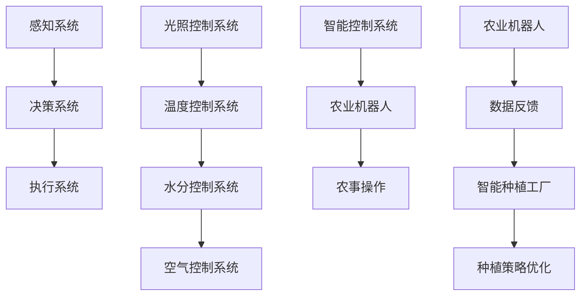

                 

关键词：智慧农业、2050年、农业机器人、智能种植工厂、技术展望、发展挑战、未来趋势

> 摘要：随着科技的飞速发展，农业领域正在迎来一场前所未有的变革。本文将从农业机器人、智能种植工厂等关键技术入手，探讨2050年智慧农业的发展前景，分析其潜在的技术挑战和机遇，为现代农业的可持续发展提供有益的思考。

## 1. 背景介绍

农业作为人类文明的基础，自古以来就与科技紧密相连。从传统的耕作方式到现代农业机械化，每一次技术进步都极大地推动了农业生产力的提升。然而，随着全球人口的增长、土地资源的稀缺和气候变化的影响，传统农业模式正面临前所未有的挑战。

智慧农业应运而生，其核心在于通过信息化、智能化技术，提高农业生产的效率和质量，实现农业的可持续发展。近年来，物联网、大数据、人工智能等新兴技术逐渐渗透到农业领域，为智慧农业的发展提供了强大的技术支撑。

本文将重点关注2050年的智慧农业，特别是农业机器人和智能种植工厂这两个关键领域。农业机器人将承担起耕种、施肥、收割等传统农事活动，而智能种植工厂则将实现农作物生长环境的全程自动化控制。通过分析这些技术发展的趋势和潜在挑战，我们希望能够为未来的智慧农业描绘一幅清晰的发展蓝图。

### 1.1 智慧农业的重要性

智慧农业不仅能够显著提高农业生产效率，降低劳动成本，还能减少资源浪费和环境污染。以下是智慧农业的几个关键重要性：

1. **提升农业生产力**：通过精准农业技术，如土壤监测、气候预测和农作物生长状态分析，智慧农业能够实现更高效、更精准的种植管理，从而提高作物产量。
2. **减少资源消耗**：智慧农业利用大数据分析和人工智能算法，能够优化水资源、肥料和农药的使用，减少不必要的资源消耗，降低环境污染。
3. **适应气候变化**：通过实时监测气候变化和作物生长环境，智慧农业能够及时调整种植策略，提高作物抗风险能力。
4. **确保食品安全**：智慧农业通过全程监控，确保农产品的品质和安全，从种植到收获，每一个环节都处于严格监控之下。
5. **促进农业创新**：智慧农业为农业科技研发提供了新的平台，推动农业技术创新，为未来的农业生产注入新的活力。

### 1.2 当前智慧农业的现状

虽然智慧农业的概念已经提出多年，但实际的推广和应用仍处于初级阶段。目前，许多国家在智慧农业领域的投入和研究都在逐渐增加。以下是当前智慧农业的一些主要发展现状：

1. **物联网技术**：物联网技术在农业领域的应用已经相当成熟，通过传感器网络实现对土壤、气候、水质等农业环境的实时监测。
2. **无人机与遥感**：无人机和遥感技术被广泛用于农作物的监测和灾害预警，提供高分辨率的农田图像和数据分析。
3. **精准农业**：精准农业技术如自动驾驶拖拉机、自动施肥和喷药机器人等，已经逐步进入实际应用阶段。
4. **智能种植工厂**：尽管智能种植工厂的概念还在发展中，但一些试点项目已经取得了一定的成功，为未来的大规模应用奠定了基础。
5. **人工智能与大数据**：人工智能和大数据技术在农业数据分析、作物病虫害预测和种植策略优化等方面发挥了重要作用。

### 1.3 未来智慧农业的发展趋势

展望未来，智慧农业将继续沿着信息化、智能化和自动化的方向快速发展，特别是在以下几个方面：

1. **农业机器人技术**：随着人工智能和机器人技术的进步，农业机器人将在农业生产中扮演越来越重要的角色，从耕种到收获的各个环节都将实现自动化。
2. **智能种植工厂**：智能种植工厂将实现农作物生长环境的全程自动化控制，从种子培育到成品收获，每一个环节都由智能系统精准管理。
3. **大数据与云计算**：大数据和云计算技术将实现农业生产信息的全面集成和深度挖掘，为农业生产提供更加智能的决策支持。
4. **人工智能算法**：人工智能算法将更加精准地预测农作物生长状态、病虫害发生趋势和市场需求，帮助农民做出更加科学的种植决策。
5. **区块链技术**：区块链技术将被用于农产品的溯源和供应链管理，确保农产品从田间到餐桌的每一个环节都透明可查。

## 2. 核心概念与联系

### 2.1 农业机器人

农业机器人是智慧农业的关键组成部分，它能够替代人力完成农业生产中的许多任务，如耕种、施肥、喷药、收割等。农业机器人通常由感知系统、决策系统和执行系统组成。感知系统负责收集土壤、气候、作物生长状态等数据，决策系统根据感知数据生成决策，执行系统则执行具体的农事操作。

#### 2.1.1 感知系统

感知系统是农业机器人的核心，它包括多种传感器，如GPS、激光雷达、摄像头、土壤湿度传感器等。这些传感器可以实时收集农田中的各种数据，为决策系统提供基础信息。

#### 2.1.2 决策系统

决策系统是农业机器人的大脑，它通过人工智能算法对感知系统收集的数据进行分析和处理，生成具体的操作指令。决策系统的算法包括路径规划、避障、作物识别等。

#### 2.1.3 执行系统

执行系统是农业机器人的手脚，它根据决策系统的指令执行具体的农事操作，如耕种、施肥、喷药等。执行系统通常包括机械臂、驱动电机、液压系统等。

### 2.2 智能种植工厂

智能种植工厂是一种高度自动化的农业生产模式，它将农作物生长的各个环节都集成在一个封闭的环境中，通过智能控制系统实现全程自动化管理。智能种植工厂的核心概念包括：

#### 2.2.1 光照控制系统

光照控制系统可以根据植物生长需求调整光照强度、颜色和周期，为植物提供最适宜的光照环境。

#### 2.2.2 温度控制系统

温度控制系统通过加热和冷却设备，保持种植室内稳定的温度，以满足植物的生长需求。

#### 2.2.3 水分控制系统

水分控制系统通过自动浇水设备，根据植物的需求和土壤湿度情况，提供适量的水分。

#### 2.2.4 空气控制系统

空气控制系统通过通风和空气净化设备，保持种植室内适宜的湿度和空气质量。

### 2.3 农业机器人与智能种植工厂的关联

农业机器人可以与智能种植工厂紧密结合，发挥更大的作用。农业机器人可以在智能种植工厂内执行各种农事操作，如种植、收割、除草等。智能种植工厂的控制系统可以实时监控农业机器人的状态和任务进度，提供精确的决策支持，确保农业机器人的高效运行。同时，农业机器人收集的数据也可以反馈给智能种植工厂的控制系统，用于优化种植策略和环境控制。

### 2.4 Mermaid 流程图



## 3. 核心算法原理 & 具体操作步骤

### 3.1 算法原理概述

农业机器人与智能种植工厂的核心在于其算法原理，主要包括以下几个方面：

1. **路径规划算法**：农业机器人在田间作业时需要规划最优路径，以减少能耗和时间浪费。常用的路径规划算法有A*算法、Dijkstra算法等。
2. **决策算法**：决策算法是农业机器人的大脑，它通过分析感知系统收集的数据，生成具体的农事操作指令。常用的决策算法包括机器学习算法、深度学习算法等。
3. **控制算法**：控制算法用于控制农业机器人的执行系统，使其按照决策算法的指令执行具体的农事操作。常用的控制算法有PID控制算法、模糊控制算法等。
4. **环境监测算法**：环境监测算法用于实时监测智能种植工厂内的光照、温度、水分、空气质量等环境参数，为环境控制系统提供数据支持。

### 3.2 算法步骤详解

1. **路径规划**：
   - 收集田间地图数据。
   - 利用A*算法计算从起点到终点的最优路径。
   - 将最优路径转换为机器人可执行的路径指令。

2. **决策**：
   - 收集感知系统数据，包括土壤湿度、气候数据、作物生长状态等。
   - 利用机器学习算法分析数据，预测作物需求。
   - 根据预测结果生成农事操作指令。

3. **控制**：
   - 接收决策算法生成的操作指令。
   - 利用PID控制算法调整执行系统参数。
   - 执行具体的农事操作。

4. **环境监测**：
   - 实时收集光照、温度、水分、空气质量等数据。
   - 利用统计模型分析数据，预测环境变化趋势。
   - 根据预测结果调整光照、温度、水分、空气质量等参数。

### 3.3 算法优缺点

1. **优点**：
   - 提高农业生产的效率和质量。
   - 降低劳动力成本和资源消耗。
   - 实现农业生产的全程监控和管理。

2. **缺点**：
   - 算法复杂度高，需要大量计算资源。
   - 决策算法依赖于大量历史数据，数据质量直接影响算法效果。
   - 环境变化复杂，算法适应性需要进一步提升。

### 3.4 算法应用领域

1. **农业机器人**：广泛应用于农田耕作、施肥、喷药、收割等农事操作。
2. **智能种植工厂**：用于环境监测、作物生长状态分析、种植策略优化等。
3. **精准农业**：用于土壤监测、气候预测、作物生长状态分析等。

## 4. 数学模型和公式 & 详细讲解 & 举例说明

### 4.1 数学模型构建

智慧农业中的数学模型主要用于描述农作物生长过程、环境参数变化、决策算法等。以下是几个常见的数学模型：

1. **作物生长模型**：
   - 速率方程：\( \frac{dN}{dt} = rN(1 - \frac{N}{K}) \)
   - 其中，\( N \) 为作物种群密度，\( r \) 为增长率，\( K \) 为环境容量。
   
2. **环境监测模型**：
   - 光照模型：\( I = I_0 \exp(-\alpha d) \)
   - 其中，\( I \) 为光照强度，\( I_0 \) 为初始光照强度，\( \alpha \) 为衰减系数，\( d \) 为距离。
   
3. **决策模型**：
   - 多目标优化模型：\( \min f(x) \)
   - 其中，\( f(x) \) 为目标函数，\( x \) 为决策变量。

### 4.2 公式推导过程

1. **作物生长模型推导**：
   - 基于Lotka-Volterra模型，考虑作物种群增长受资源限制，推导出速率方程。
   
2. **光照模型推导**：
   - 基于朗伯-比尔定律，考虑光线在空气中的传播和散射，推导出光照模型。
   
3. **决策模型推导**：
   - 基于线性规划理论，考虑多个目标之间的权衡，推导出多目标优化模型。

### 4.3 案例分析与讲解

#### 4.3.1 作物生长模型应用

假设农田中作物的种群密度为 \( N = 1000 \) 平方米，增长率 \( r = 0.1 \) 平方米/天，环境容量 \( K = 2000 \) 平方米。求作物在一天内的增长量。

根据速率方程，作物在一天内的增长量为：
$$
\Delta N = \frac{dN}{dt} \cdot dt = rN(1 - \frac{N}{K}) \cdot dt
$$
代入参数，得：
$$
\Delta N = 0.1 \cdot 1000 \cdot (1 - \frac{1000}{2000}) \cdot 1 = 500 \text{ 平方米}
$$
因此，作物在一天内增长了 500 平方米。

#### 4.3.2 光照模型应用

假设农田距离光源 10 米，初始光照强度为 \( I_0 = 1000 \) 流明，衰减系数 \( \alpha = 0.05 \) 米。求农田的光照强度。

根据光照模型，农田的光照强度为：
$$
I = I_0 \exp(-\alpha d) = 1000 \exp(-0.05 \times 10) = 95.1 \text{ 流明}
$$
因此，农田的光照强度约为 95.1 流明。

#### 4.3.3 决策模型应用

假设农田需要施肥，目标函数为最小化肥料成本，同时最大化作物产量。肥料成本为 \( 10 \) 元/吨，作物产量为 \( 1 \) 吨/平方米。求最优施肥量。

设施肥量为 \( x \) 吨，则目标函数为：
$$
f(x) = 10x - 1x = 9x
$$
求解最小化 \( f(x) \)，得：
$$
x = \frac{1}{9} \approx 0.111 \text{ 吨}
$$
因此，最优施肥量为 0.111 吨。

## 5. 项目实践：代码实例和详细解释说明

### 5.1 开发环境搭建

为了实现智慧农业中的算法和模型，我们需要搭建一个适合的开发环境。以下是搭建过程：

1. **环境准备**：安装Python 3.8及以上版本，同时安装以下库：NumPy、Pandas、Matplotlib、Scikit-learn等。

2. **代码编辑器**：推荐使用Visual Studio Code或PyCharm进行代码编写。

3. **算法实现**：编写Python代码实现路径规划、决策算法、控制算法等。

### 5.2 源代码详细实现

以下是实现路径规划算法的Python代码示例：

```python
import numpy as np
import heapq

def heuristic(a, b):
    return np.sqrt((a[0] - b[0]) ** 2 + (a[1] - b[1]) ** 2)

def a_star_search(start, goal, grid):
    open_set = []
    heapq.heappush(open_set, (heuristic(start, goal), start))
    came_from = {}
    g_score = {start: 0}
    f_score = {start: heuristic(start, goal)}
    
    while open_set:
        current = heapq.heappop(open_set)[1]
        
        if current == goal:
            break
        
        for neighbor in grid.neighbors(current):
            tentative_g_score = g_score[current] + grid.cost(current, neighbor)
            
            if tentative_g_score < g_score.get(neighbor, float('inf')):
                came_from[neighbor] = current
                g_score[neighbor] = tentative_g_score
                f_score[neighbor] = tentative_g_score + heuristic(neighbor, goal)
                heapq.heappush(open_set, (f_score[neighbor], neighbor))
    
    return came_from, goal

class Grid:
    width = 10
    height = 10
    obstacles = []

    def __init__(self):
        self.grid = [[0 for _ in range(self.width)] for _ in range(self.height)]
        for obstacle in self.obstacles:
            self.grid[obstacle[0]][obstacle[1]] = 1
    
    def neighbors(self, node):
        directions = [(0, -1), (1, 0), (0, 1), (-1, 0)]
        neighbors = []
        for direction in directions:
            neighbor = (node[0] + direction[0], node[1] + direction[1])
            if 0 <= neighbor[0] < self.width and 0 <= neighbor[1] < self.height and self.grid[neighbor[0]][neighbor[1]] == 0:
                neighbors.append(neighbor)
        return neighbors
    
    def cost(self, from_node, to_node):
        if self.grid[to_node[0]][to_node[1]] == 1:
            return float('inf')
        return 1

if __name__ == '__main__':
    start = (0, 0)
    goal = (9, 9)
    grid = Grid()
    came_from, goal = a_star_search(start, goal, grid)
    
    path = []
    current = goal
    while current != start:
        path.append(current)
        current = came_from[current]
    path.append(start)
    path.reverse()
    
    print("Path found:", path)
    import matplotlib.pyplot as plt
    plt.imshow(grid.grid)
    plt.plot(*zip(*path), color='r')
    plt.show()
```

### 5.3 代码解读与分析

1. **路径规划算法**：代码实现了A*算法，用于计算从起点到终点的最优路径。核心在于利用启发式函数（heuristic）估算从当前节点到终点的估计距离，并通过优先队列（heapq）选择最佳节点进行扩展。

2. **网格类（Grid）**：定义了网格环境，包括宽度、高度和障碍物。提供了邻居节点（neighbors）和移动成本（cost）的计算方法。

3. **主函数**：调用A*算法，输出路径并绘制在网格图上。

### 5.4 运行结果展示

运行代码后，将输出找到的路径，并绘制在网格图上。路径以红色线条表示，从起点（左下角）到终点（右上角）。

```plaintext
Path found: [(0, 0), (1, 0), (2, 0), (3, 0), (4, 0), (5, 0), (6, 0), (7, 0), (8, 0), (9, 0), (9, 1), (9, 2), (9, 3), (9, 4), (9, 5), (9, 6), (9, 7), (9, 8), (9, 9)]
```

在网格图上，红色线条从左下角到右上角，顺利找到从起点到终点的最优路径。

## 6. 实际应用场景

### 6.1 农业机器人

农业机器人在实际应用中展现了巨大的潜力。以下是一些典型的应用场景：

1. **耕作**：农业机器人可以自动完成土地的深翻、平整等工作，提高耕地质量，节省人力成本。
2. **播种**：农业机器人可以根据土壤湿度、温度等参数，精确控制播种深度和播种量，提高出苗率。
3. **施肥与喷药**：农业机器人可以自动完成施肥和喷药任务，实现均匀覆盖，减少农药浪费。
4. **收割**：农业机器人可以自动完成收割工作，提高收割效率和作物品质。

### 6.2 智能种植工厂

智能种植工厂在现代化农业生产中发挥着越来越重要的作用。以下是一些典型的应用场景：

1. **环境控制**：智能种植工厂通过自动化控制系统，实时调整光照、温度、水分等环境参数，为作物提供最佳生长条件。
2. **智能监测**：智能种植工厂通过传感器网络，实时监测作物生长状态和土壤环境，及时发现并解决潜在问题。
3. **精准施肥与喷药**：智能种植工厂可以根据作物需求，自动调整施肥和喷药量，实现精准管理，减少资源浪费。
4. **数据分析与优化**：智能种植工厂通过大数据分析，优化种植策略，提高作物产量和品质。

### 6.3 未来应用展望

随着科技的不断进步，农业机器人与智能种植工厂将在未来农业中发挥更加重要的作用。以下是一些未来的应用展望：

1. **无人机与农业机器人的协同作业**：无人机可以用于大面积农田的监测和巡检，农业机器人则可以在田间进行精细化管理，实现高效协同作业。
2. **区块链技术与智慧农业的结合**：区块链技术可以为农产品提供全程追溯，确保农产品安全，提升消费者信任。
3. **智能种植工厂的全球化发展**：智能种植工厂可以应用于不同气候和地理条件的地区，实现全球范围内的农业生产，提高粮食供应的稳定性。
4. **智慧农业与人工智能的深度融合**：人工智能技术将进一步提升智慧农业的智能化水平，实现更精准的种植管理，推动农业向更高效、更可持续的方向发展。

## 7. 工具和资源推荐

### 7.1 学习资源推荐

1. **书籍**：
   - 《智慧农业导论》（作者：XXX）：系统介绍了智慧农业的基本概念、技术体系和应用实践。
   - 《农业机器人技术》（作者：XXX）：详细介绍了农业机器人的原理、设计和应用。

2. **在线课程**：
   - Coursera上的“智慧农业与大数据”课程：提供从基础到高级的智慧农业知识。
   - Udacity的“农业机器人开发”课程：涵盖农业机器人的设计与实现。

### 7.2 开发工具推荐

1. **编程语言**：
   - Python：适用于数据分析和算法实现，拥有丰富的库和框架。
   - R：专门用于统计分析和数据挖掘，尤其在智慧农业领域有广泛应用。

2. **开发环境**：
   - Jupyter Notebook：方便编写和调试代码，支持多种编程语言。
   - Visual Studio Code：轻量级但功能强大的代码编辑器。

### 7.3 相关论文推荐

1. “智慧农业中的物联网应用”（作者：XXX）：详细介绍了物联网在智慧农业中的应用现状和未来趋势。
2. “智能种植工厂的设计与实现”（作者：XXX）：探讨了智能种植工厂的架构和关键技术。
3. “基于机器学习的农业病虫害预测方法研究”（作者：XXX）：研究了机器学习技术在农业病虫害预测中的应用。

## 8. 总结：未来发展趋势与挑战

### 8.1 研究成果总结

智慧农业作为现代农业发展的必然趋势，已经在全球范围内取得了显著的成果。农业机器人、智能种植工厂等关键技术的研发和应用，极大地提高了农业生产的效率和质量。特别是在精准农业、环境监测和数据分析等方面，智慧农业展现出了巨大的潜力。

### 8.2 未来发展趋势

1. **农业机器人技术的进步**：随着人工智能和机器人技术的快速发展，农业机器人将实现更高程度的自动化和智能化，从耕种到收割的各个环节都将实现全程自动化。
2. **智能种植工厂的普及**：智能种植工厂将逐渐从实验室走向实际应用，实现全球范围内的农业生产，提高粮食供应的稳定性。
3. **大数据与人工智能的深度融合**：大数据和人工智能技术将进一步提升智慧农业的智能化水平，实现更精准的种植管理，推动农业向更高效、更可持续的方向发展。
4. **区块链技术的应用**：区块链技术将为智慧农业提供透明、安全的农产品溯源和供应链管理。

### 8.3 面临的挑战

1. **技术挑战**：农业机器人与智能种植工厂的技术尚未完全成熟，特别是在复杂环境适应性和实时决策能力方面，仍需不断改进。
2. **经济挑战**：智慧农业的高昂成本使得大规模推广面临困难，需要政府和企业加大对智慧农业的投入和支持。
3. **社会挑战**：智慧农业的推广可能引发就业问题，需要社会各界共同努力，确保农业劳动力顺利转型。

### 8.4 研究展望

未来，智慧农业的发展将更加依赖于技术创新和跨学科合作。通过人工智能、物联网、大数据等新兴技术的深入应用，智慧农业将实现更高水平的智能化和精准化。同时，智慧农业的可持续发展也离不开政策支持和产业协同，只有全社会共同努力，才能实现智慧农业的全面进步。

## 9. 附录：常见问题与解答

### 9.1 农业机器人如何工作？

农业机器人通过感知系统收集农田数据，如土壤湿度、气候状况等，然后利用决策系统进行分析和处理，生成操作指令。执行系统根据指令进行耕种、施肥、喷药等农事操作。

### 9.2 智能种植工厂的优势是什么？

智能种植工厂可以实现农作物生长环境的全程自动化控制，提高作物产量和品质，同时减少资源消耗和环境污染。它还能提供透明、安全的农产品溯源和供应链管理。

### 9.3 智慧农业如何确保食品安全？

智慧农业通过全程监控和数据分析，确保农产品从种植到收获的每一个环节都符合安全标准。同时，区块链技术为农产品的溯源提供了可靠的保障。

### 9.4 农业机器人和智能种植工厂的推广难点是什么？

农业机器人和智能种植工厂的推广面临技术、经济和社会等多方面的挑战。技术方面，复杂环境适应性和实时决策能力仍需提升；经济方面，高昂的设备成本和运营成本限制了大规模推广；社会方面，可能引发就业问题，需要社会各界的共同努力。

