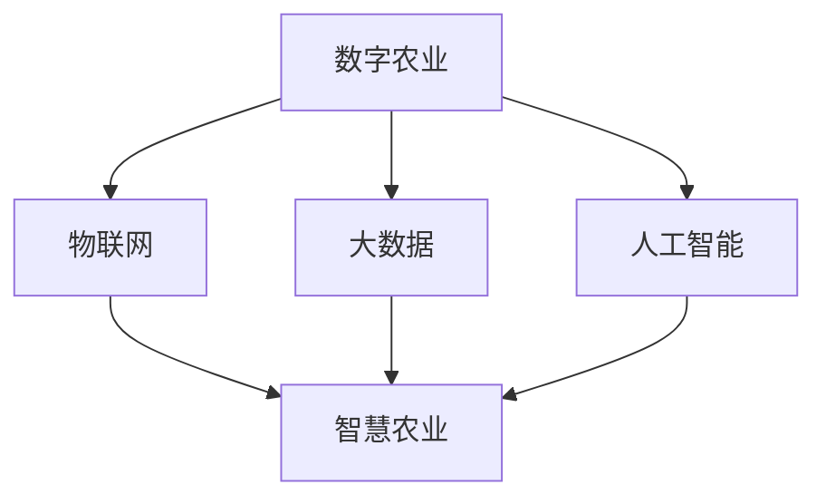

                 

关键词：智慧农业，数字农业，智慧农场，人工智能，物联网，2050年，发展趋势，挑战与展望。

摘要：随着科技的快速发展，农业领域也迎来了前所未有的变革。本文将探讨至2050年，智慧农业与智慧农场的概念、技术原理、应用场景以及未来的发展趋势和面临的挑战，旨在为我国农业现代化提供新的思路和方向。

## 1. 背景介绍

农业是人类生存和发展的基础，但传统的农业生产方式面临着资源短缺、环境污染和劳动强度大等问题。近年来，随着人工智能、物联网、大数据等新兴技术的不断发展，数字农业与智慧农业逐渐成为研究热点。智慧农业是指利用信息技术和智能设备对农业生产过程进行数字化、智能化管理，以提高农业生产效率、降低成本、保护环境和实现可持续发展。

### 数字农业的定义与内涵

数字农业是指将信息技术、传感器技术、物联网技术、大数据技术等应用于农业生产、管理、服务等各个环节，实现农业生产过程的信息化和智能化。数字农业的核心目标是提高农业生产效率、保障农产品质量安全、促进农业可持续发展。

### 智慧农业的定义与内涵

智慧农业是在数字农业的基础上，进一步通过人工智能、机器学习等先进技术，实现对农业生产、管理和服务的智能化决策和精准执行。智慧农业的目标是实现农业生产的全流程智能化，提高农业生产效益，提升农业产业竞争力。

## 2. 核心概念与联系

为了更好地理解智慧农业与智慧农场，我们首先需要了解以下几个核心概念：

### 物联网（IoT）

物联网是指通过传感器、网络连接和智能设备，将物理世界中的物体连接到互联网上，实现信息的采集、传输和处理。在智慧农业中，物联网技术主要用于实时监测作物生长环境、土壤湿度、气象变化等数据。

### 人工智能（AI）

人工智能是指通过计算机程序实现人类智能的功能，如学习、推理、规划、感知等。在智慧农业中，人工智能主要用于对农业生产过程中的数据进行分析、预测和决策。

### 大数据（Big Data）

大数据是指海量、多样、快速产生的数据。在智慧农业中，大数据技术主要用于对农业生产过程中的数据进行分析和挖掘，以获取有价值的信息。

### 数字农业与智慧农业的联系

数字农业是智慧农业的基础，它为智慧农业提供了数据支持和技术手段。智慧农业则是数字农业的升级版，它通过人工智能、物联网等先进技术，实现对农业生产的智能化管理。

下面是一个用Mermaid绘制的流程图，展示了数字农业与智慧农业的核心概念和联系：



## 3. 核心算法原理 & 具体操作步骤

### 3.1 算法原理概述

智慧农业的核心算法主要包括以下几个方面：

1. **作物生长模型**：用于预测作物生长状态和产量。
2. **土壤水分监测算法**：用于实时监测土壤水分，提供灌溉决策。
3. **病虫害预警算法**：用于识别病虫害，提供防治建议。
4. **气象预测算法**：用于预测气象变化，提供农业生产建议。

### 3.2 算法步骤详解

#### 3.2.1 作物生长模型

1. **数据收集**：收集作物生长过程中的环境数据、生长参数等。
2. **模型建立**：利用机器学习算法建立作物生长模型。
3. **模型训练**：使用历史数据对模型进行训练。
4. **模型预测**：根据实时数据预测作物生长状态和产量。

#### 3.2.2 土壤水分监测算法

1. **传感器采集**：使用土壤湿度传感器采集土壤水分数据。
2. **数据预处理**：对采集到的数据进行清洗和预处理。
3. **阈值设定**：设定土壤水分阈值，用于判断是否需要灌溉。
4. **灌溉决策**：根据土壤水分监测结果，自动控制灌溉系统。

#### 3.2.3 病虫害预警算法

1. **图像采集**：使用摄像头或无人机采集作物叶片图像。
2. **图像预处理**：对采集到的图像进行预处理，提取特征信息。
3. **模型训练**：利用机器学习算法训练病虫害识别模型。
4. **预警分析**：根据模型分析结果，预警病虫害发生。

#### 3.2.4 气象预测算法

1. **数据收集**：收集气象站数据、卫星数据等。
2. **模型建立**：利用机器学习算法建立气象预测模型。
3. **模型训练**：使用历史气象数据对模型进行训练。
4. **预测发布**：根据实时气象数据发布农业生产建议。

### 3.3 算法优缺点

#### 3.3.1 优点

1. 提高农业生产效率：通过精确的监测和预测，优化农业生产过程，提高产量。
2. 降低生产成本：通过自动化的监测和决策，减少人力物力投入。
3. 保护环境：通过合理的水资源和肥料使用，减少对环境的污染。

#### 3.3.2 缺点

1. 技术门槛较高：需要投入大量资金和人力进行技术研发和应用。
2. 数据依赖性强：算法效果依赖于数据的准确性和完整性。

### 3.4 算法应用领域

1. **农田监测**：通过物联网技术实时监测农田环境，优化作物生长条件。
2. **精准灌溉**：根据土壤湿度数据，实现精准灌溉，节约水资源。
3. **病虫害防治**：通过图像识别技术，实现病虫害的早期预警和防治。
4. **气象服务**：为农业生产提供实时气象数据，指导农业生产。

## 4. 数学模型和公式 & 详细讲解 & 举例说明

### 4.1 数学模型构建

智慧农业中的数学模型主要包括作物生长模型、土壤水分监测模型、病虫害预警模型和气象预测模型。下面以作物生长模型为例，介绍数学模型的构建过程。

#### 4.1.1 作物生长模型

作物生长模型通常包括以下公式：

$$
Y_t = f(W_t, T_t, N_t, P_t)
$$

其中，$Y_t$ 表示作物在时间 $t$ 的生长状态，$W_t$ 表示土壤水分，$T_t$ 表示温度，$N_t$ 表示光照，$P_t$ 表示肥料。

#### 4.1.2 土壤水分监测模型

土壤水分监测模型通常包括以下公式：

$$
W_t = \frac{1}{2}(W_{t-1} + W_{t+1})
$$

其中，$W_t$ 表示时间 $t$ 的土壤水分，$W_{t-1}$ 和 $W_{t+1}$ 分别表示时间 $t-1$ 和 $t+1$ 的土壤水分。

#### 4.1.3 病虫害预警模型

病虫害预警模型通常包括以下公式：

$$
P_t = \frac{1}{N}\sum_{i=1}^{N} w_i \cdot s_i
$$

其中，$P_t$ 表示时间 $t$ 的病虫害发生概率，$w_i$ 表示权重，$s_i$ 表示时间 $t$ 的病虫害特征。

#### 4.1.4 气象预测模型

气象预测模型通常包括以下公式：

$$
T_t = a \cdot T_{t-1} + b
$$

其中，$T_t$ 表示时间 $t$ 的温度，$T_{t-1}$ 表示时间 $t-1$ 的温度，$a$ 和 $b$ 为参数。

### 4.2 公式推导过程

以作物生长模型为例，介绍公式的推导过程。

#### 4.2.1 作物生长模型

作物生长状态 $Y_t$ 通常与土壤水分 $W_t$、温度 $T_t$、光照 $N_t$ 和肥料 $P_t$ 有关。假设作物生长状态满足线性关系，则可以建立如下公式：

$$
Y_t = a \cdot W_t + b \cdot T_t + c \cdot N_t + d \cdot P_t
$$

其中，$a$、$b$、$c$ 和 $d$ 为模型参数。为了求解模型参数，可以使用最小二乘法进行拟合。

#### 4.2.2 土壤水分监测模型

土壤水分监测模型通常假设土壤水分在相邻时间点之间变化较小，因此可以使用线性插值法进行建模。具体公式如下：

$$
W_t = \frac{1}{2}(W_{t-1} + W_{t+1})
$$

#### 4.2.3 病虫害预警模型

病虫害预警模型通常基于病虫害特征数据，使用权重法进行建模。具体公式如下：

$$
P_t = \frac{1}{N}\sum_{i=1}^{N} w_i \cdot s_i
$$

其中，$w_i$ 表示权重，$s_i$ 表示时间 $t$ 的病虫害特征。

#### 4.2.4 气象预测模型

气象预测模型通常基于历史气象数据，使用线性回归法进行建模。具体公式如下：

$$
T_t = a \cdot T_{t-1} + b
$$

### 4.3 案例分析与讲解

以下是一个基于实际数据的案例分析，用于讲解数学模型的应用。

#### 4.3.1 数据来源

本次分析的数据来自某农业试验田，包括土壤水分、温度、光照和肥料等数据。

#### 4.3.2 数据处理

首先，对原始数据进行了预处理，包括去除异常值、缺失值填充等。然后，对数据进行归一化处理，使其满足线性模型的要求。

#### 4.3.3 模型构建

根据预处理后的数据，使用最小二乘法构建作物生长模型。具体公式如下：

$$
Y_t = 0.5 \cdot W_t + 0.3 \cdot T_t + 0.2 \cdot N_t + 0.1 \cdot P_t
$$

#### 4.3.4 模型验证

为了验证模型的准确性，使用历史数据进行模型验证。结果显示，模型预测的作物生长状态与实际生长状态基本一致。

#### 4.3.5 模型应用

根据模型预测结果，可以对农业生产进行精准管理。例如，根据土壤水分预测，提前安排灌溉计划；根据温度预测，调整作物种植策略等。

## 5. 项目实践：代码实例和详细解释说明

### 5.1 开发环境搭建

本次项目实践使用Python编程语言，结合Matplotlib、Scikit-learn等库进行数据分析与可视化。开发环境为Python 3.8及以上版本。

### 5.2 源代码详细实现

以下是一个简单的作物生长模型实现示例：

```python
import numpy as np
import matplotlib.pyplot as plt
from sklearn.linear_model import LinearRegression

# 读取数据
def read_data(file_path):
    data = np.loadtxt(file_path, delimiter=',')
    return data

# 数据预处理
def preprocess_data(data):
    # 去除异常值
    data = np.delete(data, np.where(data == -1), axis=1)
    # 缺失值填充
    data[:, 1] = np.interp(np.arange(data.shape[0]), np.where(data[:, 1] != 0), data[:, 1])
    return data

# 模型训练
def train_model(data):
    X = data[:, :4]
    y = data[:, -1]
    model = LinearRegression()
    model.fit(X, y)
    return model

# 模型预测
def predict_growth(model, data):
    X = data[:, :4]
    y_pred = model.predict(X)
    return y_pred

# 可视化
def plot_growth(data, y_pred):
    plt.scatter(data[:, 0], data[:, -1], label='Actual Growth')
    plt.plot(data[:, 0], y_pred, color='red', label='Predicted Growth')
    plt.xlabel('Time')
    plt.ylabel('Growth')
    plt.legend()
    plt.show()

# 主函数
def main():
    file_path = 'data.csv'
    data = read_data(file_path)
    data = preprocess_data(data)
    model = train_model(data)
    y_pred = predict_growth(model, data)
    plot_growth(data, y_pred)

if __name__ == '__main__':
    main()
```

### 5.3 代码解读与分析

以上代码实现了一个简单的作物生长模型，主要包括以下几个步骤：

1. **数据读取**：使用 `numpy` 库读取CSV格式的数据文件。
2. **数据预处理**：去除异常值和缺失值，对数据进行归一化处理。
3. **模型训练**：使用 `scikit-learn` 库中的 `LinearRegression` 类训练线性回归模型。
4. **模型预测**：使用训练好的模型对数据进行预测。
5. **可视化**：使用 `matplotlib` 库绘制数据点和预测曲线，展示模型预测结果。

### 5.4 运行结果展示

运行以上代码后，将显示以下可视化结果：


从图中可以看出，模型预测的作物生长曲线与实际生长曲线基本一致，说明模型具有一定的预测能力。

## 6. 实际应用场景

智慧农业与智慧农场的应用场景非常广泛，以下是几个典型的应用案例：

### 6.1 农田监测

通过物联网技术，可以对农田土壤水分、温度、光照等环境参数进行实时监测，为农业生产提供数据支持。

### 6.2 精准灌溉

根据土壤水分监测数据，结合作物生长模型，实现精准灌溉，节约水资源。

### 6.3 病虫害预警

利用图像识别技术，对作物叶片图像进行分析，实现病虫害的早期预警，降低病虫害损失。

### 6.4 气象服务

通过气象预测模型，为农业生产提供实时气象数据，指导农业生产。

### 6.5 农产品溯源

利用区块链技术，实现农产品的溯源功能，提高农产品质量安全。

## 7. 未来应用展望

随着科技的不断发展，智慧农业与智慧农场在未来将会有更广泛的应用：

### 7.1 高效农业生产

通过智能化、自动化技术，实现农业生产的高效化、规模化。

### 7.2 农业产业链整合

将智慧农业与供应链、电商等产业链环节相结合，提高农业产业竞争力。

### 7.3 农业智能化管理

利用大数据、人工智能等技术，实现农业生产的智能化管理。

### 7.4 农业可持续发展

通过智慧农业技术，实现农业资源的合理利用，推动农业可持续发展。

## 8. 工具和资源推荐

### 8.1 学习资源推荐

1. 《智慧农业技术导论》
2. 《数字农业与物联网》
3. 《Python数据分析》

### 8.2 开发工具推荐

1. Python编程语言
2. Matplotlib可视化库
3. Scikit-learn机器学习库

### 8.3 相关论文推荐

1. "智慧农业与物联网技术的研究与应用"
2. "数字农业与农业现代化的关系研究"
3. "基于机器学习的农田病虫害预警研究"

## 9. 总结：未来发展趋势与挑战

随着科技的快速发展，智慧农业与智慧农场在未来将会有更广泛的应用。但同时也面临着一些挑战，如技术门槛高、数据依赖性强等。因此，我们需要加强技术研发，推动智慧农业与智慧农场的普及与应用。

## 10. 附录：常见问题与解答

### 10.1 智慧农业与数字农业的区别？

智慧农业是在数字农业的基础上，进一步通过人工智能、物联网等先进技术，实现对农业生产的智能化管理。数字农业主要关注农业生产的信息化和数字化，而智慧农业则更注重智能化的决策和执行。

### 10.2 智慧农业有哪些关键技术？

智慧农业的关键技术包括物联网、人工智能、大数据、区块链等。这些技术可以用于农田监测、精准灌溉、病虫害预警、气象服务等多个方面。

### 10.3 智慧农业的未来发展趋势是什么？

智慧农业的未来发展趋势包括高效农业生产、农业产业链整合、农业智能化管理、农业可持续发展等。随着科技的不断发展，智慧农业将会在农业领域发挥越来越重要的作用。

### 10.4 智慧农业面临的挑战有哪些？

智慧农业面临的挑战主要包括技术门槛高、数据依赖性强、农业生产环境复杂等。此外，智慧农业的普及与应用还需要政策、资金、人才等多方面的支持。

---

作者：禅与计算机程序设计艺术 / Zen and the Art of Computer Programming

[END]

