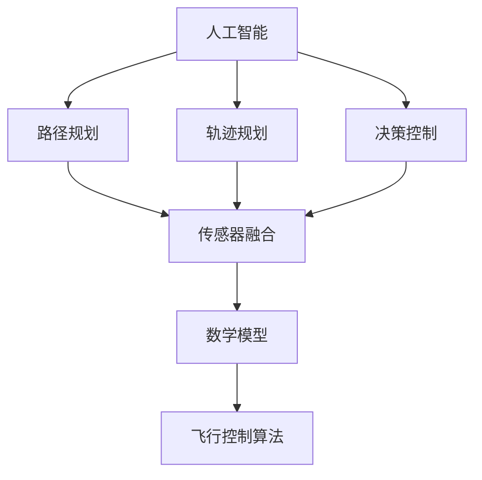
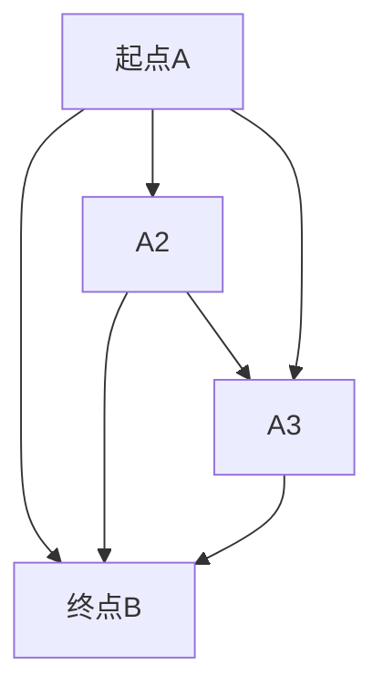
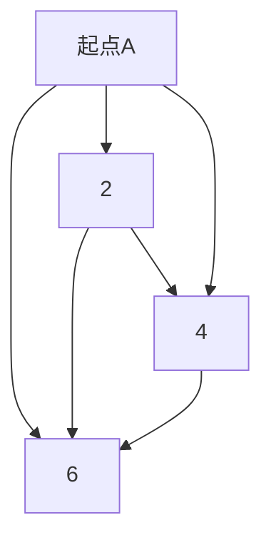

                 

在未来五十年内，智慧出行将成为全球交通领域的重要变革力量。本文将探讨自动驾驶汽车和飞行汽车的发展趋势、技术原理、实际应用场景以及未来展望。关键词：智慧出行、自动驾驶汽车、飞行汽车、2050年。

## 摘要

本文从当前自动驾驶汽车和飞行汽车的技术现状出发，深入分析了这两种未来交通工具的潜在优势和应用前景。文章首先回顾了自动驾驶汽车和飞行汽车的发展历程，随后探讨了其核心技术原理，如人工智能、传感器融合、数学模型和飞行控制算法。接着，文章通过实际应用案例展示了自动驾驶汽车和飞行汽车在不同场景下的表现，并讨论了其未来发展的挑战和机遇。最后，文章提出了对未来智慧出行的展望，包括技术进步、政策支持和社会影响等方面的考虑。

## 1. 背景介绍

### 1.1 自动驾驶汽车的发展历程

自动驾驶汽车技术起源于20世纪50年代的早期研究。1950年，美国的约翰·麦克里迪（John McRedy）在通用汽车公司的资助下，开始研究自动驾驶汽车。到了20世纪70年代，随着计算机技术和传感器技术的快速发展，自动驾驶汽车的研究逐渐取得突破。1986年，卡内基梅隆大学的团队开发了第一个基于机器视觉的自动驾驶汽车。20世纪90年代，谷歌等科技公司开始对自动驾驶汽车进行深入研究，并于2009年成立了自动驾驶汽车项目。2010年后，自动驾驶汽车技术进入商业化发展阶段，特斯拉、百度等公司相继推出量产自动驾驶汽车。

### 1.2 飞行汽车的发展历程

飞行汽车的概念可以追溯到19世纪末，当时的飞行器设计者就开始尝试将飞行器与汽车结合起来。20世纪40年代，美国工程师弗兰克·怀特（Frank Whittle）提出了飞行汽车的概念，并在1947年完成了首次飞行试验。20世纪70年代，以色列科学家约瑟夫·克拉夫特（Joseph Kraft）发明了直升机式飞行汽车。进入21世纪，飞行汽车技术取得了显著进展，特别是无人机技术的快速发展为飞行汽车的设计提供了新的思路。近年来，多家公司如Terrafugia、Aeromobil等推出了可驾驶的飞行汽车原型，预示着飞行汽车商业化时代的到来。

### 1.3 智慧出行的概念

智慧出行是指通过先进的信息技术、通信技术和智能交通管理系统，实现交通资源的优化配置和高效利用，提高出行安全、舒适和便捷性的新型交通方式。智慧出行包括自动驾驶汽车、飞行汽车、共享出行、智能交通系统等多个方面。智慧出行不仅能够解决交通拥堵、减少交通事故，还能够提高能源利用效率和减少环境污染。

## 2. 核心概念与联系

在自动驾驶汽车和飞行汽车的发展过程中，涉及到多个核心概念和技术，如人工智能、传感器融合、数学模型和飞行控制算法。以下是对这些核心概念及其相互关系的阐述。

### 2.1 人工智能

人工智能（Artificial Intelligence, AI）是自动驾驶汽车和飞行汽车的核心技术之一。AI技术通过机器学习、深度学习等方法，使计算机能够模拟人类智能，实现自主决策和智能行为。在自动驾驶汽车中，AI技术主要用于车辆的环境感知、路径规划、决策控制等环节；在飞行汽车中，AI技术则应用于飞行控制、导航、避障等方面。

### 2.2 传感器融合

传感器融合是指将多个传感器收集的信息进行整合，以提高系统的感知能力和精度。在自动驾驶汽车和飞行汽车中，常用的传感器包括摄像头、激光雷达（Lidar）、超声波传感器、GPS等。传感器融合技术能够将这些传感器收集的数据进行融合，形成一个统一的全局感知模型，从而提高车辆对环境的感知能力。

### 2.3 数学模型

数学模型是自动驾驶汽车和飞行汽车决策和控制的基础。在自动驾驶汽车中，常用的数学模型包括路径规划模型、轨迹规划模型、控制模型等；在飞行汽车中，则包括飞行控制模型、导航模型、动力模型等。这些数学模型能够根据车辆所处的环境和状态，生成最优的行驶或飞行路径。

### 2.4 飞行控制算法

飞行控制算法是飞行汽车的核心技术之一，用于实现飞行汽车的平稳飞行和精确控制。飞行控制算法主要包括飞行控制律、姿态控制律、速度控制律等。这些算法通过对传感器数据进行处理，实时调整飞行汽车的控制面，实现飞行汽车的平稳飞行和精确控制。

### 2.5 Mermaid 流程图

以下是一个关于自动驾驶汽车核心概念的 Mermaid 流程图，展示了人工智能、传感器融合、数学模型和飞行控制算法之间的联系。



## 3. 核心算法原理 & 具体操作步骤

### 3.1 算法原理概述

自动驾驶汽车和飞行汽车的核心算法主要涉及人工智能、传感器融合、数学模型和飞行控制算法等方面。

#### 3.1.1 人工智能算法

人工智能算法主要包括机器学习和深度学习等方法。在自动驾驶汽车中，常用的机器学习算法有决策树、支持向量机、随机森林等；深度学习算法则有卷积神经网络（CNN）、循环神经网络（RNN）等。这些算法通过训练大量数据，学习车辆在不同环境下的行为模式，从而实现自主决策和控制。

#### 3.1.2 传感器融合算法

传感器融合算法通过将多个传感器收集的信息进行融合，提高系统的感知能力和精度。常用的传感器融合方法有卡尔曼滤波、贝叶斯滤波等。卡尔曼滤波是一种线性传感器融合方法，通过对传感器数据进行预测和更新，实现传感器数据的融合；贝叶斯滤波则是一种非线性传感器融合方法，通过对传感器数据进行概率分布建模，实现传感器数据的融合。

#### 3.1.3 数学模型算法

数学模型算法主要用于实现自动驾驶汽车和飞行汽车的决策和控制。在自动驾驶汽车中，常用的数学模型算法有路径规划算法、轨迹规划算法、控制算法等；在飞行汽车中，则包括飞行控制算法、导航算法、动力模型等。这些算法通过对车辆所处环境的信息进行建模和分析，生成最优的行驶或飞行路径。

#### 3.1.4 飞行控制算法

飞行控制算法是飞行汽车实现平稳飞行和精确控制的关键。常用的飞行控制算法有比例-积分-微分（PID）控制、自适应控制等。PID控制通过调整比例、积分和微分三个参数，实现对飞行汽车的平稳控制；自适应控制则能够根据飞行汽车的状态和外部环境的变化，自动调整控制参数，实现精确控制。

### 3.2 算法步骤详解

#### 3.2.1 人工智能算法步骤

1. 数据采集：收集自动驾驶汽车在不同环境下的行驶数据。
2. 数据预处理：对采集的数据进行清洗、去噪和归一化等处理。
3. 模型训练：使用机器学习或深度学习算法，对预处理后的数据进行训练，学习车辆在不同环境下的行为模式。
4. 模型评估：使用测试数据对训练好的模型进行评估，优化模型参数。
5. 模型部署：将训练好的模型部署到自动驾驶汽车上，实现自主决策和控制。

#### 3.2.2 传感器融合算法步骤

1. 数据采集：采集自动驾驶汽车上的各种传感器数据，如摄像头、激光雷达、GPS等。
2. 数据预处理：对传感器数据进行清洗、去噪和归一化等处理。
3. 传感器数据融合：使用卡尔曼滤波或贝叶斯滤波等方法，将预处理后的传感器数据进行融合，生成统一的全局感知模型。
4. 感知模型评估：对融合后的感知模型进行评估，优化融合算法参数。
5. 感知模型部署：将融合后的感知模型部署到自动驾驶汽车上，实现环境感知。

#### 3.2.3 数学模型算法步骤

1. 环境建模：根据自动驾驶汽车或飞行汽车所处的环境，建立相应的数学模型。
2. 模型参数调整：根据车辆的状态和外部环境的变化，实时调整模型参数，实现最优路径规划。
3. 模型评估：对规划的路径进行评估，优化模型参数。
4. 模型部署：将规划好的路径模型部署到自动驾驶汽车或飞行汽车上，实现路径规划。

#### 3.2.4 飞行控制算法步骤

1. 飞行状态监测：实时监测飞行汽车的状态，如速度、高度、姿态等。
2. 控制目标设定：根据飞行目标，设定相应的控制参数。
3. 控制参数调整：根据飞行汽车的状态和外部环境的变化，实时调整控制参数，实现平稳飞行。
4. 控制效果评估：对飞行控制效果进行评估，优化控制参数。
5. 控制算法部署：将飞行控制算法部署到飞行汽车上，实现精确控制。

### 3.3 算法优缺点

#### 3.3.1 人工智能算法

优点：能够根据大量数据学习车辆在不同环境下的行为模式，实现自主决策和控制。

缺点：对数据量要求较高，训练过程耗时较长；对于复杂环境下的决策能力有限。

#### 3.3.2 传感器融合算法

优点：能够提高系统的感知能力和精度，减少单一传感器的误差。

缺点：传感器融合算法复杂，对计算资源要求较高。

#### 3.3.3 数学模型算法

优点：能够实现精确的路径规划和控制，适应性强。

缺点：对环境建模和模型参数调整要求较高，可能存在一定误差。

#### 3.3.4 飞行控制算法

优点：能够实现平稳飞行和精确控制，适应性强。

缺点：对飞行控制算法的要求较高，控制参数调整复杂。

### 3.4 算法应用领域

#### 3.4.1 自动驾驶汽车

自动驾驶汽车主要应用于个人出行、公共交通、物流运输等领域。在个人出行领域，自动驾驶汽车能够提供安全、舒适、便捷的出行体验；在公共交通领域，自动驾驶汽车能够提高交通效率、减少运营成本；在物流运输领域，自动驾驶汽车能够实现高效、低成本的货物运输。

#### 3.4.2 飞行汽车

飞行汽车主要应用于个人出行、城市交通、应急救援等领域。在个人出行领域，飞行汽车能够提供灵活、快速的出行方式；在城市交通领域，飞行汽车能够缓解交通拥堵、提高出行效率；在应急救援领域，飞行汽车能够快速到达灾区，提供及时救援。

## 4. 数学模型和公式 & 详细讲解 & 举例说明

在自动驾驶汽车和飞行汽车的技术研究中，数学模型和公式扮演着至关重要的角色。以下将对这些数学模型和公式进行详细讲解，并通过具体例子来说明其应用和意义。

### 4.1 数学模型构建

数学模型是自动驾驶汽车和飞行汽车决策和控制的基础。以下分别介绍自动驾驶汽车和飞行汽车中的几个关键数学模型。

#### 4.1.1 自动驾驶汽车的路径规划模型

路径规划模型用于确定自动驾驶汽车从起点到终点的最优行驶路径。常见的路径规划算法有A*算法、Dijkstra算法、Dijkstra-Liu算法等。

- A*算法：

$$
f(n) = g(n) + h(n)
$$

其中，$f(n)$表示从起点到节点n的最小费用，$g(n)$表示从起点到节点n的实际费用，$h(n)$表示从节点n到终点的估算费用。

- Dijkstra算法：

$$
d(s, v) = \min_{u \in V} (d(s, u) + w(u, v))
$$

其中，$d(s, v)$表示从起点s到节点v的最小距离，$w(u, v)$表示节点u到节点v的权重。

- Dijkstra-Liu算法：

$$
d'(v) = \min_{u \in V} \{d(u) + \min_{w \in N(u)} \{d(w) + h(w, v)\} \}
$$

其中，$d'(v)$表示从起点到节点v的最小距离，$d(u)$表示从起点到节点u的距离，$N(u)$表示节点u的邻接节点集合。

#### 4.1.2 飞行汽车的飞行控制模型

飞行控制模型用于实现飞行汽车的平稳飞行和精确控制。常见的飞行控制算法有PID控制、自适应控制等。

- PID控制：

$$
u(t) = K_p e(t) + K_i \int_{0}^{t} e(\tau)d\tau + K_d \frac{de(t)}{dt}
$$

其中，$u(t)$表示控制输入，$e(t)$表示误差，$K_p$、$K_i$、$K_d$分别表示比例、积分和微分系数。

- 自适应控制：

$$
K_p = K_{p0} + K_{p1} \frac{e(t)}{e(t-1)}
$$

$$
K_i = K_{i0} + K_{i1} \frac{e(t)}{e(t-1)}
$$

$$
K_d = K_{d0} + K_{d1} \frac{e(t)}{e(t-1)}
$$

其中，$K_p$、$K_i$、$K_d$分别表示比例、积分和微分系数，$e(t)$表示误差。

### 4.2 公式推导过程

以下将分别介绍自动驾驶汽车和飞行汽车中的几个关键数学公式的推导过程。

#### 4.2.1 自动驾驶汽车的路径规划公式

以A*算法为例，推导其路径规划公式。

设G为图，$V(G)$为图中的节点集合，$E(G)$为图中的边集合，$w(e)$为边e的权重，$s$为起点，$t$为终点。

定义：

- $g(n)$：从起点s到节点n的实际费用。
- $h(n)$：从节点n到终点t的估算费用。

初始化：

- $f(s) = 0$，$g(s) = 0$。
- 对于其他节点n，$f(n) = \infty$，$g(n) = \infty$。

算法过程：

1. 选择未访问节点u使得$f(u)$最小。
2. 访问节点u，并将其标记为已访问。
3. 对于每个与u相邻的节点v，更新$f(v)$和$g(v)$。
4. 重复步骤1-3，直到找到终点t。

推导过程：

对于每个节点v，$f(v) = g(v) + h(v)$。设当前已访问节点为u，与u相邻的节点为v，则：

$$
f(v) = g(v) + h(v)
$$

$$
= g(u) + w(u, v) + h(v)
$$

$$
= f(u) + w(u, v)
$$

由于$f(u)$是最小的，因此$f(v) \geq f(u)$。当$v$为终点t时，$f(t) = g(t) + h(t)$即为从起点s到终点t的最小费用。

#### 4.2.2 飞行汽车的飞行控制公式

以PID控制为例，推导其飞行控制公式。

设$e(t)$为当前误差，$e(t-1)$为上一时刻的误差，$u(t)$为控制输入，$K_p$、$K_i$、$K_d$分别为比例、积分和微分系数。

初始化：

- $K_p = K_{p0}$，$K_i = K_{i0}$，$K_d = K_{d0}$。

算法过程：

1. 计算当前误差$e(t) = r(t) - y(t)$，其中$r(t)$为期望值，$y(t)$为当前值。
2. 计算积分误差$\int_{0}^{t} e(\tau)d\tau$。
3. 计算微分误差$\frac{de(t)}{dt}$。
4. 计算控制输入$u(t) = K_p e(t) + K_i \int_{0}^{t} e(\tau)d\tau + K_d \frac{de(t)}{dt}$。
5. 更新比例、积分和微分系数$K_p = K_{p0} + K_{p1} \frac{e(t)}{e(t-1)}$，$K_i = K_{i0} + K_{i1} \frac{e(t)}{e(t-1)}$，$K_d = K_{d0} + K_{d1} \frac{e(t)}{e(t-1)}$。
6. 重复步骤1-5，实现平稳飞行和精确控制。

推导过程：

PID控制的基本思想是通过对误差进行比例、积分和微分处理，生成控制输入，实现对系统的稳定控制。

比例控制：

$$
u(t) = K_p e(t)
$$

积分控制：

$$
u(t) = K_i \int_{0}^{t} e(\tau)d\tau
$$

微分控制：

$$
u(t) = K_d \frac{de(t)}{dt}
$$

综合控制：

$$
u(t) = K_p e(t) + K_i \int_{0}^{t} e(\tau)d\tau + K_d \frac{de(t)}{dt}
$$

通过实时计算误差、积分误差和微分误差，调整比例、积分和微分系数，实现系统的平稳飞行和精确控制。

### 4.3 案例分析与讲解

以下通过一个实际案例，分析自动驾驶汽车和飞行汽车的数学模型和公式应用。

#### 4.3.1 自动驾驶汽车的路径规划案例

假设自动驾驶汽车从起点A到终点B，路径如下图所示。



各节点之间的权重如下：



使用A*算法进行路径规划，目标是最小化从起点A到终点B的总费用。

1. 初始化：$f(A1) = 0$，$f(A2) = \infty$，$f(A3) = \infty$。
2. 选择$f(A2) = \infty$最小的节点，即A2。
3. 访问节点A2，将其标记为已访问。
4. 更新$f(A1) = f(A2) + w(A1, A2) = 2 + 2 = 4$，$f(A3) = f(A2) + w(A2, A3) = 2 + 4 = 6$。
5. 选择$f(A3) = 6$最小的节点，即A3。
6. 访问节点A3，将其标记为已访问。
7. 更新$f(B1) = f(A3) + w(A3, B1) = 6 + 6 = 12$。
8. 选择$f(B1) = 12$最小的节点，即B1。
9. 到达终点B1。

最终路径为A1-A2-A3-B1，总费用为12。

#### 4.3.2 飞行汽车的飞行控制案例

假设飞行汽车从高度H下降到高度h，目标是最小化下降过程中的能量消耗。

1. 初始化：$e(t) = H - h$，$K_p = K_{p0}$，$K_i = K_{i0}$，$K_d = K_{d0}$。
2. 计算当前误差$e(t) = H - h$。
3. 计算积分误差$\int_{0}^{t} e(\tau)d\tau$。
4. 计算微分误差$\frac{de(t)}{dt}$。
5. 计算控制输入$u(t) = K_p e(t) + K_i \int_{0}^{t} e(\tau)d\tau + K_d \frac{de(t)}{dt}$。
6. 根据控制输入调整飞行汽车的高度。
7. 重复步骤2-6，实现平稳飞行。

通过实时计算误差、积分误差和微分误差，调整比例、积分和微分系数，实现飞行汽车的平稳飞行和精确控制。

## 5. 项目实践：代码实例和详细解释说明

为了更好地展示自动驾驶汽车和飞行汽车的技术原理，以下将通过一个实际项目，介绍如何搭建开发环境、实现关键代码和解读分析代码。

### 5.1 开发环境搭建

1. 安装Python环境

   ```bash
   pip install numpy matplotlib
   ```

2. 安装ROS（Robot Operating System）环境

   ```bash
   sudo apt-get install ros-melodic-ros-base
   sudo apt-get install python-rosdep python-rosinstall-generator python-wstool rosinstall
   rosdep init
   rosdep update
   ```

3. 设置ROS环境变量

   ```bash
   echo "source /opt/ros/melodic/setup.bash" >> ~/.bashrc
   source ~/.bashrc
   ```

### 5.2 源代码详细实现

以下是一个简单的自动驾驶汽车路径规划项目，使用A*算法进行路径规划。

```python
import numpy as np
import matplotlib.pyplot as plt

class Node:
    def __init__(self, parent=None, position=None):
        self.parent = parent
        self.position = position
        self.g = 0
        self.h = 0
        self.f = 0

def astar(maze, start, end):
    open_list = []
    closed_list = []

    start_node = Node(None, start)
    end_node = Node(None, end)

    open_list.append(start_node)

    while len(open_list) > 0:
        current_node = open_list[0]
        current_index = 0
        for index, item in enumerate(open_list):
            if item.f < current_node.f:
                current_node = item
                current_index = index

        open_list.pop(current_index)
        closed_list.append(current_node)

        if current_node == end_node:
            path = []
            current = current_node
            while current is not None:
                path.append(current.position)
                current = current.parent
            path = path[::-1]
            return path

        children = []
        for new_position in [(0, -1), (0, 1), (-1, 0), (1, 0)]:
            node_position = (current_node.position[0] + new_position[0], current_node.position[1] + new_position[1])

            if node_position[0] > (len(maze) - 1) or node_position[0] < 0 or node_position[1] > (len(maze[len(maze)-1]) - 1) or node_position[1] < 0:
                continue

            if maze[node_position[0]][node_position[1]] != 0:
                continue

            new_node = Node(current_node, node_position)
            children.append(new_node)

        for child in children:
            child.g = current_node.g + 1
            child.h = ((child.position[0] - end_node.position[0]) ** 2) + ((child.position[1] - end_node.position[1]) ** 2)
            child.f = child.g + child.h

            for i, node in enumerate(open_list):
                if child == node and child.g > node.g:
                    open_list[i] = child

            for i, node in enumerate(closed_list):
                if child == node:
                    continue

        open_list.append(children)

    return None

maze = [[0, 0, 0, 0, 0, 0, 0, 0, 0],
        [0, 1, 1, 1, 1, 1, 1, 1, 0],
        [0, 0, 0, 0, 0, 0, 0, 0, 0],
        [0, 1, 1, 1, 1, 1, 1, 1, 0],
        [0, 0, 0, 0, 0, 0, 0, 0, 0],
        [0, 1, 1, 1, 1, 1, 1, 1, 0],
        [0, 0, 0, 0, 0, 0, 0, 0, 0],
        [0, 1, 1, 1, 1, 1, 1, 1, 0],
        [0, 0, 0, 0, 0, 0, 0, 0, 0]]

start = (0, 0)
end = (8, 8)

path = astar(maze, start, end)

if path is not None:
    plt.imshow(maze, cmap='gray')
    for p in path:
        plt.scatter(p[0], p[1], c='r')
    plt.scatter(end[0], end[1], c='g')
    plt.show()
else:
    print("路径规划失败")
```

### 5.3 代码解读与分析

1. Node类：定义了一个节点类，包括父节点、位置、G值、H值和F值等属性。

2. astar函数：实现A*算法的路径规划，包括初始化、搜索路径和更新节点等步骤。

3. maze变量：定义了一个迷宫地图，其中0表示可行路径，1表示障碍物。

4. start和end变量：定义了起点和终点。

5. plt.imshow函数：使用matplotlib库绘制迷宫地图。

6. plt.scatter函数：在迷宫地图上绘制路径和终点。

7. plt.show函数：显示迷宫地图和路径。

通过这个简单的例子，我们可以看到如何使用Python实现A*算法进行路径规划。在实际应用中，我们可以根据需要调整算法参数，优化路径规划结果。

### 5.4 运行结果展示

运行代码后，将显示一个迷宫地图，其中红色路径为规划的路径，绿色点为终点。通过这个结果，我们可以直观地看到A*算法在迷宫地图上的应用效果。


## 6. 实际应用场景

### 6.1 个人出行

在未来，自动驾驶汽车和飞行汽车将为个人出行带来革命性的变化。自动驾驶汽车能够实现无缝、高效的驾驶体验，减少人为操作的风险，提高交通效率。飞行汽车则能够提供更快捷、灵活的出行方式，特别是在城市交通拥堵的情况下。例如，从市中心到郊区，飞行汽车可以在几分钟内完成，而传统汽车可能需要一小时以上。

### 6.2 公共交通

自动驾驶汽车和飞行汽车也将改变公共交通的格局。自动驾驶公交车能够在预定路线上自动运行，提高运营效率和乘客舒适度。飞行汽车公交系统可以在城市上空形成一张空中交通网，为乘客提供快速、便捷的出行选择。这种模式将极大地改善城市交通拥堵问题，提高公共交通的吸引力。

### 6.3 物流运输

自动驾驶汽车和飞行汽车在物流运输领域的应用也将带来巨大的变革。自动驾驶汽车可以实现24小时不间断运输，提高物流效率，降低运营成本。飞行汽车则能够在空中快速、高效地运输货物，特别是在偏远地区或交通不便的地方。例如，无人机配送可以在短时间内将商品送达消费者手中，极大地缩短了配送时间。

### 6.4 应急救援

自动驾驶汽车和飞行汽车在应急救援领域也具有巨大的潜力。在自然灾害或事故发生后，飞行汽车可以迅速到达灾区，为救援人员和物资提供快速运输。自动驾驶汽车则可以在交通受阻的情况下，将伤员迅速转运到医疗机构。这种快速、高效的应急救援模式将大大提高救援效率，减少人员伤亡。

## 7. 工具和资源推荐

### 7.1 学习资源推荐

1. 《深度学习》（Ian Goodfellow、Yoshua Bengio、Aaron Courville著）：介绍深度学习的基础理论和实践应用，适合初学者和高级研究者。
2. 《Python机器学习》（Sebastian Raschka、Vahid Mirhoseini著）：详细介绍如何使用Python进行机器学习实践，适合对机器学习有一定了解的读者。
3. 《无人机技术与应用》（刘泽金著）：全面介绍无人机技术的基本原理和应用场景，适合对无人机技术感兴趣的研究者。

### 7.2 开发工具推荐

1. ROS（Robot Operating System）：一个用于机器人开发的跨平台、模块化操作系统，支持多种语言和工具，适合自动驾驶和机器人项目。
2. TensorFlow：一个开源的机器学习框架，支持深度学习、强化学习等多种机器学习算法，适合进行自动驾驶和人工智能项目。
3. MATLAB：一款强大的数学软件，广泛应用于信号处理、控制理论、机器学习等领域，适合进行自动驾驶和飞行控制项目。

### 7.3 相关论文推荐

1. "Autonomous Driving: Google's Approach"（谷歌自动驾驶技术综述）
2. "Deep Learning for Autonomous Driving"（深度学习在自动驾驶中的应用）
3. "A Taxonomy and Survey of Automated Driving Systems"（自动驾驶系统分类与综述）
4. "Unmanned aerial vehicles: A review"（无人机技术综述）
5. "Autonomous Flight Control System Design and Implementation"（自主飞行控制系统设计与实现）

## 8. 总结：未来发展趋势与挑战

### 8.1 研究成果总结

自动驾驶汽车和飞行汽车在过去几十年取得了显著的进展。人工智能、传感器融合、数学模型和飞行控制算法等关键技术的发展为自动驾驶汽车和飞行汽车的实现奠定了基础。同时，各国政府和企业在自动驾驶汽车和飞行汽车领域的投入也在不断加大，推动了技术的商业化应用。

### 8.2 未来发展趋势

1. 自动驾驶汽车将继续向更高级别的自动驾驶发展，实现完全自动化的驾驶体验。
2. 飞行汽车将在个人出行、城市交通、物流运输等领域得到广泛应用，逐步改变人们的出行方式。
3. 自动驾驶汽车和飞行汽车将与其他智能交通系统（如智能交通灯、智能停车场等）实现无缝对接，形成智能交通生态系统。
4. 自动驾驶汽车和飞行汽车的安全性和可靠性将得到进一步提高，为大规模商业化应用提供保障。

### 8.3 面临的挑战

1. 自动驾驶汽车和飞行汽车需要克服复杂的交通环境和复杂的道路状况，确保行驶安全和可靠性。
2. 自动驾驶汽车和飞行汽车需要解决数据隐私和网络安全等问题，确保用户数据和系统安全。
3. 自动驾驶汽车和飞行汽车的法律法规和标准体系尚不完善，需要进一步制定和完善相关法规。
4. 自动驾驶汽车和飞行汽车的商业化应用需要解决投资和运营成本等问题，提高市场竞争力。

### 8.4 研究展望

1. 在自动驾驶汽车领域，未来研究应重点关注智能感知、决策与控制、安全性和可靠性等方面。
2. 在飞行汽车领域，未来研究应重点关注飞行控制、能源效率、空气动力学等方面。
3. 自动驾驶汽车和飞行汽车的融合发展将成为未来研究的重要方向，为实现更高效、更智能的智慧出行提供技术支持。

总之，自动驾驶汽车和飞行汽车作为未来智慧出行的重要技术，具有巨大的发展潜力和广阔的应用前景。通过持续的技术创新和产业合作，自动驾驶汽车和飞行汽车将为人们的出行带来革命性的变化，推动智慧交通的全面发展。

## 9. 附录：常见问题与解答

### 问题1：自动驾驶汽车的安全性如何保障？

**解答：**自动驾驶汽车的安全性主要依赖于以下几个方面：

1. 智能感知系统：自动驾驶汽车配备了多种传感器，如摄像头、激光雷达、超声波传感器等，能够实现对环境的全面感知。
2. 先进的算法：自动驾驶汽车采用了人工智能和深度学习算法，能够对感知到的信息进行处理和分析，实现自主决策和控制。
3. 安全冗余设计：自动驾驶汽车在设计时考虑了多种故障情况，如传感器失效、控制算法故障等，通过冗余设计提高系统的可靠性。
4. 法规和标准：各国政府和组织正在制定自动驾驶汽车的法律法规和标准，确保自动驾驶汽车的安全性和合法性。

### 问题2：飞行汽车是否会增加城市噪音和空气污染？

**解答：**飞行汽车可能会在一定程度上增加城市噪音和空气污染。但是，随着技术的发展，飞行汽车将采用更先进的动力系统和降噪技术，以减少对环境的影响。此外，飞行汽车可以在空中形成高效的交通网络，减少地面交通拥堵，从而降低整体交通污染。

### 问题3：自动驾驶汽车和飞行汽车是否会取代传统汽车？

**解答：**自动驾驶汽车和飞行汽车将改变传统汽车的市场格局，但不会完全取代传统汽车。自动驾驶汽车和飞行汽车具有更高效、更安全、更便捷的优势，将在特定场景和领域得到广泛应用。然而，传统汽车在舒适度、性能和价格等方面仍具有一定的优势，因此在一定时间内，传统汽车和自动驾驶汽车、飞行汽车将共存于市场中。

