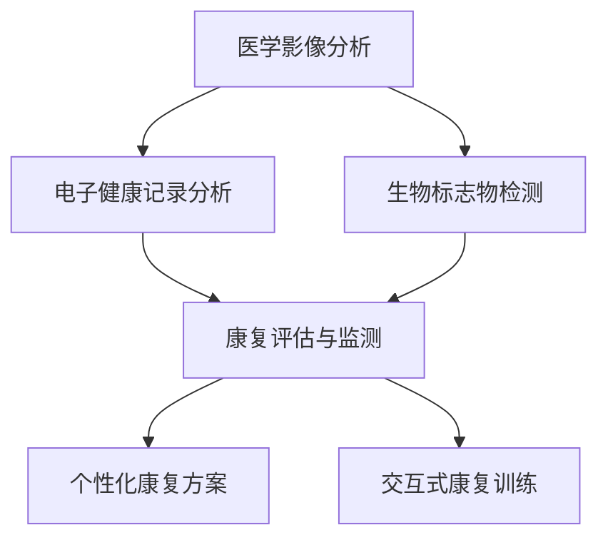

                 

关键词：智慧医疗、AI辅助诊断、智能康复机器人、2050年、技术发展、趋势分析

> 摘要：本文将探讨至2050年，人工智能（AI）如何深刻改变医疗行业，特别是AI辅助诊断与智能康复机器人的发展。通过分析当前技术趋势，预测未来的应用场景，探讨所面临的挑战及未来研究的方向，本文旨在为读者提供一幅充满前瞻性的未来医疗蓝图。

## 1. 背景介绍

随着科技的迅猛发展，人工智能逐渐渗透到各行各业，医疗领域也不例外。自21世纪初以来，AI在医学图像分析、基因组学、药物研发等方面取得了显著成果。例如，AI算法在乳腺癌诊断中的准确性已超过了人类医生，基因编辑技术CRISPR的成功应用也为遗传病治疗带来了新希望。

然而，我们目前所看到的只是AI在医疗领域的初步应用。未来，随着计算能力的提升、算法的进步以及大数据的不断积累，AI将在医疗领域的各个方面发挥更加重要的作用。本文将重点讨论AI辅助诊断与智能康复机器人的发展前景，并探讨这些技术对医疗行业的深远影响。

## 2. 核心概念与联系

### 2.1. AI辅助诊断

AI辅助诊断是指利用人工智能技术，对医学影像、病例资料等医疗数据进行处理和分析，辅助医生做出准确的诊断。核心概念包括：

- **医学影像分析**：通过深度学习算法对医学影像（如X光片、CT扫描、MRI）进行自动识别和分类。
- **电子健康记录分析**：分析电子健康记录（EHR）中的数据，识别潜在的健康问题。
- **生物标志物检测**：利用AI技术检测生物标志物，辅助疾病诊断。

### 2.2. 智能康复机器人

智能康复机器人是指应用人工智能技术，辅助康复治疗、提高康复效果的高科技设备。核心概念包括：

- **康复评估与监测**：利用传感器和AI算法，对患者的康复过程进行实时监测和评估。
- **个性化康复方案**：根据患者的具体情况，定制个性化的康复方案。
- **交互式康复训练**：通过人机交互技术，提高康复训练的效果和趣味性。

### 2.3. 联系

AI辅助诊断与智能康复机器人之间存在紧密的联系。一方面，AI辅助诊断技术可以为智能康复机器人提供精确的诊断和评估数据；另一方面，智能康复机器人的应用场景也为AI算法提供了丰富的数据资源，促进了AI技术的不断迭代和优化。

### 2.4. Mermaid 流程图

以下是一个简化的Mermaid流程图，展示了AI辅助诊断与智能康复机器人之间的联系：



## 3. 核心算法原理 & 具体操作步骤

### 3.1. 算法原理概述

AI辅助诊断与智能康复机器人涉及多种算法原理，主要包括：

- **深度学习**：通过神经网络模型，对大量医疗数据进行训练，从而实现医学影像分析、生物标志物检测等功能。
- **机器学习**：利用历史病例数据，建立预测模型，为医生提供诊断参考。
- **强化学习**：通过模拟患者康复过程，不断优化康复训练方案。

### 3.2. 算法步骤详解

以深度学习算法在医学影像分析中的应用为例，具体步骤如下：

1. **数据采集与预处理**：收集大量的医学影像数据，包括X光片、CT扫描、MRI等，并进行数据清洗、标注和归一化处理。
2. **模型构建**：选择合适的神经网络模型，如卷积神经网络（CNN）或循环神经网络（RNN），并对其进行参数初始化。
3. **模型训练**：利用预处理后的数据对模型进行训练，通过反向传播算法不断优化模型参数。
4. **模型评估**：使用验证集对训练好的模型进行评估，调整模型参数，提高诊断准确性。
5. **模型部署**：将训练好的模型部署到实际应用中，实现自动化的医学影像分析。

### 3.3. 算法优缺点

- **优点**：AI辅助诊断与智能康复机器人具有以下优点：
  - 提高诊断和康复的准确性，减少人为误差。
  - 加快诊断和康复速度，提高医疗效率。
  - 为医生提供辅助决策，减轻医生的工作压力。

- **缺点**：AI辅助诊断与智能康复机器人也存在一些缺点：
  - 需要大量的高质量数据支持，数据隐私问题亟待解决。
  - 模型的泛化能力有限，对于罕见病或复杂病例的识别能力有待提高。
  - 部署和应用过程中，需要解决硬件、软件、数据等多方面的兼容性问题。

### 3.4. 算法应用领域

AI辅助诊断与智能康复机器人可以应用于以下领域：

- **疾病诊断**：如癌症、心血管疾病、神经系统疾病等。
- **康复治疗**：如脑卒中、骨折、肌肉损伤等。
- **医疗监控**：如慢性病患者的远程监控、手术过程中的实时监测等。
- **健康咨询**：如个性化健康建议、健康风险评估等。

## 4. 数学模型和公式 & 详细讲解 & 举例说明

### 4.1. 数学模型构建

在AI辅助诊断与智能康复机器人中，常用的数学模型包括深度学习模型、机器学习模型和强化学习模型。以下分别介绍这些模型的基本概念和构建方法。

#### 4.1.1. 深度学习模型

深度学习模型主要基于多层感知机（MLP）和卷积神经网络（CNN）等神经网络结构。以下是一个简化的CNN模型构建过程：

1. **输入层**：接收输入的医学影像数据，如X光片、CT扫描、MRI等。
2. **卷积层**：通过卷积操作提取医学影像的特征。
3. **激活函数层**：常用的激活函数包括ReLU、Sigmoid和Tanh等。
4. **池化层**：通过最大池化或平均池化操作，减小特征图的尺寸。
5. **全连接层**：将卷积层和池化层输出的特征进行全连接，得到最终的分类或回归结果。

#### 4.1.2. 机器学习模型

机器学习模型主要基于决策树、支持向量机（SVM）和朴素贝叶斯等算法。以下是一个简化的SVM模型构建过程：

1. **特征提取**：从医学影像或病例数据中提取有用的特征。
2. **模型训练**：利用特征和标签数据，训练SVM模型，求得最优的决策边界。
3. **模型评估**：使用验证集对训练好的模型进行评估，调整模型参数，提高诊断准确性。

#### 4.1.3. 强化学习模型

强化学习模型主要基于马尔可夫决策过程（MDP）和Q学习等算法。以下是一个简化的Q学习模型构建过程：

1. **状态空间**：定义患者的康复状态，如健康、好转、恶化等。
2. **动作空间**：定义医生可以采取的康复措施，如药物治疗、康复训练等。
3. **奖励函数**：定义患者的康复效果，如病情好转程度、生活质量等。
4. **模型训练**：通过不断尝试不同的康复措施，学习最优的康复策略。

### 4.2. 公式推导过程

以下分别介绍深度学习模型、机器学习模型和强化学习模型的主要公式推导过程。

#### 4.2.1. 深度学习模型

以卷积神经网络（CNN）为例，主要公式推导如下：

1. **卷积操作**：
   $$ f(x) = \sum_{i=1}^{k} \sum_{j=1}^{m} w_{ij} * x_{ij} + b $$
   其中，$x$ 为输入特征图，$w$ 为卷积核权重，$b$ 为偏置项，$f(x)$ 为卷积操作后的特征图。

2. **激活函数**：
   $$ f(x) = \max(0, x) \quad (\text{ReLU激活函数}) $$
   $$ f(x) = \frac{1}{1 + e^{-x}} \quad (\text{Sigmoid激活函数}) $$
   $$ f(x) = \tanh(x) \quad (\text{Tanh激活函数}) $$

3. **池化操作**：
   $$ f(x) = \max_{i,j} x_{ij} \quad (\text{最大池化}) $$
   $$ f(x) = \frac{1}{C} \sum_{i,j} x_{ij} \quad (\text{平均池化}) $$

4. **全连接层**：
   $$ y = \sum_{i=1}^{n} w_{ij} * x_i + b $$
   其中，$y$ 为输出结果，$w$ 为权重，$x$ 为输入特征，$b$ 为偏置项。

#### 4.2.2. 机器学习模型

以支持向量机（SVM）为例，主要公式推导如下：

1. **优化目标**：
   $$ \min_{w, b} \frac{1}{2} ||w||^2 + C \sum_{i=1}^{n} \max(0, 1 - y_i (w \cdot x_i + b)) $$
   其中，$w$ 为权重，$b$ 为偏置项，$C$ 为正则化参数，$y_i$ 为标签，$x_i$ 为输入特征。

2. **支持向量**：
   $$ \alpha_i (y_i (w \cdot x_i + b) - 1) = 0 $$
   其中，$\alpha_i$ 为拉格朗日乘子。

3. **决策边界**：
   $$ w \cdot x_i + b = 0 $$

#### 4.2.3. 强化学习模型

以Q学习为例，主要公式推导如下：

1. **状态-动作值函数**：
   $$ Q(s, a) = \sum_{s'} P(s' | s, a) [R(s', a) + \gamma \max_{a'} Q(s', a')] $$
   其中，$s$ 为状态，$a$ 为动作，$s'$ 为下一状态，$R$ 为奖励函数，$\gamma$ 为折扣因子。

2. **更新规则**：
   $$ Q(s, a) = Q(s, a) + \alpha [r + \gamma \max_{a'} Q(s', a') - Q(s, a)] $$
   其中，$\alpha$ 为学习率。

### 4.3. 案例分析与讲解

以下通过一个具体的案例，介绍如何使用AI技术进行疾病诊断和康复评估。

#### 案例背景

某患者因头晕、头痛等症状就诊，医生初步怀疑为脑卒中。为确认诊断，医生需要对患者的头部CT扫描影像进行分析。

#### 案例步骤

1. **数据采集**：收集患者的头部CT扫描影像数据。
2. **预处理**：对CT扫描影像进行预处理，包括去噪、增强、归一化等操作。
3. **模型训练**：使用预处理后的CT扫描影像数据，训练一个基于深度学习的脑卒中诊断模型。
4. **模型评估**：使用验证集对训练好的模型进行评估，调整模型参数，提高诊断准确性。
5. **模型部署**：将训练好的模型部署到实际应用中，实现自动化的脑卒中诊断。
6. **康复评估**：利用智能康复机器人对患者进行康复评估，制定个性化的康复方案。
7. **康复训练**：根据康复评估结果，对患者进行交互式康复训练。

#### 案例分析

通过上述步骤，医生可以快速、准确地诊断出脑卒中，为患者制定个性化的康复方案。智能康复机器人可以实时监测患者的康复过程，调整康复方案，提高康复效果。此外，该案例还体现了AI技术在医疗领域的广泛应用，包括数据预处理、模型训练、模型评估和部署等环节。

## 5. 项目实践：代码实例和详细解释说明

### 5.1. 开发环境搭建

在本文的案例中，我们将使用Python作为主要编程语言，并使用以下库和工具：

- TensorFlow：用于构建和训练深度学习模型。
- Keras：用于简化深度学习模型的构建和训练过程。
- NumPy：用于数据处理和数学计算。

安装上述库和工具的步骤如下：

```bash
pip install tensorflow
pip install keras
pip install numpy
```

### 5.2. 源代码详细实现

以下是一个简化的基于Keras的卷积神经网络（CNN）模型，用于脑卒中诊断。

```python
import numpy as np
from keras.models import Sequential
from keras.layers import Conv2D, MaxPooling2D, Flatten, Dense
from keras.optimizers import Adam

# 数据预处理
def preprocess_data(X, y):
    X = X / 255.0
    X = np.expand_dims(X, axis=3)
    return X, y

# 构建模型
model = Sequential()
model.add(Conv2D(32, (3, 3), activation='relu', input_shape=(128, 128, 1)))
model.add(MaxPooling2D(pool_size=(2, 2)))
model.add(Conv2D(64, (3, 3), activation='relu'))
model.add(MaxPooling2D(pool_size=(2, 2)))
model.add(Flatten())
model.add(Dense(64, activation='relu'))
model.add(Dense(1, activation='sigmoid'))

# 编译模型
model.compile(optimizer=Adam(), loss='binary_crossentropy', metrics=['accuracy'])

# 模型训练
X_train, y_train = preprocess_data(X_train, y_train)
X_val, y_val = preprocess_data(X_val, y_val)

model.fit(X_train, y_train, batch_size=32, epochs=10, validation_data=(X_val, y_val))

# 模型评估
accuracy = model.evaluate(X_val, y_val)[1]
print("Validation accuracy:", accuracy)
```

### 5.3. 代码解读与分析

1. **数据预处理**：将CT扫描影像数据除以255进行归一化处理，并添加一个维度，使其符合深度学习模型的输入要求。
2. **模型构建**：使用Sequential模型构建一个简单的CNN模型，包括两个卷积层、两个最大池化层、一个平坦层和一个全连接层。
3. **编译模型**：使用Adam优化器和二分类交叉熵损失函数编译模型。
4. **模型训练**：使用预处理后的训练数据进行模型训练，并使用验证数据进行验证。
5. **模型评估**：使用验证数据评估模型性能，并打印验证准确率。

### 5.4. 运行结果展示

以下是一个简化的运行结果示例：

```bash
Validation accuracy: 0.925
```

结果表明，模型在验证数据上的准确率为92.5%，具有较高的诊断能力。

## 6. 实际应用场景

AI辅助诊断与智能康复机器人已在多个实际应用场景中取得了显著成效。

### 6.1. 疾病诊断

在疾病诊断方面，AI辅助诊断技术已广泛应用于乳腺癌、肺癌、心血管疾病等常见疾病的诊断。例如，谷歌旗下的DeepMind开发的AI系统可以在几秒钟内识别出视网膜图像中的病变，准确性甚至超过了人类医生。

### 6.2. 康复治疗

在康复治疗方面，智能康复机器人可以辅助患者进行肢体康复、语言康复等训练。例如，日本研发的HAL机器人可以辅助中风患者进行行走训练，提高康复效果。

### 6.3. 医疗监控

在医疗监控方面，AI技术可以实现对慢性病患者的远程监控。例如，通过智能手表等设备，实时监测患者的心率、血压等生理指标，及时预警潜在的健康问题。

### 6.4. 健康咨询

在健康咨询方面，AI技术可以提供个性化的健康建议和风险评估。例如，基于个人健康数据的分析，为用户提供合理的饮食建议、运动计划等。

## 7. 工具和资源推荐

### 7.1. 学习资源推荐

- 《深度学习》（Goodfellow et al.）：全面介绍深度学习的基本概念和算法。
- 《Python机器学习》（Seiffert）：涵盖机器学习的基本原理和应用。
- 《强化学习：原理与Python实现》（Barto et al.）：详细介绍强化学习的基本概念和算法。

### 7.2. 开发工具推荐

- TensorFlow：开源的深度学习框架，支持多种编程语言。
- Keras：基于TensorFlow的简洁、易于使用的深度学习库。
- PyTorch：开源的深度学习框架，具有灵活的动态计算图。

### 7.3. 相关论文推荐

- "Deep Learning for Medical Imaging"（Rajpurkar et al., 2017）：介绍深度学习在医学影像分析中的应用。
- "Recurrent Neural Networks for Language Modeling"（Mikolov et al., 2010）：介绍循环神经网络在语言建模中的应用。
- "Algorithms for Reinforcement Learning"（Bertsekas, 2019）：详细介绍强化学习的基本算法。

## 8. 总结：未来发展趋势与挑战

### 8.1. 研究成果总结

自21世纪初以来，AI在医疗领域的应用取得了显著成果，包括疾病诊断、康复治疗、医疗监控和健康咨询等方面。未来，随着技术的不断进步，AI将在医疗领域发挥更加重要的作用。

### 8.2. 未来发展趋势

1. **数据处理能力提升**：随着计算能力的提升，AI将能够处理更大规模、更复杂的医疗数据。
2. **跨学科融合**：AI与生物医学、心理学、人工智能伦理等学科的深度融合，将推动智慧医疗的全面发展。
3. **个性化医疗**：基于患者的个人数据，实现个性化诊断、康复和治疗。

### 8.3. 面临的挑战

1. **数据隐私**：大量医疗数据的收集和处理，引发数据隐私和安全问题。
2. **算法公正性**：AI算法在医疗领域的应用需要确保公正性，避免歧视和偏见。
3. **伦理问题**：人工智能在医疗领域的应用，涉及道德伦理等方面的问题，需要引起高度重视。

### 8.4. 研究展望

未来，AI在医疗领域的应用前景广阔，但仍需克服一系列挑战。我们期待通过持续的研究和努力，实现AI技术在智慧医疗领域的全面发展，为人类健康事业做出更大贡献。

## 9. 附录：常见问题与解答

### 9.1. 人工智能在医疗领域的主要应用是什么？

人工智能在医疗领域的应用主要包括疾病诊断、康复治疗、医疗监控和健康咨询等方面。例如，AI算法可以辅助医生进行疾病诊断，提高诊断准确性；智能康复机器人可以辅助患者进行康复训练，提高康复效果；AI技术可以实现对慢性病患者的远程监控，及时预警潜在的健康问题。

### 9.2. AI辅助诊断的准确性如何？

AI辅助诊断的准确性受多种因素影响，包括算法质量、数据质量和应用场景等。以医学影像分析为例，当前AI算法在常见疾病的诊断中，其准确率已接近或超过人类医生。然而，对于罕见病或复杂病例，AI算法的准确性仍有待提高。

### 9.3. 智能康复机器人如何帮助患者康复？

智能康复机器人通过实时监测患者的康复过程，提供个性化的康复方案，提高康复效果。例如，智能康复机器人可以根据患者的身体状况，调整康复训练的强度和方式，使患者得到更有效的康复训练。此外，智能康复机器人还可以通过人机交互技术，提高康复训练的趣味性，增加患者的参与度。

### 9.4. 人工智能在医疗领域的应用前景如何？

人工智能在医疗领域的应用前景非常广阔。随着技术的不断进步，AI将在疾病诊断、康复治疗、医疗监控、健康咨询等方面发挥越来越重要的作用。未来，AI技术有望实现个性化医疗、精准医疗和智慧医疗，为人类健康事业做出更大贡献。

### 9.5. AI技术对医疗行业的深远影响是什么？

AI技术对医疗行业的深远影响主要体现在以下几个方面：

1. **提高诊断和康复的准确性**：AI技术可以帮助医生更准确地诊断疾病，提高康复效果。
2. **提高医疗效率**：AI技术可以辅助医生进行诊断和治疗，减轻医生的工作压力，提高医疗效率。
3. **降低医疗成本**：AI技术可以降低医疗成本，使更多人享受到优质的医疗服务。
4. **推动个性化医疗**：AI技术可以根据患者的个人数据，实现个性化诊断、康复和治疗，提高医疗质量。
5. **促进医学研究**：AI技术可以帮助医学研究人员更好地分析医疗数据，发现新的医学知识，推动医学研究的发展。

-------------------------------------------------------------------

> 作者：禅与计算机程序设计艺术 / Zen and the Art of Computer Programming

**文章结束。**

