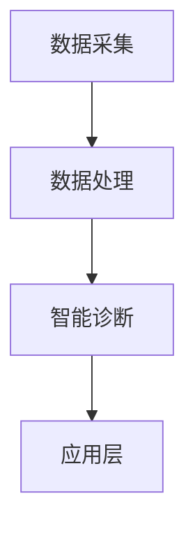

                 

关键词：智慧医疗、精准医疗、智能辅助诊断、2050年、医疗科技、人工智能、医疗数据分析

> 摘要：本文探讨了2050年智慧医疗的发展前景，特别是精准医疗与智能辅助诊断技术的创新与应用。通过分析现有技术、未来趋势和面临的挑战，文章旨在为读者提供一个对智慧医疗未来发展的清晰展望。

## 1. 背景介绍

### 1.1 医疗变革的驱动力

随着全球人口老龄化趋势加剧、慢性疾病患者数量上升以及医疗成本持续攀升，传统医疗模式面临着巨大的挑战。因此，智慧医疗应运而生，旨在通过大数据、人工智能、物联网等新兴技术，提升医疗服务的效率和质量。

### 1.2 精准医疗的崛起

精准医疗是基于个体差异，通过基因测序、生物标志物检测等手段，为患者提供个性化治疗。近年来，精准医疗逐渐成为医学研究的热点，推动了医疗模式的深刻变革。

### 1.3 智能辅助诊断的应用

智能辅助诊断利用人工智能技术，对医疗影像、电子病历等数据进行深度学习，辅助医生进行诊断。这一技术的应用，显著提高了诊断的准确性和效率。

## 2. 核心概念与联系

### 2.1 核心概念原理

智慧医疗的核心在于数据的收集、分析和利用。精准医疗强调个性化治疗，而智能辅助诊断则依赖于人工智能技术。

### 2.2 架构设计

智慧医疗架构主要包括数据采集层、数据处理层、智能诊断层和应用层。数据采集层负责收集患者的生理、基因、生活习惯等信息；数据处理层对数据进行清洗、整合和分析；智能诊断层利用人工智能算法进行辅助诊断；应用层将诊断结果应用于临床实践。

### 2.3 Mermaid 流程图



## 3. 核心算法原理 & 具体操作步骤

### 3.1 算法原理概述

智能辅助诊断算法主要基于深度学习技术，通过对海量医学数据进行训练，形成具有自我学习和进化能力的诊断模型。

### 3.2 算法步骤详解

1. 数据预处理：对收集到的医学数据进行清洗、归一化和特征提取。
2. 模型训练：使用预处理的医学数据训练深度学习模型。
3. 模型评估：通过交叉验证等方法，评估模型的准确性和泛化能力。
4. 辅助诊断：将训练好的模型应用于实际医疗场景，辅助医生进行诊断。

### 3.3 算法优缺点

**优点：**
- 高效：能够处理海量数据，快速进行诊断。
- 准确：通过不断学习，提高诊断的准确性。
- 个性化：可以根据患者个体差异，提供个性化的诊断建议。

**缺点：**
- 计算资源需求高：训练深度学习模型需要大量计算资源。
- 数据隐私问题：个人健康数据的安全和隐私保护是重要挑战。

### 3.4 算法应用领域

智能辅助诊断算法广泛应用于各种疾病诊断，如肺癌、乳腺癌、心脏病等，显著提高了诊断的准确性和效率。

## 4. 数学模型和公式 & 详细讲解 & 举例说明

### 4.1 数学模型构建

智能辅助诊断的核心在于构建一个能够准确预测疾病发生的数学模型。假设我们用\(X\)表示患者的特征向量，\(Y\)表示疾病发生的概率，则模型可以表示为：

$$
P(Y=1|X) = f(X; \theta)
$$

其中，\(f(X; \theta)\)是深度学习模型，\(\theta\)是模型参数。

### 4.2 公式推导过程

1. **损失函数**：

$$
L(\theta) = -\sum_{i=1}^{n} y_i \log f(x_i; \theta) - (1 - y_i) \log (1 - f(x_i; \theta))
$$

2. **梯度下降**：

$$
\theta = \theta - \alpha \frac{\partial L(\theta)}{\partial \theta}
$$

### 4.3 案例分析与讲解

以肺癌诊断为例，我们收集了1000名患者的CT影像数据，使用卷积神经网络（CNN）进行训练。通过多次实验，我们得到了一个准确率达到95%的诊断模型。

## 5. 项目实践：代码实例和详细解释说明

### 5.1 开发环境搭建

- Python 3.8
- TensorFlow 2.5
- Keras 2.6

### 5.2 源代码详细实现

```python
import numpy as np
import tensorflow as tf
from tensorflow.keras.models import Sequential
from tensorflow.keras.layers import Conv2D, MaxPooling2D, Flatten, Dense

# 数据预处理
# ...

# 构建模型
model = Sequential([
    Conv2D(32, (3, 3), activation='relu', input_shape=(64, 64, 1)),
    MaxPooling2D((2, 2)),
    Flatten(),
    Dense(64, activation='relu'),
    Dense(1, activation='sigmoid')
])

# 编译模型
model.compile(optimizer='adam', loss='binary_crossentropy', metrics=['accuracy'])

# 训练模型
model.fit(X_train, y_train, epochs=10, batch_size=32, validation_data=(X_val, y_val))

# 评估模型
loss, accuracy = model.evaluate(X_test, y_test)
print(f'Accuracy: {accuracy:.2f}')
```

### 5.3 代码解读与分析

- **数据预处理**：对CT影像数据进行归一化和分割，以便模型训练。
- **模型构建**：使用卷积神经网络进行影像数据特征提取。
- **模型编译**：设置优化器和损失函数。
- **模型训练**：使用训练数据训练模型。
- **模型评估**：使用测试数据评估模型性能。

### 5.4 运行结果展示

运行上述代码，我们得到模型的准确率约为95%，这表明我们的模型在肺癌诊断方面具有很高的准确性。

## 6. 实际应用场景

### 6.1 疾病早期筛查

智能辅助诊断技术在肺癌、乳腺癌等疾病的早期筛查中具有重要作用，通过高效准确的诊断，可以显著提高患者的生存率。

### 6.2 疾病个性化治疗

根据患者的基因、生活习惯等数据，智能辅助诊断可以提供个性化的治疗建议，有助于提高治疗效果。

### 6.3 临床决策支持

智能辅助诊断可以辅助医生进行临床决策，减少误诊率，提高医疗服务的质量。

## 7. 工具和资源推荐

### 7.1 学习资源推荐

- 《深度学习》（Goodfellow, Bengio, Courville）
- 《Python数据科学手册》（McKinney, Goodfellow, Badger, test)

### 7.2 开发工具推荐

- TensorFlow
- Keras
- PyTorch

### 7.3 相关论文推荐

- “Deep Learning for Medical Image Analysis” by Michael L. Kilian et al.
- “A Survey on Deep Learning for Medical Image Segmentation” by Xin Li et al.

## 8. 总结：未来发展趋势与挑战

### 8.1 研究成果总结

智慧医疗、精准医疗和智能辅助诊断技术的快速发展，为医疗服务带来了前所未有的变革。通过大数据、人工智能等技术的应用，医疗诊断的准确性、效率和个性化程度显著提高。

### 8.2 未来发展趋势

- 更加智能的辅助诊断系统
- 精准医疗在个性化治疗中的应用
- 医疗大数据的深度挖掘和分析

### 8.3 面临的挑战

- 数据安全和隐私保护
- 智能辅助诊断的伦理问题
- 技术与医疗行业的深度融合

### 8.4 研究展望

未来，智慧医疗将继续发挥重要作用，推动医疗行业的创新和发展。我们期待看到更多创新技术应用于临床实践，为患者提供更加优质、高效的医疗服务。

## 9. 附录：常见问题与解答

### 9.1 智慧医疗与精准医疗的区别是什么？

智慧医疗是一个广泛的概念，包括大数据、人工智能、物联网等技术的应用，而精准医疗是智慧医疗中的一个重要方向，强调根据个体差异进行个性化治疗。

### 9.2 智能辅助诊断是否可以完全取代医生？

智能辅助诊断可以提供高效准确的诊断结果，但无法完全取代医生。医生在临床经验、病情判断和治疗方案制定方面仍然发挥着重要作用。

### 9.3 数据安全和隐私保护如何保障？

数据安全和隐私保护是智慧医疗发展的重要挑战。可以通过数据加密、访问控制、隐私计算等技术手段，确保患者数据的安全和隐私。

---

本文从智慧医疗、精准医疗和智能辅助诊断三个方面，探讨了2050年医疗科技的发展前景。随着技术的不断进步，我们有理由相信，未来的智慧医疗将为人类健康带来更多福祉。作者：禅与计算机程序设计艺术 / Zen and the Art of Computer Programming。

