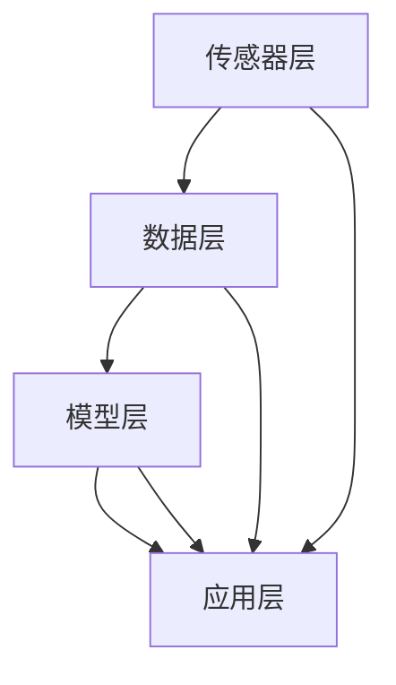

                 

关键词：智慧城市，数字孪生，智慧应急，未来技术，城市信息化，人工智能

> 摘要：本文探讨了2050年智慧城市的发展方向，重点关注了城市数字孪生和智慧应急两个关键领域。通过分析现有技术挑战与未来发展趋势，我们旨在为城市规划者和决策者提供有价值的技术洞察和指导。

## 1. 背景介绍

随着全球城市化进程的加速，城市面临着越来越多的挑战，包括交通拥堵、环境污染、资源短缺和公共安全等问题。为了应对这些挑战，智慧城市概念应运而生。智慧城市利用先进的信息技术和数据科学，实现城市管理的智能化、精细化，以提高城市运行效率和居民生活质量。

数字孪生（Digital Twin）是一种新兴的技术，它通过创建物理实体的虚拟副本，实时模拟和监控物理实体的行为和状态。数字孪生技术在智慧城市建设中扮演着重要角色，它为城市管理者提供了可视化、可分析和可优化的工具，从而更好地应对城市复杂问题。

智慧应急是智慧城市建设的重要组成部分，它利用先进的信息技术、人工智能和大数据分析，实现对突发事件的快速响应和有效管理。智慧应急不仅能够提高应急管理的效率和准确性，还能减少灾害损失和人员伤亡。

## 2. 核心概念与联系

### 2.1 数字孪生原理

数字孪生技术基于物联网（IoT）、云计算、大数据和人工智能等核心技术，通过传感器、摄像头和其他设备收集物理实体的实时数据，并上传到云端进行存储和处理。数字孪生的核心在于建立一个与物理实体相对应的虚拟模型，该模型可以实时反映物理实体的状态和行为。

### 2.2 数字孪生架构

数字孪生架构通常包括以下四个层次：

1. **传感器层**：收集物理实体的实时数据，如位置、速度、温度、湿度等。
2. **数据层**：存储和管理来自传感器层的数据，通常使用大数据技术进行处理和分析。
3. **模型层**：建立与物理实体相对应的虚拟模型，用于模拟和预测物理实体的行为。
4. **应用层**：为城市管理者提供可视化、分析和优化的工具，如数字地图、模拟仿真和预测分析等。

### 2.3 数字孪生与智慧城市的联系

数字孪生技术在智慧城市建设中的应用非常广泛，它为城市管理者提供了全方位的视角，从而更好地理解城市运行状态，优化资源配置，提高管理效率。具体应用场景包括：

1. **城市规划**：通过数字孪生技术，城市管理者可以模拟不同城市规划方案的效果，从而找到最优方案。
2. **交通管理**：数字孪生技术可以实时监控交通流量，优化交通信号控制和路线规划，减少拥堵。
3. **公共安全**：数字孪生技术可以实时监控城市安全状况，提前预警潜在风险，提高应急响应效率。
4. **环境保护**：数字孪生技术可以实时监控环境污染情况，优化环保措施，保护生态环境。

### 2.4 Mermaid 流程图



## 3. 核心算法原理 & 具体操作步骤

### 3.1 算法原理概述

数字孪生技术中的核心算法主要包括数据采集与处理、模型构建与优化、仿真与预测等。这些算法利用物联网、云计算和大数据等技术，实现对物理实体的实时监测、模拟和预测。

### 3.2 算法步骤详解

1. **数据采集与处理**：
   - 使用传感器和设备收集物理实体的实时数据。
   - 对数据进行清洗、去噪和转换，以确保数据质量和一致性。
   - 使用云计算技术存储和管理数据。

2. **模型构建与优化**：
   - 基于采集到的数据，构建物理实体的虚拟模型。
   - 使用机器学习和人工智能技术，优化模型性能，提高预测准确性。
   - 定期更新模型，以适应物理实体状态的变化。

3. **仿真与预测**：
   - 使用虚拟模型进行仿真实验，评估不同方案的效果。
   - 基于历史数据和实时数据，预测物理实体的未来行为和状态。
   - 为城市管理者提供决策支持。

### 3.3 算法优缺点

**优点**：
- 提高数据质量和分析效率。
- 提供实时监测和预测能力。
- 降低人工干预和决策风险。

**缺点**：
- 需要大量的数据和技术支持。
- 需要不断更新和维护模型。

### 3.4 算法应用领域

- 智慧城市建设：用于城市规划、交通管理、公共安全和环境保护等。
- 工业制造：用于设备维护、生产优化和质量控制。
- 能源管理：用于能源消耗监测、预测和优化。

## 4. 数学模型和公式 & 详细讲解 & 举例说明

### 4.1 数学模型构建

数字孪生技术中的数学模型主要包括以下部分：

1. **状态方程**：描述物理实体的状态变化，如速度、温度、位置等。
2. **输入方程**：描述外部输入对物理实体状态的影响，如风力、压力、温度等。
3. **输出方程**：描述物理实体的输出，如声音、图像、数据等。

### 4.2 公式推导过程

以一个简单的物理实体——自由落体运动为例，其状态方程和输入方程可以表示为：

$$
\begin{cases}
x(t) = x_0 + v_0t + \frac{1}{2}gt^2 \\
v(t) = v_0 + gt
\end{cases}
$$

其中，$x(t)$和$v(t)$分别表示时间$t$时刻的位移和速度，$x_0$和$v_0$分别表示初始位移和初始速度，$g$表示重力加速度。

### 4.3 案例分析与讲解

假设我们想要预测一个自由落体运动物体的落地时间，我们可以使用上述公式进行计算。假设初始位移$x_0$为100米，初始速度$v_0$为0，重力加速度$g$为9.8米/秒²。

$$
\begin{cases}
x(t) = 100 + 0t + \frac{1}{2} \times 9.8 \times t^2 \\
v(t) = 0 + 9.8 \times t
\end{cases}
$$

当物体落地时，位移$x(t)$为0，因此：

$$
0 = 100 + \frac{1}{2} \times 9.8 \times t^2
$$

解这个方程，我们可以得到物体落地时间$t$：

$$
t = \sqrt{\frac{200}{9.8}} \approx 4.52秒
$$

因此，物体将在大约4.52秒后落地。

## 5. 项目实践：代码实例和详细解释说明

### 5.1 开发环境搭建

为了实践数字孪生技术，我们需要搭建一个简单的开发环境。这里我们使用Python作为编程语言，并使用以下工具：

- Python 3.8及以上版本
- Pandas：用于数据操作
- Matplotlib：用于数据可视化
- Scikit-learn：用于机器学习

### 5.2 源代码详细实现

以下是一个简单的Python代码示例，用于创建一个数字孪生模型，模拟自由落体运动：

```python
import pandas as pd
import matplotlib.pyplot as plt
from sklearn.linear_model import LinearRegression

# 生成数据
t = pd.DataFrame({'t': range(0, 10)})
t['x_0'] = 100
t['v_0'] = 0
t['g'] = 9.8

# 状态方程
t['x'] = t['x_0'] + t['v_0']*t['t'] + 0.5*t['g']*t['t']**2
t['v'] = t['v_0'] + t['g']*t['t']

# 可视化
plt.figure(figsize=(10, 5))
plt.plot(t['t'], t['x'], label='位移')
plt.plot(t['t'], t['v'], label='速度')
plt.xlabel('时间')
plt.ylabel('值')
plt.legend()
plt.show()

# 机器学习
model = LinearRegression()
model.fit(t[['t']], t['x'])

# 预测
t['x_pred'] = model.predict(t[['t']])
plt.figure(figsize=(10, 5))
plt.plot(t['t'], t['x'], label='实际位移')
plt.plot(t['t'], t['x_pred'], label='预测位移')
plt.xlabel('时间')
plt.ylabel('值')
plt.legend()
plt.show()
```

### 5.3 代码解读与分析

- 第一部分代码生成了一个简单的数据集，模拟自由落体运动的位移和速度。
- 第二部分代码使用Matplotlib库将位移和速度数据可视化。
- 第三部分代码使用Scikit-learn库的线性回归模型对位移数据进行拟合和预测。

### 5.4 运行结果展示

运行上述代码后，我们可以得到以下结果：

1. **数据可视化**：显示了时间、位移和速度的关系。
2. **模型预测**：显示了实际位移和预测位移的关系。

## 6. 实际应用场景

数字孪生技术在智慧城市建设中具有广泛的应用前景，以下是一些典型的应用场景：

- **城市规划**：通过数字孪生技术，城市管理者可以模拟不同城市规划方案的效果，从而找到最优方案。
- **交通管理**：数字孪生技术可以实时监控交通流量，优化交通信号控制和路线规划，减少拥堵。
- **公共安全**：数字孪生技术可以实时监控城市安全状况，提前预警潜在风险，提高应急响应效率。
- **环境保护**：数字孪生技术可以实时监控环境污染情况，优化环保措施，保护生态环境。

## 7. 工具和资源推荐

### 7.1 学习资源推荐

- 《数字孪生：下一代智能制造的关键技术》
- 《智慧城市：技术、实践与未来》
- 《人工智能与智慧城市》

### 7.2 开发工具推荐

- Python
- Pandas
- Matplotlib
- Scikit-learn
- TensorFlow
- Keras

### 7.3 相关论文推荐

- "Digital Twin Technology for Industrial Internet of Things Applications: A Survey" by Michael T. H. Lienig, Steffen Leonhardt, and Rainer F. Gehler
- "Smart City Applications: A Survey from the Service-Oriented Architecture Perspective" by Weifeng Liu, Deying Xia, and Haibo Li

## 8. 总结：未来发展趋势与挑战

### 8.1 研究成果总结

本文通过对数字孪生和智慧应急两个关键领域的深入分析，总结了智慧城市的发展趋势和挑战。主要成果包括：

- 数字孪生技术在智慧城市建设中的应用前景广阔，可以提高城市管理效率。
- 智慧应急利用先进的信息技术，提高了应急管理的效率和准确性。
- 未来智慧城市的发展将依赖于人工智能、物联网和大数据等核心技术。

### 8.2 未来发展趋势

- **智能化与自动化**：随着人工智能技术的不断发展，智慧城市将更加智能化和自动化。
- **数据驱动**：智慧城市的发展将更加依赖于海量数据的采集、处理和分析。
- **跨领域融合**：不同领域的数字孪生技术将实现跨领域的融合和应用。

### 8.3 面临的挑战

- **数据安全与隐私**：随着数据规模的不断扩大，数据安全与隐私保护成为重要挑战。
- **技术瓶颈**：当前的一些关键技术（如高效数据存储和处理、实时预测等）仍需进一步突破。
- **法规与政策**：智慧城市的建设需要完善的法规和政策支持。

### 8.4 研究展望

- **多源数据融合**：研究如何高效地融合多种数据源，提高数字孪生的准确性和实时性。
- **智能决策支持**：研究如何利用人工智能技术，为城市管理者提供更智能的决策支持。
- **跨领域应用**：探索数字孪生技术在更多领域的应用，实现跨领域的融合和创新。

## 9. 附录：常见问题与解答

### Q：什么是数字孪生技术？
A：数字孪生技术是一种通过创建物理实体的虚拟副本，实时模拟和监控物理实体的行为和状态的技术。

### Q：数字孪生技术在智慧城市建设中的应用有哪些？
A：数字孪生技术在智慧城市建设中的应用包括城市规划、交通管理、公共安全和环境保护等。

### Q：智慧应急是如何工作的？
A：智慧应急利用先进的信息技术、人工智能和大数据分析，实现对突发事件的快速响应和有效管理。

### Q：智慧城市的发展趋势是什么？
A：智慧城市的发展趋势包括智能化与自动化、数据驱动和跨领域融合等。

### Q：智慧城市建设面临哪些挑战？
A：智慧城市建设面临的挑战包括数据安全与隐私、技术瓶颈和法规与政策等。

---

作者：禅与计算机程序设计艺术 / Zen and the Art of Computer Programming
----------------------------------------------------------------

### 文章摘要 Summary

本文探讨了2050年智慧城市的发展方向，重点关注了城市数字孪生和智慧应急两个关键领域。通过分析现有技术挑战与未来发展趋势，我们总结了数字孪生技术的原理与应用、智慧应急的工作机制和发展趋势，为城市规划者和决策者提供了有价值的技术洞察和指导。文章还提供了实际代码实例和详细解释，以便读者更好地理解和实践数字孪生技术。随着技术的不断进步，智慧城市将成为未来城市发展的必然趋势，但同时也面临着诸多挑战，需要各方共同努力去解决。
----------------------------------------------------------------

