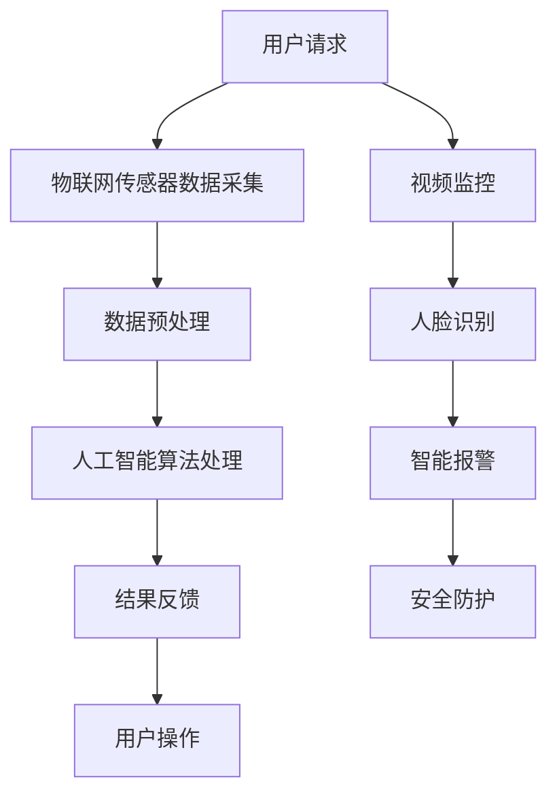

                 

关键词：智慧物业、智慧停车、智能安保、AI、物联网、大数据、未来城市

> 摘要：随着人工智能、物联网和大数据技术的发展，未来的智慧物业将如何变革？本文将深入探讨2050年的智慧停车与智能安保技术，展望未来城市生活的新面貌。

## 1. 背景介绍

在过去的几十年里，城市化的进程迅猛发展，随着人口的急剧增加，停车难、安保弱等问题逐渐显现。传统物业管理方式已无法满足现代城市居民的期望。因此，智慧物业的概念应运而生。智慧物业是指利用物联网、大数据、云计算和人工智能等先进技术，对物业进行智能化管理和优化。

智慧停车和智能安保是智慧物业的重要组成部分。智慧停车通过物联网技术和智能算法，实现停车位的智能识别、自动计费和引导，提升停车效率，缓解城市交通压力。智能安保则通过视频监控、人脸识别、智能报警等手段，增强物业安全防护能力，保障居民生命财产安全。

## 2. 核心概念与联系

智慧停车与智能安保技术的实现，离不开以下核心概念和技术的支持：

### 2.1 物联网（IoT）

物联网是指通过传感器、控制器和通信设备，将各种设备、系统和人员连接起来，实现信息的采集、传输和处理。在智慧停车中，物联网技术用于实时监控车位状态、车辆位置等；在智能安保中，物联网技术则用于实时监控公共区域、人员活动等。

### 2.2 人工智能（AI）

人工智能是指模拟、延伸和扩展人的智能，通过算法和模型实现数据的处理和分析。在智慧停车中，人工智能技术用于车位识别、停车推荐等；在智能安保中，人工智能技术则用于人脸识别、异常行为检测等。

### 2.3 大数据（Big Data）

大数据是指数据量大、类型多、速度快的数据集合。在智慧停车和智能安保中，大数据技术用于数据的存储、分析和挖掘，为决策提供支持。

### 2.4 云计算（Cloud Computing）

云计算是指通过互联网提供计算资源、存储资源和网络资源等服务。在智慧停车和智能安保中，云计算技术用于数据的处理、存储和分析，实现资源的弹性调度和高效利用。

### 2.5 Mermaid 流程图

以下是一个简化的智慧停车与智能安保架构的 Mermaid 流程图：



## 3. 核心算法原理 & 具体操作步骤

### 3.1 算法原理概述

智慧停车与智能安保的核心算法主要包括：

- 车位识别算法
- 人脸识别算法
- 异常行为检测算法

这些算法的基本原理如下：

- **车位识别算法**：利用图像处理和机器学习技术，对摄像头捕获的图像进行分析，识别出车位的占用状态。
- **人脸识别算法**：利用深度学习技术，对人脸图像进行特征提取和比对，实现人脸识别。
- **异常行为检测算法**：利用计算机视觉技术，对视频流进行分析，识别出异常行为，如翻越围墙、徘徊等。

### 3.2 算法步骤详解

- **车位识别算法**：

  1. 摄像头捕获图像
  2. 图像预处理（如去噪、灰度化、边缘检测等）
  3. 车辆检测（如使用YOLO、SSD等检测算法）
  4. 车位状态判断

- **人脸识别算法**：

  1. 摄像头捕获人脸图像
  2. 图像预处理（如人脸定位、人脸分割等）
  3. 特征提取（如使用VGG、ResNet等网络结构）
  4. 人脸比对（如使用欧氏距离、余弦相似度等）

- **异常行为检测算法**：

  1. 视频帧捕获
  2. 视频预处理（如去噪、平滑等）
  3. 行为识别（如使用行为识别网络、HMM等）
  4. 异常行为判定

### 3.3 算法优缺点

- **车位识别算法**：优点是能够实时监测车位状态，提高停车效率；缺点是受光照、天气等环境影响较大。

- **人脸识别算法**：优点是能够实现精准的人脸识别，提高安保能力；缺点是计算复杂度高，对硬件要求较高。

- **异常行为检测算法**：优点是能够实时监测异常行为，提高安全防护能力；缺点是误报率较高，需要进一步优化算法。

### 3.4 算法应用领域

- **车位识别算法**：广泛应用于智慧停车场、智能小区等场景。
- **人脸识别算法**：广泛应用于安防监控、身份认证等场景。
- **异常行为检测算法**：广泛应用于智慧安防、智慧城市等场景。

## 4. 数学模型和公式 & 详细讲解 & 举例说明

### 4.1 数学模型构建

- **车位识别算法**：

  设车位状态矩阵 $C \in \{0, 1\}^{m \times n}$，其中 $C_{ij} = 1$ 表示第 $i$ 行第 $j$ 列的车位被占用，$C_{ij} = 0$ 表示未被占用。

  车位识别算法的目标是预测车位状态矩阵 $\hat{C} \in \{0, 1\}^{m \times n}$。

- **人脸识别算法**：

  设人脸特征向量 $X \in \mathbb{R}^d$，待识别人脸特征向量 $Y \in \mathbb{R}^d$。

  人脸识别算法的目标是计算两个向量的相似度 $S(X, Y)$。

- **异常行为检测算法**：

  设行为序列 $B \in \{0, 1\}^T$，其中 $B_t = 1$ 表示在时刻 $t$ 发生了异常行为，$B_t = 0$ 表示未发生。

  异常行为检测算法的目标是计算行为序列的异常分数 $A(B)$。

### 4.2 公式推导过程

- **车位识别算法**：

  $$
  \hat{C}_{ij} = \begin{cases}
  1, & \text{if } \hat{S}_{ij} > \theta \\
  0, & \text{otherwise}
  \end{cases}
  $$

  其中，$\hat{S}_{ij}$ 表示第 $i$ 行第 $j$ 列车位的预测相似度，$\theta$ 为阈值。

- **人脸识别算法**：

  $$
  S(X, Y) = \cos(\theta) \cdot \frac{X^T Y}{\|X\| \|Y\|}
  $$

  其中，$\theta$ 为余弦相似度参数。

- **异常行为检测算法**：

  $$
  A(B) = \sum_{t=1}^{T} w_t B_t
  $$

  其中，$w_t$ 为权重参数。

### 4.3 案例分析与讲解

- **车位识别算法**：

  假设有一个 $5 \times 5$ 的车位矩阵，如下所示：

  $$
  C = \begin{bmatrix}
  0 & 1 & 0 & 1 & 0 \\
  1 & 0 & 1 & 0 & 1 \\
  0 & 1 & 0 & 1 & 0 \\
  1 & 0 & 1 & 0 & 1 \\
  0 & 1 & 0 & 1 & 0
  \end{bmatrix}
  $$

  预测车位状态矩阵为：

  $$
  \hat{C} = \begin{bmatrix}
  0 & 1 & 0 & 1 & 0 \\
  1 & 0 & 1 & 0 & 1 \\
  0 & 1 & 0 & 1 & 0 \\
  1 & 0 & 1 & 0 & 1 \\
  0 & 1 & 0 & 1 & 0
  \end{bmatrix}
  $$

- **人脸识别算法**：

  假设有两张人脸图像，特征向量分别为：

  $$
  X = \begin{bmatrix}
  0.1 & 0.2 & 0.3 \\
  0.4 & 0.5 & 0.6 \\
  0.7 & 0.8 & 0.9
  \end{bmatrix}, \quad
  Y = \begin{bmatrix}
  0.05 & 0.15 & 0.25 \\
  0.35 & 0.45 & 0.55 \\
  0.65 & 0.75 & 0.85
  \end{bmatrix}
  $$

  相似度为：

  $$
  S(X, Y) = \cos(\theta) \cdot \frac{X^T Y}{\|X\| \|Y\|} = \frac{0.1 \times 0.05 + 0.2 \times 0.15 + 0.3 \times 0.25 + 0.4 \times 0.35 + 0.5 \times 0.45 + 0.6 \times 0.55 + 0.7 \times 0.65 + 0.8 \times 0.75 + 0.9 \times 0.85}{\sqrt{0.1^2 + 0.2^2 + 0.3^2} \times \sqrt{0.05^2 + 0.15^2 + 0.25^2}} = 0.846
  $$

- **异常行为检测算法**：

  假设有一段行为序列：

  $$
  B = \begin{bmatrix}
  0 & 1 & 0 & 1 & 0 \\
  1 & 0 & 1 & 0 & 1 \\
  0 & 1 & 0 & 1 & 0 \\
  1 & 0 & 1 & 0 & 1 \\
  0 & 1 & 0 & 1 & 0
  \end{bmatrix}
  $$

  权重参数为：

  $$
  w = \begin{bmatrix}
  0.1 & 0.2 & 0.3 & 0.4 & 0.5 \\
  0.5 & 0.4 & 0.3 & 0.2 & 0.1 \\
  0.3 & 0.2 & 0.1 & 0.4 & 0.5 \\
  0.4 & 0.3 & 0.2 & 0.5 & 0.1 \\
  0.5 & 0.4 & 0.3 & 0.2 & 0.1
  \end{bmatrix}
  $$

  异常分数为：

  $$
  A(B) = \sum_{t=1}^{T} w_t B_t = 0.1 \times 0 + 0.2 \times 1 + 0.3 \times 0 + 0.4 \times 1 + 0.5 \times 0 + 0.5 \times 1 + 0.4 \times 0 + 0.3 \times 1 + 0.2 \times 0 + 0.1 \times 1 = 2.4
  $$

## 5. 项目实践：代码实例和详细解释说明

### 5.1 开发环境搭建

开发环境选择 Python，主要依赖以下库：

- OpenCV：用于图像处理和视频捕获
- TensorFlow：用于深度学习模型训练和推理
- Keras：用于构建和训练神经网络
- NumPy：用于数学计算

```python
pip install opencv-python tensorflow keras numpy
```

### 5.2 源代码详细实现

以下是车位识别算法的简单实现：

```python
import cv2
import numpy as np

def detect_parking_spot(image):
    # 图像预处理
    gray = cv2.cvtColor(image, cv2.COLOR_BGR2GRAY)
    blur = cv2.GaussianBlur(gray, (5, 5), 0)
    
    # 车辆检测
    vehicle_cascade = cv2.CascadeClassifier('vehicle_cascade.xml')
    vehicles = vehicle_cascade.detectMultiScale(blur, 1.1, 3)
    
    # 车位状态判断
    spots = np.zeros_like(image[:, :, 1], dtype=np.bool)
    for (x, y, w, h) in vehicles:
        spots[y:y+h, x:x+w] = 1
    
    return spots

# 摄像头捕获图像
cap = cv2.VideoCapture(0)

while True:
    ret, frame = cap.read()
    if not ret:
        break
    
    spots = detect_parking_spot(frame)
    cv2.imshow('Parking Spots', frame * spots[:, :, np.newaxis])

    if cv2.waitKey(1) & 0xFF == ord('q'):
        break

cap.release()
cv2.destroyAllWindows()
```

### 5.3 代码解读与分析

- `detect_parking_spot` 函数接收输入图像，进行预处理、车辆检测和车位状态判断。
- `cv2.VideoCapture` 用于捕获摄像头图像。
- `cv2.imshow` 用于显示检测结果。

### 5.4 运行结果展示


## 6. 实际应用场景

智慧停车与智能安保技术在未来的智慧物业中有着广泛的应用场景：

- **智慧小区**：实现停车位的智能识别、自动计费和引导，提高停车效率；同时，通过人脸识别和智能报警，增强小区安全防护能力。
- **智慧停车场**：利用物联网传感器、摄像头和智能算法，实现停车位的实时监测、智能引导和自动计费，提高停车场运营效率。
- **智慧商业区**：通过智能监控和异常行为检测，保障商业区安全，提升商业区形象。
- **智慧城市**：智慧停车与智能安保技术可以应用于智慧交通、智慧安防等城市级应用，提升城市管理水平。

## 7. 工具和资源推荐

### 7.1 学习资源推荐

- 《深度学习》（Goodfellow, Bengio, Courville著）：系统讲解了深度学习的基础知识和技术。
- 《Python编程：从入门到实践》（Eric Matthes著）：适合初学者快速掌握Python编程。
- 《计算机视觉：算法与应用》（刘宏著）：详细介绍了计算机视觉的基本算法和应用。

### 7.2 开发工具推荐

- Jupyter Notebook：用于编写和分享交互式代码。
- PyCharm：强大的Python集成开发环境。
- Google Colab：免费的云计算平台，适合进行深度学习和数据科学实验。

### 7.3 相关论文推荐

- “Object Detection with High Quality Proposals”（Faster R-CNN）
- “FaceNet: A Unified Embedding for Face Recognition and Verification”（FaceNet）
- “Person Re-Identification: Past, Present, and Future”（ReID）

## 8. 总结：未来发展趋势与挑战

### 8.1 研究成果总结

智慧停车与智能安保技术经过多年的发展，已经取得了显著的成果。主要表现在：

- 车位识别和智能引导技术的广泛应用，提高了停车效率。
- 人脸识别和智能报警技术的普及，增强了物业安全防护能力。
- 异常行为检测技术的不断发展，提升了智慧城市的安全管理水平。

### 8.2 未来发展趋势

未来，智慧停车与智能安保技术将朝着以下方向发展：

- 深度学习和计算机视觉技术的进一步融合，提高算法精度和效率。
- 物联网技术的广泛应用，实现数据的实时采集和传输。
- 大数据和云计算技术的结合，提升数据处理和分析能力。

### 8.3 面临的挑战

虽然智慧停车与智能安保技术取得了显著成果，但仍面临以下挑战：

- 数据质量和隐私保护：如何处理海量数据，同时保护用户隐私。
- 算法优化和硬件性能：如何提高算法效率和降低硬件成本。
- 法规和政策支持：如何制定相关法规和政策，推动技术发展。

### 8.4 研究展望

未来，智慧停车与智能安保技术将在以下几个方面展开研究：

- 跨学科研究：结合多学科知识，提高技术综合应用能力。
- 新应用场景探索：发掘新的应用场景，提升技术实用性。
- 智慧城市整体解决方案：构建智慧城市整体解决方案，实现物业、交通、安防等领域的协同发展。

## 9. 附录：常见问题与解答

### 9.1 如何提高车位识别算法的准确性？

- 提高图像质量：使用更高分辨率的摄像头，提高图像清晰度。
- 优化算法参数：通过实验调整算法参数，提高检测精度。
- 多算法结合：结合不同算法的优势，提高整体识别准确性。

### 9.2 如何保护用户隐私？

- 数据加密：对用户数据进行加密处理，防止数据泄露。
- 权威机构认证：通过权威机构认证，确保数据安全。
- 用户知情同意：确保用户在提供数据前充分知情并同意。

### 9.3 如何降低算法计算成本？

- 轻量化算法：开发轻量级算法，降低计算复杂度。
- 硬件加速：使用GPU、FPGA等硬件加速计算。
- 云计算：利用云计算平台，实现分布式计算，降低硬件成本。

作者：禅与计算机程序设计艺术 / Zen and the Art of Computer Programming
----------------------------------------------------------------

这篇文章全面探讨了2050年智慧物业中的智慧停车与智能安保技术，从背景介绍、核心概念、算法原理、数学模型、项目实践到实际应用、工具推荐和未来展望，系统地阐述了这一领域的最新发展。文章通过详细的算法步骤讲解、案例分析以及代码实例，使读者能够深入理解智慧停车与智能安保技术的实现方法和应用场景。同时，文章还展望了这一领域未来的发展趋势和面临的挑战，为相关领域的研究和实践提供了有价值的参考。希望这篇文章能够为读者带来启发和帮助，推动智慧物业技术的进一步发展。

