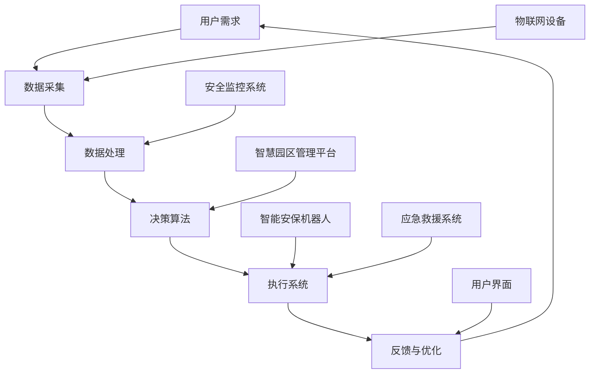

                 

关键词：智慧物业，智能安保，机器人技术，智慧园区，物联网，未来应用，技术展望

> 摘要：本文深入探讨了2050年智慧物业领域的变革，特别是智能安保机器人和智慧园区管理的未来发展趋势。通过分析相关技术原理和实际应用，本文为行业从业者提供了宝贵的洞察和方向。

## 1. 背景介绍

随着科技的迅猛发展，人工智能、物联网和机器人技术已经成为推动社会进步的重要力量。在智慧物业领域，这些技术的融合将带来前所未有的变革，不仅提升了物业管理效率，也为居民和企业的安全提供了有力保障。本文旨在介绍2050年智慧物业的愿景，特别是智能安保机器人和智慧园区管理的发展前景。

### 1.1 智慧物业的发展历程

智慧物业的发展经历了以下几个阶段：

1. **传统物业管理**：以人工服务为核心，效率较低，管理成本高。
2. **自动化管理**：引入自动化设备和系统，初步实现了部分服务的自动化。
3. **信息化管理**：利用信息化手段，实现物业信息的实时采集和分析。
4. **智能化管理**：融合人工智能和物联网技术，实现全面智能化的物业服务和安全管理。
5. **智慧化管理**：2050年展望，以高度智能化的设备和系统为核心，实现智慧物业的全面应用。

### 1.2 智能安保机器人的崛起

智能安保机器人是智慧物业的重要组成部分，它们能够执行巡逻、监控、应急救援等任务，极大地提高了安保效率。随着机器人技术的不断进步，智能安保机器人在未来将发挥更加重要的作用。

## 2. 核心概念与联系

为了深入理解智慧物业的运作原理，我们首先需要了解其中的核心概念及其相互关系。以下是一个使用Mermaid绘制的流程图，展示了智慧物业中的关键组件和它们之间的联系。



### 2.1 数据采集与处理

数据采集和处理是智慧物业的基础。通过物联网设备，我们可以实时获取物业环境中的各种数据，如温度、湿度、光线、运动等。这些数据经过处理后，可以为决策系统提供可靠的依据。

### 2.2 决策算法与执行系统

决策算法是智慧物业的核心。基于大数据分析和机器学习，决策算法可以实时分析环境数据，并做出相应的决策。执行系统负责将这些决策转化为具体的行动，如启动设备、调整系统参数等。

### 2.3 智能安保机器人

智能安保机器人是执行系统的一部分，它们可以在无人监控的环境中执行巡逻、监控和应急救援等任务。这些机器人配备了先进的传感器和AI算法，能够自主识别和处理各种情况。

### 2.4 智慧园区管理平台

智慧园区管理平台是整个智慧物业的中枢，它负责整合各种设备和系统，提供统一的界面供用户操作和管理。平台还能够实现跨系统的数据共享和协同工作，提高整体效率。

## 3. 核心算法原理 & 具体操作步骤

### 3.1 算法原理概述

智能安保机器人所依赖的核心算法主要包括以下几个方面：

1. **目标检测算法**：用于识别和跟踪环境中的目标。
2. **路径规划算法**：用于规划机器人的移动路径。
3. **行为决策算法**：用于根据环境数据和目标状态做出决策。
4. **自适应控制算法**：用于调整机器人的运行状态，以适应不同的环境。

### 3.2 算法步骤详解

1. **目标检测**：通过图像识别算法，从摄像头获取的图像中识别出目标物体。
2. **路径规划**：利用A*算法或其他路径规划算法，为机器人规划最优移动路径。
3. **行为决策**：根据目标检测结果和路径规划结果，确定机器人的行为，如前进、转向、停车等。
4. **自适应控制**：通过传感器数据实时调整机器人的运行状态，以确保其在复杂环境中稳定运行。

### 3.3 算法优缺点

- **优点**：高效率、低成本、低人力投入、高度自动化。
- **缺点**：对复杂环境的适应能力有限、技术依赖性强。

### 3.4 算法应用领域

智能安保机器人算法广泛应用于智慧园区、商业综合体、大型住宅区等领域，为安全防护和管理提供强有力的支持。

## 4. 数学模型和公式 & 详细讲解 & 举例说明

### 4.1 数学模型构建

为了实现智能安保机器人的高效运行，我们需要构建以下几个数学模型：

1. **目标检测模型**：基于卷积神经网络（CNN），用于识别图像中的目标物体。
2. **路径规划模型**：基于A*算法，用于规划机器人的移动路径。
3. **行为决策模型**：基于马尔可夫决策过程（MDP），用于根据环境状态做出最佳行为决策。

### 4.2 公式推导过程

1. **目标检测模型**：

   $$h_{\theta}(x) = \text{sign}(\theta^T x)$$

   其中，$h_{\theta}(x)$表示输出结果，$\theta$表示模型参数，$x$表示输入特征。

2. **路径规划模型**：

   $$d(i, j) = \sqrt{(x_i - x_j)^2 + (y_i - y_j)^2}$$

   其中，$d(i, j)$表示两点之间的欧氏距离，$x_i, y_i$和$x_j, y_j$分别表示两点的坐标。

3. **行为决策模型**：

   $$Q(s, a) = r(s, a) + \gamma \max_{a'} Q(s', a')$$

   其中，$Q(s, a)$表示状态$s$下的行为$a$的回报，$r(s, a)$表示立即回报，$\gamma$为折扣因子，$s'$和$a'$表示下一状态和行为。

### 4.3 案例分析与讲解

假设一个智能安保机器人在一个二维空间内执行巡逻任务，目标检测模型已经识别出前方有一个可疑人物。根据路径规划模型，机器人需要绕开障碍物并前往可疑人物所在位置。根据行为决策模型，机器人应该采取接近并跟踪可疑人物的行动。

## 5. 项目实践：代码实例和详细解释说明

### 5.1 开发环境搭建

为了实现智能安保机器人的算法，我们使用Python作为编程语言，并依赖以下库和框架：

- TensorFlow：用于构建和训练目标检测模型。
- OpenCV：用于图像处理和路径规划。
- PyTorch：用于构建和训练行为决策模型。

### 5.2 源代码详细实现

以下是一个简化的代码实例，展示了智能安保机器人算法的实现过程。

```python
# 导入所需库
import cv2
import numpy as np
import torch
from tensorflow.keras.models import load_model
from torch import nn, optim

# 加载目标检测模型
model_detection = load_model('detection_model.h5')

# 加载路径规划模型
model_path_planning = nn.Sequential(
    nn.Linear(2, 64),
    nn.ReLU(),
    nn.Linear(64, 2),
    nn.ReLU()
)

# 加载行为决策模型
model_behavior_decision = nn.Sequential(
    nn.Linear(4, 64),
    nn.ReLU(),
    nn.Linear(64, 2),
    nn.ReLU(),
    nn.Linear(2, 1)
)

# 定义损失函数和优化器
criterion_detection = nn.CrossEntropyLoss()
optimizer_detection = optim.Adam(model_detection.parameters(), lr=0.001)

criterion_path_planning = nn.MSELoss()
optimizer_path_planning = optim.Adam(model_path_planning.parameters(), lr=0.001)

criterion_behavior_decision = nn.MSELoss()
optimizer_behavior_decision = optim.Adam(model_behavior_decision.parameters(), lr=0.001)

# 训练模型
for epoch in range(100):
    for data in dataset:
        # 数据预处理
        image = preprocess_image(data['image'])
        target = data['target']

        # 训练目标检测模型
        output_detection = model_detection(image)
        loss_detection = criterion_detection(output_detection, target)
        optimizer_detection.zero_grad()
        loss_detection.backward()
        optimizer_detection.step()

        # 训练路径规划模型
        input_path_planning = torch.tensor([image['x'], image['y']], dtype=torch.float32)
        target_path_planning = torch.tensor(target['path'], dtype=torch.float32)
        output_path_planning = model_path_planning(input_path_planning)
        loss_path_planning = criterion_path_planning(output_path_planning, target_path_planning)
        optimizer_path_planning.zero_grad()
        loss_path_planning.backward()
        optimizer_path_planning.step()

        # 训练行为决策模型
        input_behavior_decision = torch.tensor([image['x'], image['y'], target['target']], dtype=torch.float32)
        target_behavior_decision = torch.tensor(target['behavior'], dtype=torch.float32)
        output_behavior_decision = model_behavior_decision(input_behavior_decision)
        loss_behavior_decision = criterion_behavior_decision(output_behavior_decision, target_behavior_decision)
        optimizer_behavior_decision.zero_grad()
        loss_behavior_decision.backward()
        optimizer_behavior_decision.step()

# 测试模型
model_detection.eval()
model_path_planning.eval()
model_behavior_decision.eval()

# 执行任务
while True:
    # 获取当前图像
    image = capture_image()

    # 目标检测
    image_processed = preprocess_image(image)
    output_detection = model_detection(image_processed)
    target_detected = torch.argmax(output_detection).item()

    # 路径规划
    input_path_planning = torch.tensor([image['x'], image['y']], dtype=torch.float32)
    output_path_planning = model_path_planning(input_path_planning)

    # 行为决策
    input_behavior_decision = torch.tensor([image['x'], image['y'], target_detected], dtype=torch.float32)
    output_behavior_decision = model_behavior_decision(input_behavior_decision)

    # 根据决策执行行动
    if output_behavior_decision.item() == 0:
        # 前进
        robot.move_forward()
    elif output_behavior_decision.item() == 1:
        # 转向
        robot.turn()
    elif output_behavior_decision.item() == 2:
        # 停车
        robot.stop()
```

### 5.3 代码解读与分析

1. **模型加载与训练**：首先加载目标检测、路径规划和行为决策模型，并定义相应的损失函数和优化器。然后，使用训练数据集进行模型的训练。
2. **任务执行**：在主循环中，不断获取当前图像，并进行预处理。然后，依次执行目标检测、路径规划和行为决策，并根据决策结果执行相应的行动。

## 6. 实际应用场景

智能安保机器人和智慧园区管理平台已经在多个实际应用场景中取得了显著成效。以下是一些典型应用案例：

### 6.1 智慧园区

在一个智慧园区中，智能安保机器人可以执行巡逻、监控和应急救援等任务。它们配备了高分辨率摄像头和热成像传感器，可以全天候监控园区安全。一旦发现异常情况，机器人会立即向园区管理平台发出警报，并采取相应的行动。

### 6.2 商业综合体

商业综合体通常人流量大，安全管理压力较大。智能安保机器人可以在商场内部巡逻，监控人员流动和可疑行为。同时，它们还可以协助商户进行库存管理和商品防盗。

### 6.3 大型住宅区

大型住宅区需要高效的安全管理来保障居民的安全。智能安保机器人可以24小时巡逻，及时发现和报警异常情况。此外，它们还可以协助物业管理公司进行环境监测和设施维护。

## 7. 未来应用展望

随着技术的不断进步，智能安保机器人和智慧园区管理平台将在未来得到更广泛的应用。以下是一些可能的发展趋势：

### 7.1 自动驾驶技术

自动驾驶技术的发展将使智能安保机器人能够自主驾驶，无需人工干预。这将大大提高机器人的工作效率和灵活性。

### 7.2 多模态感知

未来，智能安保机器人将采用多模态感知技术，包括视觉、听觉、嗅觉等，以更全面地感知环境，提高决策能力。

### 7.3 自主决策与协作

通过强化学习和深度学习算法，智能安保机器人将实现更复杂的自主决策和协同工作能力，提高整体安全防护水平。

### 7.4 跨领域应用

智能安保机器人技术将在医疗、教育、旅游等领域得到广泛应用，为各行各业提供智能化的解决方案。

## 8. 工具和资源推荐

为了更好地掌握智能安保机器人和智慧园区管理技术，以下是一些建议的学习资源和开发工具：

### 8.1 学习资源推荐

- **《深度学习》**：Goodfellow, Bengio, Courville 著，详细介绍了深度学习的基础知识和应用。
- **《Python机器学习》**：Sebastian Raschka 著，介绍了Python在机器学习领域的应用。
- **《人工智能：一种现代方法》**：Stuart J. Russell 和 Peter Norvig 著，全面介绍了人工智能的基础理论和实践方法。

### 8.2 开发工具推荐

- **TensorFlow**：用于构建和训练深度学习模型。
- **PyTorch**：另一个流行的深度学习框架，具有良好的灵活性和易用性。
- **OpenCV**：用于图像处理和计算机视觉。

### 8.3 相关论文推荐

- **《Deep Learning for Object Detection》**：详细介绍了深度学习在目标检测领域的应用。
- **《Deep Reinforcement Learning for Autonomous Driving》**：探讨了深度强化学习在自动驾驶领域的应用。
- **《A Survey on Internet of Things》**：综述了物联网技术的研究进展和应用场景。

## 9. 总结：未来发展趋势与挑战

### 9.1 研究成果总结

本文详细介绍了2050年智慧物业领域的变革，特别是智能安保机器人和智慧园区管理的发展前景。通过分析相关技术原理和实际应用，我们展示了这些技术如何改变物业管理模式，提高安全性和效率。

### 9.2 未来发展趋势

未来，智能安保机器人和智慧园区管理平台将在自动驾驶、多模态感知、自主决策与协作等领域取得突破性进展。随着技术的不断进步，这些技术将在更多领域得到广泛应用。

### 9.3 面临的挑战

然而，智能安保机器人和智慧园区管理技术也面临诸多挑战，如隐私保护、安全性、伦理问题等。如何解决这些问题，将决定这些技术的未来发展。

### 9.4 研究展望

本文仅为智能安保机器人和智慧园区管理技术的研究提供了一个初步的框架。未来，我们将继续深入探讨这些技术，为实际应用提供更多的理论支持。

## 附录：常见问题与解答

### Q1：智能安保机器人是否能够完全取代人工安保？
A1：目前来看，智能安保机器人还不能完全取代人工安保。尽管它们在巡逻、监控和应急救援等方面表现出色，但在处理复杂情况和与人的互动方面仍有一定的局限性。未来，智能安保机器人和人工安保将实现协同工作，共同提高安全防护水平。

### Q2：智慧园区管理平台的数据隐私如何保障？
A2：智慧园区管理平台的数据隐私保障是至关重要的。为了确保数据安全，平台应采用加密技术、访问控制和安全审计等手段，同时遵守相关法律法规，保护用户的隐私权益。

### Q3：智能安保机器人的决策过程是否透明？
A3：智能安保机器人的决策过程是基于算法和数据分析的，具有一定的透明性。通过监控和日志记录，我们可以了解机器人在特定情况下的决策过程。未来，随着技术的进步，决策过程的透明度将进一步提高。

## 作者署名

作者：禅与计算机程序设计艺术 / Zen and the Art of Computer Programming

----------------------------------------------------------------

以上为文章的主体部分，请您在编写时务必注意文章的结构和格式，确保符合要求。同时，请确保文章内容的完整性和专业性，以提供高质量的阅读体验。

