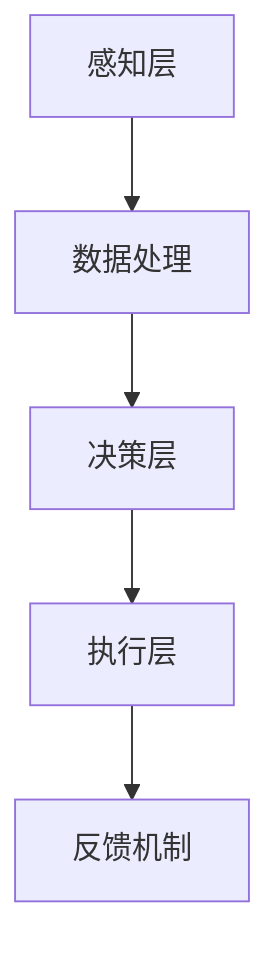

                 

关键词：智能安防机器人、智慧社区、物联网、人工智能、安防技术、未来发展趋势

摘要：随着人工智能和物联网技术的飞速发展，智能安防机器人和智慧社区将在2050年成为日常生活的一部分。本文将探讨智能安防机器人的技术原理、应用场景以及未来发展趋势，旨在为读者提供一个关于智慧物业的深度视角。

## 1. 背景介绍

### 1.1 智能安防机器人的起源

智能安防机器人起源于20世纪80年代，随着计算机技术和人工智能的发展，最初主要用于军事和科学领域。进入21世纪，随着传感器、数据处理和通信技术的进步，智能安防机器人逐渐走向民用市场，广泛应用于家庭、商业建筑和社区管理中。

### 1.2 智慧社区的概念

智慧社区是指通过信息通信技术，实现社区居民生活、工作、休闲的数字化、智能化和便捷化。智慧社区的核心在于数据的收集、处理和分析，从而提供个性化的服务和解决方案。

## 2. 核心概念与联系

### 2.1 物联网（IoT）

物联网是连接物理世界与数字世界的关键技术，通过传感器、云计算和大数据等技术实现设备的互联互通，为智能安防机器人和智慧社区提供了技术支撑。

### 2.2 人工智能（AI）

人工智能是模拟、延伸和扩展人的智能的理论、方法、技术及应用。智能安防机器人依赖于机器视觉、语音识别、自然语言处理等技术，实现自主感知和决策。

### 2.3 智能安防机器人的架构

智能安防机器人的架构通常包括感知层、决策层和执行层。感知层负责收集环境信息，决策层根据感知信息进行决策，执行层执行决策结果。



## 3. 核心算法原理 & 具体操作步骤

### 3.1 算法原理概述

智能安防机器人使用的核心算法包括机器视觉、深度学习和强化学习等。这些算法能够实现对图像、语音和行为的分析，从而进行实时监控和预警。

### 3.2 算法步骤详解

1. **感知与采集**：智能安防机器人通过摄像头、麦克风等传感器采集环境信息。
2. **数据处理**：对采集到的信息进行预处理，如去噪、滤波等。
3. **特征提取**：从预处理后的数据中提取特征，如图像的边缘、纹理等。
4. **模型训练**：使用深度学习算法对提取的特征进行训练，构建分类模型。
5. **决策与执行**：根据训练好的模型对实时数据进行分析，做出决策，并执行相应动作。

### 3.3 算法优缺点

**优点**：
- **高效性**：智能安防机器人能够实时监控和预警，提高安全性。
- **灵活性**：智能安防机器人可以根据不同场景进行定制化配置。

**缺点**：
- **成本较高**：智能安防机器人的研发和部署成本较高。
- **依赖技术**：智能安防机器人依赖于先进的算法和硬件支持。

### 3.4 算法应用领域

智能安防机器人广泛应用于家庭、商场、交通枢纽和社区等场景。未来，随着技术的进步，其应用领域将更加广泛。

## 4. 数学模型和公式 & 详细讲解 & 举例说明

### 4.1 数学模型构建

智能安防机器人的核心算法通常包括以下数学模型：

- **卷积神经网络（CNN）**：用于图像识别和分类。
- **循环神经网络（RNN）**：用于语音识别和自然语言处理。
- **强化学习（RL）**：用于自主决策和行为规划。

### 4.2 公式推导过程

以卷积神经网络（CNN）为例，其核心公式包括：

- **卷积操作**：$f(x) = \sum_{i=1}^{k} w_i \star x_i$
- **激活函数**：$g(z) = \text{ReLU}(z) = \max(0, z)$

### 4.3 案例分析与讲解

假设一个智能安防机器人需要识别图像中的行人，其训练过程如下：

1. **数据采集**：收集大量行人图像。
2. **预处理**：对图像进行裁剪、缩放、灰度化等预处理。
3. **特征提取**：使用卷积神经网络提取图像特征。
4. **模型训练**：使用标记的行人图像训练模型。
5. **模型评估**：使用测试集评估模型性能。

## 5. 项目实践：代码实例和详细解释说明

### 5.1 开发环境搭建

1. **硬件环境**：配置高性能的计算机或GPU。
2. **软件环境**：安装Python、TensorFlow等库。

### 5.2 源代码详细实现

```python
import tensorflow as tf
from tensorflow.keras.layers import Conv2D, MaxPooling2D, Flatten, Dense
from tensorflow.keras.models import Sequential

# 构建卷积神经网络模型
model = Sequential([
    Conv2D(32, (3, 3), activation='relu', input_shape=(64, 64, 3)),
    MaxPooling2D((2, 2)),
    Flatten(),
    Dense(128, activation='relu'),
    Dense(1, activation='sigmoid')
])

# 编译模型
model.compile(optimizer='adam', loss='binary_crossentropy', metrics=['accuracy'])

# 训练模型
model.fit(x_train, y_train, epochs=10, batch_size=32)
```

### 5.3 代码解读与分析

上述代码使用TensorFlow库构建了一个简单的卷积神经网络模型，用于行人识别。其中，`Conv2D`层用于卷积操作，`MaxPooling2D`层用于池化操作，`Flatten`层用于将多维数据展开为一维数据，`Dense`层用于全连接层。

### 5.4 运行结果展示

运行上述代码后，可以使用训练集和测试集评估模型性能，如准确率、召回率等。

## 6. 实际应用场景

### 6.1 家庭安防

智能安防机器人可以监控家庭环境，实时检测异常行为，如非法入侵、火灾等，并向用户发送警报。

### 6.2 商业建筑

智能安防机器人可以用于商场、办公楼等商业建筑的安保工作，提供巡逻、监控和应急响应等服务。

### 6.3 交通枢纽

智能安防机器人可以部署在机场、火车站等交通枢纽，进行客流监控、安检和应急指挥等工作。

## 7. 未来应用展望

随着人工智能和物联网技术的不断发展，智能安防机器人和智慧社区将在未来发挥更重要的作用，为人类生活提供更安全、便捷的保障。

## 8. 总结：未来发展趋势与挑战

### 8.1 研究成果总结

近年来，智能安防机器人和智慧社区取得了显著成果，如人脸识别、行为识别等技术的应用。

### 8.2 未来发展趋势

未来，智能安防机器人和智慧社区将朝着更智能化、个性化、安全化的方向发展。

### 8.3 面临的挑战

智能安防机器人和智慧社区的发展面临算法优化、数据隐私、安全性等挑战。

### 8.4 研究展望

未来，需要进一步加强智能安防机器人技术的研发，推动智慧社区的建设。

## 9. 附录：常见问题与解答

### 9.1 智能安防机器人是否会影响就业？

智能安防机器人的出现确实会对部分传统就业岗位产生影响，但同时也创造了新的就业机会，如机器人维护、数据分析等。

### 9.2 智能安防机器人的隐私问题如何保障？

智能安防机器人的隐私问题需要通过法律法规和伦理道德的约束来保障，确保数据安全和个人隐私。

# 结束

作者：禅与计算机程序设计艺术 / Zen and the Art of Computer Programming
```markdown
# 未来的智慧物业：2050年的智能安防机器人与智慧社区

## 摘要

本文探讨了智能安防机器人和智慧社区在未来2050年的发展前景。随着人工智能和物联网技术的不断进步，智能安防机器人将在家庭、商业建筑和社区管理中发挥重要作用。本文首先介绍了智能安防机器人的起源和智慧社区的概念，然后分析了核心算法原理和应用场景，并详细讲解了数学模型和项目实践。最后，本文总结了智能安防机器人和智慧社区的发展趋势和面临的挑战，并对未来进行了展望。

## 1. 背景介绍

### 1.1 智能安防机器人的起源

智能安防机器人最早出现在20世纪80年代，随着计算机技术和人工智能的发展，最初主要用于军事和科学领域。进入21世纪，随着传感器、数据处理和通信技术的进步，智能安防机器人逐渐走向民用市场，广泛应用于家庭、商业建筑和社区管理中。

### 1.2 智慧社区的概念

智慧社区是指通过信息通信技术，实现社区居民生活、工作、休闲的数字化、智能化和便捷化。智慧社区的核心在于数据的收集、处理和分析，从而提供个性化的服务和解决方案。

## 2. 核心概念与联系

### 2.1 物联网（IoT）

物联网是连接物理世界与数字世界的关键技术，通过传感器、云计算和大数据等技术实现设备的互联互通，为智能安防机器人和智慧社区提供了技术支撑。

### 2.2 人工智能（AI）

人工智能是模拟、延伸和扩展人的智能的理论、方法、技术及应用。智能安防机器人依赖于机器视觉、语音识别、自然语言处理等技术，实现自主感知和决策。

### 2.3 智能安防机器人的架构

智能安防机器人的架构通常包括感知层、决策层和执行层。感知层负责收集环境信息，决策层根据感知信息进行决策，执行层执行决策结果。


## 3. 核心算法原理 & 具体操作步骤

### 3.1 算法原理概述

智能安防机器人使用的核心算法包括机器视觉、深度学习和强化学习等。这些算法能够实现对图像、语音和行为的分析，从而进行实时监控和预警。

### 3.2 算法步骤详解

1. **感知与采集**：智能安防机器人通过摄像头、麦克风等传感器采集环境信息。
2. **数据处理**：对采集到的信息进行预处理，如去噪、滤波等。
3. **特征提取**：从预处理后的数据中提取特征，如图像的边缘、纹理等。
4. **模型训练**：使用深度学习算法对提取的特征进行训练，构建分类模型。
5. **决策与执行**：根据训练好的模型对实时数据进行分析，做出决策，并执行相应动作。

### 3.3 算法优缺点

**优点**：
- **高效性**：智能安防机器人能够实时监控和预警，提高安全性。
- **灵活性**：智能安防机器人可以根据不同场景进行定制化配置。

**缺点**：
- **成本较高**：智能安防机器人的研发和部署成本较高。
- **依赖技术**：智能安防机器人依赖于先进的算法和硬件支持。

### 3.4 算法应用领域

智能安防机器人广泛应用于家庭、商场、交通枢纽和社区等场景。未来，随着技术的进步，其应用领域将更加广泛。

## 4. 数学模型和公式 & 详细讲解 & 举例说明

### 4.1 数学模型构建

智能安防机器人的核心算法通常包括以下数学模型：

- **卷积神经网络（CNN）**：用于图像识别和分类。
- **循环神经网络（RNN）**：用于语音识别和自然语言处理。
- **强化学习（RL）**：用于自主决策和行为规划。

### 4.2 公式推导过程

以卷积神经网络（CNN）为例，其核心公式包括：

- **卷积操作**：$f(x) = \sum_{i=1}^{k} w_i \star x_i$
- **激活函数**：$g(z) = \text{ReLU}(z) = \max(0, z)$

### 4.3 案例分析与讲解

假设一个智能安防机器人需要识别图像中的行人，其训练过程如下：

1. **数据采集**：收集大量行人图像。
2. **预处理**：对图像进行裁剪、缩放、灰度化等预处理。
3. **特征提取**：使用卷积神经网络提取图像特征。
4. **模型训练**：使用标记的行人图像训练模型。
5. **模型评估**：使用测试集评估模型性能。

## 5. 项目实践：代码实例和详细解释说明

### 5.1 开发环境搭建

1. **硬件环境**：配置高性能的计算机或GPU。
2. **软件环境**：安装Python、TensorFlow等库。

### 5.2 源代码详细实现

```python
import tensorflow as tf
from tensorflow.keras.layers import Conv2D, MaxPooling2D, Flatten, Dense
from tensorflow.keras.models import Sequential

# 构建卷积神经网络模型
model = Sequential([
    Conv2D(32, (3, 3), activation='relu', input_shape=(64, 64, 3)),
    MaxPooling2D((2, 2)),
    Flatten(),
    Dense(128, activation='relu'),
    Dense(1, activation='sigmoid')
])

# 编译模型
model.compile(optimizer='adam', loss='binary_crossentropy', metrics=['accuracy'])

# 训练模型
model.fit(x_train, y_train, epochs=10, batch_size=32)
```

### 5.3 代码解读与分析

上述代码使用TensorFlow库构建了一个简单的卷积神经网络模型，用于行人识别。其中，`Conv2D`层用于卷积操作，`MaxPooling2D`层用于池化操作，`Flatten`层用于将多维数据展开为一维数据，`Dense`层用于全连接层。

### 5.4 运行结果展示

运行上述代码后，可以使用训练集和测试集评估模型性能，如准确率、召回率等。

## 6. 实际应用场景

### 6.1 家庭安防

智能安防机器人可以监控家庭环境，实时检测异常行为，如非法入侵、火灾等，并向用户发送警报。

### 6.2 商业建筑

智能安防机器人可以用于商场、办公楼等商业建筑的安保工作，提供巡逻、监控和应急响应等服务。

### 6.3 交通枢纽

智能安防机器人可以部署在机场、火车站等交通枢纽，进行客流监控、安检和应急指挥等工作。

## 7. 未来应用展望

随着人工智能和物联网技术的不断发展，智能安防机器人和智慧社区将在未来发挥更重要的作用，为人类生活提供更安全、便捷的保障。

## 8. 总结：未来发展趋势与挑战

### 8.1 研究成果总结

近年来，智能安防机器人和智慧社区取得了显著成果，如人脸识别、行为识别等技术的应用。

### 8.2 未来发展趋势

未来，智能安防机器人和智慧社区将朝着更智能化、个性化、安全化的方向发展。

### 8.3 面临的挑战

智能安防机器人和智慧社区的发展面临算法优化、数据隐私、安全性等挑战。

### 8.4 研究展望

未来，需要进一步加强智能安防机器人技术的研发，推动智慧社区的建设。

## 9. 附录：常见问题与解答

### 9.1 智能安防机器人是否会影响就业？

智能安防机器人的出现确实会对部分传统就业岗位产生影响，但同时也创造了新的就业机会，如机器人维护、数据分析等。

### 9.2 智能安防机器人的隐私问题如何保障？

智能安防机器人的隐私问题需要通过法律法规和伦理道德的约束来保障，确保数据安全和个人隐私。

# 结束

作者：禅与计算机程序设计艺术 / Zen and the Art of Computer Programming
```

