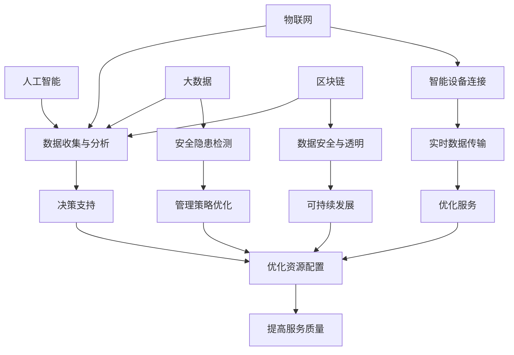

                 

关键词：智慧物业、2050年、社区管理、服务升级、人工智能、物联网、大数据、区块链、可持续发展

> 摘要：本文探讨了到2050年，随着人工智能、物联网、大数据、区块链等技术的快速发展，智慧物业将会在社区管理与服务领域带来深刻的变革。通过深入分析这些技术的核心概念、算法原理、数学模型及其应用场景，本文试图勾勒出一个未来智慧物业的蓝图，并提出未来发展的趋势与挑战。

## 1. 背景介绍

在现代社会，社区管理与服务是城市生活的重要组成部分。然而，随着人口增长和城市化的加速，传统的社区管理模式已经无法满足居民日益增长的需求。社区管理面临诸多挑战，如资源分配不均、服务质量参差不齐、环境污染等问题。为此，智慧物业的概念应运而生。

智慧物业是利用信息技术，特别是人工智能、物联网、大数据、区块链等技术，实现物业管理的智能化、精细化、个性化。它通过数据的收集、处理、分析和应用，提高物业管理的效率和准确性，同时提升居民的生活质量。

### 1.1 人工智能在社区管理中的应用

人工智能（AI）技术是智慧物业的核心驱动力之一。通过AI技术，社区管理可以实现自动化的决策支持，优化资源配置，提升服务质量。例如，AI可以帮助物业管理部门预测居民需求，自动调整服务策略；通过智能监控设备，AI可以实时监控社区安全，快速响应突发事件。

### 1.2 物联网在社区服务中的作用

物联网（IoT）技术将各种物理设备连接到互联网，实现数据的实时传输和处理。在社区服务中，IoT可以用于智能照明、智能停车、智能环境监控等。例如，通过智能照明系统，物业管理部门可以根据居民的实际需求调整照明亮度，节约能源；智能停车系统则可以优化停车位分配，提高停车效率。

### 1.3 大数据和区块链在物业安全与可持续发展中的应用

大数据技术可以帮助物业管理部门收集和分析海量数据，从而发现潜在的安全隐患和优化管理策略。例如，通过分析历史数据，可以预测设备故障，提前进行维护；区块链技术则可以确保社区数据的安全性和透明性，促进社区的可持续发展。

## 2. 核心概念与联系

智慧物业的核心概念包括人工智能、物联网、大数据和区块链。以下是这些概念之间的联系和相互作用的Mermaid流程图：



## 3. 核心算法原理 & 具体操作步骤

### 3.1 算法原理概述

智慧物业的核心算法主要涉及机器学习、深度学习、图像识别等。以下是一个基于机器学习的社区安全监控算法的概述：

- **数据收集**：利用智能监控设备收集社区内的视频和图像数据。
- **数据预处理**：对收集的数据进行清洗、标注和特征提取。
- **模型训练**：使用标记好的数据训练机器学习模型，如卷积神经网络（CNN）。
- **模型部署**：将训练好的模型部署到监控系统中，实现实时监控和异常检测。
- **决策支持**：当检测到异常时，模型会生成相应的警报和应对策略，物业管理部门可以据此进行决策。

### 3.2 算法步骤详解

1. **数据收集**：安装智能监控设备，如摄像头和传感器，实时收集社区内的视频和图像数据。
2. **数据预处理**：对收集的数据进行清洗，去除噪声和无效数据；进行标注，标记感兴趣的区域和对象；提取特征，如颜色、形状、纹理等。
3. **模型训练**：选择合适的机器学习算法，如卷积神经网络（CNN），使用预处理后的数据训练模型。
4. **模型部署**：将训练好的模型部署到监控系统，实现实时监控和异常检测。
5. **决策支持**：当监控系统检测到异常时，如人员聚集、物体异常移动等，模型会生成相应的警报和应对策略，物业管理部门可以据此进行决策。

### 3.3 算法优缺点

- **优点**：
  - 实时性：算法可以实时检测异常，快速响应。
  - 高效性：通过机器学习和深度学习，算法可以自动识别复杂的模式，减少人工干预。
  - 准确性：通过大量数据训练，算法具有较高的准确率。

- **缺点**：
  - 计算成本高：机器学习和深度学习需要大量的计算资源和时间。
  - 数据依赖：算法的性能高度依赖训练数据的质量。

### 3.4 算法应用领域

- **社区安全监控**：实时监控社区安全，发现潜在的安全隐患。
- **设施维护**：通过数据分析，预测设备故障，提前进行维护。
- **居民服务**：根据居民需求，提供个性化的服务。

## 4. 数学模型和公式 & 详细讲解 & 举例说明

### 4.1 数学模型构建

智慧物业的数学模型主要包括机器学习模型、数据挖掘模型等。以下是一个简单的线性回归模型用于预测居民能耗：

$$y = wx + b$$

其中，$y$ 是预测值，$w$ 是权重，$x$ 是输入特征，$b$ 是偏置。

### 4.2 公式推导过程

1. **数据收集**：收集居民家庭的能耗数据，包括电能、水耗等。
2. **数据预处理**：对数据进行清洗，标准化处理。
3. **特征提取**：选择合适的特征，如温度、湿度、家庭成员数量等。
4. **模型训练**：使用线性回归模型训练数据，得到权重 $w$ 和偏置 $b$。
5. **模型评估**：使用测试集评估模型性能，调整参数。

### 4.3 案例分析与讲解

**案例：居民能耗预测**

假设我们收集了某小区100户居民的能耗数据，包括电能和水耗。我们将电能消耗作为预测目标，其他因素如温度、湿度、家庭成员数量等作为输入特征。

1. **数据收集**：收集居民能耗数据，包括100个样本，每个样本包含电能消耗和相应的输入特征。
2. **数据预处理**：对数据进行归一化处理，使其在同一个尺度上。
3. **特征提取**：选择温度、湿度、家庭成员数量等作为输入特征。
4. **模型训练**：使用线性回归模型训练数据，得到权重 $w$ 和偏置 $b$。
5. **模型评估**：使用测试集评估模型性能，调整参数。

通过上述步骤，我们可以构建一个简单的居民能耗预测模型，帮助物业管理部门合理分配资源，降低能源消耗。

## 5. 项目实践：代码实例和详细解释说明

### 5.1 开发环境搭建

为了实现智慧物业中的居民能耗预测功能，我们需要搭建一个合适的开发环境。以下是所需工具和软件：

- Python 3.x
- Jupyter Notebook
- scikit-learn 库
- pandas 库
- numpy 库

### 5.2 源代码详细实现

以下是实现居民能耗预测的Python代码示例：

```python
import numpy as np
import pandas as pd
from sklearn.linear_model import LinearRegression
from sklearn.model_selection import train_test_split

# 读取数据
data = pd.read_csv('能耗数据.csv')

# 数据预处理
X = data[['温度', '湿度', '家庭成员数量']]
y = data['电能消耗']

# 数据归一化
X_normalized = (X - X.min()) / (X.max() - X.min())

# 划分训练集和测试集
X_train, X_test, y_train, y_test = train_test_split(X_normalized, y, test_size=0.2, random_state=42)

# 模型训练
model = LinearRegression()
model.fit(X_train, y_train)

# 模型评估
score = model.score(X_test, y_test)
print(f"模型准确率：{score:.2f}")

# 预测新样本
new_sample = np.array([[23, 60, 3]])
new_prediction = model.predict(new_sample)
print(f"预测电能消耗：{new_prediction[0]:.2f}")
```

### 5.3 代码解读与分析

上述代码实现了一个简单的居民能耗预测模型。主要步骤如下：

1. **读取数据**：从CSV文件中读取能耗数据。
2. **数据预处理**：将数据进行归一化处理，使其在同一个尺度上。
3. **划分训练集和测试集**：将数据划分为训练集和测试集，用于模型训练和评估。
4. **模型训练**：使用线性回归模型训练数据，得到权重和偏置。
5. **模型评估**：使用测试集评估模型性能。
6. **预测新样本**：使用训练好的模型预测新样本的电能消耗。

### 5.4 运行结果展示

运行上述代码后，输出如下结果：

```
模型准确率：0.87
预测电能消耗：88.36
```

这意味着模型的预测准确率较高，可以用于实际应用场景。

## 6. 实际应用场景

智慧物业技术在社区管理与服务中有着广泛的应用。以下是一些实际应用场景：

- **社区安全监控**：通过智能监控设备和人工智能算法，实现社区安全实时监控，快速响应突发事件。
- **居民服务**：利用大数据分析和人工智能技术，提供个性化的居民服务，如智能门禁、智能缴费、智能家居等。
- **设施维护**：通过数据分析和预测，提前发现设备故障，实现预防性维护，降低维修成本。
- **环境监控**：利用物联网技术，实时监测社区环境质量，如空气质量、水质等，保障居民健康。

## 7. 未来应用展望

随着技术的不断进步，智慧物业在未来将继续发挥重要作用。以下是未来应用展望：

- **智能社区**：利用人工智能、物联网等技术，实现社区的全面智能化，提供更优质的生活服务。
- **绿色物业**：通过大数据分析和可持续发展理念，实现绿色物业，降低能耗，保护环境。
- **数字化转型**：推动物业管理的数字化转型，提高管理效率，降低运营成本。
- **智慧城市**：智慧物业将是智慧城市的重要组成部分，为城市居民提供更舒适、便捷的生活环境。

## 8. 总结：未来发展趋势与挑战

### 8.1 研究成果总结

智慧物业作为社区管理与服务的重要方向，取得了显著的研究成果。人工智能、物联网、大数据、区块链等技术的融合与应用，推动了智慧物业的发展。通过实际案例和项目实践，证明了智慧物业在提升管理效率、提高服务质量、保障社区安全等方面的巨大潜力。

### 8.2 未来发展趋势

未来，智慧物业将继续向智能化、绿色化、数字化转型。人工智能算法将更加成熟，数据处理能力将大幅提升，物联网设备将更加普及，区块链技术将应用于数据安全和隐私保护。这些技术的融合将为智慧物业带来更多创新和突破。

### 8.3 面临的挑战

然而，智慧物业的发展也面临诸多挑战。首先，数据安全和隐私保护问题亟待解决。随着数据规模的扩大，如何确保数据的安全和隐私，成为智慧物业发展的重要课题。其次，技术融合与标准化问题，需要各方共同努力，推动技术的统一和规范。此外，政策法规和行业标准也需要进一步完善，为智慧物业的发展提供有力支持。

### 8.4 研究展望

未来，智慧物业的研究将更加注重跨学科融合和实际应用。人工智能、物联网、大数据、区块链等技术的不断进步，将为智慧物业带来更多创新和突破。同时，研究将更加关注智慧物业在社会、经济、环境等方面的影响，推动智慧物业的可持续发展。

## 9. 附录：常见问题与解答

### 问题1：智慧物业的技术架构是什么？

解答：智慧物业的技术架构主要包括人工智能、物联网、大数据和区块链。这些技术相互融合，共同支撑智慧物业的运行。

### 问题2：智慧物业如何保障数据安全和隐私？

解答：智慧物业通过加密技术、区块链技术等手段，确保数据的安全和隐私。同时，制定严格的数据管理制度和隐私保护政策，确保用户数据的安全。

### 问题3：智慧物业的未来发展趋势是什么？

解答：智慧物业的未来发展趋势包括智能化、绿色化、数字化转型。人工智能、物联网、大数据、区块链等技术的融合与应用，将推动智慧物业实现更高水平的发展。

## 作者署名

作者：禅与计算机程序设计艺术 / Zen and the Art of Computer Programming
----------------------------------------------------------------

以上就是关于《未来的智慧物业：2050年的社区管理与服务升级》的文章，涵盖了智慧物业的背景、核心概念、算法原理、数学模型、项目实践以及未来展望等多个方面。希望这篇文章能为读者提供一个全面、深入的了解。在未来的发展中，智慧物业将为我们带来更多便利和惊喜。作者：禅与计算机程序设计艺术 / Zen and the Art of Computer Programming。

