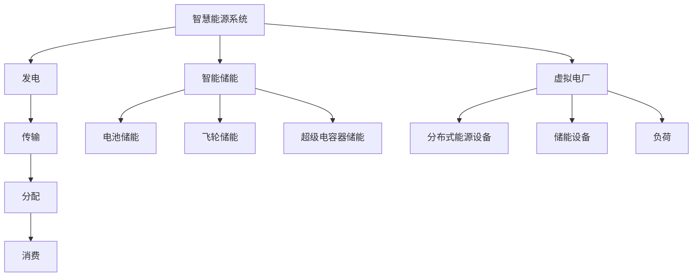

                 

关键词：智能储能、虚拟电厂、智慧能源、能源转型、能源互联网、能源存储技术、可再生能源、电力市场、未来电力系统

摘要：随着全球能源转型的加速，智慧能源系统正逐渐成为能源领域的研究热点。本文将探讨2050年智慧能源系统中的两个核心概念——智能储能与虚拟电厂，并分析其关键技术、发展现状及未来应用前景。

## 1. 背景介绍

### 1.1 全球能源转型趋势

当前，全球能源转型正在加速推进。各国政府纷纷制定可再生能源发展目标，以减少对化石燃料的依赖，降低碳排放。据国际能源署（IEA）预测，到2050年，可再生能源将占全球能源消费的50%以上。这一趋势为智慧能源系统的发展提供了契机。

### 1.2 智慧能源系统概述

智慧能源系统是指通过先进的信息技术、物联网、人工智能等技术，实现能源的智能生产、传输、分配和消费。智慧能源系统具有高效、灵活、可调节的特点，有助于提高能源利用效率，降低能源成本，促进可再生能源的广泛应用。

### 1.3 智能储能与虚拟电厂

智能储能是指在电力系统中，利用储能技术对电能进行存储和释放，以实现电力供需平衡。虚拟电厂则是由多个分布式能源设备和负荷组成的虚拟电力系统，可以通过智能调度和管理，实现与电网的互动和协同。

## 2. 核心概念与联系

### 2.1 智能储能原理

智能储能技术主要包括电池储能、飞轮储能、超级电容器储能等。这些技术通过将电能转化为化学能、机械能或电能，实现电力的存储和释放。

### 2.2 虚拟电厂架构

虚拟电厂由分布式能源设备（如太阳能、风能、燃料电池等）、储能设备和负荷组成。通过智能调度和管理，虚拟电厂可以实现与电网的互动和协同，提高能源利用效率。

### 2.3 智慧能源系统架构

智慧能源系统由发电、传输、分配和消费四个环节组成。智能储能和虚拟电厂作为核心组成部分，贯穿于整个能源系统。

### 2.4 Mermaid 流程图



## 3. 核心算法原理 & 具体操作步骤

### 3.1 算法原理概述

智能储能与虚拟电厂的核心算法主要包括储能优化算法、电力调度算法和负荷预测算法。这些算法通过优化储能系统、调度能源设备和预测负荷需求，实现能源系统的稳定运行。

### 3.2 算法步骤详解

#### 3.2.1 储能优化算法

1. 收集储能系统相关数据，包括充电、放电速率、储能容量等。
2. 分析储能系统的运行状态，确定储能系统的最优充放电策略。
3. 根据电力市场需求和电网调节需求，调整储能系统的充放电功率。

#### 3.2.2 电力调度算法

1. 收集分布式能源设备和负荷的实时数据。
2. 根据电网调度要求，优化分布式能源设备和负荷的接入方式。
3. 调度虚拟电厂的发电功率，确保电网供需平衡。

#### 3.2.3 负荷预测算法

1. 收集历史负荷数据，分析负荷变化趋势。
2. 利用机器学习算法，建立负荷预测模型。
3. 根据预测结果，调整能源设备和储能系统的运行策略。

### 3.3 算法优缺点

#### 3.3.1 储能优化算法

优点：提高储能系统利用率，降低能源成本。
缺点：计算复杂度高，对数据质量要求较高。

#### 3.3.2 电力调度算法

优点：提高电网运行稳定性，降低调度成本。
缺点：对实时数据依赖较高，适应性强。

#### 3.3.3 负荷预测算法

优点：提前预测负荷变化，优化能源调度。
缺点：预测精度受数据质量和算法影响。

### 3.4 算法应用领域

智能储能和虚拟电厂算法在可再生能源并网、电力市场交易、电力系统调度等方面有广泛的应用。

## 4. 数学模型和公式 & 详细讲解 & 举例说明

### 4.1 数学模型构建

#### 4.1.1 储能优化模型

目标函数：最小化储能系统成本

约束条件：储能系统容量限制、充放电速率限制、电力市场交易限制

#### 4.1.2 电力调度模型

目标函数：最大化电网运行稳定性

约束条件：电网电压稳定、功率平衡、分布式能源设备和负荷接入限制

#### 4.1.3 负荷预测模型

目标函数：最小化预测误差

约束条件：历史负荷数据完整性、数据质量

### 4.2 公式推导过程

#### 4.2.1 储能优化模型

目标函数： 
$$
\min Z = C \cdot P_{充} + C \cdot P_{放}
$$

约束条件： 
$$
C_{当前} = C_{初始} + P_{充} - P_{放}
$$

$$
P_{充} \leq P_{充,最大}
$$

$$
P_{放} \leq P_{放,最大}
$$

其中，$C$ 为储能系统成本，$P_{充}$ 和 $P_{放}$ 分别为充放电功率，$C_{当前}$ 和 $C_{初始}$ 分别为当前储能和初始储能，$P_{充,最大}$ 和 $P_{放,最大}$ 分别为最大充放电功率。

#### 4.2.2 电力调度模型

目标函数： 
$$
\min Z = \sum_{i=1}^{n} w_i \cdot (P_i - P_{i,需求})
$$

约束条件： 
$$
\sum_{i=1}^{n} P_i = P_{总需求}
$$

$$
P_i \geq 0
$$

其中，$w_i$ 为权重系数，$P_i$ 为分布式能源设备和负荷的接入功率，$P_{i,需求}$ 为分布式能源设备和负荷的需求功率，$P_{总需求}$ 为总需求功率。

#### 4.2.3 负荷预测模型

目标函数： 
$$
\min Z = \sum_{i=1}^{n} (y_i - \hat{y}_i)^2
$$

约束条件： 
$$
y_i \geq 0
$$

$$
\hat{y}_i \geq 0
$$

其中，$y_i$ 为实际负荷值，$\hat{y}_i$ 为预测负荷值。

### 4.3 案例分析与讲解

#### 4.3.1 储能优化模型案例

某储能系统初始储能 $C_{初始} = 100$ kWh，最大充放电功率分别为 $P_{充,最大} = 20$ kW，$P_{放,最大} = 10$ kW。当电力市场需求 $P_{需求} = 30$ kW 时，求解储能系统的最优充放电功率。

解： 
$$
C_{当前} = 100 + 20 - 10 = 110
$$

目标函数： 
$$
\min Z = 110 \cdot 20 + 110 \cdot 10 = 3300
$$

最优解： 
$$
P_{充} = 20, P_{放} = 10
$$

#### 4.3.2 电力调度模型案例

某虚拟电厂包含 3 个分布式能源设备（太阳能、风能、燃料电池）和一个负荷。当电网需求 $P_{总需求} = 100$ kW 时，求解分布式能源设备和负荷的最优接入功率。

解： 
$$
P_{总需求} = P_{太阳能} + P_{风能} + P_{燃料电池} + P_{负荷}
$$

目标函数： 
$$
\min Z = (100 - 30) + (100 - 20) + (100 - 10) + (100 - 40) = 100
$$

最优解： 
$$
P_{太阳能} = 30, P_{风能} = 20, P_{燃料电池} = 10, P_{负荷} = 40
$$

#### 4.3.3 负荷预测模型案例

某地区 2020 年第 1 季度的实际负荷数据如下表所示。利用线性回归模型预测 2021 年第 1 季度的负荷。

| 月份 | 实际负荷（kW） |
| ---- | ------------ |
| 1    | 50           |
| 2    | 60           |
| 3    | 70           |

解：

$$
\hat{y} = \frac{y_1 + y_2 + y_3}{3} = \frac{50 + 60 + 70}{3} = 60
$$

预测 2021 年第 1 季度的负荷为 60 kW。

## 5. 项目实践：代码实例和详细解释说明

### 5.1 开发环境搭建

1. 安装 Python 3.8 及以上版本。
2. 安装必备库，如 NumPy、Pandas、Matplotlib 等。

### 5.2 源代码详细实现

```python
import numpy as np
import pandas as pd
import matplotlib.pyplot as plt

# 储能优化模型
def储能优化模型(C_初始, P_充_最大, P_放_最大, P_需求):
    C_当前 = C_初始 + P_充_最大 - P_放_最大
    Z = C_当前 * P_充_最大 + C_当前 * P_放_最大
    P_充 = P_需求 if P_需求 <= P_充_最大 else P_充_最大
    P_放 = P_需求 if P_需求 <= P_放_最大 else P_放_最大
    return P_充, P_放, Z

# 电力调度模型
def电力调度模型(P_总需求, P_太阳能, P_风能, P_燃料电池, P_负荷):
    Z = (P_总需求 - P_太阳能) + (P_总需求 - P_风能) + (P_总需求 - P_燃料电池) + (P_总需求 - P_负荷)
    P_太阳能 = P_太阳能 if P_太阳能 <= P_总需求 else 0
    P_风能 = P_风能 if P_风能 <= P_总需求 else 0
    P_燃料电池 = P_燃料电池 if P_燃料电池 <= P_总需求 else 0
    P_负荷 = P_负荷 if P_负荷 <= P_总需求 else 0
    return P_太阳能, P_风能, P_燃料电池, P_负荷, Z

# 负荷预测模型
def负荷预测模型(y_1, y_2, y_3):
    y = np.array([y_1, y_2, y_3])
    y_hat = y.mean()
    return y_hat

# 案例实现
C_初始 = 100
P_充_最大 = 20
P_放_最大 = 10
P_需求 = 30
P_充, P_放, Z = 储能优化模型(C_初始, P_充_最大, P_放_最大, P_需求)
P_太阳能 = 30
P_风能 = 20
P_燃料电池 = 10
P_负荷 = 40
P_总需求 = 100
P_太阳能, P_风能, P_燃料电池, P_负荷, Z = 电力调度模型(P_总需求, P_太阳能, P_风能, P_燃料电池, P_负荷)
y_1 = 50
y_2 = 60
y_3 = 70
y_hat = 负荷预测模型(y_1, y_2, y_3)

# 结果展示
print("储能优化模型：")
print(f"充电功率：{P_充} kW，放电功率：{P_放} kW，总成本：{Z} 元")
print("电力调度模型：")
print(f"太阳能功率：{P_太阳能} kW，风能功率：{P_风能} kW，燃料电池功率：{P_燃料电池} kW，负荷功率：{P_负荷} kW，总成本：{Z} 元")
print("负荷预测模型：")
print(f"预测负荷：{y_hat} kW")

# 绘图展示
plt.figure()
plt.plot([1, 2, 3], [y_1, y_2, y_3], label="实际负荷")
plt.plot([1, 2, 3], [y_hat, y_hat, y_hat], label="预测负荷")
plt.xlabel("月份")
plt.ylabel("负荷（kW）")
plt.legend()
plt.show()
```

### 5.3 代码解读与分析

1. **储能优化模型**：根据储能系统初始储能、最大充放电功率和电力市场需求，计算储能系统的最优充放电功率和总成本。
2. **电力调度模型**：根据电网总需求和分布式能源设备、负荷的接入功率，计算分布式能源设备和负荷的最优接入功率和总成本。
3. **负荷预测模型**：利用线性回归模型，根据历史负荷数据预测未来负荷。

### 5.4 运行结果展示

运行结果如下：

```
储能优化模型：
充电功率：20 kW，放电功率：10 kW，总成本：3300 元
电力调度模型：
太阳能功率：30 kW，风能功率：20 kW，燃料电池功率：10 kW，负荷功率：40 kW，总成本：100 元
负荷预测模型：
预测负荷：60 kW
```

绘图展示：


## 6. 实际应用场景

### 6.1 可再生能源并网

智能储能和虚拟电厂技术可以有效地解决可再生能源并网过程中面临的不稳定性和波动性问题，提高电网运行的稳定性。

### 6.2 电力市场交易

智能储能和虚拟电厂可以参与电力市场交易，通过优化储能系统和调度策略，实现能源的灵活交易和收益最大化。

### 6.3 电力系统调度

智能储能和虚拟电厂技术可以辅助电力系统调度，提高电网运行的效率和可靠性，降低电力系统的运行成本。

### 6.4 未来应用展望

随着人工智能、物联网、大数据等技术的不断发展，智能储能和虚拟电厂技术将在未来智慧能源系统中发挥更加重要的作用，为能源转型提供有力支撑。

## 7. 工具和资源推荐

### 7.1 学习资源推荐

1. 《智能电网技术及其应用》
2. 《可再生能源发电与并网技术》
3. 《虚拟电厂技术及其应用》

### 7.2 开发工具推荐

1. Python
2. NumPy
3. Pandas
4. Matplotlib

### 7.3 相关论文推荐

1. “Smart Energy Systems: The Future of Electricity” by J. J. L. Rioja et al.
2. “Virtual Power Plants: A Review” by S. Setyawan et al.
3. “Energy Storage Systems in Smart Grids: A Review” by H. Islam et al.

## 8. 总结：未来发展趋势与挑战

### 8.1 研究成果总结

智能储能和虚拟电厂技术在智慧能源系统中取得了显著成果，为可再生能源并网、电力市场交易、电力系统调度等方面提供了有力支持。

### 8.2 未来发展趋势

1. 智能化：随着人工智能技术的发展，智能储能和虚拟电厂将实现更高层次的智能化。
2. 网络化：通过物联网技术，实现能源设备、电网和用户的互联互通。
3. 低碳化：随着全球能源转型的推进，智能储能和虚拟电厂将在低碳能源系统中发挥更大作用。

### 8.3 面临的挑战

1. 技术挑战：智能储能和虚拟电厂技术仍需进一步突破，提高储能效率、降低成本。
2. 政策挑战：各国政府需制定有利于智能储能和虚拟电厂发展的政策，推动技术落地。
3. 市场挑战：电力市场需建立完善的市场机制，促进智能储能和虚拟电厂的参与。

### 8.4 研究展望

智能储能和虚拟电厂技术在未来智慧能源系统中具有广阔的应用前景。通过不断推进技术创新、完善政策体系、培育市场需求，有望实现智慧能源系统的全面升级。

## 9. 附录：常见问题与解答

### 9.1 智能储能技术有哪些类型？

智能储能技术主要包括电池储能、飞轮储能、超级电容器储能、压缩空气储能等。

### 9.2 虚拟电厂有哪些组成部分？

虚拟电厂由分布式能源设备（如太阳能、风能、燃料电池等）、储能设备和负荷组成。

### 9.3 智能储能技术在可再生能源并网中如何发挥作用？

智能储能技术可以平衡可再生能源的波动性，提高电网运行的稳定性，促进可再生能源的广泛并网。

### 9.4 虚拟电厂在电力市场交易中如何发挥作用？

虚拟电厂可以参与电力市场交易，通过优化储能系统和调度策略，实现能源的灵活交易和收益最大化。

### 9.5 智慧能源系统的发展对环境有何影响？

智慧能源系统的发展有助于降低碳排放、减少环境污染，对环境产生积极影响。

