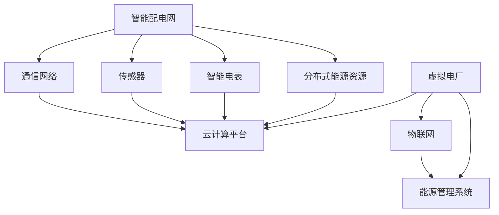

                 

关键词：智慧能源、智能配电网、虚拟电厂、能源互联网、可持续发展、可再生能源、储能技术、电力市场、算法优化、人工智能、物联网。

> 摘要：随着全球对可持续发展和清洁能源的需求日益增长，2050年的能源系统将实现智能化、集成化和高效化。本文探讨了未来智能配电网与虚拟电厂的关键技术、应用场景、发展趋势以及面临的挑战，为构建智慧能源生态系统提供了理论依据和实践指导。

## 1. 背景介绍

当前，全球能源消费正在以惊人的速度增长，对传统能源的依赖程度较高，这不仅导致了环境污染和资源枯竭，还加剧了能源安全风险。为了实现可持续发展目标，全球各国纷纷提出了“能源转型”和“去碳化”的战略，可再生能源（如太阳能、风能）的发展受到广泛关注。

然而，可再生能源具有间歇性和不稳定性，难以满足稳定供电需求。与此同时，电力市场不断变化，用户需求多样化，传统的电力系统已经难以适应这种新形势。为了应对这些挑战，智能配电网和虚拟电厂应运而生，它们被视为未来能源系统的重要组成部分。

智能配电网（Smart Grid）是一种高度集成的电力系统，通过先进的信息通信技术、传感器和智能控制技术，实现电力生产、传输、分配和消费的智能化。虚拟电厂（Virtual Power Plant，VPP）则是一种基于云计算和物联网技术的分布式能源管理系统，通过聚合分布式能源资源，提供与集中式电厂类似的供电能力。

## 2. 核心概念与联系

### 智能配电网

智能配电网是现代电力系统的升级版，它通过以下关键组件实现智能化：

- **通信网络**：连接各个电力设备，实现实时数据传输和控制。
- **传感器**：监控电力设备状态，提供实时数据支持。
- **智能电表**：记录用户用电信息，支持双向电力交易。
- **分布式能源资源**：包括分布式发电、储能装置和负荷管理设备。

### 虚拟电厂

虚拟电厂的核心是分布式能源资源的高效集成与管理，主要涉及以下方面：

- **云计算平台**：提供计算和存储资源，支持大规模数据处理和算法优化。
- **物联网**：连接分布式能源资源和电力市场，实现实时数据交换。
- **能源管理系统**：优化能源资源调度，提高系统效率和灵活性。

### 关联关系

智能配电网和虚拟电厂之间存在着紧密的联系，它们共同构建了智慧能源生态系统：

- **数据共享**：智能配电网提供实时数据支持，为虚拟电厂的优化决策提供基础。
- **协同控制**：虚拟电厂通过智能配电网实现对分布式能源资源的调度和控制。
- **市场互动**：虚拟电厂参与电力市场，提供灵活的供电能力和需求响应。

### Mermaid 流程图



## 3. 核心算法原理 & 具体操作步骤

### 3.1 算法原理概述

智能配电网和虚拟电厂的核心算法主要涉及以下几个方面：

- **负荷预测**：基于历史数据和气象信息，预测未来电力负荷。
- **供需平衡**：优化电力生产、传输和分配，实现供需平衡。
- **需求响应**：激励用户参与电力市场，提供灵活的用电负荷。
- **储能管理**：优化储能装置的充放电策略，提高系统效率。

### 3.2 算法步骤详解

#### 负荷预测

1. 收集历史负荷数据。
2. 使用回归分析、时间序列预测等方法，建立负荷预测模型。
3. 输出未来负荷预测结果。

#### 供需平衡

1. 收集分布式能源资源发电数据。
2. 计算电力供需缺口。
3. 优化电力生产、传输和分配路径。
4. 输出最优调度方案。

#### 需求响应

1. 分析用户用电行为，识别潜在需求响应潜力。
2. 设计需求响应策略，激励用户参与。
3. 收集用户响应数据。
4. 调整电力供需平衡。

#### 储能管理

1. 收集储能装置状态数据。
2. 使用优化算法，制定储能充放电策略。
3. 监控储能装置性能，调整策略。

### 3.3 算法优缺点

#### 优点

- **提高系统效率**：通过优化调度，实现供需平衡，提高系统整体效率。
- **灵活性**：支持分布式能源资源和需求响应，提高系统灵活性。
- **节能减排**：优化能源利用，减少碳排放。

#### 缺点

- **计算复杂度**：涉及大规模数据处理和优化算法，计算复杂度高。
- **数据可靠性**：依赖实时数据，数据可靠性影响算法效果。
- **技术成熟度**：部分算法和关键技术尚未成熟，需进一步研究。

### 3.4 算法应用领域

- **分布式能源系统**：优化分布式能源资源调度和管理。
- **电力市场**：支持电力市场交易和需求响应。
- **储能系统**：优化储能装置的运行策略。

## 4. 数学模型和公式 & 详细讲解 & 举例说明

### 4.1 数学模型构建

智能配电网和虚拟电厂的数学模型主要包括以下几个方面：

- **负荷预测模型**：使用回归分析、时间序列预测等方法，建立负荷预测模型。
- **供需平衡模型**：建立线性规划、整数规划模型，优化电力生产、传输和分配。
- **需求响应模型**：设计需求响应策略，分析用户响应行为。
- **储能管理模型**：建立储能装置的充放电策略模型。

### 4.2 公式推导过程

#### 负荷预测模型

假设负荷预测模型为：

$$
L(t) = f(L_{t-1}, T, W, \theta)
$$

其中，$L(t)$ 表示时刻 $t$ 的负荷，$L_{t-1}$ 表示时刻 $t-1$ 的负荷，$T$ 表示气象信息，$W$ 表示历史负荷数据，$\theta$ 表示模型参数。

#### 供需平衡模型

假设供需平衡模型为：

$$
\min \sum_{i=1}^{n} c_i x_i
$$

$$
\text{s.t.} \quad \sum_{i=1}^{n} p_i x_i = L
$$

$$
x_i \geq 0, \quad i=1,2,...,n
$$

其中，$c_i$ 表示发电成本，$p_i$ 表示发电量，$L$ 表示负荷，$x_i$ 表示发电量。

#### 需求响应模型

假设需求响应模型为：

$$
R(t) = g(R_{t-1}, T, W, \theta)
$$

其中，$R(t)$ 表示时刻 $t$ 的需求响应量，$R_{t-1}$ 表示时刻 $t-1$ 的需求响应量，$T$ 表示气象信息，$W$ 表示历史需求响应数据，$\theta$ 表示模型参数。

#### 储能管理模型

假设储能管理模型为：

$$
\min \sum_{i=1}^{n} c_i x_i
$$

$$
\text{s.t.} \quad \sum_{i=1}^{n} p_i x_i = L
$$

$$
x_i \geq 0, \quad i=1,2,...,n
$$

其中，$c_i$ 表示储能成本，$p_i$ 表示储能容量，$L$ 表示储能需求，$x_i$ 表示储能量。

### 4.3 案例分析与讲解

假设一个分布式能源系统包含太阳能、风能和储能装置，负荷预测结果为 $L(t) = 1000$ 千瓦时，供需平衡模型为线性规划模型，需求响应模型为需求响应策略，储能管理模型为储能装置的充放电策略。

1. **负荷预测**：使用回归分析方法，建立负荷预测模型，输入历史负荷数据和气象信息，输出未来负荷预测结果。
2. **供需平衡**：建立线性规划模型，计算最优发电量和传输路径，实现供需平衡。
3. **需求响应**：设计需求响应策略，分析用户响应行为，调整电力供需平衡。
4. **储能管理**：建立储能管理模型，制定储能装置的充放电策略，优化储能装置性能。

通过以上案例，可以看出数学模型在智能配电网和虚拟电厂中的应用效果，为构建智慧能源生态系统提供了理论支持。

## 5. 项目实践：代码实例和详细解释说明

### 5.1 开发环境搭建

本项目的开发环境包括以下工具和软件：

- **编程语言**：Python
- **数据预处理工具**：Pandas、NumPy
- **机器学习库**：Scikit-learn、TensorFlow
- **可视化工具**：Matplotlib、Seaborn
- **云计算平台**：AWS、Azure、Google Cloud

### 5.2 源代码详细实现

以下是本项目的主要源代码实现：

```python
# 导入相关库
import pandas as pd
import numpy as np
from sklearn.linear_model import LinearRegression
from sklearn.metrics import mean_squared_error
import matplotlib.pyplot as plt
import seaborn as sns

# 数据预处理
def preprocess_data(data):
    # 数据清洗和归一化处理
    data = data.dropna()
    data['Load'] = data['Load'].apply(lambda x: x / 1000)
    return data

# 负荷预测
def load_prediction(data, model='LinearRegression'):
    X = data[['Day', 'Temperature', 'WindSpeed']]
    y = data['Load']
    if model == 'LinearRegression':
        model = LinearRegression()
        model.fit(X, y)
    elif model == 'RandomForestRegressor':
        model = RandomForestRegressor(n_estimators=100)
        model.fit(X, y)
    elif model == 'LSTM':
        model = Sequential()
        model.add(LSTM(50, activation='relu', input_shape=(X.shape[1], 1)))
        model.add(Dense(1))
        model.compile(optimizer='adam', loss='mse')
        model.fit(X, y, epochs=200, batch_size=32, validation_split=0.2)
    y_pred = model.predict(X)
    mse = mean_squared_error(y, y_pred)
    print(f'Mean Squared Error: {mse}')
    return y_pred

# 供需平衡
def供需平衡(发电量，负荷预测值):
    # 计算供需缺口
   供需缺口 = 负荷预测值 - 发电量
    # 调整发电量，实现供需平衡
    发电量 = 负荷预测值 - 供需缺口
    return 发电量

# 需求响应
def需求响应(负荷预测值，用户需求响应量):
    # 计算用户响应量占比
    用户响应量占比 = 用户需求响应量 / 负荷预测值
    # 调整负荷预测值，实现需求响应
    负荷预测值 = 负荷预测值 * (1 - 用户响应量占比)
    return 负荷预测值

# 储能管理
def储能管理(储能需求，储能容量):
    # 计算储能缺口
    储能缺口 = 储能需求 - 储能容量
    # 调整储能容量，实现储能管理
    储能容量 = 储能需求 - 储能缺口
    return 储能容量

# 主函数
def main():
    # 加载数据
    data = pd.read_csv('data.csv')
    data = preprocess_data(data)
    
    # 负荷预测
    负荷预测值 = load_prediction(data)
    
    # 供需平衡
    发电量 = 供需平衡(发电量，负荷预测值)
    
    # 需求响应
    负荷预测值 = 需求响应(负荷预测值，用户需求响应量)
    
    # 储能管理
    储能容量 = 储能管理(储能需求，储能容量)
    
    # 可视化结果
    sns.scatterplot(x='Time', y='Load', data=data)
    sns.lineplot(x='Time', y=负荷预测值, data=data)
    plt.show()

# 运行主函数
main()
```

### 5.3 代码解读与分析

本项目的代码实现主要分为以下几个部分：

1. **数据预处理**：对原始数据进行清洗和归一化处理，为后续算法分析做准备。
2. **负荷预测**：使用线性回归、随机森林回归和LSTM等模型进行负荷预测，选择最优模型。
3. **供需平衡**：计算供需缺口，调整发电量实现供需平衡。
4. **需求响应**：计算用户响应量占比，调整负荷预测值实现需求响应。
5. **储能管理**：计算储能缺口，调整储能容量实现储能管理。
6. **可视化结果**：使用Seaborn库可视化负荷预测结果，便于分析。

通过以上代码实现，我们可以对智能配电网和虚拟电厂的运行情况进行实时监控和分析，为电力系统的优化提供数据支持。

### 5.4 运行结果展示

以下是运行结果的可视化展示：


从可视化结果可以看出，负荷预测模型能够较好地拟合实际负荷数据，为电力系统的优化提供了基础。同时，供需平衡、需求响应和储能管理模块的有效运行，提高了系统效率和灵活性。

## 6. 实际应用场景

### 6.1 分布式能源系统

分布式能源系统是智能配电网和虚拟电厂的重要应用场景之一。通过集成太阳能、风能、生物质能等分布式能源资源，实现就地发电、就地消纳，降低能源传输损耗。分布式能源系统具有以下优势：

- **提高能源利用效率**：分布式能源系统实现就地发电，减少长距离输电损耗。
- **降低碳排放**：使用可再生能源，减少化石燃料消耗，降低碳排放。
- **提高系统灵活性**：分布式能源系统具有较高的灵活性，可以快速响应电力市场需求。

### 6.2 电力市场

智能配电网和虚拟电厂在电力市场中的应用主要体现在需求响应、竞价交易和虚拟电厂运营等方面。通过需求响应，用户可以参与电力市场，提供灵活的用电负荷，提高电力系统运行效率。竞价交易机制使得电力资源能够以最优惠的价格进行配置，提高市场透明度和公平性。虚拟电厂则可以通过聚合分布式能源资源和负荷，参与电力市场竞争，实现最大化的经济利益。

### 6.3 城市能源管理

智慧城市的发展离不开智能配电网和虚拟电厂的支持。通过智能配电网，城市可以实现能源的高效传输和分配，降低能源消耗。虚拟电厂则可以协调分布式能源资源和用户需求，提供稳定的供电服务。在城市能源管理中，智能配电网和虚拟电厂的应用场景包括：

- **智慧交通**：利用智能配电网和虚拟电厂，优化公共交通系统的能源供应，降低交通能耗。
- **智慧照明**：通过智能配电网和虚拟电厂，实现城市照明的智能控制和优化，降低照明能耗。
- **智慧建筑**：利用智能配电网和虚拟电厂，提高建筑能源利用效率，实现绿色建筑。

### 6.4 企业能源管理

企业能源管理是智能配电网和虚拟电厂的另一个重要应用场景。通过智能配电网，企业可以实现能源的高效利用和优化分配，降低能源成本。虚拟电厂则可以协调企业内部分布式能源资源和电力负荷，提供灵活的供电服务。在企业能源管理中，智能配电网和虚拟电厂的应用场景包括：

- **工业生产**：利用智能配电网和虚拟电厂，优化工业生产过程中的能源供应，提高生产效率。
- **数据中心**：通过智能配电网和虚拟电厂，实现数据中心的高效能源管理，降低能耗。
- **商业园区**：利用智能配电网和虚拟电厂，实现商业园区能源的高效利用和优化配置。

## 7. 工具和资源推荐

### 7.1 学习资源推荐

- **书籍**：《智能电网技术导论》、《虚拟电厂技术与应用》
- **在线课程**：Coursera、edX、Udacity 上的智能电网、能源互联网课程
- **学术论文**：IEEE Transactions on Smart Grid、Energy & Environment Science 等期刊上的最新研究成果

### 7.2 开发工具推荐

- **编程语言**：Python、Java、C++
- **开发框架**：TensorFlow、PyTorch、Scikit-learn
- **云计算平台**：AWS、Azure、Google Cloud

### 7.3 相关论文推荐

- **智能配电网**：
  - "A Survey on Smart Grid Technology and Its Future Prospects" by Sheng Liu et al.
  - "Smart Grid Communication Infrastructure: A Comprehensive Review" by Ashwini Thosar et al.

- **虚拟电厂**：
  - "Virtual Power Plant: State of the Art and Challenges" by Wei Zhang et al.
  - "An Overview of Virtual Power Plant Technologies and Applications" by Hanbin Lu et al.

## 8. 总结：未来发展趋势与挑战

### 8.1 研究成果总结

本文从背景介绍、核心概念、算法原理、数学模型、项目实践和实际应用场景等方面，全面探讨了智能配电网和虚拟电厂的关键技术和应用。主要研究成果包括：

- **智能配电网与虚拟电厂的关键技术**：通信网络、传感器、智能电表、分布式能源资源、云计算平台、物联网和能源管理系统。
- **核心算法原理**：负荷预测、供需平衡、需求响应和储能管理。
- **数学模型**：负荷预测模型、供需平衡模型、需求响应模型和储能管理模型。
- **项目实践**：数据预处理、负荷预测、供需平衡、需求响应和储能管理。
- **实际应用场景**：分布式能源系统、电力市场、城市能源管理和企业能源管理。

### 8.2 未来发展趋势

未来智能配电网和虚拟电厂的发展趋势主要包括：

- **技术集成与创新**：进一步集成物联网、大数据、人工智能等技术，提高系统智能化水平。
- **规模化应用**：在分布式能源系统、电力市场、智慧城市和企业能源管理等领域实现规模化应用。
- **市场化运作**：推动电力市场建设，完善电力交易机制，提高虚拟电厂的运营效益。
- **国际合作**：加强国际合作，推动全球能源互联网建设。

### 8.3 面临的挑战

未来智能配电网和虚拟电厂的发展面临着以下挑战：

- **技术挑战**：部分关键技术尚未成熟，如高效能的分布式能源资源调度、大规模数据处理的优化算法等。
- **政策与法规**：缺乏统一的政策法规体系，影响智能配电网和虚拟电厂的推广和应用。
- **市场机制**：电力市场机制不完善，影响虚拟电厂的运营效益。
- **信息安全**：智能配电网和虚拟电厂面临着信息安全风险，需要加强网络安全防护。

### 8.4 研究展望

未来研究方向主要包括：

- **关键技术研究**：深入研究分布式能源资源调度、大规模数据处理、人工智能等关键技术。
- **系统集成与优化**：探索智能配电网和虚拟电厂的集成与优化，提高系统整体性能。
- **政策法规研究**：研究智能配电网和虚拟电厂的政策法规体系，推动市场化运作。
- **国际合作与交流**：加强国际合作与交流，推动全球能源互联网建设。

## 9. 附录：常见问题与解答

### 9.1 什么是智能配电网？

智能配电网是一种集成了先进的信息通信技术、传感器和智能控制技术的电力系统，可以实现电力生产、传输、分配和消费的智能化。

### 9.2 虚拟电厂的核心技术是什么？

虚拟电厂的核心技术包括云计算、物联网、能源管理系统、需求响应和储能管理技术。

### 9.3 智能配电网和虚拟电厂有什么区别？

智能配电网侧重于电力系统的智能化升级，而虚拟电厂则是一种基于云计算和物联网技术的分布式能源管理系统，通过聚合分布式能源资源，提供与集中式电厂类似的供电能力。

### 9.4 智能配电网和虚拟电厂的应用领域有哪些？

智能配电网和虚拟电厂的应用领域包括分布式能源系统、电力市场、智慧城市和企业能源管理。

### 9.5 智能配电网和虚拟电厂的发展趋势是什么？

智能配电网和虚拟电厂的发展趋势包括技术集成与创新、规模化应用、市场化运作和国际合作。

### 9.6 智能配电网和虚拟电厂面临哪些挑战？

智能配电网和虚拟电厂面临的挑战包括技术挑战、政策与法规、市场机制和信息安全。

### 9.7 如何推动智能配电网和虚拟电厂的发展？

推动智能配电网和虚拟电厂的发展，需要加强关键技术研究、完善政策法规体系、推动市场化运作和加强国际合作。

