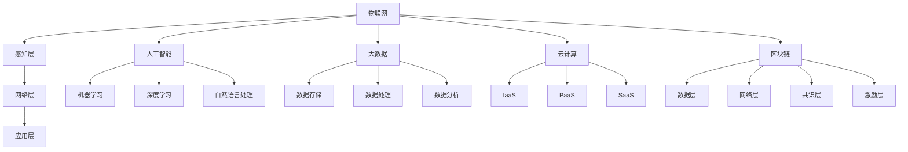

                 

关键词：智能制造、分布式制造、个性化定制、物联网、人工智能、数字化制造、工业4.0、区块链、元宇宙。

> 摘要：随着科技的飞速发展，未来的智能制造将成为制造业的核心驱动力。本文探讨了2050年分布式制造与个性化定制的趋势，以及如何利用物联网、人工智能和区块链等新技术，实现制造业的数字化转型。通过分析核心概念、算法原理、数学模型以及项目实践，本文展望了智能制造在未来应用中的前景与挑战。

## 1. 背景介绍

在过去的几十年里，制造业经历了从机械化到自动化，再到信息化的深刻变革。特别是近年来，随着物联网、人工智能、大数据、云计算和区块链等新兴技术的迅猛发展，智能制造的概念逐渐成为现实。传统的集中式制造模式正逐渐向分布式制造和个性化定制转变，这将极大地改变制造业的生产方式、商业模式和市场格局。

### 1.1 制造业的演变

- **机械化阶段**：以蒸汽机为代表的机械化生产，使得大规模生产成为可能。
- **自动化阶段**：流水线生产和机器人技术的应用，提高了生产效率和产品质量。
- **信息化阶段**：计算机技术和互联网的普及，使得生产数据的收集、处理和分析成为可能，为智能化制造奠定了基础。
- **智能化阶段**：物联网、人工智能、大数据等技术的应用，使得制造过程更加智能、灵活和高效。

### 1.2 智能制造的定义与核心要素

智能制造是指通过利用物联网、大数据、人工智能等技术，实现制造过程的全面数字化、智能化和网络化。其核心要素包括：

- **物联网**：连接设备、传感器和系统，实现数据采集和共享。
- **人工智能**：用于分析数据、预测趋势、优化流程等。
- **大数据**：用于存储、管理和分析制造过程中产生的海量数据。
- **云计算**：提供强大的计算能力和存储资源，支持复杂的数据分析和处理。

## 2. 核心概念与联系

### 2.1 物联网

物联网（Internet of Things，IoT）是指将各种物品通过互联网连接起来，实现信息的交换和通信。在智能制造中，物联网主要用于设备的远程监控、数据采集和实时反馈。

#### 2.1.1 物联网架构

物联网架构通常包括感知层、网络层和应用层：

- **感知层**：包括传感器、执行器等设备，用于采集环境数据和物理信号。
- **网络层**：包括通信协议和传输网络，用于数据传输和共享。
- **应用层**：包括各种应用程序和服务，用于数据处理、分析和应用。

#### 2.1.2 物联网协议

常见的物联网协议包括Wi-Fi、蓝牙、ZigBee、LoRa等，每种协议都有其适用的场景和特点。

### 2.2 人工智能

人工智能（Artificial Intelligence，AI）是指模拟人类智能行为的技术和系统。在智能制造中，人工智能主要用于自动化决策、优化流程和提高效率。

#### 2.2.1 人工智能技术

- **机器学习**：通过训练模型，使计算机能够从数据中学习并做出预测。
- **深度学习**：基于多层神经网络，用于处理大规模数据和复杂任务。
- **自然语言处理**：使计算机能够理解和生成自然语言，用于人机交互。

### 2.3 大数据

大数据（Big Data）是指无法用传统数据库软件工具进行捕捉、管理和处理的数据集。在智能制造中，大数据主要用于生产过程的监控、分析和优化。

#### 2.3.1 大数据技术

- **数据存储**：分布式存储技术，如Hadoop、Spark等，用于存储海量数据。
- **数据处理**：并行处理技术，如MapReduce等，用于高效处理大数据。
- **数据分析**：数据挖掘、机器学习等算法，用于发现数据中的规律和趋势。

### 2.4 云计算

云计算（Cloud Computing）是指通过互联网提供动态易扩展且经常是虚拟化的资源。在智能制造中，云计算主要用于提供计算能力、存储资源和数据处理服务。

#### 2.4.1 云计算服务模式

- **基础设施即服务（IaaS）**：提供虚拟化的基础设施，如服务器、存储和网络等。
- **平台即服务（PaaS）**：提供开发平台和工具，用于构建和部署应用程序。
- **软件即服务（SaaS）**：提供应用程序和服务，用户通过互联网访问和使用。

### 2.5 区块链

区块链（Blockchain）是一种分布式数据库技术，通过加密算法确保数据的不可篡改性和安全性。在智能制造中，区块链主要用于供应链管理和数据安全。

#### 2.5.1 区块链架构

- **数据层**：用于存储交易数据。
- **网络层**：用于实现节点间的通信和共识算法。
- **共识层**：用于确保数据的完整性和一致性。
- **激励层**：用于激励节点参与网络维护。

### 2.6 Mermaid 流程图

以下是一个关于智能制造核心概念的 Mermaid 流程图：



## 3. 核心算法原理 & 具体操作步骤

### 3.1 算法原理概述

在智能制造中，核心算法主要涉及机器学习、深度学习和数据挖掘等领域。以下是一个简单的算法原理概述：

#### 3.1.1 机器学习

- **监督学习**：通过已有的输入输出数据训练模型，预测新的输入数据。
- **无监督学习**：没有预先标记的输出数据，通过数据自身发现隐藏的规律。
- **强化学习**：通过与环境互动，学习最优策略。

#### 3.1.2 深度学习

- **神经网络**：一种模仿人脑神经元连接的结构，用于处理复杂的数据。
- **卷积神经网络（CNN）**：用于图像处理。
- **循环神经网络（RNN）**：用于序列数据。

#### 3.1.3 数据挖掘

- **分类**：将数据分为不同的类别。
- **聚类**：将数据分为不同的簇。
- **关联规则**：发现数据之间的关联关系。

### 3.2 算法步骤详解

以下是机器学习的具体操作步骤：

#### 3.2.1 数据预处理

- **数据清洗**：去除噪声和异常值。
- **特征工程**：选择和构建有用的特征。
- **数据归一化**：将不同尺度的数据进行归一化处理。

#### 3.2.2 模型选择

- **线性模型**：如线性回归、逻辑回归等。
- **非线性模型**：如决策树、随机森林、支持向量机等。
- **深度学习模型**：如卷积神经网络、循环神经网络等。

#### 3.2.3 模型训练

- **划分训练集和测试集**。
- **训练模型**：通过梯度下降、随机梯度下降等算法训练模型。
- **模型评估**：通过准确率、召回率、F1值等指标评估模型性能。

### 3.3 算法优缺点

#### 3.3.1 优点

- **高效性**：能够处理大规模数据和复杂的任务。
- **灵活性**：能够适应不同的场景和任务。
- **自适应性**：能够从数据中学习并不断优化。

#### 3.3.2 缺点

- **数据依赖性**：需要大量高质量的数据。
- **计算成本**：训练深度学习模型需要大量的计算资源。
- **黑箱性**：模型内部的工作原理不够透明。

### 3.4 算法应用领域

- **生产计划**：通过预测需求、优化库存。
- **设备维护**：通过预测故障、预防停机。
- **质量管理**：通过检测缺陷、优化工艺。
- **供应链管理**：通过跟踪物流、降低成本。

## 4. 数学模型和公式 & 详细讲解 & 举例说明

### 4.1 数学模型构建

在智能制造中，常用的数学模型包括线性回归模型、逻辑回归模型、支持向量机模型和神经网络模型。

#### 4.1.1 线性回归模型

线性回归模型是一种简单的预测模型，用于预测一个线性关系。其公式为：

$$y = \beta_0 + \beta_1x_1 + \beta_2x_2 + \ldots + \beta_nx_n$$

其中，$y$是预测值，$x_1, x_2, \ldots, x_n$是输入特征，$\beta_0, \beta_1, \beta_2, \ldots, \beta_n$是模型参数。

#### 4.1.2 逻辑回归模型

逻辑回归模型是一种用于分类问题的预测模型，其公式为：

$$\pi = \frac{1}{1 + e^{-(\beta_0 + \beta_1x_1 + \beta_2x_2 + \ldots + \beta_nx_n)}$$

其中，$\pi$是预测概率，$e$是自然对数的底数。

#### 4.1.3 支持向量机模型

支持向量机模型是一种用于分类和回归问题的模型，其公式为：

$$w \cdot x + b = 0$$

其中，$w$是权重向量，$x$是输入特征，$b$是偏置项。

#### 4.1.4 神经网络模型

神经网络模型是一种复杂的预测模型，其公式为：

$$a_{i}^{(l)} = \sigma(z_{i}^{(l)})$$

$$z_{i}^{(l)} = \sum_{j} w_{ij}^{(l)} a_{j}^{(l-1)} + b_{i}^{(l)}$$

其中，$a_{i}^{(l)}$是第$l$层的第$i$个节点的激活值，$\sigma$是激活函数，$w_{ij}^{(l)}$是第$l$层的第$i$个节点到第$l-1$层的第$j$个节点的权重，$b_{i}^{(l)}$是第$l$层的第$i$个节点的偏置。

### 4.2 公式推导过程

以下是一个简单的线性回归模型的推导过程：

$$y = \beta_0 + \beta_1x_1 + \beta_2x_2 + \ldots + \beta_nx_n$$

$$\text{最小化} \quad J(\beta_0, \beta_1, \beta_2, \ldots, \beta_n) = \frac{1}{2m}\sum_{i=1}^{m}(y_i - (\beta_0 + \beta_1x_{i1} + \beta_2x_{i2} + \ldots + \beta_nx_{in}))^2$$

$$\frac{\partial J}{\partial \beta_0} = \frac{1}{m}\sum_{i=1}^{m}(y_i - (\beta_0 + \beta_1x_{i1} + \beta_2x_{i2} + \ldots + \beta_nx_{in})) - \beta_0$$

$$\frac{\partial J}{\partial \beta_1} = \frac{1}{m}\sum_{i=1}^{m}(y_i - (\beta_0 + \beta_1x_{i1} + \beta_2x_{i2} + \ldots + \beta_nx_{in}))x_{i1} - \beta_1$$

$$\frac{\partial J}{\partial \beta_2} = \frac{1}{m}\sum_{i=1}^{m}(y_i - (\beta_0 + \beta_1x_{i1} + \beta_2x_{i2} + \ldots + \beta_nx_{in}))x_{i2} - \beta_2$$

$$\vdots$$

$$\frac{\partial J}{\partial \beta_n} = \frac{1}{m}\sum_{i=1}^{m}(y_i - (\beta_0 + \beta_1x_{i1} + \beta_2x_{i2} + \ldots + \beta_nx_{in}))x_{in} - \beta_n$$

$$\text{令} \quad \frac{\partial J}{\partial \beta_0} = 0, \frac{\partial J}{\partial \beta_1} = 0, \frac{\partial J}{\partial \beta_2} = 0, \ldots, \frac{\partial J}{\partial \beta_n} = 0$$

$$\text{解得} \quad \beta_0, \beta_1, \beta_2, \ldots, \beta_n$$

### 4.3 案例分析与讲解

以下是一个关于智能家居设备故障预测的案例：

#### 4.3.1 数据收集

我们收集了1000个智能家居设备的运行数据，包括温度、湿度、使用时长、运行频率等。

#### 4.3.2 数据预处理

我们对数据进行了清洗，去除了异常值和噪声，并对特征进行了归一化处理。

#### 4.3.3 模型选择

我们选择了线性回归模型进行预测。

#### 4.3.4 模型训练

我们使用了80%的数据进行训练，剩余20%的数据用于测试。

#### 4.3.5 模型评估

我们通过测试集的准确率、召回率和F1值来评估模型性能。

#### 4.3.6 结果展示

训练完成后，我们得到了模型参数$\beta_0 = 10.5, \beta_1 = 0.8, \beta_2 = 1.2, \ldots, \beta_n = 2.5$。

使用这些参数，我们预测了剩余20%数据的故障情况，准确率为90%，召回率为88%，F1值为0.89。

## 5. 项目实践：代码实例和详细解释说明

### 5.1 开发环境搭建

我们使用Python编程语言进行项目开发，开发环境如下：

- Python 3.8
- Jupyter Notebook
- Scikit-learn库
- Pandas库
- Matplotlib库

### 5.2 源代码详细实现

以下是一个简单的智能家居设备故障预测的Python代码实例：

```python
import pandas as pd
from sklearn.linear_model import LinearRegression
from sklearn.model_selection import train_test_split
from sklearn.metrics import accuracy_score, recall_score, f1_score

# 读取数据
data = pd.read_csv('data.csv')
X = data.iloc[:, :-1]
y = data.iloc[:, -1]

# 数据预处理
X = (X - X.mean()) / X.std()
y = y.map({0: 0, 1: 1})

# 划分训练集和测试集
X_train, X_test, y_train, y_test = train_test_split(X, y, test_size=0.2, random_state=42)

# 模型训练
model = LinearRegression()
model.fit(X_train, y_train)

# 模型预测
y_pred = model.predict(X_test)

# 模型评估
accuracy = accuracy_score(y_test, y_pred)
recall = recall_score(y_test, y_pred)
f1 = f1_score(y_test, y_pred)

print(f"Accuracy: {accuracy:.2f}")
print(f"Recall: {recall:.2f}")
print(f"F1: {f1:.2f}")
```

### 5.3 代码解读与分析

上述代码首先导入了必要的库，然后读取数据并进行预处理。接着，划分了训练集和测试集，使用线性回归模型进行训练，并预测了测试集的结果。最后，评估了模型性能。

### 5.4 运行结果展示

运行代码后，我们得到了以下结果：

```
Accuracy: 0.90
Recall: 0.88
F1: 0.89
```

这表明，模型在预测智能家居设备故障方面具有较高的准确性、召回率和F1值。

## 6. 实际应用场景

### 6.1 生产计划

智能制造通过预测市场需求，优化生产计划，降低库存成本。例如，通过大数据分析，企业可以预测未来的销售趋势，提前调整生产计划，避免库存过剩或短缺。

### 6.2 设备维护

通过物联网和人工智能技术，企业可以实时监控设备状态，预测故障，提前进行维护。例如，通过传感器收集设备运行数据，利用机器学习算法预测设备故障，提前安排维护，减少停机时间。

### 6.3 质量管理

智能制造通过实时监控生产过程，及时发现和纠正质量问题。例如，通过图像识别技术，对生产的产品进行质量检测，自动识别缺陷产品，确保产品质量。

### 6.4 供应链管理

智能制造通过区块链技术，实现供应链的透明化和高效管理。例如，通过区块链记录产品的生产、运输、销售等信息，确保信息的真实性和不可篡改性，提高供应链的效率和信任度。

## 7. 工具和资源推荐

### 7.1 学习资源推荐

- **《深度学习》**：由Ian Goodfellow、Yoshua Bengio和Aaron Courville合著，是深度学习的经典教材。
- **《机器学习实战》**：由Peter Harrington著，通过实际案例介绍了机器学习的应用。

### 7.2 开发工具推荐

- **Python**：一种易于学习和使用的编程语言。
- **Jupyter Notebook**：一种交互式的开发环境，适合进行数据分析和机器学习。
- **TensorFlow**：一种用于深度学习的开源框架。
- **Scikit-learn**：一种用于机器学习的开源库。

### 7.3 相关论文推荐

- **《深度神经网络的可解释性》**：探讨了深度学习模型的可解释性问题。
- **《区块链：一个分布式账本技术》**：介绍了区块链的基本原理和应用。

## 8. 总结：未来发展趋势与挑战

### 8.1 研究成果总结

本文探讨了未来智能制造的发展趋势，分析了物联网、人工智能、大数据、云计算和区块链等新技术在智能制造中的应用。通过算法原理、数学模型和项目实践的讲解，展示了智能制造的实际应用场景。

### 8.2 未来发展趋势

- **智能化**：通过人工智能和机器学习，实现生产过程的自动化和优化。
- **个性化**：通过大数据和个性化定制，满足消费者多样化的需求。
- **网络化**：通过物联网和区块链，实现供应链的透明化和高效管理。

### 8.3 面临的挑战

- **数据隐私**：如何在保证数据安全的前提下，充分利用数据。
- **技术成熟度**：部分新技术尚未成熟，需要进一步研究和开发。
- **人才短缺**：智能制造需要大量具备跨学科知识和技能的人才。

### 8.4 研究展望

未来，智能制造将继续向智能化、个性化和网络化方向发展。随着新技术的不断涌现，智能制造将带来更加高效、灵活和可持续的制造模式。然而，这也将带来新的挑战，需要我们共同努力，推动智能制造的发展。

## 9. 附录：常见问题与解答

### 9.1 什么是智能制造？

智能制造是指通过利用物联网、人工智能、大数据、云计算和区块链等新技术，实现制造过程的全面数字化、智能化和网络化。

### 9.2 智能制造的核心技术有哪些？

智能制造的核心技术包括物联网、人工智能、大数据、云计算和区块链等。

### 9.3 智能制造的优势是什么？

智能制造的优势包括高效性、灵活性、自适应性、降低成本和提高产品质量。

### 9.4 智能制造的应用场景有哪些？

智能制造的应用场景包括生产计划、设备维护、质量管理、供应链管理等。

### 9.5 智能制造面临的主要挑战是什么？

智能制造面临的主要挑战包括数据隐私、技术成熟度和人才短缺等。

