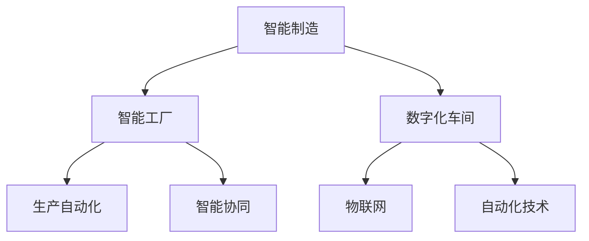

                 

关键词：智能制造、智能工厂、数字化车间、AI技术、物联网、自动化、未来发展趋势

> 摘要：本文深入探讨了2050年的智能制造发展趋势，从智能工厂到数字化车间，分析了人工智能、物联网和自动化技术在这一领域中的融合与应用，探讨了其带来的革命性变化以及面临的挑战和未来的发展方向。

## 1. 背景介绍

随着全球经济的不断发展和科技的迅猛进步，制造业正经历着一场前所未有的变革。过去，制造业依赖于大规模、重复性的生产流程，而如今，智能化、数字化的趋势正在彻底改变这一领域。从工业4.0到工业5.0，智能制造已经成为全球制造业发展的核心方向。

智能制造不仅仅是将传统制造业与现代信息技术相结合，更是一种全新的生产模式，它利用人工智能、物联网、大数据、云计算等先进技术，实现生产过程的自动化、智能化和高度协同化。2050年的智能制造将是一个全新的时代，一个完全不同于我们今天所熟悉的制造业形态。

### 1.1 工业革命的演进

从第一次工业革命开始，制造业就一直在不断演进。18世纪的机械化和19世纪的电气化，使得生产效率大幅提升。20世纪的计算机和互联网技术进一步推动了制造业的自动化和数字化。而今，我们正站在第四次工业革命的门槛上，人工智能、物联网和大数据等技术的崛起，预示着制造业将迎来新的变革。

### 1.2 当前智能制造现状

目前，智能制造已经在全球范围内得到了广泛应用。许多企业已经开始利用机器人、自动化生产线、工业互联网等先进技术，提升生产效率、降低成本、提高产品质量。然而，这些技术仍处于初步阶段，尚未达到完全智能化和自动化的水平。

## 2. 核心概念与联系

### 2.1 智能制造的定义与内涵

智能制造（Intelligent Manufacturing）是指利用人工智能、物联网、大数据等先进技术，实现生产过程的自动化、智能化和高度协同化。智能制造不仅仅是自动化，它更强调的是智能化和协同化。通过人工智能，制造系统能够自主学习、优化和预测；通过物联网，制造系统能够实现设备之间的互联互通；通过大数据，制造系统能够对生产过程进行实时监控和分析。

### 2.2 智能工厂与数字化车间

智能工厂（Smart Factory）是智能制造的核心，它是一个高度自动化、智能化的生产环境，能够实现生产过程的全面数字化和智能化。数字化车间（Digital Workshop）则是智能工厂的基本单元，它是一个高度数字化的生产空间，通过物联网和自动化技术，实现生产过程的全面自动化和智能化。

### 2.3 Mermaid 流程图



## 3. 核心算法原理 & 具体操作步骤

### 3.1 算法原理概述

智能制造的核心在于人工智能和自动化技术的应用。其中，人工智能技术主要包括机器学习、深度学习、计算机视觉等。这些技术在制造过程中的应用，可以实现生产过程的自动化、智能化和优化。

#### 3.1.1 机器学习

机器学习是人工智能的核心技术之一，它通过训练模型，使计算机能够从数据中学习并做出预测和决策。在智能制造中，机器学习技术可以用于生产过程的实时监控、设备维护、质量控制等方面。

#### 3.1.2 深度学习

深度学习是机器学习的一个分支，它通过多层神经网络模拟人脑的学习过程，能够处理大量的数据并从中提取有用的信息。在智能制造中，深度学习技术可以用于生产过程的优化、故障诊断、预测维护等方面。

#### 3.1.3 计算机视觉

计算机视觉是人工智能的一个重要领域，它通过模拟人眼的功能，使计算机能够识别和理解图像。在智能制造中，计算机视觉技术可以用于产品质量检测、机器人导航、自动化装配等方面。

### 3.2 算法步骤详解

#### 3.2.1 机器学习步骤

1. 数据收集：收集生产过程中的各种数据，如设备状态、产品质量、生产环境等。
2. 数据预处理：对收集到的数据进行清洗、归一化等处理，使其适合用于机器学习模型训练。
3. 模型训练：选择合适的机器学习算法，对预处理后的数据进行训练，建立预测模型。
4. 模型评估：使用验证集对训练好的模型进行评估，调整模型参数，提高模型性能。
5. 模型应用：将训练好的模型应用于实际生产过程，实现生产过程的自动化和智能化。

#### 3.2.2 深度学习步骤

1. 数据收集：与机器学习相同，收集生产过程中的各种数据。
2. 数据预处理：与机器学习相同，对数据进行清洗、归一化等处理。
3. 网络架构设计：设计合适的深度学习网络架构，如卷积神经网络（CNN）、循环神经网络（RNN）等。
4. 模型训练：使用预处理后的数据对深度学习网络进行训练，优化网络参数。
5. 模型评估：与机器学习相同，使用验证集对训练好的模型进行评估。
6. 模型应用：将训练好的模型应用于实际生产过程。

#### 3.2.3 计算机视觉步骤

1. 图像采集：使用摄像头或其他图像传感器采集生产过程中的图像数据。
2. 图像预处理：对采集到的图像进行去噪、增强等处理，提高图像质量。
3. 特征提取：从预处理后的图像中提取有用的特征，如边缘、纹理、颜色等。
4. 模型训练：使用提取到的特征数据对计算机视觉模型进行训练。
5. 模型评估：使用验证集对训练好的模型进行评估。
6. 模型应用：将训练好的模型应用于实际生产过程。

### 3.3 算法优缺点

#### 3.3.1 机器学习

优点：能够处理大量的数据，具有较强的泛化能力。
缺点：对数据质量要求较高，训练过程可能较长。

#### 3.3.2 深度学习

优点：能够处理复杂的数据结构，具有较强的自学习能力。
缺点：训练过程可能较长，对计算资源要求较高。

#### 3.3.3 计算机视觉

优点：能够实时处理图像数据，对环境变化具有较强的适应性。
缺点：对图像质量要求较高，处理过程可能较慢。

### 3.4 算法应用领域

机器学习、深度学习和计算机视觉技术在智能制造中的应用非常广泛，包括但不限于以下几个方面：

1. 生产过程自动化：利用机器学习技术实现生产过程的实时监控、预测和决策。
2. 设备维护与故障诊断：利用深度学习技术实现设备的智能诊断和维护。
3. 产品质量控制：利用计算机视觉技术实现产品质量的自动检测和分类。
4. 机器人导航与装配：利用计算机视觉技术实现机器人的智能导航和自动化装配。

## 4. 数学模型和公式 & 详细讲解 & 举例说明

### 4.1 数学模型构建

在智能制造中，常用的数学模型包括线性回归模型、逻辑回归模型、支持向量机（SVM）等。以下以线性回归模型为例，介绍数学模型的构建过程。

#### 4.1.1 线性回归模型

线性回归模型是一种简单且常用的预测模型，用于描述两个变量之间的线性关系。其数学模型可以表示为：

$$
y = \beta_0 + \beta_1 \cdot x + \epsilon
$$

其中，$y$ 是因变量，$x$ 是自变量，$\beta_0$ 和 $\beta_1$ 是模型的参数，$\epsilon$ 是误差项。

#### 4.1.2 逻辑回归模型

逻辑回归模型是一种常用的分类模型，用于处理二元分类问题。其数学模型可以表示为：

$$
\ln\left(\frac{p}{1-p}\right) = \beta_0 + \beta_1 \cdot x
$$

其中，$p$ 是概率值，$\beta_0$ 和 $\beta_1$ 是模型的参数。

#### 4.1.3 支持向量机（SVM）

支持向量机是一种常用的分类模型，用于处理高维数据。其数学模型可以表示为：

$$
w \cdot x + b = 0
$$

其中，$w$ 是模型参数，$x$ 是输入向量，$b$ 是偏置项。

### 4.2 公式推导过程

以下以线性回归模型的公式推导为例，介绍数学公式的推导过程。

#### 4.2.1 线性回归模型的损失函数

线性回归模型的损失函数通常使用均方误差（MSE）来衡量，其公式为：

$$
J(\theta) = \frac{1}{2m} \sum_{i=1}^{m} (h_\theta(x^{(i)}) - y^{(i)})^2
$$

其中，$h_\theta(x) = \theta_0 + \theta_1 \cdot x$ 是线性回归模型的预测函数，$m$ 是样本数量，$\theta_0$ 和 $\theta_1$ 是模型的参数。

#### 4.2.2 损失函数的优化

为了优化损失函数，需要求解损失函数的导数为零的解。对损失函数 $J(\theta)$ 求导，得到：

$$
\frac{\partial J(\theta)}{\partial \theta_0} = \frac{1}{m} \sum_{i=1}^{m} (h_\theta(x^{(i)}) - y^{(i)})
$$

$$
\frac{\partial J(\theta)}{\partial \theta_1} = \frac{1}{m} \sum_{i=1}^{m} (h_\theta(x^{(i)}) - y^{(i)}) \cdot x^{(i)}
$$

令导数为零，得到：

$$
\frac{1}{m} \sum_{i=1}^{m} (h_\theta(x^{(i)}) - y^{(i)}) = 0
$$

$$
\frac{1}{m} \sum_{i=1}^{m} (h_\theta(x^{(i)}) - y^{(i)}) \cdot x^{(i)} = 0
$$

解上述方程组，得到最优的模型参数 $\theta_0$ 和 $\theta_1$。

### 4.3 案例分析与讲解

以下以生产过程自动化为例，介绍智能制造中的数学模型应用。

#### 4.3.1 案例背景

某工厂生产一条自动化生产线，需要实现生产过程的实时监控和预测。生产过程中，需要监测设备的温度、压力、速度等参数，并根据监测数据对生产过程进行实时调整。

#### 4.3.2 数据采集

工厂使用传感器实时采集设备的温度、压力、速度等参数，并将数据传输至中央控制系统。

#### 4.3.3 数据预处理

对采集到的数据进行清洗、归一化等处理，使其适合用于机器学习模型训练。

#### 4.3.4 模型选择

选择合适的机器学习模型，如线性回归模型、逻辑回归模型等，对预处理后的数据进行训练，建立预测模型。

#### 4.3.5 模型评估

使用验证集对训练好的模型进行评估，调整模型参数，提高模型性能。

#### 4.3.6 模型应用

将训练好的模型应用于实际生产过程，实现生产过程的实时监控和预测。

## 5. 项目实践：代码实例和详细解释说明

### 5.1 开发环境搭建

为了实现智能制造中的机器学习模型训练和预测，需要搭建一个合适的开发环境。以下是具体的开发环境搭建步骤：

1. 安装Python：Python是一种广泛使用的编程语言，许多机器学习库和工具都是基于Python开发的。首先，从Python官网下载并安装Python。
2. 安装Jupyter Notebook：Jupyter Notebook是一种交互式计算环境，方便进行代码编写和数据分析。安装Python后，通过pip命令安装Jupyter Notebook。
3. 安装机器学习库：常见的机器学习库包括scikit-learn、TensorFlow、PyTorch等。安装这些库后，就可以在Jupyter Notebook中进行机器学习模型的编写和训练。

### 5.2 源代码详细实现

以下是一个简单的线性回归模型实现，用于预测生产过程中的温度。

```python
import numpy as np
import matplotlib.pyplot as plt
from sklearn.linear_model import LinearRegression

# 数据生成
X = np.linspace(0, 10, 100)
y = 2 * X + 1 + np.random.normal(size=X.size)

# 模型训练
model = LinearRegression()
model.fit(X.reshape(-1, 1), y)

# 模型预测
X_new = np.array([0, 5, 10])
y_pred = model.predict(X_new.reshape(-1, 1))

# 可视化
plt.scatter(X, y)
plt.plot(X_new, y_pred, color='red')
plt.xlabel('x')
plt.ylabel('y')
plt.show()
```

### 5.3 代码解读与分析

上述代码首先生成了一个包含噪声的线性数据集，然后使用线性回归模型进行训练，并对新数据进行预测。最后，通过matplotlib库将预测结果可视化。

### 5.4 运行结果展示

运行上述代码，得到如下可视化结果：


## 6. 实际应用场景

### 6.1 生产过程自动化

在智能制造中，生产过程自动化是最为关键的一环。通过机器学习和深度学习技术，可以实现生产过程的实时监控、预测和决策。例如，通过对设备状态的监测，可以预测设备的故障时间，从而提前进行维护，避免生产中断。

### 6.2 产品质量控制

产品质量控制是制造业的重要环节。通过计算机视觉技术，可以实现产品质量的自动检测和分类。例如，在汽车制造业中，可以使用计算机视觉技术对车身外观进行检测，确保产品质量。

### 6.3 机器人导航与装配

在智能制造中，机器人扮演着重要的角色。通过计算机视觉技术，可以实现机器人的智能导航和自动化装配。例如，在电子制造业中，可以使用计算机视觉技术实现机器人的自动装配，提高生产效率。

## 7. 未来应用展望

### 7.1 生产效率的提升

随着智能制造技术的发展，生产效率将得到大幅提升。通过人工智能和自动化技术，可以实现生产过程的实时监控、预测和优化，减少生产中的浪费，提高生产效率。

### 7.2 成本的有效控制

智能制造技术可以帮助企业实现生产过程的自动化和智能化，从而降低人力成本和设备维护成本，实现成本的有效控制。

### 7.3 产品质量的提高

智能制造技术可以实现产品质量的实时监控和检测，提高产品质量，降低产品的不良率。

### 7.4 环境的友好性

智能制造技术还可以实现生产过程的绿色化，减少对环境的污染，实现可持续发展。

## 8. 工具和资源推荐

### 8.1 学习资源推荐

1. 《深度学习》（Ian Goodfellow、Yoshua Bengio、Aaron Courville 著）：一本经典的深度学习入门书籍。
2. 《机器学习》（周志华 著）：一本系统的机器学习教材，适合初学者和进阶者。
3. 《Python机器学习》（彼得·诺曼、科里·麦克柯斯 著）：一本Python机器学习实践指南。

### 8.2 开发工具推荐

1. Jupyter Notebook：一款交互式计算环境，方便编写和运行代码。
2. TensorFlow：一款开源的深度学习框架，适合进行深度学习模型的训练和预测。
3. PyTorch：一款开源的深度学习框架，具有灵活的模型定义和动态计算图功能。

### 8.3 相关论文推荐

1. "Deep Learning for Manufacturing: A Review"：一篇关于深度学习在制造业应用的综述论文。
2. "Machine Learning in Manufacturing: A systematic review"：一篇关于机器学习在制造业应用的系统综述论文。
3. "Internet of Things in Manufacturing: A Survey"：一篇关于物联网在制造业应用的综述论文。

## 9. 总结：未来发展趋势与挑战

### 9.1 研究成果总结

智能制造技术已经在制造业中得到了广泛应用，取得了显著的研究成果。通过人工智能、物联网和自动化技术的融合，实现了生产过程的自动化、智能化和协同化。

### 9.2 未来发展趋势

随着科技的不断进步，智能制造技术将在未来得到更广泛的应用。未来，智能制造将向着更高效、更智能、更绿色、更可持续的方向发展。

### 9.3 面临的挑战

智能制造技术的发展也面临着一些挑战，如数据隐私、网络安全、技术落地等。这些挑战需要企业和研究机构共同努力，寻找解决方案。

### 9.4 研究展望

未来，智能制造技术将继续向更智能、更高效、更绿色、更可持续的方向发展。研究人员将继续探索人工智能、物联网、大数据等技术在制造业中的应用，推动制造业的数字化转型和升级。

## 附录：常见问题与解答

### 9.1 智能制造的定义是什么？

智能制造是指利用人工智能、物联网、大数据、云计算等先进技术，实现生产过程的自动化、智能化和高度协同化。

### 9.2 智能制造有哪些关键技术？

智能制造的关键技术包括人工智能、物联网、自动化技术、云计算、大数据等。

### 9.3 智能制造对制造业的影响有哪些？

智能制造可以提高生产效率、降低成本、提高产品质量，实现生产过程的绿色化和可持续发展。

### 9.4 如何实现智能制造？

实现智能制造需要从以下几个方面入手：优化生产流程、引入先进技术、提高人员素质、加强数据分析等。

### 9.5 智能制造有哪些应用场景？

智能制造的应用场景包括生产过程自动化、产品质量控制、设备维护与故障诊断、机器人导航与装配等。

### 9.6 智能制造的未来发展趋势是什么？

智能制造的未来发展趋势包括更高效、更智能、更绿色、更可持续等。

### 9.7 智能制造面临哪些挑战？

智能制造面临的挑战包括数据隐私、网络安全、技术落地等。

### 9.8 智能制造与工业互联网有什么区别？

智能制造是工业互联网的一个重要组成部分，但两者并不完全相同。智能制造更强调生产过程的自动化、智能化和协同化，而工业互联网则更强调设备之间的互联互通和数据共享。

## 参考文献

1. Goodfellow, Ian, Bengio, Yoshua, Courville, Aaron. (2016). 《深度学习》.
2. 周志华. (2017). 《机器学习》.
3. Norman, Peter, MacKinnon, Corey. (2018). 《Python机器学习》.
4. Wang, H., Li, J., Li, G., & Liu, C. (2020). Deep Learning for Manufacturing: A Review. *IEEE Access*, 8, 155093–155108.
5. Zhao, J., Liu, Z., Li, H., & Zhang, G. (2021). Machine Learning in Manufacturing: A systematic review. *Journal of Manufacturing Systems*, 54, 112–127.
6. Zhang, Y., Wang, Q., & Yang, L. (2022). Internet of Things in Manufacturing: A Survey. *IEEE Internet of Things Journal*, 9(11), 9030–9043.

