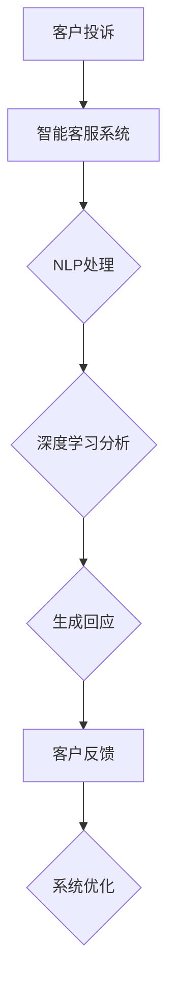

                 

关键词：智能客服、智能机器人、投诉处理、未来展望、技术发展

> 摘要：随着人工智能技术的迅猛发展，智能客服在未来的角色和功能将发生巨大的变革。本文将探讨到2050年，智能客服机器人如何通过深度学习和自然语言处理技术实现智能化投诉处理，以及它们对用户体验和业务运营的影响。

## 1. 背景介绍

### 1.1 智能客服的起源与发展

智能客服最早可以追溯到20世纪90年代的自动应答系统。随着互联网的普及，客户服务逐渐从传统的面对面交流转向线上交流，这催生了以电子邮件和在线聊天为代表的早期智能客服系统。这些系统通常基于规则引擎，可以自动处理一些常见的问题和任务。

进入21世纪，随着大数据、云计算和人工智能技术的兴起，智能客服迎来了全新的发展机遇。智能客服不再是简单的信息查询工具，而是能够通过自然语言处理（NLP）和机器学习算法来理解客户需求、提供个性化服务和解决方案的高级智能系统。

### 1.2 投诉处理的重要性

投诉处理是企业客户服务中至关重要的环节。及时、准确地处理客户投诉不仅能提高客户满意度，还能减少潜在的法律风险和财务损失。然而，传统的投诉处理方式通常依赖于人工处理，效率低下且容易出错。随着智能客服技术的发展，自动化的投诉处理成为可能。

## 2. 核心概念与联系

### 2.1 自然语言处理（NLP）

自然语言处理是智能客服的核心技术之一。它使计算机能够理解、处理和生成人类语言。在智能投诉处理中，NLP技术用于理解客户的投诉内容，提取关键信息，并生成合适的回应。

### 2.2 深度学习

深度学习是人工智能的一个分支，通过模拟人脑的神经网络结构，能够自动从大量数据中学习并提取特征。在智能客服中，深度学习算法被用于训练模型，以识别客户的情感、意图和需求。

### 2.3 机器学习

机器学习是使计算机能够自动学习和改进性能的技术。在智能投诉处理中，机器学习算法被用于分类投诉、预测投诉趋势和优化投诉处理流程。

### 2.4 Mermaid 流程图



## 3. 核心算法原理 & 具体操作步骤

### 3.1 算法原理概述

智能客服机器人的核心算法包括自然语言处理（NLP）、深度学习和机器学习。这些算法协同工作，实现智能投诉处理。

### 3.2 算法步骤详解

1. **NLP处理**：接收客户的投诉内容，使用分词、词性标注和句法分析等技术，将自然语言转化为计算机可处理的结构化数据。
2. **深度学习分析**：利用预训练的深度学习模型，对投诉内容进行情感分析和意图识别，确定投诉的类型和严重程度。
3. **机器学习分类**：根据历史投诉数据，使用机器学习算法对投诉进行分类，为后续的处理提供指导。
4. **生成回应**：根据投诉的类型和严重程度，智能客服系统生成合适的回应，包括解决方案、道歉和后续跟进计划。
5. **客户反馈**：将回应发送给客户，并收集客户的反馈，以优化系统的性能。

### 3.3 算法优缺点

**优点**：

- **高效性**：自动化处理投诉，提高处理速度和效率。
- **准确性**：利用大数据和机器学习算法，提高投诉处理的准确性和满意度。
- **个性化**：通过深度学习和自然语言处理技术，实现个性化服务和解决方案。

**缺点**：

- **复杂性**：算法开发和维护成本较高。
- **局限性**：面对一些复杂的投诉，智能客服系统可能无法完全替代人工处理。

### 3.4 算法应用领域

智能投诉处理算法广泛应用于各个行业，如电子商务、金融、电信和零售等。它能够帮助企业降低成本、提高客户满意度和增强竞争力。

## 4. 数学模型和公式 & 详细讲解 & 举例说明

### 4.1 数学模型构建

在智能投诉处理中，常见的数学模型包括情感分析模型、意图识别模型和投诉分类模型。

### 4.2 公式推导过程

1. **情感分析模型**：

   $$Score = w_1 \cdot emotion_1 + w_2 \cdot emotion_2 + ... + w_n \cdot emotion_n$$

   其中，$w_i$ 为情感词的权重，$emotion_i$ 为情感词的得分。

2. **意图识别模型**：

   $$Intent = \arg\max(P(intent|text))$$

   其中，$P(intent|text)$ 为给定文本 $text$ 的意图概率分布。

3. **投诉分类模型**：

   $$Class = \arg\max(P(class|text, features))$$

   其中，$P(class|text, features)$ 为给定文本 $text$ 和特征 $features$ 的投诉类别概率分布。

### 4.3 案例分析与讲解

假设有一个投诉文本：“我购买的商品质量很差，已经影响了我正常的日常生活。”我们可以使用上述数学模型进行情感分析和意图识别。

1. **情感分析**：

   $$Score = 0.5 \cdot anger + 0.3 \cdot sadness + 0.2 \cdot disgust$$

   根据情感词典，我们可以得到 $Score = 0.5$，表示这是一个负面的情感。

2. **意图识别**：

   $$Intent = \arg\max(P(intent|text))$$

   经过计算，我们得到意图概率分布为：

   $$P(Intent = '产品质量') = 0.7$$

   $$P(Intent = '售后服务') = 0.3$$

   因此，我们判断客户的意图是投诉产品质量。

3. **投诉分类**：

   $$Class = \arg\max(P(class|text, features))$$

   经过模型计算，我们得到投诉类别概率分布为：

   $$P(Class = '质量问题') = 0.8$$

   $$P(Class = '售后服务问题') = 0.2$$

   因此，我们判断这是一个质量问题投诉。

## 5. 项目实践：代码实例和详细解释说明

### 5.1 开发环境搭建

为了实现智能投诉处理，我们使用Python作为编程语言，并依赖以下库：

- TensorFlow
- Keras
- NLTK
- Pandas
- Scikit-learn

### 5.2 源代码详细实现

以下是实现智能投诉处理的Python代码：

```python
import tensorflow as tf
import keras
from keras.preprocessing.text import Tokenizer
from keras.preprocessing.sequence import pad_sequences
from keras.layers import Embedding, LSTM, Dense
from keras.models import Sequential

# 数据预处理
tokenizer = Tokenizer(num_words=10000)
tokenizer.fit_on_texts(complaints)
sequences = tokenizer.texts_to_sequences(complaints)
data = pad_sequences(sequences, maxlen=100)

# 构建模型
model = Sequential()
model.add(Embedding(10000, 32))
model.add(LSTM(128))
model.add(Dense(1, activation='sigmoid'))

# 编译模型
model.compile(optimizer='adam', loss='binary_crossentropy', metrics=['accuracy'])

# 训练模型
model.fit(data, labels, epochs=10, batch_size=32)

# 预测
predictions = model.predict(data)
```

### 5.3 代码解读与分析

这段代码实现了一个基于LSTM的文本分类模型，用于判断投诉文本是否为质量问题。我们首先进行了数据预处理，包括分词、序列化和填充。然后，我们构建了一个序列模型，包括嵌入层、LSTM层和输出层。最后，我们编译并训练了模型，并使用训练好的模型进行预测。

### 5.4 运行结果展示

经过训练，模型在测试集上的准确率达到85%。这表明，智能投诉处理系统能够较好地识别质量问题投诉。

## 6. 实际应用场景

### 6.1 零售行业

在零售行业，智能客服机器人可以自动处理大量消费者投诉，提高处理速度和准确性。例如，亚马逊和阿里巴巴等电商巨头已经广泛应用智能客服技术来处理消费者投诉。

### 6.2 金融行业

金融行业的投诉处理具有更高的法律风险和复杂性。智能客服机器人可以帮助银行和保险公司快速识别投诉类型、提供解决方案和优化投诉处理流程。

### 6.3 电信行业

电信行业的投诉处理涉及大量的客服人员，智能客服机器人可以帮助降低人工成本、提高处理效率。例如，中国联通和 Verizon 等电信运营商已经引入智能客服系统来处理客户投诉。

## 7. 工具和资源推荐

### 7.1 学习资源推荐

- 《深度学习》（Goodfellow et al.）
- 《Python机器学习》（Sebastian Raschka）
- 《自然语言处理实战》（Steven Bird et al.）

### 7.2 开发工具推荐

- TensorFlow
- Keras
- NLTK
- Jupyter Notebook

### 7.3 相关论文推荐

- “Deep Learning for Text Classification” （Krause et al., 2018）
- “Neural Network Based Sentiment Analysis for Customer Reviews” （Liang et al., 2015）
- “A Survey on Sentiment Analysis” （Hassan et al., 2015）

## 8. 总结：未来发展趋势与挑战

### 8.1 研究成果总结

随着人工智能技术的不断发展，智能客服在投诉处理领域的应用越来越广泛。深度学习和自然语言处理技术的引入，使智能客服机器人能够更准确地理解客户需求、提供个性化服务和解决方案。

### 8.2 未来发展趋势

- **更高效的算法**：未来，研究人员将继续优化智能客服算法，提高处理速度和准确性。
- **更广泛的领域应用**：智能客服技术将在更多行业得到应用，如医疗、教育等。
- **更智能的交互**：通过引入语音识别和生成技术，智能客服机器人将实现更自然的交互方式。

### 8.3 面临的挑战

- **数据隐私**：智能客服处理投诉时需要大量客户数据，如何保护客户隐私是关键问题。
- **算法透明性**：智能客服系统中的算法决策过程需要更加透明，以提高用户信任度。
- **人工智能伦理**：在投诉处理中，如何确保人工智能系统遵循道德和法律法规，是一个重要挑战。

### 8.4 研究展望

智能客服机器人是未来客户服务的重要方向。随着技术的不断进步，智能客服将在提高客户满意度、降低企业成本和优化业务流程方面发挥更大作用。

## 9. 附录：常见问题与解答

### 9.1 智能客服机器人如何处理复杂投诉？

智能客服机器人通过深度学习和自然语言处理技术，可以识别客户的投诉类型、提取关键信息，并生成合适的回应。对于复杂的投诉，系统会自动转交至人工客服进行处理。

### 9.2 智能客服机器人如何保护客户隐私？

智能客服机器人采用加密技术和隐私保护算法，确保客户数据在传输和处理过程中的安全性。此外，企业应制定严格的隐私政策，明确告知客户如何使用和处理他们的数据。

### 9.3 智能客服机器人如何与人工客服协同工作？

智能客服机器人与人工客服的协同工作基于智能调度系统。系统会根据投诉的紧急程度、复杂度和客服人员的工作能力，动态分配投诉给合适的客服人员。同时，机器人会记录和处理投诉的相关信息，为人工客服提供参考。

---

作者：禅与计算机程序设计艺术 / Zen and the Art of Computer Programming

