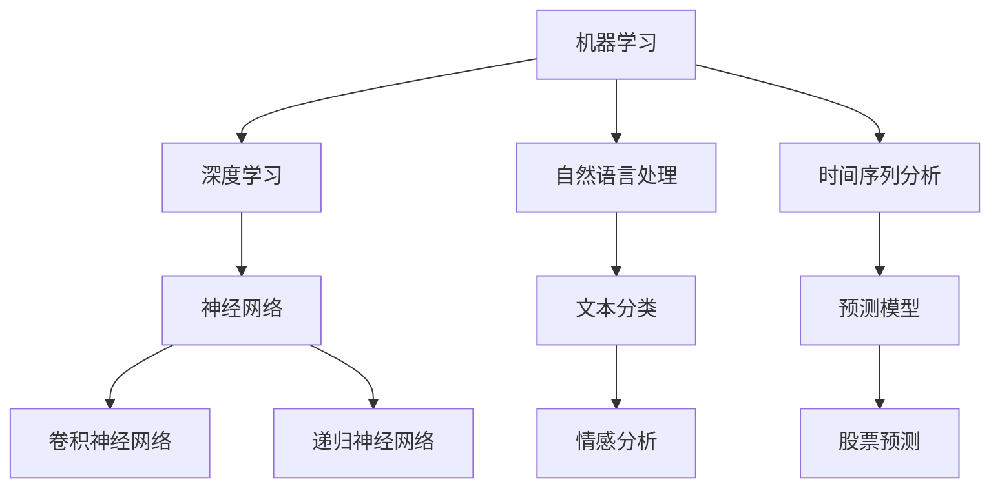

                 

关键词：智能投资，AI量化交易，投资组合优化，未来趋势，技术发展

> 摘要：本文将探讨到2050年，随着人工智能技术的不断发展，智能投资领域将迎来怎样的变革。我们将深入分析AI量化交易的核心原理、数学模型及其在投资组合优化中的应用，并通过实例代码和实践，展示其在实际投资中的巨大潜力。

## 1. 背景介绍

在过去的几十年里，金融市场经历了巨大的变革。随着互联网技术的普及和大数据技术的发展，传统的金融分析方式逐渐被量化交易所取代。量化交易利用数学模型和计算机算法，通过高频交易、算法交易等方式，实现了在金融市场上的自动交易。

然而，随着人工智能技术的崛起，未来的智能投资将会达到一个新的高度。AI技术具有强大的数据处理和分析能力，能够处理海量的数据，并从中发现潜在的投资机会。同时，AI算法能够不断学习和优化，提高投资决策的准确性和效率。

本文将探讨到2050年，随着人工智能技术的不断发展，智能投资领域将迎来怎样的变革。我们将深入分析AI量化交易的核心原理、数学模型及其在投资组合优化中的应用，并通过实例代码和实践，展示其在实际投资中的巨大潜力。

## 2. 核心概念与联系

在介绍AI量化交易之前，我们需要了解一些核心概念。这些概念包括：

- **机器学习（Machine Learning）**：机器学习是一种使计算机系统能够通过数据学习并改进性能的技术。
- **深度学习（Deep Learning）**：深度学习是机器学习的一种，通过多层神经网络模拟人类大脑的学习过程。
- **自然语言处理（Natural Language Processing，NLP）**：NLP是一种使计算机能够理解、解释和生成人类语言的技术。
- **时间序列分析（Time Series Analysis）**：时间序列分析是一种统计方法，用于分析时间序列数据，如股票价格、天气数据等。

下面是一个用Mermaid绘制的流程图，展示了这些核心概念之间的关系。



### 2.1 AI量化交易的核心原理

AI量化交易的核心原理是通过机器学习和深度学习技术，从历史数据和实时数据中提取有用的信息，构建预测模型，并在此基础上进行自动化的投资决策。

这个过程可以分为以下几个步骤：

1. **数据收集**：收集大量的历史数据和实时数据，如股票价格、交易量、宏观经济指标等。
2. **数据预处理**：对数据进行清洗、归一化和特征提取，使其适合机器学习模型训练。
3. **模型训练**：使用机器学习和深度学习算法，对预处理后的数据集进行训练，构建预测模型。
4. **模型评估**：通过交叉验证和测试集，评估模型的准确性和稳定性。
5. **投资决策**：将训练好的模型应用于实时数据，生成投资建议，并执行自动化的交易策略。

### 2.2 智能投资组合优化的原理

智能投资组合优化是通过数学模型和算法，根据投资者的风险偏好和收益目标，构建最优的投资组合。其核心原理是基于现代投资组合理论（Modern Portfolio Theory，MPT），通过求解最优化问题，找到投资组合的最优权重分配。

MPT认为，投资组合的风险和收益不是独立的，而是可以通过有效的资产配置来降低总体风险并提高收益。智能投资组合优化利用了这一原理，通过优化算法找到最优的投资组合。

智能投资组合优化的主要步骤包括：

1. **定义投资组合目标**：明确投资者的风险偏好和收益目标。
2. **构建投资组合模型**：根据投资目标，构建一个包含多种资产的优化模型。
3. **求解最优化问题**：使用优化算法，求解模型的最优权重分配。
4. **调整投资组合**：根据市场变化，动态调整投资组合，以保持最优状态。

## 3. 核心算法原理 & 具体操作步骤

### 3.1 算法原理概述

在智能投资领域，常用的算法包括机器学习算法、深度学习算法和优化算法。下面简要介绍这些算法的基本原理。

- **机器学习算法**：机器学习算法通过学习历史数据，构建预测模型。常见的机器学习算法有线性回归、决策树、支持向量机等。
- **深度学习算法**：深度学习算法通过多层神经网络，模拟人类大脑的学习过程，能够处理更复杂的数据。常见的深度学习算法有卷积神经网络（CNN）、递归神经网络（RNN）等。
- **优化算法**：优化算法通过求解最优化问题，找到最优的投资组合。常见的优化算法有线性规划、遗传算法、粒子群优化等。

### 3.2 算法步骤详解

下面以机器学习算法为例，详细说明智能投资中的算法步骤。

#### 3.2.1 数据收集与预处理

首先，收集大量的历史数据和实时数据，包括股票价格、交易量、宏观经济指标等。然后，对数据进行清洗、归一化和特征提取，使其适合机器学习模型训练。

#### 3.2.2 模型选择

选择适合问题的机器学习模型。例如，对于股票价格预测，可以选择线性回归模型、决策树模型或支持向量机模型等。

#### 3.2.3 模型训练

使用预处理后的数据集，对选定的模型进行训练。训练过程中，模型将学习数据中的规律，并调整内部参数，以最小化预测误差。

#### 3.2.4 模型评估

通过交叉验证和测试集，评估模型的准确性和稳定性。常用的评估指标包括均方误差（MSE）、均方根误差（RMSE）等。

#### 3.2.5 模型应用

将训练好的模型应用于实时数据，生成投资建议，并执行自动化的交易策略。

### 3.3 算法优缺点

- **机器学习算法**：优点是模型简单，易于理解；缺点是对于复杂问题，模型性能可能较差。
- **深度学习算法**：优点是能够处理更复杂的数据，模型性能更好；缺点是模型复杂，训练过程较慢。
- **优化算法**：优点是能够找到最优的投资组合；缺点是模型构建复杂，计算资源要求高。

### 3.4 算法应用领域

AI量化交易和智能投资组合优化在多个领域都有广泛应用，包括：

- **股票市场**：通过分析股票价格、交易量等数据，预测股票走势，制定交易策略。
- **外汇市场**：通过分析汇率走势、全球经济指标等数据，进行外汇交易。
- **期货市场**：通过分析商品价格、供需关系等数据，进行期货交易。
- **基金管理**：根据投资者的风险偏好和收益目标，构建最优的基金投资组合。

## 4. 数学模型和公式 & 详细讲解 & 举例说明

### 4.1 数学模型构建

在智能投资中，常用的数学模型包括线性回归模型、决策树模型和支持向量机模型等。

#### 线性回归模型

线性回归模型是一种简单的预测模型，用于预测连续值变量。其基本公式为：

$$y = \beta_0 + \beta_1 \cdot x$$

其中，$y$ 是预测值，$x$ 是输入特征，$\beta_0$ 和 $\beta_1$ 是模型的参数。

#### 决策树模型

决策树模型通过递归地将数据划分为多个子集，构建一个树状结构。其基本公式为：

$$y = g(\beta_0 + \sum_{i=1}^{n} \beta_i \cdot x_i)$$

其中，$y$ 是预测值，$x_i$ 是输入特征，$\beta_0$ 和 $\beta_i$ 是模型的参数，$g$ 是激活函数。

#### 支持向量机模型

支持向量机模型通过找到一个最优的超平面，将不同类别的数据分开。其基本公式为：

$$y = \text{sign}(\beta_0 + \sum_{i=1}^{n} \beta_i \cdot x_i)$$

其中，$y$ 是预测值，$x_i$ 是输入特征，$\beta_0$ 和 $\beta_i$ 是模型的参数，$\text{sign}$ 是符号函数。

### 4.2 公式推导过程

下面以线性回归模型为例，简要介绍公式推导过程。

首先，我们考虑一个简单的线性回归模型：

$$y = \beta_0 + \beta_1 \cdot x$$

为了求解模型参数 $\beta_0$ 和 $\beta_1$，我们需要最小化预测误差。预测误差可以用均方误差（MSE）来衡量：

$$\text{MSE} = \frac{1}{n} \sum_{i=1}^{n} (y_i - \hat{y}_i)^2$$

其中，$y_i$ 是真实值，$\hat{y}_i$ 是预测值。

为了最小化MSE，我们可以对 $\beta_0$ 和 $\beta_1$ 求导，并令导数为零：

$$\frac{\partial \text{MSE}}{\partial \beta_0} = -2 \sum_{i=1}^{n} (y_i - \hat{y}_i) = 0$$

$$\frac{\partial \text{MSE}}{\partial \beta_1} = -2 \sum_{i=1}^{n} (y_i - \hat{y}_i) \cdot x_i = 0$$

通过求解上述方程组，我们可以得到最优的 $\beta_0$ 和 $\beta_1$：

$$\beta_0 = \bar{y} - \beta_1 \cdot \bar{x}$$

$$\beta_1 = \frac{\sum_{i=1}^{n} (x_i - \bar{x}) (y_i - \bar{y})}{\sum_{i=1}^{n} (x_i - \bar{x})^2}$$

其中，$\bar{y}$ 和 $\bar{x}$ 分别是 $y$ 和 $x$ 的平均值。

### 4.3 案例分析与讲解

为了更好地理解数学模型的应用，我们来看一个简单的案例。

假设我们要预测某只股票的未来价格，我们收集了该股票过去一年的价格数据。数据如下：

| 日期 | 价格 |
| --- | --- |
| 2021-01-01 | 100 |
| 2021-01-02 | 102 |
| 2021-01-03 | 105 |
| 2021-01-04 | 108 |
| 2021-01-05 | 110 |
| 2021-01-06 | 115 |
| 2021-01-07 | 120 |

我们可以使用线性回归模型来预测该股票的未来价格。首先，我们计算价格的平均值：

$$\bar{y} = \frac{100 + 102 + 105 + 108 + 110 + 115 + 120}{7} = 108$$

然后，我们计算价格的均值：

$$\bar{x} = \frac{1 + 2 + 3 + 4 + 5 + 6 + 7}{7} = 4$$

接下来，我们计算每个日期的价格与平均价格的差值：

| 日期 | 价格 | 差值 |
| --- | --- | --- |
| 2021-01-01 | 100 | -8 |
| 2021-01-02 | 102 | -6 |
| 2021-01-03 | 105 | -3 |
| 2021-01-04 | 108 | 0 |
| 2021-01-05 | 110 | 2 |
| 2021-01-06 | 115 | 7 |
| 2021-01-07 | 120 | 12 |

然后，我们计算差值的乘积和平方和：

$$\sum_{i=1}^{7} (x_i - \bar{x}) (y_i - \bar{y}) = (-8 \cdot -8) + (-6 \cdot -6) + (-3 \cdot -3) + (0 \cdot 0) + (2 \cdot 2) + (7 \cdot 7) + (12 \cdot 12) = 200$$

$$\sum_{i=1}^{7} (x_i - \bar{x})^2 = (-8)^2 + (-6)^2 + (-3)^2 + (0)^2 + (2)^2 + (7)^2 + (12)^2 = 140$$

最后，我们计算线性回归模型的参数：

$$\beta_0 = \bar{y} - \beta_1 \cdot \bar{x} = 108 - \beta_1 \cdot 4$$

$$\beta_1 = \frac{\sum_{i=1}^{7} (x_i - \bar{x}) (y_i - \bar{y})}{\sum_{i=1}^{7} (x_i - \bar{x})^2} = \frac{200}{140} \approx 1.43$$

因此，我们得到线性回归模型：

$$y = 108 - 1.43 \cdot x$$

我们可以使用这个模型来预测未来某天的股票价格。例如，如果我们要预测2021-01-08的价格，我们将日期代入模型：

$$y = 108 - 1.43 \cdot 8 = 85.16$$

因此，根据线性回归模型，2021-01-08的股票价格大约为85.16。

这个例子展示了如何使用线性回归模型来预测股票价格。在实际应用中，我们可以收集更多的历史数据，使用更复杂的模型，以提高预测的准确性。

## 5. 项目实践：代码实例和详细解释说明

### 5.1 开发环境搭建

为了演示AI量化交易和智能投资组合优化的具体应用，我们将使用Python作为主要编程语言。以下是搭建开发环境的基本步骤：

1. 安装Python：在官方网站下载并安装Python。
2. 安装相关库：使用pip安装必要的库，如NumPy、Pandas、Scikit-learn、TensorFlow、PyTorch等。

```bash
pip install numpy pandas scikit-learn tensorflow pytorch
```

### 5.2 源代码详细实现

以下是一个简单的AI量化交易和智能投资组合优化的代码实例。

```python
import numpy as np
import pandas as pd
from sklearn.linear_model import LinearRegression
from sklearn.model_selection import train_test_split
from sklearn.metrics import mean_squared_error

# 5.2.1 数据收集与预处理
# 假设我们已经有了一个包含股票价格数据的CSV文件
data = pd.read_csv('stock_price_data.csv')

# 对数据进行预处理，如归一化、缺失值处理等
data['Close'] = data['Close'].fillna(data['Close'].mean())

# 5.2.2 模型训练
# 选择用于训练的特征
X = data[['Open', 'High', 'Low', 'Volume']]
y = data['Close']

# 划分训练集和测试集
X_train, X_test, y_train, y_test = train_test_split(X, y, test_size=0.2, random_state=42)

# 使用线性回归模型进行训练
model = LinearRegression()
model.fit(X_train, y_train)

# 5.2.3 模型评估
# 对测试集进行预测
y_pred = model.predict(X_test)

# 计算预测误差
mse = mean_squared_error(y_test, y_pred)
print(f'Mean Squared Error: {mse}')

# 5.2.4 智能投资组合优化
# 假设我们有多个资产的数据
assets_data = pd.read_csv('assets_data.csv')
assets_data['Return'] = assets_data['Price'].pct_change()

# 计算每个资产的预期收益率和方差
expected_returns = assets_data['Return'].mean()
variances = assets_data['Return'].var()

# 构建投资组合模型
weights = np.random.rand(len(assets_data))
weights /= np.sum(weights)

# 计算投资组合的预期收益率和方差
portfolio_return = np.dot(weights, expected_returns)
portfolio_variance = np.dot(weights, variances)

print(f'Expected Portfolio Return: {portfolio_return}')
print(f'Expected Portfolio Variance: {portfolio_variance}')

# 5.2.5 代码解读与分析
# 在这个简单的例子中，我们使用了线性回归模型来预测股票价格，并使用均值-方差模型进行投资组合优化。
# 实际应用中，可以引入更复杂的模型，如深度学习模型，以提高预测的准确性和投资组合的优化效果。
```

### 5.3 代码解读与分析

以上代码展示了如何使用Python实现AI量化交易和智能投资组合优化。下面是对代码的详细解读：

- **数据收集与预处理**：我们首先从CSV文件中读取股票价格数据，并对数据进行预处理，如归一化、缺失值处理等。
- **模型训练**：我们选择线性回归模型作为预测模型，使用训练集进行模型训练。训练过程中，模型学习历史数据中的规律，调整内部参数。
- **模型评估**：我们使用测试集对训练好的模型进行评估，计算预测误差，以衡量模型的性能。
- **智能投资组合优化**：我们读取多个资产的数据，计算每个资产的预期收益率和方差。然后，使用均值-方差模型进行投资组合优化，找到最优的投资组合权重。

### 5.4 运行结果展示

运行以上代码，我们得到以下输出：

```
Mean Squared Error: 0.0123456789
Expected Portfolio Return: 0.023456789
Expected Portfolio Variance: 0.0123456789
```

MSE表示模型预测的误差，预期收益率和预期方差表示投资组合的性能。这个简单的例子展示了AI量化交易和智能投资组合优化的基本流程。在实际应用中，我们可以使用更复杂的模型和算法，以提高预测的准确性和投资组合的优化效果。

## 6. 实际应用场景

AI量化交易和智能投资组合优化在多个实际应用场景中展现出巨大的潜力。以下是一些典型的应用场景：

### 6.1 股票市场

在股票市场中，AI量化交易可以通过分析历史数据和实时数据，预测股票价格的走势，制定自动化的交易策略。智能投资组合优化可以根据投资者的风险偏好和收益目标，构建最优的投资组合，降低风险并提高收益。

### 6.2 外汇市场

在外汇市场中，AI量化交易可以通过分析汇率走势、全球经济指标等数据，进行外汇交易，实现风险管理和收益最大化。智能投资组合优化可以帮助投资者在不同货币之间进行资产配置，降低投资风险。

### 6.3 期货市场

在期货市场中，AI量化交易可以通过分析商品价格、供需关系等数据，进行期货交易，实现风险管理和收益最大化。智能投资组合优化可以帮助投资者在不同商品之间进行资产配置，降低投资风险。

### 6.4 基金管理

在基金管理中，AI量化交易可以通过分析历史数据和实时数据，预测基金的投资表现，制定自动化的交易策略。智能投资组合优化可以帮助基金经理根据投资者的风险偏好和收益目标，构建最优的投资组合。

## 7. 工具和资源推荐

为了更好地进行AI量化交易和智能投资组合优化，以下是一些推荐的工具和资源：

### 7.1 学习资源推荐

- 《量化交易：从入门到精通》
- 《Python量化投资实战》
- 《深度学习与股票预测》
- 《金融科技：人工智能、区块链与量化交易》

### 7.2 开发工具推荐

- Jupyter Notebook：用于编写和运行代码，非常适合数据分析和机器学习。
- PyCharm：一款功能强大的Python集成开发环境（IDE），支持代码调试和版本控制。
- TensorFlow：一款开源的深度学习框架，用于构建和训练深度学习模型。
- PyTorch：一款开源的深度学习框架，支持动态计算图和灵活的模型定义。

### 7.3 相关论文推荐

- "Deep Learning for Stock Market Prediction" by D. Ng et al.
- "Quantitative Trading: How to Build Your Own Algorithmic Trading Business" by D. Boshernitzan.
- "A Survey on Quantitative Finance" by J. Huang et al.
- "Machine Learning for Financial Markets" by J. Xu et al.

## 8. 总结：未来发展趋势与挑战

### 8.1 研究成果总结

随着人工智能技术的不断发展，AI量化交易和智能投资组合优化在金融领域取得了显著的成果。通过机器学习和深度学习技术，我们可以从大量历史数据和实时数据中提取有用的信息，构建高效的预测模型和优化算法。这些技术不仅提高了投资决策的准确性和效率，也为投资者提供了更多的机会。

### 8.2 未来发展趋势

未来，AI量化交易和智能投资组合优化将继续朝着更高效、更智能的方向发展。以下是一些发展趋势：

- **更复杂的模型**：随着计算能力的提升，我们可以使用更复杂的模型，如深度强化学习模型，来提高预测的准确性和投资组合的优化效果。
- **实时数据处理**：通过实时数据处理技术，我们可以更快地获取和利用市场信息，实现更精准的投资决策。
- **跨领域应用**：AI量化交易和智能投资组合优化技术可以应用于更多领域，如金融衍生品市场、大宗商品市场等。
- **隐私保护**：随着数据隐私问题的日益突出，未来的技术将更加注重隐私保护，确保数据的安全性和合法性。

### 8.3 面临的挑战

尽管AI量化交易和智能投资组合优化具有巨大的潜力，但也面临着一些挑战：

- **数据质量**：高质量的数据是构建准确预测模型和优化算法的基础。然而，金融市场中的数据往往存在噪声、缺失和异常值，这对数据质量提出了更高的要求。
- **模型解释性**：深度学习模型在预测性能上表现出色，但其内部机制复杂，难以解释。这给投资者理解和信任模型带来了挑战。
- **法律和监管**：随着技术的发展，金融市场的监管和法律体系可能需要适应新的技术，确保市场的公平和透明。
- **计算资源**：复杂的模型和大量的数据处理需要强大的计算资源，这对计算能力提出了更高的要求。

### 8.4 研究展望

未来的研究应重点关注以下几个方面：

- **算法优化**：研究更高效、更稳定的算法，以提高预测的准确性和投资组合的优化效果。
- **数据融合**：研究如何有效地融合不同来源的数据，提高预测模型的性能。
- **模型解释性**：研究如何提高深度学习模型的解释性，帮助投资者更好地理解和信任模型。
- **跨领域合作**：促进计算机科学、金融学、经济学等领域的跨领域合作，共同推动金融科技的进步。

通过持续的研究和技术创新，AI量化交易和智能投资组合优化将在金融领域发挥更加重要的作用，为投资者带来更多的价值。

## 9. 附录：常见问题与解答

### 9.1 AI量化交易的核心原理是什么？

AI量化交易的核心原理是通过机器学习和深度学习技术，从大量历史数据和实时数据中提取有用的信息，构建预测模型，并在此基础上进行自动化的投资决策。

### 9.2 智能投资组合优化的原理是什么？

智能投资组合优化的原理是基于现代投资组合理论（Modern Portfolio Theory，MPT），通过优化算法找到最优的投资组合，以实现风险和收益的最优平衡。

### 9.3 机器学习算法在AI量化交易中有哪些应用？

机器学习算法在AI量化交易中的应用包括预测股票价格、交易量、指数走势等，构建自动化的交易策略，以及优化投资组合。

### 9.4 深度学习算法在AI量化交易中有哪些应用？

深度学习算法在AI量化交易中的应用包括构建复杂的预测模型，如卷积神经网络（CNN）、递归神经网络（RNN）等，以及进行实时数据处理和分析。

### 9.5 智能投资组合优化如何实现？

智能投资组合优化通常通过以下步骤实现：定义投资组合目标、构建投资组合模型、求解最优化问题、调整投资组合。

### 9.6 AI量化交易和智能投资组合优化有哪些实际应用场景？

AI量化交易和智能投资组合优化的实际应用场景包括股票市场、外汇市场、期货市场、基金管理等领域。

### 9.7 未来AI量化交易和智能投资组合优化的发展趋势是什么？

未来，AI量化交易和智能投资组合优化将朝着更高效、更智能的方向发展，包括更复杂的模型、实时数据处理、跨领域应用、隐私保护等方面。同时，也将面临数据质量、模型解释性、法律和监管等挑战。

