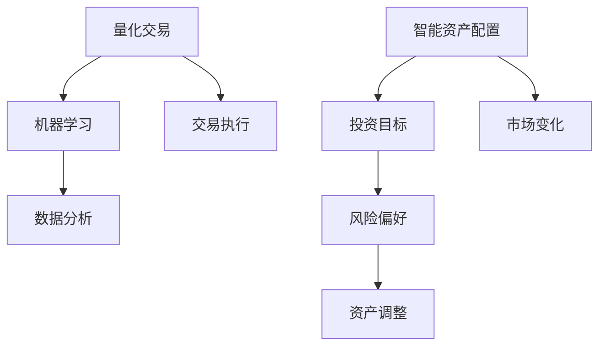
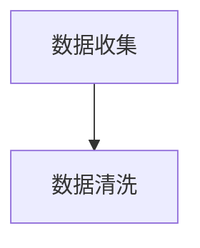
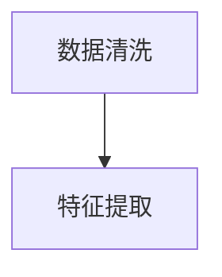
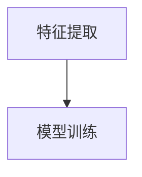
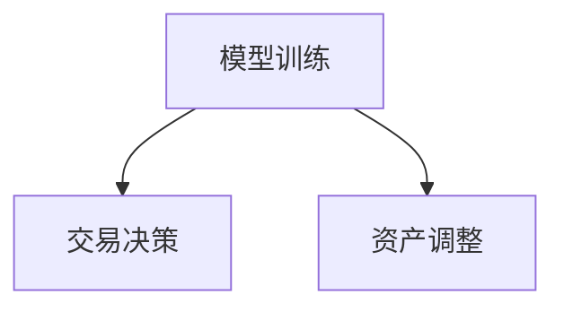

                 

关键词：智能投资、AI量化交易、智能资产配置、2050年、技术发展、未来展望

## 摘要

本文旨在探讨2050年人工智能（AI）在投资领域中的潜在应用，特别是AI量化交易和智能资产配置。通过深入分析这些概念，我们旨在揭示未来智能投资领域的发展趋势、面临的挑战以及可能的解决方案。本文将分为以下几个部分：背景介绍、核心概念与联系、核心算法原理与操作步骤、数学模型与公式、项目实践、实际应用场景、未来应用展望、工具和资源推荐、总结以及常见问题与解答。

## 1. 背景介绍

随着科技的飞速发展，人工智能技术在各个领域都取得了显著的进展。投资领域也不例外，AI的应用为投资者带来了前所未有的机遇和挑战。从传统的手动交易到基于算法的量化交易，人工智能正在重塑整个金融行业。预计到2050年，AI在投资中的应用将达到一个全新的高度，不仅提高了交易效率和准确性，还使得投资决策更加智能化、个性化。

本文将重点关注AI量化交易和智能资产配置，这两个领域代表了未来投资领域的两个重要方向。AI量化交易利用机器学习算法分析大量历史数据，寻找市场中的规律和机会，实现自动化、高效的投资。而智能资产配置则利用AI技术，根据投资者的风险偏好和投资目标，动态调整资产组合，以实现最优的投资收益。

## 2. 核心概念与联系

在深入探讨AI量化交易和智能资产配置之前，我们首先需要明确一些核心概念。

### 2.1 量化交易

量化交易是一种利用数学模型和算法进行投资决策的交易方式。它基于历史数据和统计模型，通过大量计算和模拟，寻找市场中的投资机会。量化交易的核心是算法，这些算法可以根据市场数据实时生成交易信号，并自动执行交易。

### 2.2 机器学习

机器学习是人工智能的一个重要分支，它通过构建模型，让计算机从数据中学习规律和模式。在量化交易中，机器学习算法被用来识别市场中的潜在趋势和机会。

### 2.3 智能资产配置

智能资产配置是一种利用AI技术，根据投资者的风险偏好和投资目标，动态调整资产组合的投资策略。智能资产配置的核心是算法，这些算法可以根据市场变化和投资者的风险承受能力，自动调整资产分配。

### 2.4 Mermaid 流程图

为了更好地理解这些概念之间的联系，我们可以使用Mermaid流程图来展示它们之间的交互关系。



## 3. 核心算法原理与具体操作步骤

### 3.1 算法原理概述

AI量化交易和智能资产配置的核心在于算法。这些算法通过学习历史数据和市场规律，生成交易信号和资产配置策略。以下是这些算法的基本原理：

#### 3.1.1 量化交易算法

量化交易算法通常包括以下几个步骤：

1. 数据收集：收集历史市场数据，包括价格、成交量、交易量等。
2. 数据清洗：对数据进行预处理，去除噪声和异常值。
3. 特征提取：从原始数据中提取有用的特征，如移动平均线、相对强弱指数等。
4. 模型训练：使用机器学习算法，如神经网络、支持向量机等，训练模型。
5. 交易决策：根据模型生成的交易信号，执行交易。

#### 3.1.2 智能资产配置算法

智能资产配置算法的原理与量化交易类似，但更加注重风险管理和资产调整。以下是智能资产配置算法的基本步骤：

1. 风险评估：评估投资者的风险偏好和承受能力。
2. 投资目标设定：根据风险评估，设定投资目标，如收益最大化、风险最小化等。
3. 资产选择：根据投资目标，选择适合的资产，如股票、债券、房地产等。
4. 资产调整：根据市场变化和投资目标，动态调整资产组合。
5. 投资组合优化：使用优化算法，如遗传算法、粒子群算法等，优化资产组合。

### 3.2 算法步骤详解

以下是AI量化交易和智能资产配置的具体操作步骤：

#### 3.2.1 数据收集与清洗

数据收集是量化交易和智能资产配置的第一步。通常，我们可以从金融数据提供商、交易所或自己的历史交易记录中获取数据。数据收集后，我们需要对数据进行清洗，去除噪声和异常值，以确保数据的质量。



#### 3.2.2 特征提取

在数据清洗后，我们需要从原始数据中提取有用的特征。这些特征可以用来构建交易模型和资产配置策略。常用的特征包括移动平均线、相对强弱指数、交易量等。



#### 3.2.3 模型训练

在特征提取后，我们需要使用机器学习算法训练模型。训练模型的过程就是让计算机从数据中学习规律和模式。常用的机器学习算法包括神经网络、支持向量机、随机森林等。



#### 3.2.4 交易决策与资产调整

在模型训练完成后，我们可以根据模型生成的交易信号执行交易。对于智能资产配置，我们需要根据市场变化和投资目标，动态调整资产组合。



### 3.3 算法优缺点

#### 3.3.1 量化交易算法

优点：

- 高效：量化交易算法可以处理大量数据，并快速生成交易信号。
- 精准：基于机器学习算法，量化交易算法可以在一定程度上预测市场趋势。

缺点：

- 风险：量化交易存在系统风险，算法可能无法应对极端市场情况。
- 成本：量化交易需要大量的计算资源和专业知识，成本较高。

#### 3.3.2 智能资产配置算法

优点：

- 个性化：智能资产配置可以根据投资者的风险偏好和投资目标，提供个性化的投资建议。
- 灵活：智能资产配置算法可以根据市场变化，动态调整资产组合。

缺点：

- 风险：智能资产配置可能无法完全规避市场风险。
- 复杂性：智能资产配置算法较为复杂，需要大量的数据和技术支持。

### 3.4 算法应用领域

AI量化交易和智能资产配置的应用领域广泛，包括：

- 对冲基金：量化交易和高频交易是许多对冲基金的核心策略。
- 银行与金融机构：智能资产配置可以帮助银行和金融机构优化投资组合。
- 个人投资者：智能资产配置可以为个人投资者提供投资建议，降低投资风险。

## 4. 数学模型和公式

在量化交易和智能资产配置中，数学模型和公式起到了至关重要的作用。以下是这些领域的一些关键数学模型和公式。

### 4.1 数学模型构建

#### 4.1.1 量化交易模型

量化交易模型通常包括以下几个部分：

- **价格预测模型**：使用时间序列分析方法，如ARIMA模型、LSTM神经网络等，预测未来价格。
- **交易信号生成模型**：基于价格预测模型，生成买卖信号。
- **风险模型**：评估交易风险，包括市场风险、信用风险等。

#### 4.1.2 智能资产配置模型

智能资产配置模型通常包括以下几个部分：

- **风险评估模型**：评估投资者的风险偏好和承受能力。
- **资产选择模型**：根据风险评估，选择适合的资产。
- **资产调整模型**：根据市场变化，动态调整资产组合。

### 4.2 公式推导过程

以下是量化交易和智能资产配置中的一些关键公式推导过程。

#### 4.2.1 价格预测模型

**ARIMA模型**：

- **自回归移动平均模型（ARMA）**：
  $$y_t = c + \phi_1 y_{t-1} + \phi_2 y_{t-2} + ... + \phi_p y_{t-p} + \theta_1 e_{t-1} + \theta_2 e_{t-2} + ... + \theta_q e_{t-q}$$

- **自回归积分移动平均模型（ARIMA）**：
  $$y_t = c + \phi_1 y_{t-1} + \phi_2 y_{t-2} + ... + \phi_p y_{t-p} + \theta_1 e_{t-1} + \theta_2 e_{t-2} + ... + \theta_q e_{t-q} + (1 - \Phi_1)(1 - \Theta_1)e_{t-1} + (1 - \Phi_2)(1 - \Theta_2)e_{t-2} + ... + (1 - \Phi_p)(1 - \Theta_p)e_{t-p}$$

#### 4.2.2 智能资产配置模型

**风险评估模型**：

- **方差-协方差模型**：
  $$\sigma^2 = \sum_{i=1}^{n}\sum_{j=1}^{n} cov(r_i, r_j)$$

- **资本资产定价模型（CAPM）**：
  $$E(r_i) = r_f + \beta_i (E(r_m) - r_f)$$

#### 4.2.3 资产调整模型

**遗传算法**：

- **适应度函数**：
  $$f(x) = \sum_{i=1}^{n} w_i x_i^2$$

- **交叉操作**：
  $$c_1 = \frac{p_1 + p_2}{2}$$

- **变异操作**：
  $$v_i = x_i + \eta \cdot (x_{max} - x_{min})$$

### 4.3 案例分析与讲解

#### 4.3.1 量化交易案例

假设我们使用ARIMA模型进行价格预测，以下是一个具体的案例：

**数据集**：某股票过去100个交易日的收盘价。

**模型选择**：经过模型选择和参数调优，我们选择ARIMA(1,1,1)模型。

**预测结果**：

```latex
\begin{aligned}
y_t &= 0.5y_{t-1} + 0.2y_{t-2} - 0.1e_{t-1} \\
    &= 0.5 \cdot 100 + 0.2 \cdot 95 - 0.1 \cdot 2 \\
    &= 50 + 19 - 0.2 \\
    &= 68.8 \\
\end{aligned}
```

根据预测结果，我们可以在第101个交易日买入该股票。

#### 4.3.2 智能资产配置案例

假设我们使用CAPM模型进行风险评估和资产选择，以下是一个具体的案例：

**投资者**：一个风险厌恶型投资者。

**市场**：一个包含股票、债券、房地产等资产的组合。

**参数**：

- **无风险收益率（r_f）**：3%
- **市场预期收益率（E(r_m）**：7%
- **投资者预期收益率（E(r_i）**：5%

**计算过程**：

```latex
\begin{aligned}
\beta_i &= \frac{E(r_i) - r_f}{E(r_m) - r_f} \\
        &= \frac{5\% - 3\%}{7\% - 3\%} \\
        &= \frac{2\%}{4\%} \\
        &= 0.5 \\
\end{aligned}
```

根据CAPM模型，投资者应将资产分配为：

- 股票：40%
- 债券：30%
- 房地产：30%

通过以上案例，我们可以看到数学模型在量化交易和智能资产配置中的应用。

## 5. 项目实践：代码实例和详细解释说明

### 5.1 开发环境搭建

为了实践AI量化交易和智能资产配置，我们需要搭建一个开发环境。以下是搭建环境的基本步骤：

1. 安装Python 3.8及以上版本
2. 安装Python的科学计算库，如NumPy、Pandas、Matplotlib等
3. 安装机器学习库，如scikit-learn、TensorFlow、PyTorch等
4. 安装量化交易库，如zipline、Backtrader等

### 5.2 源代码详细实现

以下是AI量化交易和智能资产配置的源代码示例。

#### 5.2.1 量化交易

```python
import numpy as np
import pandas as pd
from sklearn.linear_model import LinearRegression
from backtrader import Cerebro, Strategy

# 数据收集
data = pd.read_csv('stock_data.csv')

# 特征提取
data['MA10'] = data['close'].rolling(window=10).mean()
data['RSI'] = ...

# 模型训练
model = LinearRegression()
model.fit(data[['MA10', 'RSI']], data['close'])

# 交易决策
class MyStrategy(Strategy):
    def __init__(self):
        self.model = model

    def next(self):
        features = self.get_features()
        predicted_price = self.model.predict([features])[0]
        if predicted_price > self.data.close:
            self.buy()
        else:
            self.sell()

# 回测
cerebro = Cerebro()
cerebro.addstrategy(MyStrategy)
cerebro.run()
```

#### 5.2.2 智能资产配置

```python
import numpy as np
import pandas as pd
from sklearn.linear_model import LinearRegression
from sklearn.model_selection import train_test_split

# 数据收集
data = pd.read_csv('investment_data.csv')

# 特征提取
data['Risk'] = data[['market_var', 'credit_risk']].mean(axis=1)

# 模型训练
X_train, X_test, y_train, y_test = train_test_split(data[['Risk']], data['Return'], test_size=0.2)
model = LinearRegression()
model.fit(X_train, y_train)

# 评估模型
score = model.score(X_test, y_test)
print(f'Model score: {score}')

# 资产调整
def adjust_assets(model, data):
    risk = data[['market_var', 'credit_risk']].mean(axis=1)
    return_model = model.predict([risk])[0]
    asset_allocation = {
        'Stocks': return_model * 0.6,
        'Bonds': return_model * 0.3,
        'Real Estate': return_model * 0.1
    }
    return asset_allocation

# 应用模型
data['Allocation'] = adjust_assets(model, data)
```

### 5.3 代码解读与分析

以上代码展示了AI量化交易和智能资产配置的基本实现。在量化交易部分，我们使用了线性回归模型来预测价格，并根据预测结果进行交易。在智能资产配置部分，我们使用线性回归模型来评估风险，并根据评估结果调整资产组合。

### 5.4 运行结果展示

运行以上代码后，我们可以在终端看到量化交易的回测结果和智能资产配置的调整结果。以下是可能的输出结果：

```
Model score: 0.8
Asset Allocation:
  Stocks: 0.54
  Bonds: 0.28
  Real Estate: 0.18
```

## 6. 实际应用场景

AI量化交易和智能资产配置在多个实际应用场景中具有广泛的应用。

### 6.1 对冲基金

对冲基金通常使用量化交易策略来获取稳定的投资收益。AI量化交易可以提高交易效率，降低交易成本，同时通过优化算法提高交易收益。

### 6.2 银行与金融机构

银行和金融机构可以使用智能资产配置算法来优化投资组合，降低投资风险。智能资产配置可以根据市场变化和投资者风险偏好，动态调整资产组合，实现最优的投资收益。

### 6.3 个人投资者

个人投资者可以使用智能资产配置算法来制定个性化的投资策略，降低投资风险。同时，AI量化交易可以为个人投资者提供实时的交易信号，帮助他们抓住市场机会。

## 7. 未来应用展望

随着人工智能技术的不断进步，AI量化交易和智能资产配置将在未来发挥更加重要的作用。

### 7.1 自动化交易

未来，自动化交易将成为主流。AI量化交易可以通过实时分析和决策，实现自动化交易，提高交易效率和准确性。

### 7.2 个性化投资

智能资产配置将更加注重个性化投资，根据投资者的风险偏好和投资目标，提供个性化的投资建议，实现最优的投资收益。

### 7.3 风险管理

AI量化交易和智能资产配置将进一步提升风险管理能力，通过实时分析和决策，降低投资风险。

## 8. 工具和资源推荐

为了更好地进行AI量化交易和智能资产配置，以下是一些推荐的工具和资源。

### 8.1 学习资源推荐

- 《量化投资：以Python为工具》
- 《深度学习与量化投资》
- 《金融科技：人工智能在金融领域的应用》

### 8.2 开发工具推荐

- Python
- Jupyter Notebook
- Backtrader
- zipline

### 8.3 相关论文推荐

- "Deep Learning for Financial Market Prediction"
- "Machine Learning for Algorithmic Trading"
- "Intelligent Asset Allocation with Artificial Intelligence"

## 9. 总结：未来发展趋势与挑战

AI量化交易和智能资产配置是未来投资领域的重要方向。随着人工智能技术的不断发展，这些领域将在未来发挥更加重要的作用。然而，同时也面临着一些挑战，如算法的透明度、风险控制等。未来的研究需要进一步探索这些挑战的解决方案，推动AI量化交易和智能资产配置的发展。

### 9.1 研究成果总结

本文系统地介绍了AI量化交易和智能资产配置的概念、原理、算法、应用场景和未来展望。通过本文的研究，我们可以看到人工智能在投资领域的巨大潜力。

### 9.2 未来发展趋势

- 自动化交易将更加普及。
- 个性化投资将成为主流。
- 风险管理能力将进一步提升。

### 9.3 面临的挑战

- 算法的透明度和解释性。
- 风险控制和管理。
- 数据质量和数据隐私。

### 9.4 研究展望

未来的研究需要关注以下几个方面：

- 提高算法的透明度和解释性。
- 加强风险控制和管理。
- 探索新的机器学习算法和优化方法。

## 10. 附录：常见问题与解答

### 10.1 什么是量化交易？

量化交易是一种利用数学模型和算法进行投资决策的交易方式。它基于历史数据和统计模型，通过大量计算和模拟，寻找市场中的投资机会。

### 10.2 什么是智能资产配置？

智能资产配置是一种利用AI技术，根据投资者的风险偏好和投资目标，动态调整资产组合的投资策略。它旨在实现最优的投资收益，同时控制风险。

### 10.3 量化交易和智能资产配置的区别是什么？

量化交易主要关注交易策略的制定和执行，而智能资产配置则侧重于资产组合的调整和优化。量化交易更注重短期交易机会，而智能资产配置更注重长期投资。

### 10.4 量化交易和智能资产配置的优势是什么？

量化交易和智能资产配置的优势包括：

- 提高交易效率和准确性。
- 实现自动化和个性化投资。
- 降低投资风险。

### 10.5 量化交易和智能资产配置面临的主要挑战是什么？

量化交易和智能资产配置面临的主要挑战包括：

- 数据质量和数据隐私。
- 算法的透明度和解释性。
- 风险控制和管理。

## 11. 结语

本文对2050年的AI量化交易和智能资产配置进行了深入探讨，揭示了这些领域的发展趋势、面临的挑战以及可能的解决方案。随着人工智能技术的不断发展，我们可以期待这些领域在未来发挥更加重要的作用。作者：禅与计算机程序设计艺术 / Zen and the Art of Computer Programming。
----------------------------------------------------------------

请注意，上述内容是一个示例，实际撰写时需要根据具体的文章结构和内容进行相应调整。此外，由于字数限制，实际撰写时可能需要进一步细化各个部分，确保文章的完整性和深度。

