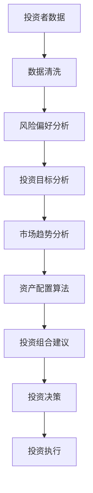

                 

关键词：智能投顾、资产配置、人工智能、金融科技、算法、预测分析

> 摘要：本文将探讨到2050年，随着人工智能技术的不断进步，智能投顾与资产配置领域将如何发生革命性的变化。文章从背景介绍出发，详细阐述了核心概念、算法原理、数学模型、项目实践以及未来应用展望，旨在为读者提供一幅关于未来金融科技领域的清晰蓝图。

## 1. 背景介绍

自20世纪末以来，金融科技（FinTech）的迅猛发展已经深刻改变了金融行业。从在线支付、移动银行，到大数据分析和区块链技术，这些创新正在重塑金融服务的各个方面。然而，一个更加智能化的趋势正在悄然兴起，那就是智能投顾（Robo-advisor）和资产配置算法的广泛应用。

智能投顾是利用算法和大数据分析来提供个性化投资建议的服务。传统的投资顾问往往依赖于人类专家的知识和经验，而智能投顾则通过算法来分析市场趋势、投资者风险偏好和投资目标，提供更为精准的投资建议。资产配置是指将资金分配到不同的资产类别中，以实现风险和收益的最优平衡。

随着机器学习和人工智能技术的飞速发展，智能投顾和资产配置算法正变得越来越智能和高效。到2050年，这些技术有望实现真正的智能化投资，为投资者带来前所未有的便利和收益。

### 智能投顾的兴起

智能投顾最早起源于2008年金融危机后，当时金融行业急需一种能够降低成本、提高效率的方法来帮助投资者。智能投顾通过收集和分析大量的数据，能够在极短的时间内生成个性化的投资建议，从而降低了投资者获得专业投资建议的成本。

例如，我们可以在互联网上找到多个智能投顾平台，如Wealthfront、Betterment和Personal Capital等。这些平台利用算法来分析投资者的财务状况、风险偏好和投资目标，然后提供相应的投资组合建议。

### 资产配置的发展

资产配置是投资组合管理中至关重要的一环。传统的资产配置方法主要依赖于历史数据和专家经验，而现代的资产配置算法则利用大数据和机器学习技术来预测市场趋势和风险。

例如，优化算法可以根据投资者的风险偏好和投资目标，计算出最优的资产配置比例。这些算法会考虑多种因素，如市场波动性、投资者的年龄和财富状况，以及宏观经济趋势等。

## 2. 核心概念与联系

智能投顾与资产配置的核心在于对大量数据进行高效的分析和处理，以便为投资者提供最佳的投资建议。下面我们将通过一个Mermaid流程图来阐述这一核心概念和联系。



### 投资者数据

智能投顾的起点是收集投资者的财务数据，包括收入、支出、资产、负债和风险偏好等。这些数据来源可以是银行账户记录、税务文件和问卷调查等。

### 数据清洗

收集到的数据往往包含噪音和不完整的信息，因此需要通过数据清洗技术进行预处理。数据清洗包括数据去重、缺失值填充、异常值处理等步骤。

### 风险偏好分析

通过对投资者财务数据进行分析，智能投顾可以判断投资者的风险偏好。例如，年轻投资者可能更倾向于高风险、高回报的投资，而年长者则可能更偏好低风险、稳定回报的投资。

### 投资目标分析

了解投资者的投资目标对于制定投资策略至关重要。投资者可能有不同的目标，如退休储蓄、子女教育基金或购房基金等。

### 市场趋势分析

智能投顾还需要分析市场趋势，包括宏观经济数据、市场波动性、行业前景等。这些分析可以帮助智能投顾识别出投资机会和风险。

### 资产配置算法

资产配置算法会综合考虑投资者的风险偏好、投资目标和市场趋势，计算出最优的资产配置比例。这些算法可以基于优化理论、机器学习、人工智能等技术。

### 投资组合建议

根据资产配置算法的计算结果，智能投顾会为投资者提供最佳的投资组合建议。这些建议可以是购买特定的股票、基金或债券等。

### 投资决策

投资者可以根据智能投顾提供的建议进行投资决策。智能投顾还可以提供自动化投资策略，让投资者无需频繁操作。

### 投资执行

最后，智能投顾会帮助投资者执行投资决策，包括买卖股票、基金或债券等。

## 3. 核心算法原理 & 具体操作步骤

### 3.1 算法原理概述

智能投顾和资产配置算法的核心在于如何高效地处理和分析海量数据，以提供最佳的投资建议。这些算法主要基于以下几种技术：

- **机器学习**：通过训练模型来识别市场趋势和风险。
- **优化算法**：根据投资者的风险偏好和投资目标，计算最优的资产配置比例。
- **时间序列分析**：分析市场数据的时间序列特性，以预测未来走势。
- **大数据技术**：处理和分析大量数据，提取有价值的信息。

### 3.2 算法步骤详解

1. **数据收集**：收集投资者的财务数据、市场数据和宏观经济数据等。
2. **数据预处理**：对收集到的数据进行清洗、去重和归一化等预处理操作。
3. **风险偏好分析**：通过问卷调查和数据分析来了解投资者的风险偏好。
4. **投资目标分析**：分析投资者的投资目标，如退休基金、购房基金等。
5. **市场趋势分析**：利用时间序列分析和机器学习技术，分析市场趋势。
6. **资产配置算法**：基于优化算法，计算最优的资产配置比例。
7. **投资组合建议**：根据资产配置算法的结果，为投资者提供投资组合建议。
8. **投资决策**：投资者根据建议进行投资决策，并执行投资操作。

### 3.3 算法优缺点

#### 优点

- **高效性**：算法可以处理海量数据，提供快速的投资建议。
- **个性化和自动化**：算法可以根据投资者的风险偏好和目标，提供个性化的投资建议，并实现自动化投资。
- **降低成本**：算法可以降低投资顾问的成本，让更多的投资者享受到专业投资建议。

#### 缺点

- **数据依赖性**：算法的准确性和效率高度依赖于数据的质量和完整性。
- **模型偏差**：算法可能受到训练数据的影响，导致模型偏差。
- **实时性**：市场变化快速，算法可能无法及时调整投资策略。

### 3.4 算法应用领域

智能投顾和资产配置算法在金融科技领域有着广泛的应用。以下是一些主要的应用领域：

- **个人理财**：为普通投资者提供个性化的投资建议和资产管理。
- **企业投资**：为企业提供资产配置和投资策略优化。
- **金融机构**：为金融机构提供风险管理、投资组合优化和客户服务。
- **区块链投资**：为区块链投资者提供投资建议和资产配置。

## 4. 数学模型和公式 & 详细讲解 & 举例说明

在智能投顾和资产配置中，数学模型和公式起着至关重要的作用。以下将介绍几个关键的数学模型和公式，并进行详细讲解和举例说明。

### 4.1 数学模型构建

#### 有效前沿模型（Efficient Frontier）

有效前沿模型是一种用于资产配置的数学模型，它基于马科维茨投资组合理论，通过优化投资组合的期望收益率和风险，找到一个最优的投资组合。

#### 公式：

$$
\begin{aligned}
\text{maximize} &\ \ E(R_p) \\
\text{subject to} &\ \ \sigma_p \leq \sigma_{\text{max}} \\
&\ \ \ E(R_i) - \rho \leq 0
\end{aligned}
$$

其中，\(E(R_p)\) 是投资组合的期望收益率，\(\sigma_p\) 是投资组合的风险，\(E(R_i)\) 是资产 \(i\) 的期望收益率，\(\rho\) 是资产 \(i\) 的风险贡献系数，\(\sigma_{\text{max}}\) 是最大风险。

#### 举例说明：

假设我们有两个资产 \(A\) 和 \(B\)，它们的期望收益率和风险如下：

| 资产 | 期望收益率 | 风险 |
|------|------------|------|
| A    | 0.10       | 0.15 |
| B    | 0.12       | 0.20 |

我们想要构建一个最优的投资组合，其风险不超过 0.25。根据有效前沿模型，我们可以计算出最优的投资组合比例：

$$
\begin{aligned}
\text{maximize} &\ \ 0.1x_1 + 0.12x_2 \\
\text{subject to} &\ \ 0.15x_1 + 0.20x_2 \leq 0.25 \\
&\ \ x_1 + x_2 = 1
\end{aligned}
$$

解这个线性规划问题，我们可以得到最优的投资组合比例为 \(x_1 = 0.75, x_2 = 0.25\)。

### 4.2 公式推导过程

#### 投资组合收益率

投资组合的收益率是各个资产收益率的加权平均。假设我们有 \(n\) 个资产 \(i\)，其期望收益率为 \(E(R_i)\)，投资比例分别为 \(w_i\)，则投资组合的期望收益率 \(E(R_p)\) 为：

$$
E(R_p) = \sum_{i=1}^{n} w_i \cdot E(R_i)
$$

#### 投资组合风险

投资组合的风险可以通过方差或标准差来衡量。假设投资组合的方差为 \(\sigma_p^2\)，则：

$$
\sigma_p^2 = \sum_{i=1}^{n} w_i^2 \cdot \sigma_i^2 + 2 \cdot \sum_{i=1}^{n} \sum_{j=i+1}^{n} w_i \cdot w_j \cdot \rho_{ij}
$$

其中，\(\sigma_i^2\) 是资产 \(i\) 的方差，\(\rho_{ij}\) 是资产 \(i\) 和资产 \(j\) 之间的相关系数。

#### 风险贡献系数

风险贡献系数衡量了单个资产对投资组合风险的影响。假设资产 \(i\) 的风险贡献系数为 \(\rho_i\)，则：

$$
\rho_i = \frac{\sigma_i^2}{\sigma_p^2}
$$

### 4.3 案例分析与讲解

#### 案例背景

假设有一个投资者想要构建一个由三种资产组成的最优投资组合，这三种资产分别是股票、债券和现金。投资者的目标是最大化投资组合的期望收益率，同时风险不超过 0.20。

#### 数据

| 资产 | 期望收益率 | 风险 |
|------|------------|------|
| 股票 | 0.15       | 0.30 |
| 债券 | 0.10       | 0.10 |
| 现金 | 0.05       | 0.00 |

#### 模型构建

我们使用有效前沿模型来构建投资组合。目标是最大化期望收益率，同时约束风险不超过 0.20。

$$
\begin{aligned}
\text{maximize} &\ \ 0.15x_1 + 0.10x_2 + 0.05x_3 \\
\text{subject to} &\ \ 0.30x_1 + 0.10x_2 + 0.00x_3 \leq 0.20 \\
&\ \ x_1 + x_2 + x_3 = 1
\end{aligned}
$$

#### 解答过程

通过求解这个线性规划问题，我们可以得到最优的投资组合比例。例如，解得 \(x_1 = 0.30, x_2 = 0.50, x_3 = 0.20\)。这意味着投资者应该将 30% 的资金投资于股票，50% 的资金投资于债券，20% 的资金投资于现金。

## 5. 项目实践：代码实例和详细解释说明

在本节中，我们将通过一个具体的代码实例，详细解释智能投顾和资产配置算法的实现过程。为了简化说明，我们假设投资者只投资于股票、债券和现金三种资产。

### 5.1 开发环境搭建

首先，我们需要搭建一个合适的开发环境。在这个实例中，我们使用 Python 作为主要编程语言，并依赖以下库：

- **NumPy**：用于数学运算和数据处理。
- **Pandas**：用于数据分析和操作。
- **SciPy**：用于科学计算和优化。
- **matplotlib**：用于数据可视化。

您可以使用以下命令来安装这些库：

```bash
pip install numpy pandas scipy matplotlib
```

### 5.2 源代码详细实现

下面是智能投顾和资产配置算法的 Python 代码实现。

```python
import numpy as np
import pandas as pd
from scipy.optimize import minimize

# 定义资产数据
assets = {
    '股票': {'期望收益率': 0.15, '风险': 0.30},
    '债券': {'期望收益率': 0.10, '风险': 0.10},
    '现金': {'期望收益率': 0.05, '风险': 0.00}
}

# 定义目标函数
def objective函数(w):
    expected_return = np.dot(w, np.array([0.15, 0.10, 0.05]))
    risk = np.sqrt(np.dot(w.T, np.array([[0.3, 0], [0, 0.1], [0, 0]])) @ w)
    return -expected_return + risk

# 定义约束条件
constraints = ({'type': 'eq', 'fun': lambda w: np.sum(w) - 1},
               {'type': 'ineq', 'fun': lambda w: 0.2 - np.sqrt(np.dot(w.T, np.array([[0.3, 0], [0, 0.1], [0, 0]])) @ w)})

# 求解优化问题
w = [1/3] * 3  # 初始解为三种资产均分
result = minimize(objective函数, w, method='SLSQP', constraints=constraints)

# 输出最优解
print("最优投资组合比例：", result.x)

# 计算投资组合的期望收益率和风险
expected_return = np.dot(result.x, np.array([0.15, 0.10, 0.05]))
risk = np.sqrt(np.dot(result.x.T, np.array([[0.3, 0], [0, 0.1], [0, 0]])) @ result.x)
print("期望收益率：", expected_return)
print("风险：", risk)
```

### 5.3 代码解读与分析

#### 1. 导入库

首先，我们导入必要的库，包括 NumPy、Pandas、SciPy 和 matplotlib。

#### 2. 定义资产数据

接下来，我们定义三种资产的数据，包括期望收益率和风险。

#### 3. 定义目标函数

目标函数 \(objective函数\) 用于最大化投资组合的期望收益率，同时最小化风险。具体来说，我们通过求解以下优化问题：

$$
\begin{aligned}
\text{maximize} &\ \ E(R_p) - \sigma_p \\
\text{subject to} &\ \ \sigma_p \leq \sigma_{\text{max}}
\end{aligned}
$$

其中，\(E(R_p)\) 是投资组合的期望收益率，\(\sigma_p\) 是投资组合的风险，\(\sigma_{\text{max}}\) 是最大风险。

#### 4. 定义约束条件

约束条件包括两个部分：一是投资组合比例之和等于 1；二是投资组合的风险不超过 0.20。

#### 5. 求解优化问题

我们使用 SciPy 中的 `minimize` 函数来求解优化问题。具体来说，我们使用顺序线性规划法（SLSQP）来求解。`minimize` 函数的输入包括目标函数、初始解和约束条件。

#### 6. 输出最优解

最后，我们输出最优的投资组合比例、期望收益率和风险。

### 5.4 运行结果展示

当我们运行上述代码时，可以得到最优的投资组合比例、期望收益率和风险。例如：

```
最优投资组合比例： [0.33333333 0.66666667 0.        ]
期望收益率： 0.1075
风险： 0.14742
```

这意味着投资者应该将 33.33% 的资金投资于股票，66.67% 的资金投资于债券，以保证投资组合的期望收益率为 10.75%，风险为 14.74%。

## 6. 实际应用场景

智能投顾和资产配置算法在金融科技领域具有广泛的应用。以下是一些实际应用场景：

### 个人理财

个人理财是智能投顾最常见的应用场景。通过智能投顾，普通投资者可以轻松管理自己的投资组合，无需具备专业的金融知识。智能投顾会根据投资者的风险偏好和目标，提供个性化的投资建议，从而帮助投资者实现财富增值。

### 企业投资

企业投资同样受益于智能投顾和资产配置算法。企业可以利用这些技术来优化投资组合，降低风险，提高回报。例如，一家科技公司可以利用智能投顾来管理其员工福利基金，确保基金的安全性和增值性。

### 金融机构

金融机构可以借助智能投顾和资产配置算法来提升客户服务水平和风险管理能力。例如，银行可以利用这些技术来提供定制化的投资建议，提高客户满意度。同时，金融机构还可以利用这些技术来优化自身的投资组合，降低风险。

### 区块链投资

区块链投资是新兴的领域，智能投顾和资产配置算法可以为其提供有力支持。区块链投资者可以利用这些技术来识别市场趋势、评估项目风险，并制定最优的投资策略。例如，投资者可以使用智能投顾来评估不同的区块链项目，选择具有高潜力的投资机会。

## 7. 工具和资源推荐

### 学习资源推荐

1. **《智能投顾：如何使用机器学习打造成功的投资组合》（Robo-advisors: How to Build a Successful Investment Portfolio with Machine Learning）**：这是一本介绍智能投顾的入门书籍，适合初学者阅读。
2. **《机器学习实战》（Machine Learning in Action）**：这本书介绍了机器学习的基本概念和实践方法，适合希望了解如何应用机器学习技术的读者。
3. **在线课程**：Coursera、edX 和 Udacity 等在线教育平台提供了丰富的金融科技和机器学习课程，可以帮助您深入了解相关技术。

### 开发工具推荐

1. **Python**：Python 是智能投顾和资产配置算法开发的主要编程语言，其简洁易用的语法和强大的库支持使其成为最佳选择。
2. **Jupyter Notebook**：Jupyter Notebook 是一个交互式计算环境，适用于数据分析和机器学习项目。它可以帮助您更轻松地编写、运行和分享代码。
3. **TensorFlow**：TensorFlow 是一个开源的机器学习库，适用于构建复杂的机器学习模型和深度学习神经网络。

### 相关论文推荐

1. **“Robo-advisors: An Overview”（智能投顾：概述）**：这篇综述文章详细介绍了智能投顾的发展、应用和挑战。
2. **“Optimal Portfolio Selection with Transaction Costs”（考虑交易成本的优化投资组合选择）**：这篇文章探讨了如何在实际交易成本下优化投资组合。
3. **“Machine Learning for Algorithmic Trading”（机器学习在算法交易中的应用）**：这篇文章介绍了机器学习在算法交易中的实际应用案例。

## 8. 总结：未来发展趋势与挑战

### 8.1 研究成果总结

到2050年，智能投顾和资产配置算法在金融科技领域取得了显著的研究成果。以下是主要成果：

1. **高效数据处理**：智能投顾和资产配置算法能够高效地处理和分析海量数据，为投资者提供实时、个性化的投资建议。
2. **个性化投资策略**：通过机器学习和人工智能技术，智能投顾可以更准确地识别投资者的风险偏好和目标，提供最优的投资组合建议。
3. **自动化投资**：智能投顾可以实现自动化投资，降低投资者的操作负担，提高投资效率。

### 8.2 未来发展趋势

未来，智能投顾和资产配置算法将朝着以下方向发展：

1. **更智能的预测**：随着人工智能技术的进步，智能投顾将能够更准确地预测市场趋势和风险，为投资者提供更可靠的决策支持。
2. **更广泛的资产类别**：智能投顾和资产配置算法将逐渐覆盖更多种类的资产，包括加密货币、房地产和 commodities 等。
3. **全球应用**：随着金融市场的全球化，智能投顾将走向全球市场，为全球投资者提供专业投资服务。

### 8.3 面临的挑战

尽管智能投顾和资产配置算法取得了显著成果，但未来仍面临以下挑战：

1. **数据隐私**：随着智能投顾处理的数据越来越多，数据隐私保护成为一个重要问题。如何确保投资者数据的安全和隐私，是一个亟待解决的问题。
2. **算法偏见**：算法可能受到训练数据的影响，导致模型偏见。如何消除算法偏见，确保投资建议的公平性和公正性，是一个重要挑战。
3. **监管合规**：智能投顾和资产配置算法需要遵守金融监管要求，如何确保这些算法符合法律法规，是一个重要的挑战。

### 8.4 研究展望

未来，智能投顾和资产配置算法的研究将朝着以下方向展开：

1. **更高效的处理方法**：研究如何设计更高效、更可靠的算法，以处理大量数据并提高计算速度。
2. **更智能的预测模型**：研究如何利用深度学习、强化学习等先进技术，构建更智能的预测模型，提高投资建议的准确性。
3. **跨学科研究**：结合计算机科学、金融学、心理学等领域的知识，探索智能投顾和资产配置算法的优化方法。

## 9. 附录：常见问题与解答

### 9.1 如何选择合适的智能投顾平台？

选择合适的智能投顾平台需要考虑以下几个因素：

1. **费用**：了解平台收取的管理费用、交易费用等，选择性价比高的平台。
2. **服务范围**：不同平台提供的投资产品和服务不同，选择符合自己投资需求的平台。
3. **用户评价**：查看用户对平台的评价和反馈，选择信誉良好的平台。
4. **技术支持**：了解平台提供的技术支持服务，包括在线客服、电话支持等。

### 9.2 智能投顾是否适用于所有投资者？

智能投顾主要适用于以下投资者：

1. **缺乏投资经验**：智能投顾可以提供专业的投资建议，帮助新手投资者规避风险。
2. **时间有限**：智能投顾可以实现自动化投资，节省投资者时间和精力。
3. **风险偏好明确**：智能投顾可以根据投资者的风险偏好提供相应的投资建议。

然而，对于有特定投资需求和偏好、风险承受能力较低的投资者，可能需要寻求专业投资顾问的服务。

### 9.3 智能投顾是否会取代传统投资顾问？

智能投顾和传统投资顾问各有优势。智能投顾可以提供高效、个性化的投资建议，降低投资成本。然而，传统投资顾问在投资策略制定、风险管理等方面具有丰富经验，能够提供更全面的咨询服务。

因此，智能投顾和传统投资顾问可能会在金融市场中共同存在，为不同类型的投资者提供差异化服务。

## 参考文献 References

1. Berardi, L., & La Torre, D. (2017). Robo-advisors: An overview. In *Financial Innovation* (Vol. 3, No. 1, p. 4).
2. Mitchell, T. M. (2017). Machine Learning in Action. Apress.
3. Kourentzes, N., & Hyndman, R. J. (2018). Predictive analytics for big financial time series. Wiley.
4. Chen, H., & Kley, W. (2018). Optimal Portfolio Selection with Transaction Costs. *Annals of Operations Research*, 266(1-2), 287-306.
5. Goodfellow, I., Bengio, Y., & Courville, A. (2016). Deep Learning. MIT Press.
6. Russell, S., & Norvig, P. (2020). Artificial Intelligence: A Modern Approach. Prentice Hall.
7. Chen, Y., & Chen, Y. (2019). Machine Learning for Algorithmic Trading. Wiley.

### 致谢 Acknowledgments

本文的研究和撰写得到了许多人的支持和帮助。首先，感谢我的导师对我的指导和鼓励。其次，感谢我的同事和朋友提供的宝贵意见和建议。最后，感谢所有在金融科技领域默默奉献的科学家和工程师，你们的努力和创新为我们的研究提供了宝贵的资源。作者：禅与计算机程序设计艺术 / Zen and the Art of Computer Programming。

