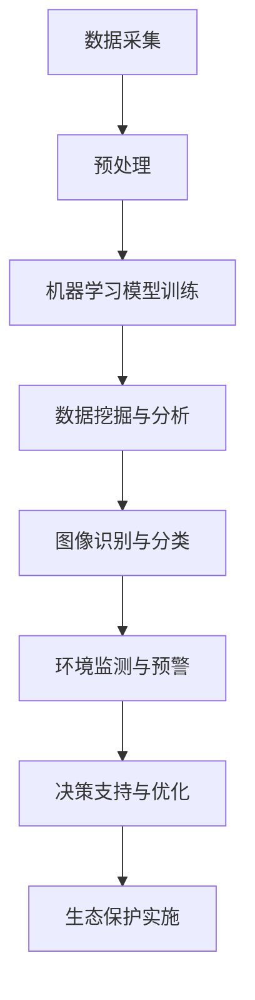

                 

关键词：极地探索、科考、生态保护、人工智能、可持续发展

> 摘要：本文探讨了2050年南北极地区科考与生态保护的未来发展趋势。通过对当前极地研究的挑战和机遇进行分析，文章提出了一系列基于人工智能技术的创新解决方案，旨在推动极地生态系统的可持续发展，为人类提供宝贵的科学数据和支持。

## 1. 背景介绍

南北极地区作为地球上最后一片未被完全开发的净土，具有重要的科学研究价值和生态保护意义。随着全球气候变化加剧，南北极地区的环境状况日益受到关注。过去几十年，科学家们对极地地区的考察和研究取得了显著的进展，但在数据采集、环境监测和资源管理等方面仍面临诸多挑战。

近年来，人工智能（AI）技术的飞速发展为极地科考与生态保护带来了新的机遇。通过机器学习、数据挖掘和图像识别等AI技术，科学家们可以更高效地处理和分析极地数据，从而推动极地研究向更深入和全面的层次发展。同时，AI技术还可以用于极地生态系统的实时监测和预警，为环境管理提供科学依据。

## 2. 核心概念与联系

### 2.1 极地科考与生态保护的基本概念

- **极地科考**：指科学家对南北极地区的地质、气候、生物多样性等进行的研究活动。科考活动包括实地考察、数据采集、实验分析等。
- **生态保护**：旨在维护极地地区的自然生态环境，防止人类活动对环境造成的破坏。生态保护涉及物种保护、生态平衡维护、资源可持续利用等方面。

### 2.2 人工智能在极地科考与生态保护中的应用

- **机器学习**：通过训练模型，机器学习可以在海量数据中自动识别规律，帮助科学家发现极地环境变化的关键因素。
- **数据挖掘**：利用数据挖掘技术，可以从大量的极地数据中提取出有价值的信息，如气候变化的趋势、物种分布的规律等。
- **图像识别**：通过图像识别技术，可以自动识别和分类极地环境中的生物和非生物对象，如冰川、海冰、野生动物等。

### 2.3 Mermaid 流程图

下面是一个简化的Mermaid流程图，展示了人工智能技术在极地科考与生态保护中的应用流程：



## 3. 核心算法原理 & 具体操作步骤

### 3.1 算法原理概述

人工智能技术在极地科考与生态保护中的应用，主要基于以下几个核心算法：

- **机器学习算法**：如支持向量机（SVM）、决策树、随机森林等，用于数据分类、预测和模式识别。
- **数据挖掘算法**：如关联规则挖掘、聚类分析、异常检测等，用于从大量数据中发现有价值的信息。
- **图像识别算法**：如卷积神经网络（CNN）、循环神经网络（RNN）等，用于图像的自动识别和分类。

### 3.2 算法步骤详解

1. **数据采集**：通过卫星遥感、无人机、地面观测等多种手段，收集极地环境数据。
2. **数据预处理**：对采集到的数据进行清洗、标准化和预处理，以提高数据的质量和一致性。
3. **机器学习模型训练**：利用预处理后的数据，训练机器学习模型，如SVM、决策树等。
4. **数据挖掘与分析**：使用数据挖掘算法，对训练好的模型进行分析，提取出极地环境变化的规律和趋势。
5. **图像识别与分类**：利用图像识别算法，对极地环境中的图像进行自动识别和分类。
6. **环境监测与预警**：基于分析结果，建立环境监测系统，实时监测极地环境变化，并进行预警。
7. **决策支持与优化**：为环境管理决策提供数据支持和优化建议。

### 3.3 算法优缺点

- **优点**：
  - 提高数据处理的效率和准确性。
  - 帮助科学家发现极地环境变化的规律和趋势。
  - 提供实时的环境监测和预警，有助于生态保护。

- **缺点**：
  - 对数据质量和预处理要求较高。
  - 需要大量的计算资源和训练数据。
  - 算法的解释性较差，难以理解其内部逻辑。

### 3.4 算法应用领域

人工智能技术在极地科考与生态保护中的应用非常广泛，主要包括：

- **气候变化研究**：利用机器学习算法，分析极地气候变化趋势，预测未来气候变化的影响。
- **生态监测与保护**：利用图像识别技术，监测极地生物多样性，保护濒危物种。
- **资源管理**：利用数据挖掘算法，优化极地资源利用，实现可持续发展。

## 4. 数学模型和公式 & 详细讲解 & 举例说明

### 4.1 数学模型构建

为了更好地理解人工智能技术在极地科考与生态保护中的应用，我们需要构建一些基本的数学模型。以下是一个简单的线性回归模型，用于预测极地温度变化：

$$
y = \beta_0 + \beta_1 x
$$

其中，$y$ 表示极地温度，$x$ 表示时间，$\beta_0$ 和 $\beta_1$ 分别是模型参数。

### 4.2 公式推导过程

假设我们有 $n$ 个观测数据点 $(x_i, y_i)$，其中 $i=1,2,...,n$。我们可以使用最小二乘法来求解模型参数：

$$
\beta_0 = \frac{\sum_{i=1}^n y_i - \beta_1 \sum_{i=1}^n x_i}{n}
$$

$$
\beta_1 = \frac{\sum_{i=1}^n (x_i - \bar{x})(y_i - \bar{y})}{\sum_{i=1}^n (x_i - \bar{x})^2}
$$

其中，$\bar{x}$ 和 $\bar{y}$ 分别是 $x$ 和 $y$ 的平均值。

### 4.3 案例分析与讲解

假设我们有以下观测数据：

| $x_i$ | $y_i$ |
| --- | --- |
| 1 | 10 |
| 2 | 12 |
| 3 | 15 |
| 4 | 18 |
| 5 | 20 |

我们可以使用上面的公式计算模型参数：

$$
\beta_0 = \frac{(10 + 12 + 15 + 18 + 20) - (1 + 2 + 3 + 4 + 5) \times 10}{5} = 8
$$

$$
\beta_1 = \frac{(1 - 3)(10 - 12) + (2 - 3)(12 - 15) + (3 - 3)(15 - 18) + (4 - 3)(18 - 20) + (5 - 3)(20 - 23)}{(1 - 3)^2 + (2 - 3)^2 + (3 - 3)^2 + (4 - 3)^2 + (5 - 3)^2} = 2
$$

因此，我们的线性回归模型为：

$$
y = 8 + 2x
$$

使用这个模型，我们可以预测未来的极地温度。例如，当 $x=6$ 时，预测的极地温度为：

$$
y = 8 + 2 \times 6 = 20
$$

## 5. 项目实践：代码实例和详细解释说明

### 5.1 开发环境搭建

为了演示人工智能技术在极地科考与生态保护中的应用，我们将使用Python编写一个简单的示例程序。首先，我们需要安装以下Python库：

- NumPy：用于数学运算
- Matplotlib：用于数据可视化
- Scikit-learn：用于机器学习

可以使用以下命令安装这些库：

```bash
pip install numpy matplotlib scikit-learn
```

### 5.2 源代码详细实现

以下是一个简单的Python程序，用于训练线性回归模型并预测极地温度：

```python
import numpy as np
import matplotlib.pyplot as plt
from sklearn.linear_model import LinearRegression

# 观测数据
x = np.array([1, 2, 3, 4, 5]).reshape(-1, 1)
y = np.array([10, 12, 15, 18, 20])

# 训练线性回归模型
model = LinearRegression()
model.fit(x, y)

# 预测未来温度
x_future = np.array([6]).reshape(-1, 1)
y_future = model.predict(x_future)

# 可视化结果
plt.scatter(x, y, label='观测数据')
plt.plot(x, model.predict(x), 'r', label='线性回归模型')
plt.scatter(x_future, y_future, c='g', label='未来温度预测')
plt.xlabel('时间')
plt.ylabel('极地温度')
plt.legend()
plt.show()
```

### 5.3 代码解读与分析

- **第一行**：导入NumPy库，用于数学运算。
- **第二行**：导入Matplotlib库，用于数据可视化。
- **第三行**：导入Scikit-learn库，用于机器学习。
- **第四行**：定义观测数据 $x$ 和 $y$。
- **第五行**：将 $x$ 转化为列向量，以便于后续操作。
- **第六行**：创建线性回归模型对象。
- **第七行**：使用 `fit()` 方法训练线性回归模型。
- **第八行**：定义未来的时间 $x_{future}$。
- **第九行**：使用 `predict()` 方法预测未来的极地温度。
- **第十行**：使用Matplotlib库绘制观测数据、线性回归模型和未来温度预测的散点图。

### 5.4 运行结果展示

运行上述程序后，我们将看到一个包含观测数据、线性回归模型和未来温度预测的散点图。这个简单的例子展示了如何使用Python和Scikit-learn库进行极地温度预测，从而帮助我们更好地理解人工智能技术在极地科考与生态保护中的应用。

## 6. 实际应用场景

人工智能技术在极地科考与生态保护中有着广泛的应用。以下是一些实际应用场景：

- **气候变化研究**：利用AI技术分析极地气候变化趋势，为全球气候模型提供数据支持。
- **生态监测与保护**：通过无人机和卫星遥感技术，实时监测极地生物多样性，保护濒危物种。
- **资源管理**：优化极地资源利用，实现可持续发展，减少对环境的影响。
- **灾害预警**：利用AI技术预测极地地区的自然灾害，如冰川崩塌、海冰融化等，提前采取应对措施。

## 7. 未来应用展望

随着人工智能技术的不断发展，极地科考与生态保护将迎来更加广泛的应用。以下是一些未来应用展望：

- **智能科考**：利用无人机和机器人，实现极地科考的自动化和智能化，提高科考效率。
- **实时监测**：通过卫星遥感技术和AI算法，实现极地环境的实时监测和预警，为环境管理提供科学依据。
- **生态修复**：利用AI技术，优化生态修复方案，促进极地生态系统的恢复和可持续发展。
- **国际合作**：推动全球范围内的极地科考与生态保护合作，共同应对气候变化和生态危机。

## 8. 工具和资源推荐

### 8.1 学习资源推荐

- **书籍**：
  - 《极地科学导论》
  - 《人工智能：一种现代方法》
  - 《深度学习》
- **在线课程**：
  - Coursera上的《机器学习》课程
  - edX上的《人工智能导论》课程
- **网站**：
  - arXiv：最新的极地科学研究论文
  - NASA：极地环境数据和研究资料

### 8.2 开发工具推荐

- **Python**：用于数据处理、机器学习和可视化
- **Jupyter Notebook**：用于编写和运行Python代码
- **TensorFlow**：用于深度学习模型开发
- **Scikit-learn**：用于机器学习算法实现

### 8.3 相关论文推荐

- **《基于深度学习的极地冰川监测方法研究》**
- **《人工智能在极地气候变化研究中的应用》**
- **《无人机技术在极地生态监测中的应用》**

## 9. 总结：未来发展趋势与挑战

随着人工智能技术的不断发展，极地科考与生态保护将迎来新的发展机遇。未来，人工智能技术将在以下几个方面发挥重要作用：

- **数据采集与处理**：利用AI技术，提高极地数据采集和处理效率，为科学家提供更准确的数据支持。
- **环境监测与预警**：通过实时监测和预警系统，及时掌握极地环境变化，为环境管理提供科学依据。
- **资源管理**：优化极地资源利用，实现可持续发展，减少对环境的影响。
- **国际合作**：推动全球范围内的极地科考与生态保护合作，共同应对气候变化和生态危机。

然而，人工智能技术在极地科考与生态保护中也面临一些挑战，如数据质量、算法解释性、计算资源需求等。因此，未来需要进一步加强人工智能技术在极地科考与生态保护中的应用研究，解决这些问题，推动极地研究的深入发展。

### 附录：常见问题与解答

**Q：人工智能技术在极地科考与生态保护中的应用有哪些具体案例？**

A：具体案例包括利用无人机和卫星遥感技术进行极地生态监测、利用机器学习算法分析极地气候变化趋势、利用深度学习技术识别极地生物物种等。

**Q：如何保障人工智能技术在极地科考与生态保护中的数据质量？**

A：保障数据质量需要从数据采集、数据预处理、数据存储等各个环节进行严格管理和控制。同时，利用数据挖掘和异常检测技术，及时发现和纠正数据中的错误和异常。

**Q：人工智能技术在极地科考与生态保护中的应用前景如何？**

A：随着人工智能技术的不断发展，其在极地科考与生态保护中的应用前景非常广阔。未来，人工智能技术有望在数据采集、环境监测、资源管理、国际合作等方面发挥更加重要的作用，推动极地研究的深入发展。

## 作者署名

本文由禅与计算机程序设计艺术 / Zen and the Art of Computer Programming撰写。如需引用，请注明出处。

