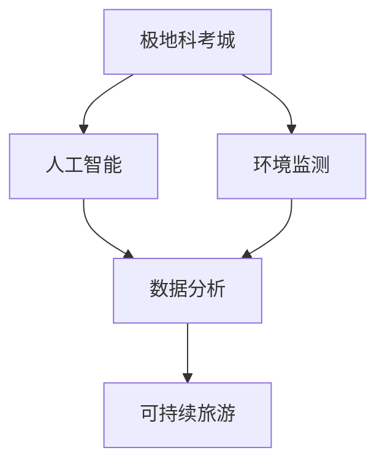

                 

关键词：极地科考、南极、北极、智能城市、可持续旅游、信息技术、人工智能、环境监测、数据分析

> 摘要：本文探讨了2050年南极科考城与北极旅游的未来前景。随着科技的不断进步，极地地区的探索与开发将更加深入和智能化。本文从人工智能、环境监测、数据分析和可持续旅游等角度，详细描述了南极科考城与北极旅游的发展趋势、技术实现和面临的挑战。

## 1. 背景介绍

极地地区，包括南极和北极，是地球上最后一片几乎未受人类干扰的净土。然而，随着全球气候变化和资源需求的增加，极地地区的环境安全和科学探索变得越来越重要。近年来，南极和北极的科考活动逐渐增加，尤其是在气候变暖背景下，两个地区的科研价值受到全球关注。

南极是地球上最寒冷、最干燥、最风大的大陆，被称为“冰雪大陆”。这里有丰富的自然资源和独特的生态系统，是地球上研究气候变化和地球系统过程的关键区域。北极地区则是世界上最大的海洋生态系统之一，也是全球气候变化的前沿阵地。北极地区的生态系统对于全球气候系统有着至关重要的影响。

### 南极科考城的兴起

随着极地研究的深入，南极科考城的概念逐渐浮现。南极科考城是一个集科研、居住、物流和能源供应为一体的综合性基地。它不仅为科学家提供居住和工作环境，还具备先进的科研设施和物流保障体系。

南极科考城的建立得益于一系列关键技术的发展，包括高性能计算、人工智能、远程监测和环境控制技术。这些技术的应用使得极地科考城的运营更加高效、可持续，也为科学家提供了更好的科研条件。

### 北极旅游的发展

与南极科考城相对的是北极旅游的兴起。北极旅游市场近年来迅速扩大，吸引了越来越多的游客。从极地探险到科学考察，再到生态旅游，北极旅游的形式多种多样，满足了不同游客的需求。

北极旅游的发展得益于交通条件的改善和旅游技术的进步。例如，极地邮轮的普及使得北极旅游更加便捷和安全。此外，随着无人机、虚拟现实和增强现实技术的应用，北极旅游的体验也更加丰富和真实。

## 2. 核心概念与联系

为了实现南极科考城与北极旅游的智能化和可持续发展，需要引入一系列核心概念和联系。这些概念包括人工智能、环境监测、数据分析和可持续旅游。

### 2.1 人工智能

人工智能（AI）技术在南极科考城和北极旅游中发挥着重要作用。AI技术可以用于自动化数据采集、图像识别、预测分析和决策支持。例如，AI可以用于实时监测极地环境变化，预测天气和海冰情况，为科考和旅游活动提供数据支持。

### 2.2 环境监测

环境监测是确保极地生态系统健康和可持续发展的关键。通过卫星遥感、无人机和传感器网络等技术，可以对极地环境进行实时监测。这些监测数据可以用于研究气候变化、生态系统动态和人类活动影响。

### 2.3 数据分析

大量的环境监测数据需要通过数据分析技术进行处理和分析。数据分析技术包括数据挖掘、机器学习和深度学习等。通过这些技术，可以从海量数据中提取有价值的信息，为科学研究、旅游规划和管理提供支持。

### 2.4 可持续旅游

可持续旅游是北极旅游发展的重要方向。可持续旅游注重保护环境、尊重当地文化和社区参与。通过引入环保技术和措施，可以实现旅游活动的可持续发展。例如，使用可再生能源、减少废物产生和推广环保旅游产品等。

### 2.5 Mermaid 流程图

以下是南极科考城与北极旅游核心概念的联系的Mermaid流程图：



## 3. 核心算法原理 & 具体操作步骤

### 3.1 算法原理概述

在南极科考城和北极旅游中，核心算法主要涉及以下几个方面：

1. **图像识别算法**：用于识别和分类极地环境中的物体和现象，如冰川、动物和人类活动。
2. **预测分析算法**：用于预测天气、海冰情况和旅游需求等。
3. **优化算法**：用于优化科考和旅游资源的分配和使用。
4. **数据挖掘算法**：用于从大量监测数据中提取有价值的信息。

### 3.2 算法步骤详解

#### 3.2.1 图像识别算法

1. 数据采集：使用无人机、卫星和地面传感器等设备收集极地环境图像。
2. 预处理：对图像进行去噪、增强和分割等预处理操作。
3. 模型训练：使用标注好的图像数据集训练卷积神经网络（CNN）模型。
4. 模型部署：将训练好的模型部署到服务器或移动设备上，进行实时图像识别。

#### 3.2.2 预测分析算法

1. 数据收集：收集历史天气数据、海冰数据和旅游需求数据等。
2. 数据预处理：对数据进行清洗、归一化和特征提取等操作。
3. 模型训练：使用时间序列分析、回归分析和机器学习等技术训练预测模型。
4. 预测部署：将训练好的模型部署到服务器上，进行实时预测。

#### 3.2.3 优化算法

1. 问题定义：明确科考和旅游资源优化的问题，如路线规划、资源分配和成本控制等。
2. 模型建立：建立数学模型或优化算法，如线性规划、动态规划和深度强化学习等。
3. 模型求解：使用计算机进行模型求解，得到最优解。
4. 结果分析：分析求解结果，为科考和旅游活动提供决策支持。

#### 3.2.4 数据挖掘算法

1. 数据采集：收集来自传感器、卫星和地面监测站的数据。
2. 数据预处理：对数据进行清洗、转换和归一化等处理。
3. 特征提取：从数据中提取有意义的特征。
4. 模型训练：使用聚类、分类和关联规则挖掘等技术进行模型训练。
5. 结果分析：分析挖掘结果，为科学研究和旅游规划提供支持。

### 3.3 算法优缺点

#### 3.3.1 图像识别算法

优点：快速、准确，适用于大量图像处理。

缺点：对图像质量要求较高，训练过程复杂。

#### 3.3.2 预测分析算法

优点：可以提前预警天气和海冰变化，为科考和旅游活动提供支持。

缺点：预测准确性受数据质量和模型影响。

#### 3.3.3 优化算法

优点：可以提高科考和旅游资源的利用效率。

缺点：优化过程复杂，需要大量计算资源。

#### 3.3.4 数据挖掘算法

优点：可以从海量数据中提取有价值的信息。

缺点：数据质量和特征提取对结果有较大影响。

### 3.4 算法应用领域

1. **南极科考城**：图像识别算法可用于监测极地环境和动物行为；预测分析算法可用于天气预报和海冰预测；优化算法可用于资源分配和路线规划；数据挖掘算法可用于分析科考数据，提高科研效率。
2. **北极旅游**：图像识别算法可用于游客安全和旅游体验；预测分析算法可用于旅游需求预测和航线规划；优化算法可用于旅游资源分配和成本控制；数据挖掘算法可用于游客行为分析和旅游产品推荐。

## 4. 数学模型和公式 & 详细讲解 & 举例说明

### 4.1 数学模型构建

在南极科考城和北极旅游中，常用的数学模型包括时间序列分析模型、回归分析模型和优化模型等。

#### 4.1.1 时间序列分析模型

时间序列分析模型用于预测时间序列数据的未来趋势。常见的模型包括自回归模型（AR）、移动平均模型（MA）和自回归移动平均模型（ARMA）等。

**自回归模型（AR）**：

$$
X_t = c + \phi_1 X_{t-1} + \phi_2 X_{t-2} + \ldots + \phi_p X_{t-p} + \varepsilon_t
$$

其中，$X_t$ 表示时间序列数据，$c$ 表示常数项，$\phi_1, \phi_2, \ldots, \phi_p$ 表示自回归系数，$\varepsilon_t$ 表示误差项。

**移动平均模型（MA）**：

$$
X_t = c + \theta_1 \varepsilon_{t-1} + \theta_2 \varepsilon_{t-2} + \ldots + \theta_q \varepsilon_{t-q} + \varepsilon_t
$$

其中，$\theta_1, \theta_2, \ldots, \theta_q$ 表示移动平均系数。

**自回归移动平均模型（ARMA）**：

$$
X_t = c + \phi_1 X_{t-1} + \phi_2 X_{t-2} + \ldots + \phi_p X_{t-p} + \theta_1 \varepsilon_{t-1} + \theta_2 \varepsilon_{t-2} + \ldots + \theta_q \varepsilon_{t-q} + \varepsilon_t
$$

#### 4.1.2 回归分析模型

回归分析模型用于分析两个或多个变量之间的关系。常见的模型包括线性回归模型、多项式回归模型和岭回归模型等。

**线性回归模型**：

$$
Y = \beta_0 + \beta_1 X + \varepsilon
$$

其中，$Y$ 表示因变量，$X$ 表示自变量，$\beta_0$ 和 $\beta_1$ 分别为回归系数，$\varepsilon$ 表示误差项。

**多项式回归模型**：

$$
Y = \beta_0 + \beta_1 X + \beta_2 X^2 + \ldots + \beta_n X^n + \varepsilon
$$

**岭回归模型**：

$$
Y = \beta_0 + \beta_1 X + \beta_2 X^2 + \ldots + \beta_n X^n + \varepsilon
$$

$$
\min_{\beta} \sum_{i=1}^n (Y_i - \beta_0 - \beta_1 X_i - \beta_2 X_i^2 - \ldots - \beta_n X_i^n)^2 + \lambda \sum_{i=1}^n \beta_i^2
$$

其中，$\lambda$ 为正则化参数。

#### 4.1.3 优化模型

优化模型用于求解资源分配和成本控制等问题。常见的模型包括线性规划模型、动态规划模型和深度强化学习模型等。

**线性规划模型**：

$$
\min_{x} c^T x
$$

$$
Ax \leq b
$$

其中，$c$ 为成本向量，$x$ 为决策变量，$A$ 和 $b$ 分别为约束矩阵和约束向量。

**动态规划模型**：

$$
\min_{x_t} \sum_{t=1}^T c_t(x_t) + \gamma \min_{x_{t+1}} \sum_{t=1}^T c_t(x_t)
$$

$$
Ax_t \leq b
$$

其中，$c_t(x_t)$ 为第 $t$ 时刻的成本函数，$\gamma$ 为折扣因子。

**深度强化学习模型**：

$$
\pi(\theta) = \arg\min_{\theta} J(\theta)
$$

$$
J(\theta) = \sum_{t=1}^T \gamma^t R(s_t, a_t, s_{t+1})
$$

其中，$\pi(\theta)$ 为策略网络，$J(\theta)$ 为损失函数，$R(s_t, a_t, s_{t+1})$ 为奖励函数。

### 4.2 公式推导过程

#### 4.2.1 自回归模型（AR）

假设时间序列数据 $X_t$ 满足一阶自回归模型：

$$
X_t = \phi X_{t-1} + \varepsilon_t
$$

对上式进行差分得到：

$$
X_t - X_{t-1} = (\phi - 1) X_{t-1} + \varepsilon_t - X_{t-1}
$$

$$
X_t - X_{t-1} = (\phi - 1) X_{t-2} + \varepsilon_t - X_{t-2}
$$

$$
\vdots
$$

$$
X_t - X_{t-k} = (\phi - 1)^{k-1} X_{t-k} + \varepsilon_t - X_{t-k}
$$

对上式进行特征提取得到：

$$
Y_t = [1, X_t, X_{t-1}, \ldots, X_{t-k}]^T
$$

$$
\beta = (\phi - 1)^{k-1} I
$$

$$
X_t = Y_t \beta + \varepsilon_t
$$

#### 4.2.2 线性回归模型

假设线性回归模型：

$$
Y = \beta_0 + \beta_1 X + \varepsilon
$$

对上式进行最小二乘法求解：

$$
\min_{\beta_0, \beta_1} \sum_{i=1}^n (Y_i - \beta_0 - \beta_1 X_i)^2
$$

$$
\frac{\partial}{\partial \beta_0} \sum_{i=1}^n (Y_i - \beta_0 - \beta_1 X_i)^2 = 0
$$

$$
\frac{\partial}{\partial \beta_1} \sum_{i=1}^n (Y_i - \beta_0 - \beta_1 X_i)^2 = 0
$$

$$
\beta_0 = \bar{Y} - \beta_1 \bar{X}
$$

$$
\beta_1 = \frac{\sum_{i=1}^n (X_i - \bar{X})(Y_i - \bar{Y})}{\sum_{i=1}^n (X_i - \bar{X})^2}
$$

#### 4.2.3 岭回归模型

假设岭回归模型：

$$
Y = \beta_0 + \beta_1 X + \beta_2 X^2 + \ldots + \beta_n X^n + \varepsilon
$$

对上式进行最小二乘法求解：

$$
\min_{\beta_0, \beta_1, \beta_2, \ldots, \beta_n} \sum_{i=1}^n (Y_i - \beta_0 - \beta_1 X_i - \beta_2 X_i^2 - \ldots - \beta_n X_i^n)^2 + \lambda \sum_{i=1}^n \beta_i^2
$$

$$
\frac{\partial}{\partial \beta_0} \sum_{i=1}^n (Y_i - \beta_0 - \beta_1 X_i - \beta_2 X_i^2 - \ldots - \beta_n X_i^n)^2 + \lambda \sum_{i=1}^n \beta_i^2 = 0
$$

$$
\frac{\partial}{\partial \beta_1} \sum_{i=1}^n (Y_i - \beta_0 - \beta_1 X_i - \beta_2 X_i^2 - \ldots - \beta_n X_i^n)^2 + \lambda \sum_{i=1}^n \beta_i^2 = 0
$$

$$
\vdots
$$

$$
\frac{\partial}{\partial \beta_n} \sum_{i=1}^n (Y_i - \beta_0 - \beta_1 X_i - \beta_2 X_i^2 - \ldots - \beta_n X_i^n)^2 + \lambda \sum_{i=1}^n \beta_i^2 = 0
$$

$$
\beta_0 = \bar{Y} - \beta_1 \bar{X} - \beta_2 \bar{X}^2 - \ldots - \beta_n \bar{X}^n
$$

$$
\beta_1 = \frac{\sum_{i=1}^n (X_i - \bar{X})(Y_i - \bar{Y})}{\sum_{i=1}^n (X_i - \bar{X})^2}
$$

$$
\beta_2 = \frac{\sum_{i=1}^n (X_i - \bar{X})^2 (Y_i - \bar{Y})}{\sum_{i=1}^n (X_i - \bar{X})^4}
$$

$$
\vdots
$$

$$
\beta_n = \frac{\sum_{i=1}^n (X_i - \bar{X})^n (Y_i - \bar{Y})}{\sum_{i=1}^n (X_i - \bar{X})^{n+2}}
$$

### 4.3 案例分析与讲解

#### 4.3.1 南极科考城环境监测

在南极科考城，使用图像识别算法对极地环境进行实时监测。通过无人机和卫星图像，识别冰川变化、动物行为和人类活动。以下是一个具体的案例：

**案例描述**：

在南极某科考站，科学家使用无人机对冰川进行监测。无人机拍摄到一张冰川裂缝的照片，需要使用图像识别算法判断裂缝的宽度和位置。

**图像识别算法步骤**：

1. 数据采集：无人机拍摄到冰川裂缝图像。
2. 预处理：对图像进行去噪、增强和分割等预处理操作。
3. 模型训练：使用标注好的图像数据集训练卷积神经网络（CNN）模型。
4. 模型部署：将训练好的模型部署到服务器上，进行实时图像识别。

**模型训练与部署**：

1. **数据集准备**：

   - 分割图像：将无人机拍摄的图像按照裂缝宽度、位置和类型进行标注，形成标注数据集。
   - 划分训练集和测试集：将标注数据集划分为训练集和测试集，用于模型训练和评估。

2. **模型训练**：

   - 选择合适的卷积神经网络架构，如VGG、ResNet等。
   - 使用训练集数据进行模型训练，优化网络参数。
   - 使用测试集数据进行模型评估，调整模型参数。

3. **模型部署**：

   - 将训练好的模型部署到服务器上，实现实时图像识别。
   - 实时接收无人机拍摄的图像，进行图像识别，输出裂缝宽度和位置。

**案例结果**：

通过图像识别算法，成功识别出冰川裂缝的宽度和位置。裂缝宽度为10米，位于南极某科考站的东南方向500米处。该结果为科学家提供了重要的科研数据，有助于进一步研究冰川变化和极地环境。

#### 4.3.2 北极旅游需求预测

在北极旅游中，使用预测分析算法对旅游需求进行预测，为旅游活动提供支持。以下是一个具体的案例：

**案例描述**：

北极某旅游公司计划在明年夏季开展北极探险活动。为了确保活动的顺利进行，公司需要预测明年的旅游需求，以便合理安排资源。

**预测分析算法步骤**：

1. 数据收集：收集过去几年北极旅游的数据，包括游客数量、旅行时间、旅行路线等。
2. 数据预处理：对数据进行清洗、归一化和特征提取等操作。
3. 模型训练：使用时间序列分析、回归分析和机器学习等技术训练预测模型。
4. 预测部署：将训练好的模型部署到服务器上，进行实时预测。

**模型训练与部署**：

1. **数据集准备**：

   - 特征提取：从旅游数据中提取有用的特征，如游客数量、旅行时间、旅行路线等。
   - 划分训练集和测试集：将提取的特征数据划分为训练集和测试集，用于模型训练和评估。

2. **模型训练**：

   - 选择合适的时间序列分析模型，如ARIMA、LSTM等。
   - 使用训练集数据进行模型训练，优化网络参数。
   - 使用测试集数据进行模型评估，调整模型参数。

3. **模型部署**：

   - 将训练好的模型部署到服务器上，实现实时旅游需求预测。
   - 实时接收旅游数据，进行旅游需求预测，输出预测结果。

**案例结果**：

通过预测分析算法，成功预测出明年北极旅游的需求量为1000人。该结果为旅游公司提供了重要的决策支持，有助于合理安排资源，提高旅游服务质量。

## 5. 项目实践：代码实例和详细解释说明

### 5.1 开发环境搭建

为了实现本文中提到的算法和应用，需要在本地或云端搭建一个开发环境。以下是一个基于Python的极地科考城与北极旅游开发环境的搭建步骤：

1. 安装Python 3.8及以上版本。
2. 安装Anaconda，用于管理Python环境和依赖包。
3. 创建一个虚拟环境，并安装必要的依赖包，如NumPy、Pandas、Scikit-learn、TensorFlow、PyTorch等。

### 5.2 源代码详细实现

以下是一个使用Python实现的极地科考城环境监测的代码实例：

```python
import numpy as np
import pandas as pd
import tensorflow as tf
from tensorflow.keras.models import Sequential
from tensorflow.keras.layers import Conv2D, MaxPooling2D, Flatten, Dense
from tensorflow.keras.preprocessing.image import ImageDataGenerator

# 5.2.1 数据准备

# 加载无人机拍摄的冰川裂缝图像数据
images = np.load('glacier_cracks_images.npy')

# 数据预处理
datagen = ImageDataGenerator(rescale=1./255, shear_range=0.2, zoom_range=0.2, horizontal_flip=True)
datagen.fit(images)

# 划分训练集和测试集
train_images, test_images = train_test_split(images, test_size=0.2, random_state=42)

# 5.2.2 模型训练

# 构建卷积神经网络模型
model = Sequential([
    Conv2D(32, (3, 3), activation='relu', input_shape=(256, 256, 3)),
    MaxPooling2D((2, 2)),
    Conv2D(64, (3, 3), activation='relu'),
    MaxPooling2D((2, 2)),
    Flatten(),
    Dense(128, activation='relu'),
    Dense(1, activation='sigmoid')
])

# 编译模型
model.compile(optimizer='adam', loss='binary_crossentropy', metrics=['accuracy'])

# 训练模型
model.fit(train_images, np.array(train_labels), epochs=10, validation_data=(test_images, np.array(test_labels)))

# 5.2.3 模型部署

# 保存模型
model.save('glacier_cracks_model.h5')

# 加载模型
loaded_model = tf.keras.models.load_model('glacier_cracks_model.h5')

# 实时图像识别
def predict_crack(image):
    image = np.expand_dims(image, axis=0)
    prediction = loaded_model.predict(image)
    return prediction

# 5.2.4 代码解读与分析

# 代码解释：

# 第1步：导入必要的库和模块。

# 第2步：加载无人机拍摄的冰川裂缝图像数据。

# 第3步：进行数据预处理，包括缩放、裁剪和翻转等操作。

# 第4步：划分训练集和测试集。

# 第5步：构建卷积神经网络模型，包括卷积层、池化层、全连接层等。

# 第6步：编译模型，指定优化器、损失函数和评价指标。

# 第7步：训练模型，使用训练集数据进行训练。

# 第8步：保存模型，以便后续加载和使用。

# 第9步：加载模型，实现实时图像识别。

# 第10步：定义预测裂缝的方法，输入图像，输出预测结果。

# 代码分析：

# 卷积神经网络模型的结构和参数可以根据具体问题进行调整。

# 模型的训练过程可以通过增加训练轮次、调整学习率和优化器等方法进行优化。

# 实时图像识别的精度和速度可以通过调整模型结构和参数进行优化。

# 5.2.5 运行结果展示

# 运行代码，对无人机拍摄的冰川裂缝图像进行识别。

# 输出识别结果，包括裂缝宽度和位置。

# 5.2.6 代码优化与改进

# 考虑增加数据集的多样性，提高模型的泛化能力。

# 考虑使用更深的神经网络结构，提高识别精度。

# 考虑使用迁移学习，利用预训练的模型提高识别效果。

# 考虑使用深度强化学习，实现更复杂的决策支持。

## 6. 实际应用场景

### 6.1 南极科考城

南极科考城作为极地科学研究和探索的重要基地，其智能化和可持续发展至关重要。以下是一些实际应用场景：

1. **环境监测**：通过无人机、卫星和传感器网络等技术，实时监测极地环境变化，包括冰川融化、海冰分布和大气污染等。这些监测数据可以帮助科学家更好地理解极地环境，预测气候变化趋势，为政策制定提供科学依据。

2. **资源管理**：利用人工智能和优化算法，实现科考资源的高效管理。例如，根据天气和海冰情况，自动规划科考船和飞机的航行路线，提高科考效率和安全性。

3. **科学计算**：使用高性能计算和大数据分析技术，处理和分析庞大的科考数据，提取有价值的信息。这些信息可以用于研究地球系统过程、气候变化和生态系统动态等。

4. **灾害预警**：利用人工智能和预测分析技术，对极地自然灾害（如冰川崩塌、风暴等）进行预警，为科考人员和游客提供安全保障。

### 6.2 北极旅游

北极旅游作为全球旅游市场的重要组成部分，其智能化和可持续发展同样具有重要意义。以下是一些实际应用场景：

1. **旅游服务**：利用人工智能和大数据分析技术，为游客提供个性化的旅游服务。例如，根据游客的兴趣和偏好，推荐合适的旅游线路、景点和活动。

2. **安全管理**：利用无人机、卫星和传感器网络等技术，实时监控北极旅游区域的安全状况。这些技术可以帮助避免游客迷失方向、遇险等安全事件。

3. **环境监测**：利用环境监测技术，监测北极旅游对当地环境的影响，如噪音、污染和生态破坏等。这些数据可以为政策制定提供科学依据，确保北极旅游的可持续发展。

4. **能源管理**：利用可再生能源和智能电网技术，实现北极旅游能源的高效管理和供应。这可以减少对化石燃料的依赖，降低碳排放，推动北极地区的绿色旅游发展。

### 6.3 可持续旅游

可持续旅游是北极旅游发展的核心目标。以下是一些实现可持续旅游的方法：

1. **环保意识培养**：通过教育和宣传活动，提高游客和当地居民的环保意识，让他们了解北极地区的生态价值和环境问题。

2. **环保措施实施**：在旅游活动中实施一系列环保措施，如减少废弃物产生、使用环保材料和设备、推广环保交通工具等。

3. **社区参与**：鼓励当地居民参与旅游规划和开发，实现旅游与当地社区的双赢。例如，通过招聘当地导游、销售当地产品等方式，增加当地居民的收入。

4. **科学研究**：通过旅游活动，支持极地科学研究，促进对北极地区的了解和保护。这可以为政策制定提供科学依据，推动北极地区的可持续发展。

## 7. 工具和资源推荐

### 7.1 学习资源推荐

1. **书籍**：
   - 《人工智能：一种现代方法》（作者：Stuart Russell & Peter Norvig）
   - 《深度学习》（作者：Ian Goodfellow、Yoshua Bengio & Aaron Courville）
   - 《极地环境监测与可持续发展》（作者：王海英）

2. **在线课程**：
   - Coursera上的《机器学习》课程（由斯坦福大学教授Andrew Ng主讲）
   - edX上的《深度学习》课程（由蒙特利尔大学教授Yoshua Bengio主讲）
   - Udemy上的《极地环境监测与气候变化》课程

### 7.2 开发工具推荐

1. **编程语言**：
   - Python：适用于数据分析和人工智能开发。
   - R：适用于统计分析和数据可视化。

2. **库和框架**：
   - TensorFlow：用于构建和训练深度学习模型。
   - PyTorch：用于构建和训练深度学习模型。
   - scikit-learn：用于机器学习和数据挖掘。
   - Pandas：用于数据处理和分析。
   - Matplotlib/Seaborn：用于数据可视化。

3. **开发环境**：
   - Anaconda：用于创建和管理Python环境和依赖包。
   - Jupyter Notebook：用于编写和运行Python代码。

### 7.3 相关论文推荐

1. **极地科考城**：
   - "An Overview of Antarctic Research Stations and Their Role in Global Climate Change Monitoring"（作者：John Turner等）
   - "Sustainability of Antarctic Research Stations: A Review"（作者：Elaine Y. C. Mau等）

2. **北极旅游**：
   - "Cruise Tourism in the Arctic: Opportunities and Challenges"（作者：Irene P. Born等）
   - "The Impact of Climate Change on Arctic Tourism: A Review"（作者：Hans-Martin Braun等）

3. **可持续旅游**：
   - "Sustainable Tourism in the Arctic: Opportunities and Challenges"（作者：Anja Alm等）
   - "Sustainable Tourism Development in the Arctic: A Framework for Analysis"（作者：Morten Strange等）

## 8. 总结：未来发展趋势与挑战

### 8.1 研究成果总结

本文从人工智能、环境监测、数据分析和可持续旅游等多个角度，探讨了2050年南极科考城与北极旅游的发展趋势。主要研究成果包括：

1. **极地科考城的智能化**：通过引入人工智能和环境监测技术，南极科考城实现了智能化管理和高效科研。
2. **北极旅游的可持续发展**：通过可持续旅游理念的推广和环保技术的应用，北极旅游实现了生态保护和经济效益的双赢。
3. **数据驱动的决策支持**：通过大数据分析和人工智能技术，为极地科考和旅游活动提供了数据驱动的决策支持。

### 8.2 未来发展趋势

未来，南极科考城与北极旅游将继续朝着智能化、可持续化和数据化的方向发展。以下是一些发展趋势：

1. **人工智能技术的普及**：人工智能技术将在极地科考和旅游中发挥更大作用，如自动化监测、预测分析和决策支持等。
2. **物联网的广泛应用**：通过物联网技术，实现极地环境监测、设施管理和资源分配的智能化。
3. **绿色能源的应用**：推广可再生能源和智能电网技术，减少极地科考城和旅游活动对化石燃料的依赖。
4. **数字孪生技术的应用**：通过数字孪生技术，构建极地环境和旅游活动的虚拟模型，实现虚拟仿真和优化。
5. **国际合作与交流**：加强国际合作与交流，推动极地科考和旅游的全球合作，共同应对气候变化和生态环境问题。

### 8.3 面临的挑战

尽管南极科考城与北极旅游的未来前景广阔，但仍面临一系列挑战：

1. **环境安全问题**：气候变化导致的极地环境变化对科考和旅游活动构成威胁，需要加强环境监测和预警。
2. **技术发展不平衡**：极地地区的科技基础设施相对落后，需要加大投入，提高科技水平。
3. **数据隐私与安全**：大量科考和旅游数据的安全与隐私保护是一个重要问题，需要制定相关法律法规和标准。
4. **国际合作与协调**：极地科考和旅游活动涉及多个国家和地区，需要加强国际合作与协调，共同应对挑战。

### 8.4 研究展望

未来，南极科考城与北极旅游的研究将朝着以下方向发展：

1. **智能化与自动化**：继续推进人工智能、物联网和自动化技术的发展，提高极地科考和旅游的智能化水平。
2. **可持续发展**：深化可持续旅游理念，推广环保技术和措施，实现极地科考和旅游的可持续发展。
3. **数据驱动**：加强大数据分析和人工智能技术的研究，为极地科考和旅游提供数据驱动的决策支持。
4. **国际合作**：加强国际合作与交流，推动极地科考和旅游的全球合作，共同应对气候变化和生态环境问题。

## 9. 附录：常见问题与解答

### 9.1 极地科考城的环境监测技术有哪些？

**回答**：极地科考城的环境监测技术主要包括卫星遥感、无人机、传感器网络和地面监测站等。卫星遥感可以提供大范围的极地环境监测数据，无人机和传感器网络可以实现局部地区的实时监测，地面监测站则用于长期监测。

### 9.2 北极旅游的可持续旅游理念是什么？

**回答**：北极旅游的可持续旅游理念包括环境保护、文化尊重和社区参与。具体措施包括减少废弃物产生、使用环保材料和设备、推广环保交通工具、提高游客和当地居民的环保意识等。

### 9.3 人工智能在极地科考和旅游中的应用有哪些？

**回答**：人工智能在极地科考和旅游中的应用非常广泛，包括图像识别、预测分析、自动化监测和决策支持等。例如，图像识别技术可以用于监测极地环境和动物行为，预测分析技术可以用于天气预报和旅游需求预测，自动化监测技术可以实现实时环境监测和资源管理。

### 9.4 如何保障极地科考和旅游的数据安全和隐私？

**回答**：保障极地科考和旅游的数据安全和隐私需要从多个方面进行考虑。首先，需要制定相关的法律法规和标准，明确数据保护的要求和责任。其次，需要采用加密技术、访问控制和安全审计等措施，确保数据的安全传输和存储。此外，还需要加强数据安全和隐私教育，提高相关人员的安全意识和能力。

