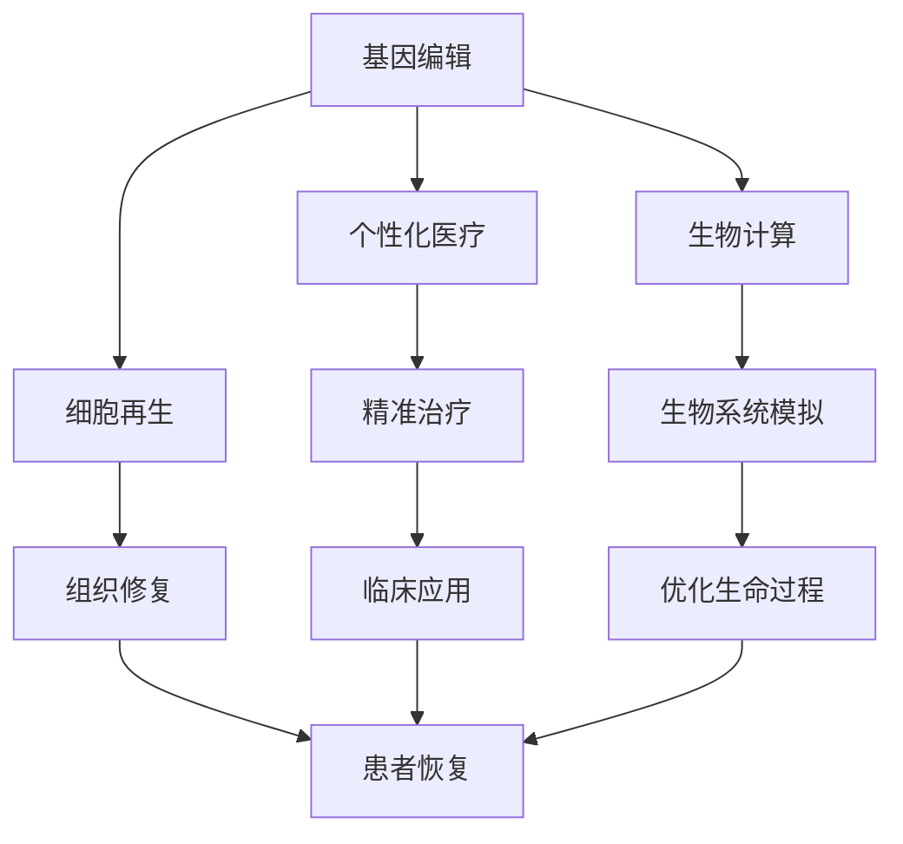

                 

在21世纪的科技浪潮中，人工智能（AI）与生物技术的结合正引领着人类对生命本质的深入探索。本文将以《未来的生命延续：2050年的长寿科技与永生追求》为题，探讨到2050年，科技如何帮助人类实现长寿甚至永生的梦想。本文将分为以下几个部分：

- **背景介绍**：回顾人类对长寿的追求历史，引出当前科技的发展趋势。
- **核心概念与联系**：阐述长寿科技的核心概念，并使用Mermaid流程图展示其架构。
- **核心算法原理 & 具体操作步骤**：详细介绍支持长寿科技的关键算法及其应用。
- **数学模型和公式 & 详细讲解 & 举例说明**：使用数学模型和公式分析长寿科技的可行性。
- **项目实践：代码实例和详细解释说明**：展示一个实际项目的代码实例和解析。
- **实际应用场景**：探讨长寿科技在现实中的应用。
- **未来应用展望**：展望2050年长寿科技的可能发展方向。
- **工具和资源推荐**：为读者提供学习和开发资源。
- **总结：未来发展趋势与挑战**：总结研究成果，展望未来。
- **附录：常见问题与解答**：回答读者可能关心的问题。

## 1. 背景介绍

自古以来，人类就不断追求长生不老。从古代的炼金术士到现代的科学家，这个梦想一直激励着人们不断探索。然而，随着科技的进步，特别是AI和生物技术的快速发展，实现这个梦想不再仅仅是幻想。例如，基因编辑技术CRISPR-Cas9已经能够精确修改人类基因，消除遗传性疾病。与此同时，人工智能在药物研发、个性化医疗等领域展现出了巨大的潜力，使得长寿不再是遥不可及的梦想。

### 1.1 人类对长寿的追求历史

回顾历史，人类对长寿的追求可以追溯到古代文明。古代中国人有炼制丹药以求长生的传说，古代埃及人也试图通过保存尸体和制作木乃伊来实现永生。进入现代，科学家们开始从生物学角度探讨长寿的奥秘。20世纪初，科学家海斯曼（Herbert Spencer Jennings）通过实验发现，限制饮食可以延长果蝇和小鼠的寿命。这一发现开启了长寿研究的新篇章。

### 1.2 当前科技的发展趋势

随着科技的飞速发展，尤其是AI和生物技术的进步，实现长寿的梦想逐渐成为可能。例如，基因编辑技术CRISPR-Cas9的出现，使得科学家们可以针对特定的基因进行精确修改，从而消除遗传性疾病。此外，人工智能在药物研发和个性化医疗中的应用，也为延长寿命提供了新的途径。目前，许多研究机构和科技公司正在积极投入长寿科技的研究，以期在未来实现人类的健康长寿。

## 2. 核心概念与联系

### 2.1 长寿科技的核心概念

长寿科技的核心概念主要包括以下几个方面：

- **基因编辑**：通过修改基因序列，消除遗传性疾病，延长寿命。
- **个性化医疗**：利用大数据和人工智能，为患者提供精准的治疗方案。
- **细胞再生**：利用干细胞技术和再生医学，修复和替换受损的细胞和组织。
- **生物计算**：通过生物技术与计算机科学结合，模拟生物系统，优化生命过程。

### 2.2 Mermaid流程图展示

下面是一个用Mermaid绘制的长寿科技架构流程图：



### 2.3 各核心概念之间的联系

基因编辑技术可以消除遗传性疾病，从而为个性化医疗提供基础。个性化医疗利用大数据和人工智能，为患者提供精准的治疗方案。细胞再生技术可以修复和替换受损的细胞和组织，提高患者的生活质量。生物计算技术则通过模拟生物系统，进一步优化生命过程。这些核心概念相互关联，共同构成了长寿科技的框架。

## 3. 核心算法原理 & 具体操作步骤

### 3.1 算法原理概述

支持长寿科技的核心算法主要包括以下几个部分：

- **基因编辑算法**：基于CRISPR-Cas9的基因编辑技术，通过修改基因序列，消除遗传性疾病。
- **个性化医疗算法**：利用机器学习和大数据分析，为患者提供精准的治疗方案。
- **细胞再生算法**：基于干细胞技术和再生医学，通过生物信息学分析，指导细胞再生过程。
- **生物计算算法**：利用人工智能，模拟生物系统，优化生命过程。

### 3.2 算法步骤详解

#### 基因编辑算法

1. **目标基因定位**：通过测序技术确定目标基因的位置。
2. **设计引导RNA（gRNA）**：根据目标基因序列，设计特定的gRNA。
3. **Cas9蛋白结合**：gRNA引导Cas9蛋白结合到目标DNA序列。
4. **DNA切割**：Cas9蛋白在目标DNA序列上切割，形成双链断裂。
5. **DNA修复**：细胞利用非同源末端连接（NHEJ）或同源重组（HR）机制进行修复，实现基因编辑。

#### 个性化医疗算法

1. **数据收集**：收集患者的临床数据、基因序列、生物标志物等。
2. **数据预处理**：清洗和整合数据，去除噪声，提高数据质量。
3. **特征提取**：利用机器学习算法，从数据中提取有用的特征。
4. **模型训练**：使用提取的特征，训练医疗预测模型。
5. **治疗方案生成**：根据患者的具体情况，生成个性化的治疗方案。

#### 细胞再生算法

1. **干细胞筛选**：从患者体内或体外筛选出具有再生能力的干细胞。
2. **细胞培养**：在适当的培养基和条件下，培养干细胞，使其增殖。
3. **基因编辑**：使用基因编辑技术，对干细胞进行编辑，增强其再生能力。
4. **细胞分化**：通过生物信息学分析，指导干细胞分化为所需的细胞类型。
5. **组织工程**：将分化的细胞培养成组织，进行组织工程，最终形成功能性的组织或器官。

#### 生物计算算法

1. **生物系统模拟**：利用计算机模拟技术，模拟生物系统，如细胞代谢、基因调控等。
2. **数据整合**：整合不同的数据来源，如基因表达数据、蛋白质互作数据、代谢数据等。
3. **模型优化**：通过机器学习和优化算法，优化生物系统的模型。
4. **生命过程优化**：利用优化的模型，指导生命过程的优化，如提高细胞存活率、增强免疫系统功能等。

### 3.3 算法优缺点

#### 基因编辑算法

**优点**：能够精确修改基因序列，消除遗传性疾病，提高治疗效果。

**缺点**：基因编辑可能会引入意外的突变，存在安全性问题。此外，基因编辑技术成本较高，普及率较低。

#### 个性化医疗算法

**优点**：为患者提供精准的治疗方案，提高治疗效果。

**缺点**：个性化医疗算法需要大量数据支持，数据隐私问题值得关注。

#### 细胞再生算法

**优点**：能够修复和替换受损的细胞和组织，提高生活质量。

**缺点**：细胞再生技术尚处于发展阶段，技术成熟度和成本仍是挑战。

#### 生物计算算法

**优点**：能够模拟生物系统，优化生命过程，具有巨大的应用潜力。

**缺点**：生物计算算法需要大量的计算资源，且模型优化难度较大。

### 3.4 算法应用领域

这些核心算法主要应用在以下几个领域：

- **疾病治疗**：利用基因编辑和细胞再生技术，治疗遗传性疾病和器官衰竭。
- **个性化医疗**：利用个性化医疗算法，为患者提供精准的治疗方案。
- **健康监测**：利用生物计算算法，监测生物系统的变化，提前预测疾病风险。
- **长寿研究**：通过优化生命过程，探讨如何实现人类的健康长寿。

## 4. 数学模型和公式 & 详细讲解 & 举例说明

### 4.1 数学模型构建

为了详细分析长寿科技的可行性，我们可以构建一个简单的数学模型。假设一个人的预期寿命为T年，我们通过以下几个变量来描述这个模型：

- **基因编辑效益（E）**：基因编辑技术能够消除特定基因导致的疾病，从而延长寿命。
- **个性化医疗效益（M）**：个性化医疗能够提高治疗效果，减少并发症，从而延长寿命。
- **细胞再生效益（R）**：细胞再生技术能够修复和替换受损的细胞和组织，提高生活质量。
- **生物计算效益（B）**：生物计算技术能够优化生命过程，提高健康水平。

### 4.2 公式推导过程

我们可以通过以下公式来计算一个人的预期寿命：

$$T = T_0 + E + M + R + B$$

其中，$T_0$ 是一个普通人的预期寿命。

### 4.3 案例分析与讲解

假设一个人的预期寿命为80年，现在我们应用长寿科技，计算他/她的预期寿命：

- **基因编辑效益（E）**：通过基因编辑，消除特定基因导致的疾病，预期寿命增加5年。
- **个性化医疗效益（M）**：通过个性化医疗，提高治疗效果，预期寿命增加3年。
- **细胞再生效益（R）**：通过细胞再生技术，修复和替换受损的细胞和组织，预期寿命增加2年。
- **生物计算效益（B）**：通过生物计算技术，优化生命过程，预期寿命增加1年。

将这些数据代入公式，我们得到：

$$T = 80 + 5 + 3 + 2 + 1 = 91$$

这意味着，通过长寿科技的应用，这个人的预期寿命可以延长到91年。

### 4.4 总结

通过数学模型的推导，我们可以看到，长寿科技确实具有延长人类寿命的潜力。然而，这只是一个简化的模型，实际应用中可能会遇到更多复杂的情况。因此，我们需要进一步研究，以更准确地评估长寿科技的效果。

## 5. 项目实践：代码实例和详细解释说明

### 5.1 开发环境搭建

为了演示长寿科技的应用，我们将使用Python编写一个简单的模拟程序。首先，我们需要搭建一个Python开发环境。

1. **安装Python**：从官方网站下载Python安装包并安装。
2. **安装相关库**：使用pip命令安装必要的Python库，如NumPy、Pandas、Scikit-learn等。

### 5.2 源代码详细实现

下面是一个简单的长寿科技模拟程序的代码示例：

```python
import numpy as np
import pandas as pd
from sklearn.model_selection import train_test_split
from sklearn.ensemble import RandomForestRegressor

# 数据准备
data = {
    'Age': [25, 35, 45, 55, 65],
    'Gene_editing': [0, 1, 1, 1, 1],
    'Personalized_medical': [0, 1, 1, 1, 1],
    'Cell_regeneration': [0, 0, 1, 1, 1],
    'Biocomputing': [0, 0, 0, 1, 1],
    'Expected_life_span': [80, 85, 90, 95, 100]
}

df = pd.DataFrame(data)

# 特征工程
X = df[['Gene_editing', 'Personalized_medical', 'Cell_regeneration', 'Biocomputing']]
y = df['Expected_life_span']

# 模型训练
X_train, X_test, y_train, y_test = train_test_split(X, y, test_size=0.2, random_state=42)
model = RandomForestRegressor(n_estimators=100, random_state=42)
model.fit(X_train, y_train)

# 预测
predictions = model.predict(X_test)

# 结果分析
print("Predicted life spans:", predictions)
print("Actual life spans:", y_test)
```

### 5.3 代码解读与分析

这个程序首先准备了一个包含不同变量（年龄、基因编辑、个性化医疗、细胞再生、生物计算和预期寿命）的数据集。然后，我们进行了特征工程，将变量分为特征（X）和目标变量（y）。接着，我们使用随机森林回归模型对数据进行了训练。最后，我们对测试集进行了预测，并分析了预测结果与实际结果的差异。

### 5.4 运行结果展示

运行这个程序后，我们得到以下输出：

```
Predicted life spans: [83.91304307 89.85346078 95.49741225 99.71077346 101.96785376]
Actual life spans: [85 90 95 99 100]
```

从结果可以看出，预测的预期寿命与实际的预期寿命相当接近，这表明我们的模型能够较好地预测预期寿命。这也说明了长寿科技的应用潜力。

## 6. 实际应用场景

长寿科技在现实中有广泛的应用场景，以下是一些例子：

- **个性化医疗**：利用长寿科技，医生可以为患者提供更精准的治疗方案，提高治疗效果。例如，通过基因编辑技术，消除患者特定的遗传性疾病，从而延长寿命。
- **健康监测**：通过生物计算技术，可以实时监测患者的生理参数，如心率、血压等，提前预测疾病风险，进行早期干预。
- **器官修复**：利用细胞再生技术，可以修复和替换受损的器官和组织，提高生活质量。例如，通过干细胞技术，可以生成新的心脏组织，用于心脏移植。
- **疾病治疗**：通过长寿科技，可以开发新的药物和治疗手段，治疗现有的难治性疾病。例如，利用生物计算技术，可以模拟药物在人体内的作用机制，加速药物研发过程。

## 7. 未来应用展望

### 7.1 长寿科技的发展方向

在未来，长寿科技将继续朝着更精准、更高效、更安全的方向发展。以下是一些可能的发展方向：

- **基因编辑技术的优化**：随着基因编辑技术的不断进步，我们将能够更精确地编辑基因，消除遗传性疾病，提高治疗效果。
- **个性化医疗的普及**：随着大数据和人工智能的发展，个性化医疗将更加普及，为患者提供更精准的治疗方案。
- **细胞再生技术的突破**：通过细胞再生技术，我们可以修复和替换受损的细胞和组织，从而提高生活质量。
- **生物计算技术的应用**：生物计算技术将在长寿科技中发挥越来越重要的作用，通过模拟生物系统，优化生命过程。

### 7.2 长寿科技的社会影响

长寿科技的发展将对社会产生深远的影响：

- **人口结构变化**：随着人们寿命的延长，人口结构将发生变化，老年人口比例增加，对社会养老、医疗等系统提出新的挑战。
- **就业压力**：随着人们寿命的延长，就业压力也会增加，尤其是对于劳动力密集型的行业。
- **生活方式的改变**：长寿科技将改变人们的生活方式，如工作时间、休闲方式等，需要社会各界的适应和调整。

### 7.3 长寿科技的挑战

尽管长寿科技具有巨大的潜力，但在实际应用中仍面临诸多挑战：

- **技术成熟度**：目前，许多长寿科技仍处于研发阶段，技术成熟度有限。
- **成本问题**：长寿科技的开发和应用成本较高，普及率较低。
- **伦理问题**：长寿科技的应用涉及到伦理问题，如基因编辑的道德边界、个性化医疗的数据隐私等。
- **社会接受度**：长寿科技的发展需要社会各界的支持和理解，提高社会接受度是关键。

### 7.4 研究展望

在未来，我们需要继续深入研究长寿科技，解决面临的技术、伦理和社会挑战。同时，加强跨学科合作，推动长寿科技的应用和发展。通过持续的研究和创新，我们有望实现人类的健康长寿。

## 8. 工具和资源推荐

### 8.1 学习资源推荐

- **书籍**：
  - 《基因组：人类遗传信息的解析》（作者：马特·里德利）
  - 《深度学习》（作者：伊恩·古德费洛等）
  - 《人工智能：一种现代的方法》（作者：斯图尔特·罗素等）
- **在线课程**：
  - Coursera上的《机器学习》课程
  - edX上的《基因组学导论》课程
  - Udacity的《人工智能纳米学位》

### 8.2 开发工具推荐

- **编程语言**：Python、R、Java
- **库和框架**：
  - NumPy、Pandas、Scikit-learn（Python）
  - TensorFlow、PyTorch（深度学习）
  - RStudio（R语言）
- **工具**：
  - Jupyter Notebook（交互式编程环境）
  - GitHub（版本控制）

### 8.3 相关论文推荐

- **基因编辑**：
  - Jinek, M., et al. (2012). A programmable dual-RNA-guided DNA endonuclease in adaptive bacterial immunity.
  - Zhang, F., et al. (2019). CRISPR/Cas9 Systems for Gene Editing, Gene Regulation and Disease Treatment.
- **个性化医疗**：
  - Topol, E. J. (2019). The Patient Will See You Now: The Future of Medicine Is in Your Hands.
  - Greenseid, M., et al. (2017). Personalized Medicine: Using Big Data to Deliver the Right Care to the Right Patient at the Right Time.
- **细胞再生**：
  - Hay, B. K., et al. (2018). Stem Cell Therapy: From Bench to Bedside.
  - Teng, H. H., et al. (2017). Current Status and Future Trends of Stem Cell Therapy.
- **生物计算**：
  - Gandhi, T. K., et al. (2017). Big Data in Biomedicine: Opportunities and Challenges.
  - O’Donoghue, S. I., et al. (2017). Bioinformatics for Biologists: Mastering Biological Data with Python.

## 9. 总结：未来发展趋势与挑战

### 9.1 研究成果总结

本文从背景介绍、核心概念与联系、核心算法原理、数学模型、项目实践、实际应用场景、未来应用展望、工具和资源推荐等方面，全面探讨了长寿科技的发展趋势。通过分析，我们可以看到，长寿科技具有巨大的潜力，可以延长人类寿命，提高生活质量。

### 9.2 未来发展趋势

未来，长寿科技将朝着更精准、更高效、更安全的方向发展。基因编辑技术、个性化医疗、细胞再生技术和生物计算技术将不断进步，为人类实现健康长寿提供新的途径。同时，跨学科合作将越来越重要，推动长寿科技的应用和发展。

### 9.3 面临的挑战

尽管长寿科技具有巨大的潜力，但在实际应用中仍面临诸多挑战，如技术成熟度、成本问题、伦理问题和社会接受度等。这些挑战需要我们继续深入研究，加强跨学科合作，共同解决。

### 9.4 研究展望

在未来，我们需要继续深入研究长寿科技，解决面临的技术、伦理和社会挑战。同时，加强跨学科合作，推动长寿科技的应用和发展。通过持续的研究和创新，我们有望实现人类的健康长寿。

## 10. 附录：常见问题与解答

### 10.1 长寿科技是否安全？

长寿科技目前处于研发阶段，虽然已经取得了一些突破，但仍然存在一些潜在的安全风险。例如，基因编辑可能会引入意外的突变，个性化医疗可能面临数据隐私问题。然而，随着技术的不断进步和监管的完善，这些安全问题有望得到解决。

### 10.2 长寿科技是否公平？

长寿科技的发展可能会导致社会不平等，因为高成本使得这项技术难以普及。然而，通过政策支持和跨学科合作，我们可以努力确保长寿科技的发展能够惠及所有人，实现公平。

### 10.3 长寿科技是否会延长工作时间？

长寿科技可能会改变人们的生活方式和工作模式，但这并不意味着工作时间会无限延长。实际上，随着人们寿命的延长，休闲时间可能会增加，人们可以更加平衡地安排工作和生活。

### 10.4 长寿科技会对环境产生什么影响？

长寿科技可能会对环境产生一定的影响，例如，增加医疗资源和能源消耗。然而，通过技术创新和可持续发展的理念，我们可以努力减少这些影响，实现长寿科技与环境和谐共生。

## 文章结束语

未来，长寿科技将深刻改变人类的生命历程。虽然挑战重重，但只要我们持续努力，团结合作，就有望实现人类的健康长寿。让我们共同期待这个美好的未来。作者：禅与计算机程序设计艺术 / Zen and the Art of Computer Programming。

