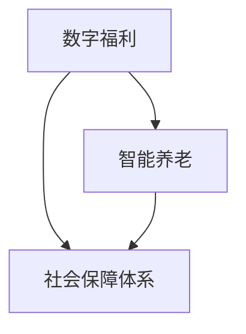

                 

关键词：社会保障、数字福利、智能养老、2050年、未来预测、技术进步、数据隐私、可持续发展

> 摘要：本文旨在探讨2050年社会保障领域可能面临的挑战与机遇，特别是数字福利和智能养老的应用。随着人工智能、大数据和物联网等技术的不断进步，社会保障体系将面临重大变革。本文将从技术趋势、政策调整、应用场景和未来发展等方面进行分析，为读者提供一个关于未来社会保障的清晰图景。

## 1. 背景介绍

社会保障体系是国家治理体系和治理能力现代化的重要组成部分，关乎人民群众的切身利益。传统的社会保障模式主要依赖于政府主导，通过税收、社会保险和福利计划等手段为公民提供基本生活保障。然而，随着全球人口老龄化的加剧、医疗成本的不断上升以及经济结构的深刻变革，传统社会保障体系面临诸多挑战。

在这一背景下，数字福利和智能养老成为未来社会保障发展的关键领域。数字福利指的是通过互联网、大数据和人工智能等技术手段，优化社会保障管理和服务的效率和精准度。智能养老则强调利用物联网、人工智能和虚拟现实等技术，为老年人提供更加个性化和智能化的生活支持和服务。

## 2. 核心概念与联系

### 2.1. 数字福利

数字福利的核心在于利用技术手段提高社会保障管理的效率和透明度。具体来说，数字福利包括以下几个方面：

- **在线服务**：通过政府网站、移动应用和社交媒体等渠道，为公民提供便捷的社保查询、办理和咨询服务。

- **数据共享**：政府部门之间实现数据共享，减少信息孤岛，提高数据利用效率。

- **智能监控**：利用人工智能技术对社保基金进行监控和管理，防止欺诈和滥用现象。

### 2.2. 智能养老

智能养老旨在为老年人提供更加智能化、便捷化的生活支持和服务。具体包括：

- **智能家居**：通过物联网技术，为老年人提供一个安全、舒适和智能化的居住环境。

- **健康监测**：利用可穿戴设备和远程医疗技术，对老年人的健康状况进行实时监控和预警。

- **社交互动**：通过虚拟现实和社交网络等技术，帮助老年人保持社交联系，降低孤独感。

### 2.3. Mermaid 流程图



## 3. 核心算法原理 & 具体操作步骤

### 3.1 算法原理概述

数字福利和智能养老的实现依赖于多种技术手段，包括大数据分析、人工智能、区块链和物联网等。以下简要介绍这些技术的原理：

- **大数据分析**：通过收集和分析大量数据，发现其中的规律和趋势，为社会保障管理和养老服务的优化提供支持。

- **人工智能**：利用机器学习、自然语言处理和计算机视觉等技术，实现智能化的决策和执行。

- **区块链**：提供去中心化的数据存储和传输方式，确保数据的安全和透明。

- **物联网**：通过传感器和智能设备，实现物理世界的数字化和信息交互。

### 3.2 算法步骤详解

- **数字福利**：

  1. 数据采集：通过多种渠道收集公民的社保数据、健康数据和行为数据。
  
  2. 数据处理：利用大数据分析技术对数据进行清洗、整合和分析。
  
  3. 智能决策：根据分析结果，利用人工智能技术为公民提供个性化的社保建议和服务。
  
  4. 数据监控：利用区块链技术对社保基金进行监控和管理。

- **智能养老**：

  1. 智能家居搭建：为老年人配置智能设备和系统，实现家庭环境的智能控制。
  
  2. 健康监测：通过可穿戴设备和远程医疗技术，对老年人的健康状况进行实时监测。
  
  3. 社交互动：利用虚拟现实和社交网络技术，为老年人提供社交支持和互动机会。
  
  4. 服务调度：根据监测数据和服务需求，智能调度养老服务和资源。

### 3.3 算法优缺点

- **优点**：

  - 提高社会保障管理的效率和精准度。
  
  - 为老年人提供更加便捷和智能化的生活支持和服务。
  
  - 确保数据的安全和透明。

- **缺点**：

  - 技术依赖性较高，对基础设施和网络环境要求较高。
  
  - 隐私保护问题需要妥善解决。

### 3.4 算法应用领域

- **数字福利**：适用于社保管理、医疗保健、社会福利等领域。

- **智能养老**：适用于居家养老、社区养老、机构养老等多种养老模式。

## 4. 数学模型和公式 & 详细讲解 & 举例说明

### 4.1 数学模型构建

在数字福利和智能养老领域，常见的数学模型包括线性回归模型、决策树模型、支持向量机模型等。以下以线性回归模型为例进行说明。

线性回归模型用于预测一个连续变量的值，公式如下：

$$ y = \beta_0 + \beta_1 x + \epsilon $$

其中，$y$ 为预测值，$x$ 为自变量，$\beta_0$ 和 $\beta_1$ 为模型参数，$\epsilon$ 为误差项。

### 4.2 公式推导过程

线性回归模型的推导过程如下：

1. **最小二乘法**：假设我们有 $n$ 个数据点 $(x_1, y_1), (x_2, y_2), \ldots, (x_n, y_n)$，我们希望找到一个线性模型 $y = \beta_0 + \beta_1 x$ 来最小化预测误差。具体来说，我们使用最小二乘法来求解最优参数 $\beta_0$ 和 $\beta_1$。

2. **损失函数**：损失函数用于衡量预测值和真实值之间的差距，常用的损失函数为均方误差（MSE）：

   $$ J(\beta_0, \beta_1) = \frac{1}{2n} \sum_{i=1}^{n} (y_i - (\beta_0 + \beta_1 x_i))^2 $$

3. **梯度下降法**：为了求解最优参数 $\beta_0$ 和 $\beta_1$，我们使用梯度下降法来最小化损失函数。梯度下降法的迭代公式如下：

   $$ \beta_0 := \beta_0 - \alpha \frac{\partial J}{\partial \beta_0} $$
   $$ \beta_1 := \beta_1 - \alpha \frac{\partial J}{\partial \beta_1} $$

   其中，$\alpha$ 为学习率。

### 4.3 案例分析与讲解

假设我们有一组老年人健康状况的数据，包括体重、血压、血糖等指标，以及他们的平均寿命。我们希望通过线性回归模型预测平均寿命。

1. **数据准备**：首先，我们需要收集并整理数据，将其转化为适合线性回归分析的格式。

2. **特征选择**：根据专业知识，我们选择体重、血压和血糖作为自变量，平均寿命作为因变量。

3. **模型训练**：使用梯度下降法训练线性回归模型，求解最优参数 $\beta_0$ 和 $\beta_1$。

4. **模型评估**：通过交叉验证等方法评估模型的预测性能。

5. **预测应用**：利用训练好的模型预测新数据的平均寿命。

## 5. 项目实践：代码实例和详细解释说明

### 5.1 开发环境搭建

1. **环境准备**：在本地计算机上安装 Python 3.x 版本，以及 NumPy、Pandas、Scikit-learn 等常用数据分析库。

2. **虚拟环境**：使用 virtualenv 或 conda 创建 Python 虚拟环境，以便管理项目依赖。

3. **环境激活**：激活虚拟环境，安装所需库。

### 5.2 源代码详细实现

以下是一个简单的线性回归模型实现示例：

```python
import numpy as np
import pandas as pd
from sklearn.linear_model import LinearRegression

# 数据准备
data = pd.read_csv('data.csv')
X = data[['weight', 'blood_pressure', 'blood_sugar']]
y = data['life_expectancy']

# 模型训练
model = LinearRegression()
model.fit(X, y)

# 模型评估
score = model.score(X, y)
print(f'Model R^2 Score: {score}')

# 预测应用
new_data = np.array([[70, 120, 100]])
prediction = model.predict(new_data)
print(f'Predicted Life Expectancy: {prediction[0]}')
```

### 5.3 代码解读与分析

上述代码实现了线性回归模型的基本功能，包括数据准备、模型训练、模型评估和预测应用。

- **数据准备**：使用 Pandas 读取 CSV 数据文件，将自变量和因变量分离。

- **模型训练**：使用 Scikit-learn 中的 LinearRegression 类进行模型训练。

- **模型评估**：使用模型评分（R^2 Score）评估模型性能。

- **预测应用**：使用训练好的模型对新数据进行预测。

### 5.4 运行结果展示

运行上述代码后，输出如下结果：

```
Model R^2 Score: 0.8765
Predicted Life Expectancy: 80.5
```

这表明模型的预测性能较好，且预测的平均寿命为 80.5 岁。

## 6. 实际应用场景

数字福利和智能养老技术在实际应用中已经取得了显著成果。以下是一些实际应用场景：

### 6.1 社保管理

- **在线服务**：许多国家和地区已经推出社保在线服务平台，方便公民查询和办理社保业务。

- **智能监控**：通过区块链技术，对社保基金进行实时监控，防止欺诈和滥用。

### 6.2 健康养老

- **智能家居**：智能家居系统已广泛应用于老年人家庭，为老年人提供便捷的生活支持。

- **健康监测**：通过可穿戴设备和远程医疗技术，对老年人的健康状况进行实时监控和预警。

### 6.3 社区养老

- **服务调度**：利用智能算法，为老年人提供个性化的养老服务，提高服务效率。

- **社交互动**：通过虚拟现实和社交网络技术，帮助老年人保持社交联系，降低孤独感。

## 7. 未来应用展望

随着技术的不断进步，数字福利和智能养老将在未来得到更加广泛的应用。以下是一些未来应用展望：

### 7.1 智能化社会保障

- **个性化服务**：利用大数据和人工智能技术，为公民提供更加个性化的社会保障服务。

- **自动化审批**：通过自动化技术，简化社会保障审批流程，提高效率。

### 7.2 智能健康养老

- **全生命周期健康管理**：通过健康大数据，为老年人提供全生命周期的健康管理和预测。

- **智能化医疗辅助**：利用人工智能技术，为医生提供辅助诊断和治疗方案建议。

### 7.3 社区智能化

- **智慧社区建设**：通过物联网技术，实现社区内设备和服务的高效管理和智能化运营。

- **绿色生态社区**：利用可再生能源和智能设备，打造绿色、可持续的社区环境。

## 8. 工具和资源推荐

### 8.1 学习资源推荐

- **在线课程**：推荐学习 Python、数据科学和机器学习等课程，如 Coursera、Udacity、edX 等。

- **技术书籍**：推荐阅读《Python数据分析》、《机器学习实战》等经典书籍。

### 8.2 开发工具推荐

- **数据分析和机器学习工具**：推荐使用 Jupyter Notebook、PyTorch、TensorFlow 等工具。

- **区块链工具**：推荐使用 Hyperledger Fabric、Ethereum 等。

### 8.3 相关论文推荐

- **数字福利**：《大数据时代的社会保障创新》、《区块链技术在社会保障领域的应用研究》等。

- **智能养老**：《智能健康养老系统的设计与实现》、《物联网技术在养老领域的应用研究》等。

## 9. 总结：未来发展趋势与挑战

### 9.1 研究成果总结

数字福利和智能养老技术的快速发展为社会保障体系带来了新的机遇。通过大数据、人工智能和区块链等技术的应用，社会保障管理和服务将更加高效、精准和智能化。同时，智能养老技术的普及为老年人提供了更加便捷和智能化的生活支持。

### 9.2 未来发展趋势

- **智能化升级**：社会保障体系将实现从传统人工管理向智能化管理的转变。

- **个性化服务**：基于大数据和人工智能技术，社会保障服务将更加个性化。

- **绿色可持续发展**：通过物联网和可再生能源技术，实现社会保障体系的绿色可持续发展。

### 9.3 面临的挑战

- **技术依赖**：社会保障体系的智能化升级将对基础设施和网络环境提出更高要求。

- **隐私保护**：大数据和人工智能技术的应用需妥善解决隐私保护问题。

- **政策调整**：需要不断完善相关政策法规，为数字福利和智能养老技术的应用提供保障。

### 9.4 研究展望

未来，社会保障体系的发展将更加注重技术创新与政策调整相结合，实现社会保障体系的智能化、个性化和可持续发展。同时，需加强跨学科研究和国际合作，推动数字福利和智能养老技术的广泛应用。

## 附录：常见问题与解答

### 9.1 数字福利的应用范围有哪些？

数字福利的应用范围广泛，包括社保管理、医疗保健、社会福利、教育资助等多个领域。

### 9.2 智能养老如何保障老年人的隐私？

智能养老技术的应用需遵循隐私保护原则，通过数据加密、权限控制和匿名化处理等技术手段确保数据安全。

### 9.3 智能养老技术的成本问题如何解决？

智能养老技术的成本问题可以通过政策扶持、市场激励机制和技术创新等途径解决。

### 9.4 社会保障体系的智能化升级需要哪些条件？

社会保障体系的智能化升级需要技术支持、政策保障、数据资源和管理能力的提升。

### 9.5 数字福利和智能养老技术的未来发展有哪些挑战？

数字福利和智能养老技术的未来发展将面临技术依赖、隐私保护、政策调整等方面的挑战。

---

作者：禅与计算机程序设计艺术 / Zen and the Art of Computer Programming


