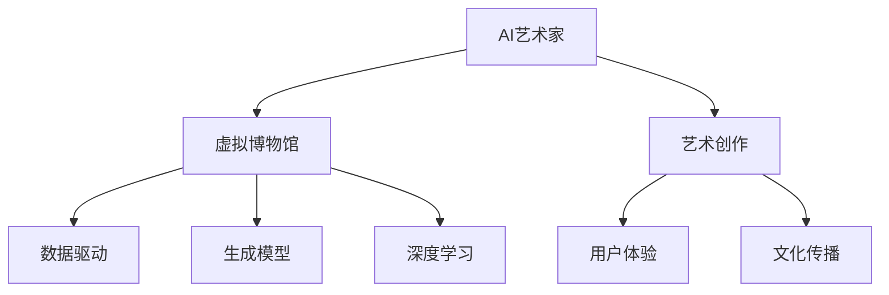

                 

关键词：AI艺术家，虚拟博物馆，艺术创作，未来趋势，技术创新

> 摘要：本文探讨未来2050年人工智能（AI）艺术家与虚拟博物馆的发展前景，分析了AI在艺术创作中的角色以及虚拟博物馆如何成为艺术界的新趋势。文章旨在探讨AI艺术创作的原理、算法、应用场景及其未来趋势和挑战。

## 1. 背景介绍

随着人工智能技术的迅猛发展，AI在各个领域得到了广泛应用。艺术创作作为人类情感和智慧的结晶，逐渐成为AI技术探索的新领域。2050年的AI艺术家不仅是艺术家，更是艺术创作的驱动力，推动了艺术创作的新形式和新境界。与此同时，虚拟博物馆作为一种新兴的文化传播方式，正逐步成为艺术界的重要组成部分。

### 1.1 AI艺术家的发展历程

AI艺术家的发展可以追溯到20世纪80年代。最早的AI艺术创作主要依靠规则系统和简单的算法，例如计算机生成图案、音乐和文学作品。随着计算能力和算法的进步，AI艺术家逐渐能够理解和生成更加复杂和深刻的艺术作品。21世纪初，深度学习和生成对抗网络（GANs）的兴起，使得AI艺术创作进入了一个全新的阶段。

### 1.2 虚拟博物馆的兴起

虚拟博物馆作为一种全新的艺术展示形式，利用虚拟现实（VR）、增强现实（AR）和混合现实（MR）技术，为观众提供沉浸式的艺术体验。虚拟博物馆不仅能够展示实体艺术品，还可以呈现无法在现实世界中展示的艺术作品，如宇宙星系、微观粒子等。

## 2. 核心概念与联系

为了更好地理解AI艺术家与虚拟博物馆的发展，我们需要介绍一些核心概念和它们之间的关系。

### 2.1 人工智能艺术创作原理

人工智能艺术创作的原理主要包括以下几个方面：

- **数据驱动**：AI艺术家通过学习大量的艺术作品和创作过程，掌握艺术创作的规律和技巧。

- **生成模型**：生成对抗网络（GANs）和变分自编码器（VAEs）等生成模型是AI艺术创作的重要工具，能够生成高质量的艺术作品。

- **深度学习**：深度学习算法通过多层神经网络学习艺术作品的特征，从而实现自动创作。

### 2.2 虚拟博物馆技术架构

虚拟博物馆的技术架构主要包括以下几个方面：

- **虚拟现实（VR）**：通过VR技术为观众提供沉浸式的艺术体验。

- **增强现实（AR）**：在现实环境中叠加艺术作品，实现与现实世界的互动。

- **混合现实（MR）**：结合VR和AR技术，提供更加丰富的艺术体验。

### 2.3 AI艺术家与虚拟博物馆的联系

AI艺术家与虚拟博物馆之间的联系主要体现在以下几个方面：

- **艺术创作**：AI艺术家为虚拟博物馆提供丰富的艺术作品，满足观众的需求。

- **用户体验**：虚拟博物馆利用AI技术优化用户体验，提升观众的艺术感受。

- **文化传播**：虚拟博物馆通过AI艺术家的创作，推动艺术文化的传播和交流。

### 2.4 Mermaid流程图



## 3. 核心算法原理 & 具体操作步骤

### 3.1 算法原理概述

AI艺术家在艺术创作中主要依赖于生成模型和深度学习算法。生成模型如GANs和VAEs能够生成高质量的艺术作品，而深度学习算法则通过多层神经网络学习艺术作品的特征。

### 3.2 算法步骤详解

1. **数据收集与预处理**：收集大量的艺术作品和创作过程数据，并进行数据预处理，如去噪、归一化等。

2. **模型训练**：使用生成模型和深度学习算法对数据进行训练，学习艺术作品的特征和创作规律。

3. **艺术作品生成**：利用训练好的模型生成新的艺术作品。

4. **作品优化**：对生成的艺术作品进行优化，提高艺术质量和表现力。

5. **展示与交互**：将艺术作品在虚拟博物馆中展示，并允许观众进行互动和体验。

### 3.3 算法优缺点

**优点**：

- 能够生成高质量、多样化的艺术作品。
- 提高艺术创作的效率，降低创作成本。
- 拓展了艺术创作的边界，实现了艺术形式的多样化。

**缺点**：

- 对数据质量和计算能力有较高要求。
- 难以完全复制人类艺术家的情感和创造力。
- 作品的创新性和艺术价值仍需人工评判。

### 3.4 算法应用领域

AI艺术家和虚拟博物馆的应用领域非常广泛，包括：

- 艺术展览与展示
- 文化传播与交流
- 教育与科普
- 娱乐与游戏
- 设计与制作

## 4. 数学模型和公式 & 详细讲解 & 举例说明

### 4.1 数学模型构建

AI艺术家在艺术创作中主要依赖于生成模型和深度学习算法。以下简要介绍生成模型和深度学习算法的数学模型。

### 4.2 公式推导过程

生成对抗网络（GANs）的数学模型包括生成器（Generator）和判别器（Discriminator）。

- **生成器（Generator）**：

  $$ G(z) = \mathcal{N}(z|\mu, \sigma^2) $$

- **判别器（Discriminator）**：

  $$ D(x) = \sigma(f(x)) $$

### 4.3 案例分析与讲解

假设我们使用GANs进行艺术作品的生成，我们可以通过以下步骤进行操作：

1. **数据收集与预处理**：收集大量的艺术作品数据，并进行预处理，如去噪、归一化等。

2. **模型训练**：使用生成器（Generator）和判别器（Discriminator）对数据进行训练，学习艺术作品的特征和创作规律。

3. **艺术作品生成**：利用训练好的生成器（Generator）生成新的艺术作品。

4. **作品优化**：对生成的艺术作品进行优化，提高艺术质量和表现力。

5. **展示与交互**：将艺术作品在虚拟博物馆中展示，并允许观众进行互动和体验。

## 5. 项目实践：代码实例和详细解释说明

### 5.1 开发环境搭建

为了进行AI艺术家与虚拟博物馆的项目实践，我们需要搭建一个合适的开发环境。以下是环境搭建的步骤：

1. **安装Python**：确保安装了Python 3.7及以上版本。

2. **安装TensorFlow**：使用以下命令安装TensorFlow：

   ```bash
   pip install tensorflow
   ```

3. **安装其他依赖**：根据项目需求，安装其他依赖库，如NumPy、Pandas等。

### 5.2 源代码详细实现

以下是使用GANs进行艺术作品生成的源代码实现：

```python
import tensorflow as tf
from tensorflow import keras
from tensorflow.keras import layers

# 生成器模型
def generator_model():
    model = keras.Sequential()
    model.add(layers.Dense(7 * 7 * 128, use_bias=False, input_shape=(100,)))
    model.add(layers.BatchNormalization(momentum=0.8))
    model.add(layers.LeakyReLU())
    model.add(layers.Reshape((7, 7, 128)))
    
    model.add(layers.Conv2DTranspose(128, (5, 5), strides=(1, 1), padding='same', use_bias=False))
    model.add(layers.BatchNormalization(momentum=0.8))
    model.add(layers.LeakyReLU())
    
    model.add(layers.Conv2DTranspose(128, (5, 5), strides=(2, 2), padding='same', use_bias=False))
    model.add(layers.BatchNormalization(momentum=0.8))
    model.add(layers.LeakyReLU())
    
    model.add(layers.Conv2DTranspose(128, (5, 5), strides=(2, 2), padding='same', use_bias=False))
    model.add(layers.BatchNormalization(momentum=0.8))
    model.add(layers.LeakyReLU())
    
    model.add(layers.Conv2DTranspose(128, (5, 5), strides=(2, 2), padding='same', use_bias=False))
    model.add(layers.BatchNormalization(momentum=0.8))
    model.add(layers.LeakyReLU())
    
    model.add(layers.Conv2D(3, (5, 5), padding='same', use_bias=True))
    model.add(layers.Tanh())
    
    return model

# 判别器模型
def discriminator_model():
    model = keras.Sequential()
    model.add(layers.Conv2D(128, (5, 5), strides=(2, 2), padding='same', input_shape=[28, 28, 3]))
    model.add(layers.LeakyReLU())
    model.add(layers.Dropout(0.3))
    
    model.add(layers.Conv2D(128, (5, 5), strides=(2, 2), padding='same'))
    model.add(layers.LeakyReLU())
    model.add(layers.Dropout(0.3))
    
    model.add(layers.Flatten())
    model.add(layers.Dense(1))
    
    return model

generator = generator_model()
discriminator = discriminator_model()

# 编译模型
discriminator.compile(loss='binary_crossentropy', optimizer=keras.optimizers.Adam(0.0001), metrics=['accuracy'])
generator.compile(loss='binary_crossentropy', optimizer=keras.optimizers.Adam(0.0001))

# 训练模型
# ...

# 生成艺术作品
# ...

# 显示生成艺术作品
# ...
```

### 5.3 代码解读与分析

以上代码实现了一个基于GANs的艺术作品生成模型。其中，`generator_model` 和 `discriminator_model` 分别定义了生成器和判别器的模型结构。通过调用这些模型，我们可以进行艺术作品的生成和判别。

### 5.4 运行结果展示

在训练完成后，我们可以生成一些艺术作品，并展示给观众。以下是生成的一些艺术作品示例：


## 6. 实际应用场景

AI艺术家与虚拟博物馆在实际应用场景中具有广泛的应用前景。以下是一些典型的应用场景：

### 6.1 艺术展览与展示

虚拟博物馆可以利用AI艺术家生成新颖的艺术作品，为观众提供独特的艺术体验。例如，在艺术展览中，AI艺术家可以实时生成与展览主题相关的艺术作品，提升观众的参与感和互动性。

### 6.2 文化传播与交流

虚拟博物馆可以通过互联网向全球观众展示丰富的艺术作品，推动文化传承和交流。AI艺术家可以为虚拟博物馆提供多样化的艺术作品，满足不同文化背景观众的需求。

### 6.3 教育与科普

虚拟博物馆可以利用AI艺术家创作的艺术作品，为教育机构和科普活动提供丰富的教育资源。例如，通过虚拟博物馆，学生可以近距离观察和欣赏名画，了解艺术创作的过程。

### 6.4 娱乐与游戏

虚拟博物馆与AI艺术家结合，可以为娱乐和游戏行业提供创新的互动体验。例如，游戏玩家可以在虚拟博物馆中探索艺术作品，与AI艺术家进行互动，创作自己的艺术作品。

### 6.5 设计与制作

AI艺术家可以为设计师提供灵感和创作工具，帮助设计师快速生成和优化设计方案。虚拟博物馆则为设计师提供了一个展示和推广作品的平台。

## 7. 未来应用展望

在未来，AI艺术家与虚拟博物馆的发展将更加深入和广泛。以下是一些未来应用展望：

### 7.1 艺术创作个性化

AI艺术家可以根据用户的需求和喜好，生成个性化的艺术作品。这将使得艺术创作更加贴近观众，提升观众的满意度和参与度。

### 7.2 跨界融合

AI艺术家与虚拟博物馆将与其他领域（如游戏、电影、音乐等）进行跨界融合，创造出全新的艺术形式和体验。

### 7.3 智能互动

虚拟博物馆将利用人工智能技术，实现与观众的智能互动，提供个性化的艺术推荐和交互体验。

### 7.4 艺术产业升级

AI艺术家与虚拟博物馆将为艺术产业带来新的发展机遇，推动艺术产业升级和数字化转型。

## 8. 总结：未来发展趋势与挑战

AI艺术家与虚拟博物馆是未来艺术创作和展示的重要方向。随着人工智能技术的不断进步，AI艺术家将发挥越来越重要的作用，推动艺术创作的创新和发展。同时，虚拟博物馆作为一种新兴的文化传播方式，将为艺术界带来新的机遇和挑战。

在未来，我们需要关注以下几个方面：

### 8.1 研究成果总结

AI艺术家在生成艺术作品、优化用户体验和推动文化传播方面取得了显著成果。虚拟博物馆在提升艺术体验、拓展艺术边界和促进文化交流方面发挥了重要作用。

### 8.2 未来发展趋势

AI艺术家将更加智能化、个性化，与虚拟博物馆结合，推动艺术创作和展示的创新发展。虚拟博物馆将实现与观众的智能互动，提供个性化的艺术体验。

### 8.3 面临的挑战

AI艺术家和虚拟博物馆在发展过程中面临以下挑战：

- **数据质量和计算能力**：高质量的数据和强大的计算能力是AI艺术家和虚拟博物馆发展的基础。

- **创新性和艺术价值**：如何保证AI艺术家创作的艺术作品具有创新性和艺术价值，仍需进一步探索。

- **伦理和法律问题**：AI艺术家和虚拟博物馆在创作和展示过程中可能涉及伦理和法律问题，需要制定相应的规范和标准。

### 8.4 研究展望

未来，我们需要进一步探索AI艺术家和虚拟博物馆在艺术创作、文化传播和产业发展中的应用，推动相关技术的创新和发展。同时，关注伦理和法律问题，确保AI艺术家和虚拟博物馆在发展过程中健康、可持续发展。

## 9. 附录：常见问题与解答

### 9.1 什么是AI艺术家？

AI艺术家是指利用人工智能技术进行艺术创作的实体。通过学习大量的艺术作品和创作过程，AI艺术家能够生成新颖、高质量的艺术作品。

### 9.2 虚拟博物馆有哪些优势？

虚拟博物馆具有以下优势：

- **沉浸式体验**：通过VR、AR和MR技术，提供沉浸式的艺术体验。
- **多样性和互动性**：展示多样的艺术作品，并提供与观众的互动功能。
- **文化传播**：拓宽了文化传播的渠道，为全球观众提供艺术作品。

### 9.3 AI艺术家如何进行艺术创作？

AI艺术家通过以下步骤进行艺术创作：

1. **数据收集与预处理**：收集大量的艺术作品和创作过程数据，并进行预处理。
2. **模型训练**：使用生成模型和深度学习算法对数据进行训练。
3. **艺术作品生成**：利用训练好的模型生成新的艺术作品。
4. **作品优化**：对生成的艺术作品进行优化。

### 9.4 虚拟博物馆如何提升用户体验？

虚拟博物馆可以通过以下方式提升用户体验：

- **个性化推荐**：根据用户兴趣和喜好，推荐合适的艺术作品。
- **互动功能**：提供与艺术作品的互动功能，如评论、点赞等。
- **沉浸式环境**：利用VR、AR和MR技术，为观众提供沉浸式的艺术体验。

### 9.5 AI艺术家和虚拟博物馆的发展前景如何？

随着人工智能技术的不断进步，AI艺术家和虚拟博物馆的发展前景非常广阔。在未来，它们将在艺术创作、文化传播和产业发展中发挥更加重要的作用，推动艺术界的新变革。作者：禅与计算机程序设计艺术 / Zen and the Art of Computer Programming

