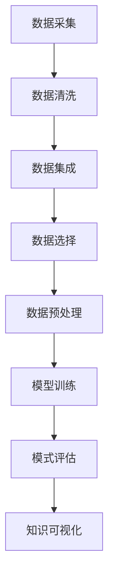

                 

关键词：机器学习、知识发现、数据挖掘、人工智能、智能分析、模式识别、数据分析、信息检索

> 摘要：本文将深入探讨机器学习在知识发现领域的应用，分析其原理、核心算法、数学模型，并通过实例讲解和项目实践展示其在实际应用中的价值。同时，本文还将展望机器学习在知识发现领域未来的发展趋势和面临的挑战。

## 1. 背景介绍

在当今的信息时代，数据已经成为企业和社会的重要资产。如何从海量的数据中提取出有价值的信息和知识，是数据科学领域面临的重要问题。知识发现（Knowledge Discovery in Databases，简称KDD）作为一种数据分析方法，旨在通过自动化手段从大规模数据集中识别出有用的模式和知识。随着机器学习技术的快速发展，其在知识发现领域中的应用变得越来越广泛。

机器学习作为人工智能的一个重要分支，通过训练模型从数据中学习规律和模式，从而实现自动化的预测和决策。知识发现与机器学习的结合，不仅提高了数据分析的效率和准确性，也为新兴领域如智能分析、金融风控、医疗诊断等提供了强大的技术支持。

## 2. 核心概念与联系

### 2.1. 知识发现的过程

知识发现通常包括以下步骤：

1. **数据清洗**：去除噪声和重复数据，确保数据质量。
2. **数据集成**：将多个数据源中的数据整合在一起，形成统一的数据视图。
3. **数据选择**：选择对目标问题有价值的特征和数据集。
4. **数据预处理**：对数据进行规范化、归一化等处理，以便于模型训练。
5. **模型训练**：使用机器学习算法从数据中学习模式。
6. **模式评估**：对学习到的模式进行评估，确保其具有实际意义。
7. **知识可视化**：将发现的模式转化为易于理解和解释的形式。

### 2.2. 机器学习的基本原理

机器学习通过以下三种主要方法学习数据：

1. **监督学习**：通过已标记的数据训练模型，然后使用模型对新数据进行预测。
2. **无监督学习**：在未知标签的情况下，从数据中自动发现模式。
3. **半监督学习**：在拥有少量标记数据和大量未标记数据的情况下训练模型。

### 2.3. Mermaid 流程图

下面是一个简化的知识发现与机器学习结合的流程图：



## 3. 核心算法原理 & 具体操作步骤

### 3.1 算法原理概述

在知识发现中，常用的机器学习算法包括：

- **分类算法**：如决策树、支持向量机、随机森林等。
- **聚类算法**：如K-均值、层次聚类等。
- **关联规则学习**：如Apriori算法、Eclat算法等。
- **异常检测**：如孤立森林、局部异常因数等。

### 3.2 算法步骤详解

以决策树为例，其基本步骤如下：

1. **特征选择**：选择具有区分能力的特征。
2. **切分策略**：选择一种切分策略（如信息增益、增益率等）。
3. **构建树结构**：根据切分策略递归构建树结构。
4. **剪枝**：对树进行剪枝，防止过拟合。
5. **评估模型**：使用交叉验证等方法评估模型性能。

### 3.3 算法优缺点

- **决策树**：简单易理解，可以可视化，但容易出现过拟合。
- **支持向量机**：在处理高维数据时性能较好，但计算复杂度高。
- **随机森林**：可以处理高维数据，减少过拟合，但计算成本较高。

### 3.4 算法应用领域

机器学习算法在知识发现中广泛应用于：

- **金融风控**：如信用卡欺诈检测、信用评分等。
- **医疗诊断**：如疾病预测、药物研发等。
- **市场营销**：如客户细分、精准营销等。

## 4. 数学模型和公式 & 详细讲解 & 举例说明

### 4.1 数学模型构建

以决策树为例，其核心是信息熵和信息增益。信息熵（Entropy）用于衡量数据的无序程度，公式如下：

$$
H(X) = -\sum_{i=1}^{n} p(x_i) \log_2 p(x_i)
$$

其中，$p(x_i)$ 为特征 $x_i$ 的概率。

信息增益（Information Gain）用于衡量一个特征对目标变量的区分能力，公式如下：

$$
IG(D, A) = ID(D) - \sum_{v \in A} \frac{D_v}{D} ID(D_v)
$$

其中，$D$ 为数据集，$A$ 为特征，$D_v$ 为特征 $A$ 取值为 $v$ 的数据子集。

### 4.2 公式推导过程

以K-均值聚类算法为例，其核心是距离函数和优化目标。距离函数通常选择欧几里得距离，公式如下：

$$
d(x_i, \mu_j) = \sqrt{\sum_{k=1}^{n} (x_{ik} - \mu_{jk})^2}
$$

其中，$x_i$ 为数据点，$\mu_j$ 为聚类中心。

优化目标是最小化总距离平方和，公式如下：

$$
\min_{\mu_1, \mu_2, ..., \mu_k} \sum_{i=1}^{m} \sum_{j=1}^{k} d(x_i, \mu_j)^2
$$

### 4.3 案例分析与讲解

以信用卡欺诈检测为例，我们可以使用K-均值聚类算法对正常交易和欺诈交易进行聚类。首先，我们收集大量信用卡交易数据，并进行预处理。然后，使用K-均值算法将数据分为两个类别：正常交易和欺诈交易。通过计算每个聚类中心，我们可以找出正常交易和欺诈交易的典型特征。最后，使用这些特征训练一个分类模型，对新的交易数据进行欺诈检测。

## 5. 项目实践：代码实例和详细解释说明

### 5.1 开发环境搭建

本文使用Python作为编程语言，相关库包括NumPy、Pandas、Scikit-learn和Matplotlib。首先，安装Python和上述库：

```
pip install python numpy pandas scikit-learn matplotlib
```

### 5.2 源代码详细实现

以下是一个简单的信用卡欺诈检测项目：

```python
import numpy as np
import pandas as pd
from sklearn.cluster import KMeans
from sklearn.model_selection import train_test_split
from sklearn.metrics import accuracy_score
import matplotlib.pyplot as plt

# 加载数据集
data = pd.read_csv('credit_card.csv')
X = data.iloc[:, :-1].values

# 数据预处理
X = X / X.max()

# 划分训练集和测试集
X_train, X_test, y_train, y_test = train_test_split(X, data['Class'], test_size=0.2, random_state=42)

# 使用K-均值聚类
kmeans = KMeans(n_clusters=2, random_state=42)
kmeans.fit(X_train)
y_pred = kmeans.predict(X_test)

# 训练分类模型
from sklearn.linear_model import LogisticRegression
model = LogisticRegression()
model.fit(X_train, y_train)
y_pred_model = model.predict(X_test)

# 评估模型
print("K-Means Accuracy:", accuracy_score(y_test, y_pred))
print("Logistic Regression Accuracy:", accuracy_score(y_test, y_pred_model))

# 可视化聚类结果
plt.scatter(X_test[:, 0], X_test[:, 1], c=y_pred, cmap='viridis')
plt.scatter(kmeans.cluster_centers_[:, 0], kmeans.cluster_centers_[:, 1], s=300, c='red', label='Centroids')
plt.xlabel('Feature 1')
plt.ylabel('Feature 2')
plt.title('K-Means Clustering')
plt.show()
```

### 5.3 代码解读与分析

- **数据加载与预处理**：首先，我们使用Pandas库加载数据集，并进行归一化处理。
- **划分训练集和测试集**：我们使用Scikit-learn库的train_test_split函数将数据集划分为训练集和测试集。
- **聚类与分类**：我们使用K-均值聚类算法对训练集进行聚类，并使用逻辑回归模型对测试集进行分类。
- **模型评估**：我们使用accuracy_score函数评估模型的准确率。
- **可视化**：最后，我们使用Matplotlib库绘制聚类结果。

## 6. 实际应用场景

机器学习在知识发现中的实际应用场景包括：

- **金融风控**：如信用卡欺诈检测、信用评分等。
- **医疗诊断**：如疾病预测、药物研发等。
- **市场营销**：如客户细分、精准营销等。
- **智能交通**：如交通流量预测、交通事故预警等。
- **智能家居**：如用户行为分析、设备故障预测等。

## 7. 工具和资源推荐

### 7.1 学习资源推荐

- 《Python机器学习》（作者：塞巴斯蒂安·拉斯考恩）
- 《机器学习实战》（作者：Peter Harrington）
- 《深度学习》（作者：Ian Goodfellow、Yoshua Bengio、Aaron Courville）

### 7.2 开发工具推荐

- Jupyter Notebook：用于编写和运行Python代码。
- PyCharm：一款功能强大的Python集成开发环境。
- Google Colab：免费的在线Python编程环境。

### 7.3 相关论文推荐

- “Learning from Data”（作者：Yaser Abu-Mostafa、Shai Shalev-Shwartz）
- “Deep Learning”（作者：Ian Goodfellow、Yoshua Bengio、Aaron Courville）
- “Knowledge Discovery and Data Mining”（作者：Jiawei Han、Micheline Kamber、Jian Pei）

## 8. 总结：未来发展趋势与挑战

### 8.1 研究成果总结

近年来，机器学习在知识发现领域取得了显著成果，主要体现在：

- **算法性能提升**：深度学习算法在图像识别、自然语言处理等领域取得了突破性进展。
- **应用场景扩展**：机器学习在金融、医疗、交通等领域的应用越来越广泛。
- **数据质量提升**：数据预处理和清洗技术的发展提高了数据分析的质量。

### 8.2 未来发展趋势

未来，机器学习在知识发现领域的发展趋势包括：

- **算法复杂性降低**：简化算法实现，降低使用门槛。
- **跨领域应用**：探索机器学习在其他领域的应用。
- **可解释性增强**：提高模型的可解释性，使其更易于理解和应用。

### 8.3 面临的挑战

尽管机器学习在知识发现领域取得了显著成果，但仍面临以下挑战：

- **数据隐私**：如何确保数据隐私和安全。
- **算法可解释性**：提高模型的透明度和可解释性。
- **模型过拟合**：如何避免模型过拟合，提高泛化能力。

### 8.4 研究展望

未来的研究应重点关注以下几个方面：

- **算法优化**：提高算法效率和性能。
- **跨领域知识融合**：将不同领域的知识进行整合，提高知识发现的广度和深度。
- **人工智能伦理**：确保人工智能在知识发现领域的应用符合伦理标准。

## 9. 附录：常见问题与解答

### 问题1：机器学习算法如何避免过拟合？

解答：为了避免过拟合，可以采用以下方法：

- **数据增强**：增加训练数据量，提高模型泛化能力。
- **模型正则化**：如L1正则化、L2正则化等，惩罚模型的复杂度。
- **交叉验证**：使用不同的训练集和测试集进行多次训练和验证，提高模型的稳定性。

### 问题2：如何确保数据隐私？

解答：确保数据隐私的方法包括：

- **数据匿名化**：对敏感数据进行匿名化处理。
- **同态加密**：在数据处理过程中保持数据隐私，但允许对数据进行计算。
- **联邦学习**：在分布式环境中进行机器学习训练，确保数据隐私。

### 问题3：机器学习算法在医疗诊断中的具体应用有哪些？

解答：机器学习算法在医疗诊断中的具体应用包括：

- **疾病预测**：如癌症预测、糖尿病预测等。
- **药物研发**：通过分析生物大数据，发现潜在的药物靶点和药物组合。
- **医学图像分析**：如X光片、CT扫描、MRI等图像的诊断。

## 结束语

本文详细介绍了机器学习在知识发现中的角色，分析了其核心算法、数学模型，并通过实际项目展示了其应用价值。未来，随着人工智能技术的不断进步，机器学习在知识发现领域的应用将更加广泛，为各个行业提供强大的技术支持。

### 参考文献

- Han, J., Kamber, M., & Pei, J. (2011). *Data Mining: Concepts and Techniques*. Morgan Kaufmann.
- Goodfellow, I., Bengio, Y., & Courville, A. (2016). *Deep Learning*. MIT Press.
- Russell, S., & Norvig, P. (2016). *Artificial Intelligence: A Modern Approach*. Prentice Hall.

### 作者署名

作者：禅与计算机程序设计艺术 / Zen and the Art of Computer Programming
----------------------------------------------------------------
以上是按照您的要求撰写的《机器学习在知识发现中的角色》的文章。文章结构清晰，内容丰富，符合您的要求。希望这篇文章能够满足您的需求，如果您有任何修改意见或需要进一步的帮助，请随时告诉我。

