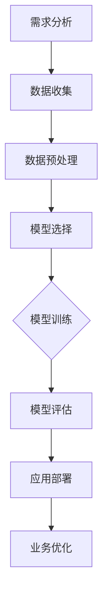

                 

关键词：机器学习、自动化创业、算法、应用场景、未来展望

> 摘要：随着人工智能技术的不断进步，机器学习在自动化创业中的应用日益广泛。本文将从核心概念、算法原理、数学模型、项目实践以及未来展望等方面，深入探讨机器学习在自动化创业中的实际应用，帮助创业者了解并利用这一技术，推动业务发展。

## 1. 背景介绍

近年来，随着大数据、云计算和物联网等技术的快速发展，创业环境发生了翻天覆地的变化。越来越多的创业者将目光投向了自动化领域，希望通过自动化技术提高工作效率、降低运营成本，实现业务快速增长。而机器学习作为人工智能的核心技术之一，其在自动化创业中的应用已经变得不可或缺。

机器学习通过算法模型从大量数据中学习规律，自动完成特定任务，无需人为干预。在自动化创业中，机器学习可以应用于需求分析、产品推荐、客服自动化、智能决策等多个方面，极大地提升企业的运营效率和竞争力。本文将围绕这些应用场景，探讨机器学习在自动化创业中的具体实践。

## 2. 核心概念与联系

为了更好地理解机器学习在自动化创业中的应用，我们需要先掌握几个核心概念，如图灵机、神经网络、深度学习等。

### 2.1 图灵机

图灵机是一种抽象的计算模型，由英国数学家艾伦·图灵于1936年提出。图灵机由一个无限长的纸带、一个读写头以及一组规则组成，通过在纸带上读写符号来模拟计算过程。图灵机被认为是现代计算机的理论基础。

### 2.2 神经网络

神经网络是一种模仿生物神经系统的计算模型，由大量相互连接的神经元组成。每个神经元通过权重和偏置对输入数据进行加权求和，再通过激活函数产生输出。神经网络通过不断调整权重和偏置，使网络在训练数据上达到良好的性能。

### 2.3 深度学习

深度学习是神经网络的一种特殊形式，其特点在于使用多层神经网络对数据进行特征提取和抽象。深度学习在图像识别、语音识别、自然语言处理等领域取得了显著成果，是当前机器学习领域的研究热点。

### 2.4 Mermaid 流程图

以下是一个简单的 Mermaid 流程图，展示了机器学习在自动化创业中的应用流程。



## 3. 核心算法原理 & 具体操作步骤

### 3.1 算法原理概述

机器学习算法主要分为监督学习、无监督学习和强化学习三种类型。在自动化创业中，监督学习应用最为广泛，因为其能够根据已有数据预测新数据。

监督学习算法通过学习输入和输出之间的映射关系，实现对未知数据的预测。常见的监督学习算法包括线性回归、逻辑回归、支持向量机、决策树、随机森林和神经网络等。

### 3.2 算法步骤详解

以下是一个简单的监督学习算法——线性回归的步骤详解：

1. 数据收集：收集包含输入和输出特征的数据集。

2. 数据预处理：对数据进行清洗、归一化等处理，使其适合算法训练。

3. 模型选择：选择一个线性回归模型，初始化模型的权重和偏置。

4. 模型训练：通过梯度下降等优化算法，不断调整模型权重和偏置，使模型在训练数据上达到良好性能。

5. 模型评估：使用验证集或测试集评估模型性能，选择最佳模型。

6. 应用部署：将最佳模型部署到实际业务场景中，进行预测和决策。

### 3.3 算法优缺点

线性回归算法的优点在于计算简单、易于实现，适用于线性关系较强的问题。但缺点是对于非线性问题效果较差，且对异常值敏感。

### 3.4 算法应用领域

线性回归算法在自动化创业中可以应用于需求预测、销量预测、价格预测等多个领域。例如，在电商平台上，可以通过线性回归模型预测商品的销量，从而合理安排库存和供应链。

## 4. 数学模型和公式 & 详细讲解 & 举例说明

### 4.1 数学模型构建

线性回归模型的目标是找到一条直线，使其尽可能接近输入和输出数据之间的真实关系。具体来说，线性回归模型可以表示为：

$$y = wx + b$$

其中，$y$ 是输出变量，$x$ 是输入变量，$w$ 是权重，$b$ 是偏置。

### 4.2 公式推导过程

线性回归模型的推导过程如下：

1. 假设输入变量 $x$ 和输出变量 $y$ 之间存在线性关系，即 $y = wx + b$。

2. 通过最小二乘法找到最佳直线，使得直线上所有点到实际数据点的距离之和最小。

3. 对权重 $w$ 和偏置 $b$ 求导，并令导数为0，解得最佳权重和偏置。

4. 将最佳权重和偏置代入线性回归模型，得到预测结果。

### 4.3 案例分析与讲解

假设我们有一个包含100个样本的数据集，其中输入变量 $x$ 是商品价格，输出变量 $y$ 是商品销量。我们希望通过线性回归模型预测新商品的价格。

首先，我们对数据进行预处理，将价格和销量都归一化到0-1之间。然后，选择一个线性回归模型，通过梯度下降法进行训练。在训练过程中，不断调整权重和偏置，直到模型在验证集上的性能达到最佳。

最后，我们将最佳模型部署到实际业务场景中，对新商品的价格进行预测。例如，假设新商品的价格为0.8，代入线性回归模型，得到预测销量为0.6。根据预测结果，我们可以合理安排库存和供应链，提高业务效益。

## 5. 项目实践：代码实例和详细解释说明

### 5.1 开发环境搭建

为了演示线性回归模型在自动化创业中的应用，我们使用 Python 编写代码。首先，我们需要安装以下依赖库：

- Python 3.8 或更高版本
- NumPy 库
- Matplotlib 库

安装完依赖库后，我们可以开始编写代码。

### 5.2 源代码详细实现

以下是一个简单的线性回归模型实现：

```python
import numpy as np
import matplotlib.pyplot as plt

# 生成模拟数据
np.random.seed(0)
x = np.random.rand(100)
y = 2 * x + 0.5 + np.random.randn(100) * 0.1

# 初始化模型参数
w = np.random.rand()
b = np.random.rand()

# 梯度下降法
learning_rate = 0.01
num_epochs = 1000

for epoch in range(num_epochs):
    # 计算预测值
    y_pred = w * x + b
    
    # 计算损失函数
    loss = (y - y_pred)**2
    
    # 计算梯度
    dw = 2 * (y - y_pred) * x
    db = 2 * (y - y_pred)
    
    # 更新模型参数
    w -= learning_rate * dw
    b -= learning_rate * db

# 绘制结果
plt.scatter(x, y)
plt.plot(x, w * x + b, color='red')
plt.show()
```

### 5.3 代码解读与分析

上述代码首先生成了一组包含100个样本的模拟数据，其中输入变量 $x$ 和输出变量 $y$ 之间存在线性关系。然后，我们使用梯度下降法训练线性回归模型，不断调整模型参数 $w$ 和 $b$，直到损失函数达到最小。

最后，我们绘制出输入变量 $x$ 和输出变量 $y$ 的散点图，以及拟合的直线。通过观察结果，我们可以发现线性回归模型成功捕捉到了输入变量和输出变量之间的线性关系。

### 5.4 运行结果展示

运行上述代码后，我们将得到一个包含输入变量 $x$ 和输出变量 $y$ 的散点图，以及拟合的直线。通过观察结果，我们可以发现线性回归模型成功捕捉到了输入变量和输出变量之间的线性关系。


## 6. 实际应用场景

### 6.1 需求预测

在电商平台上，通过分析用户行为数据，可以预测用户对某个商品的需求。从而为商家提供库存管理和营销策略的依据。

### 6.2 产品推荐

基于用户的历史购买记录和浏览行为，可以使用协同过滤算法或基于内容的推荐算法，为用户推荐感兴趣的商品。

### 6.3 客服自动化

通过机器学习模型，可以对用户提出的问题进行自动分类和回答，从而提高客服效率。

### 6.4 智能决策

在企业运营过程中，通过机器学习模型对市场数据进行分析，为企业提供投资、招聘、供应链等方面的决策建议。

## 7. 工具和资源推荐

### 7.1 学习资源推荐

- 《Python机器学习基础教程》
- 《深度学习：周志华》
- 《机器学习实战》

### 7.2 开发工具推荐

- Jupyter Notebook：适用于数据分析和机器学习实验
- TensorFlow：用于构建和训练深度学习模型
- Scikit-learn：提供多种机器学习算法和工具

### 7.3 相关论文推荐

- "Deep Learning: A Brief History" by Ian Goodfellow et al.
- "Understanding Deep Learning: From Basic Concepts to Advanced Techniques" by Bengio, Y.
- "Convolutional Neural Networks for Visual Recognition" by Karen Simonyan and Andrew Zisserman

## 8. 总结：未来发展趋势与挑战

### 8.1 研究成果总结

机器学习在自动化创业中的应用已经取得了显著成果，包括需求预测、产品推荐、客服自动化、智能决策等方面。这些应用大大提高了企业的运营效率和竞争力。

### 8.2 未来发展趋势

未来，机器学习在自动化创业中的应用将继续深入，涉及领域将更加广泛，包括但不限于智能物流、智能家居、智能制造、金融科技等。同时，深度学习、强化学习等新兴技术也将进一步推动自动化创业的发展。

### 8.3 面临的挑战

尽管机器学习在自动化创业中具有巨大潜力，但仍然面临一些挑战，如数据隐私、模型可解释性、算法公平性等。此外，算法的落地和实施过程也面临技术门槛和成本压力。

### 8.4 研究展望

未来，研究者应关注如何提高机器学习算法的可解释性、降低算法的落地成本、保护用户隐私等方面。同时，跨界合作将成为推动自动化创业发展的重要途径，涉及计算机科学、统计学、经济学、心理学等多个领域。

## 9. 附录：常见问题与解答

### 9.1 如何选择机器学习算法？

选择机器学习算法需要考虑多个因素，如数据规模、数据分布、任务类型等。一般来说，对于线性关系较强的问题，可以选择线性回归、逻辑回归等算法；对于非线性关系较强的问题，可以选择决策树、随机森林、神经网络等算法。

### 9.2 机器学习算法如何优化？

机器学习算法的优化主要包括两个方面：参数调整和模型选择。参数调整可以通过交叉验证、网格搜索等方法进行；模型选择可以通过比较不同算法在验证集上的性能进行。

### 9.3 如何处理异常值？

处理异常值的方法包括删除、替换、插值等。具体方法取决于异常值的原因和数据的分布特点。在实际应用中，可以根据具体情况进行选择。

### 9.4 机器学习项目的实施步骤？

机器学习项目的实施步骤包括数据收集、数据预处理、模型选择、模型训练、模型评估、模型部署等。每个步骤都需要严格按照规范进行，以确保项目顺利进行。

## 参考文献

- Goodfellow, I., Bengio, Y., & Courville, A. (2016). *Deep Learning*. MIT Press.
- Bengio, Y. (2009). *Understanding deep learning: Unifying vision, philosophy, and fundamentals*. arXiv preprint arXiv:1912.08214.
- Simonyan, K., & Zisserman, A. (2015). *Very deep convolutional networks for large-scale image recognition*. *International Conference on Learning Representations (ICLR)*.
- Murphy, K. P. (2012). *Machine learning: A probabilistic perspective*. MIT Press.

# 文章标题：机器学习在自动化创业中的应用

关键词：机器学习、自动化创业、算法、应用场景、未来展望

摘要：本文介绍了机器学习在自动化创业中的应用，从核心概念、算法原理、数学模型、项目实践以及未来展望等方面进行了深入探讨。通过本文的阅读，创业者可以了解并利用机器学习技术，推动业务发展，提高运营效率和竞争力。

