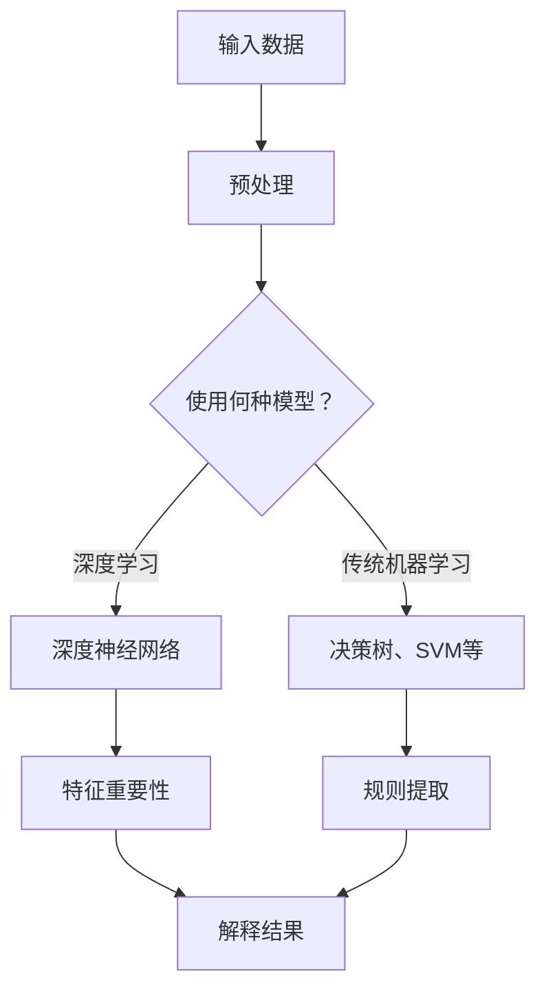

                 

关键词：机器学习，模型解释性，可解释性，透明性，算法，技术，应用，未来趋势

> 摘要：本文旨在探讨机器学习模型解释性技术的重要性及其在当前人工智能领域中的应用。通过对现有解释性技术的详细分析，本文揭示了当前技术面临的挑战和未来的发展方向，旨在为研究人员和开发者提供有价值的参考。

## 1. 背景介绍

随着机器学习和深度学习的迅速发展，越来越多的复杂模型被应用到各种实际场景中，如自然语言处理、计算机视觉、推荐系统等。然而，这些复杂模型往往具有高度的不可解释性，使得用户难以理解和信任其决策过程。这种现象被称为“黑箱问题”（black-box problem）。为了解决这一问题，研究人员开始关注机器学习模型的解释性技术，旨在提高模型的透明性和可解释性，使其更加符合人类直觉，更容易被用户理解和接受。

### 黑箱问题的产生

黑箱问题源于机器学习模型本身的结构和训练过程。传统的机器学习模型，如决策树、支持向量机等，其决策过程相对直观，用户可以通过模型的结构和参数了解其工作原理。然而，随着深度学习技术的发展，神经网络等复杂模型逐渐成为主流。这些模型通常具有大量隐藏层和神经元，决策过程高度非线性，使得其内部机制变得复杂难以理解。

### 解释性技术的需求

在许多实际应用中，如金融、医疗、司法等领域，决策的透明性和可解释性至关重要。一方面，用户需要了解模型的决策依据，以确保模型的可靠性和公平性。另一方面，监管机构和法律要求对模型的决策过程进行透明化，以减少潜在的道德和法律风险。因此，解释性技术的需求日益迫切。

## 2. 核心概念与联系

### 可解释性（Interpretability）

可解释性是指用户能够理解模型的决策过程和输出结果的能力。在机器学习领域，可解释性通常分为三个层次：

- **局部可解释性**：针对单个预测结果，解释模型在特定输入下的决策过程。
- **全局可解释性**：解释模型在整体上的工作原理和性能表现。
- **透明性**：模型的结构和参数完全公开，用户可以完全理解模型的工作机制。

### 透明性（Transparency）

透明性是指模型内部的所有信息和操作都对外部用户可见。透明性较高的模型，用户可以查看模型的源代码、参数设置和训练过程，从而深入了解模型的工作机制。

### Mermaid 流程图

下面是一个简单的 Mermaid 流程图，展示了机器学习模型解释性技术的基本架构。



## 3. 核心算法原理 & 具体操作步骤

### 3.1 算法原理概述

机器学习模型解释性技术主要分为以下几类：

- **特征重要性**：通过分析模型对各个特征的依赖程度，揭示模型决策的关键因素。
- **规则提取**：从模型中提取规则或决策路径，使其更加直观易懂。
- **可视化**：通过图形化手段展示模型的结构和决策过程。
- **对抗性攻击**：通过构建对抗性样本，揭示模型的脆弱性和潜在问题。

### 3.2 算法步骤详解

1. **数据预处理**：对输入数据进行标准化、归一化等处理，确保数据质量。
2. **模型选择**：根据应用场景选择合适的模型，如深度学习模型或传统机器学习模型。
3. **特征重要性分析**：
   - 对于深度学习模型，可以使用梯度方法、模型集成等方法计算特征重要性。
   - 对于传统机器学习模型，可以直接分析特征权重。
4. **规则提取**：
   - 使用决策树、随机森林等模型，可以直接提取规则。
   - 对于深度学习模型，可以使用LIME（Local Interpretable Model-agnostic Explanations）等方法提取局部规则。
5. **可视化**：
   - 使用热力图、决策路径图等方法展示模型的结构和决策过程。
   - 对于深度学习模型，可以使用可视化工具（如TensorFlow的TensorBoard）展示网络结构。
6. **对抗性攻击**：
   - 构建对抗性样本，分析模型在对抗性样本上的表现。
   - 使用对抗性攻击工具（如FGSM、JSMA等）对模型进行攻击。

### 3.3 算法优缺点

- **特征重要性**：
  - 优点：直观、易于理解，可以揭示模型决策的关键因素。
  - 缺点：仅适用于局部可解释性，无法提供全局解释。

- **规则提取**：
  - 优点：规则直观、易于理解，适用于多种模型。
  - 缺点：规则提取可能丢失模型的部分信息，导致解释不够准确。

- **可视化**：
  - 优点：直观、易于理解，可以展示模型的结构和决策过程。
  - 缺点：仅适用于特定类型的模型，且可能无法展示全局解释。

- **对抗性攻击**：
  - 优点：可以揭示模型的脆弱性和潜在问题。
  - 缺点：对抗性攻击可能影响模型的性能，且需要大量计算资源。

### 3.4 算法应用领域

机器学习模型解释性技术广泛应用于多个领域：

- **金融**：风险评估、信用评分、投资决策等。
- **医疗**：疾病诊断、治疗方案推荐、药物发现等。
- **司法**：案件分析、证据评估、法律咨询等。
- **推荐系统**：推荐算法解释、用户行为分析等。

## 4. 数学模型和公式 & 详细讲解 & 举例说明

### 4.1 数学模型构建

机器学习模型解释性技术的数学模型主要包括以下几部分：

1. **特征表示**：对输入数据进行特征提取和转换。
2. **模型参数**：模型的结构和参数。
3. **决策过程**：模型的预测过程和输出结果。

### 4.2 公式推导过程

以深度神经网络为例，其决策过程可以表示为：

$$
\text{输出} = \sigma(\text{权重} \cdot \text{特征} + \text{偏置})
$$

其中，$\sigma$ 表示激活函数，如ReLU、Sigmoid等；权重和特征分别表示模型参数和输入特征。

### 4.3 案例分析与讲解

假设我们有一个简单的深度神经网络，用于分类任务。输入特征为$X = (x_1, x_2, ..., x_n)$，输出为$Y = (y_1, y_2, ..., y_m)$。其中，$y_1, y_2, ..., y_m$ 为标签。

1. **特征表示**：对输入数据进行归一化处理，使其满足$X \in [-1, 1]$。
2. **模型参数**：假设网络结构为$1$个输入层、$1$个隐藏层和$1$个输出层，隐藏层有$10$个神经元。
3. **决策过程**：对输入特征$X$进行前向传播，得到输出$Y$。

$$
\text{隐藏层输出} = \sigma(\text{权重} \cdot \text{特征} + \text{偏置})
$$

$$
\text{输出层输出} = \text{权重} \cdot \text{隐藏层输出} + \text{偏置}
$$

4. **损失函数**：使用交叉熵损失函数评估模型的预测误差。

$$
\text{损失} = -\sum_{i=1}^{m} y_i \log(\hat{y}_i)
$$

其中，$y_i$ 为标签，$\hat{y}_i$ 为预测输出。

5. **优化方法**：使用梯度下降法更新模型参数，最小化损失函数。

$$
\text{权重} \leftarrow \text{权重} - \alpha \cdot \frac{\partial}{\partial \text{权重}} \text{损失}
$$

$$
\text{偏置} \leftarrow \text{偏置} - \alpha \cdot \frac{\partial}{\partial \text{偏置}} \text{损失}
$$

## 5. 项目实践：代码实例和详细解释说明

### 5.1 开发环境搭建

1. 安装 Python（建议使用 3.8 或以上版本）。
2. 安装 TensorFlow、Keras、NumPy、Matplotlib 等相关库。

```bash
pip install tensorflow numpy matplotlib
```

### 5.2 源代码详细实现

下面是一个简单的示例，展示了如何使用 Keras 构建和训练一个深度神经网络，并使用 LIME 进行局部解释。

```python
import numpy as np
import matplotlib.pyplot as plt
from tensorflow.keras.models import Sequential
from tensorflow.keras.layers import Dense
from tensorflow.keras.optimizers import Adam
from sklearn.datasets import make_classification
from sklearn.model_selection import train_test_split
from lime import lime_tabular

# 生成模拟数据集
X, y = make_classification(n_samples=100, n_features=10, n_classes=2, random_state=42)
X_train, X_test, y_train, y_test = train_test_split(X, y, test_size=0.2, random_state=42)

# 构建深度神经网络模型
model = Sequential()
model.add(Dense(10, input_dim=10, activation='relu'))
model.add(Dense(1, activation='sigmoid'))
model.compile(optimizer=Adam(), loss='binary_crossentropy', metrics=['accuracy'])

# 训练模型
model.fit(X_train, y_train, epochs=10, batch_size=10, validation_split=0.1)

# 评估模型
loss, accuracy = model.evaluate(X_test, y_test)
print(f"Test Accuracy: {accuracy:.4f}")

# 使用 LIME 进行局部解释
explainer = lime_tabular.LimeTabularExplainer(X_train, feature_names=['Feature ' + str(i) for i in range(10)], class_names=['Class 0', 'Class 1'], discretize_continuous=True)
i = 50  # 需要解释的样本索引
exp = explainer.explain_instance(X_test[i], model.predict, num_features=10)
exp.show_in_notebook(show_table=False)
```

### 5.3 代码解读与分析

- **数据预处理**：使用 `make_classification` 函数生成模拟数据集。数据集包含$100$个样本，每个样本有$10$个特征，分为两个类别。
- **模型构建**：使用 Keras 的 `Sequential` 模型构建一个简单的深度神经网络，包含一个输入层、一个隐藏层和一个输出层。
- **模型训练**：使用 `model.fit` 方法训练模型，使用 Adam 优化器和二分类交叉熵损失函数。
- **模型评估**：使用 `model.evaluate` 方法评估模型在测试集上的准确率。
- **局部解释**：使用 LIME（Local Interpretable Model-agnostic Explanations）库对模型进行局部解释。选择一个样本，使用 `LimeTabularExplainer` 创建解释器，并调用 `explain_instance` 方法生成解释。

## 6. 实际应用场景

### 6.1 金融领域

在金融领域，机器学习模型解释性技术有助于提高金融产品的透明性和合规性。例如，在信用评分模型中，解释性技术可以帮助银行分析客户的风险因素，从而提高信用评分的公正性和准确性。

### 6.2 医疗领域

在医疗领域，机器学习模型解释性技术有助于医生理解和信任模型预测结果。例如，在疾病诊断模型中，解释性技术可以帮助医生了解模型如何根据患者的症状和检查结果做出诊断。

### 6.3 司法领域

在司法领域，机器学习模型解释性技术有助于确保司法决策的透明性和公正性。例如，在案件分析模型中，解释性技术可以帮助法官了解模型如何评估证据的可靠性。

### 6.4 推荐系统

在推荐系统领域，机器学习模型解释性技术有助于提高用户对推荐结果的理解和信任。例如，在电子商务平台中，解释性技术可以帮助用户了解推荐算法如何根据他们的购物历史和偏好推荐商品。

## 7. 工具和资源推荐

### 7.1 学习资源推荐

- 《机器学习》（周志华著）：系统介绍了机器学习的基本概念、方法和应用。
- 《深度学习》（Goodfellow、Bengio、Courville 著）：深入讲解了深度学习的基础理论和实践方法。

### 7.2 开发工具推荐

- TensorFlow：用于构建和训练深度学习模型的强大框架。
- Keras：基于 TensorFlow 的简单易用的深度学习框架。
- Scikit-learn：用于机器学习的经典库，包含多种算法和工具。

### 7.3 相关论文推荐

- **Lundberg, S. M., & Lee, S. I. (2017). A Unified Approach to Interpreting Model Predictions. In Proceedings of the 34th International Conference on Machine Learning (pp. 4765-4774).**
- **Ribeiro, M. T., Singh, S., & Guestrin, C. (2016). "Why should I trust you?” Explaining the predictions of any classifier. In Proceedings of the 22nd ACM SIGKDD International Conference on Knowledge Discovery and Data Mining (pp. 1135-1144).**

## 8. 总结：未来发展趋势与挑战

### 8.1 研究成果总结

机器学习模型解释性技术已经取得了一系列重要研究成果，包括特征重要性分析、规则提取、可视化技术、对抗性攻击等。这些技术在不同领域取得了广泛应用，提高了模型的透明性和可解释性，有助于解决“黑箱问题”。

### 8.2 未来发展趋势

未来，机器学习模型解释性技术有望在以下几个方面取得突破：

- **跨领域研究**：结合不同领域的知识，开发更适用于特定场景的解释性技术。
- **可解释性评估**：建立可解释性评估标准，确保解释性技术的有效性和可靠性。
- **高效算法**：开发更高效的解释性算法，降低计算成本。

### 8.3 面临的挑战

尽管机器学习模型解释性技术取得了一定的进展，但仍面临以下挑战：

- **性能与解释性平衡**：如何在提高模型性能的同时保持解释性。
- **算法适应性**：现有解释性技术往往针对特定类型的模型，如何推广到更广泛的模型。
- **计算资源**：解释性技术通常需要大量计算资源，如何优化算法降低计算成本。

### 8.4 研究展望

随着人工智能技术的不断进步，机器学习模型解释性技术将在未来发挥越来越重要的作用。研究人员和开发者需要不断探索新的方法和技术，以提高模型的透明性和可解释性，为人工智能的应用提供更好的保障。

## 9. 附录：常见问题与解答

### 9.1 什么是黑箱问题？

黑箱问题指的是机器学习模型在做出预测时，其内部决策过程不透明，用户难以理解其如何得出预测结果的问题。

### 9.2 解释性技术与透明性有何区别？

解释性技术关注的是用户能否理解模型的决策过程，而透明性关注的是模型的所有信息是否对外部用户可见。解释性技术可能无法保证透明性，但透明性一定包含解释性。

### 9.3 解释性技术在哪些领域应用广泛？

解释性技术广泛应用于金融、医疗、司法、推荐系统等多个领域，以提高模型的可解释性和透明性。

### 9.4 如何评估解释性技术的有效性？

评估解释性技术的有效性可以从以下几个方面考虑：

- **准确性**：解释结果是否与模型预测一致。
- **可理解性**：解释结果是否易于用户理解。
- **实用性**：解释结果在实际应用中的可行性和有效性。

## 作者署名

作者：禅与计算机程序设计艺术 / Zen and the Art of Computer Programming
----------------------------------------------------------------

### 文章标题：机器学习模型解释性技术探讨

#### 文章关键词：机器学习，模型解释性，可解释性，透明性，算法，技术，应用，未来趋势

> 摘要：本文旨在探讨机器学习模型解释性技术的重要性及其在当前人工智能领域中的应用。通过对现有解释性技术的详细分析，本文揭示了当前技术面临的挑战和未来的发展方向，旨在为研究人员和开发者提供有价值的参考。

## 1. 背景介绍

随着机器学习和深度学习的迅速发展，越来越多的复杂模型被应用到各种实际场景中，如自然语言处理、计算机视觉、推荐系统等。然而，这些复杂模型往往具有高度的不可解释性，使得用户难以理解和信任其决策过程。这种现象被称为“黑箱问题”（black-box problem）。为了解决这一问题，研究人员开始关注机器学习模型的解释性技术，旨在提高模型的透明性和可解释性，使其更加符合人类直觉，更容易被用户理解和接受。

### 黑箱问题的产生

黑箱问题源于机器学习模型本身的结构和训练过程。传统的机器学习模型，如决策树、支持向量机等，其决策过程相对直观，用户可以通过模型的结构和参数了解其工作原理。然而，随着深度学习技术的发展，神经网络等复杂模型逐渐成为主流。这些模型通常具有大量隐藏层和神经元，决策过程高度非线性，使得其内部机制变得复杂难以理解。

### 解释性技术的需求

在许多实际应用中，如金融、医疗、司法等领域，决策的透明性和可解释性至关重要。一方面，用户需要了解模型的决策依据，以确保模型的可靠性和公平性。另一方面，监管机构和法律要求对模型的决策过程进行透明化，以减少潜在的道德和法律风险。因此，解释性技术的需求日益迫切。

## 2. 核心概念与联系

### 可解释性（Interpretability）

可解释性是指用户能够理解模型的决策过程和输出结果的能力。在机器学习领域，可解释性通常分为以下三个层次：

1. **局部可解释性**：针对单个预测结果，解释模型在特定输入下的决策过程。
2. **全局可解释性**：解释模型在整体上的工作原理和性能表现。
3. **透明性**：模型的结构和参数完全公开，用户可以完全理解模型的工作机制。

### 透明性（Transparency）

透明性是指模型内部的所有信息和操作都对外部用户可见。透明性较高的模型，用户可以查看模型的源代码、参数设置和训练过程，从而深入了解模型的工作机制。

### Mermaid 流程图

下面是一个简单的 Mermaid 流程图，展示了机器学习模型解释性技术的基本架构。


## 3. 核心算法原理 & 具体操作步骤

### 3.1 算法原理概述

机器学习模型解释性技术主要分为以下几类：

1. **特征重要性**：通过分析模型对各个特征的依赖程度，揭示模型决策的关键因素。
2. **规则提取**：从模型中提取规则或决策路径，使其更加直观易懂。
3. **可视化**：通过图形化手段展示模型的结构和决策过程。
4. **对抗性攻击**：通过构建对抗性样本，揭示模型的脆弱性和潜在问题。

### 3.2 算法步骤详解

1. **数据预处理**：对输入数据进行标准化、归一化等处理，确保数据质量。
2. **模型选择**：根据应用场景选择合适的模型，如深度学习模型或传统机器学习模型。
3. **特征重要性分析**：
   - 对于深度学习模型，可以使用梯度方法、模型集成等方法计算特征重要性。
   - 对于传统机器学习模型，可以直接分析特征权重。
4. **规则提取**：
   - 使用决策树、随机森林等模型，可以直接提取规则。
   - 对于深度学习模型，可以使用 LIME（Local Interpretable Model-agnostic Explanations）等方法提取局部规则。
5. **可视化**：
   - 使用热力图、决策路径图等方法展示模型的结构和决策过程。
   - 对于深度学习模型，可以使用可视化工具（如 TensorFlow 的 TensorBoard）展示网络结构。
6. **对抗性攻击**：
   - 构建对抗性样本，分析模型在对抗性样本上的表现。
   - 使用对抗性攻击工具（如 FGSM、JSMA 等）对模型进行攻击。

### 3.3 算法优缺点

- **特征重要性**：
  - 优点：直观、易于理解，可以揭示模型决策的关键因素。
  - 缺点：仅适用于局部可解释性，无法提供全局解释。
- **规则提取**：
  - 优点：规则直观、易于理解，适用于多种模型。
  - 缺点：规则提取可能丢失模型的部分信息，导致解释不够准确。
- **可视化**：
  - 优点：直观、易于理解，可以展示模型的结构和决策过程。
  - 缺点：仅适用于特定类型的模型，且可能无法展示全局解释。
- **对抗性攻击**：
  - 优点：可以揭示模型的脆弱性和潜在问题。
  - 缺点：对抗性攻击可能影响模型的性能，且需要大量计算资源。

### 3.4 算法应用领域

机器学习模型解释性技术广泛应用于多个领域：

- **金融**：风险评估、信用评分、投资决策等。
- **医疗**：疾病诊断、治疗方案推荐、药物发现等。
- **司法**：案件分析、证据评估、法律咨询等。
- **推荐系统**：推荐算法解释、用户行为分析等。

## 4. 数学模型和公式 & 详细讲解 & 举例说明

### 4.1 数学模型构建

机器学习模型解释性技术的数学模型主要包括以下几部分：

1. **特征表示**：对输入数据进行特征提取和转换。
2. **模型参数**：模型的结构和参数。
3. **决策过程**：模型的预测过程和输出结果。

### 4.2 公式推导过程

以深度神经网络为例，其决策过程可以表示为：

$$
\text{输出} = \sigma(\text{权重} \cdot \text{特征} + \text{偏置})
$$

其中，$\sigma$ 表示激活函数，如 ReLU、Sigmoid 等；权重和特征分别表示模型参数和输入特征。

### 4.3 案例分析与讲解

假设我们有一个简单的深度神经网络，用于分类任务。输入特征为 $X = (x_1, x_2, ..., x_n)$，输出为 $Y = (y_1, y_2, ..., y_m)$。其中，$y_1, y_2, ..., y_m$ 为标签。

1. **特征表示**：对输入数据进行归一化处理，使其满足 $X \in [-1, 1]$。
2. **模型参数**：假设网络结构为 $1$ 个输入层、$1$ 个隐藏层和 $1$ 个输出层，隐藏层有 $10$ 个神经元。
3. **决策过程**：对输入特征 $X$ 进行前向传播，得到输出 $Y$。

$$
\text{隐藏层输出} = \sigma(\text{权重} \cdot \text{特征} + \text{偏置})
$$

$$
\text{输出层输出} = \text{权重} \cdot \text{隐藏层输出} + \text{偏置}
$$

4. **损失函数**：使用交叉熵损失函数评估模型的预测误差。

$$
\text{损失} = -\sum_{i=1}^{m} y_i \log(\hat{y}_i)
$$

5. **优化方法**：使用梯度下降法更新模型参数，最小化损失函数。

$$
\text{权重} \leftarrow \text{权重} - \alpha \cdot \frac{\partial}{\partial \text{权重}} \text{损失}
$$

$$
\text{偏置} \leftarrow \text{偏置} - \alpha \cdot \frac{\partial}{\partial \text{偏置}} \text{损失}
$$

## 5. 项目实践：代码实例和详细解释说明

### 5.1 开发环境搭建

1. 安装 Python（建议使用 3.8 或以上版本）。
2. 安装 TensorFlow、Keras、NumPy、Matplotlib 等相关库。

```bash
pip install tensorflow numpy matplotlib
```

### 5.2 源代码详细实现

下面是一个简单的示例，展示了如何使用 Keras 构建和训练一个深度神经网络，并使用 LIME 进行局部解释。

```python
import numpy as np
import matplotlib.pyplot as plt
from tensorflow.keras.models import Sequential
from tensorflow.keras.layers import Dense
from tensorflow.keras.optimizers import Adam
from sklearn.datasets import make_classification
from sklearn.model_selection import train_test_split
from lime import lime_tabular

# 生成模拟数据集
X, y = make_classification(n_samples=100, n_features=10, n_classes=2, random_state=42)
X_train, X_test, y_train, y_test = train_test_split(X, y, test_size=0.2, random_state=42)

# 构建深度神经网络模型
model = Sequential()
model.add(Dense(10, input_dim=10, activation='relu'))
model.add(Dense(1, activation='sigmoid'))
model.compile(optimizer=Adam(), loss='binary_crossentropy', metrics=['accuracy'])

# 训练模型
model.fit(X_train, y_train, epochs=10, batch_size=10, validation_split=0.1)

# 评估模型
loss, accuracy = model.evaluate(X_test, y_test)
print(f"Test Accuracy: {accuracy:.4f}")

# 使用 LIME 进行局部解释
explainer = lime_tabular.LimeTabularExplainer(X_train, feature_names=['Feature ' + str(i) for i in range(10)], class_names=['Class 0', 'Class 1'], discretize_continuous=True)
i = 50  # 需要解释的样本索引
exp = explainer.explain_instance(X_test[i], model.predict, num_features=10)
exp.show_in_notebook(show_table=False)
```

### 5.3 代码解读与分析

- **数据预处理**：使用 `make_classification` 函数生成模拟数据集。数据集包含$100$个样本，每个样本有$10$个特征，分为两个类别。
- **模型构建**：使用 Keras 的 `Sequential` 模型构建一个简单的深度神经网络，包含一个输入层、一个隐藏层和一个输出层。
- **模型训练**：使用 `model.fit` 方法训练模型，使用 Adam 优化器和二分类交叉熵损失函数。
- **模型评估**：使用 `model.evaluate` 方法评估模型在测试集上的准确率。
- **局部解释**：使用 LIME（Local Interpretable Model-agnostic Explanations）库对模型进行局部解释。选择一个样本，使用 `LimeTabularExplainer` 创建解释器，并调用 `explain_instance` 方法生成解释。

## 6. 实际应用场景

### 6.1 金融领域

在金融领域，机器学习模型解释性技术有助于提高金融产品的透明性和合规性。例如，在信用评分模型中，解释性技术可以帮助银行分析客户的风险因素，从而提高信用评分的公正性和准确性。

### 6.2 医疗领域

在医疗领域，机器学习模型解释性技术有助于医生理解和信任模型预测结果。例如，在疾病诊断模型中，解释性技术可以帮助医生了解模型如何根据患者的症状和检查结果做出诊断。

### 6.3 司法领域

在司法领域，机器学习模型解释性技术有助于确保司法决策的透明性和公正性。例如，在案件分析模型中，解释性技术可以帮助法官了解模型如何评估证据的可靠性。

### 6.4 推荐系统

在推荐系统领域，机器学习模型解释性技术有助于提高用户对推荐结果的理解和信任。例如，在电子商务平台中，解释性技术可以帮助用户了解推荐算法如何根据他们的购物历史和偏好推荐商品。

## 7. 工具和资源推荐

### 7.1 学习资源推荐

- 《机器学习》（周志华著）：系统介绍了机器学习的基本概念、方法和应用。
- 《深度学习》（Goodfellow、Bengio、Courville 著）：深入讲解了深度学习的基础理论和实践方法。

### 7.2 开发工具推荐

- TensorFlow：用于构建和训练深度学习模型的强大框架。
- Keras：基于 TensorFlow 的简单易用的深度学习框架。
- Scikit-learn：用于机器学习的经典库，包含多种算法和工具。

### 7.3 相关论文推荐

- **Lundberg, S. M., & Lee, S. I. (2017). A Unified Approach to Interpreting Model Predictions. In Proceedings of the 34th International Conference on Machine Learning (pp. 4765-4774).**
- **Ribeiro, M. T., Singh, S., & Guestrin, C. (2016). "Why should I trust you?" Explaining the predictions of any classifier. In Proceedings of the 22nd ACM SIGKDD International Conference on Knowledge Discovery and Data Mining (pp. 1135-1144).**

## 8. 总结：未来发展趋势与挑战

### 8.1 研究成果总结

机器学习模型解释性技术已经取得了一系列重要研究成果，包括特征重要性分析、规则提取、可视化技术、对抗性攻击等。这些技术在不同领域取得了广泛应用，提高了模型的透明性和可解释性，有助于解决“黑箱问题”。

### 8.2 未来发展趋势

未来，机器学习模型解释性技术有望在以下几个方面取得突破：

- **跨领域研究**：结合不同领域的知识，开发更适用于特定场景的解释性技术。
- **可解释性评估**：建立可解释性评估标准，确保解释性技术的有效性和可靠性。
- **高效算法**：开发更高效的解释性算法，降低计算成本。

### 8.3 面临的挑战

尽管机器学习模型解释性技术取得了一定的进展，但仍面临以下挑战：

- **性能与解释性平衡**：如何在提高模型性能的同时保持解释性。
- **算法适应性**：现有解释性技术往往针对特定类型的模型，如何推广到更广泛的模型。
- **计算资源**：解释性技术通常需要大量计算资源，如何优化算法降低计算成本。

### 8.4 研究展望

随着人工智能技术的不断进步，机器学习模型解释性技术将在未来发挥越来越重要的作用。研究人员和开发者需要不断探索新的方法和技术，以提高模型的透明性和可解释性，为人工智能的应用提供更好的保障。

## 9. 附录：常见问题与解答

### 9.1 什么是黑箱问题？

黑箱问题指的是机器学习模型在做出预测时，其内部决策过程不透明，用户难以理解其如何得出预测结果的问题。

### 9.2 解释性技术与透明性有何区别？

解释性技术关注的是用户能否理解模型的决策过程，而透明性关注的是模型的所有信息是否对外部用户可见。解释性技术可能无法保证透明性，但透明性一定包含解释性。

### 9.3 解释性技术在哪些领域应用广泛？

解释性技术广泛应用于金融、医疗、司法、推荐系统等多个领域，以提高模型的可解释性和透明性。

### 9.4 如何评估解释性技术的有效性？

评估解释性技术的有效性可以从以下几个方面考虑：

- **准确性**：解释结果是否与模型预测一致。
- **可理解性**：解释结果是否易于用户理解。
- **实用性**：解释结果在实际应用中的可行性和有效性。

## 作者署名

作者：禅与计算机程序设计艺术 / Zen and the Art of Computer Programming

---

### 文章标题：机器学习模型解释性技术探讨

#### 文章关键词：机器学习，模型解释性，可解释性，透明性，算法，技术，应用，未来趋势

> 摘要：本文旨在探讨机器学习模型解释性技术的重要性及其在当前人工智能领域中的应用。通过对现有解释性技术的详细分析，本文揭示了当前技术面临的挑战和未来的发展方向，旨在为研究人员和开发者提供有价值的参考。

