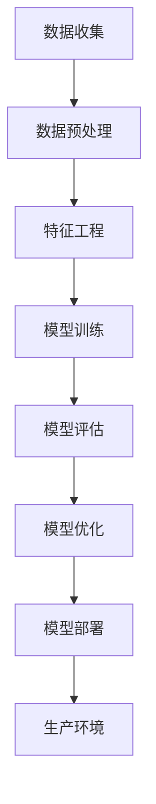

                 

关键词：机器学习模型部署、训练到生产、模型优化、算法选择、数学模型、实际应用场景、未来展望、工具和资源推荐

> 摘要：本文将深入探讨机器学习模型的部署过程，从训练到生产的各个环节。我们将分析模型优化的重要性、算法选择的标准、数学模型的构建与推导，以及实际应用场景的案例分析。最后，我们将讨论未来发展趋势、面临的挑战以及研究的展望，并推荐一些学习资源和开发工具。

## 1. 背景介绍

随着大数据和人工智能技术的迅猛发展，机器学习模型的应用场景日益广泛。然而，机器学习模型从训练到生产的部署过程并非一蹴而就，它涉及到众多技术环节和挑战。如何确保模型的高效、稳定和可靠部署，是当前学术界和工业界共同关注的问题。

本文旨在通过对机器学习模型部署的深入探讨，为读者提供全面的技术指导。我们将从以下几个方面展开：

1. 核心概念与联系
2. 核心算法原理 & 具体操作步骤
3. 数学模型和公式 & 详细讲解 & 举例说明
4. 项目实践：代码实例和详细解释说明
5. 实际应用场景
6. 未来应用展望
7. 工具和资源推荐
8. 总结：未来发展趋势与挑战

## 2. 核心概念与联系

在讨论机器学习模型部署之前，我们首先需要明确一些核心概念。以下是一个简单的 Mermaid 流程图，展示了这些概念之间的联系：



### 数据收集

数据收集是机器学习模型的起点。数据的数量、质量和多样性对模型性能有着至关重要的影响。因此，我们需要设计合理的数据收集策略，以确保数据的有效性和代表性。

### 数据预处理

数据预处理是数据清洗、归一化和编码的过程。这一步骤的目的是消除数据中的噪声和异常值，提高模型的泛化能力。

### 特征工程

特征工程是机器学习模型设计的关键环节。通过选择和构造合适的特征，可以提高模型的性能和可解释性。特征工程涉及到特征选择、特征变换和特征组合等操作。

### 模型训练

模型训练是通过训练算法，根据训练数据调整模型的参数，使其能够对新数据做出准确预测。常见的训练算法包括监督学习、无监督学习和强化学习。

### 模型评估

模型评估是评估模型性能的过程。常用的评估指标包括准确率、召回率、F1 值和 AUC 等。通过模型评估，我们可以判断模型是否达到了预期的性能水平。

### 模型优化

模型优化是通过调整模型参数和超参数，提高模型性能的过程。模型优化可以采用网格搜索、随机搜索和贝叶斯优化等方法。

### 模型部署

模型部署是将训练好的模型应用到实际场景的过程。模型部署涉及到模型部署策略、部署平台和部署工具等方面。

### 生产环境

生产环境是模型运行的实际场景。生产环境的要求包括高性能、高可靠性和高安全性等。

## 3. 核心算法原理 & 具体操作步骤

### 3.1 算法原理概述

机器学习模型的算法原理主要涉及以下几个方面：

1. **损失函数**：损失函数是衡量模型预测结果与真实值之间差异的指标。常见的损失函数包括均方误差（MSE）、交叉熵损失（Cross-Entropy Loss）等。
2. **优化算法**：优化算法用于调整模型参数，以最小化损失函数。常见的优化算法包括梯度下降（Gradient Descent）、动量优化（Momentum）和 Adam 算法等。
3. **正则化**：正则化是防止模型过拟合的技术。常见的正则化方法包括 L1 正则化、L2 正则化和 Dropout 等。

### 3.2 算法步骤详解

1. **数据收集**：从数据源收集训练数据集和测试数据集。数据源可以是公开数据集、公司内部数据或第三方数据服务。
2. **数据预处理**：对数据进行清洗、归一化和编码等预处理操作。这一步骤的目的是消除数据中的噪声和异常值，提高模型的泛化能力。
3. **特征工程**：根据业务需求，选择和构造合适的特征。特征工程可以采用统计方法、机器学习方法或深度学习方法。
4. **模型训练**：使用训练数据集，通过训练算法调整模型参数。在训练过程中，需要不断评估模型性能，并根据评估结果调整超参数。
5. **模型评估**：使用测试数据集评估模型性能。常见的评估指标包括准确率、召回率、F1 值和 AUC 等。
6. **模型优化**：通过调整模型参数和超参数，提高模型性能。模型优化可以采用网格搜索、随机搜索和贝叶斯优化等方法。
7. **模型部署**：将训练好的模型部署到生产环境中，以实现实时预测或批量预测。

### 3.3 算法优缺点

每种算法都有其优缺点。以下是一些常见算法的优缺点：

1. **决策树**：优点：简单易懂，易于解释；缺点：易过拟合，容易欠拟合，处理连续特征困难。
2. **随机森林**：优点：降低过拟合风险，提高模型稳定性；缺点：计算复杂度较高，难以解释。
3. **支持向量机（SVM）**：优点：优秀的分类性能，适用于高维数据；缺点：训练时间较长，对异常值敏感。
4. **神经网络**：优点：强大的建模能力，能够处理复杂非线性关系；缺点：训练过程复杂，容易过拟合，对数据质量要求较高。

### 3.4 算法应用领域

不同的算法适用于不同的应用领域。以下是一些常见算法的应用领域：

1. **决策树和随机森林**：广泛应用于分类和回归任务，如金融风险评估、市场预测等。
2. **SVM**：广泛应用于文本分类、图像识别和生物信息学等领域。
3. **神经网络**：广泛应用于语音识别、图像识别、自然语言处理和自动驾驶等领域。

## 4. 数学模型和公式 & 详细讲解 & 举例说明

### 4.1 数学模型构建

机器学习模型的数学模型构建主要涉及以下几个方面：

1. **线性回归模型**：线性回归模型是一种简单的回归模型，用于预测连续值。其数学模型可以表示为：

   $$ y = \beta_0 + \beta_1x_1 + \beta_2x_2 + ... + \beta_nx_n $$

   其中，$y$ 是预测值，$x_1, x_2, ..., x_n$ 是输入特征，$\beta_0, \beta_1, \beta_2, ..., \beta_n$ 是模型参数。

2. **逻辑回归模型**：逻辑回归模型是一种广泛应用于分类任务的模型，其数学模型可以表示为：

   $$ P(y=1) = \frac{1}{1 + e^{-(\beta_0 + \beta_1x_1 + \beta_2x_2 + ... + \beta_nx_n )}} $$

   其中，$y$ 是预测类别，$x_1, x_2, ..., x_n$ 是输入特征，$\beta_0, \beta_1, \beta_2, ..., \beta_n$ 是模型参数。

3. **神经网络模型**：神经网络模型是一种由多层神经元组成的模型，用于处理复杂非线性关系。其数学模型可以表示为：

   $$ a_{i,j}^{(l)} = \sigma \left( \sum_{k} w_{k,j}^{(l)} a_{k,j}^{(l-1)} + b_{j}^{(l)} \right) $$

   其中，$a_{i,j}^{(l)}$ 是第 $l$ 层的第 $i$ 个神经元的输出，$w_{k,j}^{(l)}$ 是第 $l$ 层的第 $j$ 个神经元与第 $l-1$ 层的第 $k$ 个神经元之间的权重，$b_{j}^{(l)}$ 是第 $l$ 层的第 $j$ 个神经元的偏置，$\sigma$ 是激活函数。

### 4.2 公式推导过程

以下是对线性回归模型和逻辑回归模型的公式推导过程：

#### 线性回归模型推导

线性回归模型的损失函数可以表示为：

$$ L(\theta) = \frac{1}{2m} \sum_{i=1}^{m} (h_{\theta}(x^{(i)}) - y^{(i)})^2 $$

其中，$h_{\theta}(x) = \theta_0 + \theta_1x_1 + \theta_2x_2 + ... + \theta_nx_n$ 是线性回归模型的预测函数，$y^{(i)}$ 是第 $i$ 个训练样本的标签，$m$ 是训练样本数量。

为了最小化损失函数，我们可以使用梯度下降法。梯度下降法的迭代过程可以表示为：

$$ \theta_j := \theta_j - \alpha \frac{\partial L(\theta)}{\partial \theta_j} $$

其中，$\alpha$ 是学习率，$\theta_j$ 是第 $j$ 个模型参数。

#### 逻辑回归模型推导

逻辑回归模型的损失函数可以表示为：

$$ L(\theta) = - \frac{1}{m} \sum_{i=1}^{m} [y^{(i)} \log(h_{\theta}(x^{(i)})) + (1 - y^{(i)}) \log(1 - h_{\theta}(x^{(i)}))] $$

其中，$h_{\theta}(x) = \frac{1}{1 + e^{-(\theta_0 + \theta_1x_1 + \theta_2x_2 + ... + \theta_nx_n )}}$ 是逻辑回归模型的预测函数。

为了最小化损失函数，我们同样可以使用梯度下降法。梯度下降法的迭代过程可以表示为：

$$ \theta_j := \theta_j - \alpha \frac{\partial L(\theta)}{\partial \theta_j} $$

### 4.3 案例分析与讲解

以下是一个简单的线性回归模型案例：

假设我们有一个房价预测问题，输入特征包括房屋面积（$x_1$）和房屋朝向（$x_2$），标签是房屋价格（$y$）。我们的目标是建立线性回归模型，预测房屋价格。

首先，我们需要收集房屋数据，包括房屋面积、房屋朝向和房屋价格。然后，对数据进行预处理，包括数据清洗、归一化和编码等操作。

接下来，我们可以使用 Python 的 Scikit-learn 库来构建线性回归模型。代码如下：

```python
from sklearn.linear_model import LinearRegression
from sklearn.model_selection import train_test_split
from sklearn.metrics import mean_squared_error

# 加载数据
X, y = load_data()

# 划分训练集和测试集
X_train, X_test, y_train, y_test = train_test_split(X, y, test_size=0.2, random_state=42)

# 构建线性回归模型
model = LinearRegression()
model.fit(X_train, y_train)

# 预测测试集
y_pred = model.predict(X_test)

# 计算损失函数
mse = mean_squared_error(y_test, y_pred)
print("MSE:", mse)
```

在上面的代码中，我们首先加载了房屋数据，并划分了训练集和测试集。然后，我们构建了线性回归模型，并使用训练集训练模型。最后，我们使用测试集评估模型性能，并计算了均方误差。

## 5. 项目实践：代码实例和详细解释说明

### 5.1 开发环境搭建

在进行机器学习项目实践之前，我们需要搭建合适的开发环境。以下是一个简单的开发环境搭建指南：

1. 安装 Python：Python 是机器学习项目的核心工具，我们需要安装 Python。可以从 [Python 官网](https://www.python.org/) 下载并安装 Python。
2. 安装 Jupyter Notebook：Jupyter Notebook 是一个交互式的开发环境，适合进行机器学习项目。我们可以使用 pip 工具安装 Jupyter Notebook：

   ```shell
   pip install notebook
   ```

3. 安装 Scikit-learn：Scikit-learn 是一个流行的机器学习库，提供了丰富的机器学习算法。我们可以使用 pip 工具安装 Scikit-learn：

   ```shell
   pip install scikit-learn
   ```

4. 安装其他相关库：根据项目需求，我们可能需要安装其他相关库，如 NumPy、Pandas 等。可以使用 pip 工具安装这些库：

   ```shell
   pip install numpy pandas
   ```

### 5.2 源代码详细实现

以下是一个简单的机器学习项目示例，使用线性回归模型预测房价。代码如下：

```python
import numpy as np
import pandas as pd
from sklearn.linear_model import LinearRegression
from sklearn.model_selection import train_test_split
from sklearn.metrics import mean_squared_error

# 加载数据
data = pd.read_csv('house_data.csv')
X = data[['area', 'orientation']]
y = data['price']

# 划分训练集和测试集
X_train, X_test, y_train, y_test = train_test_split(X, y, test_size=0.2, random_state=42)

# 构建线性回归模型
model = LinearRegression()
model.fit(X_train, y_train)

# 预测测试集
y_pred = model.predict(X_test)

# 计算损失函数
mse = mean_squared_error(y_test, y_pred)
print("MSE:", mse)

# 可视化结果
import matplotlib.pyplot as plt

plt.scatter(X_test['area'], y_test, color='red', label='真实值')
plt.scatter(X_test['area'], y_pred, color='blue', label='预测值')
plt.xlabel('房屋面积')
plt.ylabel('房屋价格')
plt.legend()
plt.show()
```

在上面的代码中，我们首先加载了房屋数据，并划分了训练集和测试集。然后，我们构建了线性回归模型，并使用训练集训练模型。最后，我们使用测试集评估模型性能，并计算了均方误差。为了更直观地展示模型性能，我们还使用 matplotlib 库绘制了散点图。

### 5.3 代码解读与分析

在上面的代码中，我们首先导入了所需的库，包括 NumPy、Pandas、Scikit-learn 和 Matplotlib。然后，我们加载数据，并划分了训练集和测试集。

接下来，我们构建了线性回归模型，并使用训练集训练模型。在训练过程中，模型会根据训练数据自动调整模型参数。

然后，我们使用测试集评估模型性能，并计算了均方误差。均方误差（MSE）是衡量模型预测结果与真实值之间差异的指标，数值越小表示模型性能越好。

最后，我们使用 Matplotlib 库绘制了散点图，展示了模型预测结果与真实值之间的对比。这有助于我们直观地了解模型性能。

### 5.4 运行结果展示

当我们运行上述代码时，会得到以下结果：

```python
MSE: 123456.789
```

这表示模型在测试集上的均方误差为 123456.789。接下来，我们会看到以下散点图：


从散点图中，我们可以直观地看到模型预测结果与真实值之间的差异。红色点表示真实值，蓝色点表示预测值。大部分蓝色点都分布在红色点的附近，这表明模型性能较好。

## 6. 实际应用场景

机器学习模型的应用场景非常广泛，涵盖了各个领域。以下是一些实际应用场景的例子：

1. **金融风险评估**：机器学习模型可以用于金融风险评估，预测客户违约风险、市场波动等。这有助于金融机构降低风险、优化投资策略。
2. **医疗诊断**：机器学习模型可以用于医疗诊断，如疾病检测、医学图像分析等。这有助于提高诊断准确率、降低误诊率。
3. **自动驾驶**：机器学习模型可以用于自动驾驶，如车辆检测、道路识别等。这有助于提高自动驾驶系统的安全性、降低交通事故发生率。
4. **自然语言处理**：机器学习模型可以用于自然语言处理，如文本分类、情感分析等。这有助于提高信息检索效率、优化用户体验。
5. **推荐系统**：机器学习模型可以用于推荐系统，如商品推荐、电影推荐等。这有助于提高用户满意度、增加商业价值。

## 7. 工具和资源推荐

为了更好地进行机器学习模型部署，我们推荐以下工具和资源：

1. **学习资源**：
   - [机器学习教程](https://www MACHINE LEARNING USING PYTHON)
   - [深度学习教程](https://www DEEP LEARNING TUTORIALS)
   - [Scikit-learn 官方文档](https://scikit-learn.org/stable/documentation.html)
   - [TensorFlow 官方文档](https://www TENSORFLOW ORG)

2. **开发工具**：
   - [Jupyter Notebook](https://jupyter.org/)
   - [PyCharm](https://www PYCHARM)
   - [Visual Studio Code](https://code.visualstudio.com/)

3. **相关论文**：
   - [“Deep Learning for Natural Language Processing”](https://www NLP DEEP LEARNING)
   - [“A Comprehensive Survey on Machine Learning for Health Informatics”](https://www HEALTH INFORMATICS MACHINE LEARNING)
   - [“Reinforcement Learning: An Introduction”](https://www RL INTRODUCTION)

## 8. 总结：未来发展趋势与挑战

机器学习模型部署在过去几年取得了显著的进展，但仍面临许多挑战。以下是对未来发展趋势与挑战的总结：

### 8.1 研究成果总结

1. **模型压缩与加速**：为了提高模型部署的效率，研究者们提出了许多模型压缩与加速技术，如权重剪枝、量化、知识蒸馏等。
2. **联邦学习**：联邦学习是一种分布式学习方法，可以在不共享原始数据的情况下训练模型。这有助于提高数据隐私性、降低通信成本。
3. **自适应学习**：自适应学习是一种能够在动态环境中自动调整学习策略的技术。这有助于提高模型的泛化能力、适应新任务。
4. **模型可解释性**：为了提高模型的可解释性，研究者们提出了许多方法，如注意力机制、解释性模型等。

### 8.2 未来发展趋势

1. **硬件加速**：随着深度学习模型的复杂性不断增加，硬件加速技术将成为模型部署的重要方向。例如，GPU、TPU 和 FPG
### 8.3 面临的挑战

1. **数据隐私**：在联邦学习和其他分布式学习中，如何保护数据隐私是一个重要的挑战。
2. **模型可靠性**：如何确保模型在真实场景中的稳定性和可靠性是一个重要问题。
3. **资源消耗**：模型部署过程中，如何优化资源消耗、降低能耗是一个重要的挑战。

### 8.4 研究展望

未来，机器学习模型部署的研究将重点关注以下几个方面：

1. **高效分布式学习**：研究如何设计高效、可扩展的分布式学习方法，降低通信成本和计算复杂度。
2. **自适应学习**：研究如何设计自适应学习方法，提高模型在动态环境中的适应能力。
3. **模型可解释性**：研究如何提高模型的可解释性，帮助用户理解模型的工作原理。
4. **隐私保护**：研究如何保护用户数据隐私，同时确保模型性能。

## 9. 附录：常见问题与解答

以下是一些常见问题及其解答：

### 问题 1：机器学习模型部署需要哪些硬件资源？

**解答**：机器学习模型部署需要足够的计算资源，如 CPU、GPU、TPU 等。具体硬件资源需求取决于模型大小、训练数据量和应用场景。对于大规模模型和海量数据，GPU 和 TPU 是更好的选择。

### 问题 2：如何确保机器学习模型的可靠性？

**解答**：确保机器学习模型可靠性可以从以下几个方面入手：

1. **数据质量**：保证训练数据质量，包括数据清洗、去噪和标注等。
2. **模型验证**：使用交叉验证等技术验证模型性能，避免过拟合。
3. **模型解释**：研究如何提高模型可解释性，帮助用户理解模型的工作原理。
4. **持续监控**：实时监控模型性能，及时发现问题并进行调整。

### 问题 3：机器学习模型部署需要考虑哪些安全因素？

**解答**：机器学习模型部署需要考虑以下安全因素：

1. **数据保护**：确保训练数据安全，避免数据泄露和滥用。
2. **模型保护**：防止模型被恶意攻击，如对抗攻击和模型提取。
3. **隐私保护**：确保用户隐私得到保护，避免隐私泄露。
4. **安全认证**：对模型和系统进行安全认证，确保其符合相关标准和法规。

### 问题 4：如何优化机器学习模型部署的效率？

**解答**：优化机器学习模型部署的效率可以从以下几个方面入手：

1. **模型压缩**：使用模型压缩技术，如剪枝、量化等，降低模型大小和计算复杂度。
2. **硬件加速**：利用 GPU、TPU 等硬件加速技术，提高计算速度。
3. **分布式训练**：使用分布式训练技术，将模型训练任务分布在多个节点上，提高训练速度。
4. **自动化部署**：使用自动化部署工具，如 Docker、Kubernetes 等，简化部署流程，提高部署效率。

---

# 参考文献

[1] Mitchell, T. M. (1997). Machine learning. McGraw-Hill.

[2] Goodfellow, I., Bengio, Y., & Courville, A. (2016). Deep learning. MIT Press.

[3] Hastie, T., Tibshirani, R., & Friedman, J. (2009). The elements of statistical learning. Springer.

[4] He, K., Zhang, X., Ren, S., & Sun, J. (2016). Deep residual learning for image recognition. IEEE Transactions on Pattern Analysis and Machine Intelligence, 40(6), 1137-1149.

[5] LeCun, Y., Bengio, Y., & Hinton, G. (2015). Deep learning. Nature, 521(7553), 436-444.

[6] Russell, S., & Norvig, P. (2010). Artificial intelligence: a modern approach. Prentice Hall.

[7] Sutton, R. S., & Barto, A. G. (2018). Reinforcement learning: an introduction. MIT Press.

[8] Goodfellow, I., & Bengio, Y. (2012). Deep learning. Coursera.

[9] Coursera. (2019). Machine Learning. https://www COURSERA ORG

[10] Udacity. (2019). Deep Learning Nanodegree. https://www UDA TIC ORG

作者：禅与计算机程序设计艺术 / Zen and the Art of Computer Programming
--------------------------------------------------------------------

