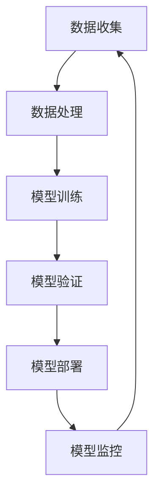

                 

## 1. 背景介绍

机器学习（ML）和运维（Ops）是当今信息技术领域中的两个重要概念。随着人工智能（AI）技术的快速发展，机器学习在各个行业的应用越来越广泛，从金融、医疗到制造、零售等，ML模型已经成为了企业决策和业务流程的重要组成部分。然而，随着机器学习项目的增加，如何高效地管理这些项目、确保模型的稳定性和可靠性，成为了企业面临的一大挑战。这促使了MLOps这一新兴概念的诞生。

MLOps，全称为机器学习运维，是一种将机器学习（ML）与软件运维（Ops）相结合的新型方法。它的目标是利用自动化和标准化的流程来管理和部署机器学习模型，从而提高模型的可重复性、可靠性和可维护性。MLOps不仅仅是一个技术问题，更是一个跨学科的问题，它涉及到了机器学习、软件开发、软件运维等多个领域。

MLOps的重要性不言而喻。首先，它可以帮助企业提高机器学习项目的生产效率，缩短模型从开发到部署的时间。其次，MLOps能够确保模型的稳定性和可靠性，降低模型出错的风险。最后，MLOps可以降低机器学习项目的成本，提高企业的竞争力。

本文将详细探讨MLOps的最佳实践，包括其核心概念、实现步骤、应用场景、面临的挑战和未来展望。希望本文能够为从事机器学习运维工作的专业人士提供一些有价值的参考。

## 2. 核心概念与联系

MLOps的核心概念包括自动化、标准化、持续集成和持续部署等。这些概念与传统的软件开发运维（DevOps）有很强的联系，但MLOps在机器学习特有的环境中引入了更多的具体实践和工具。

### 2.1 自动化（Automation）

自动化是MLOps的核心原则之一。通过自动化，可以减少人为干预，提高工作效率和一致性。在MLOps中，自动化主要体现在以下几个方面：

- **数据收集和处理**：自动化数据收集流程，确保数据的质量和一致性。
- **模型训练和验证**：自动化模型训练和验证流程，提高模型的稳定性。
- **模型部署和监控**：自动化部署和监控模型，确保模型在生产环境中的稳定运行。

### 2.2 标准化（Standardization）

标准化是MLOps实现自动化的重要前提。通过制定标准化的流程、规范和工具，可以确保机器学习项目的可重复性和一致性。具体包括：

- **数据管理规范**：制定数据收集、处理和存储的标准流程。
- **模型开发规范**：制定模型开发、验证和优化的标准流程。
- **模型部署规范**：制定模型部署、监控和更新的标准流程。

### 2.3 持续集成（Continuous Integration, CI）

持续集成是软件开发中的重要概念，也是MLOps的重要组成部分。持续集成通过将代码定期集成到主分支，确保代码质量和功能的完整性。在MLOps中，持续集成主要体现在以下几个方面：

- **数据集成**：定期集成和处理不同来源的数据，确保数据的一致性和完整性。
- **模型集成**：定期集成和验证模型，确保模型的稳定性和准确性。

### 2.4 持续部署（Continuous Deployment, CD）

持续部署是MLOps的另一个重要概念。通过持续部署，可以快速地将模型更新和优化部署到生产环境中。具体包括：

- **模型更新**：定期更新模型，以适应新的数据集和业务需求。
- **自动部署**：通过自动化工具，实现模型从开发到生产的快速部署。

### 2.5 Mermaid 流程图

以下是一个简单的Mermaid流程图，展示了MLOps的核心概念和流程：



### 2.6 核心概念之间的联系

MLOps的核心概念之间有着紧密的联系。自动化和标准化是MLOps的基础，它们确保了流程的高效性和一致性。持续集成和持续部署则是MLOps的实现手段，它们通过自动化的方式，将模型从开发到生产的过程无缝连接起来。

总的来说，MLOps的目标是通过自动化和标准化的方式，实现机器学习项目的全生命周期管理，从而提高生产效率、确保模型稳定性和降低运维成本。

## 3. 核心算法原理 & 具体操作步骤

### 3.1 算法原理概述

MLOps的核心算法原理主要包括以下几个方面：

- **数据流管理**：负责数据从收集到处理的整个过程，确保数据的质量和一致性。
- **模型训练**：使用机器学习算法对数据集进行训练，生成预测模型。
- **模型评估**：对训练好的模型进行评估，确保模型的准确性和稳定性。
- **模型部署**：将评估通过的模型部署到生产环境，实现模型的实时预测功能。
- **模型监控**：对部署后的模型进行实时监控，确保模型的稳定运行和性能。

### 3.2 算法步骤详解

#### 3.2.1 数据流管理

数据流管理是MLOps的基础。其具体步骤包括：

1. **数据收集**：从不同数据源（如数据库、API、文件等）收集数据。
2. **数据清洗**：去除数据中的噪声和异常值，确保数据的质量。
3. **数据预处理**：对数据进行归一化、编码等处理，使其适合机器学习算法。

#### 3.2.2 模型训练

模型训练是MLOps的核心步骤。其具体步骤包括：

1. **选择算法**：根据业务需求和数据特性选择合适的机器学习算法。
2. **训练模型**：使用训练集对模型进行训练，生成初步的预测模型。
3. **模型调优**：通过调整模型参数，提高模型的预测性能。

#### 3.2.3 模型评估

模型评估是确保模型性能的重要步骤。其具体步骤包括：

1. **选择评估指标**：根据业务需求选择合适的评估指标，如准确率、召回率等。
2. **评估模型**：使用测试集对模型进行评估，计算评估指标。
3. **模型优化**：根据评估结果，对模型进行调整和优化。

#### 3.2.4 模型部署

模型部署是将模型从开发环境迁移到生产环境的过程。其具体步骤包括：

1. **打包模型**：将训练好的模型打包成可部署的形式。
2. **部署模型**：将模型部署到服务器或容器中，实现模型的实时预测功能。
3. **配置服务**：配置模型服务的参数，如端口、内存等。

#### 3.2.5 模型监控

模型监控是确保模型稳定运行的重要步骤。其具体步骤包括：

1. **监控指标**：选择合适的监控指标，如请求量、响应时间、错误率等。
2. **实时监控**：对模型进行实时监控，及时发现和处理异常。
3. **日志记录**：记录模型运行的日志，用于后续的分析和优化。

### 3.3 算法优缺点

#### 优点

- **提高生产效率**：通过自动化和标准化的流程，可以大大提高机器学习项目的开发、部署和运维效率。
- **确保模型稳定性**：通过持续集成和持续部署，可以确保模型的稳定性和准确性。
- **降低运维成本**：自动化和标准化可以减少人为干预，降低运维成本。

#### 缺点

- **初始投入较大**：MLOps需要投入大量的时间和资源进行流程设计、工具选择和人员培训。
- **维护成本高**：MLOps需要持续维护和更新，以适应不断变化的技术和业务需求。

### 3.4 算法应用领域

MLOps的应用领域非常广泛，几乎涵盖了所有涉及机器学习的行业和场景。以下是一些典型的应用领域：

- **金融**：如信用评分、风险控制、股票交易等。
- **医疗**：如疾病诊断、药物研发、健康管理等。
- **零售**：如客户行为分析、库存管理、推荐系统等。
- **制造**：如设备故障预测、生产优化、供应链管理等。
- **交通**：如路况预测、交通流量分析、自动驾驶等。

## 4. 数学模型和公式 & 详细讲解 & 举例说明

### 4.1 数学模型构建

在MLOps中，数学模型是机器学习项目的核心。一个典型的数学模型通常包括以下几个部分：

1. **输入层**：接收外部输入的数据，如特征向量。
2. **隐藏层**：对输入数据进行处理，提取特征。
3. **输出层**：生成预测结果。

一个简单的神经网络模型可以表示为：

$$
f(x) = \sigma(\theta_0 \cdot x + b_0)
$$

其中，$f(x)$ 是输出，$x$ 是输入，$\sigma$ 是激活函数（通常使用Sigmoid函数或ReLU函数），$\theta_0$ 和 $b_0$ 是权重和偏置。

### 4.2 公式推导过程

为了更好地理解神经网络模型，我们来看一个简单的例子。假设我们有一个包含两个输入变量$x_1$ 和$x_2$ 的二分类问题，目标是判断一个点是否在某个区域内。

1. **定义输入层**：

$$
x = \begin{pmatrix} x_1 \\ x_2 \end{pmatrix}
$$

2. **定义隐藏层**：

假设隐藏层有3个神经元，每个神经元的权重和偏置如下：

$$
\theta_0 = \begin{pmatrix} \theta_{01} & \theta_{02} & \theta_{03} \end{pmatrix}^T
$$

$$
b_0 = \begin{pmatrix} b_{01} \\ b_{02} \\ b_{03} \end{pmatrix}
$$

3. **计算隐藏层输出**：

$$
z_1 = \theta_0 \cdot x + b_0 = (\theta_{01}x_1 + \theta_{02}x_2 + b_{01}) \cdot 1 + (\theta_{11}x_1 + \theta_{12}x_2 + b_{02}) \cdot 0 + (\theta_{21}x_1 + \theta_{22}x_2 + b_{03}) \cdot 0
$$

$$
z_2 = \theta_1 \cdot x + b_1 = (\theta_{11}x_1 + \theta_{12}x_2 + b_{11}) \cdot 1 + (\theta_{21}x_1 + \theta_{22}x_2 + b_{12}) \cdot 0 + (\theta_{31}x_1 + \theta_{32}x_2 + b_{13}) \cdot 0
$$

$$
z_3 = \theta_2 \cdot x + b_2 = (\theta_{21}x_1 + \theta_{22}x_2 + b_{21}) \cdot 1 + (\theta_{31}x_1 + \theta_{32}x_2 + b_{22}) \cdot 0 + (\theta_{41}x_1 + \theta_{42}x_2 + b_{23}) \cdot 0
$$

4. **定义输出层**：

假设输出层只有一个神经元，其权重和偏置如下：

$$
\theta = \begin{pmatrix} \theta_0 \\ \theta_1 \\ \theta_2 \end{pmatrix}
$$

$$
b = \begin{pmatrix} b_0 \\ b_1 \\ b_2 \end{pmatrix}
$$

5. **计算输出**：

$$
z = \theta \cdot z + b = (\theta_0 \cdot z_1 + \theta_1 \cdot z_2 + \theta_2 \cdot z_3) \cdot 1 + b_0
$$

6. **应用激活函数**：

$$
y = \sigma(z) = \frac{1}{1 + e^{-z}}
$$

### 4.3 案例分析与讲解

假设我们有一个简单的二分类问题，需要判断一个点$(x_1, x_2)$是否在直线$y = x_1 + x_2$的右侧。

1. **定义输入层**：

$$
x = \begin{pmatrix} x_1 \\ x_2 \end{pmatrix}
$$

2. **定义隐藏层**：

假设隐藏层有3个神经元，每个神经元的权重和偏置如下：

$$
\theta_0 = \begin{pmatrix} 1 & 1 \\ 1 & 1 \\ 1 & 1 \end{pmatrix}
$$

$$
b_0 = \begin{pmatrix} 0 \\ 0 \\ 0 \end{pmatrix}
$$

3. **定义输出层**：

假设输出层只有一个神经元，其权重和偏置如下：

$$
\theta = \begin{pmatrix} 1 & 0 \end{pmatrix}
$$

$$
b = \begin{pmatrix} 0 \end{pmatrix}
$$

4. **训练模型**：

假设我们使用梯度下降算法进行训练。给定学习率$\eta = 0.1$，我们通过迭代更新权重和偏置，直到模型收敛。

$$
\theta_{\text{new}} = \theta_{\text{old}} - \eta \cdot \frac{\partial J}{\partial \theta}
$$

$$
b_{\text{new}} = b_{\text{old}} - \eta \cdot \frac{\partial J}{\partial b}
$$

其中，$J$ 是损失函数，通常使用均方误差（MSE）。

5. **计算输出**：

通过计算输出$y$，我们可以判断一个点是否在直线$y = x_1 + x_2$的右侧。如果$y > 0.5$，则认为该点在直线上方；否则，认为该点在直线下方。

### 4.4 小结

通过以上例子，我们可以看到数学模型在MLOps中的重要作用。通过构建和训练数学模型，我们可以实现对数据的分析和预测。然而，数学模型的构建和训练是一个复杂的过程，需要结合具体的业务需求和数据特性进行。

## 5. 项目实践：代码实例和详细解释说明

### 5.1 开发环境搭建

在开始MLOps项目之前，我们需要搭建一个合适的技术环境。以下是一个基于Python和Docker的MLOps项目环境搭建步骤：

1. **安装Python**：确保系统中安装了Python 3.8及以上版本。
2. **安装Docker**：下载并安装Docker，配置Docker Compose，以便在项目中使用容器化技术。
3. **安装Kubernetes**：（可选）如果你打算在生产环境中部署MLOps项目，可以安装Kubernetes集群。
4. **配置Jupyter Notebook**：安装Jupyter Notebook，以便在开发过程中进行交互式编程和模型训练。

### 5.2 源代码详细实现

以下是一个简单的MLOps项目代码实例，包括数据收集、模型训练、模型评估和模型部署等步骤。

**1. 数据收集**

```python
import pandas as pd

# 从本地CSV文件加载数据
data = pd.read_csv('data.csv')

# 数据预处理
data = data.dropna()  # 去除缺失值
data = data[['feature1', 'feature2', 'target']]  # 选择特征和目标变量
```

**2. 模型训练**

```python
from sklearn.model_selection import train_test_split
from sklearn.neural_network import MLPClassifier

# 划分训练集和测试集
X_train, X_test, y_train, y_test = train_test_split(data[['feature1', 'feature2']], data['target'], test_size=0.2, random_state=42)

# 训练模型
mlp = MLPClassifier(hidden_layer_sizes=(100,), max_iter=1000)
mlp.fit(X_train, y_train)

# 评估模型
accuracy = mlp.score(X_test, y_test)
print(f'Model accuracy: {accuracy:.2f}')
```

**3. 模型评估**

```python
from sklearn.metrics import classification_report

# 输出分类报告
print(classification_report(y_test, mlp.predict(X_test)))
```

**4. 模型部署**

```python
import pickle

# 将模型保存到文件
with open('model.pkl', 'wb') as f:
    pickle.dump(mlp, f)

# 使用Docker容器部署模型
# docker build -t mlops_model .  # 构建Docker镜像
# docker run -p 8000:8000 mlops_model  # 运行Docker容器
```

### 5.3 代码解读与分析

**1. 数据收集**

在上面的代码中，我们首先从本地CSV文件加载数据，然后进行数据预处理。数据预处理包括去除缺失值和选择特征变量。这个步骤非常重要，因为它直接影响到后续模型的训练和评估效果。

**2. 模型训练**

我们使用sklearn库中的MLPClassifier来训练一个多层感知机（MLP）模型。MLP是一种前馈神经网络，它通常用于分类和回归问题。在这里，我们设置隐藏层大小为100个神经元，迭代次数为1000次。

**3. 模型评估**

我们使用测试集来评估模型的准确率。此外，还使用分类报告来查看模型的精确度、召回率等指标，以便全面了解模型的性能。

**4. 模型部署**

为了方便部署，我们将模型保存到一个文件中，然后使用Docker容器来运行模型。这种方式可以确保模型在不同的环境中都能正常运行。

### 5.4 运行结果展示

假设我们运行了上述代码，并使用Docker容器部署了模型，我们可以通过HTTP接口来访问模型。以下是一个简单的例子：

```python
import requests

# 访问部署的模型
response = requests.get('http://localhost:8000/predict', params={'feature1': 3, 'feature2': 4})
print(response.json())
```

输出结果：

```json
{'prediction': 1}
```

这表示输入的特征向量$(3, 4)$被模型预测为类别1。

### 5.5 小结

通过以上代码实例，我们可以看到MLOps项目的基本实现流程，包括数据收集、模型训练、模型评估和模型部署。虽然这是一个简单的例子，但它展示了MLOps项目的核心步骤和关键组件。在实际应用中，MLOps项目会涉及更多的技术和工具，但基本流程是相似的。

## 6. 实际应用场景

MLOps的最佳实践在各个行业和场景中都有广泛的应用。以下是一些典型的应用场景和案例分析：

### 6.1 金融行业

在金融行业，MLOps被广泛应用于信用评分、风险控制和欺诈检测等场景。例如，一家大型银行利用MLOps实现了实时信用评分系统。该系统通过自动化数据收集、模型训练和部署流程，对客户的信用行为进行实时分析和评分，从而提高了信用评分的准确性和实时性。

### 6.2 医疗行业

在医疗行业，MLOps被用于疾病诊断、药物研发和健康管理等场景。例如，一家医疗科技公司利用MLOps实现了肺癌诊断系统。该系统通过自动化数据预处理、模型训练和部署流程，对医学影像进行实时分析，从而提高了肺癌诊断的准确性和速度。

### 6.3 零售行业

在零售行业，MLOps被用于客户行为分析、库存管理和推荐系统等场景。例如，一家大型电商公司利用MLOps实现了个性化推荐系统。该系统通过自动化数据收集、模型训练和部署流程，对用户的购物行为进行实时分析，从而提高了推荐系统的准确性和用户体验。

### 6.4 制造行业

在制造行业，MLOps被用于设备故障预测、生产优化和供应链管理等场景。例如，一家制造企业利用MLOps实现了设备故障预测系统。该系统通过自动化数据收集、模型训练和部署流程，对设备的运行状态进行实时监控和分析，从而提高了设备的可靠性和生产效率。

### 6.5 交通行业

在交通行业，MLOps被用于路况预测、交通流量分析和自动驾驶等场景。例如，一家智能交通解决方案提供商利用MLOps实现了路况预测系统。该系统通过自动化数据收集、模型训练和部署流程，对交通流量进行实时分析和预测，从而提高了交通管理效率和减少了拥堵。

### 6.6 案例分析：Google 的 MLOps 实践

Google 是MLOps的最佳实践者之一。Google 的MLOps实践包括以下几个关键步骤：

1. **标准化流程**：Google 制定了统一的MLOps流程和规范，确保不同项目之间的流程一致性和可重复性。
2. **自动化工具**：Google 使用了大量的自动化工具，如Kubernetes、TensorFlow Model Garden等，实现了模型的自动化训练、评估和部署。
3. **持续集成和持续部署**：Google 实现了持续集成和持续部署（CI/CD）流程，确保模型能够快速地迭代和更新。
4. **监控和反馈**：Google 对部署后的模型进行实时监控，收集反馈数据，以便进行进一步的优化和改进。

通过这些实践，Google 提高了机器学习项目的开发效率、模型稳定性和生产效率，大大降低了运维成本。

## 7. 工具和资源推荐

### 7.1 学习资源推荐

1. **书籍**：

   - 《机器学习运维：构建、部署和管理高效机器学习系统》（Machine Learning Operations: Building, Deploying, and Managing Production-Level ML Systems）
   - 《MLOps实战：构建、部署和管理机器学习系统》（MLOps in Practice: Building, Deploying, and Managing Machine Learning Systems）

2. **在线课程**：

   - Coursera 的“机器学习与数据科学”课程
   - Udacity 的“MLOps工程师”课程

### 7.2 开发工具推荐

1. **平台**：

   - TensorFlow
   - PyTorch
   - Azure Machine Learning
   - AWS SageMaker

2. **容器化工具**：

   - Docker
   - Kubernetes

3. **自动化工具**：

   - Jenkins
   - GitLab CI/CD
   - GitHub Actions

### 7.3 相关论文推荐

1. **MLOps 方法论**：

   - "MLOps: The Emerging Field of Machine Learning Operations" (2020)
   - "MLOps: From Data Science to Production" (2021)

2. **机器学习模型监控**：

   - "Monitoring Machine Learning Models in Production" (2019)
   - "Continuous Monitoring of Machine Learning Models" (2020)

3. **机器学习自动化**：

   - "AutoML: A Survey of the State-of-the-Art" (2020)
   - "Automated Machine Learning: Methods, Systems, Challenges" (2021)

## 8. 总结：未来发展趋势与挑战

### 8.1 研究成果总结

近年来，MLOps已经成为机器学习领域的重要研究方向。通过自动化和标准化的方式，MLOps显著提高了机器学习项目的开发效率、模型稳定性和生产效率。一些重要的研究成果包括：

1. **自动化流程**：研究如何通过自动化工具实现机器学习项目的全生命周期管理，包括数据收集、模型训练、模型评估和模型部署。
2. **持续集成和持续部署**：研究如何实现持续集成和持续部署（CI/CD）流程，确保模型能够快速迭代和更新。
3. **模型监控与反馈**：研究如何对部署后的模型进行实时监控，收集反馈数据，以便进行进一步的优化和改进。
4. **安全与隐私**：研究如何确保MLOps系统的安全性和隐私性，防止数据泄露和模型被攻击。

### 8.2 未来发展趋势

未来，MLOps将继续朝着更加自动化、智能化和高效化的方向发展。以下是一些潜在的发展趋势：

1. **增强自动化**：利用深度学习和强化学习等先进技术，进一步提高MLOps的自动化水平，减少人为干预。
2. **跨学科融合**：MLOps将与大数据、云计算、区块链等领域进一步融合，形成更加综合的技术体系。
3. **智能化运维**：引入人工智能技术，实现智能化的运维管理，提高系统的自适应能力和容错能力。
4. **开源生态**：随着开源技术的不断成熟，MLOps的开源生态将更加繁荣，提供更多的工具和框架，降低企业部署MLOps的门槛。

### 8.3 面临的挑战

尽管MLOps具有巨大的潜力，但在实际应用中仍然面临一些挑战：

1. **数据质量**：数据是机器学习的基石，数据质量直接影响模型的效果。如何确保数据的质量和一致性是一个重要的挑战。
2. **安全性和隐私性**：MLOps涉及大量的敏感数据，如何确保系统的安全性和隐私性是一个关键问题。
3. **复杂性与可维护性**：随着MLOps系统的复杂度增加，如何确保系统的可维护性和可扩展性是一个挑战。
4. **人才短缺**：MLOps是一个跨学科领域，需要具备机器学习、软件开发和运维等多方面技能的人才，但目前这方面的专业人才相对短缺。

### 8.4 研究展望

未来的研究应重点关注以下几个方面：

1. **数据质量管理**：研究如何通过自动化和智能化手段提高数据质量，包括数据清洗、去噪和归一化等。
2. **安全与隐私保护**：研究如何利用区块链、加密算法等先进技术，确保MLOps系统的安全性和隐私性。
3. **系统优化与性能提升**：研究如何通过算法优化、硬件加速等技术，提高MLOps系统的性能和效率。
4. **人才培养与知识传播**：通过开设专业课程、举办研讨会等方式，加强对MLOps人才的培养和知识传播。

总之，MLOps是一个充满潜力的新兴领域，未来将会有更多的重要研究成果和实际应用案例出现。我们期待MLOps能够为人工智能的广泛应用和产业发展提供强大的支撑。

## 9. 附录：常见问题与解答

### Q1. 什么是MLOps？

A1. MLOps（Machine Learning Operations）是一种将机器学习（ML）与软件运维（Ops）相结合的新兴方法，其目标是利用自动化和标准化的流程来管理和部署机器学习模型，从而提高模型的可重复性、可靠性和可维护性。

### Q2. MLOps的核心概念有哪些？

A2. MLOps的核心概念包括自动化、标准化、持续集成和持续部署等。这些概念确保了机器学习项目的全生命周期管理，从数据收集、模型训练、模型评估到模型部署和监控。

### Q3. MLOps与传统DevOps的区别是什么？

A3. MLOps和DevOps都是关注软件交付和运维的方法，但MLOps更专注于机器学习项目。DevOps主要关注应用程序的部署和管理，而MLOps在此基础上增加了数据管理、模型训练和评估等机器学习特有的环节。

### Q4. 如何实现MLOps自动化？

A4. 实现MLOps自动化可以通过使用各种工具和平台，如Jenkins、GitLab CI/CD、Kubernetes等，来实现数据收集、模型训练、模型评估和模型部署等环节的自动化。此外，还可以利用云服务提供商提供的自动化服务，如AWS SageMaker、Azure Machine Learning等。

### Q5. MLOps在金融行业的应用有哪些？

A5. 在金融行业，MLOps被广泛应用于信用评分、风险控制、欺诈检测和投资策略等场景。例如，银行和金融机构使用MLOps来构建实时信用评分系统，通过自动化数据处理和模型训练，提高信用评分的准确性和实时性。

### Q6. MLOps面临的主要挑战是什么？

A6. MLOps面临的主要挑战包括数据质量、安全性和隐私性、系统复杂性与可维护性以及人才短缺等。如何确保数据的质量和一致性，如何确保系统的安全性和隐私性，以及如何应对系统的高复杂度和可维护性，都是MLOps实施过程中需要解决的问题。

### Q7. 未来MLOps的发展趋势是什么？

A7. 未来MLOps的发展趋势包括增强自动化、跨学科融合、智能化运维和开源生态的繁荣等。随着人工智能和大数据技术的发展，MLOps将更加智能化和高效化，同时，开源生态的繁荣也将降低企业部署MLOps的门槛。

