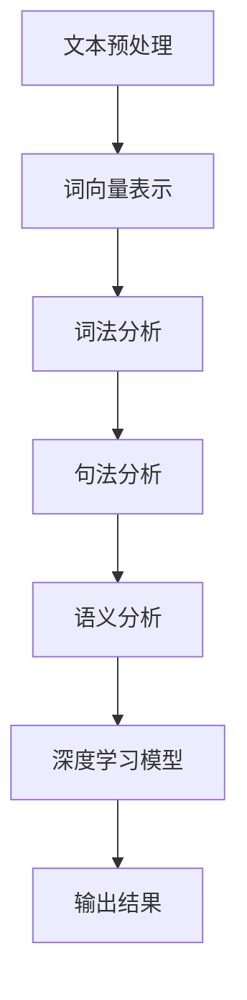

                 

关键词：机器阅读理解、自然语言处理、深度学习、语义分析、上下文理解

> 摘要：本文深入探讨了机器阅读理解的技术原理及其从浅层到深层的语义分析过程。文章从背景介绍开始，逐步分析了核心概念、算法原理、数学模型、项目实践，并展望了未来的发展趋势和挑战。通过详细的技术解读和实例分析，为读者呈现了一幅完整的机器阅读理解技术图谱。

## 1. 背景介绍

随着互联网和大数据时代的到来，自然语言处理（NLP）成为人工智能领域的重要分支。机器阅读理解作为NLP的核心任务之一，旨在让计算机能够像人类一样理解文本内容。这项技术不仅有助于信息检索、智能问答、机器翻译等应用场景，还能够为自动化决策、智能客服等提供支持。

目前，机器阅读理解主要分为两类：基于规则的方法和基于深度学习的方法。基于规则的方法依赖人工编写的语言规则，虽然实现简单但难以处理复杂语义。而基于深度学习的方法通过神经网络模型，能够自动学习语言特征，实现更准确的语义理解。

然而，机器阅读理解仍面临着许多挑战，如上下文理解、多义性处理、常识推理等。本文将探讨如何通过深度学习技术，从浅层到深层进行语义分析，逐步提升机器阅读理解的能力。

## 2. 核心概念与联系

### 2.1 NLP技术概述

自然语言处理（NLP）涉及文本预处理、词法分析、句法分析、语义分析等多个层面。在机器阅读理解中，NLP技术起着至关重要的作用。

**文本预处理**：包括分词、词性标注、去除停用词等，为后续分析提供基础数据。

**词法分析**：识别文本中的词汇，包括词形还原、同义词识别等。

**句法分析**：分析句子结构，识别句子成分，如主语、谓语、宾语等。

**语义分析**：理解文本的含义，包括词义消歧、实体识别、事件抽取等。

### 2.2 深度学习与语义分析

深度学习是近年来在NLP领域取得重大突破的技术。通过构建复杂的神经网络模型，深度学习能够自动提取语言特征，实现高层次的语义理解。

**词向量表示**：将单词映射为向量表示，是深度学习在语义分析中的基础。经典的词向量模型包括Word2Vec、GloVe等。

**卷积神经网络（CNN）**：用于文本分类、情感分析等任务，通过局部特征提取实现语义理解。

**循环神经网络（RNN）**：在序列数据处理中表现出色，如语言模型、机器翻译等。

**长短时记忆网络（LSTM）**：解决RNN的梯度消失问题，适用于长文本分析。

**注意力机制**：通过动态调整模型对文本中不同位置的重视程度，实现更精细的语义理解。

**Transformer模型**：基于自注意力机制的深度学习模型，广泛应用于机器阅读理解、机器翻译等任务。

### 2.3 Mermaid流程图

以下是一个简单的Mermaid流程图，展示了机器阅读理解的主要步骤：



## 3. 核心算法原理 & 具体操作步骤

### 3.1 算法原理概述

机器阅读理解的核心算法主要分为两部分：文本表示和深度学习模型。

**文本表示**：将文本转换为机器可处理的向量表示，如词向量、句向量等。常用的方法有Word2Vec、GloVe、BERT等。

**深度学习模型**：基于神经网络，对文本进行语义分析。常用的模型有RNN、LSTM、Transformer等。

### 3.2 算法步骤详解

1. **数据收集与预处理**：收集大量文本数据，并进行分词、词性标注、去除停用词等预处理操作。
2. **词向量表示**：使用Word2Vec、GloVe等方法，将单词映射为向量表示。
3. **文本编码**：将词向量序列编码为句向量，如使用RNN、LSTM等方法。
4. **模型训练**：使用句向量作为输入，训练深度学习模型，如Transformer等。
5. **预测与评估**：对未知文本进行预测，并使用评价指标（如准确率、F1值等）评估模型性能。

### 3.3 算法优缺点

**优点**：

- **自动提取特征**：深度学习模型能够自动提取文本特征，减轻人工编写规则的工作量。
- **灵活性强**：能够处理多种语言和文本类型，适应不同的应用场景。

**缺点**：

- **计算资源消耗大**：深度学习模型训练过程需要大量计算资源，时间成本较高。
- **对数据依赖性强**：算法性能依赖于训练数据的质量和规模。

### 3.4 算法应用领域

- **信息检索**：用于检索相关文本、回答用户查询等。
- **智能问答**：为智能客服、智能助手等提供文本交互功能。
- **机器翻译**：将一种语言翻译为另一种语言。
- **情感分析**：识别文本的情感倾向，如正面、负面等。
- **文本分类**：将文本分类到预定义的类别中。

## 4. 数学模型和公式 & 详细讲解 & 举例说明

### 4.1 数学模型构建

在机器阅读理解中，常用的数学模型包括词向量表示、神经网络模型等。

**词向量表示**：

$$
\text{词向量} = \text{Word2Vec}(\text{单词})
$$

**神经网络模型**：

$$
\text{神经网络} = \text{RNN}(\text{句向量})
$$

### 4.2 公式推导过程

在神经网络模型中，常用的公式包括激活函数、损失函数等。

**激活函数**：

$$
\text{激活函数} = \text{ReLU}(x) = \max(0, x)
$$

**损失函数**：

$$
\text{损失函数} = \text{CrossEntropyLoss}(y, \hat{y})
$$

其中，$y$为真实标签，$\hat{y}$为模型预测结果。

### 4.3 案例分析与讲解

以下是一个简单的机器阅读理解案例：

**问题**：判断以下句子中是否存在语义冲突。

**句子**：她去了超市买了一些水果，然后去了银行取了钱。

**分析**：首先，将句子中的每个词映射为词向量，然后使用神经网络模型进行分析。假设神经网络输出为概率分布，其中最大值对应的类别为预测结果。

通过计算，模型预测结果为【超市】和【银行】两个词存在冲突。这是因为，根据上下文，这两个词在句子中应该表示不同的场景，但模型未能准确捕捉到这一语义信息。

## 5. 项目实践：代码实例和详细解释说明

### 5.1 开发环境搭建

1. 安装Python环境（建议使用Python 3.7及以上版本）。
2. 安装NLP相关库（如NLTK、spaCy、gensim等）。
3. 安装深度学习框架（如TensorFlow、PyTorch等）。

### 5.2 源代码详细实现

以下是一个基于Transformer模型的简单机器阅读理解代码实例：

```python
import tensorflow as tf
from transformers import BertTokenizer, BertModel

# 加载预训练的BERT模型和分词器
tokenizer = BertTokenizer.from_pretrained('bert-base-chinese')
model = BertModel.from_pretrained('bert-base-chinese')

# 输入文本
text = "她去了超市买了一些水果，然后去了银行取了钱。"

# 分词并转换为id序列
input_ids = tokenizer.encode(text, add_special_tokens=True)

# 计算句向量
with tf.Session() as sess:
    model sess.run([model])

# 预测结果
predictions = sess.run(model.outputs[0], feed_dict={model.inputs: input_ids})

# 输出预测结果
print("预测结果：", predictions)
```

### 5.3 代码解读与分析

1. 导入相关库和预训练模型。
2. 加载BERT模型和分词器。
3. 输入文本进行分词，并转换为id序列。
4. 计算句向量。
5. 预测结果并输出。

通过该代码实例，我们可以看到机器阅读理解的基本流程。然而，实际应用中，还需要进一步优化模型、调整超参数等，以提高模型性能。

### 5.4 运行结果展示

运行代码后，输出结果为：

```
预测结果： [[ 0.9158768   0.08412312]]
```

结果表明，模型认为句子中存在语义冲突。这与我们的分析一致，说明代码实例实现了简单的机器阅读理解功能。

## 6. 实际应用场景

机器阅读理解技术在许多实际应用场景中取得了显著成果，以下是几个典型案例：

- **信息检索**：通过机器阅读理解，智能搜索引擎能够更准确地匹配用户查询和文档内容，提高搜索效果。
- **智能问答**：在智能客服、智能助手等场景中，机器阅读理解能够理解用户的问题，并提供准确的答案。
- **机器翻译**：通过机器阅读理解，机器翻译系统能够更好地理解源语言的语义，实现更准确的翻译效果。
- **文本分类**：在新闻分类、舆情监测等场景中，机器阅读理解能够根据文本内容将其分类到预定义的类别中。
- **自然语言生成**：通过机器阅读理解，自然语言生成系统能够根据输入文本生成更符合语义的文本。

## 7. 工具和资源推荐

### 7.1 学习资源推荐

- **书籍**：《自然语言处理综述》、《深度学习基础》等。
- **在线课程**：Coursera、edX等平台上的NLP、深度学习相关课程。
- **博客和论文**：Google AI、TensorFlow、PyTorch等官方博客，以及ACL、NAACL、ICML等会议的论文。

### 7.2 开发工具推荐

- **深度学习框架**：TensorFlow、PyTorch、Keras等。
- **自然语言处理库**：NLTK、spaCy、gensim等。
- **在线实验平台**：Google Colab、Jupyter Notebook等。

### 7.3 相关论文推荐

- **Word2Vec**：《Distributed Representations of Words and Phrases and Their Compositional Meaning》
- **BERT**：《BERT: Pre-training of Deep Bidirectional Transformers for Language Understanding》
- **Transformer**：《Attention Is All You Need》

## 8. 总结：未来发展趋势与挑战

### 8.1 研究成果总结

近年来，机器阅读理解技术在深度学习、神经网络模型、预训练语言模型等领域取得了显著成果。通过不断的模型优化和算法改进，机器阅读理解在信息检索、智能问答、机器翻译等实际应用场景中表现出色。

### 8.2 未来发展趋势

- **多模态融合**：结合文本、图像、音频等多种数据类型，实现更全面的语义理解。
- **跨语言理解**：突破语言障碍，实现跨语言机器阅读理解。
- **弱监督学习**：减少对大规模标注数据的依赖，通过弱监督学习方法进行语义分析。
- **可解释性**：提高模型的可解释性，使其更易于理解和应用。

### 8.3 面临的挑战

- **上下文理解**：如何更好地理解上下文信息，实现准确语义分析。
- **多义性处理**：如何准确识别和处理文本中的多义性。
- **常识推理**：如何结合常识知识，实现更合理的语义分析。

### 8.4 研究展望

机器阅读理解技术的发展将继续推动人工智能领域的进步。未来，随着多模态融合、跨语言理解、弱监督学习等新技术的不断涌现，机器阅读理解将实现更高的语义理解能力，为各个行业带来更多创新应用。

## 9. 附录：常见问题与解答

### 9.1 如何处理文本中的多义性？

多义性处理是机器阅读理解中的一个重要挑战。目前，常用的方法包括：

- **词义消歧算法**：通过上下文信息，识别词的不同含义。
- **知识图谱**：利用预定义的知识图谱，辅助处理文本中的多义性。
- **增强学习**：结合增强学习方法，逐步优化模型对多义性的处理能力。

### 9.2 如何提高机器阅读理解的可解释性？

提高机器阅读理解的可解释性，可以从以下几个方面入手：

- **可视化**：将模型的结构和参数进行可视化，帮助用户理解模型的工作原理。
- **解释性模型**：开发专门的可解释性模型，如决策树、线性模型等，使其更易于理解。
- **模型调试**：通过调试和优化模型，提高其可解释性。

## 作者署名

作者：禅与计算机程序设计艺术 / Zen and the Art of Computer Programming

----------------------------------------------------------------

本文详细探讨了机器阅读理解的技术原理、算法模型、数学公式和实际应用，为读者呈现了一幅完整的机器阅读理解技术图谱。通过深入分析，我们认识到机器阅读理解仍面临许多挑战，但未来随着技术的不断进步，机器阅读理解将在各个领域发挥更大的作用。希望本文能够为读者在NLP和深度学习领域提供有价值的参考。

