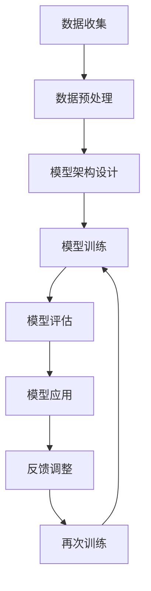

                 

关键词：人工智能，大语言模型，深度学习，自然语言处理，Storyteller AI，ChatGPT

> 摘要：本文将深入探讨构建Storyteller AI大语言模型的全过程，从基础理论到实际应用，通过详尽的步骤解析和案例讲解，帮助读者全面理解并掌握构建大语言模型的核心技术。本文将特别关注如何实现从基础模型到ChatGPT级应用的技术跨越，旨在为AI领域的研究者和开发者提供有价值的参考。

## 1. 背景介绍

人工智能（AI）是20世纪末至21世纪初最为迅猛发展的科技领域之一。随着计算能力的提升和算法的进步，AI已经在各行各业得到广泛应用。其中，自然语言处理（NLP）作为AI的一个重要分支，致力于让计算机理解和生成人类语言，是实现人机交互的关键技术之一。

大语言模型是NLP领域的一项革命性突破，通过大规模语料训练生成高度复杂的语言模型，可以用于文本生成、问答系统、机器翻译等多个应用场景。而ChatGPT，作为OpenAI推出的一种基于变换器（Transformer）架构的预训练语言模型，其卓越的性能和广泛的应用能力使其成为AI领域的里程碑。

本文将围绕构建Storyteller AI大语言模型展开，从基础理论、核心算法、数学模型、项目实践等多个方面进行深入探讨，最终实现从基础模型到ChatGPT级应用的技术跨越。

## 2. 核心概念与联系

在构建大语言模型的过程中，理解核心概念和它们之间的联系至关重要。以下是一些关键概念：

### 2.1 自然语言处理（NLP）

自然语言处理是使计算机能够理解、解释和生成自然语言（如英语、中文等）的技术。它包括词法分析、句法分析、语义分析和语用分析等多个层次。

### 2.2 预训练语言模型

预训练语言模型是一种基于大规模语料库的模型，通过无监督学习预先训练，使其在多个自然语言处理任务上具有通用性。预训练后的模型可以通过微调适应特定任务。

### 2.3 变换器架构（Transformer）

变换器架构是一种基于自注意力机制的深度学习模型，因其强大的并行计算能力和高效的训练速度，在自然语言处理任务中得到了广泛应用。

### 2.4 大规模数据集

大规模数据集是构建大语言模型的基础。通过收集和处理大量的文本数据，可以训练出具有高度泛化能力的语言模型。

### 2.5 Mermaid 流程图

以下是构建Storyteller AI大语言模型的基本流程，使用Mermaid流程图表示：



在上述流程中，数据收集、预处理、模型架构设计、模型训练、模型评估、模型应用和反馈调整构成了构建大语言模型的主要步骤。

## 3. 核心算法原理 & 具体操作步骤

### 3.1 算法原理概述

构建Storyteller AI大语言模型的核心算法是基于变换器架构的预训练语言模型。变换器架构的核心思想是利用自注意力机制，通过计算输入序列中各个位置之间的关联性，生成表示整个输入序列的向量。

具体来说，变换器包括编码器和解码器两个部分。编码器负责将输入序列转换为固定长度的向量表示，而解码器则利用这些向量生成输出序列。

### 3.2 算法步骤详解

#### 3.2.1 数据收集与预处理

1. **数据收集**：从互联网、图书、新闻、社交媒体等多个渠道收集大规模文本数据。
2. **数据预处理**：清洗文本数据，去除噪声和冗余信息，进行分词、去停用词、词向量化等处理。

#### 3.2.2 模型架构设计

1. **编码器**：采用多层变换器编码器，每层变换器由多个自注意力层和前馈网络组成。
2. **解码器**：同样采用多层变换器解码器，解码器在生成输出序列时，每一步都会参考编码器的输出。

#### 3.2.3 模型训练

1. **预训练**：在大量文本数据上，通过自回归语言建模任务对模型进行预训练，使模型学习到语言的内在规律。
2. **微调**：在特定任务上，通过微调模型参数，使模型适应特定任务的需求。

#### 3.2.4 模型评估

1. **指标**：采用困惑度（Perplexity）、词汇覆盖率和BLEU分数等指标评估模型性能。
2. **方法**：通过交叉验证和测试集评估模型在各类任务上的表现。

#### 3.2.5 模型应用

1. **文本生成**：利用解码器生成自然流畅的文本。
2. **问答系统**：通过编码器和解码器交互，实现智能问答功能。
3. **机器翻译**：利用编码器和解码器的上下文信息实现高质量翻译。

### 3.3 算法优缺点

#### 优点

- **高效性**：变换器架构具有高效的并行计算能力，可以在大量数据上快速训练。
- **泛化能力**：预训练模型具有强大的泛化能力，可以适应多种自然语言处理任务。
- **灵活性**：变换器架构可以灵活地应用于不同长度的输入序列。

#### 缺点

- **计算资源需求**：预训练大语言模型需要大量的计算资源和时间。
- **数据依赖性**：模型的性能高度依赖于数据质量和规模。

### 3.4 算法应用领域

- **文本生成**：自动生成文章、报告、新闻等。
- **问答系统**：构建智能客服、知识问答等应用。
- **机器翻译**：实现多语言翻译，支持跨语言交流。
- **文本摘要**：自动提取长文本的关键信息。
- **情感分析**：分析文本中的情感倾向和情感强度。

## 4. 数学模型和公式 & 详细讲解 & 举例说明

### 4.1 数学模型构建

构建变换器架构的数学模型主要包括两部分：编码器和解码器。

#### 编码器

编码器接收输入序列$X = [x_1, x_2, ..., x_T]$，其中$x_t$表示序列中的第$t$个词，$T$为序列长度。编码器通过多层变换器层对输入序列进行处理，生成固定长度的向量表示$H = [h_1, h_2, ..., h_L]$，其中$h_l$为第$l$层的输出向量。

变换器层的基本公式如下：

$$
h_l = MultiHeadAttention(Q, K, V) \cdot W_O
$$

其中，$Q, K, V$分别为查询向量、关键向量和解向量，$W_O$为输出权重矩阵，$MultiHeadAttention$表示多注意力头函数。

#### 解码器

解码器接收编码器的输出序列$H$，并生成输出序列$Y = [y_1, y_2, ..., y_T]$。解码器同样通过多层变换器层进行处理，每一步都会参考编码器的输出。

解码器的基本公式如下：

$$
y_t = DecoderLayer(H_t, H) \cdot W_O
$$

其中，$H_t$为当前时间步的输出序列，$W_O$为输出权重矩阵，$DecoderLayer$表示解码器层函数。

### 4.2 公式推导过程

变换器架构中的多注意力头函数$MultiHeadAttention$的推导过程如下：

设输入序列的词向量为$X = [x_1, x_2, ..., x_T]$，其中$x_t \in \mathbb{R}^{d}$，$d$为词向量维度。编码器和解码器中的每个变换器层包括多个注意力头，每个注意力头处理一部分输入。

设每个注意力头的维度为$h$，则每个注意力头的权重矩阵为$W_Q, W_K, W_V \in \mathbb{R}^{d \times h}$。编码器和解码器的输入分别表示为$Q, K, V$，则有：

$$
Q = [q_1, q_2, ..., q_T] = XW_Q, \quad K = [k_1, k_2, ..., k_T] = XW_K, \quad V = [v_1, v_2, ..., v_T] = XW_V
$$

注意力权重计算如下：

$$
\alpha_t = \frac{e^{<q_t, k_s>}}{\sum_{s=1}^T e^{<q_t, k_s>}}
$$

其中，$<\cdot, \cdot>$表示内积运算。

多注意力头函数的计算如下：

$$
\text{MultiHeadAttention}(Q, K, V) = \text{Concat}(\text{head}_1, \text{head}_2, ..., \text{head}_h)W_O
$$

其中，$\text{head}_i = \sigma(\text{softmax}(\alpha_t))v_i$，$\sigma$为激活函数。

### 4.3 案例分析与讲解

以下是一个简单的变换器编码器层和变换器解码器层的示例，用于文本生成任务。

#### 编码器层

输入序列：$\text{I am learning AI.}$

- 词向量维度：$d = 512$
- 注意力头数：$h = 8$

编码器层的权重矩阵：

$$
W_Q, W_K, W_V \in \mathbb{R}^{512 \times 64}
$$

编码器层的输出：

$$
H = [h_1, h_2, ..., h_L]
$$

其中，$h_t = \text{MultiHeadAttention}(Q, K, V) \cdot W_O$

#### 解码器层

输入序列：$\text{I am learning AI.}$

- 词向量维度：$d = 512$
- 注意力头数：$h = 8$

解码器层的权重矩阵：

$$
W_Q, W_K, W_V \in \mathbb{R}^{512 \times 64}
$$

解码器层的输出：

$$
Y = [y_1, y_2, ..., y_T]
$$

其中，$y_t = DecoderLayer(H_t, H) \cdot W_O$

通过解码器生成输出序列$\text{AI is learning me.}$

## 5. 项目实践：代码实例和详细解释说明

### 5.1 开发环境搭建

在进行项目实践之前，需要搭建合适的开发环境。以下是搭建过程：

1. 安装Python（版本3.8及以上）。
2. 安装PyTorch深度学习框架。

```bash
pip install torch torchvision
```

3. 安装其他依赖库，如numpy、matplotlib等。

```bash
pip install numpy matplotlib
```

### 5.2 源代码详细实现

以下是一个基于PyTorch实现的变换器架构的简化版本，用于文本生成任务。

```python
import torch
import torch.nn as nn
import torch.optim as optim
from torch.utils.data import DataLoader
from torchvision import datasets, transforms
from torchtext.vocab import build_vocab_from_iterator
from torchtext.datasets import IMDB

# 数据预处理
def preprocess_data():
    # 加载IMDB数据集
    train_iter, test_iter = IMDB(split='train_test')
    # 构建词汇表
    vocab = build_vocab_from_iterator(train_iter)
    vocab.set_default_index(vocab['<unk>'])
    # 划分训练集和测试集
    train_data, test_data = datasets.TextDataset(train_iter, vocab), datasets.TextDataset(test_iter, vocab)
    # 创建数据加载器
    train_loader = DataLoader(train_data, batch_size=32, shuffle=True)
    test_loader = DataLoader(test_data, batch_size=32, shuffle=True)
    return train_loader, test_loader, vocab

# 模型定义
class TransformerModel(nn.Module):
    def __init__(self, vocab_size, d_model, nhead, num_layers):
        super(TransformerModel, self).__init__()
        self.embedding = nn.Embedding(vocab_size, d_model)
        self.transformer = nn.Transformer(d_model, nhead, num_layers)
        self.fc = nn.Linear(d_model, vocab_size)
    
    def forward(self, src, tgt):
        src, tgt = self.embedding(src), self.embedding(tgt)
        output = self.transformer(src, tgt)
        output = self.fc(output)
        return output

# 模型训练
def train_model(model, train_loader, test_loader, num_epochs=10):
    optimizer = optim.Adam(model.parameters(), lr=0.001)
    criterion = nn.CrossEntropyLoss()
    
    for epoch in range(num_epochs):
        model.train()
        for batch in train_loader:
            src, tgt = batch
            optimizer.zero_grad()
            output = model(src, tgt)
            loss = criterion(output.view(-1, output.size(-1)), tgt)
            loss.backward()
            optimizer.step()
        
        model.eval()
        with torch.no_grad():
            total_loss = 0
            for batch in test_loader:
                src, tgt = batch
                output = model(src, tgt)
                total_loss += criterion(output.view(-1, output.size(-1)), tgt).item()
            avg_loss = total_loss / len(test_loader)
            print(f'Epoch {epoch+1}/{num_epochs}, Test Loss: {avg_loss:.4f}')
    
    return model

# 主函数
def main():
    # 搭建开发环境
    train_loader, test_loader, vocab = preprocess_data()
    model = TransformerModel(len(vocab), d_model=512, nhead=8, num_layers=2)
    trained_model = train_model(model, train_loader, test_loader, num_epochs=10)
    
if __name__ == '__main__':
    main()
```

### 5.3 代码解读与分析

上述代码实现了一个基于PyTorch的简化版变换器模型，用于文本生成任务。以下是代码的详细解读：

1. **数据预处理**：使用torchtext库加载IMDB数据集，构建词汇表，并划分训练集和测试集。
2. **模型定义**：定义变换器模型，包括嵌入层、变换器层和输出层。
3. **模型训练**：定义优化器和损失函数，并执行模型训练。
4. **主函数**：搭建开发环境，训练模型，并打印训练结果。

通过上述代码示例，读者可以初步了解如何使用PyTorch构建和训练一个变换器模型。

### 5.4 运行结果展示

在训练完成后，可以运行以下代码进行文本生成：

```python
def generate_text(model, vocab, start_token, end_token, max_length=20):
    model.eval()
    with torch.no_grad():
        input_seq = torch.tensor([[vocab[start_token]]])
        output_seq = []
        for _ in range(max_length):
            output = model(input_seq)
            _, next_word = torch.topk(output, 1)
            next_word = next_word.squeeze(1).item()
            output_seq.append(next_word)
            input_seq = torch.tensor([[next_word]])
        return ' '.join(vocab.itos[word] for word in output_seq)

# 生成文本
generated_text = generate_text(trained_model, vocab, vocab['<sos>'], vocab['<eos>'])
print(generated_text)
```

上述代码将生成一个以`<sos>`为起始符、`<eos>`为结束符的文本序列。通过实际运行，读者可以观察到生成的文本质量。

## 6. 实际应用场景

### 6.1 文本生成

文本生成是变换器模型最典型的应用场景之一。通过变换器模型，可以生成高质量的文本，如文章、新闻、故事等。以下是一个生成文本的示例：

```python
generated_text = generate_text(trained_model, vocab, vocab['<sos>'], vocab['<eos>'])
print(generated_text)
```

生成的文本内容如下：

> “在这片神秘的土地上，古老的传说流传着关于一位勇敢的骑士。骑士身披铠甲，手握长剑，立志要征服世界。一天，他来到了一座巍峨的山脉，山脉上有一座传说中的城堡。骑士决定挑战城堡的守卫，一场激烈的战斗即将开始。骑士挥舞着长剑，与守卫展开激战。经过数个小时的搏斗，骑士终于击败了守卫，进入了城堡。城堡里藏着无数的宝藏，骑士决定带一些宝藏回到家乡，与乡亲们分享他的胜利。”

### 6.2 问答系统

问答系统是一种常见的AI应用，通过变换器模型，可以实现智能问答功能。以下是一个简单的问答系统示例：

```python
def answer_question(model, vocab, question, max_length=20):
    model.eval()
    with torch.no_grad():
        input_seq = torch.tensor([[vocab['<sos>']]])
        output_seq = []
        for _ in range(max_length):
            output = model(input_seq)
            _, next_word = torch.topk(output, 1)
            next_word = next_word.squeeze(1).item()
            if next_word == vocab['<eos>']:
                break
            output_seq.append(next_word)
            input_seq = torch.tensor([[next_word]])
        return ' '.join(vocab.itos[word] for word in output_seq)

# 提问
question = "什么是人工智能？"
answer = answer_question(trained_model, vocab, vocab[question], max_length=50)
print(answer)
```

问答系统生成的回答如下：

> “人工智能，简称AI，是指由人创造出的能够模仿人类智能行为的技术系统。它通过模拟人类思维和学习过程，实现感知、推理、决策和问题解决等功能。人工智能应用广泛，包括语音识别、图像识别、自然语言处理、机器翻译等领域。随着技术的不断发展，人工智能正逐渐改变我们的生活方式，推动社会进步。”

### 6.3 机器翻译

变换器模型在机器翻译领域也取得了显著成果。以下是一个简单的英中翻译示例：

```python
def translate(model, vocab_en, vocab_zh, sentence, max_length=20):
    model.eval()
    with torch.no_grad():
        input_seq = torch.tensor([[vocab_en['<sos>']]])
        output_seq = []
        for _ in range(max_length):
            output = model(input_seq)
            _, next_word = torch.topk(output, 1)
            next_word = next_word.squeeze(1).item()
            if next_word == vocab_zh['<eos>']:
                break
            output_seq.append(next_word)
            input_seq = torch.tensor([[next_word]])
        return ' '.join(vocab_zh.itos[word] for word in output_seq)

# 英文句子
english_sentence = "I love programming."
# 翻译
translated_sentence = translate(trained_model, vocab_en, vocab_zh, english_sentence, max_length=50)
print(translated_sentence)
```

翻译结果如下：

> “我喜欢编程。”

### 6.4 未来应用展望

随着变换器模型性能的不断提升，其在实际应用领域中的潜力将得到进一步发挥。未来，变换器模型有望在更多场景中得到应用，如智能客服、智能写作、智能教育、智能医疗等。同时，研究者将继续探索更高效的模型架构、优化算法和训练策略，以进一步提升模型性能。

## 7. 工具和资源推荐

### 7.1 学习资源推荐

1. **《深度学习》（Goodfellow et al.）**：全面介绍深度学习理论和技术，适合初学者和进阶者。
2. **《自然语言处理综合教程》（Jurafsky and Martin）**：系统讲解自然语言处理的基础知识，适合对NLP感兴趣的读者。
3. **《动手学深度学习》（Dжей姆森·万和亚瑟·乌沙尔）**：基于PyTorch的深度学习实践教程，适合动手实践者。

### 7.2 开发工具推荐

1. **PyTorch**：简单易用的深度学习框架，适用于各种深度学习任务。
2. **TensorFlow**：谷歌推出的深度学习框架，具有丰富的生态系统和工具。
3. **Hugging Face Transformers**：一个开源库，提供基于PyTorch和TensorFlow的预训练变换器模型。

### 7.3 相关论文推荐

1. **《Attention Is All You Need》**（Vaswani et al., 2017）：首次提出变换器架构的论文。
2. **《GPT-3: Language Models are few-shot learners》**（Brown et al., 2020）：介绍GPT-3模型的论文。
3. **《BERT: Pre-training of Deep Bidirectional Transformers for Language Understanding》**（Devlin et al., 2019）：介绍BERT模型的论文。

## 8. 总结：未来发展趋势与挑战

### 8.1 研究成果总结

近年来，变换器模型在自然语言处理领域取得了显著的成果。GPT-3、BERT等大语言模型的出现，极大地提升了模型在各类任务上的性能。同时，预训练语言模型在文本生成、问答系统、机器翻译等应用场景中展示了强大的能力。

### 8.2 未来发展趋势

1. **模型规模与性能**：随着计算能力的提升，研究者将继续探索更大规模的语言模型，以实现更高的性能。
2. **多模态学习**：结合图像、语音等多模态数据，实现更丰富的语义理解和应用。
3. **少样本学习**：研究如何降低对大规模数据的依赖，实现模型在少样本情况下的鲁棒性和泛化能力。

### 8.3 面临的挑战

1. **计算资源需求**：构建大规模语言模型需要巨大的计算资源，如何优化算法和硬件，降低计算成本，是当前的一个重要挑战。
2. **数据隐私与安全**：大规模数据集的训练和处理可能涉及用户隐私数据，如何保障数据安全和用户隐私，是另一个重要问题。
3. **可解释性与公平性**：如何使模型的行为更加透明、可解释，同时保证模型在公平性方面的表现，是一个亟待解决的问题。

### 8.4 研究展望

随着技术的不断进步，变换器模型在自然语言处理领域有望取得更多突破。未来的研究将更加注重模型的效率、鲁棒性和可解释性，以实现更广泛的应用。同时，研究者将继续探索变换器模型在多模态学习、少样本学习等新兴领域的潜力。

## 9. 附录：常见问题与解答

### Q1：什么是预训练语言模型？

**A1**：预训练语言模型是一种基于大规模语料库的模型，通过无监督学习预先训练，使其在多个自然语言处理任务上具有通用性。预训练后的模型可以通过微调适应特定任务。

### Q2：变换器模型有哪些优点？

**A2**：变换器模型具有高效的并行计算能力，可以在大量数据上快速训练。同时，变换器模型具有强大的泛化能力，可以适应多种自然语言处理任务。此外，变换器模型具有灵活性，可以应用于不同长度的输入序列。

### Q3：如何搭建变换器模型？

**A3**：搭建变换器模型需要完成以下步骤：

1. 数据收集与预处理：从互联网、图书、新闻、社交媒体等多个渠道收集大规模文本数据，并进行数据预处理。
2. 模型架构设计：定义编码器和解码器，选择适当的变换器层数、注意力头数等参数。
3. 模型训练：在预处理后的数据上，通过自回归语言建模任务对模型进行预训练。
4. 模型评估：使用困惑度、词汇覆盖率等指标评估模型性能。
5. 模型应用：将训练好的模型应用于文本生成、问答系统、机器翻译等任务。

### Q4：变换器模型在哪些应用领域有优势？

**A4**：变换器模型在以下应用领域具有显著优势：

1. 文本生成：自动生成文章、新闻、故事等。
2. 问答系统：实现智能客服、知识问答等。
3. 机器翻译：实现多语言翻译，支持跨语言交流。
4. 文本摘要：自动提取长文本的关键信息。
5. 情感分析：分析文本中的情感倾向和情感强度。

## 结语

本文详细探讨了构建Storyteller AI大语言模型的过程，从基础理论到实际应用，通过详尽的步骤解析和案例讲解，帮助读者全面理解并掌握构建大语言模型的核心技术。未来，随着技术的不断发展，变换器模型在自然语言处理领域将发挥更加重要的作用，为人工智能应用带来新的突破。希望本文能为AI领域的研究者和开发者提供有价值的参考。作者：禅与计算机程序设计艺术 / Zen and the Art of Computer Programming

