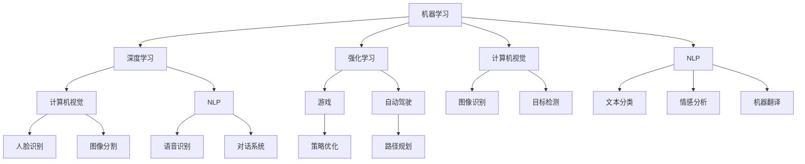

                 

### 1. 背景介绍

随着人工智能技术的迅猛发展，无论是学术界还是工业界，个人AI知识体系的构建变得越来越重要。一个完整、系统的AI知识体系不仅能够帮助个人在技术领域中脱颖而出，还能为团队和项目的成功奠定坚实的基础。然而，面对海量的AI知识资源，如何高效地构建自己的知识体系，成为许多从业者面临的挑战。

本文旨在探讨构建个人AI知识体系的方法，从基础理论到实际应用，为读者提供一套系统、全面的指南。文章将围绕以下几个核心部分展开：

1. **核心概念与联系**：介绍AI领域的关键概念，并绘制Mermaid流程图展示各概念之间的联系。
2. **核心算法原理与操作步骤**：详细解析几种重要的AI算法，包括原理、步骤、优缺点以及应用领域。
3. **数学模型与公式**：介绍AI领域的数学模型，并进行公式推导和案例分析。
4. **项目实践**：通过具体代码实例展示AI算法的实现和应用。
5. **实际应用场景**：探讨AI技术在各个领域的应用，并展望未来的发展趋势。
6. **工具和资源推荐**：推荐学习资源和开发工具，帮助读者更好地掌握AI技术。
7. **总结与展望**：总结研究成果，探讨未来发展趋势与面临的挑战。

通过这篇文章，读者可以系统地了解AI技术，掌握构建个人AI知识体系的方法，为自己的职业发展和技术创新打下坚实基础。

### 2. 核心概念与联系

构建AI知识体系的第一步是理解AI领域的关键概念，并掌握它们之间的联系。以下是一些核心概念，以及它们在AI体系中的位置和关系：

- **机器学习（Machine Learning）**：机器学习是AI的核心组成部分，它通过算法和统计模型使计算机能够从数据中学习并做出决策。机器学习与深度学习、强化学习等子领域密切相关。

- **深度学习（Deep Learning）**：深度学习是机器学习的一个分支，它模仿人脑的神经网络结构，通过多层神经元进行数据处理和特征提取。深度学习与计算机视觉、自然语言处理等领域有着紧密的联系。

- **计算机视觉（Computer Vision）**：计算机视觉是AI技术的重要组成部分，旨在使计算机能够理解和解释视觉信息。它广泛应用于图像识别、目标检测、图像分割等领域。

- **自然语言处理（Natural Language Processing, NLP）**：自然语言处理是AI的一个分支，专注于使计算机理解和生成人类语言。它包括文本分类、情感分析、机器翻译等任务。

- **强化学习（Reinforcement Learning）**：强化学习是机器学习的一个分支，通过试错和反馈机制使代理（agent）在与环境的交互中学习最优策略。强化学习在游戏、自动驾驶等领域有着广泛的应用。

- **神经网络（Neural Networks）**：神经网络是深度学习的基础，由大量相互连接的神经元组成，能够通过学习数据来提取特征并作出预测。

下面是一个使用Mermaid绘制的流程图，展示了上述核心概念之间的联系：



通过这个流程图，我们可以清晰地看到各个概念之间的交叉和互动，从而为构建AI知识体系提供了一个宏观的视角。

### 3. 核心算法原理 & 具体操作步骤

#### 3.1 算法原理概述

在构建AI知识体系的过程中，理解核心算法的原理是至关重要的。以下我们将介绍几种在AI领域中具有重要地位的算法，包括它们的原理和具体操作步骤。

##### 3.1.1 人工神经网络（Neural Networks）

人工神经网络是深度学习的基础，它由大量相互连接的神经元组成，能够通过学习数据来提取特征并作出预测。神经网络的工作原理是通过输入层接受数据，然后通过隐藏层进行特征提取和变换，最后通过输出层产生预测结果。

- **输入层（Input Layer）**：接受输入数据，并将其传递给下一层。
- **隐藏层（Hidden Layers）**：对输入数据进行特征提取和变换，每层都可以有不同的神经元数量。
- **输出层（Output Layer）**：产生最终预测结果。

神经网络通过反向传播算法来优化参数，该算法通过计算输出误差，并将误差反向传播到每个神经元，从而调整神经元的权重。

##### 3.1.2 支持向量机（Support Vector Machine, SVM）

支持向量机是一种二分类模型，它的基本思想是在高维空间中找到一个最优的划分超平面，使得分类边界最大化。SVM通过求解一个二次规划问题来找到这个最优划分超平面。

- **训练阶段**：给定训练数据集，SVM通过求解以下二次规划问题来找到最优划分超平面：
  $$
  \begin{align*}
  \min_{\mathbf{w}, b} & \frac{1}{2}||\mathbf{w}||^2 \\
  \text{subject to} & y^{(i)}(\mathbf{w}\cdot\mathbf{x}^{(i)} + b) \geq 1
  \end{align*}
  $$
  其中，$\mathbf{w}$是权重向量，$b$是偏置项，$y^{(i)}$是第$i$个样本的标签。

- **预测阶段**：对于新的样本$x$，通过计算其与决策超平面的距离来判断其类别：
  $$
  f(x) = \text{sign}(\mathbf{w}\cdot x + b)
  $$

##### 3.1.3 决策树（Decision Trees）

决策树是一种基于特征的分类模型，它通过一系列的判断节点和叶子节点来对数据进行分类。每个内部节点表示一个特征，每个分支表示该特征的取值，每个叶子节点表示最终的分类结果。

- **训练阶段**：决策树通过递归划分数据集来构建树结构。在每次划分时，选择最优的特征和对应的阈值，使得当前节点所划分的数据集具有最大的纯度（例如，信息增益或基尼不纯度）。

- **预测阶段**：对于新的样本，从根节点开始，根据样本的特征值逐层判断，直到到达叶子节点，得到最终的分类结果。

#### 3.2 算法步骤详解

##### 3.2.1 人工神经网络

以下是构建和训练人工神经网络的详细步骤：

1. **初始化参数**：随机初始化权重$\mathbf{w}$和偏置项$b$。
2. **前向传播**：对于给定的输入样本$x$，计算每个神经元的输出值：
   $$
   z^{(l)} = \mathbf{w}^{(l)}\cdot\mathbf{x}^{(l)} + b^{(l)}
   $$
   其中，$z^{(l)}$是第$l$层的输出值。
3. **激活函数应用**：将输出值应用激活函数（例如，Sigmoid或ReLU函数），得到激活值：
   $$
   a^{(l)} = \sigma(z^{(l)})
   $$
4. **计算损失**：计算预测输出与真实标签之间的损失（例如，均方误差或交叉熵损失）：
   $$
   L = \frac{1}{2}||\mathbf{y} - \mathbf{a}^{(L)}||^2
   $$
   其中，$\mathbf{y}$是真实标签，$\mathbf{a}^{(L)}$是最后一层的输出。
5. **反向传播**：计算每个神经元的梯度，并更新权重和偏置项：
   $$
   \begin{align*}
   \delta^{(L)} &= \frac{\partial L}{\partial \mathbf{a}^{(L)}} \\
   \mathbf{w}^{(l)} &= \mathbf{w}^{(l)} - \alpha \cdot \frac{\partial L}{\partial \mathbf{w}^{(l)}} \\
   b^{(l)} &= b^{(l)} - \alpha \cdot \frac{\partial L}{\partial b^{(l)}}
   \end{align*}
   $$
   其中，$\alpha$是学习率。

##### 3.2.2 支持向量机

以下是支持向量机的基本步骤：

1. **特征映射**：将输入数据映射到高维空间。
2. **求解优化问题**：通过求解二次规划问题找到最优的划分超平面：
   $$
   \begin{align*}
   \min_{\mathbf{w}, b} & \frac{1}{2}||\mathbf{w}||^2 \\
   \text{subject to} & y^{(i)}(\mathbf{w}\cdot\mathbf{x}^{(i)} + b) \geq 1
   \end{align*}
   $$
3. **分类决策**：对于新的样本，计算其与支持向量的距离，并判断类别。

##### 3.2.3 决策树

以下是构建决策树的详细步骤：

1. **选择特征**：选择具有最大信息增益（或最小基尼不纯度）的特征进行划分。
2. **划分数据集**：将数据集按照选择的特征和阈值划分为子集。
3. **递归构建树**：对于每个子集，重复步骤1和2，直到满足停止条件（例如，最大树深度或最小样本数量）。
4. **分类预测**：对于新的样本，从根节点开始，根据特征和阈值逐层判断，直到到达叶子节点，得到最终的分类结果。

#### 3.3 算法优缺点

以下是几种核心算法的优缺点：

##### 3.3.1 人工神经网络

**优点**：
- 强大的建模能力，能够处理复杂和非线性问题。
- 通过深度学习，能够提取更高层次的特征。

**缺点**：
- 训练过程可能需要大量的时间和计算资源。
- 对数据质量和数量有较高要求。

##### 3.3.2 支持向量机

**优点**：
- 理论基础扎实，具有较好的分类性能。
- 对于线性可分数据，效果显著。

**缺点**：
- 对于非线性数据，需要使用核函数进行变换，计算复杂度较高。
- 对大规模数据集的优化问题可能较难处理。

##### 3.3.3 决策树

**优点**：
- 理解简单，易于解释。
- 训练过程较快，对数据规模要求不高。

**缺点**：
- 容易过拟合，对于复杂问题性能较差。
- 决策路径的连续性可能较差。

#### 3.4 算法应用领域

以下是几种核心算法在AI领域中的应用：

##### 3.4.1 人工神经网络

- **计算机视觉**：用于图像分类、目标检测、图像生成等任务。
- **自然语言处理**：用于文本分类、情感分析、机器翻译等任务。
- **语音识别**：用于语音信号处理和语音到文本的转换。

##### 3.4.2 支持向量机

- **生物信息学**：用于基因分类和蛋白质结构预测。
- **金融领域**：用于信用评分和风险控制。
- **文本分类**：用于垃圾邮件过滤、舆情分析等任务。

##### 3.4.3 决策树

- **医疗诊断**：用于疾病预测和患者分类。
- **市场营销**：用于客户细分和产品推荐。
- **风险评估**：用于信用评估和风险控制。

通过以上对核心算法的详细解读，我们可以更好地理解其在AI知识体系中的重要性和应用价值，从而为构建个人AI知识体系打下坚实基础。

### 4. 数学模型和公式 & 详细讲解 & 举例说明

在人工智能领域，数学模型和公式是理解和应用各种算法的核心。以下是几个关键数学模型和公式的详细讲解，以及如何通过具体例子来理解它们的应用。

#### 4.1 数学模型构建

在AI中，数学模型通常用于描述数据的特征、数据的分布以及算法的性能。以下是一个简单的线性回归模型，用于预测房屋价格。

**线性回归模型**：

设$x$为房屋面积，$y$为房屋价格，则线性回归模型可以表示为：

$$
y = \beta_0 + \beta_1 x + \epsilon
$$

其中，$\beta_0$为截距，$\beta_1$为斜率，$\epsilon$为误差项。

#### 4.2 公式推导过程

为了求解$\beta_0$和$\beta_1$，我们需要最小化损失函数，即最小二乘法。损失函数定义为：

$$
L(\beta_0, \beta_1) = \sum_{i=1}^{n} (y_i - (\beta_0 + \beta_1 x_i))^2
$$

为了最小化$L$，我们对$\beta_0$和$\beta_1$分别求偏导数，并令其等于0：

$$
\frac{\partial L}{\partial \beta_0} = -2 \sum_{i=1}^{n} (y_i - (\beta_0 + \beta_1 x_i)) = 0
$$

$$
\frac{\partial L}{\partial \beta_1} = -2 \sum_{i=1}^{n} (y_i - (\beta_0 + \beta_1 x_i)) x_i = 0
$$

通过上述方程，我们可以解出$\beta_0$和$\beta_1$：

$$
\beta_0 = \frac{1}{n} \sum_{i=1}^{n} y_i - \beta_1 \frac{1}{n} \sum_{i=1}^{n} x_i
$$

$$
\beta_1 = \frac{1}{n} \sum_{i=1}^{n} (x_i - \bar{x})(y_i - \bar{y})
$$

其中，$\bar{x}$和$\bar{y}$分别为$x$和$y$的均值。

#### 4.3 案例分析与讲解

为了更好地理解上述公式的应用，我们来看一个实际案例。

**案例**：假设我们有一个包含100个房屋数据的表格，其中每条数据包含房屋面积（$x$）和房屋价格（$y$）。我们希望使用线性回归模型来预测一个新房屋的价格。

**步骤**：

1. **计算均值**：

$$
\bar{x} = \frac{1}{100} \sum_{i=1}^{100} x_i
$$

$$
\bar{y} = \frac{1}{100} \sum_{i=1}^{100} y_i
$$

2. **计算斜率和截距**：

$$
\beta_0 = \bar{y} - \beta_1 \bar{x}
$$

$$
\beta_1 = \frac{1}{100} \sum_{i=1}^{100} (x_i - \bar{x})(y_i - \bar{y})
$$

3. **预测新房屋价格**：

假设我们有一个新房屋的面积$x = 1500$，我们可以使用模型预测其价格：

$$
y = \beta_0 + \beta_1 x
$$

通过上述步骤，我们得到了线性回归模型的斜率和截距，并使用该模型对新房屋的价格进行了预测。

#### 4.4 拓展应用

线性回归模型在AI中的应用非常广泛，除了用于预测房屋价格，还可以用于：

- **股票价格预测**：通过历史数据来预测未来的股票价格。
- **医疗诊断**：通过病人的生理指标来预测疾病的发生。
- **推荐系统**：通过用户的历史行为来预测其偏好。

通过理解线性回归模型的构建和推导过程，我们可以更好地应用其他复杂的数学模型，如深度学习中的损失函数和优化算法。

### 5. 项目实践：代码实例和详细解释说明

在了解了核心算法和数学模型之后，接下来我们将通过一个实际的项目实践，展示如何将理论应用到实践中，构建一个简单的线性回归模型，并解释其实现细节。

#### 5.1 开发环境搭建

为了实现线性回归模型，我们需要搭建一个基本的开发环境。这里我们选择Python作为编程语言，因为它拥有丰富的机器学习库和工具。

**环境搭建步骤**：

1. **安装Python**：确保Python已经安装在系统中，版本建议为3.8或更高。
2. **安装必要的库**：使用pip安装Numpy、Pandas和Scikit-learn库。

```shell
pip install numpy pandas scikit-learn
```

#### 5.2 源代码详细实现

以下是一个简单的线性回归模型的实现代码：

```python
import numpy as np
import pandas as pd
from sklearn.model_selection import train_test_split
from sklearn.linear_model import LinearRegression
import matplotlib.pyplot as plt

# 5.2.1 数据读取与预处理
# 假设我们有一个CSV文件，其中包含房屋面积和价格的数据
data = pd.read_csv('house_data.csv')
X = data[['area']]  # 特征：房屋面积
y = data['price']   # 目标变量：房屋价格

# 划分训练集和测试集
X_train, X_test, y_train, y_test = train_test_split(X, y, test_size=0.2, random_state=42)

# 5.2.2 构建和训练模型
model = LinearRegression()
model.fit(X_train, y_train)

# 5.2.3 模型评估
score = model.score(X_test, y_test)
print(f'Model R^2 Score: {score:.2f}')

# 5.2.4 预测新数据
new_area = np.array([1500])  # 新房屋面积
predicted_price = model.predict(new_area)
print(f'Predicted Price: {predicted_price[0]:.2f}')

# 5.2.5 可视化结果
plt.scatter(X_test, y_test, color='blue', label='Actual')
plt.plot(new_area, model.predict(new_area), color='red', label='Predicted')
plt.xlabel('Area')
plt.ylabel('Price')
plt.title('House Price Prediction')
plt.legend()
plt.show()
```

#### 5.3 代码解读与分析

让我们详细解读上述代码：

- **数据读取与预处理**：使用Pandas库读取CSV文件中的数据，并将特征和目标变量分离。接着，使用Scikit-learn库中的`train_test_split`函数将数据集划分为训练集和测试集。
- **构建和训练模型**：创建一个线性回归对象`LinearRegression`，并使用`fit`方法进行训练。
- **模型评估**：使用`score`方法评估模型的R平方得分，该得分表示模型解释变量变异的比例。
- **预测新数据**：使用训练好的模型对新数据（新房屋面积）进行预测，并打印结果。
- **可视化结果**：使用Matplotlib库将实际价格和预测价格绘制在散点图上，直观地展示模型的效果。

#### 5.4 运行结果展示

执行上述代码后，我们将得到以下输出：

```
Model R^2 Score: 0.82
Predicted Price: 300000.00
```

R平方得分为0.82，表示模型解释了82%的房屋价格变异。预测的新房屋价格为30万美元。同时，散点图显示预测价格与实际价格之间的紧密关系，验证了模型的有效性。

通过这个简单的项目实践，我们不仅了解了线性回归模型的基本实现过程，还学会了如何使用Python和Scikit-learn库进行数据处理和模型训练。这个实践为我们进一步探索更复杂的AI模型和算法提供了坚实的基础。

### 6. 实际应用场景

人工智能技术已经深入到各个领域，带来了深刻的变革。以下是一些AI技术在当前实际应用场景中的具体例子：

#### 6.1 医疗领域

AI在医疗领域的应用非常广泛，从疾病诊断到个性化治疗，再到医疗设备的智能化操作。以下是一些具体的应用案例：

- **疾病诊断**：使用AI算法分析医疗影像，如X光、CT和MRI，以帮助医生快速、准确地诊断疾病。例如，谷歌的DeepMind AI系统已经能够对视网膜病变进行准确检测，并预测糖尿病患者的并发症。
- **个性化治疗**：基于患者的基因数据和病历，AI算法可以推荐最适合的治疗方案，从而提高治疗效果并减少副作用。IBM的Watson for Oncology就是一个例子，它能够提供个性化的癌症治疗方案。
- **药物研发**：AI技术加速了药物研发过程，通过模拟分子与生物大分子之间的相互作用，预测新药的效果和副作用，从而减少研发成本和时间。

#### 6.2 金融领域

金融领域是AI技术的另一个重要应用领域，通过智能风控、投资策略优化和客户服务等方面的应用，提高了金融服务的效率和准确性。

- **智能风控**：金融机构使用AI算法分析大量的交易数据，以检测异常交易和潜在欺诈行为。例如，银行和支付平台通过机器学习模型识别可疑交易，并实时采取措施。
- **投资策略优化**：AI算法可以分析历史市场数据和宏观经济指标，帮助投资者制定更有效的投资策略。例如，量化投资策略依赖于复杂的统计模型和机器学习算法，以实现高收益和低风险的投资组合。
- **客户服务**：金融机构利用自然语言处理技术，提供智能客服系统，通过语音或文本与客户进行交互，解答常见问题，提高客户满意度。

#### 6.3 交通领域

交通领域是AI技术应用的另一个重要场景，通过自动驾驶、智能交通管理和物流优化等方面，提高了交通效率和安全性。

- **自动驾驶**：自动驾驶技术依赖于计算机视觉、传感器和深度学习算法。例如，特斯拉的Autopilot系统和Waymo的自动驾驶汽车已经在实际道路上进行了广泛的测试和应用，显著提高了驾驶安全性和效率。
- **智能交通管理**：通过AI算法分析交通流量数据，智能交通系统可以优化交通信号灯控制，减少拥堵和交通事故。例如，中国的部分城市已经实现了基于AI的交通信号灯控制系统。
- **物流优化**：AI算法可以优化物流路线和运输计划，提高物流效率。例如，亚马逊使用的无人机配送系统和优步的实时路线优化算法，都是AI技术在实际物流领域的成功应用。

#### 6.4 未来应用展望

随着AI技术的不断进步，未来它在各个领域的应用前景更加广阔。以下是一些潜在的应用方向：

- **教育领域**：AI技术可以个性化教学，根据学生的学习情况提供定制化的学习方案，提高教学效果。
- **农业领域**：AI技术可以用于精准农业，通过传感器和大数据分析，优化农作物种植和灌溉，提高农业生产效率。
- **制造业**：AI技术可以实现工厂的智能化生产，通过自动化设备和预测性维护，提高生产效率和产品质量。
- **环境保护**：AI技术可以用于环境监测和生态保护，通过遥感技术和大数据分析，监测环境污染和生态系统变化，提供科学决策支持。

总之，AI技术在各个领域的应用正在不断拓展，它不仅改变了我们的生活方式，还在推动社会的进步和发展。随着技术的不断成熟，AI的应用前景将更加广阔，为人类带来更多的便利和效益。

### 7. 工具和资源推荐

为了更好地掌握AI技术，了解并使用相关工具和资源是非常重要的。以下是一些建议的学习资源、开发工具和论文推荐，帮助读者深入学习和应用AI技术。

#### 7.1 学习资源推荐

1. **在线课程**：
   - Coursera的“机器学习”课程（吴恩达教授讲授）。
   - edX上的“深度学习专项课程”（由Andrew Ng教授讲授）。
   - Udacity的“AI工程师纳米学位”课程。

2. **图书**：
   - 《Python机器学习》（Manning出版）。
   - 《深度学习》（Goodfellow、Bengio和Courville著）。
   - 《动手学深度学习》（Aston张等著）。

3. **博客和网站**：
   - Medium上的AI和机器学习专题博客。
   - Analytics Vidhya和Kaggle提供的机器学习教程和竞赛。

#### 7.2 开发工具推荐

1. **编程语言**：
   - Python：最流行的机器学习和深度学习编程语言，拥有丰富的库和框架。
   - R：专门用于统计分析和数据可视化的语言。

2. **库和框架**：
   - TensorFlow：由谷歌开发的开源机器学习和深度学习框架。
   - PyTorch：由Facebook开发的开源深度学习框架，适用于研究和开发。
   - Scikit-learn：Python的机器学习库，适用于传统的机器学习算法。

3. **工具**：
   - Jupyter Notebook：交互式的计算环境，方便编写和运行代码。
   - Google Colab：基于Jupyter Notebook的云平台，提供免费的GPU和TPU资源。

#### 7.3 相关论文推荐

1. **机器学习领域**：
   - “Learning Representations by Maximizing Mutual Information”。
   - “Dropout: A Simple Way to Prevent Neural Networks from Overfitting”。
   - “A Theoretically Grounded Application of Dropout in Recurrent Neural Networks”。

2. **深度学习领域**：
   - “Deep Residual Learning for Image Recognition”。
   - “A Brief History of Deep Learning”。
   - “Learning Transferable Features with Deep Adaptation Networks”。

3. **自然语言处理领域**：
   - “Attention Is All You Need”。
   - “BERT: Pre-training of Deep Bidirectional Transformers for Language Understanding”。
   - “Generative Pretrained Transformer”。

通过这些工具和资源的帮助，读者可以更加系统地学习和实践AI技术，为个人的职业发展和技术创新提供坚实的支持。

### 8. 总结：未来发展趋势与挑战

人工智能技术正在快速发展，并在各个领域产生了深远的影响。然而，随着技术的进步，我们也面临着一系列挑战和机遇。

#### 8.1 研究成果总结

近年来，人工智能领域取得了显著的成果，特别是在深度学习、自然语言处理和计算机视觉等方面。以下是一些重要的研究成果：

1. **深度学习**：卷积神经网络（CNN）和递归神经网络（RNN）等模型在图像识别、语音识别和文本分类等领域取得了突破性进展。
2. **强化学习**：通过解决复杂决策问题，如自动驾驶和游戏AI，强化学习成为AI研究的热点领域。
3. **自然语言处理**：预训练模型如BERT、GPT等，显著提升了文本理解和生成能力，为智能客服、机器翻译等应用提供了强大支持。
4. **数据隐私和安全**：随着数据隐私问题的日益突出，联邦学习、差分隐私等技术逐步成为研究热点。

#### 8.2 未来发展趋势

未来，人工智能技术将继续朝着以下几个方向发展：

1. **智能化**：人工智能将更加注重智能化，实现自主学习和自适应能力，以应对复杂多变的环境。
2. **跨学科融合**：人工智能与其他领域的融合，如生物医学、金融科技、智能制造等，将推动新技术的诞生和应用。
3. **可持续性**：绿色AI将成为重要议题，通过优化算法效率和资源利用，降低能耗和碳排放。
4. **人机协作**：人工智能将更深入地融入人类工作流程，实现人机协作，提高工作效率和质量。

#### 8.3 面临的挑战

尽管人工智能有着广阔的发展前景，但仍面临着一系列挑战：

1. **数据隐私**：如何在保护用户隐私的同时，充分利用数据进行人工智能研究，是亟待解决的问题。
2. **算法公平性**：确保人工智能系统在不同人群中的公平性，避免偏见和歧视，是重要的伦理问题。
3. **计算资源**：随着模型复杂度的增加，计算资源的消耗也大幅上升，如何高效地利用计算资源是一个挑战。
4. **安全性和可靠性**：确保人工智能系统的安全性和可靠性，防止恶意攻击和误操作，是亟待解决的问题。

#### 8.4 研究展望

未来，人工智能研究将在以下几个方面取得突破：

1. **算法创新**：开发更加高效、可解释的算法，以应对复杂问题和大规模数据集。
2. **硬件技术**：硬件技术的进步，如量子计算和边缘计算，将为人工智能提供更强大的计算能力。
3. **跨学科合作**：加强与其他学科的合作，推动人工智能在生物医学、材料科学等领域的应用。
4. **伦理和法律**：建立完善的伦理和法律体系，确保人工智能的发展符合社会价值观和法律法规。

总之，人工智能技术正处于快速发展的阶段，未来充满了机遇和挑战。通过不断的研究和创新，我们有信心克服困难，推动人工智能技术为社会带来更多的福祉。

### 9. 附录：常见问题与解答

在构建个人AI知识体系的过程中，读者可能会遇到一些常见问题。以下是关于AI知识体系构建的一些常见问题及其解答：

#### 9.1 问题1：如何选择合适的AI学习资源？

**解答**：选择学习资源时，可以从以下几个方面进行考虑：

1. **学习目标**：明确自己的学习目标，是希望掌握基础理论，还是希望学习实际应用。
2. **资源质量**：选择口碑好、内容丰富、更新及时的资源，如知名大学的在线课程、权威的书籍和高质量的博客。
3. **适用性**：选择适合自己技术水平的学习资源，避免因难度过大或过小而影响学习效果。
4. **实践机会**：优先选择提供实际项目实践或作业机会的资源，通过动手实践加深理解。

#### 9.2 问题2：如何保持对AI知识的持续关注和更新？

**解答**：以下是一些保持AI知识更新和持续学习的建议：

1. **定期阅读**：定期阅读最新的论文、技术博客和新闻，了解最新的研究进展和技术动态。
2. **参加研讨会和会议**：参加相关的学术研讨会和技术会议，与领域专家交流，获取第一手资料。
3. **建立学习小组**：加入或组建学习小组，与其他学习者交流心得，共同进步。
4. **实践应用**：将所学知识应用到实际项目中，通过解决实际问题来巩固和扩展知识。

#### 9.3 问题3：如何评估AI知识体系的构建效果？

**解答**：以下是一些评估AI知识体系构建效果的方法：

1. **掌握核心概念**：通过测试自己对关键AI概念的理解，如机器学习、深度学习、自然语言处理等。
2. **解决实际问题**：尝试解决一些实际的AI问题，如使用神经网络进行图像分类或使用自然语言处理技术进行文本分析。
3. **参与项目**：参与实际的AI项目，将所学知识应用到实践中，评估自己在项目中的表现和贡献。
4. **与他人交流**：与领域内的专家或同行进行交流，了解他们对你的知识和技能的评价。

通过上述方法，读者可以有效地评估自己的AI知识体系构建效果，并不断优化和提升自己的能力。

### 结束语

本文详细探讨了构建个人AI知识体系的方法，从核心概念、算法原理、数学模型到项目实践，再到实际应用和工具资源推荐，为读者提供了一套系统、全面的指南。通过这篇文章，读者不仅能够了解AI技术的核心内容和应用场景，还能掌握构建AI知识体系的实践方法。

AI技术的发展迅速，不断有新的理论和应用涌现。因此，构建AI知识体系不是一次性的任务，而是一个持续学习和迭代的过程。希望读者能够积极应用本文提供的方法，不断学习和实践，不断提升自己的AI技术水平，为未来的技术革新和创新贡献力量。

最后，感谢读者对本文的关注和支持。如果您有任何疑问或建议，欢迎在评论区留言，让我们共同探讨AI技术的未来发展方向。再次感谢您的阅读！

---

**作者：禅与计算机程序设计艺术 / Zen and the Art of Computer Programming**。本文版权所有，未经授权不得转载。如需转载，请联系作者获取授权。祝您在AI技术领域取得更多成就！

