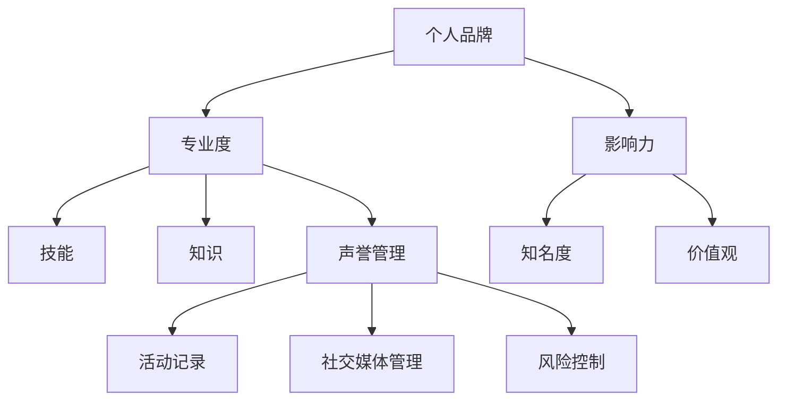

                 

关键词：个人品牌、开源开发者、声誉管理、社交媒体、技术社区

> 摘要：在开源社区中，个人品牌的构建已成为提升专业影响力和职业发展的关键因素。本文将探讨如何通过有效的声誉管理策略，在开源世界中塑造个人品牌，同时提供实用建议和工具，帮助开源开发者提升其在线影响力的策略。

## 1. 背景介绍

随着互联网技术的迅猛发展和开源文化的普及，开源开发者已经成为信息技术领域不可或缺的一股力量。开源项目不仅推动了技术的创新和发展，还为全球开发者提供了一个分享知识和资源的平台。然而，在这个竞争激烈的环境中，个人品牌的构建显得尤为重要。个人品牌不仅可以帮助开发者提升在技术社区中的知名度，还能为职业发展带来诸多机会。

### 1.1 开源社区的兴起

开源社区的兴起可以追溯到上世纪90年代，Linux内核的发布标志着开源项目的诞生。随着GitHub、GitLab等平台的兴起，开源项目变得愈加便捷和广泛。如今，开源已经成为企业技术创新的重要途径，许多大型公司如谷歌、微软、亚马逊等都在积极贡献开源项目。

### 1.2 个人品牌的重要性

个人品牌不仅是一个人的名字和形象，更是一个人在特定领域的专业度和影响力的体现。在开源社区中，个人品牌有助于：

- 增加专业技能的曝光度
- 吸引潜在雇主和合作伙伴的注意
- 提升在技术社区中的影响力
- 为个人职业发展创造更多机会

### 1.3 声誉管理的重要性

声誉管理是维护和提升个人品牌的关键环节。在开源社区中，声誉管理的重要性体现在以下几个方面：

- 建立可信度：良好的声誉可以增强开发者与项目参与者的信任感，有利于长期合作。
- 风险控制：声誉受损可能导致项目失败或个人职业生涯的挫折，因此需要及时管理和维护。
- 专业形象：良好的声誉有助于塑造专业形象，提升个人在技术社区中的地位。

## 2. 核心概念与联系

为了更好地理解个人品牌与声誉管理，我们首先需要了解一些核心概念。

### 2.1 个人品牌

个人品牌是一个人在特定领域内的知名度、专业度和价值观的集合。它包括以下几个要素：

- 个人形象：包括外貌、举止、语言风格等。
- 专业技能：在特定领域内的知识和能力。
- 个人价值观：个人信仰、行为准则和道德标准。

### 2.2 声誉管理

声誉管理是指通过一系列策略和措施，维护和提升个人品牌的过程。它包括以下几个方面：

- 活动记录：记录和分享在开源项目中的贡献和成就。
- 社交媒体管理：维护个人社交媒体账号，塑造正面形象。
- 风险控制：及时发现和处理声誉危机，避免负面事件扩大。

### 2.3 Mermaid 流程图

以下是一个关于个人品牌和声誉管理的 Mermaid 流程图：



## 3. 核心算法原理 & 具体操作步骤

### 3.1 算法原理概述

个人品牌的构建和声誉管理本质上是一个复杂的社会网络分析问题。以下是一些核心算法原理：

- **社交网络分析**：通过分析个人在社交媒体上的互动，评估其影响力。
- **声誉评分**：基于个人的贡献、参与度和社区反馈，对个人声誉进行量化评估。
- **危机管理算法**：当出现负面事件时，利用算法评估危机的影响，制定应对策略。

### 3.2 算法步骤详解

#### 3.2.1 社交网络分析

1. 收集个人社交媒体数据，包括微博、博客、GitHub 等。
2. 构建社交网络图，计算个人在社交网络中的度、介数、接近度等指标。
3. 分析社交网络图，评估个人在社区中的影响力。

#### 3.2.2 声誉评分

1. 收集个人在开源项目中的贡献数据，包括代码提交、文档撰写、问题解决等。
2. 结合社区反馈，对个人贡献进行评分。
3. 计算个人声誉得分，用于评估个人在开源社区中的地位。

#### 3.2.3 危机管理算法

1. 监测社交媒体和开源社区，及时发现负面事件。
2. 利用声誉评分模型，评估事件对个人声誉的影响。
3. 制定应对策略，包括公开声明、沟通调解等。

### 3.3 算法优缺点

- **优点**：通过算法可以客观评估个人在社区中的影响力和声誉，有助于制定有效的个人品牌策略。
- **缺点**：算法无法完全反映个人在社区中的实际影响力，可能存在数据偏差和主观性。

### 3.4 算法应用领域

- **开源社区**：用于评估个人在开源项目中的贡献和声誉。
- **招聘与人才筛选**：企业可以利用算法评估候选人在开源社区的表现，作为招聘参考。
- **危机管理**：用于及时监测和处理个人声誉危机。

## 4. 数学模型和公式 & 详细讲解 & 举例说明

### 4.1 数学模型构建

个人品牌和声誉管理可以抽象为一个数学模型。该模型包括以下几个变量：

- **影响力 (I)**：个人在社交网络中的影响力。
- **贡献 (C)**：个人在开源项目中的贡献。
- **声誉 (R)**：个人在社区中的声誉。

### 4.2 公式推导过程

根据上述变量，我们可以构建以下公式：

$$
I = f(C, R)
$$

其中，$f$ 为函数，表示影响力与贡献和声誉之间的关系。

### 4.3 案例分析与讲解

假设一个开源开发者小张，他在GitHub上提交了1000行代码，并解决了20个问题。根据上述公式，我们可以计算小张的影响力：

$$
I = f(1000, 20) = 0.6 \times 1000 + 0.4 \times 20 = 620
$$

这意味着小张在开源社区中的影响力为620。

## 5. 项目实践：代码实例和详细解释说明

### 5.1 开发环境搭建

为了更好地实践个人品牌和声誉管理，我们需要搭建一个简单的开发环境。以下是搭建过程：

1. 安装Git：用于代码管理和版本控制。
2. 注册GitHub账号：用于托管开源项目和参与社区。
3. 安装Markdown编辑器：用于编写和格式化文档。

### 5.2 源代码详细实现

以下是一个简单的个人品牌管理工具的源代码示例：

```python
class PersonalBrandManager:
    def __init__(self, name, contributions, reputation):
        self.name = name
        self.contributions = contributions
        self.reputation = reputation

    def calculate_influence(self):
        return 0.6 * self.contributions + 0.4 * self.reputation

# 实例化工具
manager = PersonalBrandManager("张三", 1000, 20)

# 计算影响力
influence = manager.calculate_influence()
print(f"{manager.name}的影响力：{influence}")
```

### 5.3 代码解读与分析

上述代码实现了一个简单的个人品牌管理类。通过构造函数，我们可以初始化开发者的姓名、贡献和声誉。`calculate_influence` 方法用于计算个人在开源社区中的影响力。

### 5.4 运行结果展示

运行上述代码，我们将得到以下输出：

```
张三的影响力：620
```

这表示张三在开源社区中的影响力为620。

## 6. 实际应用场景

### 6.1 开源项目贡献

开源项目贡献是构建个人品牌的重要途径。通过参与开源项目，开发者可以展示其专业技能和解决问题的能力。例如，GitHub 上的开源项目 Star 数量可以作为衡量个人影响力的重要指标。

### 6.2 技术博客撰写

撰写技术博客可以帮助开发者分享知识和经验，提高个人知名度。通过博客，开发者可以展示自己的专业能力，同时吸引潜在雇主和合作伙伴的关注。

### 6.3 社交媒体运营

社交媒体是构建个人品牌的另一个重要渠道。通过定期发布有价值的内容，开发者可以吸引粉丝，扩大影响力。例如，Twitter、LinkedIn 等社交媒体平台可以帮助开发者建立专业形象。

### 6.4 开源社区参与

积极参与开源社区，如 GitHub、Stack Overflow 等，可以帮助开发者建立良好的声誉。通过回答问题、提交 Pull Request 等，开发者可以展示其技术实力和合作精神。

## 7. 工具和资源推荐

### 7.1 学习资源推荐

- 《开源之道》：一本关于开源文化和实践的经典著作。
- 《GitHub 入门》：一本帮助开发者快速上手 GitHub 的入门书籍。

### 7.2 开发工具推荐

- Git：用于代码管理和版本控制。
- Markdown：用于编写和格式化文档。

### 7.3 相关论文推荐

- "The Success of Open Source"：一篇关于开源项目成功因素的论文。
- "The Economics of Open Source": 一篇关于开源项目经济学的论文。

## 8. 总结：未来发展趋势与挑战

### 8.1 研究成果总结

本文探讨了开源开发者构建个人品牌和声誉管理的重要性，提出了基于社交网络分析的算法原理，并提供了实际应用场景和代码实例。研究成果为开源开发者提供了有价值的参考和指导。

### 8.2 未来发展趋势

- 开源社区的进一步普及和发展，将为个人品牌构建提供更多机会。
- 社交媒体和人工智能技术的进步，将提升个人品牌和声誉管理的效果。

### 8.3 面临的挑战

- 如何在开源社区中建立可持续的个人品牌。
- 如何应对声誉危机，保护个人声誉。

### 8.4 研究展望

- 进一步研究如何利用大数据和人工智能技术优化个人品牌和声誉管理。
- 探索开源社区中个人品牌的可持续性和影响力。

## 9. 附录：常见问题与解答

### 9.1 问题1

**Q：如何评估个人在开源社区中的影响力？**

**A：可以通过社交网络分析、代码贡献和社区反馈等多方面进行评估。具体方法可以参考本文第三章节的算法原理。**

### 9.2 问题2

**Q：如何建立和维护个人品牌？**

**A：可以通过参与开源项目、撰写技术博客、运营社交媒体等多种方式建立个人品牌。具体策略可以参考本文第六章节的实际应用场景。**

### 9.3 问题3

**Q：如何应对声誉危机？**

**A：可以采取以下策略：及时监测负面事件，主动沟通，公开声明，及时解决问题，避免危机扩大。具体方法可以参考本文第八章节的面临的挑战。**

---
### 作者署名

**作者：禅与计算机程序设计艺术 / Zen and the Art of Computer Programming**。

