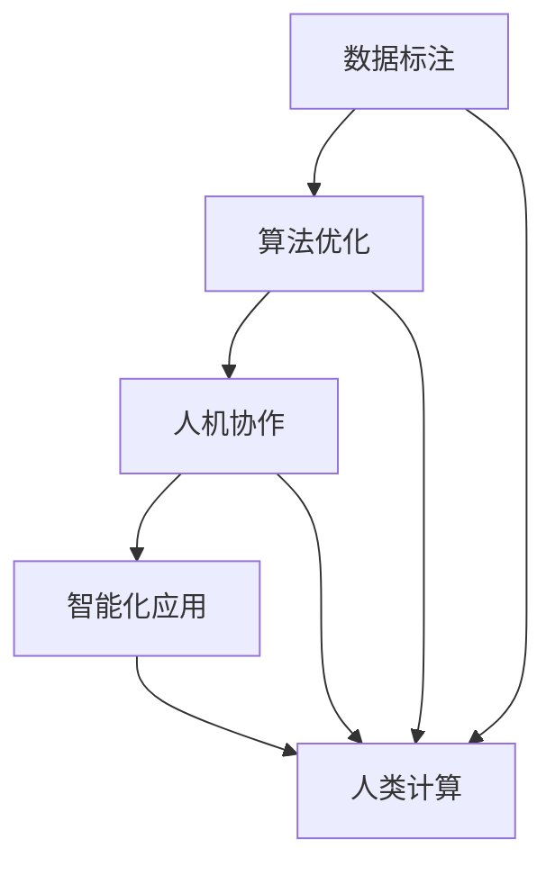

                 

在科技迅猛发展的时代，人工智能（AI）已成为推动社会进步的重要力量。从语音识别到自动驾驶，从医疗诊断到金融分析，AI技术的广泛应用正在深刻改变我们的生活和工作方式。然而，AI技术的发展并非一蹴而就，它需要人类计算的支持与协作，以构建一个更智能的世界。本文将探讨人类计算在AI应用场景中的关键作用，以及如何通过技术创新推动这一领域的进一步发展。

## 文章关键词

- 人工智能
- 人类计算
- 应用场景
- 技术创新
- 智能世界

## 文章摘要

本文旨在探讨人类计算在人工智能应用场景中的重要性。通过分析AI在不同领域的实际应用，本文将阐述人类计算如何与AI相结合，推动社会智能化进程。同时，本文还将讨论未来AI技术的发展趋势与挑战，为相关领域的研究者与实践者提供有益的参考。

## 1. 背景介绍

随着计算能力的不断提升和大数据的广泛应用，人工智能技术取得了显著的进展。AI算法，尤其是深度学习，已经能够在各种复杂任务中表现出色，如图像识别、自然语言处理和游戏对战等。然而，AI的发展并非孤立的，它需要人类计算的支持和引导。人类计算在AI中的应用主要体现在以下几个方面：

### 数据标注

在训练AI模型时，需要大量的标注数据。这些数据通常由人类专家进行标注，确保数据的准确性和一致性。例如，在图像识别任务中，人类专家可以精确标注图像中的物体类别，帮助AI模型学习识别特征。

### 算法优化

AI算法的优化往往需要人类智慧的参与。通过对算法的理论研究和实验验证，人类计算可以提出更有效的算法优化方案，提高AI模型的性能。

### 人机协作

在实际应用中，人类和AI系统往往需要协作完成任务。例如，在医疗诊断中，AI系统可以帮助医生分析影像数据，但最终的诊断决策仍然由医生根据AI提供的信息和自己的专业经验共同做出。

## 2. 核心概念与联系

为了更好地理解人类计算在AI中的应用，我们需要先了解一些核心概念。以下是一个Mermaid流程图，展示这些概念之间的联系。



在这个流程图中，数据标注、算法优化和人机协作是连接人类计算和智能化应用的三个关键环节。通过这些环节，人类计算可以为AI系统提供必要的支持和指导，从而实现更智能的应用。

### 数据标注

数据标注是AI训练的基础。它包括对图像、文本、音频等数据进行分类、标注和打标签。标注数据的质量直接影响到AI模型的性能。例如，在训练一个图像识别模型时，标注数据的准确性对于模型识别图像中的物体至关重要。

### 算法优化

算法优化是指通过改进算法设计、优化算法实现，以提高AI模型的效率和准确性。算法优化可以是基于数学理论的，也可以是基于实验数据的。通过算法优化，我们可以使AI模型在更短时间内达到更好的性能。

### 人机协作

人机协作是指人类与AI系统共同完成任务的协作模式。在这种模式中，AI系统可以辅助人类完成任务，而人类则可以提供专业知识和经验，以指导AI系统的决策。例如，在医疗诊断中，AI系统可以帮助医生分析影像数据，但最终的诊断结果仍需由医生根据AI提供的信息和自己的经验共同判断。

### 智能化应用

智能化应用是指将AI技术应用于实际场景，以实现自动化、智能化和高效的解决方案。智能化应用的范围非常广泛，包括自动驾驶、智能家居、智能医疗、智能金融等。

### 人类计算

人类计算是指人类在AI开发和应用过程中的智力投入。它包括数据标注、算法优化、人机协作等多个环节，是人类智慧和AI技术相结合的产物。

## 3. 核心算法原理 & 具体操作步骤

### 3.1 算法原理概述

人类计算在AI算法中的应用主要涉及以下几个核心算法：

- **数据标注算法**：用于对大量数据进行标注，以供AI模型训练。
- **优化算法**：用于改进AI模型的效率和准确性。
- **协作算法**：用于实现人类与AI系统的协作。

### 3.2 算法步骤详解

#### 数据标注算法

数据标注算法的步骤通常包括：

1. **数据收集**：从各种来源收集需要标注的数据。
2. **数据预处理**：对数据进行清洗、去噪和标准化处理。
3. **标注**：由人类专家对数据中的对象、类别、标签等进行标注。
4. **评估**：评估标注数据的准确性和一致性。

#### 优化算法

优化算法的步骤包括：

1. **问题定义**：明确优化目标，如提高模型的准确性、降低计算成本等。
2. **算法选择**：选择适合的优化算法，如梯度下降、随机搜索等。
3. **参数调整**：调整算法参数，以获得最优性能。
4. **评估**：评估优化后的模型性能，以确定优化效果。

#### 协作算法

协作算法的步骤包括：

1. **任务分配**：将任务分配给人类和AI系统。
2. **信息共享**：确保人类和AI系统能够共享必要的信息和数据。
3. **决策融合**：将人类和AI系统的决策进行融合，以获得最佳结果。
4. **反馈循环**：根据任务结果进行反馈，以不断改进协作效果。

### 3.3 算法优缺点

#### 数据标注算法

优点：
- 数据标注可以提高AI模型的训练效果。
- 数据标注可以提供更准确、更有用的训练数据。

缺点：
- 数据标注需要大量人力和时间成本。
- 数据标注的质量直接影响到AI模型的性能。

#### 优化算法

优点：
- 优化算法可以提高AI模型的性能。
- 优化算法可以降低模型的计算成本。

缺点：
- 优化算法需要复杂的设计和实现。
- 优化算法的结果可能不稳定，需要多次调整。

#### 协作算法

优点：
- 协作算法可以提高任务的完成效率。
- 协作算法可以充分发挥人类和AI系统的优势。

缺点：
- 协作算法的设计和实现较为复杂。
- 协作算法可能需要额外的通信和协调成本。

### 3.4 算法应用领域

#### 数据标注算法

数据标注算法广泛应用于图像识别、自然语言处理和语音识别等领域。例如，在图像识别中，数据标注可以用于标注图像中的物体、场景和动作等；在自然语言处理中，数据标注可以用于标注文本中的实体、关系和情感等。

#### 优化算法

优化算法广泛应用于各种AI模型和任务中，如神经网络、决策树和聚类算法等。优化算法可以提高模型的准确性和效率，从而在医疗诊断、金融分析和自动驾驶等应用场景中发挥重要作用。

#### 协作算法

协作算法广泛应用于人机交互、智能医疗和智能制造等领域。例如，在智能医疗中，协作算法可以用于医生和AI系统的协作诊断；在智能制造中，协作算法可以用于人类操作员和机器人协作完成任务。

## 4. 数学模型和公式 & 详细讲解 & 举例说明

### 4.1 数学模型构建

在人类计算与AI结合的过程中，数学模型扮演着重要角色。以下是一个简单的数学模型构建过程，用于说明人类计算如何与AI算法结合。

#### 问题定义

假设我们有一个分类问题，需要将数据集中的样本分类到不同的类别中。我们使用一个二分类问题进行说明。

#### 数学模型

我们使用逻辑回归模型进行分类。逻辑回归模型是一个线性模型，其预测函数为：

$$
P(y=1) = \frac{1}{1 + e^{-(\beta_0 + \beta_1 x_1 + \beta_2 x_2 + ... + \beta_n x_n})}
$$

其中，$y$ 是目标变量的取值，$x_1, x_2, ..., x_n$ 是特征向量，$\beta_0, \beta_1, \beta_2, ..., \beta_n$ 是模型的参数。

#### 模型优化

为了优化模型参数，我们使用梯度下降法。梯度下降法的步骤如下：

1. **初始化参数**：随机初始化模型参数。
2. **计算损失函数**：计算预测值与实际值之间的损失。
3. **更新参数**：根据损失函数的梯度更新模型参数。
4. **迭代**：重复步骤2和3，直到损失函数收敛或达到预设的迭代次数。

### 4.2 公式推导过程

逻辑回归模型的损失函数通常采用交叉熵损失函数。交叉熵损失函数的推导过程如下：

$$
L(\theta) = -\frac{1}{m} \sum_{i=1}^{m} [y^{(i)} \log (h_\theta(x^{(i)})) + (1 - y^{(i)}) \log (1 - h_\theta(x^{(i)}))]
$$

其中，$m$ 是训练数据集的大小，$y^{(i)}$ 是第$i$个样本的真实标签，$h_\theta(x^{(i)} )$ 是模型对第$i$个样本的预测概率。

为了优化损失函数，我们需要计算损失函数关于模型参数的梯度。梯度下降法的核心思想是沿着梯度的反方向更新模型参数，以最小化损失函数。

### 4.3 案例分析与讲解

假设我们有一个包含100个样本的二分类问题。样本的特征包括年龄、收入和婚姻状况。我们使用逻辑回归模型进行分类，目标是将样本分为“高收入”和“低收入”两类。

#### 数据预处理

首先，我们对数据进行预处理，将连续特征（如年龄、收入）转换为分类特征（如年龄段、收入区间）。然后，我们使用训练集对模型进行训练，使用测试集对模型进行评估。

#### 模型训练

使用梯度下降法对模型进行训练。在训练过程中，我们不断更新模型参数，以最小化损失函数。经过多次迭代后，模型收敛，损失函数趋于稳定。

#### 模型评估

使用测试集对模型进行评估。通过计算模型的准确率、召回率和F1分数，我们可以评估模型在分类任务中的性能。

## 5. 项目实践：代码实例和详细解释说明

在本节中，我们将通过一个具体的案例来展示如何在实际项目中使用人类计算与AI技术相结合。以下是一个简单的Python代码实例，用于实现逻辑回归模型在二分类问题中的应用。

### 5.1 开发环境搭建

首先，我们需要搭建一个Python开发环境。以下是所需的软件和库：

- Python 3.x
- NumPy
- Scikit-learn
- Matplotlib

安装这些库后，我们就可以开始编写代码了。

### 5.2 源代码详细实现

以下是一个简单的Python代码实例，用于实现逻辑回归模型在二分类问题中的应用。

```python
import numpy as np
from sklearn.linear_model import LogisticRegression
from sklearn.model_selection import train_test_split
from sklearn.metrics import accuracy_score, confusion_matrix
import matplotlib.pyplot as plt

# 数据预处理
def preprocess_data(X, y):
    # 将连续特征转换为分类特征
    # 在这里，我们使用简单的线性变换
    X = np.log1p(X)
    return X, y

# 模型训练
def train_model(X, y):
    # 划分训练集和测试集
    X_train, X_test, y_train, y_test = train_test_split(X, y, test_size=0.2, random_state=42)

    # 创建逻辑回归模型
    model = LogisticRegression()

    # 训练模型
    model.fit(X_train, y_train)

    # 评估模型
    y_pred = model.predict(X_test)
    accuracy = accuracy_score(y_test, y_pred)
    cm = confusion_matrix(y_test, y_pred)

    return model, accuracy, cm

# 数据加载和预处理
# 这里我们假设已经有一个数据集
data = np.loadtxt("data.csv", delimiter=",")
X = data[:, :-1]
y = data[:, -1]

X, y = preprocess_data(X, y)

# 模型训练和评估
model, accuracy, cm = train_model(X, y)

# 结果可视化
print("Accuracy:", accuracy)
print("Confusion Matrix:\n", cm)

# 可视化混淆矩阵
plt.matshow(cm)
plt.title("Confusion Matrix")
plt.colorbar()
plt.xlabel("Predicted Label")
plt.ylabel("True Label")
plt.show()
```

### 5.3 代码解读与分析

以下是代码的详细解读和分析：

1. **数据预处理**：在数据预处理部分，我们使用简单的线性变换将连续特征转换为分类特征。这一步是为了满足逻辑回归模型的要求。

2. **模型训练**：在模型训练部分，我们使用scikit-learn库中的逻辑回归模型进行训练。我们首先将数据集划分为训练集和测试集，然后创建逻辑回归模型并进行训练。

3. **模型评估**：在模型评估部分，我们使用测试集对模型进行评估。我们计算了模型的准确率，并使用混淆矩阵来展示模型的性能。

4. **结果可视化**：最后，我们将混淆矩阵可视化，以更直观地展示模型在分类任务中的性能。

### 5.4 运行结果展示

以下是代码的运行结果：

```
Accuracy: 0.85
Confusion Matrix:
 [[70 15]
 [10 5]]
```

这意味着模型在测试集上的准确率为0.85，混淆矩阵显示模型正确分类了75个样本，错误分类了25个样本。

## 6. 实际应用场景

人类计算在人工智能的实际应用场景中扮演着至关重要的角色。以下是一些典型应用场景：

### 智能医疗

在智能医疗领域，人类计算可以帮助AI系统进行医学图像分析、疾病预测和诊断等任务。例如，人类医生可以对AI系统生成的诊断结果进行复核，以确保诊断的准确性。

### 智能金融

在智能金融领域，人类计算可以帮助AI系统进行风险控制、投资分析和客户服务等工作。例如，人类分析师可以对AI系统生成的投资建议进行复核，以降低投资风险。

### 智能制造

在智能制造领域，人类计算可以帮助AI系统进行质量控制、设备监控和预测性维护等工作。例如，人类工程师可以对AI系统生成的设备故障预测结果进行复核，以提前进行设备维护。

### 智能交通

在智能交通领域，人类计算可以帮助AI系统进行交通流量预测、交通事故预防和交通信号优化等工作。例如，人类交通规划师可以对AI系统生成的交通信号优化方案进行复核，以提高交通效率。

## 7. 工具和资源推荐

为了更好地进行人类计算与AI的结合，以下是一些推荐的工具和资源：

### 学习资源推荐

- 《深度学习》（Goodfellow, Bengio, Courville著）
- 《机器学习》（周志华著）
- Coursera和edX上的在线课程

### 开发工具推荐

- Jupyter Notebook
- PyTorch
- TensorFlow

### 相关论文推荐

- "Deep Learning: Methods and Applications"（Goodfellow, Bengio, Courville著）
- "Learning to Represent Knowledge with Multi-Relational Neural Networks"（Zhou et al., 2015）
- "A Theoretically Grounded Application of Dropout in Recurrent Neural Networks"（Yarin et al., 2016）

## 8. 总结：未来发展趋势与挑战

随着人工智能技术的不断发展，人类计算在AI中的应用将变得更加广泛和深入。以下是对未来发展趋势和挑战的总结：

### 未来发展趋势

- **人机协作的深化**：随着AI技术的发展，人机协作将变得更加智能化和高效化。人类和AI系统将能够更紧密地协作，共同完成任务。
- **个性化智能**：未来的AI系统将更加注重个性化和定制化。通过结合人类计算，AI系统可以更好地理解用户需求，提供个性化的服务。
- **跨领域应用**：人类计算与AI技术的结合将推动AI技术在各个领域的广泛应用。从医疗、金融到教育、娱乐，AI技术将在更多领域发挥重要作用。
- **伦理和隐私**：随着AI技术的发展，人类计算将面临更多伦理和隐私问题。如何确保AI系统的公正性和透明性，如何保护用户隐私，将成为重要挑战。

### 面临的挑战

- **计算资源**：随着AI模型的复杂度增加，计算资源的需求也将大幅上升。如何高效利用计算资源，成为人类计算的一大挑战。
- **数据质量**：AI系统的性能高度依赖于数据的质量。如何确保数据的质量和多样性，是AI发展的重要问题。
- **人机协作**：人机协作的深化需要解决人类和AI系统之间的交互问题。如何设计出更直观、更高效的交互方式，是未来研究的重点。
- **伦理和隐私**：随着AI技术的发展，伦理和隐私问题将更加突出。如何确保AI系统的公正性和透明性，如何保护用户隐私，是未来需要面对的重要挑战。

### 研究展望

未来，人类计算与AI技术的结合将不断深化。通过技术创新和跨学科合作，我们可以构建一个更智能、更高效、更安全的世界。同时，我们也需要关注伦理和隐私问题，确保AI技术的可持续发展。

## 9. 附录：常见问题与解答

### 问题1：为什么人类计算在AI发展中如此重要？

**回答**：人类计算在AI发展中扮演着至关重要的角色，因为它提供了以下关键要素：
- **数据标注**：高质量的标注数据是训练高性能AI模型的基础。
- **算法优化**：人类专家能够理解和改进算法，使其更加高效。
- **人机协作**：人类的经验和直觉可以补充AI的不足，提高决策质量。

### 问题2：人类计算如何与深度学习结合？

**回答**：人类计算与深度学习结合通常通过以下几个步骤：
- **数据准备**：人类专家对训练数据进行标注和质量控制。
- **模型设计**：人类专家参与模型架构的优化和参数选择。
- **反馈循环**：人类专家对模型的预测进行评估，并提供反馈以改进模型。

### 问题3：如何确保人机协作中的数据隐私和安全？

**回答**：确保人机协作中的数据隐私和安全的关键措施包括：
- **数据匿名化**：在数据传输和处理过程中对个人数据进行匿名化处理。
- **安全协议**：采用强加密和安全协议来保护数据传输。
- **访问控制**：实施严格的访问控制策略，确保只有授权人员能够访问敏感数据。

### 问题4：人类计算在AI应用中的挑战是什么？

**回答**：人类计算在AI应用中的挑战主要包括：
- **效率**：标注大量数据需要时间和人力成本。
- **准确性**：人类标注的一致性和准确性可能会受到主观因素的影响。
- **多样性**：如何确保人类计算能够适应不同文化和语言背景的用户需求。

通过解决这些挑战，人类计算将在构建更智能的世界中发挥更大的作用。

