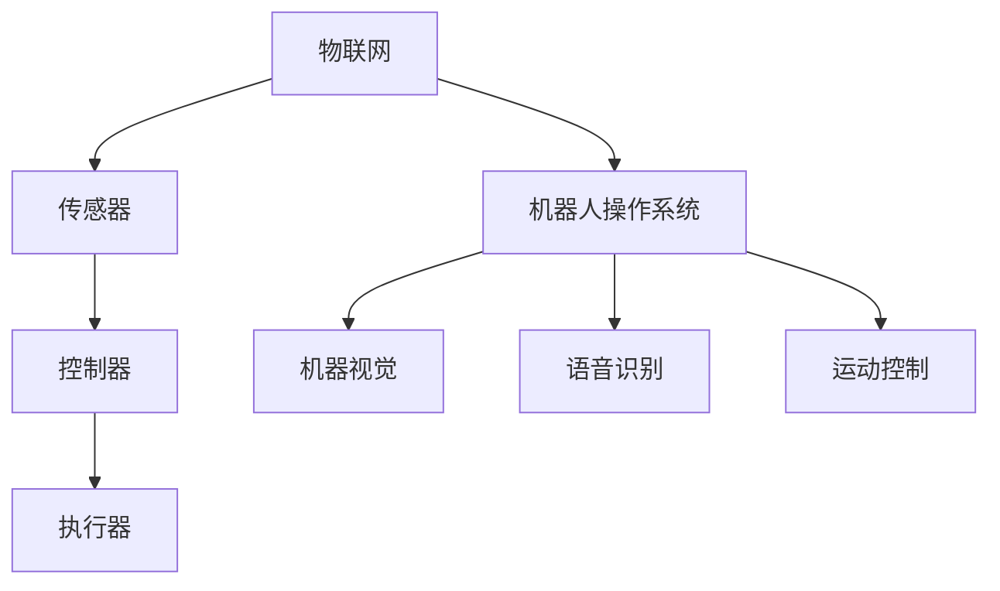

                 

关键词：树莓派、智能家居、机器人、物联网、编程、开源、创新、DIY

> 摘要：本文将探讨如何利用树莓派搭建智能家居和机器人项目，介绍核心概念、算法原理、数学模型、项目实践以及未来应用前景，旨在为科技爱好者提供有价值的参考。

## 1. 背景介绍

随着物联网技术的快速发展，智能家居和机器人领域迎来了前所未有的变革。树莓派（Raspberry Pi）作为一款低成本、高性能的单板计算机，已经成为许多DIY爱好者和开发者搭建创新项目的重要工具。本文将探讨如何利用树莓派实现智能家居和机器人项目，为读者提供灵感和实践指导。

### 1.1 智能家居的概念

智能家居是指通过互联网、物联网技术，将家庭设备连接起来，实现远程控制、自动化管理的一种生活方式。智能家居系统可以涵盖照明、安防、家电、环境监测等多个方面，提高家庭生活的舒适度和安全性。

### 1.2 机器人的概念

机器人是一种能够模拟人类行为、执行特定任务的智能机器。机器人在家庭、医疗、教育、工业等领域有着广泛的应用。在家庭场景中，机器人可以提供陪伴、娱乐、清洁、安防等服务。

### 1.3 树莓派的优势

树莓派具有以下优势：

- **低成本**：树莓派的成本相对较低，非常适合DIY项目。
- **高性能**：树莓派搭载ARM架构处理器，性能稳定。
- **开源**：树莓派基于Linux系统，支持多种编程语言和开源软件。
- **易于扩展**：树莓派拥有丰富的接口，可以连接各种传感器和执行器。

## 2. 核心概念与联系

### 2.1 智能家居核心概念

- **物联网（IoT）**：智能家居的基石，将各种设备通过网络连接起来。
- **传感器**：用于采集环境数据，如温度、湿度、光照、运动等。
- **执行器**：根据传感器数据执行特定任务，如开关灯光、调节温度等。
- **控制器**：负责协调传感器和执行器的操作，如树莓派。

### 2.2 机器人核心概念

- **机器人操作系统（ROS）**：用于机器人编程和控制的软件框架。
- **机器视觉**：通过摄像头采集图像，进行目标识别和追踪。
- **语音识别**：实现人机交互，理解用户的指令。
- **运动控制**：控制机器人的移动和姿态。

### 2.3 Mermaid 流程图



## 3. 核心算法原理 & 具体操作步骤

### 3.1 算法原理概述

智能家居和机器人项目涉及多个算法，包括数据采集与处理、路径规划、目标识别、语音识别等。以下是这些算法的原理概述：

- **数据采集与处理**：传感器采集环境数据，控制器对数据进行处理，以做出相应的决策。
- **路径规划**：机器人根据环境信息和目标位置，计算出最优路径。
- **目标识别**：通过图像处理和机器学习技术，识别和追踪特定目标。
- **语音识别**：将语音信号转换为文本，实现人机交互。

### 3.2 算法步骤详解

- **数据采集与处理**：
  1. 传感器采集数据。
  2. 数据预处理，如去噪、滤波等。
  3. 数据存储和传输。

- **路径规划**：
  1. 建立环境模型。
  2. 选择路径规划算法，如A*算法、Dijkstra算法等。
  3. 计算最优路径。
  4. 生成运动指令。

- **目标识别**：
  1. 图像预处理，如灰度化、二值化等。
  2. 特征提取，如边缘检测、角点检测等。
  3. 目标识别，如分类、回归等。
  4. 目标跟踪。

- **语音识别**：
  1. 语音信号预处理，如降噪、归一化等。
  2. 语音特征提取，如MFCC、PLP等。
  3. 语音识别，如基于隐马尔可夫模型（HMM）、深度神经网络（DNN）等。
  4. 文本生成。

### 3.3 算法优缺点

- **数据采集与处理**：
  - 优点：实时性强，适用于动态环境。
  - 缺点：数据量大，处理复杂。

- **路径规划**：
  - 优点：高效、准确。
  - 缺点：算法复杂度较高，对计算资源要求较高。

- **目标识别**：
  - 优点：适用于各种场景。
  - 缺点：对光照、遮挡等环境因素敏感。

- **语音识别**：
  - 优点：实现人机交互。
  - 缺点：对语音质量要求较高。

### 3.4 算法应用领域

- **数据采集与处理**：智能家居、环境监测、健康护理等。
- **路径规划**：无人机、自动驾驶、智能机器人等。
- **目标识别**：安防监控、智能家居、工业检测等。
- **语音识别**：智能音箱、智能助手、智能家居等。

## 4. 数学模型和公式 & 详细讲解 & 举例说明

### 4.1 数学模型构建

智能家居和机器人项目中的数学模型主要包括以下几种：

- **线性模型**：用于数据拟合和预测。
- **神经网络模型**：用于目标识别、语音识别等。
- **图模型**：用于路径规划。

### 4.2 公式推导过程

以线性模型为例，其公式推导过程如下：

$$y = \beta_0 + \beta_1 x_1 + \beta_2 x_2 + ... + \beta_n x_n$$

其中，$y$ 为目标变量，$x_1, x_2, ..., x_n$ 为自变量，$\beta_0, \beta_1, ..., \beta_n$ 为模型参数。

### 4.3 案例分析与讲解

以智能家居环境监测为例，我们可以使用线性模型来预测室内温度。假设我们已经采集了一定数量的室内温度数据，如下表所示：

| 时间 | 室内温度 |
| ---- | -------- |
| 0    | 24       |
| 1    | 23       |
| 2    | 24       |
| 3    | 22       |
| 4    | 25       |

我们首先对数据进行预处理，然后使用线性模型进行拟合。拟合结果如下：

$$y = 23.976 + 0.064x$$

其中，$y$ 为预测的室内温度，$x$ 为时间。

根据这个模型，我们可以预测未来一段时间内的室内温度。例如，当 $x=5$ 时，预测的室内温度为 $24.019$。

## 5. 项目实践：代码实例和详细解释说明

### 5.1 开发环境搭建

首先，我们需要搭建树莓派的开发环境。以下是搭建步骤：

1. 下载并安装Raspberry Pi操作系统。
2. 连接树莓派到网络。
3. 安装Python环境和相关库，如GPIO库、Paho MQTT库等。

### 5.2 源代码详细实现

以下是使用树莓派实现智能家居环境监测的代码示例：

```python
import RPi.GPIO as GPIO
import time
import paho.mqtt.client as mqtt

# 设置GPIO模式
GPIO.setmode(GPIO.BCM)
GPIO.setup(18, GPIO.OUT)

# 初始化MQTT客户端
client = mqtt.Client()
client.connect("mqtt.server.com", 1883, 60)

# 循环读取温度传感器数据并发布到MQTT服务器
while True:
    # 读取温度传感器数据
    temp_data = GPIO.input(18)
    temp_value = -40 + 0.01 * (temp_data - 512)
    
    # 发布温度数据到MQTT服务器
    client.publish("home/env/temp", temp_value)
    
    # 等待1秒
    time.sleep(1)
```

### 5.3 代码解读与分析

1. 导入所需的库。
2. 设置GPIO模式，并初始化MQTT客户端。
3. 进入循环，不断读取温度传感器数据，并将其转换为温度值。
4. 将温度值发布到MQTT服务器。
5. 等待1秒，继续读取下一组数据。

通过这个示例，我们可以看到如何使用树莓派读取温度传感器数据，并将其发布到MQTT服务器。这只是一个简单的例子，实际项目会涉及更多的传感器和功能。

### 5.4 运行结果展示

运行上述代码后，我们可以通过MQTT客户端订阅主题“home/env/temp”，实时获取树莓派采集的温度数据。

## 6. 实际应用场景

### 6.1 家庭安防

利用树莓派和摄像头，可以实现家庭安防监控系统。当有异常情况发生时，系统可以自动发送警报信息到用户手机。

### 6.2 智能家居控制

通过树莓派，我们可以实现对家庭电器的远程控制，如开关灯光、调节温度等，提高生活便利性。

### 6.3 健康护理

树莓派可以用于健康护理领域，如监测老年人的身体状况，及时发现异常情况，为家人提供关爱。

### 6.4 教育和娱乐

树莓派在教育和娱乐领域也有着广泛的应用，如搭建智能机器人、智能家居等，培养编程和创造力。

## 7. 工具和资源推荐

### 7.1 学习资源推荐

- 《Python编程：从入门到实践》
- 《树莓派从入门到实践》
- 《机器人技术基础》

### 7.2 开发工具推荐

- PyCharm
- Visual Studio Code
- GPIO库
- Paho MQTT库

### 7.3 相关论文推荐

- "智能家居系统设计与实现"
- "基于树莓派的智能家居控制系统"
- "智能家居中的机器学习应用"

## 8. 总结：未来发展趋势与挑战

### 8.1 研究成果总结

近年来，智能家居和机器人技术取得了显著的进展。树莓派等开源硬件的普及，为人们提供了丰富的创意和实践空间。人工智能、物联网、5G等技术的快速发展，也为智能家居和机器人领域带来了新的机遇。

### 8.2 未来发展趋势

- **智能化**：智能家居和机器人将更加智能化，具备更强的自主学习能力和决策能力。
- **个性化**：系统将更加关注用户需求，提供个性化的服务和体验。
- **集成化**：智能家居和机器人将实现更加紧密的集成，形成一个统一的生态系统。
- **普及化**：随着成本的降低和技术的普及，智能家居和机器人将走进千家万户。

### 8.3 面临的挑战

- **数据安全**：如何保护用户隐私，防止数据泄露，是智能家居和机器人面临的重要挑战。
- **功耗和续航**：如何在保证功能的同时，降低功耗，提高续航能力。
- **人机交互**：如何提供更加自然、便捷的人机交互方式。

### 8.4 研究展望

未来，智能家居和机器人技术将朝着智能化、个性化、集成化和普及化的方向发展。我们期待看到更多创新性的应用，为人们的生产和生活带来更多便利。

## 9. 附录：常见问题与解答

### 9.1 树莓派的购买渠道？

树莓派可以在官方网站购买，也可以在一些电商平台购买。

### 9.2 树莓派的操作系统如何选择？

树莓派支持多种操作系统，如Raspberry Pi OS、Ubuntu等。根据实际需求选择合适的操作系统。

### 9.3 树莓派的编程语言有哪些？

树莓派支持多种编程语言，如Python、C++、Java等。根据个人喜好和项目需求选择合适的编程语言。

### 9.4 如何避免树莓派的过热？

在树莓派的使用过程中，需要注意散热。可以在树莓派上安装散热片，并保持良好的通风。

## 结语

本文介绍了如何利用树莓派搭建智能家居和机器人项目，从核心概念、算法原理、数学模型、项目实践到未来应用前景进行了详细探讨。希望本文能为读者提供有价值的参考，激发创新思维，为智能家居和机器人领域的发展贡献力量。作者：禅与计算机程序设计艺术 / Zen and the Art of Computer Programming。

