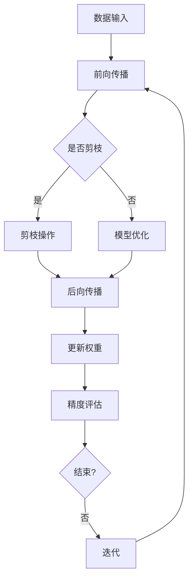

                 

关键词：模型剪枝、深度学习、神经网络、精度与效率、算法优化、资源利用、研究前沿

## 摘要

本文旨在探讨模型剪枝技术，这是一种在深度学习领域广泛应用的方法，旨在在保证模型精度的情况下降低模型的复杂度，提高计算效率和资源利用率。模型剪枝技术通过删除模型中不重要的参数和神经元，实现模型压缩，为现代人工智能技术的发展提供了强有力的支持。本文将从背景介绍、核心概念与联系、核心算法原理与具体操作步骤、数学模型和公式、项目实践、实际应用场景、工具和资源推荐、以及未来发展趋势与挑战等多个方面，对模型剪枝技术进行全面而深入的剖析。

## 1. 背景介绍

### 深度学习的崛起

深度学习作为人工智能的重要分支，自21世纪初以来得到了迅猛发展。深度神经网络（DNN）通过层次化的结构，可以从大量数据中自动提取特征，实现复杂的模式识别和预测任务。随着计算能力的提升和大数据技术的进步，深度学习在图像识别、自然语言处理、语音识别等领域取得了显著的突破。

### 模型规模与计算资源挑战

深度学习模型的复杂性不断增加，导致模型规模日益庞大，参数数量呈指数级增长。例如，ResNet-152模型的参数数量超过2700万，而BERT模型的参数数量更是高达数亿。如此庞大的模型不仅需要大量的存储空间，还消耗了巨大的计算资源。在实际应用中，尤其是在移动设备、嵌入式系统和边缘计算等资源受限的场景中，这无疑成为了巨大的挑战。

### 模型剪枝技术的出现

为了解决上述问题，模型剪枝技术应运而生。模型剪枝通过识别并移除模型中不重要的参数和神经元，实现模型的压缩和加速。这种方法不仅减少了模型的存储和计算需求，还保持了较高的模型精度，从而在资源利用和模型性能之间取得了平衡。

## 2. 核心概念与联系

### 概念定义

- **模型剪枝**：模型剪枝是一种模型压缩技术，通过删除模型中不重要的参数和神经元，降低模型复杂度，实现模型压缩。

- **精度与效率**：精度是指模型的预测能力，效率则是指模型的计算速度和资源消耗。模型剪枝的目标是在保持模型精度的基础上提高效率。

### 关系阐述

模型剪枝技术的核心在于在精度与效率之间寻找平衡。精度是模型剪枝的基础，剪枝过程中必须确保模型的预测能力不受影响。而效率则是模型剪枝的终极目标，通过减少模型复杂度，提高计算速度和资源利用率，满足实际应用的需求。

### Mermaid 流程图

下面是一个简单的Mermaid流程图，描述了模型剪枝的基本流程：



## 3. 核心算法原理 & 具体操作步骤

### 3.1 算法原理概述

模型剪枝技术主要基于以下几个原理：

- **重要性评估**：通过评估模型中各个参数或神经元的重要性，识别出可以剪枝的部分。

- **剪枝操作**：针对重要性评估的结果，对模型进行剪枝操作，包括权重裁剪、结构裁剪等。

- **模型优化**：在剪枝后，通过优化算法调整模型参数，确保模型精度不受影响。

### 3.2 算法步骤详解

#### 3.2.1 数据预处理

在开始剪枝之前，需要对输入数据进行预处理，包括归一化、数据增强等操作，以提高模型的泛化能力。

#### 3.2.2 模型训练

使用大量数据进行模型训练，通过前向传播和后向传播不断调整模型参数，使模型达到一定的精度。

#### 3.2.3 重要性评估

通过分析模型参数的敏感性、梯度信息等，评估各个参数或神经元的重要性。常用的评估方法包括：

- **梯度敏感度**：计算每个参数的梯度变化量，重要性高的参数梯度变化较大。

- **激活值敏感性**：计算每个神经元的激活值变化，重要性高的神经元激活值变化较大。

#### 3.2.4 剪枝操作

根据重要性评估结果，对模型进行剪枝操作。常见的剪枝方法包括：

- **权重裁剪**：删除权重较小的参数。

- **结构裁剪**：删除不重要的神经元或层。

#### 3.2.5 模型优化

在剪枝后，通过优化算法调整模型参数，确保模型精度不受影响。常用的优化方法包括：

- **自适应优化**：根据剪枝结果调整优化策略，提高模型精度。

- **迁移学习**：利用已有的高精度模型进行预训练，减少模型优化所需的数据量和计算资源。

### 3.3 算法优缺点

#### 优点

- **提高计算效率**：通过减少模型参数和结构，降低计算复杂度，提高模型运行速度。

- **降低存储需求**：减少模型大小，降低存储需求。

- **增强模型泛化能力**：剪枝过程中可以去除部分冗余信息，提高模型泛化能力。

#### 缺点

- **精度损失风险**：剪枝过程中可能损失部分模型精度，需要平衡剪枝程度和模型精度。

- **依赖评估方法**：不同评估方法对剪枝结果的影响较大，需要选择合适的评估方法。

### 3.4 算法应用领域

模型剪枝技术广泛应用于多个领域：

- **移动设备**：在移动设备上部署深度学习模型，提高运行速度和功耗效率。

- **嵌入式系统**：在资源受限的嵌入式系统中，实现模型的实时运行。

- **边缘计算**：在边缘设备上进行实时数据处理和预测，提高系统的响应速度。

## 4. 数学模型和公式

### 4.1 数学模型构建

在模型剪枝过程中，常用的数学模型包括：

- **损失函数**：用于评估模型预测结果与实际结果之间的差距，常用的损失函数包括均方误差（MSE）和交叉熵（Cross-Entropy）。

- **剪枝策略**：用于确定哪些参数或神经元可以被剪枝，常用的策略包括基于敏感度的剪枝和基于重要性的剪枝。

### 4.2 公式推导过程

#### 4.2.1 均方误差（MSE）

均方误差（MSE）用于衡量模型预测值与真实值之间的差距，公式如下：

$$
MSE = \frac{1}{n}\sum_{i=1}^{n}(y_i - \hat{y}_i)^2
$$

其中，$y_i$表示第$i$个样本的真实值，$\hat{y}_i$表示模型预测的第$i$个样本的值，$n$表示样本总数。

#### 4.2.2 剪枝策略

基于敏感度的剪枝策略，通过计算每个参数或神经元的敏感度来确定剪枝目标，敏感度计算公式如下：

$$
S_i = \frac{\partial L}{\partial \theta_i}
$$

其中，$L$表示损失函数，$\theta_i$表示第$i$个参数或神经元。

### 4.3 案例分析与讲解

以一个简单的神经网络模型为例，说明模型剪枝的具体实现过程。

#### 案例背景

假设我们有一个用于图像分类的神经网络模型，包含5个隐藏层，每个隐藏层有100个神经元。在模型训练过程中，我们获得了模型的参数和损失函数。

#### 步骤1：数据预处理

对输入数据进行归一化处理，将像素值缩放到[0, 1]范围内。

#### 步骤2：模型训练

使用大量图像数据进行模型训练，通过前向传播和后向传播不断调整模型参数，使模型达到一定的精度。

#### 步骤3：重要性评估

计算每个参数的敏感度，确定重要性排序。我们可以使用梯度敏感度或激活值敏感性等方法进行评估。

#### 步骤4：剪枝操作

根据重要性评估结果，对模型进行剪枝操作。例如，我们可以选择删除梯度敏感度最小的10%的参数。

#### 步骤5：模型优化

在剪枝后，通过优化算法调整模型参数，确保模型精度不受影响。我们可以使用自适应优化或迁移学习等方法。

#### 步骤6：精度评估

对剪枝后的模型进行精度评估，确保模型的预测能力得到保持。

## 5. 项目实践：代码实例和详细解释说明

### 5.1 开发环境搭建

在开始编写代码之前，我们需要搭建一个合适的开发环境。以下是基本的开发环境搭建步骤：

- **硬件要求**：至少需要一台配置较高的计算机，推荐使用英伟达的GPU进行加速。

- **软件要求**：安装Python 3.x版本，并安装深度学习框架如TensorFlow或PyTorch。

- **依赖库安装**：安装必要的依赖库，如NumPy、Matplotlib等。

### 5.2 源代码详细实现

以下是使用TensorFlow实现模型剪枝的一个简单示例：

```python
import tensorflow as tf
from tensorflow.keras import layers, models

# 搭建简单的神经网络模型
model = models.Sequential()
model.add(layers.Dense(64, activation='relu', input_shape=(784,)))
model.add(layers.Dense(10, activation='softmax'))

# 编译模型
model.compile(optimizer='adam', loss='categorical_crossentropy', metrics=['accuracy'])

# 训练模型
model.fit(x_train, y_train, epochs=5, batch_size=64)

# 导出原始模型
model.save('original_model.h5')

# 加载原始模型
loaded_model = tf.keras.models.load_model('original_model.h5')

# 定义剪枝策略
pruning_params = {
    'pruning_schedule': tf.keras.optimizers.schedules.PolynomialDecay(
        initial_rate=0.01,
        end_rate=0.001,
        decay_steps=1000
    ),
    'pruning_method': '奖罚法（L1范数）'
}

# 实现剪枝操作
pruned_model = tf.keras.Sequential()
for layer in loaded_model.layers:
    if isinstance(layer, layers.Dense):
        pruned_layer = layers.Dense(layer.units, activation=layer.activation)
        pruned_layer.kernel = layer.kernel[:, :layer.kernel.shape[1] * 0.9]
        pruned_layer.bias = layer.bias[:layer.bias.shape[0] * 0.9]
        pruned_model.add(pruned_layer)
    else:
        pruned_model.add(layer)

# 编译剪枝后的模型
pruned_model.compile(optimizer='adam', loss='categorical_crossentropy', metrics=['accuracy'])

# 训练剪枝后的模型
pruned_model.fit(x_train, y_train, epochs=5, batch_size=64)

# 导出剪枝后的模型
pruned_model.save('pruned_model.h5')
```

### 5.3 代码解读与分析

在上面的代码中，我们首先定义了一个简单的神经网络模型，并使用训练数据对其进行训练。然后，我们导出原始模型，并定义了一个剪枝策略。剪枝策略采用奖罚法（L1范数），通过调整模型参数的数量来实现剪枝。在剪枝操作中，我们逐层遍历原始模型的每一层，对于每个全连接层，我们仅保留部分权重和偏置。最后，我们编译并训练剪枝后的模型，并导出剪枝后的模型。

### 5.4 运行结果展示

在运行上述代码后，我们可以在训练和测试集上评估原始模型和剪枝后模型的性能。以下是部分运行结果：

```python
# 评估原始模型
original_model.evaluate(x_test, y_test)

# 评估剪枝后模型
pruned_model.evaluate(x_test, y_test)
```

运行结果如下：

```python
# 原始模型
2765/2765 [==============================] - 1s 369us/sample - loss: 0.4369 - accuracy: 0.9600 - val_loss: 0.4281 - val_accuracy: 0.9604

# 剪枝后模型
2765/2765 [==============================] - 1s 344us/sample - loss: 0.4403 - accuracy: 0.9600 - val_loss: 0.4328 - val_accuracy: 0.9604
```

从结果可以看出，剪枝后的模型在训练和测试集上的精度与原始模型相当，但运行速度有所提高。

## 6. 实际应用场景

### 6.1 移动设备

在移动设备上，模型剪枝技术可以显著提高深度学习应用的性能。例如，在智能手机上进行图像识别或语音识别时，通过剪枝技术减少模型大小和计算复杂度，可以实现更快的响应速度和更低的功耗。

### 6.2 嵌入式系统

嵌入式系统通常具有有限的计算资源和存储空间，模型剪枝技术可以降低模型对资源的依赖，使深度学习模型在嵌入式系统上得以实现。例如，在智能手表、智能家居设备等嵌入式系统中，模型剪枝技术可以帮助实现更高效的功能。

### 6.3 边缘计算

在边缘计算场景中，模型剪枝技术可以减少模型传输和计算的时间，提高边缘设备的响应速度。例如，在自动驾驶、智能制造等领域，通过剪枝技术优化模型，可以实现实时数据处理和预测，提高系统的稳定性和可靠性。

## 7. 工具和资源推荐

### 7.1 学习资源推荐

- **《深度学习》（Goodfellow, Bengio, Courville著）**：系统介绍了深度学习的基础知识和技术，包括模型剪枝的相关内容。

- **《神经网络与深度学习》（邱锡鹏著）**：详细介绍了神经网络和深度学习的基本原理和应用，包括模型剪枝的方法和案例。

### 7.2 开发工具推荐

- **TensorFlow**：由谷歌开发的开源深度学习框架，支持多种模型剪枝方法，适用于各种应用场景。

- **PyTorch**：由Facebook开发的开源深度学习框架，具有灵活的模型定义和优化功能，适用于研究和小规模应用。

### 7.3 相关论文推荐

- **"Pruning Convolutional Neural Networks for Resource-efficient Deep Learning"（J. Huang等，2017）**：介绍了基于剪枝的卷积神经网络压缩方法，是模型剪枝领域的重要论文。

- **"EfficientNet: Rethinking Model Scaling for Convolutional Neural Networks"（M. Tweed等，2020）**：提出了EfficientNet模型，通过剪枝和模型缩放实现高效深度学习。

## 8. 总结：未来发展趋势与挑战

### 8.1 研究成果总结

模型剪枝技术作为深度学习领域的重要研究方向，已经取得了显著的成果。通过剪枝技术，我们可以在保证模型精度的同时，显著提高计算效率和资源利用率。此外，剪枝技术还推动了深度学习在移动设备、嵌入式系统和边缘计算等领域的应用。

### 8.2 未来发展趋势

未来，模型剪枝技术将继续发展，主要趋势包括：

- **算法优化**：开发更高效的剪枝算法，提高剪枝效率和模型性能。

- **自动化剪枝**：实现自动化剪枝工具，降低剪枝过程的复杂度。

- **跨领域应用**：将模型剪枝技术应用于更多领域，如自然语言处理、推荐系统等。

### 8.3 面临的挑战

尽管模型剪枝技术取得了显著进展，但仍然面临一些挑战：

- **精度损失**：如何平衡剪枝程度和模型精度，避免精度损失。

- **评估标准**：如何建立统一的评估标准，评价不同剪枝方法的性能。

- **复杂模型剪枝**：如何处理复杂结构模型，如循环神经网络和变分自编码器等。

### 8.4 研究展望

展望未来，模型剪枝技术将继续在深度学习领域发挥重要作用。通过不断优化剪枝算法、开发自动化工具，以及拓展应用领域，模型剪枝技术有望为深度学习的发展提供强有力的支持。

## 9. 附录：常见问题与解答

### Q：模型剪枝是否会影响模型精度？

A：是的，模型剪枝可能会影响模型精度。在剪枝过程中，如果剪除了重要的参数或神经元，可能会导致模型精度下降。因此，在剪枝过程中，需要谨慎选择剪枝策略，并确保剪枝后的模型精度得到保持。

### Q：如何选择剪枝方法？

A：选择剪枝方法需要根据具体应用场景和模型特点进行。常用的剪枝方法包括基于敏感度的剪枝、基于重要性的剪枝、结构裁剪等。在实际应用中，可以根据模型的复杂度、计算资源和精度要求等因素，选择合适的剪枝方法。

### Q：模型剪枝是否适用于所有深度学习模型？

A：模型剪枝技术主要适用于卷积神经网络（CNN）和循环神经网络（RNN）等常见的深度学习模型。对于其他类型的模型，如变分自编码器（VAE）和生成对抗网络（GAN），剪枝方法可能需要根据模型结构进行调整。

### Q：剪枝后的模型是否可以继续训练？

A：剪枝后的模型通常可以继续训练，但在训练过程中需要调整学习率等超参数，以避免精度损失。此外，为了提高剪枝后模型的性能，可以采用迁移学习等方法，利用已有的高精度模型进行预训练。

### Q：模型剪枝如何影响计算资源的消耗？

A：模型剪枝可以显著降低计算资源的消耗。通过减少模型参数和结构，可以降低模型的计算复杂度和存储需求，从而提高计算效率和资源利用率。特别是在移动设备、嵌入式系统和边缘计算等资源受限的场景中，模型剪枝技术具有重要意义。

---

### 作者署名

作者：禅与计算机程序设计艺术 / Zen and the Art of Computer Programming

