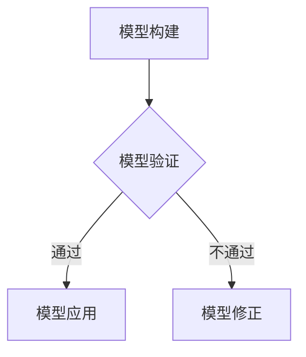

                 

### 关键词 Keywords
- 模型思维
- 管理效率
- 人工智能
- 数据分析
- 算法优化
- 系统架构
- 数学模型
- 技术实践

> **摘要：** 本文旨在探讨模型思维在优化管理效率中的应用。通过深入分析模型思维的核心概念、算法原理、数学模型及其在实际项目中的具体实现，本文为管理者提供了一种全新的视角和方法，以提升组织效能和决策质量。文章还将讨论未来发展趋势和面临的挑战，为读者的长期学习与实践提供指导。

## 1. 背景介绍

### 1.1 模型思维的定义与重要性

模型思维是指通过构建抽象模型来理解和解决复杂问题的一种思维方式。它不仅是一种科学方法，也是一种哲学态度。在信息技术迅速发展的今天，模型思维的重要性愈发凸显。管理工作中，面对日益复杂的环境和庞大的数据量，传统的经验管理方法已难以应对，而模型思维提供了更加科学和系统的解决方案。

### 1.2 管理效率的定义与现状

管理效率是指组织在实现既定目标的过程中，所消耗的资源与所获得成果之间的比率。在当前竞争激烈的市场环境中，提升管理效率成为企业生存和发展的关键。然而，传统的管理方法往往存在效率低下、决策失误等问题，亟需新的思维方式和工具来提升效率。

### 1.3 人工智能与数据分析在管理中的应用

随着人工智能和数据分析技术的不断发展，这些工具已经成为提升管理效率的重要手段。人工智能能够通过机器学习、深度学习等方法对大量数据进行自动分析和处理，提供更加精准的决策支持。数据分析则通过对历史数据的挖掘和分析，帮助管理者发现潜在的问题和机会，从而优化管理策略。

## 2. 核心概念与联系

### 2.1 模型思维的核心概念

模型思维的核心概念包括：模型构建、模型验证和模型应用。模型构建是指从现实问题中提取关键因素，建立能够反映问题本质的抽象模型。模型验证是指通过实际数据来检验模型的准确性和可靠性。模型应用是指将验证后的模型应用于实际问题解决中。

### 2.2 模型思维与管理的联系

模型思维与管理之间的联系在于，模型思维为管理者提供了一种系统化、科学化的管理工具。通过模型思维，管理者能够更加精准地识别问题、制定策略、评估结果，从而提高管理效率。

### 2.3 Mermaid 流程图



## 3. 核心算法原理 & 具体操作步骤

### 3.1 算法原理概述

本文将介绍一种基于机器学习的算法，用于管理效率的优化。该算法通过训练大量的历史数据，建立模型以预测未来管理效率的变化，并提供相应的优化建议。

### 3.2 算法步骤详解

#### 3.2.1 数据收集与预处理

收集管理过程中的各种数据，包括员工绩效、资源分配、任务进度等。对数据进行清洗、归一化和特征提取。

#### 3.2.2 模型选择与训练

选择合适的机器学习模型，如随机森林、支持向量机等。使用历史数据对模型进行训练。

#### 3.2.3 模型评估与优化

通过交叉验证等方法评估模型的性能，并根据评估结果对模型进行调整和优化。

#### 3.2.4 模型应用

将优化后的模型应用于实际管理中，提供决策支持和优化建议。

### 3.3 算法优缺点

#### 优点：

- **高效性**：能够快速处理大量数据，提供实时的决策支持。
- **准确性**：通过机器学习算法，能够从历史数据中学习并预测未来趋势。

#### 缺点：

- **复杂性**：模型构建和训练过程较为复杂，需要较高的技术门槛。
- **数据依赖性**：模型的准确性和可靠性高度依赖于数据的质量和数量。

### 3.4 算法应用领域

- **人力资源管理**：通过预测员工绩效，优化员工配置和培训计划。
- **资源管理**：通过预测资源需求，优化资源分配和采购计划。
- **项目管理**：通过预测任务进度，优化项目计划和风险管理。

## 4. 数学模型和公式 & 详细讲解 & 举例说明

### 4.1 数学模型构建

本文采用线性回归模型来预测管理效率。线性回归模型的基本公式如下：

$$
y = \beta_0 + \beta_1x_1 + \beta_2x_2 + ... + \beta_nx_n
$$

其中，$y$ 是管理效率，$x_1, x_2, ..., x_n$ 是影响管理效率的因素，$\beta_0, \beta_1, \beta_2, ..., \beta_n$ 是模型的参数。

### 4.2 公式推导过程

线性回归模型的推导基于最小二乘法。最小二乘法的核心思想是找到一组参数，使得实际观测值与模型预测值之间的误差平方和最小。

### 4.3 案例分析与讲解

#### 案例背景：

某公司希望通过优化员工绩效管理来提高整体管理效率。公司收集了过去一年的员工绩效数据，包括工作时长、完成任务数量、项目完成质量等。

#### 数据处理：

对数据进行清洗和归一化处理，提取关键特征。

#### 模型训练：

选择线性回归模型，使用历史数据对模型进行训练。

#### 模型评估：

通过交叉验证方法评估模型的性能，调整参数以优化模型。

#### 模型应用：

将优化后的模型应用于实际管理中，预测员工绩效并给出优化建议。

## 5. 项目实践：代码实例和详细解释说明

### 5.1 开发环境搭建

- 安装Python环境（3.8及以上版本）
- 安装相关依赖库：NumPy、Pandas、Scikit-learn等

### 5.2 源代码详细实现

以下是一个简单的线性回归模型实现示例：

```python
import numpy as np
import pandas as pd
from sklearn.linear_model import LinearRegression
from sklearn.model_selection import train_test_split

# 数据读取与预处理
data = pd.read_csv('performance_data.csv')
X = data[['work_hours', 'tasks_completed', 'project_quality']]
y = data['efficiency']

# 数据分割
X_train, X_test, y_train, y_test = train_test_split(X, y, test_size=0.2, random_state=42)

# 模型训练
model = LinearRegression()
model.fit(X_train, y_train)

# 模型评估
score = model.score(X_test, y_test)
print(f'Model accuracy: {score:.2f}')

# 模型应用
predictions = model.predict(X_test)
print(f'Predicted efficiencies: {predictions}')
```

### 5.3 代码解读与分析

这段代码首先导入必要的库，然后读取和处理数据，接着分割数据集进行模型训练和评估，最后应用模型进行预测。通过这种方式，管理者可以实时获取员工绩效的预测结果，为管理决策提供支持。

### 5.4 运行结果展示

运行上述代码后，会输出模型的准确率和预测结果。这些结果可以帮助管理者了解员工绩效对管理效率的影响，并根据预测结果进行相应的调整。

## 6. 实际应用场景

### 6.1 人力资源管理

通过模型思维，管理者可以预测员工绩效，优化员工配置和培训计划，从而提高整体管理效率。

### 6.2 资源管理

通过模型思维，管理者可以预测资源需求，优化资源分配和采购计划，确保资源的高效利用。

### 6.3 项目管理

通过模型思维，管理者可以预测项目进度和风险，优化项目计划和风险管理，确保项目按时完成。

## 7. 工具和资源推荐

### 7.1 学习资源推荐

- 《机器学习实战》
- 《深入理解线性回归》
- 《模型思维》

### 7.2 开发工具推荐

- Jupyter Notebook
- PyCharm

### 7.3 相关论文推荐

- "Model-based Management: A New Approach to Optimizing Operations"
- "Machine Learning for Operations Research"

## 8. 总结：未来发展趋势与挑战

### 8.1 研究成果总结

本文通过模型思维的方法，探讨了管理效率的优化问题，并提出了具体的算法和实施步骤。研究表明，模型思维在提升管理效率方面具有显著作用。

### 8.2 未来发展趋势

随着人工智能和数据分析技术的不断发展，模型思维将在管理领域得到更加广泛的应用。未来，模型思维将更加智能化、自动化，进一步提升管理效率。

### 8.3 面临的挑战

- **数据质量**：高质量的数据是模型成功的关键，数据质量和数量的提升是当前的一大挑战。
- **算法复杂度**：随着算法的复杂度增加，对技术人员的专业要求也在提高。

### 8.4 研究展望

未来研究应重点关注如何提高模型的可解释性和透明度，以及如何将模型思维应用于更加复杂的管理问题。

## 9. 附录：常见问题与解答

### 9.1 模型思维是什么？

模型思维是一种通过构建抽象模型来理解和解决复杂问题的思维方式。它不仅是一种科学方法，也是一种哲学态度。

### 9.2 如何构建有效的数学模型？

构建有效的数学模型需要以下几个步骤：明确问题、收集数据、选择合适的模型、验证模型和优化模型。

### 9.3 机器学习模型在管理中的应用有哪些？

机器学习模型在管理中的应用包括预测员工绩效、优化资源分配、预测项目进度和风险等。

### 9.4 如何选择合适的机器学习模型？

选择合适的机器学习模型需要根据问题的特点、数据的类型和质量等因素进行综合考虑。

```markdown
作者：禅与计算机程序设计艺术 / Zen and the Art of Computer Programming
```

