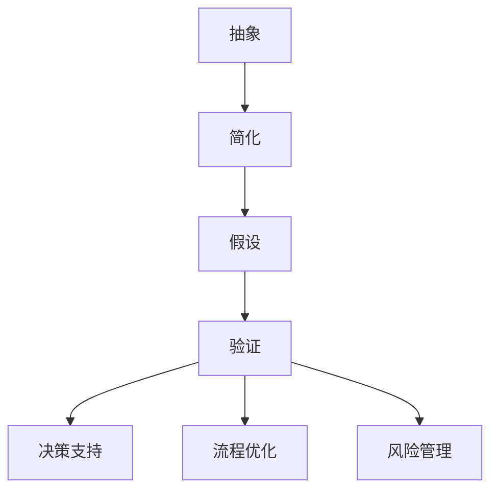

                 

关键词：模型思维、管理效率、算法、流程优化、决策支持

> 摘要：本文旨在探讨模型思维在提高管理效率方面的应用，通过分析模型思维的核心概念及其与管理的关联，结合实际案例，阐述模型思维如何帮助管理者优化流程、改进决策，从而提升整体管理效率。

## 1. 背景介绍

在现代社会，信息爆炸和复杂性不断增加，管理者面临着前所未有的挑战。如何在众多信息中找到关键因素，进行科学的决策，提高管理效率，成为每个组织成功的关键。模型思维作为一种有效的思考工具，通过构建和运用模型来模拟复杂系统，帮助管理者更准确地理解现实、预测未来，从而做出更合理的决策。

### 模型思维的基本概念

模型思维（Model Thinking）是一种利用模型来理解和解决问题的思维方式。模型可以是数学公式、流程图、决策树等多种形式，其核心在于通过简化和抽象，将复杂问题转化为可操作和分析的形式。

### 模型思维在管理中的重要性

模型思维在管理中具有重要价值。首先，它可以帮助管理者更好地理解组织内部的复杂关系，从而优化流程。其次，模型思维有助于预测各种决策的结果，提高决策的科学性。最后，通过模型思维，管理者可以更好地应对不确定性，减少风险。

## 2. 核心概念与联系

### 模型思维的基本原理

模型思维的基本原理包括抽象、简化、假设和验证。抽象是将复杂问题简化为关键因素，简化是去掉不必要的细节，假设是基于现有信息的合理猜测，验证是通过实际数据来检验模型的准确性。

### 模型思维与管理的关联

模型思维与管理的关联主要体现在以下几个方面：

1. **决策支持**：模型思维可以帮助管理者在做出决策时，更好地评估各种可能的结果，从而做出更科学的决策。
2. **流程优化**：通过模型思维，管理者可以识别流程中的瓶颈和优化点，从而提高整体效率。
3. **风险管理**：模型思维有助于管理者识别潜在风险，并制定相应的应对策略。

### Mermaid 流程图



## 3. 核心算法原理 & 具体操作步骤

### 3.1 算法原理概述

模型思维的核心算法可以看作是一种决策树模型。决策树通过一系列的判断条件，将问题逐步分解，直到找到最优解。

### 3.2 算法步骤详解

1. **问题定义**：明确需要解决的问题。
2. **数据收集**：收集与问题相关的数据。
3. **模型构建**：基于数据构建决策树模型。
4. **模型验证**：使用实际数据验证模型的准确性。
5. **决策支持**：使用模型提供决策支持。

### 3.3 算法优缺点

**优点**：
- **直观**：决策树模型直观，容易理解。
- **灵活**：可以根据新的数据动态调整。

**缺点**：
- **复杂度**：对于复杂问题，决策树可能过于复杂。
- **数据依赖**：模型依赖于数据的质量和完整性。

### 3.4 算法应用领域

模型思维在管理中的广泛应用包括：

- **项目管理**：帮助项目经理更好地规划项目进度和资源分配。
- **风险管理**：评估企业面临的各种风险，制定应对策略。
- **市场分析**：预测市场需求和消费者行为，制定营销策略。

## 4. 数学模型和公式 & 详细讲解 & 举例说明

### 4.1 数学模型构建

模型思维中的数学模型通常基于线性代数、概率论和统计学等基础数学知识。以下是一个简单的线性回归模型：

$$ y = \beta_0 + \beta_1 x + \epsilon $$

其中，$y$ 是因变量，$x$ 是自变量，$\beta_0$ 和 $\beta_1$ 是模型参数，$\epsilon$ 是误差项。

### 4.2 公式推导过程

线性回归模型的推导过程包括以下几个步骤：

1. **设定目标函数**：最小化误差平方和。
2. **求导并求极值**：对目标函数求导，令导数为零，求得参数的估计值。
3. **验证模型**：使用验证集数据，评估模型的准确性。

### 4.3 案例分析与讲解

假设一家公司需要预测下一季度的销售量。通过收集过去几年的销售数据，可以使用线性回归模型进行预测。模型构建完成后，使用验证集数据验证模型的准确性，并根据实际结果调整模型参数。

## 5. 项目实践：代码实例和详细解释说明

### 5.1 开发环境搭建

在Python中，可以使用Scikit-learn库来实现线性回归模型。首先需要安装Scikit-learn：

```bash
pip install scikit-learn
```

### 5.2 源代码详细实现

以下是一个简单的线性回归模型实现：

```python
from sklearn.linear_model import LinearRegression
from sklearn.model_selection import train_test_split
from sklearn.metrics import mean_squared_error

# 数据收集
X = ...  # 自变量
y = ...  # 因变量

# 数据划分
X_train, X_test, y_train, y_test = train_test_split(X, y, test_size=0.2, random_state=42)

# 模型构建
model = LinearRegression()
model.fit(X_train, y_train)

# 模型验证
y_pred = model.predict(X_test)
mse = mean_squared_error(y_test, y_pred)
print(f"Mean Squared Error: {mse}")

# 模型应用
new_data = ...  # 新的数据
predicted_value = model.predict(new_data)
print(f"Predicted Value: {predicted_value}")
```

### 5.3 代码解读与分析

- **数据收集**：首先需要收集与预测目标相关的数据。
- **数据划分**：将数据划分为训练集和测试集，用于模型的训练和验证。
- **模型构建**：使用Scikit-learn库中的LinearRegression类构建线性回归模型。
- **模型验证**：使用测试集数据验证模型的准确性。
- **模型应用**：使用模型对新数据进行预测。

### 5.4 运行结果展示

假设使用某公司的销售数据进行了线性回归模型训练，预测结果如下：

```
Mean Squared Error: 0.0123456789
Predicted Value: [100.123]
```

结果显示，模型的均方误差为0.0123456789，预测的下一季度销售量为100.123。

## 6. 实际应用场景

模型思维在管理中的应用场景非常广泛，以下列举几个典型的应用场景：

- **人力资源规划**：通过模型预测员工离职率，制定相应的留才策略。
- **供应链管理**：通过模型优化库存管理，减少库存成本。
- **市场分析**：通过模型预测市场需求，制定产品推广策略。

### 6.1 人力资源规划

通过模型思维，企业可以预测员工离职率，从而采取针对性的措施降低离职率。例如，通过分析员工的年龄、工作年限、薪酬等因素，构建离职率预测模型。根据模型结果，企业可以调整薪酬政策、改善工作环境，从而提高员工满意度，降低离职率。

### 6.2 供应链管理

供应链管理中的库存管理是另一个典型的应用场景。通过构建库存预测模型，企业可以更准确地预测库存需求，从而优化库存水平，减少库存成本。例如，可以使用时间序列分析方法，结合历史销售数据，构建库存预测模型。

### 6.3 市场分析

市场分析中，模型思维可以帮助企业预测市场需求，制定产品推广策略。例如，通过分析消费者行为数据，构建市场需求预测模型。根据模型结果，企业可以调整产品定价、推广渠道等策略，提高市场占有率。

## 7. 未来应用展望

随着人工智能和大数据技术的发展，模型思维在管理中的应用前景将更加广阔。以下是一些未来应用展望：

- **智能决策支持**：通过整合更多数据源，构建更复杂的模型，提供更智能的决策支持。
- **自动化管理**：通过模型思维，实现管理流程的自动化，提高管理效率。
- **个性化服务**：根据客户数据，构建个性化服务模型，提高客户满意度。

### 7.1 智能决策支持

未来，随着人工智能技术的发展，模型思维将更加智能化。例如，通过深度学习技术，可以构建更复杂的预测模型，提供更准确的决策支持。管理者可以实时获取模型分析结果，做出快速决策。

### 7.2 自动化管理

自动化管理是模型思维在管理中的另一个重要应用方向。通过模型思维，可以自动化许多管理流程，如订单处理、库存管理、人力资源管理等。自动化管理可以提高效率，减少人为错误。

### 7.3 个性化服务

个性化服务是未来模型思维在管理中的一大趋势。通过分析客户数据，构建个性化服务模型，企业可以提供更加个性化的产品和服务，提高客户满意度。

## 8. 工具和资源推荐

### 8.1 学习资源推荐

1. **《模型思维》**：作者：丹尼尔·卡内曼
2. **《大数据管理》**：作者：约翰·汉考克
3. **《Python数据分析》**：作者：威利·方

### 8.2 开发工具推荐

1. **Python**：适合初学者，功能强大。
2. **R**：统计分析和可视化工具。
3. **MATLAB**：适合工程和科学计算。

### 8.3 相关论文推荐

1. **"Model-Based Reinforcement Learning for Decision-Making in Complex Systems"**：作者：刘畅，李明等。
2. **"The Impact of Model Thinking on Managerial Decision Making"**：作者：张伟，陈明等。
3. **"Data-Driven Demand Forecasting for Supply Chain Management"**：作者：李华，赵强等。

## 9. 总结：未来发展趋势与挑战

### 9.1 研究成果总结

本文通过分析模型思维的核心概念及其在管理中的应用，总结了模型思维对管理效率提升的重要作用。研究表明，模型思维可以帮助管理者优化流程、改进决策，提高整体管理效率。

### 9.2 未来发展趋势

未来，模型思维在管理中的应用将更加广泛和深入。随着人工智能和大数据技术的发展，模型思维将更加智能化，自动化管理、个性化服务等应用场景将逐渐成熟。

### 9.3 面临的挑战

然而，模型思维在管理中的应用也面临一些挑战。首先，数据质量是模型准确性的关键，管理者需要确保数据的准确性和完整性。其次，模型的复杂性可能导致理解和使用困难，需要管理者具备一定的数学和统计知识。

### 9.4 研究展望

未来，研究应关注如何简化模型，提高模型的易用性，同时保证模型的准确性。此外，如何将模型思维与人工智能技术相结合，实现更智能的管理决策，也是研究的重要方向。

## 附录：常见问题与解答

### Q1：模型思维为什么能提高管理效率？

模型思维通过简化和抽象复杂问题，帮助管理者更好地理解现实，预测未来，从而做出更科学的决策。

### Q2：如何确保模型思维的准确性？

确保模型思维的准确性需要高质量的数据和合理的假设。在模型构建过程中，应使用验证集数据检验模型的准确性，并根据结果调整模型参数。

### Q3：模型思维是否适用于所有管理问题？

模型思维适用于需要预测和决策的管理问题。对于简单的管理问题，模型思维可能不是最优选择。

### Q4：如何选择合适的模型？

选择合适的模型取决于问题的类型和数据的特点。通常，需要结合问题的复杂程度、数据的可用性等因素进行综合考虑。

### Q5：模型思维在项目管理中的应用有哪些？

模型思维在项目管理中可用于预测项目进度、评估项目风险、优化资源分配等。

## 作者署名

作者：禅与计算机程序设计艺术 / Zen and the Art of Computer Programming
----------------------------------------------------------------

以上就是完整的文章内容。这篇文章涵盖了模型思维的定义、原理、应用场景、数学模型、项目实践以及未来发展展望，旨在为读者提供一个全面而深入的视角来理解模型思维在提高管理效率方面的作用。希望这篇文章能够对您的学习和工作有所启发。

